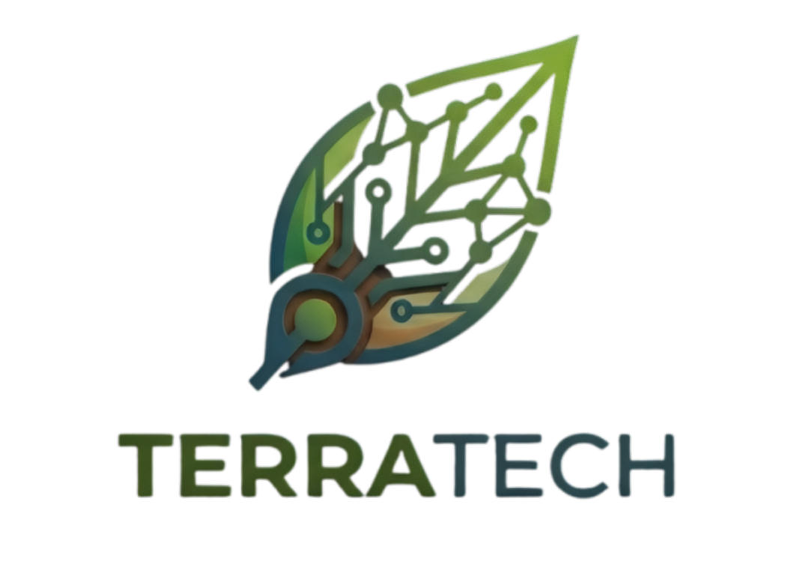
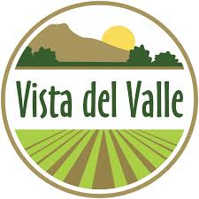
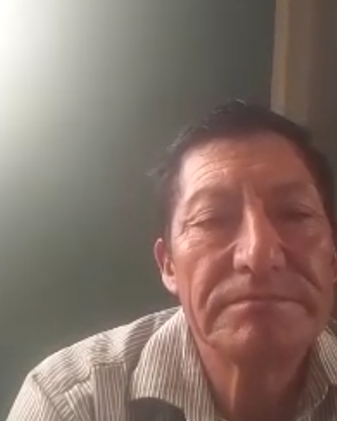

# Informe de Trabajo Final

**Universidad Peruana de Ciencias Aplicadas**

**Carrera de Ingeniería de Software**

**1ACC0238 — Aplicaciones para Dispositivos Móviles**

**NRC: 13975**

**Docente:** Por completar

**Equipo:** NovaTech

**Proyecto:** TerraTech

**Integrantes**

| Código | Apellidos y nombres |
| --- | --- |
| Por completar | Por completar |

**Periodo: 202620**

**Mes y año:** Por completar

Incorporar el logo de la universidad y completar la relación de integrantes en orden alfabético por apellido, siguiendo la plantilla de carátula.

## Registro de Versiones del Informe

| Versión | Fecha | Autor | Descripción de modificación |
| --- | --- | --- | --- |
| Por completar | Por completar | Por completar | Por completar |

Completar el registro con las modificaciones realizadas al informe en cada entrega.

## Project Report Collaboration Insights

**Repositorio del informe:** [TerraTech Project Report](https://github.com/AppMovil-Dato/terratech-project-report)

### AV1

Describir la organización del trabajo e incluir capturas de los commits y analíticos de colaboración en GitHub. Relacionar las contribuciones con el registro de versiones.

| Integrante | Usuario de GitHub | Actividades realizadas | Commits | Evidencia |
| --- | --- | --- | --- | --- |
| Por completar | Por completar | Por completar | Por completar | Por completar |

Ampliar esta sección en TB1, AV2 y TB2.

## Contenido

- [Registro de Versiones del Informe](#registro-de-versiones-del-informe)
- [Project Report Collaboration Insights](#project-report-collaboration-insights)
  - [AV1](#av1)
- [Student Outcome](#student-outcome)
- [Objetivos SMART](#objetivos-smart)
- [Capítulo I: Presentación](#capítulo-i-presentación)
  - [1.1. Startup Profile](#11-startup-profile)
    - [1.1.1. Descripción de la Startup](#111-descripción-de-la-startup)
    - [1.1.2. Perfiles de integrantes del equipo](#112-perfiles-de-integrantes-del-equipo)
  - [1.2. Solution Profile](#12-solution-profile)
    - [1.2.1. Antecedentes y problemática](#121-antecedentes-y-problemática)
    - [1.2.2. Lean UX Process](#122-lean-ux-process)
  - [1.3. Segmentos objetivo](#13-segmentos-objetivo)
- [Capítulo II: Requirements Development and Software Solution Design](#capítulo-ii-requirements-development-and-software-solution-design)
  - [2.1. Competidores](#21-competidores)
    - [2.1.1. Análisis competitivo](#211-análisis-competitivo)
    - [2.1.2. Estrategias y tácticas frente a competidores](#212-estrategias-y-tácticas-frente-a-competidores)
  - [2.2. Entrevistas](#22-entrevistas)
    - [2.2.1. Diseño de entrevistas](#221-diseño-de-entrevistas)
    - [2.2.2. Registro de entrevistas](#222-registro-de-entrevistas)
    - [2.2.3. Análisis de entrevistas](#223-análisis-de-entrevistas)
  - [2.3. Needfinding](#23-needfinding)
    - [2.3.1. User Personas](#231-user-personas)
    - [2.3.2. User Task Matrix](#232-user-task-matrix)
    - [2.3.3. User Journey Mapping](#233-user-journey-mapping)
    - [2.3.4. Empathy Mapping](#234-empathy-mapping)
    - [2.3.5. Big Picture EventStorming](#235-big-picture-eventstorming)
    - [2.3.6. Ubiquitous Language](#236-ubiquitous-language)
  - [2.4. Requirements specification](#24-requirements-specification)
    - [2.4.1. User Stories](#241-user-stories)
    - [2.4.2. Impact Mapping](#242-impact-mapping)
    - [2.4.3. Product Backlog](#243-product-backlog)
  - [2.5. Strategic-Level Domain-Driven Design](#25-strategic-level-domain-driven-design)
    - [2.5.1. EventStorming](#251-eventstorming)
    - [2.5.2. Context Mapping](#252-context-mapping)
    - [2.5.3. Software Architecture](#253-software-architecture)
  - [2.6. Tactical-Level Domain-Driven Design](#26-tactical-level-domain-driven-design)
    - [2.6.x. Bounded Context: [Nombre por completar]](#26x-bounded-context-nombre-por-completar)
- [Capítulo III: Solution UI/UX Design](#capítulo-iii-solution-uiux-design)
  - [3.1. Product design](#31-product-design)
    - [3.1.1. Style Guidelines](#311-style-guidelines)
    - [3.1.2. Information Architecture](#312-information-architecture)
    - [3.1.3. Landing Page UI Design](#313-landing-page-ui-design)
    - [3.1.4. Mobile Applications UX/UI Design](#314-mobile-applications-uxui-design)
- [Capítulo IV: Product Implementation & Validation](#capítulo-iv-product-implementation--validation)
  - [4.1. Software Configuration Management](#41-software-configuration-management)
    - [4.1.1. Software Development Environment Configuration](#411-software-development-environment-configuration)
    - [4.1.2. Source Code Management](#412-source-code-management)
    - [4.1.3. Source Code Style Guide & Conventions](#413-source-code-style-guide--conventions)
    - [4.1.4. Software Deployment Configuration](#414-software-deployment-configuration)
  - [4.2. Landing Page & Mobile Application Implementation](#42-landing-page--mobile-application-implementation)
    - [4.2.x. Sprint n](#42x-sprint-n)
  - [4.3. Validation Interviews](#43-validation-interviews)
    - [4.3.1. Diseño de Entrevistas](#431-diseño-de-entrevistas)
    - [4.3.2. Registro de Entrevistas](#432-registro-de-entrevistas)
    - [4.3.3. Evaluaciones según heurísticas](#433-evaluaciones-según-heurísticas)
- [Conclusiones](#conclusiones)
  - [Conclusiones y recomendaciones](#conclusiones-y-recomendaciones)
  - [Video App Validation](#video-app-validation)
  - [Video About-the-Product](#video-about-the-product)
  - [Video About-the-Team](#video-about-the-team)
- [Glosario](#glosario)
- [Bibliografía](#bibliografía)
  - [Dominio de negocio](#dominio-de-negocio)
  - [Métodos y técnicas de ingeniería de software](#métodos-y-técnicas-de-ingeniería-de-software)
  - [Lenguajes, frameworks y herramientas](#lenguajes-frameworks-y-herramientas)
- [Anexos](#anexos)
  - [Anexo A. Videos de Exposiciones](#anexo-a-videos-de-exposiciones)
  - [Anexo B. Artefactos complementarios](#anexo-b-artefactos-complementarios)

## Student Outcome

**ABET - EAC - Student Outcome 7**

**Criterio:** La capacidad de adquirir y aplicar nuevos conocimientos según sea necesario, utilizando estrategias de aprendizaje apropiadas.

En el siguiente cuadro se describe las acciones realizadas y enunciados de conclusiones por parte del grupo, que permiten sustentar el haber alcanzado el logro del ABET – EAC - Student Outcome 7.

| Criterio específico | Acciones realizadas | Conclusiones |
| --- | --- | --- |
| Actualiza conceptos y conocimientos necesarios para su desarrollo profesional y en especial para su proyecto en soluciones de software. | Completar por integrante: apellidos, nombres, entrega, acciones y evidencias de aprendizaje y aplicación. | Completar la conclusión grupal correspondiente. |
| Reconoce la necesidad del aprendizaje permanente para el desempeño profesional y el desarrollo de proyectos en soluciones de software. | Completar por integrante: apellidos, nombres, entrega, acciones y evidencias de aprendizaje permanente. | Completar la conclusión grupal correspondiente. |

Ampliar las acciones y conclusiones en cada entrega.

## Objetivos SMART

Formular al menos dos objetivos por integrante, centrados en su desarrollo profesional después de graduarse.

| Integrante | Objetivo | Específico | Medible | Alcanzable | Relevante | Plazo |
| --- | --- | --- | --- | --- | --- | --- |
| Por completar | Objetivo 1 | Por completar | Por completar | Por completar | Por completar | Por completar |
| Por completar | Objetivo 2 | Por completar | Por completar | Por completar | Por completar | Por completar |

## Capítulo I: Presentación

### 1.1. Startup Profile

#### 1.1.1. Descripción de la Startup

Completar la descripción de NovaTech, su propósito, misión, visión y propuesta de valor relacionada con TerraTech.

#### 1.1.2. Perfiles de integrantes del equipo

Completar una ficha por integrante:

| Campo | Información |
| --- | --- |
| Foto | Incorporar fotografía |
| Apellidos y nombres | Por completar |
| Código de estudiante | Por completar |
| Carrera | Por completar |
| Descripción personal | Por completar |
| Conocimientos técnicos | Por completar |
| Habilidades y aporte al equipo | Por completar |

### 1.2. Solution Profile

#### 1.2.1. Antecedentes y problemática

Describir los antecedentes de TerraTech y la problemática agrícola que atenderá la solución móvil. Sustentar el problema, los objetivos y las restricciones que delimitan el alcance.

Aplicar la técnica 5W + 2H:

| Pregunta | Aspecto que debe desarrollarse | Respuesta y fuente |
| --- | --- | --- |
| Who | Personas afectadas y responsables de las tareas del campo | Por completar |
| What | Problema concreto que enfrenta el usuario | Por completar |
| Where | Ubicación y entorno en que ocurre | Por completar |
| When | Momento y frecuencia del problema | Por completar |
| Why | Causas y consecuencias | Por completar |
| How | Proceso actual y herramientas utilizadas | Por completar |
| How much | Magnitud del problema, tiempo o costo | Por completar |

Definir las capacidades que se conservarán o adaptarán de TerraTech para la experiencia móvil. Precisar la relación entre monitoreo de campos, dispositivos, reportes y las necesidades de los segmentos seleccionados.

En el alcance considerar aplicación nativa y multiplataforma, almacenamiento local, acceso a un recurso interno del dispositivo, API REST propia, integración con un servicio externo y landing page. Incluir una funcionalidad que requiera investigar y aplicar una tecnología, biblioteca o servicio no utilizado en clase, justificando su selección y documentando el aprendizaje.

#### 1.2.2. Lean UX Process

##### 1.2.2.1. Lean UX Problem Statements

Redactar un Problem Statement para todo el proyecto utilizando la plantilla Brand new initiative. Considerar todos los segmentos, el estado actual del dominio, las necesidades no atendidas por otras soluciones, la estrategia propuesta, el segmento inicial y los comportamientos medibles que indicarán éxito.

##### 1.2.2.2. Lean UX Assumptions

Enumerar varios supuestos por cada uno de los cinco tipos:

| ID | Tipo | Supuesto |
| --- | --- | --- |
| BA-01 | Business Assumptions | Completar creencias sobre mercado, viabilidad y monetización. |
| BOA-01 | Business Outcome Assumptions | Completar resultados medibles esperados para el negocio. |
| UA-01 | User Assumptions | Completar creencias sobre perfiles y segmentos. |
| UOA-01 | User Outcome and Benefit Assumptions | Completar objetivos y beneficios esperados por los usuarios. |
| FA-01 | Feature Assumptions | Completar funcionalidades propuestas para atender esas necesidades. |

##### 1.2.2.3. Lean UX Hypothesis Statements

Elaborar una hipótesis por cada Feature Assumption, relacionando resultado del negocio, usuarios, beneficio y funcionalidad.

> Creemos que lograremos [resultado del negocio] si [personas] alcanzan [beneficio o resultado del usuario] con [funcionalidad o solución].

| ID | Feature Assumption | Hipótesis | Criterio de éxito |
| --- | --- | --- | --- |
| H-01 | FA-01 | Por completar | Por completar |

##### 1.2.2.4. Lean UX Canvas

Incluir el Lean UX Canvas y explicar la relación entre problema, resultados del negocio, usuarios, beneficios, soluciones, hipótesis y experimentos.

### 1.3. Segmentos objetivo

Describir cada segmento, sus características demográficas, necesidades y contexto de uso de dispositivos móviles. Incorporar estadísticas y fuentes de sustento.

| ID | Segmento | Características | Necesidades | Contexto de uso | Sustento estadístico |
| --- | --- | --- | --- | --- | --- |
| SEG-01 | Por completar | Por completar | Por completar | Por completar | Por completar |

## Capítulo II: Requirements Development and Software Solution Design

### 2.1. Competidores

* **Agrotech (competidor directo):** Es una empresa enfocada en la implementación de tecnología agrícola que ofrece soluciones como drones, sensores y asesoría técnica especializada para mejorar la productividad del campo. Está orientada a agricultores y empresas agroindustriales que buscan optimizar sus procesos mediante el uso de herramientas tecnológicas.

* **AgroVista del Valle (competidor directo):** Es una empresa de servicios agrícolas que utiliza análisis multiespectral para el monitoreo de cultivos, permitiendo evaluar la salud de las plantas y detectar problemas en el terreno. Está dirigida a agricultores y empresas agroexportadoras que buscan tomar decisiones basadas en datos para mejorar la eficiencia y productividad.

* **Phytech (competidor directo):** Es una plataforma digital de agricultura de precisión que integra sensores IoT, análisis de datos e inteligencia artificial para optimizar el riego y mejorar el rendimiento de los cultivos. Está orientada principalmente a empresas agroindustriales y grandes productores que buscan maximizar la eficiencia en el uso del agua y recursos.

#### 2.1.1. Análisis competitivo

Para este análisis competitivo se realizó un benchmark enfocado en identificar las principales soluciones de agricultura de precisión en el mercado peruano e internacional. La evaluación consideró tres competidores directos: **Agrotech** (solución local con enfoque en drones y asesoría técnica), **AgroVista del Valle** (servicios agrícolas basados en análisis multiespectral) y **Phytech** (plataforma internacional con sensores IoT e inteligencia artificial). 

El objetivo del **Competitive Analysis Landscape** es evaluar el perfil de producto, marketing y FODA de estos competidores para identificar oportunidades clave de diferenciación para **TerraTech**, especialmente en accesibilidad económica, experiencia móvil optimizada para trabajo en campo, soporte para zonas con baja o nula conectividad mediante almacenamiento local y monitoreo continuo del suelo en tiempo real.

| Dimensión | TerraTech (Nuestra Startup) | Agrotech | AgroVista del Valle | Phytech |
| --- | --- | --- | --- | --- |
| **Logo** |  |  |  |  |
| **Overview** | Solución móvil conectada a sensores IoT de bajo costo que permite monitorear en tiempo real la humedad y nutrientes del suelo desde smartphones, generando alertas preventivas y análisis predictivo adaptado a las condiciones del campo peruano. | Empresa que implementa tecnología agrícola mediante el uso de drones, sensores y asesoría técnica especializada presencial para optimizar la productividad de los cultivos. | Empresa de servicios agrícolas que utiliza análisis multiespectral e imágenes satelitales/aéreas para monitorear la salud vegetal y evaluar las condiciones del terreno. | Plataforma digital internacional de agricultura de precisión que integra sensores IoT e inteligencia artificial para optimizar el riego y el rendimiento de cultivos a gran escala. |
| **Ventaja competitiva y valor ofrecido** | Monitoreo continuo del suelo en tiempo real con latencia mínima, alertas push inmediatas, funcionamiento offline en la app móvil con sincronización posterior, interfaz simplificada para baja alfabetización digital y costos altamente accesibles para pequeños y medianos agricultores. | Soluciones integrales de hardware de alta gama (drones) y acompañamiento técnico presencial especializado. | Alta precisión en el análisis científico de imágenes multiespectrales para la detección temprana de anomalías en grandes extensiones. | Algoritmos avanzados de IA para la automatización de decisiones de riego a nivel empresarial con soporte global. |
| **Mercado objetivo** | Pequeños y medianos agricultores peruanos, cooperativas agrarias, asesores/proveedores de insumos y compradores interesados en trazabilidad. | Medianos y grandes productores agrícolas y empresas agroindustriales. | Agricultores medianos, empresas agroexportadoras y agroindustrias con capacidad de inversión técnica. | Grandes empresas agroindustriales y agroexportadoras multinacionales. |
| **Estrategias de marketing** | Alianzas con cooperativas agrarias locales, demostraciones prácticas en campo (pilotos), difusión digital y enfoque en sostenibilidad y retorno de inversión rápido. | Ventas directas B2B, demostraciones presenciales y participación en ferias y eventos del sector agroindustrial. | Servicios especializados B2B, networking corporativo y promoción técnica basada en casos de estudio. | Marketing B2B corporativo de alto nivel, posicionamiento premium internacional y publicaciones científicas. |
| **Productos y servicios** | Sensores IoT de suelo, aplicación móvil (Android/iOS) con soporte offline, alertas climáticas/riego, dashboard de fertilidad y trazabilidad por código QR. | Venta y alquiler de drones agrícolas, sensores de campo y consultoría técnica agronómica personalizada. | Servicios de teledetección multiespectral, diagnósticos de vigor vegetal (NDVI) y reportes agronómicos periódicos. | Sensores IoT propietarios en planta/suelo, plataforma analítica con IA, módulos de automatización de riego y soporte corporativo. |
| **Precios y costos** | Kit de sensores accesible (< S/ 300) y modelo de suscripción mensual flexible (S/ 30 - S/ 50 por usuario/mes). | Costos elevados debido a la inversión en aeronaves no tripuladas y horas de consultoría especializada. | Tarifas medias a altas por hectárea o por vuelo de teledetección programado. | Costos muy elevados con suscripciones anuales empresariales (> US$ 500 / ha / año). |
| **Canales de distribución** | Aplicación móvil en tiendas digitales (Google Play Store / App Store), landing page web informativa y venta directa de sensores. | Canal corporativo web, visitas comerciales directas y distribuidores autorizados de drones. | Plataforma web de consulta de reportes y contacto comercial directo. | Aplicación móvil y web corporativa con despliegue empresarial asistido. |
| **Fortalezas** | Experiencia de usuario móvil diseñada para entornos rurales, bajo costo, soporte offline, alertas en tiempo real y adaptación local. | Tecnología de vanguardia (drones), personal técnico calificado y reconocimiento institucional. | Métricas visuales de alta precisión para macro-lotes y análisis científico riguroso. | Inteligencia artificial madura, infraestructura IoT robusta y respaldo financiero internacional. |
| **Debilidades** | Dependencia de penetración de smartphones en zonas rurales y posicionamiento de marca en fase inicial. | Barrera de entrada por precios altos y dependencia de operadores especializados para el vuelo de drones. | No ofrece monitoreo continuo en tiempo real (depende de la frecuencia de captura aérea/satelital). | Costos prohibitivos para pequeños productores y escasa adaptación a la realidad agrícola andina/costera local. |
| **Oportunidades** | Masificación de smartphones y redes de conectividad rural (LoRaWAN/4G), e interés creciente en optimización de recursos hídricos. | Creciente adopción de servicios tecnológicos por empresas agroexportadoras. | Creciente demanda de certificaciones de sanidad vegetal para exportación. | Crecimiento global del mercado de agricultura de precisión e IoT. |
| **Amenazas** | Resistencia al cambio tecnológico en zonas tradicionales y variabilidad de cobertura móvil en el campo. | Aparición de soluciones de teledetección satelital gratuitas o de bajo costo. | Entrada de sensores IoT económicos que reduzcan la necesidad de vuelos recurrentes. | Competidores locales emergentes con soluciones móviles de bajo costo. |

#### 2.1.2. Estrategias y tácticas frente a competidores

A partir del análisis de las fortalezas y debilidades de los competidores, se establecen las siguientes estrategias y tácticas para posicionar a **TerraTech** como la solución móvil líder en agricultura accesible:

| Hallazgo | Estrategia | Táctica |
| --- | --- | --- |
| **Altos costos de competidores (Phytech > US$ 500/ha; Agrotech con drones costosos)** | Diferenciación por accesibilidad económica y bajo costo de adopción. | Ofrecer kits de sensores IoT a precio de penetración (< S/ 300) junto con una aplicación móvil accesible bajo suscripción flexible (S/ 30 - S/ 50 mensuales), eliminando costos de consultoría externa. |
| **Falta de monitoreo continuo en competidores basados en vuelos periódicos (AgroVista del Valle)** | Posicionamiento en monitoreo continuo del suelo en tiempo real directo al smartphone. | Enviar lecturas de humedad y nutrientes cada 5 minutos directo a la app móvil, permitiendo tomar decisiones inmediatas de riego y fertilización antes de que se produzca estrés hídrico. |
| **Baja alfabetización digital y desconfianza del agricultor rural ante software complejo** | Experiencia de usuario móvil simplificada e inclusiva con asistencia guiada. | Diseñar la aplicación móvil con tipografía legible (mínimo 16px), íconos de alto contraste, semáforos visuales (rojo/amarillo/verde), sistema de notificaciones push directas y tutoriales paso a paso interactivos. |
| **Conectividad intermitente o nula en zonas agrícolas rurales** | Resiliencia de la solución móvil mediante arquitectura offline-first y conectividad IoT LoRaWAN. | Incorporar almacenamiento local en el dispositivo móvil (SQLite/Room) para consulta de datos sin conexión y sincronización en segundo plano al recuperar señal, complementado con sensores que transmiten vía LoRaWAN (915 MHz). |
| **Falta de herramientas para que el agricultor demuestre la calidad de su cosecha a compradores** | Transparencia y trazabilidad compartible desde el dispositivo móvil. | Permitir al agricultor generar fichas de trazabilidad y códigos QR desde la app móvil para compartirlos por WhatsApp o imprimirlos, certificando el buen uso de agua y nutrientes ante clientes y proveedores. |

### 2.2. Entrevistas

#### 2.2.1. Diseño de entrevistas

Para recopilar requerimientos reales del dominio y diseñar la experiencia móvil de **TerraTech**, se prepararon guías de entrevista semiestructuradas orientadas a los tres segmentos objetivo: **Agricultores**, **Proveedores de Insumos Agrícolas** y **Clientes Finales / Compradores**.

| Segmento | Pregunta principal | Preguntas complementarias | Información buscada |
| --- | --- | --- | --- |
| **Segmento 1: Agricultores** | ¿Cómo gestiona actualmente el riego y fertilización de sus cultivos, y qué dificultades enfrenta al tomar estas decisiones en el campo? | 1. ¿Qué cultivos trabaja y qué extensión tiene su terreno? 2. ¿Cómo evalúa la humedad y fertilidad del suelo en el día a día? 3. ¿Qué pérdidas ha tenido por factores climáticos o plagas? 4. ¿Qué celular utiliza y cómo es su experiencia con aplicaciones móviles? 5. ¿Qué opina de recibir alertas en su teléfono sobre cuándo regar? 6. ¿Qué temores tiene al instalar tecnología o sensores en su terreno? | Nivel de alfabetización digital, tipo de dispositivo móvil utilizado, conectividad en campo, métodos de monitoreo tradicionales, puntos de dolor ante heladas/sequías y disposición al uso de alertas en el smartphone. |
| **Segmento 2: Proveedores de Insumos** | ¿Cómo realiza el diagnóstico y la recomendación de fertilizantes e insumos a los agricultores, y cómo valida su efectividad? | 1. ¿Qué insumos ofrece y cómo asesora a sus clientes? 2. ¿Qué datos del suelo le ayudarían a recomendar productos con mayor precisión? 3. ¿Cómo realiza el seguimiento postventa de sus productos? 4. ¿Qué herramientas móviles o digitales utiliza para su trabajo diario? 5. ¿Cómo le ayudaría contar con una app que reciba datos en tiempo real de los campos de sus clientes? | Procesos de asesoría técnica, canales de comunicación móvil (WhatsApp, apps), problemas de recomendaciones inexactas por falta de datos y requerimientos para un dashboard móvil de clientes. |
| **Segmento 3: Clientes Finales / Compradores** | ¿Qué factores determinan su decisión de compra de productos agrícolas y qué importancia le otorga a la trazabilidad y sostenibilidad? | 1. ¿Con qué frecuencia compra productos agrícolas y dónde? 2. ¿Cómo verifica la frescura, calidad y ausencia de químicos nocivos? 3. ¿Estaría dispuesto a pagar más si conoce el proceso de cultivo? 4. ¿Utiliza su smartphone para escanear códigos QR o buscar información de alimentos? 5. ¿Qué información le generaría mayor confianza al comprar? | Hábitos de compra, uso del smartphone en el punto de venta (búsqueda de información, lectura de QR), disposición a pagar por productos sostenibles y necesidades de visualización de trazabilidad. |

##### Cuestionario detallado por segmento

**Segmento Objetivo 1: Agricultores**
1. ¿Qué cultivos trabajas actualmente y qué factores influyen en esa elección?
2. ¿Cómo describirías la extensión de tu terreno y cómo se distribuyen tus cultivos dentro de él?
3. ¿Qué métodos utilizas para evaluar la humedad y la fertilidad del suelo en tu día a día?
4. ¿Cómo decides cuándo es el momento adecuado para regar tus cultivos?
5. Cuéntame sobre las principales dificultades que enfrentas al manejar el riego o la fertilización.
6. Describe alguna experiencia en la que hayas tenido pérdidas de cultivo y qué crees que la causó.
7. ¿Qué herramientas o tecnologías has probado para el monitoreo agrícola y cómo ha sido tu experiencia con ellas?
8. ¿De qué manera te ayudaría contar con información actualizada sobre el estado del suelo en tu teléfono?
9. ¿Cómo cambiaría tu forma de trabajar si recibieras avisos automáticos en el móvil sobre las necesidades de tus cultivos?
10. ¿Cómo es tu experiencia utilizando aplicaciones móviles o plataformas digitales en general?
11. ¿En qué situaciones sueles usar internet y desde qué dispositivos lo haces?
12. ¿Qué preocupaciones te surgen al pensar en implementar sensores o tecnología en tu terreno?
13. ¿Qué resultados esperarías obtener al usar una aplicación que analice tus cultivos?
14. ¿Cómo evaluarías si una solución tecnológica realmente vale la pena para tu trabajo?
15. ¿Qué funciones o herramientas te gustaría tener en una aplicación móvil para gestionar mejor tus cultivos?

**Segmento Objetivo 2: Proveedores de Insumos Agrícolas**
1. ¿Qué tipos de insumos agrícolas ofreces y a qué tipo de clientes están dirigidos?
2. ¿Cómo es el proceso que sigues para recomendar productos a los agricultores?
3. ¿Qué tipo de información sobre los cultivos te ayudaría a hacer recomendaciones más precisas?
4. ¿Cómo influye el conocimiento del estado del suelo en las recomendaciones que brindas?
5. ¿De qué manera haces seguimiento al uso y resultados de los productos que vendes?
6. ¿Cómo cambiaría tu trabajo si pudieras acceder a información actualizada de los cultivos de tus clientes desde tu celular?
7. ¿Qué oportunidades ves en el uso de datos agrícolas móviles para mejorar tu negocio?
8. Cuéntame sobre los principales retos que enfrentas al recomendar fertilizantes u otros insumos.
9. ¿Cómo te ayudaría una herramienta que sugiera productos de forma automática según las condiciones del cultivo?
10. ¿Cómo suele ser tu comunicación con los agricultores y qué tan efectiva consideras que es?
11. ¿Qué herramientas digitales o aplicaciones móviles utilizas actualmente para gestionar tu trabajo o ventas?
12. ¿Qué aspectos considerarías antes de adoptar una plataforma digital en tu negocio?
13. ¿Qué inquietudes tendrías al compartir información a través de una aplicación tecnológica?
14. ¿Qué características debería tener una herramienta móvil para que realmente te ayude a vender y asesorar mejor?
15. ¿Cómo impactaría en tu negocio mejorar la precisión de tus recomendaciones agronómicas?

**Segmento Objetivo 3: Clientes Finales / Compradores**
1. ¿Qué tipo de productos agrícolas sueles consumir y en qué situaciones los compras?
2. ¿Qué aspectos tomas en cuenta al elegir un producto agrícola frente a otro?
3. ¿Qué importancia le das al origen de los productos que consumes y por qué?
4. ¿Cómo influye la sostenibilidad y el uso eficiente del agua en tus decisiones de compra?
5. ¿Qué te generaría más confianza en un producto agrícola?
6. ¿Qué tipo de información has visto sobre el proceso de cultivo de los productos que compras?
7. ¿Cómo cambiaría tu percepción del producto si pudieras ver en tu celular cómo fue cultivado?
8. ¿De qué manera te gustaría acceder a información sobre el cultivo de los productos (ej. escaneo de código QR desde el móvil)?
9. ¿Qué factores influyen más en tu decisión final al momento de comprar?
10. ¿Cómo utilizas internet o aplicaciones para informarte antes de comprar alimentos?
11. ¿En qué momentos y desde qué dispositivos sueles buscar información sobre productos?
12. ¿Cómo defines la transparencia en la producción agrícola y por qué es importante para ti?
13. ¿Qué elementos te harían sentir mayor seguridad al comprar productos agrícolas?
14. ¿Qué tipo de información te gustaría conocer sobre el proceso de cultivo y cuidado del suelo?
15. ¿En qué situaciones compartirías información sobre productos saludables si consideras que es útil?

#### 2.2.2. Registro de entrevistas

A continuación se presentan las entrevistas realizadas a los tres segmentos objetivo, acompañadas de su evidencia gráfica, enlace a la grabación y resumen descriptivo:

| ID | Segmento | Nombres y apellidos | Edad | Distrito | Fecha | Tiempo de inicio | Video y captura |
| --- | --- | --- | --- | --- | --- | --- | --- |
| **ENT-001** | Agricultores | Marcelino Encarnación Timoteo | 67 | Huánuco | 28/03/2026 | 00:00 - 12:25 | [Video](https://tinyurl.com/3ey2frc6)    |
| **ENT-002** | Agricultores | Joe Cañamero | 52 | Cusco | 28/03/2026 | 12:30 - 23:53 | [Video](https://tinyurl.com/38k9bf9j)    |
| **ENT-003** | Proveedores de Insumos | Anita Monago Cachay | 35 | Lima | 29/03/2026 | 23:58 - 30:32 | [Video](https://tinyurl.com/nhcd3sx8)    |
| **ENT-004** | Proveedores de Insumos | Karim Castillo | 26 | Cañete / Lima | 29/03/2026 | 30:37 - 36:30 | [Video](https://tinyurl.com/2a4fhbyj)    |
| **ENT-005** | Clientes Finales | Anjali Amaro | 25 | Lima | 30/03/2026 | 36:35 - 43:45 | [Video](https://tinyurl.com/44zrjtsp)    |
| **ENT-006** | Clientes Finales | Luciana Aguilar | 17 | La Molina (Lima) | 30/03/2026 | 43:50 - 50:56 | [Video](https://tinyurl.com/mryc8k2u)    |
| **ENT-007** | Clientes Finales | Albert Ponduro | 29 | Cañete / Lima | 30/03/2026 | 51:01 - 58:04 | [Video](https://tinyurl.com/msecxcnt)    |

##### Resúmenes descriptivos de las entrevistasw

* **ENT-001 (Marcelino Encarnación Timoteo - Agricultor, Huánuco):**
  Marcelino es un agricultor dedicado al cultivo de zanahoria en Huánuco. Representa a usuarios tradicionales con bajo nivel de alfabetización digital y alta desconfianza inicial ante la tecnología. No utiliza smartphones avanzados en su labor diaria y su zona sufre de conectividad celular deficiente. Sus mayores dolores son la incertidumbre climática (heladas nocturnas) y la fatiga física por recorrer a pie su terreno para palpar la humedad del suelo. Recibiría con agrado un sistema de alertas directas y sencillas, siempre que los sensores sean seguros y la aplicación móvil funcione de manera visual, sin requerir lectura de textos complejos ni conexión permanente a internet.

* **ENT-002 (Joe Cañamero - Agricultor, Cusco):**
  Joe es un agricultor cusqueño que prioriza la simplicidad extrema en cualquier herramienta digital. Indicó que para adoptar una aplicación móvil requiere asistencia guiada o tutoriales paso a paso interactivos, ya que la complejidad técnica lo intimida. Asimismo, opera en un entorno rural con frecuentes cortes de energía e intermitencia de red, por lo que la aplicación móvil debe ser capaz de almacenar datos localmente y operar sin conexión continua, actualizando los datos de los sensores IoT vía LoRaWAN y sincronizándose cuando haya señal disponible.

* **ENT-003 (Anita Monago Cachay - Proveedora de Insumos, Lima):**
  Anita es mayorista de frutas y verduras con 35 años. Basa su éxito comercial en la honestidad sobre la calidad de los productos que comercializa. Manifiesta que contar con datos anticipados sobre el clima y el estado de los cultivos de sus proveedores agrícolas en su teléfono móvil le permitiría prevenir caídas en la calidad y planificar mejor sus compras mayoristas, manteniendo la confianza de sus clientes.

* **ENT-004 (Karim Castillo - Proveedor / Asesor Técnico, Cañete):**
  Karim es un joven asesor técnico de 26 años. Realiza visitas a campo en Cañete para asesorar a agricultores sobre fertilización, pero experimenta frustración por no contar con datos cuantitativos en tiempo real de los nutrientes y humedad del suelo. Utiliza activamente su smartphone para coordinar por WhatsApp. Valora enormemente una aplicación móvil que le permita visualizar diagnósticos de los lotes de sus clientes y recibir recomendaciones automáticas para respaldar técnicamente sus ventas de insumos.

* **ENT-005 (Anjali Amaro - Cliente Final, Lima):**
  Anjali (25 años) busca alimentos con altos estándares de calidad e inocuidad. Manifiesta desconfianza frente a etiquetas genéricas o sellos ecológicos poco transparentes. Considera clave poder acceder desde su smartphone a un perfil o reporte de trazabilidad donde se verifique el uso responsable de agua y fertilizantes del agricultor antes de realizar su compra.

* **ENT-006 (Luciana Aguilar - Cliente Final, La Molina):**
  Luciana (17 años) realiza compras semanales de frutas y verduras fijándose en frescura, precio y procedencia local. Utiliza constantemente su smartphone para buscar información nutricional. Señala que estaría dispuesta a pagar un monto adicional si pudiera verificar la trazabilidad y prácticas sostenibles escaneando un código QR en el empaque o puesto de venta mediante la cámara de su teléfono móvil.

* **ENT-007 (Albert Ponduro - Cliente Final / Comprador Mayorista, Cañete):**
  Albert (29 años) es comprador mayorista y comerciante en el Mercado Modelo. Destaca que la falta de verificación sobre el origen y manejo del suelo le genera incertidumbre al negociar. Cree indispensable una interfaz móvil ágil con escaneo QR o dashboard simplificado que le permita certificar a sus clientes que las verduras fueron cultivadas con suelo fértil y agua limpia.

#### 2.2.3. Análisis de entrevistas

El análisis de las entrevistas consolida las variables objetivas (demográficas) y subjetivas (comportamiento, tecnología y dolores) para fundamentar los requerimientos de la solución móvil **TerraTech**.

| Segmento | Variable | Valor observado | Frecuencia | Total de entrevistados | Porcentaje | Entrevistas relacionadas |
| --- | --- | --- | --- | --- | --- | --- |
| **Agricultores** | Género | Masculino | 2 | 2 | 100% | ENT-001, ENT-002 |
| **Agricultores** | Rango de edad | 50 a 67 años | 2 | 2 | 100% | ENT-001, ENT-002 |
| **Agricultores** | Nivel educativo | Primaria / Secundaria incompleta | 2 | 2 | 100% | ENT-001, ENT-002 |
| **Agricultores** | Alfabetización digital | Baja / Nula (requiere interfaz asistida e íconos) | 2 | 2 | 100% | ENT-001, ENT-002 |
| **Agricultores** | Conectividad en campo | Nula / Intermitente (requiere soporte offline) | 2 | 2 | 100% | ENT-001, ENT-002 |
| **Agricultores** | Principal dolor | Pérdidas por heladas / Sequías / Esfuerzo físico | 2 | 2 | 100% | ENT-001, ENT-002 |
| **Agricultores** | Dispositivo móvil de acceso | Smartphone básico / Teléfono convencional | 2 | 2 | 100% | ENT-001, ENT-002 |
| **Proveedores de Insumos** | Rango de edad | 26 a 35 años | 2 | 2 | 100% | ENT-003, ENT-004 |
| **Proveedores de Insumos** | Nivel educativo | Secundaria completa / Superior técnica | 2 | 2 | 100% | ENT-003, ENT-004 |
| **Proveedores de Insumos** | Canal de comunicación principal | WhatsApp / Teléfono móvil | 2 | 2 | 100% | ENT-003, ENT-004 |
| **Proveedores de Insumos** | Principal dolor | Falta de datos de campo para respaldar recomendaciones | 2 | 2 | 100% | ENT-003, ENT-004 |
| **Proveedores de Insumos** | Dispositivo de preferencia | Smartphone de gama media | 2 | 2 | 100% | ENT-003, ENT-004 |
| **Proveedores de Insumos** | Interés en app móvil de monitoreo | Alto (reducción de tiempos y datos en tiempo real) | 2 | 2 | 100% | ENT-003, ENT-004 |
| **Clientes Finales** | Rango de edad | 17 a 29 años | 3 | 3 | 100% | ENT-005, ENT-006, ENT-007 |
| **Clientes Finales** | Nivel educativo | Superior en curso / Completa | 3 | 3 | 100% | ENT-005, ENT-006, ENT-007 |
| **Clientes Finales** | Uso de smartphone para compras/búsqueda | Diario (Redes sociales, Google, escaneo QR) | 3 | 3 | 100% | ENT-005, ENT-006, ENT-007 |
| **Clientes Finales** | Factor decisivo de compra | Frescura, calidad y verificación de procedencia | 3 | 3 | 100% | ENT-005, ENT-006, ENT-007 |
| **Clientes Finales** | Mecanismo preferido de trazabilidad | Código QR escaneable desde la cámara del móvil | 3 | 3 | 100% | ENT-005, ENT-006, ENT-007 |

##### Síntesis del análisis por segmento

* **Segmento 1 (Agricultores):**
  Los agricultores operan en un contexto de vulnerabilidad climática y aislamiento digital. El 100% depende de la observación empírica directa y presenta baja alfabetización digital. Para que la aplicación móvil sea adoptada con éxito, debe diseñarse bajo principios de accesibilidad universal: uso de colores semafóricos (verde, amarillo, rojo), íconos representativos en lugar de tablas densas, notificaciones push sonoras y claras, y soporte de funcionamiento offline para que la falta de cobertura 4G en el campo no impida la visualización del estado del terreno.

* **Segmento 2 (Proveedores de Insumos Agrícolas):**
  Este segmento tiene una alta adopción tecnológica móvil (100% usuarios activos de smartphones y mensajería instantánea). Su principal cuello de botella es la falta de datos objetivos del suelo al momento de prescribir insumos, lo que genera reclamos postventa. Una aplicación móvil con paneles de consulta de lotes de clientes y sugerencias automáticas de dosificación les permitirá ahorrar tiempo y elevar la tasa de fidelización y venta de insumos.

* **Segmento 3 (Clientes Finales y Compradores Mayoristas):**
  Los compradores representan a un público nativo digital y consciente de la sostenibilidad. El 100% utiliza su smartphone de forma cotidiana y valora positivamente la verificación del origen de los alimentos mediante la lectura de códigos QR en puntos de venta. Esto valida la necesidad de que la aplicación móvil TerraTech permita generar certificados públicos de buenas prácticas agrícolas accesibles mediante enlace web móvil o escaneo QR directo.

### 2.3. Needfinding

#### 2.3.1. User Personas

Elaborar en UXPressia una ficha por segmento. Incluir introducción, captura, enlace y explicación de su relación con las entrevistas y el análisis competitivo.

#### 2.3.2. User Task Matrix

Registrar tareas que los usuarios realizan para cumplir sus objetivos. Incluir columnas de frecuencia e importancia para cada User Persona y explicar las principales diferencias y coincidencias.

| Tarea | Persona 1: frecuencia | Persona 1: importancia |
| --- | --- | --- |
| Por completar | Por completar | Por completar |

Agregar las columnas correspondientes a las demás personas.

#### 2.3.3. User Journey Mapping

Elaborar en UXPressia un User Journey Map As-Is por persona, vinculado con su ficha. Describir el recorrido actual completo e incluir captura y explicación.

#### 2.3.4. Empathy Mapping

Elaborar en UXPressia un mapa por persona. Describir qué necesita hacer, dice, ve, hace, escucha, piensa y siente, incluyendo pains y gains. Presentar capturas y explicar el proceso.

#### 2.3.5. Big Picture EventStorming

Describir la sesión colaborativa de exploración del negocio: participantes, eventos relevantes, relaciones, procesos, problemas y oportunidades. Incluir capturas de las etapas y sus explicaciones.

#### 2.3.6. Ubiquitous Language

Definir términos del dominio en inglés, con equivalencia en español opcional y definición en español.

| Término | Definición |
| --- | --- |
| Por completar | Por completar |

### 2.4. Requirements specification

#### 2.4.1. User Stories

Identificar Epics y elaborar una ficha por User Story. Incorporar Technical Stories para capacidades sin interacción directa con usuarios y Spike Stories para investigación o pruebas de viabilidad.

| Story ID | User | Priority | Epic |
| --- | --- | --- | --- |
| Por completar | Por completar | Por completar | Por completar |

**Title:** Por completar.

**Description:** Como [rol], deseo [capacidad], para [beneficio].

**Acceptance Criteria:** redactar varios escenarios Given–When–Then, en presente y tercera persona, verificables y sin detalles de interfaz. Para APIs, utilizar el rol Developer y considerar escenarios request/response. Para spikes, especificar objetivo de investigación y resultados que permitan verificar su conclusión.

#### 2.4.2. Impact Mapping

Elaborar en UXPressia el mapa con varios Business Goals SMART, Actors/Personas, Impacts, Deliverables y User Stories. Incluir captura, enlace y explicación.

| Business Goal | Actor / Persona | Impact | Deliverable | User Story |
| --- | --- | --- | --- | --- |
| Por completar | Por completar | Por completar | Por completar | Por completar |

#### 2.4.3. Product Backlog

Priorizar por valor de negocio y estimar las historias. Considerar la landing page desde el primer sprint. Incluir captura y enlace público al backlog en la herramienta de gestión.

| Orden | User Story ID | Título | Story Points (1 / 2 / 3 / 5 / 8) | Sprint |
| --- | --- | --- | --- | --- |
| Por completar | Por completar | Por completar | Por completar | Por completar |

### 2.5. Strategic-Level Domain-Driven Design

#### 2.5.1. EventStorming

Explicar y evidenciar el proceso de modelado del dominio, incluyendo actividades de la sesión y capturas de los resultados.

##### 2.5.1.1. Candidate Context Discovery

Explicar la identificación de Bounded Contexts a partir del valor de negocio, los pasos del proceso o los eventos clave. Mostrar la evolución del EventStorm.

##### 2.5.1.2. Domain Message Flows Modeling

Aplicar Domain Storytelling para representar la colaboración entre contextos en los casos del negocio. Incluir diagramas y explicación.

##### 2.5.1.3. Bounded Context Canvases

Elaborar un Canvas por contexto: Context Overview, reglas de negocio y lenguaje ubicuo, capacidades, capas de capacidades cuando corresponda, dependencias y crítica del diseño.

#### 2.5.2. Context Mapping

Presentar alternativas de relaciones entre contextos y justificar la seleccionada. Utilizar los patrones de relaciones DDD que correspondan, como Customer/Supplier, Conformist, Anti-corruption Layer o Shared Kernel.

#### 2.5.3. Software Architecture

##### 2.5.3.1. Software Architecture Context Level Diagrams

Incluir y explicar el diagrama C4 de contexto con TerraTech, sus usuarios y sistemas externos.

##### 2.5.3.2. Software Architecture Container Level Diagrams

Incluir y explicar el diagrama C4 de contenedores, responsabilidades, tecnologías y comunicaciones de los productos de la solución.

##### 2.5.3.3. Software Architecture Deployment Diagrams

Representar y explicar la distribución de componentes en dispositivos, servidores, redes y entornos. Utilizar Structurizr para C4 o Structurizr DSL.

### 2.6. Tactical-Level Domain-Driven Design

Repetir la siguiente subsección por cada Bounded Context identificado, reemplazando «x» por el número correspondiente.

#### 2.6.x. Bounded Context: [Nombre por completar]

##### 2.6.x.1. Domain Layer

Explicar las clases del dominio y las reglas de negocio: Entities, Value Objects, Aggregates, Factories, Domain Services e interfaces de Repositories, según corresponda.

| Clase o interfaz | Categoría | Propósito | Atributos | Métodos | Relaciones |
| --- | --- | --- | --- | --- | --- |
| Por completar | Por completar | Por completar | Por completar | Por completar | Por completar |

##### 2.6.x.2. Interface Layer

Describir Controllers, Consumers y demás clases de presentación o interfaz, con atributos, métodos y relaciones.

##### 2.6.x.3. Application Layer

Describir las clases que coordinan los flujos del negocio, incluyendo Command Handlers y Event Handlers que correspondan.

##### 2.6.x.4. Infrastructure Layer

Describir las clases de persistencia, repositorios y acceso a servicios externos, bases de datos o mensajería.

##### 2.6.x.5. Bounded Context Software Architecture Component Level Diagrams

Presentar y explicar C4 de componentes para los contenedores del contexto, con responsabilidades, interacciones y tecnologías.

##### 2.6.x.6. Bounded Context Software Architecture Code Level Diagrams

###### 2.6.x.6.1. Bounded Context Domain Layer Class Diagrams

Incluir UML de clases, interfaces y enumeraciones del dominio, con atributos, métodos, visibilidad, relaciones, dirección y multiplicidades. Utilizar LucidChart o PlantUML DSL.

###### 2.6.x.6.2. Bounded Context Database Design Diagram

Presentar y explicar las estructuras de persistencia por producto: tablas, columnas, claves, restricciones y relaciones cuando corresponda. Utilizar LucidChart o Vertabelo.

## Capítulo III: Solution UI/UX Design

### 3.1. Product design

#### 3.1.1. Style Guidelines

##### 3.1.1.1. General Style Guidelines

Completar: branding, tipografía, colores, espaciado, tono y sustento de decisiones inclusivas.

#### 3.1.2. Information Architecture

##### 3.1.2.1. Organization Systems

Completar: organización y categorización del contenido.

##### 3.1.2.2. Labelling Systems

Completar: etiquetas consistentes y comprensibles.

##### 3.1.2.3. SEO Tags and Meta Tags

Completar: title, description, keywords, author y elementos ASO de la aplicación.

##### 3.1.2.4. Searching Systems

Completar: búsquedas, filtros y resultados.

##### 3.1.2.5. Navigation Systems

Completar: navegación de landing y aplicaciones.

#### 3.1.3. Landing Page UI Design

##### 3.1.3.1. Landing Page Wireframe

Completar: desktop y mobile browser, capturas y explicación.

##### 3.1.3.2. Landing Page Mock-up

Completar: ambas resoluciones en Figma, coherencia visual e inclusividad.

#### 3.1.4. Mobile Applications UX/UI Design

##### 3.1.4.1. Mobile Applications Wireframes

Completar: pantallas móviles en Figma.

##### 3.1.4.2. Mobile Applications Wireflow Diagrams

Completar: uno por user goal en LucidChart u Overflow, con explicación.

##### 3.1.4.3. Mobile Applications Mock-ups

Completar: vistas finales en Figma.

##### 3.1.4.4. Mobile Applications User Flow Diagrams

Completar: happy path y rutas alternativas por objetivo, consistentes con wireflows.

##### 3.1.4.5. Mobile Applications Prototyping

Completar: prototipos interactivos en Figma, evidencia en video, captura y enlace.

## Capítulo IV: Product Implementation & Validation

### 4.1. Software Configuration Management

#### 4.1.1. Software Development Environment Configuration

Especificar productos, versiones, propósito y enlaces de las herramientas de gestión, requisitos, diseño, desarrollo, pruebas, despliegue y documentación.

#### 4.1.2. Source Code Management

Incluir repositorios por producto y explicar GitFlow, ramas main y develop, convenciones para feature, release y hotfix, Conventional Commits y Semantic Versioning.

#### 4.1.3. Source Code Style Guide & Conventions

Definir convenciones por lenguaje, nomenclatura en inglés y referencias utilizadas.

#### 4.1.4. Software Deployment Configuration

Describir pasos reproducibles para desplegar cada producto e incluir el diagrama de despliegue C4.

### 4.2. Landing Page & Mobile Application Implementation

Desarrollar las siguientes secciones para Sprint 1 en TB1, Sprint 2 en AV2 y Sprint 3 en TB2. Reemplazar «n» por el sprint y «x» por su posición.

#### 4.2.x. Sprint n

##### 4.2.x.1. Sprint Planning n

| Campo | Información |
| --- | --- |
| Fecha y hora | Por completar |
| Lugar | Por completar |
| Prepared By | Por completar |
| Attendees | Por completar |
| Sprint anterior: Review Summary | Por completar cuando corresponda |
| Sprint anterior: Retrospective Summary | Por completar cuando corresponda |
| Sprint Goal | Por completar: resultado, impacto, usuarios y métrica |
| Sprint Velocity | Por completar |
| Sum of Story Points | Por completar |

##### 4.2.x.2. Aspect Leaders and Collaborators

Incluir tabla de integrantes, usuarios GitHub y roles Leader/Collaborator por aspecto del sprint.

##### 4.2.x.3. Sprint Backlog n

Incluir objetivo, captura y enlace público del tablero.

| Story ID | Story Title | Task ID | Task Title | Description | Estimation (Hours) | Assigned To | Status |
| --- | --- | --- | --- | --- | --- | --- | --- |
| Por completar | Por completar | Por completar | Por completar | Por completar | Por completar | Por completar | To-do |

Utilizar estados To-do, In-Process, To-Review y Done según el avance.

##### 4.2.x.4. Development Evidence for Sprint Review

Describir los avances e incluir una tabla de repositorio, rama, Commit ID, Commit Message, Commit Message Body y fecha.

##### 4.2.x.5. Testing Suite Evidence for Sprint Review

Presentar pruebas unitarias, de integración y de aceptación, su relación con historias y clases, archivos Gherkin cuando corresponda, repositorios y commits de pruebas.

##### 4.2.x.6. Execution Evidence for Sprint Review

Describir lo alcanzado, incluir capturas de las vistas implementadas y enlace al video de ejecución y navegación.

##### 4.2.x.7. Services Documentation Evidence for Sprint Review

Documentar endpoints con OpenAPI: verbo HTTP, ruta, parámetros, respuestas, ejemplos, enlaces, capturas y commits relacionados.

##### 4.2.x.8. Software Deployment Evidence for Sprint Review

Describir pasos de despliegue, configuración de recursos, capturas y enlaces de los productos publicados.

##### 4.2.x.9. Team Collaboration Insights during Sprint

Presentar capturas y análisis de contribuciones en GitHub, explicando los aportes de los integrantes por producto.

### 4.3. Validation Interviews

#### 4.3.1. Diseño de Entrevistas

Definir tareas y user flows para validar la landing page y las aplicaciones con cada segmento.

#### 4.3.2. Registro de Entrevistas

Registrar de tres a cinco entrevistas por segmento: nombres, apellidos, edad, distrito, captura, enlace al video, tiempo de inicio, duración y resumen de apreciaciones.

#### 4.3.3. Evaluaciones según heurísticas

Aplicar el formato del Anexo E del enunciado. Incluir tareas evaluadas, tabla de problemas, severidad de 1 a 4, heurística o principio vulnerado, descripción, captura y recomendación.

## Conclusiones

### Conclusiones y recomendaciones

Completar por entrega las conclusiones sobre la problemática, supuestos, hipótesis y criterios de éxito, relacionándolos con los resultados obtenidos. Incluir recomendaciones para los siguientes pasos del producto.

### Video App Validation

Documentar la evaluación de la aplicación con usuarios, distribución mediante Firebase App Distribution o servicio similar y evaluación heurística. Incluir captura, duración y enlace al video.

### Video About-the-Product

Incluir un video de uno a dos minutos sobre el modelo de negocio, características y beneficios de TerraTech, con demostración y testimonios de usuarios. Incorporar captura, duración y enlaces a OneDrive y YouTube, y publicarlo en la landing page. Presentar primera versión en AV2 y versión final en TB2.

### Video About-the-Team

Presentar el proceso de trabajo, escenas de sesiones del equipo, retrospectiva y testimonios individuales sobre actividades, aprendizaje y logro del Student Outcome. Incluir resumen, pauta de tiempos, captura y enlaces de publicación. Presentar primera versión en AV2 y versión final en TB2.

## Glosario

Definir los términos técnicos, abreviaturas y acrónimos utilizados en el informe.

| Término | Definición |
| --- | --- |
| Por completar | Por completar |

## Bibliografía

Registrar las referencias en APA 7 y citarlas en las secciones correspondientes.

### Dominio de negocio

Incluir fuentes sobre problemática agrícola, segmentos, estadísticas y contexto del mercado.

### Métodos y técnicas de ingeniería de software

Incluir las fuentes utilizadas para Lean UX, DDD, arquitectura, entrevistas, requisitos y demás técnicas aplicadas.

### Lenguajes, frameworks y herramientas

Incluir las fuentes de las tecnologías y herramientas seleccionadas para TerraTech.

Para el informe final, incorporar al menos cuatro papers Q1 o Q2 con no más de dos años de antigüedad: dos del dominio del problema y dos sobre técnicas de desarrollo móvil aplicadas en el proyecto.

| Referencia APA 7 | Categoría | Año | Cuartil y fuente | Aplicación en el proyecto |
| --- | --- | --- | --- | --- |
| Por completar | Por completar | Por completar | Por completar | Por completar |

## Anexos

### Anexo A. Videos de Exposiciones

| Entrega | Enlace al video | Duración |
| --- | --- | --- |
| AV1 | Por completar | Máximo 15 minutos |
| TB1 | Por completar | Máximo 15 minutos |
| AV2 | Por completar | Máximo 15 minutos |
| TB2 | Por completar | Máximo 15 minutos |

Incluir captura representativa y enlace privado del video por entrega. La exposición debe presentar a los integrantes ante cámara y mostrar las diapositivas y artefactos junto con la explicación.

### Anexo B. Artefactos complementarios

Incorporar tablas, gráficos y otros elementos cuya extensión amerite ubicarlos como anexos. Identificar cada artefacto y relacionarlo con su sección del informe.
