

Universidad Peruana de Ciencias Aplicadas

Carrera de Ingeniería de Software

**1ACC0238**

**Aplicaciones para Dispositivos Móviles**

NRC  
**13975**

**Informe de Trabajo Final**

Docente  
**Quevedo Velasco, David Gerardo**

Equipo  
**NovaTech**

Proyecto  
**TerraTech**

**Integrantes**

<table align="center">
  <thead>
    <tr>
      <th>Código</th>
      <th>Apellidos y nombres</th>
    </tr>
  </thead>
  <tbody>
    <tr>
      <td>U202323479</td>
      <td>Barba Estrada, Bryan Eduardo</td>
    </tr>
    <tr>
      <td>U20231D390</td>
      <td>Bendezú Navarro, Rúbens Fitzgerald</td>
    </tr>
    <tr>
      <td>U202115277</td>
      <td>Delgado Perez, James Caleb</td>
    </tr>
    <tr>
      <td>U202314734</td>
      <td>Pariona Chacca, Angel Jose</td>
    </tr>
    <tr>
      <td>U202318612</td>
      <td>Retuerto Rodriguez, Jorge Manuel</td>
    </tr>
  </tbody>
</table>

**Período 202620**

**Septiembre 2026**

## Registro de Versiones del Informe

| Versión | Fecha | Autor                           | Descripción de modificación |
|:-------:|:---:|---------------------------------|---|
|  0.1.0  | 04/09/2026 | Bryan Barba                     | Creación del repositorio `terratech-project-report`. |
|  0.2.0  | 04/09/2026 | Bendezú Navarro, Rúbens Fitzgerald | Creación de la estructura inicial del informe del proyecto TerraTech. |
|  0.2.1  | 06/09/2026 | James Caleb Delgado Pérez       | Actualización de la carátula con los datos del curso, NRC, docente, equipo y proyecto. |
|  0.3.0  | 14/09/2026 | Jorge Manuel Retuerto Rodriguez | Documentar las capas Domain, Interface, Application e Infrastructure y diagramas asociados al Bounded. |
|  0.4.0  | 15/09/2026 | James Caleb Delgado Perez       | Actualización del registro para documentar los aportes realizados en la AV1: elaboración y revisión del Capítulo I para su adaptación al proyecto móvil; organización inicial del informe por archivos y posterior consolidación en un único README; ajuste del índice y sus enlaces internos; organización de la bibliografía; e integración del avance del Capítulo II elaborado por un compañero y de sus imágenes. |
|  0.4.1  | 15/09/2026 | James Caleb Delgado Perez       | Elaboración y actualización del Lean UX Canvas de TerraTech y revisión de los segmentos objetivo y su sustento estadístico, manteniendo la coherencia con el alcance del proyecto documentado en el Capítulo I. |
|  0.4.2  | 15/09/2026 | James Caleb Delgado Perez | Revisión y alineación del Capítulo I con el alcance funcional actual de TerraTech, actualizando el Solution Profile, objetivos, restricciones, Lean UX Assumptions, Hypothesis Statements, segmentos objetivo y registros relacionados con el aporte individual. |
|  0.4.3  | 15/09/2026 | Barba Estrada, Bryan Eduardo | Desarrollo de 2.3 Needfinding y 2.4 Requirements Specification (user stories, technical/spike stories, impact mapping y product backlog) y correcciones de consistencia del Capítulo II. |
|  0.4.4  | 15/09/2026 | Pariona Chacca, Angel Jose | Elaboración y documentación de las secciones 2.1 Competidores (análisis competitivo y landscape) y 2.2 Entrevistas (diseño, registro de 7 entrevistas y análisis estadístico y cualitativo por segmento) con enfoque en aplicación móvil. |
|  0.5.0  | 15/09/2026 | Bendezú Navarro, Rúbens Fitzgerald | Elaboración y documentación del Strategic Domain-Driven Design (DDD): descubrimiento de Bounded Contexts, Domain Storytelling, Bounded Context Canvases (5 contextos), Context Mapping y diseño de arquitectura de software C4 (diagramas de Contexto, Contenedores y Despliegue con soporte offline-first y persistencia local Room). |

## Project Report Collaboration Insights

Esta sección presenta la organización y las evidencias del trabajo colaborativo realizado por los integrantes de NovaTech durante la elaboración del informe de TerraTech. Para ello, el equipo emplea GitHub como plataforma de control de versiones y GitFlow como flujo de trabajo, permitiendo identificar los aportes individuales mediante ramas y commits.

**Repositorio público del informe:**  
[https://github.com/AppMovil-Dato/terratech-project-report](https://github.com/AppMovil-Dato/terratech-project-report)

El registro de colaboración será actualizado progresivamente en cada entrega —AV1, TB1, AV2 y TB2— y mantendrá coherencia con el Registro de Versiones del Informe.

### AV1

Para la elaboración de la AV1, el equipo estableció una organización basada en GitFlow. La rama `main` conserva las versiones estables del informe, `develop` integra los avances del equipo y las ramas `feature/*` permiten que cada integrante desarrolle las secciones asignadas de manera independiente.

#### Registro preliminar de participación

| Integrante | Usuario de GitHub | Responsabilidad asignada | Ramas |
|---|-------------------|---|---|
| Barba Estrada, Bryan Eduardo | bry4nbe | **Responsabilidad:** desarrollo de 2.3 Needfinding y 2.4 Requirements Specification.  **Realizado:** elaboración de User Personas, User Task Matrix, User Journey Maps, Empathy Maps, Big Picture EventStorming y Ubiquitous Language; redacción de User Stories, Technical Stories y Spike Stories con criterios Given–When–Then; Impact Mapping con objetivos SMART; y Product Backlog priorizado y estimado.   | **Ramas utilizadas:** `feature/av1-needfinding-requirements` |
| Bendezú Navarro, Rúbens Fitzgerald | Lucemz | **Responsabilidad:** Strategic Domain-Driven Design (DDD), arquitectura de software C4 y coordinación técnica AV1.  **Realizado:** modelado Big Picture EventStorming, descubrimiento de 5 Bounded Contexts candidatos, Domain Storytelling con narrativa de casos de uso de campo, elaboración de 5 Bounded Context Canvases completos, Context Mapping con patrones de relación formales y diseño de arquitectura C4 (Contexto, Contenedores y Despliegue con enfoque nativo Android y offline-first con Room).   | **Ramas utilizadas:** `feature/strategic-ddd-c4` `release/0.5.0` |
| Delgado Perez, James Caleb | JAmsy06 | **Responsabilidad:** desarrollo del Capítulo I y consolidación del informe.  **Realizado:** elaboración y adaptación del contenido del Capítulo I; actualización de la carátula; organización inicial del informe por archivos y posterior unificación en el README; ajuste del índice y sus enlaces; organización de la bibliografía; actualización del registro de versiones, participación individual, Student Outcome y objetivos SMART; elaboración y actualización del Lean UX Canvas; revisión de los segmentos objetivo y su sustento estadístico; y revisión de coherencia y alineación del Capítulo I con el alcance funcional actualizado del proyecto.   | **Ramas utilizadas:** `feature/av1-readme-front-matter` `feature/av1-chapter-1-presentation` `feature/av1-unify-report-readme` `feature/av1-james-report-tracking` |
| Pariona Chacca, Angel Jose | Angelitoso-opp | **Responsabilidad:** desarrollo de 2.1 Competidores y 2.2 Entrevistas.  **Realizado:** benchmark y Competitive Analysis Landscape de 3 competidores directos, análisis FODA y estrategias competitivas móviles; diseño metodológico de entrevistas semiestructuradas para 3 segmentos; registro y resúmenes de 7 entrevistas (ENT-001 a ENT-007) y análisis estadístico y cualitativo por segmento.   | **Ramas utilizadas:** `feature/av1-chapter-2-competitors-and-interviews` |
| Retuerto Rodriguez, Jorge Manuel | Calin1407 | Documentacion de arquitectura, Model C4 y diagrama de cada Bounded | feature/tactical-ddd |

#### Evidencias de colaboración

<!--
Antes de la entrega AV1, incorporar aquí:

1. Captura de los analíticos de contribución del repositorio.
2. Captura del historial de commits.
3. Explicación de los principales aportes de cada integrante.

Ruta sugerida para la imagen:
assets/images/readme/report-collaboration-insights-av1.png
-->

> **Pendiente para la entrega:** incorporar las capturas y el análisis de participación cuando el equipo haya integrado sus aportes en `develop`.

## Contenido

- [Registro de Versiones del Informe](#registro-de-versiones-del-informe)
- [Project Report Collaboration Insights](#project-report-collaboration-insights)
    - [AV1](#av1)
- [Student Outcome](#student-outcome)
- [Objetivos SMART](#objetivos-smart)

- [Capítulo I: Presentación](#capítulo-i-presentación)
    - [1.1. Startup Profile](#11-startup-profile)
        - [1.1.1. Descripción de la Startup](#111-descripción-de-la-startup)
        - [1.1.2. Perfiles de integrantes del equipo](#112-perfiles-de-integrantes-del-equipo)
    - [1.2. Solution Profile](#12-solution-profile)
        - [1.2.1. Antecedentes y problemática](#121-antecedentes-y-problemática)
        - [1.2.2. Lean UX Process](#122-lean-ux-process)
    - [1.3. Segmentos objetivo](#13-segmentos-objetivo)

- [Capítulo II: Requirements Development and Software Solution Design](#capítulo-ii-requirements-development-and-software-solution-design)
    - [2.1. Competidores](#21-competidores)
        - [2.1.1. Análisis competitivo](#211-análisis-competitivo)
        - [2.1.2. Estrategias y tácticas frente a competidores](#212-estrategias-y-tácticas-frente-a-competidores)
    - [2.2. Entrevistas](#22-entrevistas)
        - [2.2.1. Diseño de entrevistas](#221-diseño-de-entrevistas)
        - [2.2.2. Registro de entrevistas](#222-registro-de-entrevistas)
        - [2.2.3. Análisis de entrevistas](#223-análisis-de-entrevistas)
    - [2.3. Needfinding](#23-needfinding)
        - [2.3.1. User Personas](#231-user-personas)
        - [2.3.2. User Task Matrix](#232-user-task-matrix)
        - [2.3.3. User Journey Mapping](#233-user-journey-mapping)
        - [2.3.4. Empathy Mapping](#234-empathy-mapping)
        - [2.3.5. Big Picture EventStorming](#235-big-picture-eventstorming)
        - [2.3.6. Ubiquitous Language](#236-ubiquitous-language)
    - [2.4. Requirements Specification](#24-requirements-specification)
        - [2.4.1. User Stories](#241-user-stories)
        - [2.4.2. Impact Mapping](#242-impact-mapping)
        - [2.4.3. Product Backlog](#243-product-backlog)
    - [2.5. Strategic-Level Domain-Driven Design](#25-strategic-level-domain-driven-design)
        - [2.5.1. EventStorming](#251-eventstorming)
        - [2.5.2. Context Mapping](#252-context-mapping)
        - [2.5.3. Software Architecture](#253-software-architecture)
    - [2.6. Tactical-Level Domain-Driven Design](#26-tactical-level-domain-driven-design)
        - [2.6.x. Bounded Context: Nombre por completar](#26x-bounded-context-nombre-por-completar)

- [Capítulo III: Solution UI/UX Design](#capítulo-iii-solution-uiux-design)
    - [3.1. Product Design](#31-product-design)
        - [3.1.1. Style Guidelines](#311-style-guidelines)
        - [3.1.2. Information Architecture](#312-information-architecture)
        - [3.1.3. Landing Page UI Design](#313-landing-page-ui-design)
        - [3.1.4. Mobile Applications UX/UI Design](#314-mobile-applications-uxui-design)

- [Capítulo IV: Product Implementation & Validation](#capítulo-iv-product-implementation--validation)
    - [4.1. Software Configuration Management](#41-software-configuration-management)
        - [4.1.1. Software Development Environment Configuration](#411-software-development-environment-configuration)
        - [4.1.2. Source Code Management](#412-source-code-management)
        - [4.1.3. Source Code Style Guide & Conventions](#413-source-code-style-guide--conventions)
        - [4.1.4. Software Deployment Configuration](#414-software-deployment-configuration)
    - [4.2. Landing Page & Mobile Application Implementation](#42-landing-page--mobile-application-implementation)
        - [4.2.x. Sprint n](#42x-sprint-n)
    - [4.3. Validation Interviews](#43-validation-interviews)
        - [4.3.1. Diseño de Entrevistas](#431-diseño-de-entrevistas)
        - [4.3.2. Registro de Entrevistas](#432-registro-de-entrevistas)
        - [4.3.3. Evaluaciones según heurísticas](#433-evaluaciones-según-heurísticas)

- [Conclusiones](#conclusiones)
    - [Conclusiones y recomendaciones](#conclusiones-y-recomendaciones)
    - [Video App Validation](#video-app-validation)
    - [Video About-the-Product](#video-about-the-product)
    - [Video About-the-Team](#video-about-the-team)

- [Glosario](#glosario)

- [Bibliografía](#bibliografía)
    - [Dominio de negocio](#dominio-de-negocio)
    - [Métodos y técnicas de ingeniería de software](#métodos-y-técnicas-de-ingeniería-de-software)
    - [Lenguajes, frameworks y herramientas](#lenguajes-frameworks-y-herramientas)

- [Anexos](#anexos)
    - [Anexo A. Videos de Exposiciones](#anexo-a-videos-de-exposiciones)
    - [Anexo B. Artefactos complementarios](#anexo-b-artefactos-complementarios)

## Student Outcome

El curso contribuye al cumplimiento del Student Outcome ABET:

### ABET - EAC - Student Outcome 7

**Criterio:** La capacidad de adquirir y aplicar nuevos conocimientos según sea necesario, utilizando estrategias de aprendizaje apropiadas.

En el siguiente cuadro se describen las acciones realizadas y los enunciados de conclusiones por parte del grupo, que permiten sustentar el haber alcanzado el logro del ABET – EAC - Student Outcome 7.

| Criterio específico | Acciones realizadas | Conclusiones |
|---|---|---|
| Actualiza conceptos y conocimientos necesarios para su desarrollo profesional y, en especial, para su proyecto en soluciones de software. | **Barba Estrada, Bryan Eduardo** — **AV1:** Revisé los lineamientos del curso y los apliqué al desarrollo de 2.3 Needfinding y 2.4 Requirements Specification. Aprendí a elaborar User Personas, User Task Matrix, User Journey Maps, Empathy Maps y Ubiquitous Language, y a redactar User Stories con criterios de aceptación en formato Given–When–Then, Technical Stories, Spike Stories, Impact Mapping y Product Backlog. Reforcé además el uso de Markdown, GitFlow y Conventional Commits. **Evidencias:** secciones 2.3 y 2.4 del README, imágenes de los artefactos y commits de la rama `feature/av1-needfinding-requirements`.  **Bendezú Navarro, Rúbens Fitzgerald** — **AV1:** Investigó y aplicó los principios de Domain-Driven Design (DDD) Estratégico (descubrimiento de Bounded Contexts, Domain Storytelling, Bounded Context Canvases y Context Mapping) junto con el modelado de arquitectura C4 (Contexto, Contenedores y Despliegue) orientado a aplicaciones móviles nativas Android con persistencia local Room y arquitectura limpia, asegurando una base técnica escalable para el monitoreo agrícola. **Evidencias:** Diagramas de Big Picture EventStorming, Domain Storytelling, Bounded Context Canvases (5 contextos), Context Mapping y diagramas C4 (Contexto, Contenedores y Despliegue) incorporados en la sección 2.5 del README.  **Delgado Perez, James Caleb** — **AV1:** Revisé los lineamientos del curso y el material de referencia de Lean UX para adaptar el Capítulo I de TerraTech al proyecto de aplicaciones móviles, reutilizando la base tecnológica del proyecto previo y alineando el Capítulo I con el alcance funcional actualmente documentado para TerraTech. Apliqué la técnica 5W + 2H para organizar la problemática y desarrollé los Problem Statements, Assumptions, Hypothesis Statements y Lean UX Canvas. Asimismo, revisé el sustento estadístico de los segmentos objetivo y organicé las referencias bibliográficas en formato APA 7. Estas actividades me permitieron aplicar los conocimientos adquiridos mediante la consulta de fuentes y la revisión de la coherencia entre las secciones relacionadas con mi aporte. **Evidencias:** Capítulo I actualizado, Lean UX Canvas y bibliografía incorporados en el README de la AV1.  **Pariona Chacca, Angel Jose** — **AV1:** Investigué el mercado de soluciones agrícolas móviles y la formulación de entrevistas semiestructuradas, profundizando en patrones de diseño accesible para usuarios con baja alfabetización digital y en arquitecturas móviles resilientes con soporte sin conexión (almacenamiento local SQLite/Room) y conectividad evaluada para campo. Apliqué estos conceptos al benchmark de competidores y a la sistematización de 7 entrevistas reales para extraer requisitos aplicables a la solución móvil. **Evidencias:** secciones 2.1 y 2.2 del README con matrices de análisis competitivo, registro de entrevistas y análisis estadístico-cualitativo.  **Retuerto Rodriguez, Jorge Manuel** — **AV1:** [Acciones y evidencias]. | **Delgado Perez, James Caleb — AV1:** La revisión de los materiales del curso y su aplicación a TerraTech me permitieron comprender cómo relacionar el problema, los usuarios, los supuestos y las hipótesis de una solución. Aprendí que reutilizar un proyecto requiere revisar su documentación, contrastar la información existente y adaptar su formulación al contexto móvil y al alcance funcional actualmente definido.  **Bendezú Navarro, Rúbens Fitzgerald — AV1:** La aplicación formal de Domain-Driven Design Estratégico y el modelado C4 me permitieron delimitar con claridad las fronteras de responsabilidad de TerraTech, comprendiendo que el éxito de una aplicación móvil en entornos agrícolas radica en una arquitectura desacoplada, resiliente a fallos de conectividad y alineada rigurosamente con el lenguaje del dominio de los productores.  **Pariona Chacca, Angel Jose — AV1:** Comprender las dificultades reales de los agricultores y compradores mediante entrevistas me demostró que una solución de software debe sustentarse en una investigación empírica rigurosa. Desarrollar interfaces simples y modos sin conexión no es solo una decisión técnica, sino una necesidad de accesibilidad que exige actualizar constantemente nuestros criterios de diseño de software móvil.  El equipo aplicó metodologías formales de modelado de dominio estratégico (DDD) y arquitectura de software orientada a aplicaciones móviles nativas, permitiendo estructurar los límites de TerraTech de forma desacoplada y escalable. |
| Reconoce la necesidad del aprendizaje permanente para el desempeño profesional y el desarrollo de proyectos en soluciones de software. | **Barba Estrada, Bryan Eduardo** — **AV1:** Identifiqué que las herramientas de análisis de experiencia (UXPressia) y de modelado (Miro) requieren práctica continua, por lo que investigué su documentación y buenas prácticas. Comprendí también la importancia de mantener actualizados los conceptos de especificación de requisitos y de trabajo colaborativo con ramas, merges y revisión de cambios. **Evidencias:** artefactos de Needfinding, user stories y product backlog incorporados en el README.  **Bendezú Navarro, Rúbens Fitzgerald** — **AV1:** Investigó y aplicó los principios de Domain-Driven Design (DDD) Estratégico (descubrimiento de Bounded Contexts, Domain Storytelling, Bounded Context Canvases y Context Mapping) junto con el modelado de arquitectura C4 (Contexto, Contenedores y Despliegue) orientado a aplicaciones móviles nativas Android con persistencia local Room y arquitectura limpia, asegurando una base técnica escalable para el monitoreo agrícola. **Evidencias:** Diagramas de Big Picture EventStorming, Domain Storytelling, Bounded Context Canvases (5 contextos), Context Mapping y diagramas C4 (Contexto, Contenedores y Despliegue) incorporados en la sección 2.5 del README.  **Delgado Perez, James Caleb** — **AV1:** Reconocí la necesidad de ampliar mis conocimientos de Markdown, Git y GitFlow para responder a los cambios en la organización del informe. Apliqué estos conocimientos al consolidar la estructura del informe en un único README, ajustar los enlaces del índice y registrar mis aportes mediante ramas y commits. También actualicé el registro de versiones, el registro de participación, el Student Outcome y los objetivos SMART, y revisé la coherencia del Capítulo I con el alcance funcional actualizado de TerraTech. La revisión del Lean UX Canvas y de las fuentes estadísticas me permitió reconocer que los supuestos del proyecto deben contrastarse y actualizarse conforme se obtiene nueva evidencia. **Evidencias:** README consolidado, Capítulo I actualizado, Lean UX Canvas, registro de versiones, registro de participación e historial de commits de la AV1.  **Pariona Chacca, Angel Jose** — **AV1:** Reconocí que el análisis del entorno de mercado y las expectativas de los usuarios no son estáticos, sino que exigen una constante actualización sobre nuevas tecnologías móviles y diseño inclusivo. Comprendí la necesidad del aprendizaje continuo para contrastar hipótesis teóricas con la retroalimentación directa de los usuarios en campo, adaptando las soluciones de software de forma ágil y profesional. **Evidencias:** análisis comparativo de competidores, síntesis estadística de entrevistas en el README y registro de actividades colaborativas en GitHub.  **Retuerto Rodriguez, Jorge Manuel** — **AV1:** [Acciones y evidencias]. | **Delgado Perez, James Caleb — AV1:** Comprendí que el aprendizaje permanente forma parte del desarrollo de software y de su documentación. Consultar fuentes, revisar la coherencia del proyecto y aplicar nuevos conocimientos de Lean UX, Markdown y control de versiones me permitió atender los requisitos de la entrega y conservar la trazabilidad de mis aportes. Reconozco que debo continuar este proceso durante las siguientes etapas del proyecto.  **Bendezú Navarro, Rúbens Fitzgerald — AV1:** La aplicación formal de Domain-Driven Design Estratégico y el modelado C4 me permitieron delimitar con claridad las fronteras de responsabilidad de TerraTech, comprendiendo que el éxito de una aplicación móvil en entornos agrícolas radica en una arquitectura desacoplada, resiliente a fallos de conectividad y alineada rigurosamente con el lenguaje del dominio de los productores.  **Pariona Chacca, Angel Jose — AV1:** Asimilar las necesidades de distintos perfiles (desde agricultores tradicionales hasta compradores urbanos) me demostró que el rol del ingeniero de software requiere constante investigación y empatía. Mantener una actitud de aprendizaje continuo es indispensable para proponer soluciones tecnológicas inclusivas y sostenibles.  El equipo aplicó metodologías formales de modelado de dominio estratégico (DDD) y arquitectura de software orientada a aplicaciones móviles nativas, permitiendo estructurar los límites de TerraTech de forma desacoplada y escalable. |

## Objetivos SMART

Cada integrante de NovaTech formulará al menos dos objetivos SMART relacionados con su desarrollo profesional después de finalizar la carrera. Los objetivos deberán ser específicos, medibles, alcanzables, relevantes y estar delimitados por un plazo.

### Barba Estrada, Bryan Eduardo

| Elemento SMART | Objetivo 1 | Objetivo 2 |
|---|---|---|
| Objetivo profesional | Desempeñarme como desarrollador de aplicaciones móviles en un equipo de ingeniería de software dentro de los primeros doce meses de egresado. | Diseñar, desarrollar y publicar una aplicación móvil propia en Google Play antes de finalizar el primer año de egresado. |
| Específico | Incorporarme a un equipo de desarrollo móvil (Android o multiplataforma). | Publicar una aplicación con almacenamiento local, consumo de una API y documentación de uso. |
| Medible | Conseguir una posición de desarrollador móvil y completar al menos tres funcionalidades en producción durante el primer año. | Aplicación publicada, repositorio con README y al menos 50 instalaciones o usuarios de prueba. |
| Alcanzable | Practicar semanalmente con proyectos propios, mantener un portafolio en GitHub y participar en procesos de selección. | Dedicar cuatro horas semanales al desarrollo y reutilizar componentes de los proyectos de la carrera. |
| Relevante | Consolidar mi perfil profesional en el área donde deseo especializarme. | Demostrar que puedo llevar una solución completa desde el diseño hasta su publicación. |
| Plazo | Dentro de los doce meses posteriores a la finalización de la carrera. | Antes de finalizar el mes doce después de egresar. |

### Bendezú Navarro, Rúbens Fitzgerald

| Elemento SMART | Objetivo 1 | Objetivo 2 |
|---|---|---|
| Objetivo profesional | Certificación Profesional en Android | Especialización en Arquitectura Cloud y DDD |
| Específico | Obtener la certificación oficial Google Associate Android Developer (AAD). | Obtener la certificación AWS Certified Solutions Architect - Associate. |
| Medible | Aprobar el examen practical oficial y publicar al menos 2 aplicaciones con Jetpack Compose y Clean Architecture. | Completar la ruta formativa de Cloud Architecture y aprobar la certificación con puntaje >= 800/1000. |
| Alcanzable | Estudiando 10 horas semanales y aplicando los conocimientos en proyectos de producción. | Desarrollando laboratorios prácticos de microservicios, eventos distribuidos y DDD durante 8 meses. |
| Relevante | Consolida el perfil profesional en desarrollo nativo móvil de alto rendimiento. | Permite diseñar arquitecturas móviles y cloud escalables y resilientes a nivel empresarial. |
| Plazo | 6 meses post-graduación | 14 meses post-graduación |

### Delgado Perez, James Caleb

| Elemento SMART | Objetivo 1 | Objetivo 2 |
|---|---|---|
| Objetivo profesional | Desarrollar y documentar dos aplicaciones móviles para Android que consuman una API, y publicar su código y una demostración funcional en mi portafolio durante los primeros doce meses después de finalizar la carrera. | Elaborar un caso de estudio de UX para un proyecto personal de aplicación móvil, incluyendo la definición del problema, los usuarios objetivo, un Lean UX Canvas y un prototipo evaluado con al menos cinco participantes, durante los primeros seis meses después de finalizar la carrera. |
| Específico | Fortalecer mis competencias de desarrollo móvil mediante la construcción de aplicaciones con funcionalidades de consulta y registro de información, integración con una API y documentación de instalación y uso. | Fortalecer mis competencias de investigación y diseño UX mediante la definición de hipótesis, el diseño de un prototipo y la evaluación de su usabilidad. |
| Medible | Completar dos aplicaciones funcionales, publicar sus dos repositorios con un README de instalación y uso, y presentar una demostración de cada aplicación. | Publicar un caso de estudio con un Lean UX Canvas, un prototipo navegable, los resultados de una evaluación con al menos cinco participantes y una iteración de mejoras basada en los hallazgos. |
| Alcanzable | Dedicar cuatro horas semanales al aprendizaje y desarrollo, utilizar documentación técnica y construir las aplicaciones mediante incrementos pequeños que pueda implementar y comprobar. | Dedicar dos horas semanales al caso de estudio, utilizar los conocimientos de Lean UX adquiridos durante la carrera y organizar sesiones de evaluación con participantes voluntarios del segmento definido. |
| Relevante | Contar con evidencia práctica de mis capacidades para desarrollar aplicaciones móviles y presentar un portafolio que respalde mi incorporación a equipos de desarrollo de software. | Mejorar mi capacidad para relacionar las necesidades de los usuarios con decisiones de diseño y comunicar esas decisiones mediante documentación y evidencia. |
| Plazo | Completar la primera aplicación dentro de los primeros seis meses y la segunda antes de finalizar el mes doce, contados desde la finalización de la carrera. | Completar el caso de estudio, la evaluación y la iteración de mejoras antes de finalizar el sexto mes después de terminar la carrera. |

### Pariona Chacca, Angel Jose

| Elemento SMART | Objetivo 1 | Objetivo 2 |
|---|---|---|
| Objetivo profesional | Conseguir empleo como desarrollador junior de aplicaciones móviles en una empresa de tecnología dentro de los primeros doce meses después de terminar la carrera. | Crear y publicar una aplicación móvil propia y funcional que guarde datos en el celular y se conecte a internet, dentro de los primeros seis meses después de egresar. |
| Específico | Postular a ofertas de trabajo e integrarme a un equipo para colaborar en el desarrollo de aplicaciones para celulares. | Desarrollar una aplicación móvil sencilla para resolver un problema práctico, permitiendo guardar información básica en el teléfono y consultar datos en línea. |
| Medible | Postular formalmente a convocatorias laborales, superar las entrevistas de selección y aprobar el periodo de prueba inicial de tres meses. | Subir el proyecto a GitHub con una guía sencilla de instalación y un video corto de dos minutos mostrando la aplicación en funcionamiento. |
| Alcanzable | Dedicar cuatro horas a la semana a practicar programación, repasar lo aprendido en las clases y ordenar mis proyectos para mostrarlos en entrevistas. | Dedicar tres horas semanales durante cuatro meses para programar la aplicación paso a paso usando los conocimientos del curso. |
| Relevante | Me permite iniciar mi experiencia laboral formal en el desarrollo de software y aplicar lo aprendido en proyectos reales. | Sirve como una muestra práctica de mi trabajo para respaldar mis conocimientos al momento de buscar empleo. |
| Plazo | Dentro de los primeros doce meses posteriores a la culminación de la carrera. | Terminar y presentar la aplicación antes de cumplir seis meses de haber egresado de la universidad. |

### Retuerto Rodriguez, Jorge Manuel

| Elemento SMART | Objetivo 1 | Objetivo 2 |
|---|---|---|
| Objetivo profesional | [Por completar]. | [Por completar]. |
| Específico | [Por completar]. | [Por completar]. |
| Medible | [Por completar]. | [Por completar]. |
| Alcanzable | [Por completar]. | [Por completar]. |
| Relevante | [Por completar]. | [Por completar]. |
| Plazo | [Por completar]. | [Por completar]. |

# Capítulo I: Presentación

[Volver al contenido principal](#contenido)

## 1.1. Startup Profile

### 1.1.1. Descripción de la Startup

NovaTech es una startup tecnológica orientada al diseño y desarrollo de soluciones digitales accesibles, eficientes y escalables. Su propósito es aplicar tecnologías de software, análisis de datos e Internet de las Cosas para atender problemas reales en sectores que necesitan modernizar sus procesos y mejorar la toma de decisiones.

En el marco del presente proyecto, NovaTech desarrolla **TerraTech**, una solución dirigida al sector agrícola que integra dispositivos IoT, servicios digitales y una aplicación móvil. La solución permite consultar información sobre la humedad, los nutrientes, la temperatura y otras condiciones relevantes del suelo, recibir alertas ante condiciones desfavorables y acceder a información histórica, análisis y recomendaciones que apoyan las decisiones de riego, fertilización y cuidado de los cultivos.

TerraTech busca transformar los datos recolectados en información comprensible y útil para pequeños y medianos agricultores. Para ello, considera una experiencia móvil sencilla, basada en indicadores visuales, alertas, notificaciones y opciones de navegación adaptadas a usuarios con distintos niveles de alfabetización digital y que pueden trabajar en zonas con conectividad limitada.

La solución también contempla funcionalidades relacionadas con la gestión de terrenos y sensores, el control de insumos agrícolas, la consulta de información climática y otras fuentes externas, así como mecanismos de comunicación, comunidad, reputación y trazabilidad que permiten ampliar el uso de la información registrada dentro del ecosistema agrícola.

Asimismo, contempla la participación de proveedores y asesores de insumos agrícolas, que pueden utilizar información autorizada de los cultivos para apoyar sus recomendaciones y actividades comerciales, así como de clientes finales y compradores interesados en consultar productos, opiniones e información relacionada con su procedencia y las condiciones registradas durante el cultivo.

**Misión**

Desarrollar soluciones tecnológicas accesibles, sostenibles y confiables que permitan optimizar el uso de recursos, mejorar los procesos productivos y facilitar la toma de decisiones en sectores estratégicos.

**Visión**

Ser una startup peruana reconocida por desarrollar soluciones digitales innovadoras que integren software, análisis de datos e IoT para contribuir a la transformación digital y al desarrollo sostenible de diferentes sectores productivos.

**Propuesta de valor**

NovaTech propone, mediante TerraTech, acercar la agricultura de precisión a pequeños y medianos agricultores mediante una aplicación móvil intuitiva y tecnología IoT de bajo costo. La solución transforma datos técnicos del suelo en información visual, alertas, análisis y recomendaciones comprensibles, permitiendo que el usuario supervise sus campos, gestione sus sensores e insumos y tome decisiones oportunas relacionadas con el riego, la fertilización y el cuidado de los cultivos.

La propuesta también facilita el acceso autorizado a información agrícola para apoyar la asesoría de los proveedores, incorpora mecanismos de notificación e información complementaria para la gestión agrícola y permite a clientes finales y compradores consultar productos, opiniones e información relacionada con su procedencia y trazabilidad.

### 1.1.2. Perfiles de integrantes del equipo

NovaTech está conformada por estudiantes que aportan diferentes conocimientos técnicos y habilidades para el análisis, diseño, implementación y documentación de TerraTech. A continuación, se presentan los perfiles de los integrantes del equipo.

| Fotografía                                                | Datos académicos                                                                                                           | Perfil y aporte al equipo                                                                                                                                                                                                                                                                                                                                                                                                                                                                                                                                                                              |
|-----------------------------------------------------------|----------------------------------------------------------------------------------------------------------------------------|--------------------------------------------------------------------------------------------------------------------------------------------------------------------------------------------------------------------------------------------------------------------------------------------------------------------------------------------------------------------------------------------------------------------------------------------------------------------------------------------------------------------------------------------------------------------------------------------------------|
|  | **Apellidos y nombres:** Barba Estrada, Bryan Eduardo **Código:** U202323479 **Carrera:** Ingeniería de Software     | Soy una persona creativa y disciplinada, con capacidad para trabajar en equipo. Mis habilidades técnicas incluyen lenguajes de programación como Python y TypeScript. Me esfuerzo por contribuir activamente al desarrollo del proyecto.                                                                                                                                                                                                                                                                                                                                                               |
|  | **Apellidos y nombres:** Bendezú Navarro, Rúbens Fitzgerald **Código:** U20231D390 **Carrera:** Ingeniería de Software | Estudiante de 7mo ciclo de Ingeniería de Software en la UPC con especialización en desarrollo móvil nativo Android y arquitectura de software. Conocimientos sólidos en Kotlin, Jetpack Compose, Room, Spring Boot 3, PostgreSQL, Domain-Driven Design (DDD) y arquitectura limpia. Como aporte a NovaTech, lidera el modelado del dominio estratégico, diseño arquitectónico C4 y resiliencia offline-first para la solución móvil. |
|  | **Apellidos y nombres:** Delgado Perez, James Caleb **Código:** u202115277 **Carrera:** Ingenieria de Software       | Soy un estudiante de Ingeniería de Software apasionado por crear soluciones digitales prácticas y eficientes. Cuento con experiencia en C++, Java (Diseño y Patrones de Software), HTML, CSS, JavaScript. Además de trabajar con Java y Angular, me defino como una persona organizada, con rápida capacidad de aprendizaje y orientada al trabajo en equipo. Veo en este proyecto la oportunidad ideal para aportar valor, incorporarme al ámbito laboral y fortalecer mi perfil profesional. En mi tiempo libre practico deportes y encuentro en la programación y la música una vía de creatividad. |
|  | **Apellidos y nombres:** Pariona Chacca, Angel Jose **Código:** U202314734 **Carrera:** Ingeniería de Software | Estudiante de Ingeniería de Software de la UPC, responsable, organizado y con interés en el desarrollo de aplicaciones para celulares y herramientas útiles para los usuarios. Cuento con conocimientos en Java, C++, TypeScript, HTML y CSS. En NovaTech, me encargo del análisis de competidores, la realización de entrevistas y la identificación de las necesidades de los usuarios para orientar el diseño de la aplicación móvil. |
|  | **Apellidos y nombres:** Retuerto Rodriguez, Jorge Manuel **Código:** U202318612 **Carrera:** Ingenieria de Software | Mi nombre es Jorge Manuel Retuerto Rodríguez, tengo 21 años y estoy cursando el 7mo ciclo de la carrera de Ingeniería de Software en la Universidad Peruana de Ciencias Aplicadas. Mi conocimiento y habilidades de programación son intermedias en C++, C#, HTML y CSS. Sin embargo, básicas en Python y Java. Me haré responsable de la comunicación del grupo, planificación y desarrollo junto a mi equipo.                                                                                                                                                                                        |

## 1.2. Solution Profile

TerraTech es una solución tecnológica dirigida al sector agrícola que integra dispositivos IoT, servicios digitales y una aplicación móvil. Los sensores permiten recopilar información sobre la humedad, los nutrientes, la temperatura y otras condiciones relevantes del suelo, mientras que la aplicación presenta estos datos mediante indicadores visuales, alertas, información histórica y herramientas de análisis.

Para el curso de Aplicaciones para Dispositivos Móviles, TerraTech reutiliza el dominio de negocio, la base tecnológica y los servicios desarrollados previamente en Aplicaciones Open Source, adaptándolos y organizándolos alrededor de una experiencia móvil. El alcance documentado de la solución comprende la gestión de usuarios y perfiles, el monitoreo de terrenos y sensores, la consulta histórica, el análisis de información, las recomendaciones agrícolas, las notificaciones, la gestión de insumos, la integración con servicios externos y las funcionalidades de interacción y consulta disponibles para los diferentes segmentos objetivo.

La solución busca apoyar principalmente a los pequeños y medianos agricultores en la toma de decisiones relacionadas con el riego, la fertilización y el cuidado de sus cultivos. Para ello, contempla el monitoreo de terrenos, la consulta de información histórica, el análisis predictivo, las recomendaciones de apoyo a la decisión, la configuración de alertas y umbrales, la administración de sensores y el control de los insumos agrícolas disponibles.

TerraTech también puede complementar la información obtenida directamente de los terrenos mediante la integración con servicios externos que proporcionen información relevante para la actividad agrícola, como datos climáticos u otras fuentes de información que permitan ampliar el contexto disponible para el usuario.

Asimismo, considera el almacenamiento local de información para permitir la consulta de registros previamente obtenidos cuando la conectividad sea limitada. La actualización y sincronización de estos registros se realizará cuando exista conectividad disponible, por lo que la consulta sin conexión debe distinguirse de la recepción de nuevas mediciones desde los servicios remotos.

Los proveedores y asesores de insumos agrícolas pueden utilizar información autorizada sobre los cultivos para sustentar sus recomendaciones, realizar seguimiento a sus clientes y consultar información relacionada con productos, demanda y otras variables útiles para sus actividades dentro de la plataforma.

Por su parte, los clientes finales y compradores —tanto consumidores como comerciantes mayoristas y minoristas— pueden consultar información sobre los productos agrícolas, su procedencia y las condiciones registradas durante el cultivo. TerraTech también contempla funcionalidades de catálogo, comentarios, calificaciones y reputación que permiten complementar la información disponible antes de tomar decisiones de compra.

Dentro de esta experiencia se contempla el acceso a fichas informativas y mecanismos de trazabilidad mediante códigos QR. Estos mecanismos facilitan la consulta de información registrada en TerraTech; no constituyen, por sí mismos, una certificación de inocuidad, producción orgánica o buenas prácticas agrícolas.

El objetivo de TerraTech es reducir la incertidumbre asociada a la gestión tradicional de los terrenos, facilitar el monitoreo de los cultivos, mejorar el acceso a información relevante y conectar a agricultores, proveedores, asesores, clientes finales y compradores mediante una experiencia digital orientada al sector agrícola.

### 1.2.1. Antecedentes y problemática

La actividad agrícola peruana se desarrolla en un entorno variable. La [Organización de las Naciones Unidas para la Alimentación y la Agricultura (FAO, 2026)](https://www.fao.org/peru/noticias/detail/per%C3%BA-promueve-el-di%C3%A1logo-sobre-c%C3%B3mo-producimos-los-alimentos--qu%C3%A9-comemos-y-su-relaci%C3%B3n-con-el-cambio-clim%C3%A1tico/es) señala que las sequías prolongadas, las lluvias intensas y la aparición de nuevas plagas afectan la producción agrícola y los ingresos de las familias rurales. Este escenario incrementa la necesidad de contar con información oportuna que permita tomar decisiones sobre el riego, la fertilización y el cuidado de los cultivos.

De acuerdo con los resultados de la Encuesta Nacional Agropecuaria 2023, publicados por el [Instituto Nacional de Estadística e Informática (INEI, 2024)](https://proyectos.inei.gob.pe/iinei/srienaho/Descarga/DocumentosMetodologicos/2023-62/05_PUBLICACION_ENA_2023.pdf), el 81,7 % de las unidades agropecuarias del país pertenecía a la agricultura familiar de subsistencia. En la región Sierra, este porcentaje alcanzó el 92,5 %. Estos datos permiten contextualizar la importancia de diseñar soluciones accesibles para productores que trabajan con recursos limitados.

A esta situación se añade la brecha de conectividad existente en las zonas rurales. Según el [INEI (2026)](https://www.inei.gob.pe/media/MenuRecursivo/boletines/boletin-tic-oct_dic2025.pdf), durante el cuarto trimestre de 2025 el 23,4 % de los hogares rurales tenía acceso a Internet en el hogar, mientras que el 88,1 % disponía de telefonía móvil. Estas cifras no equivalen a disponibilidad de teléfonos inteligentes ni garantizan conexión a Internet en las parcelas, pero permiten identificar condiciones que deben considerarse en el diseño y la validación de TerraTech.

En este contexto, el equipo plantea como problema que los pequeños y medianos agricultores no siempre disponen de información integrada, comprensible y oportuna sobre la humedad, los nutrientes y otras condiciones relevantes del suelo. Como consecuencia, algunas decisiones pueden depender principalmente de la experiencia, la observación directa o registros aislados.

Esta falta de información también afecta a los proveedores que necesitan sustentar sus recomendaciones y a los clientes finales y compradores que desean conocer la procedencia y el tratamiento de los productos agrícolas.

La investigación realizada previamente para TerraTech se conserva como antecedente del proyecto. Sus entrevistas y hallazgos deben contrastarse con esta formulación, diferenciando las respuestas efectivamente registradas de las interpretaciones y decisiones de diseño del equipo.

#### Análisis de la problemática mediante 5W + 2H

| Pregunta | Análisis |
| --- | --- |
| **What – ¿Qué sucede?** | Los agricultores enfrentan incertidumbre al tomar decisiones sobre el riego, la fertilización y el cuidado de los cultivos debido a la falta de información integrada y oportuna sobre las condiciones del suelo. Los proveedores y compradores también encuentran dificultades para acceder a información que apoye sus recomendaciones o decisiones de compra. |
| **Who – ¿A quién afecta?** | Afecta principalmente a pequeños y medianos agricultores. También involucra a proveedores y asesores de insumos agrícolas, así como a clientes finales y compradores que adquieren productos para consumo personal, familiar o comercialización. |
| **Where – ¿Dónde ocurre?** | Ocurre en unidades agropecuarias ubicadas en zonas rurales del Perú, especialmente en regiones andinas donde el acceso a infraestructura y herramientas tecnológicas puede ser limitado. También se manifiesta en los espacios de asesoría y comercialización vinculados con estos productores. La ubicación específica del primer piloto deberá ser definida por el equipo. |
| **When – ¿Cuándo ocurre?** | Se manifiesta durante el ciclo agrícola, principalmente al evaluar el terreno, planificar la siembra, regar, fertilizar y responder ante variaciones en el estado del suelo. Para proveedores y compradores, aparece al formular recomendaciones, evaluar productos o tomar decisiones de compra. |
| **Why – ¿Por qué ocurre?** | Se relaciona con la ausencia de mediciones continuas, el costo o la complejidad de algunas soluciones tecnológicas, las limitaciones de conectividad y la dependencia de información dispersa. La importancia de estas causas debe contrastarse con la evidencia de las entrevistas. |
| **How – ¿Cómo se manifiesta?** | Las decisiones pueden tomarse utilizando inspecciones visuales, experiencia previa o registros manuales. Esto dificulta detectar oportunamente cambios en la humedad o los nutrientes, realizar un seguimiento histórico de cada terreno, administrar información relacionada con los recursos utilizados y compartir información comprensible con otros actores. |
| **How much – ¿Cuál es su magnitud?** | Como indicadores del contexto, en 2023 el 81,7 % de las unidades agropecuarias del país pertenecía a la agricultura familiar de subsistencia y el porcentaje alcanzaba el 92,5 % en la Sierra. Además, durante el cuarto trimestre de 2025 el 23,4 % de los hogares rurales tenía Internet en el hogar. Estas cifras describen el entorno del problema; el impacto específico sobre agua, fertilizantes, producción e ingresos debe medirse mediante una línea base y pruebas piloto. |

#### Objetivos preliminares

- Facilitar el monitoreo de la humedad, los nutrientes, la temperatura y otras condiciones relevantes del suelo mediante dispositivos IoT.
- Transformar los datos recopilados en información visual, comprensible y útil para la toma de decisiones.
- Presentar alertas y notificaciones que permitan responder oportunamente ante condiciones que puedan afectar los cultivos.
- Proporcionar información histórica, análisis predictivo y recomendaciones que apoyen la planificación de las actividades agrícolas.
- Facilitar la gestión de terrenos, sensores y umbrales asociados con las condiciones monitoreadas.
- Permitir la consulta de información previamente almacenada en el dispositivo móvil cuando exista conectividad limitada y su posterior sincronización al recuperar la conexión.
- Facilitar la gestión y seguimiento de los insumos agrícolas disponibles para los usuarios.
- Complementar la información agrícola mediante la integración con servicios externos relevantes para la toma de decisiones, como servicios de información climática.
- Facilitar el acceso autorizado a información agrícola para apoyar las recomendaciones y actividades de los proveedores.
- Proporcionar herramientas de consulta y análisis que permitan a los proveedores conocer información relevante para el seguimiento de sus clientes y productos.
- Facilitar mecanismos de interacción, comentarios, calificaciones y reputación entre los usuarios de TerraTech.
- Facilitar la consulta de productos, procedencia y condiciones registradas durante el cultivo por parte de consumidores y compradores comerciales, incluyendo mecanismos de acceso mediante códigos QR.
- Evaluar, mediante una línea base y pruebas piloto, los posibles cambios en el consumo de agua, el uso de fertilizantes y la productividad.

#### Restricciones preliminares

- Acceso intermitente o limitado a Internet en determinadas zonas rurales.
- Necesidad de comprobar que los usuarios objetivo dispongan de teléfonos inteligentes compatibles.
- Costo de adquisición, instalación y mantenimiento de los sensores IoT.
- Dependencia de la calibración, precisión, alimentación energética y resistencia física de los dispositivos.
- Diferentes niveles de alfabetización digital entre los agricultores, incluyendo usuarios adultos mayores.
- Dependencia de la conectividad y de la disponibilidad de los servicios para recibir nuevas mediciones y actualizar la información almacenada.
- Necesidad de definir mecanismos adecuados de almacenamiento local, sincronización y resolución de conflictos cuando se recupere la conectividad.
- Dependencia de servicios externos para determinadas funcionalidades, como la consulta de información climática, imágenes u otros datos complementarios.
- Dependencia de los permisos y restricciones del sistema operativo móvil para funcionalidades como notificaciones, almacenamiento local y sincronización en segundo plano.
- Necesidad de validar técnicamente la frecuencia de lectura de los sensores, los protocolos de comunicación, el consumo energético y la conectividad IoT utilizada.
- Necesidad de validar las recomendaciones agrícolas con especialistas y evitar presentarlas como diagnósticos definitivos o garantías de resultados.
- Protección de los datos personales, productivos y geográficos registrados por los usuarios.
- Necesidad de gestionar adecuadamente los comentarios, calificaciones y demás información generada por los usuarios dentro de las funcionalidades de comunidad y reputación.
- Dependencia de la calidad, disponibilidad y actualización de los datos registrados para las funciones de análisis, recomendaciones y trazabilidad.
- Limitación de las fichas y códigos QR a la información disponible y autorizada; su consulta no equivale a una certificación externa.

### 1.2.2. Lean UX Process

El proceso Lean UX permite formular el problema de negocio, identificar las principales suposiciones relacionadas con los usuarios y la solución, convertirlas en hipótesis verificables y proponer experimentos que permitan validarlas.

Se conserva la variante **Brand New Initiative** para documentar la formulación inicial de TerraTech. La reutilización del proyecto en el curso de Aplicaciones para Dispositivos Móviles no supone que las hipótesis de negocio hayan sido demostradas ni que deban reemplazarse las entrevistas originales.

Se presenta un solo Problem Statement para todo el proyecto, considerando a los pequeños y medianos agricultores, los proveedores y asesores de insumos agrícolas, y los clientes finales y compradores de productos agrícolas.

#### 1.2.2.1. Lean UX Problem Statements

**El estado actual de** la gestión agrícola de pequeñas y medianas unidades agropecuarias rurales del Perú **se caracteriza por** la toma de decisiones basada en la experiencia, la observación directa y registros que no siempre se encuentran integrados. Los agricultores necesitan información oportuna sobre las condiciones del suelo; los proveedores de insumos requieren datos autorizados para sustentar sus recomendaciones; y los clientes finales y compradores cuentan con una visibilidad limitada sobre la procedencia y el tratamiento de los productos agrícolas.

**Lo que buscamos abordar de manera conjunta es** la necesidad de monitorear las condiciones del suelo, presentar los datos de forma comprensible mediante una aplicación móvil, analizar la información recopilada y facilitar su intercambio controlado entre los actores involucrados. El análisis competitivo permite contrastar en qué medida las alternativas existentes atienden estas necesidades.

**Nuestro producto abordará esta necesidad mediante** la integración de sensores IoT y servicios digitales con una aplicación móvil de interfaz simplificada. TerraTech permitirá monitorear terrenos y sensores, consultar indicadores e información histórica, visualizar alertas y notificaciones, acceder a análisis y recomendaciones, gestionar insumos y utilizar información complementaria procedente de servicios externos. Asimismo, facilitará la interacción entre agricultores y proveedores y permitirá a clientes finales y compradores consultar productos, opiniones e información de trazabilidad mediante fichas y códigos QR.

**Nuestro enfoque inicial será** atender a pequeños y medianos agricultores de zonas rurales y andinas que necesiten monitorear sus terrenos y recibir información comprensible para apoyar sus decisiones de riego, fertilización y cuidado de los cultivos. Los proveedores y asesores de insumos agrícolas, así como los consumidores y compradores comerciales, se consideran segmentos complementarios de la solución.

**Sabremos que hemos tenido éxito cuando observemos** que al menos el 80 % de los agricultores participantes utilice TerraTech regularmente durante el periodo de evaluación definido para la solución y pueda consultar el estado de sus terrenos e interpretar sus alertas sin asistencia constante. Asimismo, se evaluará que al menos el 70 % de los proveedores participantes utilice la información registrada en TerraTech para apoyar sus recomendaciones y que al menos el 60 % de los clientes finales y compradores participantes consulte información de trazabilidad durante las pruebas correspondientes.

#### 1.2.2.2. Lean UX Assumptions

Las siguientes suposiciones representan las creencias del equipo sobre el negocio, los usuarios, los beneficios esperados y las funcionalidades de TerraTech. Su presencia en el informe o la existencia de una implementación no constituye, por sí sola, evidencia de que los beneficios esperados hayan sido alcanzados.

Estas suposiciones deben contrastarse con las entrevistas, los experimentos y las pruebas de uso. Los porcentajes y valores económicos indicados son metas por validar, no resultados demostrados.

##### Business Assumptions

- **BA-01 – Necesidad del mercado:** Creemos que los pequeños y medianos agricultores necesitan una alternativa accesible y adaptada a su contexto para monitorear las condiciones de sus terrenos.

- **BA-02 – Viabilidad de la solución:** Creemos que los agricultores adoptarán TerraTech si perciben que los beneficios obtenidos justifican el costo del kit y el esfuerzo necesario para aprender a utilizarlo.

- **BA-03 – Modelo de monetización:** Creemos que TerraTech puede generar ingresos mediante la venta de kits IoT y planes de suscripción mensual asociados al uso de la plataforma. Como hipótesis comercial inicial se considera un kit con un precio inferior a S/ 300 y planes mensuales dentro de un rango aproximado de S/ 30 a S/ 50. Estos valores deberán validarse considerando los costos reales y la disposición de pago de los usuarios.

- **BA-04 – Alianzas estratégicas:** Creemos que las asociaciones agrícolas, cooperativas y proveedores de insumos pueden contribuir con la difusión, distribución y soporte de TerraTech.

- **BA-05 – Capacidades organizacionales:** Creemos que NovaTech cuenta con una base tecnológica reutilizable que permitirá integrar la experiencia móvil con los dispositivos IoT, los servicios digitales y las capacidades funcionales documentadas para TerraTech.

##### Business Outcome Assumptions

- **BOA-01 – Reducción del desperdicio de agua:** Creemos que el uso de TerraTech puede contribuir a disminuir aproximadamente entre el 25 % y el 30 % del uso innecesario de agua.

- **BOA-02 – Ahorro en insumos:** Creemos que el uso de TerraTech puede contribuir a reducir aproximadamente en un 20 % los costos relacionados con el uso innecesario de fertilizantes.

- **BOA-03 – Rentabilidad del agricultor:** Creemos que el uso de TerraTech puede contribuir a incrementar la utilidad de los agricultores usuarios en al menos S/ 2 000 por hectárea.

- **BOA-04 – Viabilidad comercial:** Creemos que NovaTech puede alcanzar un margen aproximado del 30 % en la venta de los kits IoT y conseguir usuarios suscritos a los planes mensuales.

- **BOA-05 – Adopción del mercado:** Creemos que al menos el 80 % de los agricultores participantes utilizará TerraTech regularmente durante el periodo de evaluación definido y mostrará interés en continuar utilizando el servicio.

- **BOA-06 – Uso por proveedores:** Creemos que al menos el 70 % de los proveedores participantes utilizará la información registrada en TerraTech para apoyar sus recomendaciones durante las pruebas piloto.

- **BOA-07 – Consulta de trazabilidad:** Creemos que al menos el 60 % de los clientes finales y compradores participantes consultará la información de trazabilidad disponible durante las pruebas piloto.

Los resultados relacionados con agua, fertilizantes, rentabilidad, adopción, utilización de la información y consulta de trazabilidad deberán evaluarse frente a criterios previamente definidos, estableciendo el periodo de medición, la línea base correspondiente y las condiciones de cada prueba.

##### User Assumptions

- **UA-01 – Usuario principal:** Creemos que nuestros usuarios principales son pequeños y medianos agricultores responsables de las decisiones sobre riego, fertilización y cuidado de sus terrenos, especialmente en zonas rurales y andinas. El perfil considera adultos de distintas edades, incluyendo adultos mayores, y diferentes niveles de experiencia con dispositivos móviles.

- **UA-02 – Usuario secundario:** Creemos que nuestros usuarios secundarios son proveedores y asesores de insumos agrícolas que necesitan información sobre las condiciones de los terrenos para sustentar sus recomendaciones, realizar seguimiento a sus clientes y gestionar información relacionada con los productos que ofrecen.

- **UA-03 – Usuario terciario:** Creemos que nuestros usuarios terciarios son clientes finales y compradores de productos agrícolas interesados en conocer su procedencia, las condiciones registradas durante el cultivo y las opiniones disponibles sobre los productos. Este segmento incluye consumidores que adquieren productos para uso personal o familiar, así como compradores mayoristas y minoristas que los adquieren para comercializarlos.

##### User Outcome and Benefit Assumptions

- **UOBA-01 – Información sobre el terreno:** Creemos que los agricultores podrán conocer las condiciones registradas de humedad, nutrientes, temperatura y otros indicadores de sus terrenos sin depender únicamente de la intuición o la observación directa.

- **UOBA-02 – Prevención de pérdidas:** Creemos que los agricultores podrán reaccionar oportunamente ante alertas relacionadas con la falta de agua, niveles inadecuados de nutrientes u otras condiciones desfavorables.

- **UOBA-03 – Optimización del tiempo:** Creemos que los agricultores podrán consultar información sobre sus terrenos desde su dispositivo móvil sin tener que desplazarse continuamente hacia cada parcela.

- **UOBA-04 – Gestión de recursos:** Creemos que los agricultores podrán gestionar información relacionada con sus sensores, alertas e insumos agrícolas desde una misma solución para facilitar el seguimiento de sus actividades.

- **UOBA-05 – Recomendaciones sustentadas:** Creemos que los proveedores podrán utilizar información autorizada y las herramientas de análisis disponibles en TerraTech para apoyar su asesoría, realizar seguimiento y fortalecer la confianza de sus clientes.

- **UOBA-06 – Información comercial para proveedores:** Creemos que los proveedores podrán utilizar información sobre productos, demanda y actividad de los usuarios para orientar determinadas decisiones comerciales.

- **UOBA-07 – Transparencia del producto:** Creemos que los clientes finales y compradores podrán consultar información compartida sobre la procedencia, el tratamiento y la trazabilidad de los productos agrícolas para tomar decisiones de compra mejor informadas.

- **UOBA-08 – Comunidad y reputación:** Creemos que los comentarios, calificaciones y mecanismos de reputación permitirán a proveedores y compradores disponer de información adicional sobre la experiencia de otros usuarios dentro de TerraTech.

##### Feature Assumptions

- **FA-01 – Hardware robusto:** Creemos que un kit de sensores IoT de bajo costo, con protección frente a las condiciones ambientales, precisión adecuada y autonomía energética, permitirá recopilar información confiable desde los terrenos agrícolas.

- **FA-02 – Interfaz simplificada:** Creemos que una aplicación móvil basada en íconos, colores tipo semáforo, textos breves, navegación comprensible y notificaciones visuales y sonoras facilitará la interpretación de la información por parte de usuarios con diferentes niveles de alfabetización digital.

- **FA-03 – Análisis de información y recomendaciones:** Creemos que un panel con información histórica, estado de los cultivos, tendencias, alertas, análisis predictivo y recomendaciones automáticas sobre riego y fertilización ayudará a planificar las actividades agrícolas. Las sugerencias de insumos o dosificación que presente la solución se consideran apoyo a la decisión y requieren evaluación según el contexto del cultivo.

- **FA-04 – Monitoreo y consulta de cultivos:** Creemos que la visualización de las condiciones registradas de cada terreno permitirá que los agricultores detecten variaciones y tomen decisiones oportunas. La consulta de datos almacenados localmente facilitará el acceso a información previamente obtenida cuando no exista conexión, y su actualización se realizará cuando esta se restablezca.

- **FA-05 – Ecosistema digital, comunidad y trazabilidad:** Creemos que los mecanismos de comunicación e intercambio autorizado de información, el catálogo de productos, las funciones de comunidad y reputación y la consulta de fichas mediante códigos QR facilitarán la interacción entre agricultores, proveedores, clientes finales y compradores, además de mejorar el acceso a información relevante para sus decisiones.

Además de las cinco Feature Assumptions priorizadas para la formulación de las hipótesis Lean UX, TerraTech contempla capacidades complementarias de autenticación y gestión de perfiles, administración de sensores e insumos, notificaciones configurables, integración con servicios externos y herramientas de analítica. Estas capacidades forman parte del alcance funcional documentado en los requisitos del producto, aunque no constituyen hipótesis independientes dentro del presente Lean UX Process.

#### 1.2.2.3. Lean UX Hypothesis Statements

A partir de las suposiciones identificadas, se formularon cinco hipótesis verificables. Cada Hypothesis Statement se encuentra relacionado con una de las cinco Feature Assumptions priorizadas de TerraTech.

##### H-01 – Hardware robusto (FA-01)

**CREEMOS QUE LOGRAREMOS** reducir entre el 25 % y el 30 % del uso innecesario de agua **SI** los pequeños y medianos agricultores **LOGRAN** conocer oportunamente el nivel de humedad de sus terrenos **CON** un kit de sensores IoT resistente, autónomo, preciso y de costo accesible.

##### H-02 – Interfaz simplificada (FA-02)

**CREEMOS QUE LOGRAREMOS** que al menos el 80 % de los agricultores participantes utilice TerraTech regularmente durante el periodo de evaluación definido **SI** los agricultores con diferentes niveles de alfabetización digital **LOGRAN** consultar el estado de sus terrenos e interpretar las alertas sin asistencia constante **CON** una aplicación móvil basada en íconos, colores tipo semáforo, textos breves y notificaciones comprensibles.

##### H-03 – Análisis de información y recomendaciones (FA-03)

**CREEMOS QUE LOGRAREMOS** incrementar la utilidad de los agricultores usuarios en al menos S/ 2 000 por hectárea **SI** los pequeños y medianos agricultores **LOGRAN** identificar tendencias, condiciones favorables y posibles riesgos para planificar sus actividades agrícolas **CON** un panel que presente información histórica, alertas, análisis predictivo y recomendaciones de apoyo a la decisión.

##### H-04 – Monitoreo y consulta de cultivos (FA-04)

**CREEMOS QUE LOGRAREMOS** reducir aproximadamente en un 20 % los costos relacionados con el uso innecesario de fertilizantes **SI** los agricultores **LOGRAN** identificar variaciones en los nutrientes y otras condiciones registradas del suelo **CON** la consulta de información de sus terrenos y cultivos desde la aplicación móvil.

##### H-05 – Ecosistema digital, comunidad y trazabilidad (FA-05)

**CREEMOS QUE LOGRAREMOS** fortalecer la adopción y viabilidad comercial de TerraTech mediante usuarios interesados en continuar utilizando la solución **SI** los agricultores, proveedores, clientes finales y compradores **LOGRAN** interactuar, intercambiar y consultar información relevante para sus actividades y decisiones **CON** mecanismos de comunicación, comunidad y reputación, catálogo de productos y fichas de trazabilidad accesibles mediante códigos QR.

#### 1.2.2.4. Lean UX Canvas

El Lean UX Canvas prioriza las principales hipótesis de negocio, usuarios, beneficios y características que requieren validación. Las capacidades complementarias documentadas en los requisitos del producto se mantienen dentro del alcance general de TerraTech, aunque no todas se representan como hipótesis independientes en el Canvas.

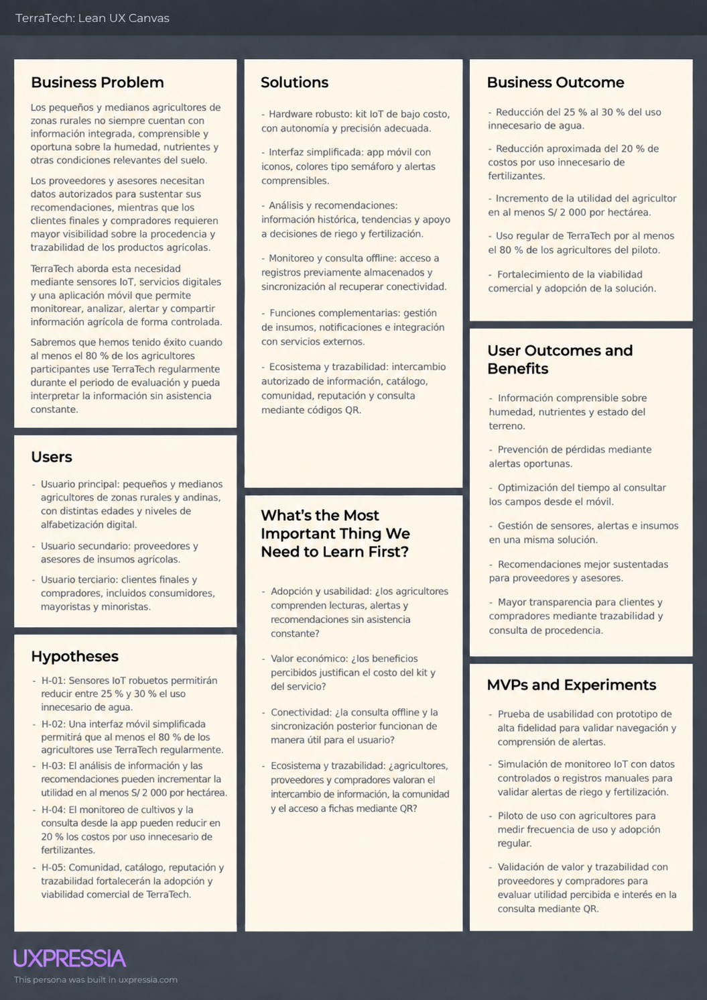

## 1.3. Segmentos objetivo

TerraTech considera tres segmentos objetivo relacionados con la producción, la asesoría, la comercialización y el consumo de productos agrícolas. Los perfiles se contextualizan con información estadística y se contrastan con la investigación realizada previamente para el proyecto.

Las estadísticas nacionales describen el entorno de los segmentos; las entrevistas aportan información sobre las personas participantes y no deben interpretarse automáticamente como resultados representativos de toda la población.

- **Pequeños y medianos agricultores:**

    - **Perfil:** Productores responsables de las decisiones de riego, fertilización y cuidado de unidades agrícolas pequeñas o medianas, principalmente ubicadas en zonas rurales de la Sierra peruana. Se consideran usuarios de distintas edades, incluyendo adultos mayores, con diferentes niveles de alfabetización digital.
    - **Sustento estadístico:** Según la Encuesta Nacional Agropecuaria 2023, el 81,7 % de las unidades agropecuarias del país pertenecía a la agricultura familiar de subsistencia, porcentaje que alcanzó el 92,5 % en la Sierra. Asimismo, el 64,1 % de los productores tenía entre 35 y 64 años. Respecto al nivel educativo, el 48,4 % contaba únicamente con educación primaria y el 8,6 % no tenía educación formal. Estos datos contextualizan la diversidad de los productores y la necesidad de evaluar una experiencia móvil comprensible; no establecen un límite de edad para participar en el proyecto. ([INEI, 2024](https://proyectos.inei.gob.pe/iinei/srienaho/Descarga/DocumentosMetodologicos/2023-62/05_PUBLICACION_ENA_2023.pdf))
    - **Problema:** Incertidumbre sobre la humedad, los nutrientes y el estado general de sus tierras, lo que dificulta la toma oportuna de decisiones sobre riego y fertilización. Las limitaciones de conectividad también pueden dificultar la consulta de información en el campo y el acceso continuo a herramientas digitales.
    - **Beneficio:** Monitoreo del estado del suelo, alertas y recomendaciones comprensibles, consulta de registros históricos, gestión de sensores e insumos e información complementaria que apoye la planificación agrícola y el uso eficiente de recursos.

- **Proveedores y asesores de insumos agrícolas:**

    - **Perfil:** Comerciantes, distribuidores y asesores locales que venden o recomiendan fertilizantes, semillas, plaguicidas y otros insumos utilizados en la producción agrícola.
    - **Sustento estadístico:** La Encuesta Nacional Agropecuaria 2023 señala que el 3,2 % de los productores recibió asistencia técnica, aunque el 80,9 % tuvo acceso a alguna clase de información agropecuaria, como precios, demanda, condiciones climáticas, precio de fertilizantes, aptitud del suelo o técnicas de manejo. Estas cifras describen el contexto de acceso a información y asistencia de los agricultores atendidos por este segmento; no representan un conteo de proveedores ni demuestran por sí mismas su disposición a utilizar TerraTech. ([INEI, 2024](https://proyectos.inei.gob.pe/iinei/srienaho/Descarga/DocumentosMetodologicos/2023-62/05_PUBLICACION_ENA_2023.pdf))
    - **Problema:** Falta de datos reales y actualizados para formular recomendaciones adecuadas a los agricultores, realizar seguimiento y orientar determinadas decisiones relacionadas con los productos e insumos que ofrecen.
    - **Beneficio:** Acceso autorizado a información sobre las condiciones de los cultivos, herramientas de consulta y análisis, información relacionada con productos y demanda, notificaciones y mecanismos de interacción que permitan apoyar la asesoría, realizar seguimiento y fortalecer la relación con sus clientes.

- **Clientes finales y compradores de productos agrícolas:**

    - **Perfil:** Personas que adquieren productos agrícolas para consumo personal o familiar, así como comerciantes, distribuidores y compradores mayoristas o minoristas que los adquieren para comercializarlos. Comparten el interés por conocer la procedencia y las condiciones de producción, aunque sus criterios de compra y uso de la información pueden ser diferentes.
    - **Sustento estadístico:** Según el Censo Nacional de Mercados de Abastos de 2016, citado en la Hoja de Ruta de PRODUCE (2021), se identificaron 2 612 mercados en el Perú: 44 mayoristas y 2 568 minoristas, además de 328 946 puestos fijos. Estas cifras permiten dimensionar parte del entorno comercial donde participan comerciantes y consumidores. No constituyen una estimación del número total de consumidores ni demuestran sus preferencias sobre trazabilidad; estas deben contrastarse con la investigación del proyecto. ([PRODUCE, 2021](https://pndp.produce.gob.pe/wp-content/uploads/2025/03/HOJA-DE-RUTA-D.S.-N%C2%BA-021-2021-PRODUCE.pdf))
    - **Problema:** Dificultad para conocer la procedencia de los productos y acceder a información comprensible sobre las condiciones registradas durante su cultivo, así como a referencias adicionales que permitan comparar alternativas antes de realizar una compra.
    - **Beneficio:** Acceso a un catálogo de productos, fichas informativas, información de trazabilidad, comentarios, calificaciones y datos compartidos por el agricultor sobre la procedencia y el cultivo, incluyendo su consulta mediante códigos QR, para apoyar decisiones de compra mejor informadas. La información presentada no sustituye certificaciones ni controles de calidad externos.

# Capítulo II: Requirements Development and Software Solution Design
[Volver al contenido principal](#contenido)
## 2.1. Competidores

* **Agrotech (competidor directo):** Es una empresa enfocada en la implementación de tecnología agrícola que ofrece soluciones como drones, sensores y asesoría técnica especializada para mejorar la productividad del campo. Está orientada a agricultores y empresas agroindustriales que buscan optimizar sus procesos mediante el uso de herramientas tecnológicas.

* **AgroVista del Valle (competidor directo):** Es una empresa de servicios agrícolas que utiliza análisis multiespectral para el monitoreo de cultivos, permitiendo evaluar la salud de las plantas y detectar problemas en el terreno. Está dirigida a agricultores y empresas agroexportadoras que buscan tomar decisiones basadas en datos para mejorar la eficiencia y productividad.

* **Phytech (competidor directo):** Es una plataforma digital de agricultura de precisión que integra sensores IoT, análisis de datos e inteligencia artificial para optimizar el riego y mejorar el rendimiento de los cultivos. Está orientada principalmente a empresas agroindustriales y grandes productores que buscan maximizar la eficiencia en el uso del agua y recursos.

### 2.1.1. Análisis competitivo

Para este análisis competitivo se realizó un benchmark enfocado en identificar las principales soluciones de agricultura de precisión en el mercado peruano e internacional. La evaluación consideró tres competidores directos: **Agrotech** (solución local con enfoque en drones y asesoría técnica), **AgroVista del Valle** (servicios agrícolas basados en análisis multiespectral) y **Phytech** (plataforma internacional con sensores IoT e inteligencia artificial).

El objetivo del **Competitive Analysis Landscape** es evaluar el perfil de producto, marketing y FODA de estos competidores para identificar oportunidades clave de diferenciación para **TerraTech**, especialmente en accesibilidad económica, experiencia móvil optimizada para trabajo en campo, soporte para zonas con baja o nula conectividad mediante almacenamiento local y monitoreo continuo del suelo en tiempo real.

| Dimensión | TerraTech (Nuestra Startup) | Agrotech | AgroVista del Valle | Phytech |
| --- | --- | --- | --- | --- |
| **Logo** |  |  |  |  |
| **Overview** | Solución móvil conectada a sensores IoT de bajo costo que permite monitorear en tiempo real la humedad y nutrientes del suelo desde smartphones, generando alertas preventivas y análisis predictivo adaptado a las condiciones del campo peruano. | Empresa que implementa tecnología agrícola mediante el uso de drones, sensores y asesoría técnica especializada presencial para optimizar la productividad de los cultivos. | Empresa de servicios agrícolas que utiliza análisis multiespectral e imágenes satelitales/aéreas para monitorear la salud vegetal y evaluar las condiciones del terreno. | Plataforma digital internacional de agricultura de precisión que integra sensores IoT e inteligencia artificial para optimizar el riego y el rendimiento de cultivos a gran escala. |
| **Ventaja competitiva y valor ofrecido** | Monitoreo continuo del suelo en tiempo real con latencia mínima, alertas push inmediatas, funcionamiento offline en la app móvil con sincronización posterior, interfaz simplificada para baja alfabetización digital y costos altamente accesibles para pequeños y medianos agricultores. | Soluciones integrales de hardware de alta gama (drones) y acompañamiento técnico presencial especializado. | Alta precisión en el análisis científico de imágenes multiespectrales para la detección temprana de anomalías en grandes extensiones. | Algoritmos avanzados de IA para la automatización de decisiones de riego a nivel empresarial con soporte global. |
| **Mercado objetivo** | Pequeños y medianos agricultores peruanos, cooperativas agrarias, asesores/proveedores de insumos y compradores interesados en trazabilidad. | Medianos y grandes productores agrícolas y empresas agroindustriales. | Agricultores medianos, empresas agroexportadoras y agroindustrias con capacidad de inversión técnica. | Grandes empresas agroindustriales y agroexportadoras multinacionales. |
| **Estrategias de marketing** | Alianzas con cooperativas agrarias locales, demostraciones prácticas en campo (pilotos), difusión digital y enfoque en sostenibilidad y retorno de inversión rápido. | Ventas directas B2B, demostraciones presenciales y participación en ferias y eventos del sector agroindustrial. | Servicios especializados B2B, networking corporativo y promoción técnica basada en casos de estudio. | Marketing B2B corporativo de alto nivel, posicionamiento premium internacional y publicaciones científicas. |
| **Productos y servicios** | Sensores IoT de suelo, aplicación móvil (Android/iOS) con soporte offline, alertas climáticas/riego, dashboard de fertilidad y trazabilidad por código QR. | Venta y alquiler de drones agrícolas, sensores de campo y consultoría técnica agronómica personalizada. | Servicios de teledetección multiespectral, diagnósticos de vigor vegetal (NDVI) y reportes agronómicos periódicos. | Sensores IoT propietarios en planta/suelo, plataforma analítica con IA, módulos de automatización de riego y soporte corporativo. |
| **Precios y costos** | Kit de sensores accesible (< S/ 300) y modelo de suscripción mensual flexible (S/ 30 - S/ 50 por usuario/mes). | Costos elevados debido a la inversión en aeronaves no tripuladas y horas de consultoría especializada. | Tarifas medias a altas por hectárea o por vuelo de teledetección programado. | Costos muy elevados con suscripciones anuales empresariales (> US$ 500 / ha / año). |
| **Canales de distribución** | Aplicación móvil en tiendas digitales (Google Play Store / App Store), landing page web informativa y venta directa de sensores. | Canal corporativo web, visitas comerciales directas y distribuidores autorizados de drones. | Plataforma web de consulta de reportes y contacto comercial directo. | Aplicación móvil y web corporativa con despliegue empresarial asistido. |
| **Fortalezas** | Experiencia de usuario móvil diseñada para entornos rurales, bajo costo, soporte offline, alertas en tiempo real y adaptación local. | Tecnología de vanguardia (drones), personal técnico calificado y reconocimiento institucional. | Métricas visuales de alta precisión para macro-lotes y análisis científico riguroso. | Inteligencia artificial madura, infraestructura IoT robusta y respaldo financiero internacional. |
| **Debilidades** | Dependencia de penetración de smartphones en zonas rurales y posicionamiento de marca en fase inicial. | Barrera de entrada por precios altos y dependencia de operadores especializados para el vuelo de drones. | No ofrece monitoreo continuo en tiempo real (depende de la frecuencia de captura aérea/satelital). | Costos prohibitivos para pequeños productores y escasa adaptación a la realidad agrícola andina/costera local. |
| **Oportunidades** | Masificación de smartphones y redes de conectividad rural (LoRaWAN/4G), e interés creciente en optimización de recursos hídricos. | Creciente adopción de servicios tecnológicos por empresas agroexportadoras. | Creciente demanda de certificaciones de sanidad vegetal para exportación. | Crecimiento global del mercado de agricultura de precisión e IoT. |
| **Amenazas** | Resistencia al cambio tecnológico en zonas tradicionales y variabilidad de cobertura móvil en el campo. | Aparición de soluciones de teledetección satelital gratuitas o de bajo costo. | Entrada de sensores IoT económicos que reduzcan la necesidad de vuelos recurrentes. | Competidores locales emergentes con soluciones móviles de bajo costo. |

### 2.1.2. Estrategias y tácticas frente a competidores

A partir del análisis de las fortalezas y debilidades de los competidores, se establecen las siguientes estrategias y tácticas para posicionar a **TerraTech** como la solución móvil líder en agricultura accesible:

| Hallazgo | Estrategia | Táctica |
| --- | --- | --- |
| **Altos costos de competidores (Phytech > US$ 500/ha; Agrotech con drones costosos)** | Diferenciación por accesibilidad económica y bajo costo de adopción. | Ofrecer kits de sensores IoT a precio de penetración (< S/ 300) junto con una aplicación móvil accesible bajo suscripción flexible (S/ 30 - S/ 50 mensuales), eliminando costos de consultoría externa. |
| **Falta de monitoreo continuo en competidores basados en vuelos periódicos (AgroVista del Valle)** | Posicionamiento en monitoreo continuo del suelo en tiempo real directo al smartphone. | Enviar lecturas de humedad y nutrientes cada 5 minutos directo a la app móvil, permitiendo tomar decisiones inmediatas de riego y fertilización antes de que se produzca estrés hídrico. |
| **Baja alfabetización digital y desconfianza del agricultor rural ante software complejo** | Experiencia de usuario móvil simplificada e inclusiva con asistencia guiada. | Diseñar la aplicación móvil con tipografía legible (mínimo 16px), íconos de alto contraste, semáforos visuales (rojo/amarillo/verde), sistema de notificaciones push directas y tutoriales paso a paso interactivos. |
| **Conectividad intermitente o nula en zonas agrícolas rurales** | Resiliencia de la solución móvil mediante arquitectura offline-first y conectividad IoT LoRaWAN. | Incorporar almacenamiento local en el dispositivo móvil (SQLite/Room) para consulta de datos sin conexión y sincronización en segundo plano al recuperar señal, complementado con sensores que transmiten vía LoRaWAN (915 MHz). |
| **Falta de herramientas para que el agricultor demuestre la calidad de su cosecha a compradores** | Transparencia y trazabilidad compartible desde el dispositivo móvil. | Permitir al agricultor generar fichas de trazabilidad y códigos QR desde la app móvil para compartirlos por WhatsApp o imprimirlos, certificando el buen uso de agua y nutrientes ante clientes y proveedores. |

## 2.2. Entrevistas

### 2.2.1. Diseño de entrevistas

Para recopilar requerimientos reales del dominio y diseñar la experiencia móvil de **TerraTech**, se prepararon guías de entrevista semiestructuradas orientadas a los tres segmentos objetivo: **Agricultores**, **Proveedores de Insumos Agrícolas** y **Clientes Finales / Compradores**.

| Segmento | Pregunta principal | Preguntas complementarias | Información buscada |
| --- | --- | --- | --- |
| **Segmento 1: Agricultores** | ¿Cómo gestiona actualmente el riego y fertilización de sus cultivos, y qué dificultades enfrenta al tomar estas decisiones en el campo? | 1. ¿Qué cultivos trabaja y qué extensión tiene su terreno? 2. ¿Cómo evalúa la humedad y fertilidad del suelo en el día a día? 3. ¿Qué pérdidas ha tenido por factores climáticos o plagas? 4. ¿Qué celular utiliza y cómo es su experiencia con aplicaciones móviles? 5. ¿Qué opina de recibir alertas en su teléfono sobre cuándo regar? 6. ¿Qué temores tiene al instalar tecnología o sensores en su terreno? | Nivel de alfabetización digital, tipo de dispositivo móvil utilizado, conectividad en campo, métodos de monitoreo tradicionales, puntos de dolor ante heladas/sequías y disposición al uso de alertas en el smartphone. |
| **Segmento 2: Proveedores de Insumos** | ¿Cómo realiza el diagnóstico y la recomendación de fertilizantes e insumos a los agricultores, y cómo valida su efectividad? | 1. ¿Qué insumos ofrece y cómo asesora a sus clientes? 2. ¿Qué datos del suelo le ayudarían a recomendar productos con mayor precisión? 3. ¿Cómo realiza el seguimiento postventa de sus productos? 4. ¿Qué herramientas móviles o digitales utiliza para su trabajo diario? 5. ¿Cómo le ayudaría contar con una app que reciba datos en tiempo real de los campos de sus clientes? | Procesos de asesoría técnica, canales de comunicación móvil (WhatsApp, apps), problemas de recomendaciones inexactas por falta de datos y requerimientos para un dashboard móvil de clientes. |
| **Segmento 3: Clientes Finales / Compradores** | ¿Qué factores determinan su decisión de compra de productos agrícolas y qué importancia le otorga a la trazabilidad y sostenibilidad? | 1. ¿Con qué frecuencia compra productos agrícolas y dónde? 2. ¿Cómo verifica la frescura, calidad y ausencia de químicos nocivos? 3. ¿Estaría dispuesto a pagar más si conoce el proceso de cultivo? 4. ¿Utiliza su smartphone para escanear códigos QR o buscar información de alimentos? 5. ¿Qué información le generaría mayor confianza al comprar? | Hábitos de compra, uso del smartphone en el punto de venta (búsqueda de información, lectura de QR), disposición a pagar por productos sostenibles y necesidades de visualización de trazabilidad. |

#### Cuestionario detallado por segmento

**Segmento Objetivo 1: Agricultores**

1. ¿Qué cultivos trabajas actualmente y qué factores influyen en esa elección?
2. ¿Cómo describirías la extensión de tu terreno y cómo se distribuyen tus cultivos dentro de él?
3. ¿Qué métodos utilizas para evaluar la humedad y la fertilidad del suelo en tu día a día?
4. ¿Cómo decides cuándo es el momento adecuado para regar tus cultivos?
5. Cuéntame sobre las principales dificultades que enfrentas al manejar el riego o la fertilización.
6. Describe alguna experiencia en la que hayas tenido pérdidas de cultivo y qué crees que la causó.
7. ¿Qué herramientas o tecnologías has probado para el monitoreo agrícola y cómo ha sido tu experiencia con ellas?
8. ¿De qué manera te ayudaría contar con información actualizada sobre el estado del suelo en tu teléfono?
9. ¿Cómo cambiaría tu forma de trabajar si recibieras avisos automáticos en el móvil sobre las necesidades de tus cultivos?
10. ¿Cómo es tu experiencia utilizando aplicaciones móviles o plataformas digitales en general?
11. ¿En qué situaciones sueles usar internet y desde qué dispositivos lo haces?
12. ¿Qué preocupaciones te surgen al pensar en implementar sensores o tecnología en tu terreno?
13. ¿Qué resultados esperarías obtener al usar una aplicación que analice tus cultivos?
14. ¿Cómo evaluarías si una solución tecnológica realmente vale la pena para tu trabajo?
15. ¿Qué funciones o herramientas te gustaría tener en una aplicación móvil para gestionar mejor tus cultivos?

**Segmento Objetivo 2: Proveedores de Insumos Agrícolas**

1. ¿Qué tipos de insumos agrícolas ofreces y a qué tipo de clientes están dirigidos?
2. ¿Cómo es el proceso que sigues para recomendar productos a los agricultores?
3. ¿Qué tipo de información sobre los cultivos te ayudaría a hacer recomendaciones más precisas?
4. ¿Cómo influye el conocimiento del estado del suelo en las recomendaciones que brindas?
5. ¿De qué manera haces seguimiento al uso y resultados de los productos que vendes?
6. ¿Cómo cambiaría tu trabajo si pudieras acceder a información actualizada de los cultivos de tus clientes desde tu celular?
7. ¿Qué oportunidades ves en el uso de datos agrícolas móviles para mejorar tu negocio?
8. Cuéntame sobre los principales retos que enfrentas al recomendar fertilizantes u otros insumos.
9. ¿Cómo te ayudaría una herramienta que sugiera productos de forma automática según las condiciones del cultivo?
10. ¿Cómo suele ser tu comunicación con los agricultores y qué tan efectiva consideras que es?
11. ¿Qué herramientas digitales o aplicaciones móviles utilizas actualmente para gestionar tu trabajo o ventas?
12. ¿Qué aspectos considerarías antes de adoptar una plataforma digital en tu negocio?
13. ¿Qué inquietudes tendrías al compartir información a través de una aplicación tecnológica?
14. ¿Qué características debería tener una herramienta móvil para que realmente te ayude a vender y asesorar mejor?
15. ¿Cómo impactaría en tu negocio mejorar la precisión de tus recomendaciones agronómicas?

**Segmento Objetivo 3: Clientes Finales / Compradores**

1. ¿Qué tipo de productos agrícolas sueles consumir y en qué situaciones los compras?
2. ¿Qué aspectos tomas en cuenta al elegir un producto agrícola frente a otro?
3. ¿Qué importancia le das al origen de los productos que consumes y por qué?
4. ¿Cómo influye la sostenibilidad y el uso eficiente del agua en tus decisiones de compra?
5. ¿Qué te generaría más confianza en un producto agrícola?
6. ¿Qué tipo de información has visto sobre el proceso de cultivo de los productos que compras?
7. ¿Cómo cambiaría tu percepción del producto si pudieras ver en tu celular cómo fue cultivado?
8. ¿De qué manera te gustaría acceder a información sobre el cultivo de los productos (ej. escaneo de código QR desde el móvil)?
9. ¿Qué factores influyen más en tu decisión final al momento de comprar?
10. ¿Cómo utilizas internet o aplicaciones para informarte antes de comprar alimentos?
11. ¿En qué momentos y desde qué dispositivos sueles buscar información sobre productos?
12. ¿Cómo defines la transparencia en la producción agrícola y por qué es importante para ti?
13. ¿Qué elementos te harían sentir mayor seguridad al comprar productos agrícolas?
14. ¿Qué tipo de información te gustaría conocer sobre el proceso de cultivo y cuidado del suelo?
15. ¿En qué situaciones compartirías información sobre productos saludables si consideras que es útil?

### 2.2.2. Registro de entrevistas

A continuación se presentan las entrevistas realizadas a los tres segmentos objetivo, acompañadas de su evidencia gráfica, enlace a la grabación y resumen descriptivo:

| ID | Segmento | Nombres y apellidos | Edad | Distrito | Fecha | Tiempo de inicio | Video y captura |
| --- | --- | --- | --- | --- | --- | --- | --- |
| **ENT-001** | Agricultores | Marcelino Encarnación Timoteo | 67 | Huánuco | 28/03/2026 | 00:00 - 12:25 | [Video](https://tinyurl.com/3ey2frc6)    |
| **ENT-002** | Agricultores | Joe Cañamero | 52 | Cusco | 28/03/2026 | 12:30 - 23:53 | [Video](https://tinyurl.com/38k9bf9j)    |
| **ENT-003** | Proveedores de Insumos | Anita Monago Cachay | 35 | Lima | 29/03/2026 | 23:58 - 30:32 | [Video](https://tinyurl.com/nhcd3sx8)    |
| **ENT-004** | Proveedores de Insumos | Karim Castillo | 26 | Cañete / Lima | 29/03/2026 | 30:37 - 36:30 | [Video](https://tinyurl.com/2a4fhbyj)    |
| **ENT-005** | Clientes Finales | Anjali Amaro | 25 | Lima | 30/03/2026 | 36:35 - 43:45 | [Video](https://tinyurl.com/44zrjtsp)    |
| **ENT-006** | Clientes Finales | Luciana Aguilar | 17 | La Molina (Lima) | 30/03/2026 | 43:50 - 50:56 | [Video](https://tinyurl.com/mryc8k2u)    |
| **ENT-007** | Clientes Finales | Albert Ponduro | 29 | Cañete / Lima | 30/03/2026 | 51:01 - 58:04 | [Video](https://tinyurl.com/msecxcnt)    |

#### Resúmenes descriptivos de las entrevistas

- **ENT-001 (Marcelino Encarnación Timoteo - Agricultor, Huánuco):**
  Marcelino es un agricultor dedicado al cultivo de zanahoria en Huánuco. Representa a usuarios tradicionales con bajo nivel de alfabetización digital y alta desconfianza inicial ante la tecnología. No utiliza smartphones avanzados en su labor diaria y su zona sufre de conectividad celular deficiente. Sus mayores dolores son la incertidumbre climática (heladas nocturnas) y la fatiga física por recorrer a pie su terreno para palpar la humedad del suelo. Recibiría con agrado un sistema de alertas directas y sencillas, siempre que los sensores sean seguros y la aplicación móvil funcione de manera visual, sin requerir lectura de textos complejos ni conexión permanente a internet.

- **ENT-002 (Joe Cañamero - Agricultor, Cusco):**
  Joe es un agricultor cusqueño que prioriza la simplicidad extrema en cualquier herramienta digital. Indicó que para adoptar una aplicación móvil requiere asistencia guiada o tutoriales paso a paso interactivos, ya que la complejidad técnica lo intimida. Asimismo, opera en un entorno rural con frecuentes cortes de energía e intermitencia de red, por lo que la aplicación móvil debe ser capaz de almacenar datos localmente y operar sin conexión continua, actualizando los datos de los sensores IoT vía LoRaWAN y sincronizándose cuando haya señal disponible.

- **ENT-003 (Anita Monago Cachay - Proveedora de Insumos, Lima):**
  Anita es mayorista de frutas y verduras con 35 años. Basa su éxito comercial en la honestidad sobre la calidad de los productos que comercializa. Manifiesta que contar con datos anticipados sobre el clima y el estado de los cultivos de sus proveedores agrícolas en su teléfono móvil le permitiría prevenir caídas en la calidad y planificar mejor sus compras mayoristas, manteniendo la confianza de sus clientes.

- **ENT-004 (Karim Castillo - Proveedor / Asesor Técnico, Cañete):**
  Karim es un joven asesor técnico de 26 años. Realiza visitas a campo en Cañete para asesorar a agricultores sobre fertilización, pero experimenta frustración por no contar con datos cuantitativos en tiempo real de los nutrientes y humedad del suelo. Utiliza activamente su smartphone para coordinar por WhatsApp. Valora enormemente una aplicación móvil que le permita visualizar diagnósticos de los lotes de sus clientes y recibir recomendaciones automáticas para respaldar técnicamente sus ventas de insumos.

- **ENT-005 (Anjali Amaro - Cliente Final, Lima):**
  Anjali (25 años) busca alimentos con altos estándares de calidad e inocuidad. Manifiesta desconfianza frente a etiquetas genéricas o sellos ecológicos poco transparentes. Considera clave poder acceder desde su smartphone a un perfil o reporte de trazabilidad donde se verifique el uso responsable de agua y fertilizantes del agricultor antes de realizar su compra.

- **ENT-006 (Luciana Aguilar - Cliente Final, La Molina):**
  Luciana (17 años) realiza compras semanales de frutas y verduras fijándose en frescura, precio y procedencia local. Utiliza constantemente su smartphone para buscar información nutricional. Señala que estaría dispuesta a pagar un monto adicional si pudiera verificar la trazabilidad y prácticas sostenibles escaneando un código QR en el empaque o puesto de venta mediante la cámara de su teléfono móvil.

- **ENT-007 (Albert Ponduro - Cliente Final / Comprador Mayorista, Cañete):**
  Albert (29 años) es comprador mayorista y comerciante en el Mercado Modelo. Destaca que la falta de verificación sobre el origen y manejo del suelo le genera incertidumbre al negociar. Cree indispensable una interfaz móvil ágil con escaneo QR o dashboard simplificado que le permita certificar a sus clientes que las verduras fueron cultivadas con suelo fértil y agua limpia.

### 2.2.3. Análisis de entrevistas

El análisis de las entrevistas consolida las variables objetivas (demográficas) y subjetivas (comportamiento, tecnología y dolores) para fundamentar los requerimientos de la solución móvil **TerraTech**.

| Segmento | Variable | Valor observado | Frecuencia | Total de entrevistados | Porcentaje | Entrevistas relacionadas |
| --- | --- | --- | --- | --- | --- | --- |
| **Agricultores** | Género | Masculino | 2 | 2 | 100% | ENT-001, ENT-002 |
| **Agricultores** | Rango de edad | 50 a 67 años | 2 | 2 | 100% | ENT-001, ENT-002 |
| **Agricultores** | Nivel educativo | Primaria / Secundaria incompleta | 2 | 2 | 100% | ENT-001, ENT-002 |
| **Agricultores** | Alfabetización digital | Baja / Nula (requiere interfaz asistida e íconos) | 2 | 2 | 100% | ENT-001, ENT-002 |
| **Agricultores** | Conectividad en campo | Nula / Intermitente (requiere soporte offline) | 2 | 2 | 100% | ENT-001, ENT-002 |
| **Agricultores** | Principal dolor | Pérdidas por heladas / Sequías / Esfuerzo físico | 2 | 2 | 100% | ENT-001, ENT-002 |
| **Agricultores** | Dispositivo móvil de acceso | Smartphone básico / Teléfono convencional | 2 | 2 | 100% | ENT-001, ENT-002 |
| **Proveedores de Insumos** | Rango de edad | 26 a 35 años | 2 | 2 | 100% | ENT-003, ENT-004 |
| **Proveedores de Insumos** | Nivel educativo | Secundaria completa / Superior técnica | 2 | 2 | 100% | ENT-003, ENT-004 |
| **Proveedores de Insumos** | Canal de comunicación principal | WhatsApp / Teléfono móvil | 2 | 2 | 100% | ENT-003, ENT-004 |
| **Proveedores de Insumos** | Principal dolor | Falta de datos de campo para respaldar recomendaciones | 2 | 2 | 100% | ENT-003, ENT-004 |
| **Proveedores de Insumos** | Dispositivo de preferencia | Smartphone de gama media | 2 | 2 | 100% | ENT-003, ENT-004 |
| **Proveedores de Insumos** | Interés en app móvil de monitoreo | Alto (reducción de tiempos y datos en tiempo real) | 2 | 2 | 100% | ENT-003, ENT-004 |
| **Clientes Finales** | Rango de edad | 17 a 29 años | 3 | 3 | 100% | ENT-005, ENT-006, ENT-007 |
| **Clientes Finales** | Nivel educativo | Superior en curso / Completa | 3 | 3 | 100% | ENT-005, ENT-006, ENT-007 |
| **Clientes Finales** | Uso de smartphone para compras/búsqueda | Diario (Redes sociales, Google, escaneo QR) | 3 | 3 | 100% | ENT-005, ENT-006, ENT-007 |
| **Clientes Finales** | Factor decisivo de compra | Frescura, calidad y verificación de procedencia | 3 | 3 | 100% | ENT-005, ENT-006, ENT-007 |
| **Clientes Finales** | Mecanismo preferido de trazabilidad | Código QR escaneable desde la cámara del móvil | 3 | 3 | 100% | ENT-005, ENT-006, ENT-007 |

#### Síntesis del análisis por segmento

- **Segmento 1 (Agricultores):**
  Los agricultores operan en un contexto de vulnerabilidad climática y aislamiento digital. El 100% depende de la observación empírica directa y presenta baja alfabetización digital. Para que la aplicación móvil sea adoptada con éxito, debe diseñarse bajo principios de accesibilidad universal: uso de colores semafóricos (verde, amarillo, rojo), íconos representativos en lugar de tablas densas, notificaciones push sonoras y claras, y soporte de funcionamiento offline para que la falta de cobertura 4G en el campo no impida la visualización del estado del terreno.

- **Segmento 2 (Proveedores de Insumos Agrícolas):**
  Este segmento tiene una alta adopción tecnológica móvil (100% usuarios activos de smartphones y mensajería instantánea). Su principal cuello de botella es la falta de datos objetivos del suelo al momento de prescribir insumos, lo que genera reclamos postventa. Una aplicación móvil con paneles de consulta de lotes de clientes y sugerencias automáticas de dosificación les permitirá ahorrar tiempo y elevar la tasa de fidelización y venta de insumos.

- **Segmento 3 (Clientes Finales y Compradores Mayoristas):**
  Los compradores representan a un público nativo digital y consciente de la sostenibilidad. El 100% utiliza su smartphone de forma cotidiana y valora positivamente la verificación del origen de los alimentos mediante la lectura de códigos QR en puntos de venta. Esto valida la necesidad de que la aplicación móvil TerraTech permita generar certificados públicos de buenas prácticas agrícolas accesibles mediante enlace web móvil o escaneo QR directo.

## 2.3. Needfinding

El proceso de Needfinding transforma los resultados de las entrevistas en artefactos de diseño centrados en los usuarios. A partir del análisis demográfico, conductual y tecnológico de cada segmento (2.2) y de las diferencias identificadas frente a los competidores (2.1), el equipo elaboró los artefactos que se presentan a continuación, los cuales orientan el diseño de la aplicación móvil TerraTech.

### 2.3.1. User Personas

Las fichas de User Persona presentan el perfil de cada segmento objetivo y reúnen sus datos demográficos, metas, frustraciones, habilidades tecnológicas, marcas e influencias y canales de interacción. Cada ficha se elaboró en UXPressia a partir de las entrevistas ENT-001 a ENT-007: el agricultor (ENT-001, ENT-002) presenta baja alfabetización digital y conectividad limitada; el proveedor de insumos (ENT-003, ENT-004) necesita datos objetivos del suelo para respaldar sus recomendaciones; y el cliente final (ENT-005, ENT-006, ENT-007) prioriza la transparencia y la trazabilidad del producto. Asimismo, cada ficha incorpora las características más frecuentes del análisis estadístico presentado en 2.2.3 y las oportunidades de diferenciación detectadas en 2.1.

**Segmento 1: Agricultor**

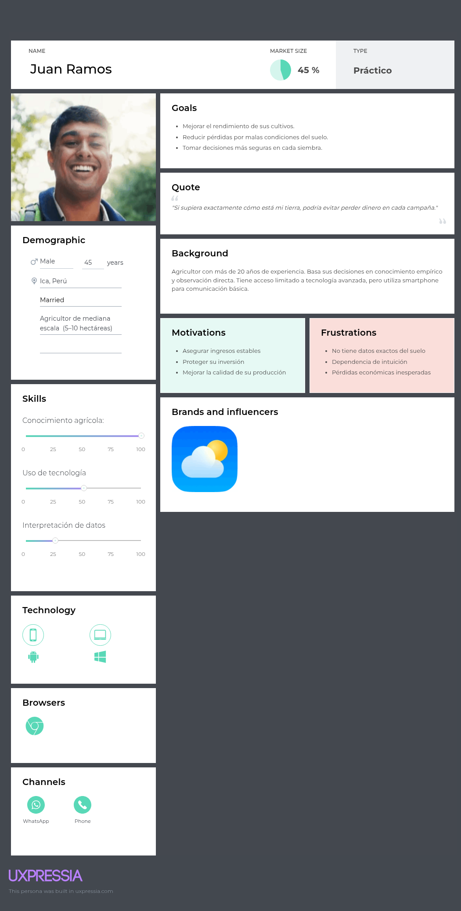

**Segmento 2: Proveedor de insumos**

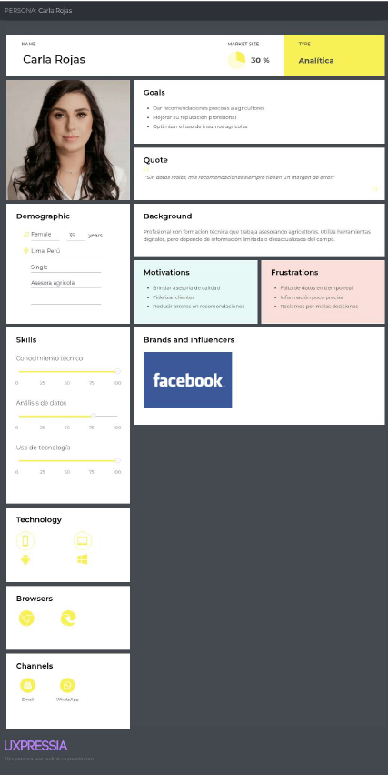

**Segmento 3: Cliente final**

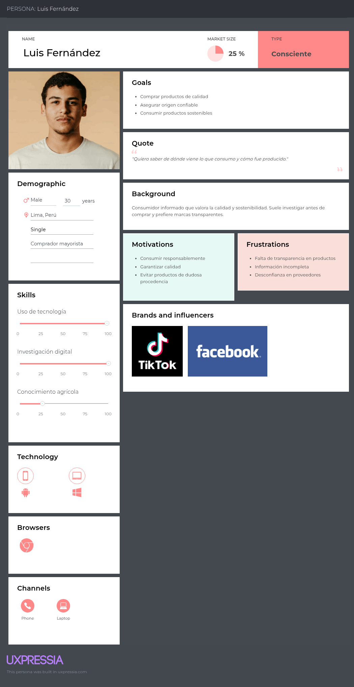

### 2.3.2. User Task Matrix

La User Task Matrix compara las tareas que cada segmento realiza hoy para alcanzar sus objetivos, sin considerar la existencia de la solución (es decir, actividades del negocio y no funcionalidades de software). Las tareas se identificaron a partir de las entrevistas y se valoraron según su frecuencia (Alta, Media, Baja) y su importancia para cada User Persona.

| Tarea | Agricultor: Frecuencia | Agricultor: Importancia | Proveedor: Frecuencia | Proveedor: Importancia | Cliente final: Frecuencia | Cliente final: Importancia |
| :--- | :---: | :---: | :---: | :---: | :---: | :---: |
| Supervisar el estado del suelo y del cultivo | Alta | Alta | Media | Alta | Baja | Baja |
| Decidir cuándo regar o aplicar fertilizantes | Alta | Alta | Media | Media | Baja | Baja |
| Anticipar riesgos climáticos (heladas, sequías, lluvias) | Alta | Alta | Media | Alta | Baja | Media |
| Detectar plagas o enfermedades en el cultivo | Alta | Alta | Media | Alta | Baja | Baja |
| Planificar la siembra y la rotación de cultivos | Media | Alta | Baja | Media | Baja | Baja |
| Registrar el rendimiento de la producción | Media | Media | Baja | Media | Baja | Baja |
| Asesorar a agricultores sobre insumos y buenas prácticas | Baja | Media | Alta | Alta | Baja | Baja |
| Verificar la procedencia y la calidad de los productos agrícolas | Baja | Media | Alta | Alta | Alta | Alta |
| Comparar precios y opciones antes de comprar o vender | Media | Media | Alta | Alta | Alta | Alta |
| Coordinar visitas, pedidos y entregas con la red de contactos | Media | Media | Alta | Alta | Media | Media |
| Comunicarse por mensajería con clientes, proveedores o familiares | Media | Media | Alta | Alta | Alta | Media |
| Compartir opiniones o recomendaciones sobre productos | Baja | Baja | Media | Media | Alta | Media |

**Análisis de la User Task Matrix:**

Los agricultores realizan con mayor frecuencia e importancia tareas operativas: supervisar el suelo, decidir el riego y anticipar riesgos climáticos o plagas, porque de ello dependen directamente sus cosechas. Los proveedores destacan en tareas comerciales y de asesoría, como verificar la calidad de los productos, comparar opciones y coordinar visitas y entregas, lo que corresponde a un uso más estratégico de la información. Los clientes finales realizan con menor frecuencia tareas de producción, pero otorgan alta importancia a verificar la procedencia y calidad de lo que compran, comparar alternativas y compartir recomendaciones. En común, los tres segmentos necesitan comunicarse y comparar información antes de tomar decisiones, lo que respalda la propuesta de valor de TerraTech: información objetiva del cultivo disponible desde el dispositivo móvil.

### 2.3.3. User Journey Mapping

Los User Journey Maps describen el recorrido de extremo a extremo que cada User Persona sigue actualmente (situación As-Is), antes de contar con TerraTech. Estos mapas, elaborados en UXPressia y vinculados con la ficha de su respectivo User Persona, permiten reconocer los puntos de dolor y las oportunidades de mejora que la aplicación móvil debe atender.

**Segmento 1: Agricultor**

El mapa de Marcelino muestra el recorrido que sigue en su cultivo de zanahoria en Huánuco para revisar el estado del suelo y decidir cuándo regar o fertilizar. Al no contar con mediciones objetivas, depende de la inspección visual y de su experiencia, lo que le genera incertidumbre frente a cambios climáticos inesperados y un importante esfuerzo físico al recorrer el terreno.

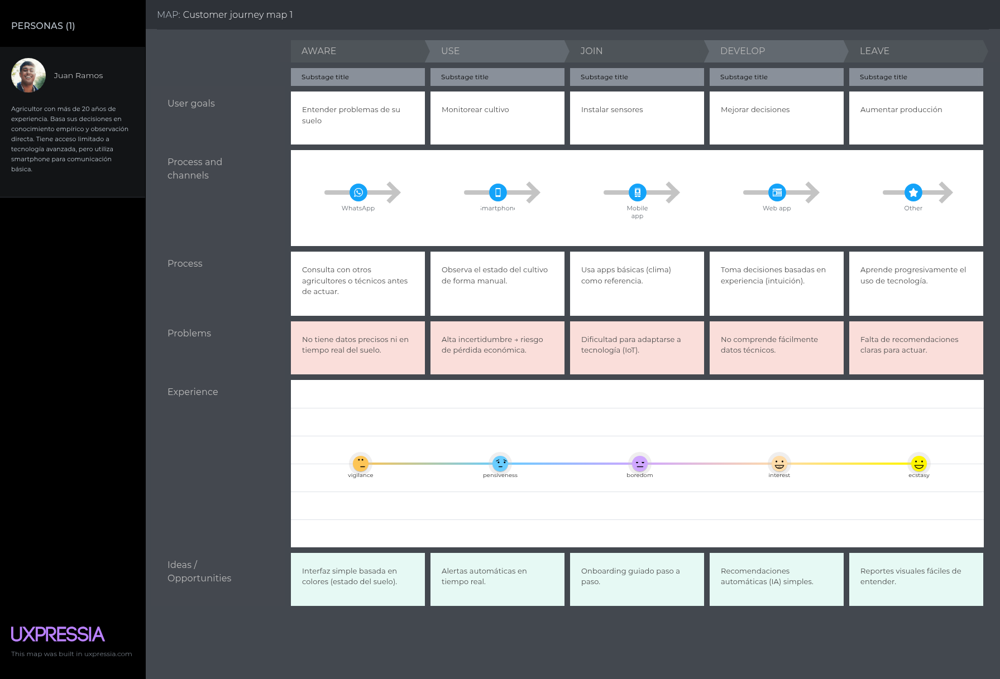

**Segmento 2: Proveedor de insumos**

El mapa de Karim refleja el proceso de asesoría que realiza en Cañete para recomendar insumos a los agricultores. El recorrido combina visitas presenciales con su experiencia previa, pero la ausencia de datos reales del suelo genera recomendaciones poco precisas, reclamos y pérdida de confianza de sus clientes.

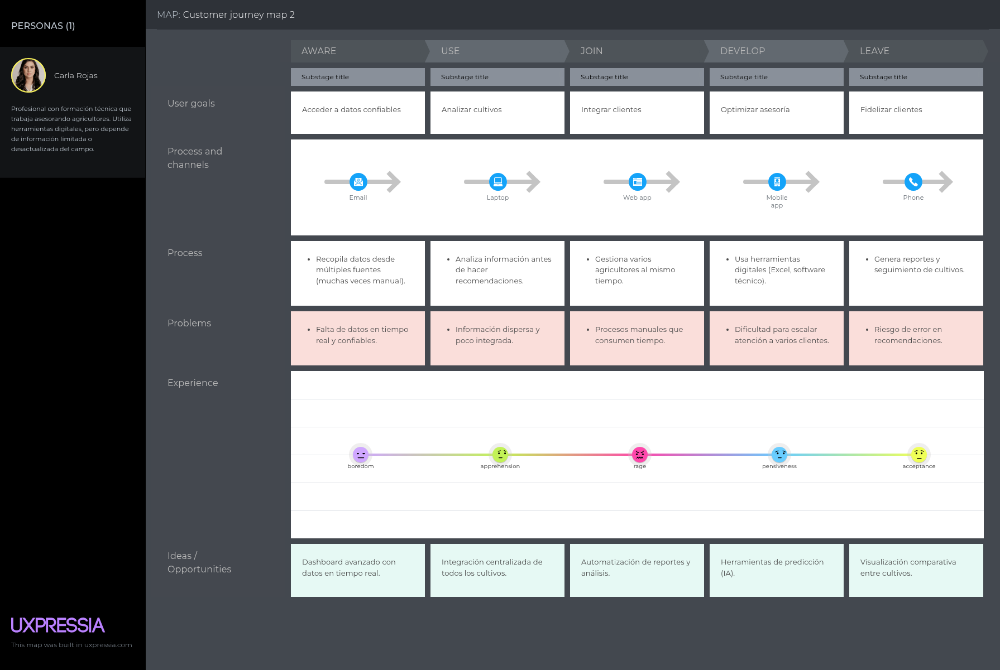

**Segmento 3: Cliente final**

El mapa de Luciana describe su proceso de compra de frutas y verduras en La Molina. Aunque valora la frescura, el precio y la apariencia del producto, no dispone de información confiable sobre el origen ni las prácticas de cultivo, por lo que decide con información incompleta y desconfianza.

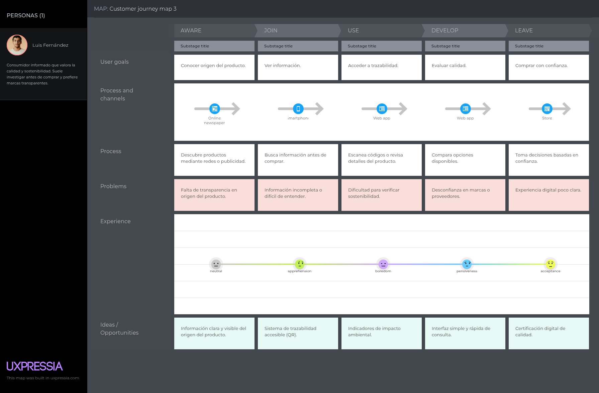

### 2.3.4. Empathy Mapping

Los Empathy Maps profundizan en lo que cada User Persona piensa, siente, ve, escucha, dice y hace en su contexto cotidiano. Fueron elaborados en UXPressia a partir de las observaciones y respuestas obtenidas en las entrevistas, identificando también sus principales pains y gains.

**Segmento 1: Agricultor**

En el mapa de Marcelino se observa una permanente preocupación por las heladas y la posible pérdida de su cosecha, así como el cansancio que le genera recorrer el terreno para palpar la humedad. Escucha consejos de agricultores veteranos y siente temor inicial hacia la tecnología, pero también desea mayor certeza para mejorar su productividad. Sus pains son la falta de información precisa y el esfuerzo físico; sus gains, la tranquilidad de anticiparse al clima y proteger su inversión.

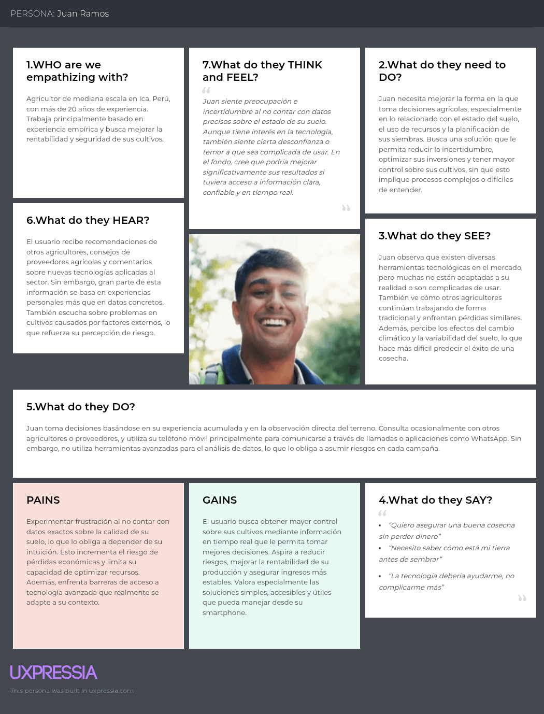

**Segmento 2: Proveedor de insumos**

El mapa de Karim evidencia frustración por las recomendaciones imprecisas y la necesidad de recuperar credibilidad frente a los agricultores. Ve clientes con problemas de suelo y competencia en el mercado, escucha reclamos y comentarios de otros asesores, y basa su trabajo en visitas a campo y experiencia. Sus pains son la falta de datos objetivos y la pérdida de clientes; sus gains, fidelizar a los agricultores y aumentar sus ventas con asesorías más acertadas.

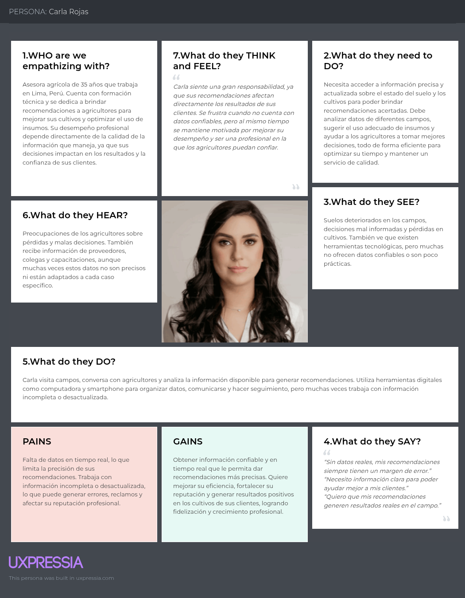

**Segmento 3: Cliente final**

El mapa de Luciana refleja el deseo de transparencia y la desconfianza que le generan las etiquetas confusas o la falta de información sobre el producto. Escucha tendencias de alimentación saludable y testimonios de otros compradores, y suele buscar referencias en su teléfono antes de decidir por precio y apariencia. Sus pains son la dificultad para verificar el origen y la calidad; sus gains, acceder a productos saludables y reconocer prácticas sostenibles con mayor confianza.

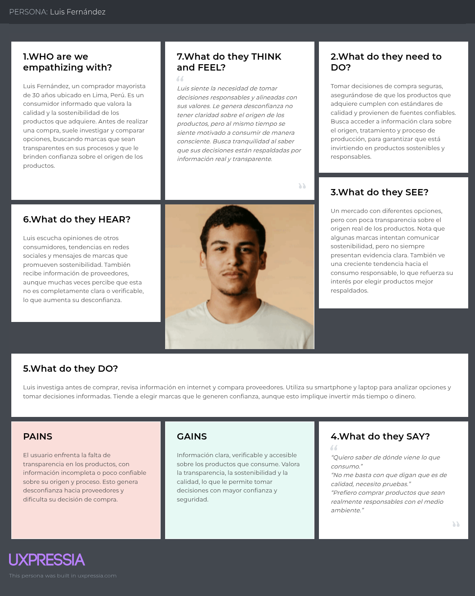

### 2.3.5. Big Picture EventStorming

El equipo realizó una sesión colaborativa de Big Picture EventStorming en Miro con el propósito de comprender el dominio del negocio agrícola de TerraTech a alto nivel. La sesión se centró en el flujo de negocio real, desde la preparación de la tierra hasta la comercialización del producto, identificando los eventos significativos del ciclo de cultivo, los actores del ecosistema y las reglas que determinan el comportamiento del sistema.

**Eventos de dominio (domain events):**

- *Soil Prepared*: la tierra quedó preparada para la siembra.
- *Crop Planted*: el cultivo fue sembrado.
- *Soil Moisture Changed*: cambió la humedad del suelo.
- *Nutrient Level Changed*: cambió el nivel de nutrientes.
- *Irrigation Applied*: se aplicó riego.
- *Fertilizer Applied*: se aplicó fertilizante.
- *Weather Alert Received*: se recibió una alerta climática.
- *Crop Growth Stage Updated*: se actualizó la etapa de crecimiento.
- *Pest Detected*: se detectó una plaga.
- *Crop Harvested*: se cosechó el cultivo.
- *Yield Recorded*: se registró el rendimiento.
- *Product Listed in Catalog*: el producto quedó disponible en el catálogo.
- *Product Information Consulted*: el cliente consultó la información pública del producto.
- *Traceability QR Generated*: se generó el código QR de trazabilidad.

**Actores:**

- *Farmer (agricultor)*: prepara, siembra, riega, fertiliza y cosecha.
- *Soil (suelo)*: actor pasivo que origina los cambios de humedad y nutrientes.
- *Weather (clima)*: actor externo que genera las alertas climáticas.
- *Advisor / Supplier (asesor / proveedor)*: recomienda insumos a partir de los datos del suelo.
- *End Customer (cliente final)*: compra productos y verifica su trazabilidad.

**Políticas de negocio:**

- Cuando la humedad del suelo cae por debajo del 30%, se dispara una recomendación de riego.
- Cuando el nitrógeno desciende por debajo de 20 ppm, se dispara una recomendación de fertilización.
- Cuando se detecta una plaga, se dispara una alerta de control fitosanitario.
- Cuando el cultivo se cosecha, se actualizan el inventario y los registros de rendimiento.
- Cuando un producto se publica, se genera su código QR de trazabilidad.

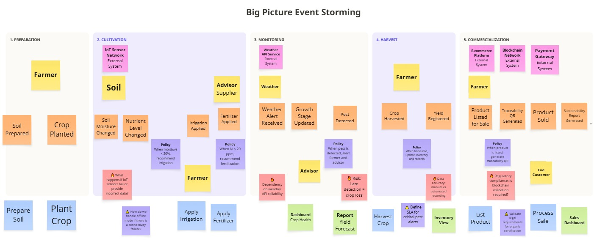

### 2.3.6. Ubiquitous Language

El siguiente glosario reúne los términos del dominio de negocio de TerraTech, alineados con los bounded contexts definidos en 2.6. Los términos se presentan en inglés, con su equivalente en español, y su definición en español, evitando ambigüedades en la comunicación entre el equipo y los actores involucrados.

**Identity & Access Management**

| Term (English) | Término (Español) | Definición |
| :--- | :--- | :--- |
| User | Usuario | Persona que interactúa con la aplicación mediante una cuenta propia. |
| Credentials | Credenciales | Datos de acceso (correo y contraseña) que permiten autenticar al usuario. |
| Sign-Up | Registro | Proceso mediante el cual una persona crea una cuenta en la aplicación. |
| Sign-In | Inicio de sesión | Proceso de autenticación que valida las credenciales del usuario. |
| Session | Sesión | Periodo durante el cual el usuario autenticado mantiene acceso a la aplicación. |

**Analytics Management**

| Term (English) | Término (Español) | Definición |
| :--- | :--- | :--- |
| Report | Reporte | Resumen de métricas calculadas sobre el comportamiento de un dispositivo o cultivo. |
| Metric | Métrica | Valor cuantificable que describe el desempeño del cultivo o del dispositivo. |
| Mean Value | Valor promedio | Promedio estadístico de las mediciones de un periodo determinado. |
| Variance | Varianza | Medida de dispersión de las mediciones respecto a su promedio. |
| Standard Deviation | Desviación estándar | Medida de variabilidad de las mediciones de un periodo. |
| Technical Interpretation | Interpretación técnica | Conclusión, en lenguaje natural, sobre el significado de los datos analizados. |

**Monitoring Management**

| Term (English) | Término (Español) | Definición |
| :--- | :--- | :--- |
| Field | Parcela / campo | Extensión de terreno cultivada que el agricultor administra. |
| Device | Dispositivo / sensor | Equipo instalado en la parcela que mide las condiciones del suelo. |
| Soil Type | Tipo de suelo | Clasificación del suelo de una parcela. |
| Field Size | Extensión de la parcela | Superficie del campo expresada en metros cuadrados. |
| Location | Ubicación | Coordenadas geográficas donde se encuentra la parcela. |
| Device Status | Estado del dispositivo | Condición operativa del dispositivo (en línea, fuera de línea, batería baja). |
| Last Sync | Última sincronización | Momento en que el dispositivo envió datos por última vez. |

**Stock Management**

| Term (English) | Término (Español) | Definición |
| :--- | :--- | :--- |
| Inventory | Inventario | Registro de los insumos que un usuario tiene disponibles. |
| Product | Producto | Insumo agrícola que se comercializa o se almacena. |
| Stock | Existencias | Cantidad disponible de un producto. |
| Stock Quantity | Cantidad en stock | Número de unidades disponibles de un producto. |
| Warehouse Location | Ubicación en almacén | Lugar físico donde se resguarda el producto. |

**Notification Management**

| Term (English) | Término (Español) | Definición |
| :--- | :--- | :--- |
| Notification | Notificación | Mensaje generado por el sistema para informar al usuario. |
| Alert | Alerta | Notificación prioritaria sobre una condición crítica del cultivo o del dispositivo. |
| Read | Leída | Estado que indica que el usuario ya revisó la notificación. |
| Notification Channel | Canal de notificación | Medio por el que se entrega la notificación (aplicación móvil o correo electrónico). |

## 2.4. Requirements Specification

A partir del análisis de entrevistas, del Needfinding y de las decisiones de diseño táctico, el equipo especifica los requisitos del producto digital TerraTech. Las historias se organizan en Epics funcionales que se relacionan, cuando corresponde, con los bounded contexts documentados en 2.6, y sus criterios de aceptación se redactan en formato Given–When–Then, en presente y tercera persona, sin referencias a detalles de interfaz y de forma verificable.

### 2.4.1. User Stories

La siguiente tabla resume los Epics identificados y las historias que agrupa cada uno. La prioridad se expresa como Alta, Media o Baja según el valor para el negocio y su dependencia con el resto de funcionalidades.

| EPIC ID | Nombre | Bounded Context / categoría | User Stories |
| :--- | :--- | :--- | :--- |
| EPIC01 | Landing Page & Marketing | Capacidad de marketing (Landing Page) | US01, US02, US03, US04, US05 |
| EPIC02 | Autenticación y Gestión de Usuarios (IAM) | Identity & Access Management | US06, US07, US08, US09 |
| EPIC03 | Dashboard de Monitoreo en Tiempo Real (Monitoring) | Monitoring Management | US10, US11, US12 |
| EPIC04 | Mapa de Fertilidad (Monitoring) | Monitoring Management | US13, US14 |
| EPIC05 | Motor de Recomendaciones (Monitoring) | Monitoring Management | US15, US16 |
| EPIC06 | Gestión de Sensores (Monitoring) | Monitoring Management | US17, US18 |
| EPIC07 | API RESTful | Transversal (Shared) | US19, US20, US21 |
| EPIC08 | Integración con Servicios Externos | Transversal (Shared) | US22, US23 |
| EPIC09 | Stock Management | Stock Management | US24, US25, US26 |
| EPIC10 | Notification Management | Notification Management | US27, US28, US29, US30, US31, US32 |
| EPIC11 | Community & Reputation | Capacidad posterior (sin BC modelado) | US33, US34, US35, US36 |
| EPIC12 | Analytics & Catalog | Analytics Management (Catalog como capacidad posterior) | US37, US38, US39, US40, US41 |
| EPIC13 | Configuración y Despliegue (Technical Stories) | Transversal (infraestructura) | TS01–TS05, TS08–TS11 |
| EPIC14 | Investigación y Viabilidad (Spike Stories) | Transversal (investigación) | SP01, SP02, SP03 |

#### EPIC01: Landing Page & Marketing

| Story ID | User | Priority | Título | Descripción | Acceptance Criteria |
| :--- | :--- | :---: | :--- | :--- | :--- |
| US01 | Visitante | Alta | Visualización del mensaje de valor | Como visitante, deseo comprender rápidamente qué ofrece TerraTech para evaluar si la solución responde a mi necesidad. | **Scenario 1: Visualización del mensaje principal** Given el visitante accede a la URL del Landing Page When la página termina de cargar Then se presenta el mensaje de valor de TerraTech y una acción para solicitar una demostración And la acción de solicitud está disponible desde la página principal sin necesidad de desplazamiento  **Scenario 2: Adaptación a pantallas pequeñas** Given el visitante accede desde un dispositivo móvil de 320px de ancho When la página se renderiza Then el contenido principal se adapta verticalmente sin desbordamiento horizontal |
| US02 | Visitante | Media | Conocimiento de las características de la solución | Como visitante, deseo conocer las características principales de TerraTech para determinar si satisface mis necesidades. | **Scenario 1: Presentación de características** Given el visitante ha cargado el Landing Page When consulta la sección de características Then se describen exactamente tres características: "Sensor de Humedad", "Sensor de Nutrientes" y "Alertas en Tiempo Real" And cada característica incluye un título y una descripción de máximo 150 caracteres |
| US03 | Visitante | Alta | Solicitud de demostración | Como visitante, deseo solicitar una demostración para recibir información personalizada sobre TerraTech. | **Scenario 1: Envío exitoso** Given el visitante completa los campos Nombre, Email, Teléfono y Tamaño de terreno en hectáreas When confirma el envío de la solicitud Then el sistema registra la solicitud y muestra una confirmación de recepción And los campos del formulario quedan vacíos  **Scenario 2: Campos obligatorios incompletos** Given el visitante omite el campo Email When intenta enviar la solicitud Then el sistema informa que el correo electrónico es obligatorio y no registra la solicitud  **Scenario 3: Formato de correo inválido** Given el visitante ingresa un correo con formato inválido When intenta enviar la solicitud Then el sistema informa que el correo electrónico no es válido y no registra la solicitud |
| US04 | Visitante | Baja | Consulta de términos y condiciones | Como visitante, deseo leer los términos y condiciones del servicio para conocer mis derechos y obligaciones al usar TerraTech. | **Scenario 1: Acceso desde el Landing Page** Given el visitante se encuentra en el Landing Page When solicita consultar los términos y condiciones Then el sistema presenta el documento completo con su fecha de última actualización  **Scenario 2: Acceso desde la aplicación móvil** Given el usuario ha iniciado sesión en la aplicación móvil When solicita consultar los términos y condiciones Then el sistema presenta el documento sin abandonar la aplicación |
| US05 | Visitante | Media | Información del proyecto y del equipo | Como visitante, deseo conocer el propósito del proyecto y al equipo responsable para generar confianza en la solución. | **Scenario 1: Información del proyecto** Given el visitante accede al Landing Page When consulta la sección sobre el proyecto Then se presenta la misión y visión de TerraTech junto con el nombre de la startup NovaTech  **Scenario 2: Información del equipo** Given el visitante consulta la sección del equipo Then se muestran las fotografías, nombres completos, roles y especialidad de los integrantes del equipo de desarrollo |

#### EPIC02: Autenticación y Gestión de Usuarios (IAM)

| Story ID | User | Priority | Título | Descripción | Acceptance Criteria |
| :--- | :--- | :---: | :--- | :--- | :--- |
| US06 | Agricultor | Alta | Registro de nuevo usuario | Como agricultor, deseo crear una cuenta en TerraTech para acceder a la aplicación y configurar mis parcelas. | **Scenario 1: Registro exitoso** Given el usuario accede al registro When ingresa Nombre (mínimo 2 caracteres), Email válido y Contraseña (mínimo 6 caracteres) confirmada correctamente And confirma el registro Then se crea la cuenta con rol "Agricultor" And el sistema envía un correo de verificación con enlace válido por 24 horas  **Scenario 2: Correo ya registrado** Given el usuario ingresa un correo que ya existe When confirma el registro Then el sistema informa que el correo ya está registrado y ofrece la opción de recuperar la contraseña  **Scenario 3: Contraseñas no coinciden** Given el usuario ingresa contraseñas distintas When confirma el registro Then el sistema informa que las contraseñas no coinciden y no crea la cuenta |
| US07 | Usuario registrado | Alta | Inicio de sesión | Como usuario registrado, deseo iniciar sesión con mis credenciales para acceder a mi información y a los datos de mis cultivos. | **Scenario 1: Inicio de sesión exitoso** Given el usuario se encuentra en la pantalla de inicio de sesión When ingresa email y contraseña válidos y verificados And confirma el inicio de sesión Then el sistema emite un token JWT válido por 8 horas And el usuario accede a su información personalizada  **Scenario 2: Credenciales incorrectas** Given el usuario ingresa una contraseña incorrecta When confirma el inicio de sesión Then el sistema informa que las credenciales son inválidas y no emite token  **Scenario 3: Correo no verificado** Given el usuario se registró pero no verificó su correo When intenta iniciar sesión con credenciales correctas Then el sistema indica que debe verificar su correo electrónico y ofrece reenviar el enlace de verificación |
| US08 | Usuario registrado | Media | Recuperación de contraseña | Como usuario registrado, deseo recuperar mi contraseña olvidada para volver a acceder a mi cuenta. | **Scenario 1: Envío del enlace de recuperación** Given el usuario solicita recuperar su contraseña When ingresa su correo registrado y confirma el envío Then el sistema envía un enlace con token único válido por 1 hora And informa que debe revisar su correo para restablecer la contraseña  **Scenario 2: Restablecimiento exitoso** Given el usuario accede al enlace de recuperación con un token válido When ingresa y confirma la nueva contraseña Then el sistema actualiza la contraseña almacenada de forma cifrada And informa que la contraseña fue actualizada  **Scenario 3: Token expirado o inválido** Given el usuario accede a un enlace de recuperación con token inválido o expirado When intenta restablecer su contraseña Then el sistema informa que el enlace expiró y permite solicitar uno nuevo |
| US09 | Agricultor | Media | Gestión del perfil de usuario | Como agricultor, deseo consultar y actualizar mi perfil para mantener vigente mi información personal y la de mi parcela. | **Scenario 1: Consulta del perfil** Given el usuario ha iniciado sesión When accede a su perfil Then el sistema muestra Nombre, Email (no editable), Teléfono, Ubicación y Tamaño del terreno, junto con la fecha de registro  **Scenario 2: Actualización exitosa** Given el usuario modifica su número de teléfono When confirma la actualización Then el sistema guarda el nuevo valor y confirma la actualización  **Scenario 3: Validación del tamaño del terreno** Given el usuario ingresa un tamaño de terreno negativo When confirma la actualización Then el sistema informa que el tamaño debe ser mayor a 0 y no actualiza el perfil |

#### EPIC03: Dashboard de Monitoreo en Tiempo Real (Monitoring)

| Story ID | User | Priority | Título | Descripción | Acceptance Criteria |
| :--- | :--- | :---: | :--- | :--- | :--- |
| US10 | Agricultor | Alta | Consulta de indicadores clave | Como agricultor, deseo consultar en tiempo real los valores de humedad, nutrientes y temperatura del suelo para decidir oportunamente el riego y la fertilización. | **Scenario 1: Consulta inicial** Given el agricultor ha iniciado sesión y tiene al menos un sensor asociado When accede al dashboard Then el sistema muestra los valores actuales de humedad (%), nutrientes (N-P-K en ppm) y temperatura del suelo (°C) And indica la fecha y hora de la última actualización de cada valor  **Scenario 2: Actualización automática** Given el dashboard está visible y existe conexión con el servicio de datos When el backend recibe una nueva lectura del sensor Then los valores mostrados se actualizan sin intervención del usuario  **Scenario 3: Sensor sin conexión** Given un sensor no envía datos durante más de 30 minutos When el sistema actualiza la información Then el sistema advierte que los datos están desactualizados por falta de conexión del sensor |
| US11 | Agricultor | Media | Selección de zona o sensor específico | Como agricultor, deseo seleccionar una parcela o sensor específico para revisar los datos de esa zona de mi cultivo. | **Scenario 1: Selección de zona** Given el agricultor tiene configuradas zonas con nombres When selecciona una zona Then el sistema muestra los indicadores correspondientes a los sensores de esa zona  **Scenario 2: Actualización de indicadores por zona** Given el dashboard muestra los datos de una zona When el agricultor selecciona otra zona Then los indicadores y el histórico se actualizan con los datos de la nueva zona And el sistema registra el cambio de zona consultada |
| US12 | Agricultor | Media | Consulta del histórico de datos | Como agricultor, deseo consultar el histórico de humedad de mi cultivo para identificar tendencias y anticipar decisiones. | **Scenario 1: Rango por defecto** Given el agricultor consulta el histórico When el sistema carga la información Then se presentan los valores de humedad de los últimos 7 días And se indica el umbral mínimo configurado como referencia  **Scenario 2: Cambio de rango** Given el agricultor consulta el histórico de 7 días When selecciona un rango de 30 días Then el sistema actualiza la información en menos de 2 segundos  **Scenario 3: Detalle de un punto del histórico** Given el histórico está visible When el agricultor consulta un punto específico Then el sistema informa la fecha exacta, el valor de humedad y si existió una alerta en esa fecha |

#### EPIC04: Mapa de Fertilidad (Monitoring)

| Story ID | User | Priority | Título | Descripción | Acceptance Criteria |
| :--- | :--- | :---: | :--- | :--- | :--- |
| US13 | Agricultor | Media | Identificación de zonas fértiles | Como agricultor, deseo identificar las zonas más fértiles de mi terreno para planificar la rotación de cultivos y optimizar la siembra. | **Scenario 1: Visualización de fertilidad por zona** Given el agricultor accede a la sección del mapa de fertilidad y existe al menos una zona con datos de sensores When el sistema carga el mapa Then cada zona se representa según su nivel de fertilidad: - Óptimo: humedad mayor a 60% y nutrientes en rango óptimo - Moderado: humedad entre 30% y 60% o nutrientes en rango medio - Crítico: humedad menor a 30% o nutrientes bajos And el agricultor puede consultar el detalle de cada zona  **Scenario 2: Acciones sugeridas por nivel** Given el mapa de fertilidad está visible When el agricultor consulta la referencia de niveles Then el sistema presenta, para cada nivel, la acción sugerida correspondiente (mantener el plan actual, monitorear en 12 horas o regar y fertilizar en las próximas 2 horas) |
| US14 | Agricultor | Baja | Navegación en el mapa | Como agricultor, deseo acercar y desplazarme por el mapa para examinar zonas específicas con mayor detalle. | **Scenario 1: Acercamiento y alejamiento** Given el mapa de fertilidad está visible When el agricultor acerca o aleja la vista Then el mapa presenta mayor o menor nivel de detalle según la acción  **Scenario 2: Desplazamiento** Given el mapa se encuentra con alto nivel de detalle When el agricultor se desplaza por el mapa Then la vista se desplaza y mantiene el nivel de acercamiento seleccionado |

#### EPIC05: Motor de Recomendaciones (Monitoring)

| Story ID | User | Priority | Título | Descripción | Acceptance Criteria |
| :--- | :--- | :---: | :--- | :--- | :--- |
| US15 | Agricultor | Alta | Recomendación automática de riego | Como agricultor, deseo recibir una recomendación automática sobre cuándo regar para optimizar el uso del agua y evitar el estrés hídrico. | **Scenario 1: Humedad críticamente baja** Given el agricultor ha iniciado sesión y el sensor de la zona "Norte" reporta 25% de humedad And el umbral mínimo configurado para la zona es 30% When el sistema procesa la última lectura Then se genera una recomendación urgente de riego para la zona Norte con una duración sugerida de 25 minutos And se envía una notificación al dispositivo del agricultor si las notificaciones están habilitadas  **Scenario 2: Humedad adecuada** Given el sensor de la zona "Sur" reporta 65% de humedad y los umbrales son mínimo 30% y máximo 80% When el sistema procesa la lectura Then se genera un aviso informativo que indica que no es necesario regar And no se envía notificación al dispositivo  **Scenario 3: Humedad excesiva** Given el sensor reporta 85% de humedad y el umbral máximo es 80% When el sistema evalúa la condición Then se genera una recomendación de suspender el riego por riesgo de pudrición de raíces |
| US16 | Agricultor | Alta | Recomendación automática de fertilización | Como agricultor, deseo recibir una recomendación sobre qué nutriente aplicar y en qué cantidad para evitar la sobrefertilización y reducir costos. | **Scenario 1: Deficiencia de nitrógeno** Given el sensor de la zona "Este" reporta N=15 ppm, P=25 ppm y K=40 ppm And los rangos óptimos son N (20-40 ppm), P (15-30 ppm) y K (30-50 ppm) When el sistema evalúa los datos Then se genera una recomendación de aplicar 8 kg/ha de Nitrógeno (Urea 46-0-0) para la zona Este And la recomendación se registra con tipo "fertilizer"  **Scenario 2: Nutrientes en niveles óptimos** Given la zona "Oeste" reporta N=35 ppm, P=22 ppm y K=45 ppm When el agricultor consulta las recomendaciones Then el sistema informa que los niveles son adecuados y sugiere mantener el plan de fertilización  **Scenario 3: Deficiencias múltiples** Given la zona "Norte" reporta N=10 ppm, P=8 ppm y K=20 ppm When el sistema procesa los datos Then se genera una recomendación prioritaria de aplicar 12 kg/ha de NPK 20-20-20 por deficiencias múltiples |

#### EPIC06: Gestión de Sensores (Monitoring)

| Story ID | User | Priority | Título | Descripción | Acceptance Criteria |
| :--- | :--- | :---: | :--- | :--- | :--- |
| US17 | Agricultor | Alta | Registro de un nuevo sensor | Como agricultor, deseo registrar un nuevo sensor en mi cuenta para monitorear una nueva zona o cultivo. | **Scenario 1: Registro exitoso** Given el agricultor accede a la gestión de sensores When registra un dispositivo con código único (formato TT-XXXXXX), nombre de la zona y cultivo actual And confirma el registro Then el sensor queda asociado a su cuenta con estado "Activo" And el sistema comienza a recibir datos en los siguientes 5 minutos  **Scenario 2: Código inválido o inexistente** Given el agricultor ingresa un código que no existe en el inventario global When confirma el registro Then el sistema informa que el código es inválido y no asocia el sensor  **Scenario 3: Código ya registrado** Given el código ingresado ya está asociado a otra cuenta When el agricultor confirma el registro Then el sistema informa que el sensor ya está registrado por otro usuario y no lo asocia |
| US18 | Agricultor | Media | Configuración de umbrales de alerta | Como agricultor, deseo configurar umbrales personalizados de humedad y nutrientes para recibir alertas cuando los valores salgan del rango deseado. | **Scenario 1: Configuración por zona** Given el agricultor se encuentra en la configuración de alertas de una zona When establece humedad mínima de 25% y máxima de 75% And confirma la configuración Then el sistema guarda los umbrales para esa zona y confirma la actualización  **Scenario 2: Alerta por umbral personalizado** Given el umbral máximo de la zona "Centro" es 70% And el sensor reporta 72% de humedad When el sistema evalúa la condición Then se genera una alerta que indica humedad excesiva y sugiere suspender el riego por 12 horas  **Scenario 3: Restablecimiento de valores** Given el agricultor ha modificado los umbrales de una zona When solicita restablecer los valores por defecto Then el sistema restaura los umbrales predeterminados y confirma la acción |

#### EPIC07: API RESTful

| Story ID | User | Priority | Título | Descripción | Acceptance Criteria |
| :--- | :--- | :---: | :--- | :--- | :--- |
| US19 | Developer | Media | Documentación interactiva de la API | Como developer, deseo consultar la documentación de la API para comprender cómo consumir sus endpoints correctamente. | **Scenario 1: Consulta de la documentación** Given la API del backend se encuentra desplegada en el entorno de desarrollo When el developer accede a la documentación interactiva Then el sistema presenta los endpoints agrupados por controlador And cada endpoint incluye método HTTP, ruta, parámetros y ejemplos de solicitud y respuesta  **Scenario 2: Prueba de un endpoint** Given el developer cuenta con un token JWT válido When ejecuta la consulta de un sensor específico desde la documentación Then el sistema responde con el código HTTP y el JSON correspondiente  **Scenario 3: Actualización de la documentación** Given se incorpora un nuevo endpoint al backend When el equipo genera una nueva versión del proyecto Then la documentación se actualiza automáticamente sin cambios manuales |
| US20 | Developer | Media | Consulta de datos de un sensor | Como developer, deseo consumir un endpoint que devuelva los últimos valores de un sensor para mostrarlos en la aplicación móvil. | **Scenario 1: Consulta exitosa** Given existe un sensor con identificador sens-001 asociado a una parcela y con lecturas de las últimas 24 horas When se consulta el endpoint con un token válido Then el sistema responde HTTP 200 con el identificador del sensor, la parcela, la humedad, los nutrientes (N-P-K), la temperatura, la fecha de la lectura y el nivel de batería  **Scenario 2: Sensor no encontrado** Given no existe un sensor con el identificador consultado When se ejecuta la consulta Then el sistema responde HTTP 404 con un mensaje que indica que el sensor no existe  **Scenario 3: Lecturas desactualizadas** Given el sensor consultado no registra lecturas recientes When se ejecuta la consulta Then el sistema responde HTTP 200 e indica que los datos están desactualizados junto con el tiempo transcurrido desde la última lectura |
| US21 | Developer | Media | Registro de recomendaciones mediante webhook | Como developer, deseo implementar un endpoint que reciba las recomendaciones del motor de análisis para almacenarlas y mostrarlas en la aplicación. | **Scenario 1: Recepción válida** Given el motor de análisis envía una recomendación con zona, acción, duración, prioridad y motivo And la solicitud incluye una clave de API válida When el sistema procesa la solicitud Then el sistema almacena la recomendación y responde HTTP 201 con la ubicación del recurso creado And la recomendación queda disponible para el agricultor  **Scenario 2: Datos incompletos** Given la solicitud no incluye la zona de la recomendación When el sistema procesa la solicitud Then el sistema responde HTTP 400 con el detalle del campo faltante y no almacena la recomendación  **Scenario 3: Clave de API inválida** Given la solicitud no incluye la clave de API o incluye una incorrecta When el sistema procesa la solicitud Then el sistema responde HTTP 401 y no procesa la recomendación |

#### EPIC08: Integración con Servicios Externos

| Story ID | User | Priority | Título | Descripción | Acceptance Criteria |
| :--- | :--- | :---: | :--- | :--- | :--- |
| US22 | Agricultor | Media | Consulta del pronóstico del clima | Como agricultor, deseo consultar el pronóstico del clima junto con los datos de mi suelo para coordinar el riego con las lluvias previstas. | **Scenario 1: Consulta del pronóstico** Given el agricultor ha iniciado sesión y su perfil tiene una ubicación configurada When consulta el pronóstico en su panel principal Then el sistema presenta la probabilidad de lluvia de las próximas 24 horas, la temperatura actual y prevista, la humedad ambiental y la velocidad del viento And los datos provienen de un servicio externo de clima  **Scenario 2: Actualización automática** Given el pronóstico está visible y la última actualización tiene más de 3 horas When el sistema ejecuta la actualización periódica Then el pronóstico se actualiza sin intervención del agricultor  **Scenario 3: Recomendación combinada** Given el pronóstico indica 80% de probabilidad de lluvia con 10 mm en las próximas 6 horas And el sensor de humedad reporta 35% When el sistema evalúa ambos factores Then el sistema recomienda suspender el riego planificado para ese día y estima un ahorro aproximado de 500 litros |
| US23 | Agricultor | Baja | Consulta de imágenes satelitales | Como agricultor, deseo consultar imágenes satelitales de mi parcela para identificar visualmente zonas con problemas de crecimiento. | **Scenario 1: Consulta de la imagen más reciente** Given el agricultor accede a la sección de imágenes satelitales When el sistema obtiene la imagen más reciente del servicio externo Then el sistema presenta la imagen con su fecha de captura And el agricultor puede alternar entre la vista satelital y el mapa base  **Scenario 2: Consulta histórica** Given el agricultor consulta una fecha anterior When el sistema obtiene la imagen disponible más cercana a esa fecha Then el sistema presenta la imagen e informa la fecha y el porcentaje de nubosidad And si no existen imágenes para la fecha, el sistema informa la situación  **Scenario 3: Comparación de periodos** Given el agricultor activa la comparación entre dos fechas When el sistema presenta ambas imágenes Then el agricultor puede comparar los cambios en la vegetación entre los dos periodos |

#### EPIC09: Stock Management

| Story ID | User | Priority | Título | Descripción | Acceptance Criteria |
| :--- | :--- | :---: | :--- | :--- | :--- |
| US24 | Agricultor | Media | Registro de insumos | Como agricultor, deseo registrar los insumos que tengo disponibles para llevar un control de los productos destinados a mis cultivos. | **Scenario 1: Registro exitoso** Given el agricultor accede a su inventario When registra un insumo con nombre, cantidad, unidad de medida, precio unitario y proveedor opcional And confirma el registro Then el insumo queda registrado en el inventario y el sistema confirma la operación  **Scenario 2: Nombre obligatorio** Given el agricultor intenta registrar un insumo sin nombre When confirma el registro Then el sistema informa que el nombre es obligatorio y no registra el insumo  **Scenario 3: Cantidad inválida** Given el agricultor ingresa una cantidad negativa When confirma el registro Then el sistema informa que la cantidad debe ser mayor o igual a cero y no registra el insumo |
| US25 | Agricultor | Media | Consulta y filtrado del inventario | Como agricultor, deseo consultar mi inventario y filtrarlo por nombre o disponibilidad para encontrar rápidamente lo que necesito. | **Scenario 1: Consulta del inventario** Given el agricultor accede a su inventario When el sistema carga la información Then se presenta la lista de insumos con nombre, cantidad, unidad, precio unitario y proveedor And la lista se organiza en páginas de 10 elementos  **Scenario 2: Filtro por nombre** Given el agricultor consulta su inventario When busca por el nombre de un insumo Then el sistema presenta únicamente los insumos cuyo nombre coincide con la búsqueda  **Scenario 3: Filtro por stock bajo** Given el agricultor consulta su inventario When aplica el filtro de stock bajo Then el sistema presenta los insumos con cantidad inferior al umbral configurado e indica su condición |
| US26 | Agricultor | Baja | Actualización del stock de insumos | Como agricultor, deseo aumentar o disminuir la cantidad de un insumo para reflejar el consumo real o las nuevas compras. | **Scenario 1: Descuento por consumo** Given el agricultor consulta un insumo de su inventario When registra el descuento de una cantidad And confirma la operación Then el sistema reduce el stock en la cantidad indicada y confirma la actualización  **Scenario 2: Aumento por compra** Given el agricultor registra una nueva compra de un insumo When ingresa la cantidad y el precio de compra And confirma la operación Then el sistema aumenta el stock y registra el movimiento en el historial  **Scenario 3: Stock insuficiente** Given el insumo tiene 10 unidades disponibles y el agricultor intenta descontar 15 When confirma la operación Then el sistema informa que el stock es insuficiente y no realiza el descuento |

#### EPIC10: Notification Management

| Story ID | User | Priority | Título | Descripción | Acceptance Criteria |
| :--- | :--- | :---: | :--- | :--- | :--- |
| US27 | Agricultor | Alta | Consulta de notificaciones de los sensores | Como agricultor, deseo recibir y consultar las notificaciones generadas por los sensores para actuar ante condiciones críticas. | **Scenario 1: Consulta de notificaciones** Given el agricultor ha iniciado sesión When consulta sus notificaciones Then el sistema presenta las notificaciones no leídas primero And cada notificación indica su tipo, mensaje, fecha, hora y estado  **Scenario 2: Notificación por humedad baja** Given el sensor de la zona "Norte" reporta 25% de humedad, por debajo del umbral crítico When el sistema procesa la lectura Then el sistema genera una notificación que informa la humedad registrada y recomienda regar en las próximas 2 horas And la notificación se envía al panel del agricultor y a su correo si el canal está habilitado  **Scenario 3: Marcado como leída** Given el agricultor consulta una notificación no leída When abre su detalle Then el sistema marca la notificación como leída y actualiza el contador de notificaciones pendientes |
| US28 | Agricultor | Media | Configuración de preferencias de notificaciones | Como agricultor, deseo configurar qué notificaciones recibo y por qué canales para ajustar la aplicación a mis necesidades. | **Scenario 1: Habilitar o deshabilitar un tipo** Given el agricultor accede a la configuración de notificaciones When desactiva las notificaciones de humedad Then el sistema deja de enviar ese tipo de notificaciones y confirma la actualización  **Scenario 2: Selección de canales** Given el agricultor configura sus canales de notificación When habilita la aplicación móvil y el correo electrónico Then el sistema envía las alertas por ambos canales y confirma la actualización  **Scenario 3: Umbral personalizado** Given el agricultor establece un umbral mínimo de humedad de 35% When el sensor reporta 32% Then el sistema genera la alerta correspondiente And si el sensor reporta 40%, el sistema no genera la alerta |
| US29 | Proveedor | Media | Alertas de interés sobre productos | Como proveedor, deseo recibir alertas cuando el interés por un producto supere un umbral para anticipar la revisión de su disponibilidad. | **Scenario 1: Interés alto** Given el proveedor configuró un umbral de interés de 100 consultas mensuales When las consultas del mes superan ese umbral Then el sistema genera una notificación que informa las consultas registradas y sugiere revisar la disponibilidad del producto  **Scenario 2: Producto sin consultas** Given un producto no registra consultas en los últimos 30 días When el sistema detecta la inactividad Then el sistema genera una notificación que sugiere revisar su publicación o promover el producto  **Scenario 3: Configuración del umbral** Given el proveedor accede a la configuración de notificaciones When establece un umbral de interés de 50 consultas para un producto Then el sistema genera alertas solo cuando las consultas superan ese umbral |
| US30 | Proveedor | Baja | Notificaciones de nuevas reseñas | Como proveedor, deseo recibir notificaciones cuando un agricultor publique una reseña sobre mis productos para responder oportunamente. | **Scenario 1: Reseña positiva** Given un agricultor publica una reseña con calificación de 4 o 5 estrellas sobre un producto del proveedor When el sistema registra la reseña Then el proveedor recibe una notificación con el producto, la calificación y el comentario And la notificación permite acceder al detalle de la reseña  **Scenario 2: Reseña negativa** Given un agricultor publica una reseña con calificación de 1 o 2 estrellas When el sistema registra la reseña Then el proveedor recibe una notificación prioritaria con el producto, la calificación y el comentario And la notificación permite responder a la reseña |
| US31 | Cliente final | Baja | Notificaciones de nuevos productos de interés | Como cliente final, deseo recibir notificaciones cuando se publique un producto que coincida con mis intereses para conocer las novedades disponibles. | **Scenario 1: Nuevo producto en una categoría de interés** Given el cliente marcó "Frutas" como categoría de interés When un agricultor publica un producto de esa categoría Then el cliente recibe una notificación con el nombre del producto y un acceso a su detalle  **Scenario 2: Nuevo producto en una región de interés** Given el cliente seleccionó "Huánuco" como región de interés When se publica un producto de esa región Then el cliente recibe una notificación con la información del producto  **Scenario 3: Configuración de intereses** Given el cliente accede a la configuración de sus intereses When selecciona categorías y regiones Then el sistema guarda las preferencias y envía solo las notificaciones que coinciden con ellas |
| US32 | Cliente final | Baja | Notificaciones de novedades y disponibilidad | Como cliente final, deseo recibir avisos cuando un producto de mi interés cambie de precio o disponibilidad para aprovechar la oportunidad. | **Scenario 1: Cambio de precio** Given un producto marcado como favorito actualiza su precio publicado When el sistema registra el cambio Then el cliente recibe una notificación con el producto y el nuevo precio  **Scenario 2: Cambio de disponibilidad** Given la disponibilidad publicada de un producto favorito cambia When el sistema detecta el cambio Then el cliente recibe una notificación que informa la nueva disponibilidad  **Scenario 3: Gestión de favoritos** Given el cliente consulta el detalle de un producto When agrega el producto a sus favoritos Then el sistema comienza a enviarle notificaciones de precio y disponibilidad de ese producto |

#### EPIC11: Community & Reputation

| Story ID | User | Priority | Título | Descripción | Acceptance Criteria |
| :--- | :--- | :---: | :--- | :--- | :--- |
| US33 | Proveedor | Media | Consulta de comentarios y calificaciones | Como proveedor, deseo consultar los comentarios y calificaciones sobre mis productos para conocer la percepción de los agricultores y mejorar mi oferta. | **Scenario 1: Consulta de comentarios** Given el proveedor consulta la comunidad y selecciona un producto de su catálogo When el sistema carga la información Then se presenta la lista de comentarios con nombre del agricultor, calificación, texto y fecha And los comentarios se ordenan del más reciente al más antiguo  **Scenario 2: Filtro por calificación** Given el proveedor consulta los comentarios de un producto When aplica el filtro de 5 estrellas Then el sistema presenta únicamente los comentarios con esa calificación y actualiza el contador  **Scenario 3: Respuesta a un comentario** Given el proveedor consulta un comentario de un agricultor When publica una respuesta Then el sistema registra la respuesta debajo del comentario original y notifica al agricultor |
| US34 | Proveedor | Baja | Consulta de la reputación de productos | Como proveedor, deseo consultar un resumen de la reputación de mis productos para identificar oportunidades de mejora. | **Scenario 1: Resumen por producto** Given el proveedor accede a la sección de reputación When el sistema carga la información Then se presenta, por cada producto, el nombre, la calificación promedio, el número de reseñas y la distribución de calificaciones  **Scenario 2: Productos con baja calificación** Given el proveedor tiene productos con calificación promedio menor a 3 estrellas When consulta el resumen de reputación Then el sistema resalta esos productos y sugiere revisar los comentarios negativos  **Scenario 3: Notificación de nueva reseña** Given un agricultor publica una reseña sobre un producto del proveedor When el sistema registra la reseña Then el proveedor recibe una notificación y el contador de notificaciones se actualiza |
| US35 | Cliente final | Media | Publicación de reseñas de productos | Como cliente final, deseo publicar una reseña y calificación sobre un producto para compartir mi experiencia con otros compradores. | **Scenario 1: Publicación exitosa** Given el cliente ha iniciado sesión y consultó el producto When publica una reseña con calificación de 1 a 5 estrellas y un texto de entre 10 y 500 caracteres Then el sistema registra la reseña y la presenta en el detalle del producto  **Scenario 2: Texto demasiado corto** Given el cliente ingresa un texto de menos de 10 caracteres When intenta publicar la reseña Then el sistema informa que la reseña debe tener al menos 10 caracteres y no la publica  **Scenario 3: Edición o eliminación** Given el cliente ha publicado una reseña previamente When modifica su contenido o solicita eliminarla Then el sistema actualiza o elimina la reseña y confirma la operación |
| US36 | Cliente final | Media | Consulta de reseñas de otros compradores | Como cliente final, deseo consultar las reseñas y calificaciones de otros compradores para evaluar la calidad de un producto antes de comprarlo. | **Scenario 1: Consulta de reseñas** Given el cliente consulta el detalle de un producto When el sistema carga la sección de reseñas Then se presenta la lista de reseñas con nombre del comprador, calificación, fecha, texto y fotografía si existe And las reseñas se ordenan de la más reciente a la más antigua  **Scenario 2: Resumen de calificaciones** Given el cliente consulta las reseñas de un producto Then el sistema presenta la calificación promedio, el número total de reseñas y la distribución de estrellas  **Scenario 3: Filtro por calificación** Given el cliente consulta las reseñas de un producto When aplica un filtro por calificación Then el sistema presenta únicamente las reseñas con esa calificación y actualiza el contador |

#### EPIC12: Analytics & Catalog

| Story ID | User | Priority | Título | Descripción | Acceptance Criteria |
| :--- | :--- | :---: | :--- | :--- | :--- |
| US37 | Proveedor | Media | Consulta de productos con mayor interés | Como proveedor, deseo consultar los productos con mayor interés de los agricultores para orientar mi oferta. | **Scenario 1: Consulta del interés** Given el proveedor ha iniciado sesión con su rol When consulta la sección de analíticas de interés Then el sistema presenta una tabla con producto, consultas, favoritos, contactos y tendencia And la tabla se ordena por número de consultas de mayor a menor  **Scenario 2: Tendencia por producto** Given el proveedor consulta el interés por un producto específico When el sistema carga la información Then se presenta la evolución mensual de las consultas de los últimos 12 meses con los valores de cada periodo  **Scenario 3: Filtros de interés** Given el proveedor consulta la tabla de interés When aplica un filtro por región Then el sistema actualiza la información con las consultas de esa región |
| US38 | Proveedor | Baja | Consulta de zonas con mayor actividad | Como proveedor, deseo consultar las zonas con mayor interés por insumos para focalizar mi estrategia comercial. | **Scenario 1: Interés por región** Given el proveedor consulta la sección de zonas de interés When el sistema carga la información Then se presenta un mapa con las regiones diferenciadas por nivel de interés And cada región permite consultar el número de agricultores y los productos más consultados  **Scenario 2: Consulta de métricas** Given el proveedor consulta el mapa de interés When solicita la vista de tabla Then el sistema presenta región, agricultores activos, consultas, producto principal y contactos generados And la tabla permite ordenarse por cualquiera de sus campos  **Scenario 3: Exportación de datos** Given el proveedor consulta las analíticas de interés When solicita exportar la información Then el sistema genera un archivo CSV con los datos filtrados y la fecha de generación |
| US39 | Cliente final | Media | Consulta del catálogo de productos | Como cliente final, deseo consultar el catálogo de productos agrícolas con filtros por categoría, región y características registradas del producto para encontrar lo que busco. | **Scenario 1: Consulta del catálogo** Given el cliente accede al catálogo When el sistema carga la información Then se presentan los productos con imagen, nombre, precio, región de origen y calificación promedio  **Scenario 2: Filtros del catálogo** Given el cliente consulta el catálogo When aplica los filtros de categoría y región Then el sistema presenta únicamente los productos que coinciden con ambos filtros  **Scenario 3: Búsqueda por nombre** Given el cliente consulta el catálogo When busca un producto por su nombre Then el sistema presenta los productos cuyo nombre coincide con la búsqueda |
| US40 | Cliente final | Media | Consulta del detalle y la trazabilidad de un producto | Como cliente final, deseo consultar la información detallada de un producto, incluyendo su origen y trazabilidad, para tomar una decisión de compra informada. | **Scenario 1: Información del producto** Given el cliente selecciona un producto del catálogo When el sistema carga su detalle Then se presenta el nombre, las imágenes, el precio, la descripción, la región de origen, el nombre del agricultor, la información de trazabilidad y las prácticas de cultivo registradas  **Scenario 2: Consulta de la trazabilidad** Given el cliente consulta el detalle de un producto When accede a la sección de trazabilidad Then el sistema presenta la línea de tiempo con las fechas de siembra, cosecha, empaque, envío y llegada al almacén  **Scenario 3: Acciones sobre el producto** Given el cliente consulta el detalle de un producto When solicita contactar al agricultor Then el sistema habilita el contacto con el agricultor And la incorporación del producto a un carrito de compras se considera fuera del alcance de esta entrega |
| US41 | Proveedor | Media | Consulta de la información de los cultivos de los clientes | Como proveedor o asesor autorizado, deseo consultar la información registrada de los cultivos de mis clientes para sustentar mis recomendaciones de insumos. | **Scenario 1: Consulta autorizada** Given el proveedor cuenta con autorización de un agricultor para consultar la información de sus cultivos When consulta la información registrada Then el sistema presenta las parcelas, el cultivo, la humedad, los nutrientes y las alertas registradas del cliente  **Scenario 2: Consulta sin autorización** Given el proveedor no cuenta con autorización de un agricultor When intenta consultar la información de sus cultivos Then el sistema deniega el acceso y no muestra información del cliente  **Scenario 3: Consulta del histórico** Given el proveedor cuenta con autorización vigente When consulta el histórico de un cultivo de su cliente Then el sistema presenta la evolución de los indicadores y las recomendaciones registradas |

#### EPIC13: Configuración y Despliegue (Technical Stories)

| Story ID | User | Priority | Título | Descripción | Acceptance Criteria |
| :--- | :--- | :---: | :--- | :--- | :--- |
| TS01 | Developer | Media | Configuración de repositorios con GitFlow | Como developer, deseo que los repositorios sigan GitFlow y Conventional Commits para mantener un historial ordenado y facilitar el trabajo colaborativo. | **Scenario 1: Ramas del flujo de trabajo** Given se consultan las ramas de un repositorio del proyecto Then existen las ramas permanentes main y develop And las funcionalidades se desarrollan en ramas feature And la rama main solo recibe cambios mediante pull request con al menos una aprobación  **Scenario 2: Mensajes de commit** Given se revisa el historial de commits de un repositorio When se analizan los últimos mensajes registrados Then todos siguen el formato tipo(alcance): descripción  **Scenario 3: Plantilla de pull request** Given un developer crea una pull request hacia develop When se abre la solicitud Then se carga una plantilla con la descripción del cambio, su tipo, las pruebas ejecutadas y las evidencias correspondientes |
| TS02 | Developer | Media | Despliegue automático de los productos | Como developer, deseo que los cambios integrados se desplieguen automáticamente para mantener disponibles las versiones más recientes de los productos. | **Scenario 1: Despliegue del frontend** Given se integra un cambio en la rama main del repositorio del frontend When el servicio de despliegue detecta el cambio Then el sistema compila y publica la nueva versión en menos de 2 minutos And el equipo recibe una notificación del despliegue  **Scenario 2: Integración continua del backend** Given se integra un cambio en la rama main del repositorio del backend When el flujo de integración continua se ejecuta Then el sistema ejecuta las pruebas unitarias And si las pruebas pasan, compila y despliega la API And si alguna prueba falla, cancela el despliegue y notifica al equipo  **Scenario 3: Variables de entorno en el despliegue** Given la aplicación requiere variables de configuración When el servicio de despliegue compila el proyecto Then las variables se inyectan desde la configuración del servicio y no están incluidas en el repositorio |
| TS03 | Developer | Media | Configuración de la base de datos en la nube | Como developer, deseo contar con una base de datos PostgreSQL en la nube para persistir la información de usuarios, parcelas, dispositivos y recomendaciones. | **Scenario 1: Conexión desde la API** Given la API está configurada con la cadena de conexión del servicio de base de datos When el equipo ejecuta el proyecto en entorno local apuntando a la nube Then la API se conecta a la base de datos sin errores de conexión And el sistema registra la conexión establecida  **Scenario 2: Migraciones al iniciar** Given existen migraciones pendientes en el proyecto de acceso a datos When la API se inicia en el entorno de despliegue Then el sistema aplica las migraciones y actualiza el esquema de la base de datos  **Scenario 3: Copias de seguridad** Given la base de datos está en producción When el servicio ejecuta las tareas programadas Then el sistema genera copias de seguridad diarias con una retención mínima de 7 días And el equipo puede restaurar una copia desde el servicio de base de datos |
| TS04 | Developer | Media | Configuración de variables de entorno | Como developer, deseo utilizar variables de entorno para las configuraciones sensibles y evitar credenciales incluidas en el repositorio. | **Scenario 1: Configuración del frontend** Given el frontend requiere la URL de la API y una clave de servicio externo When se revisa el repositorio del frontend Then no existen claves incluidas en el código And existe un archivo de ejemplo con las variables requeridas And el archivo con valores locales está excluido del control de versiones  **Scenario 2: Configuración del backend** Given el backend requiere la cadena de conexión, la clave del servicio de clima y la clave de firma de tokens When se revisa la configuración del proyecto Then los valores sensibles se proporcionan mediante variables de entorno o secretos locales  **Scenario 3: Validación al iniciar** Given la API se inicia sin la clave de firma de tokens configurada When el sistema carga la configuración Then la API interrumpe el inicio con un mensaje que indica la variable faltante And no expone información sensible |
| TS05 | Developer | Alta | Implementación del servicio de autenticación | Como developer, deseo implementar endpoints seguros de registro e inicio de sesión para que la aplicación móvil gestione las sesiones de los usuarios. | **Scenario 1: Registro exitoso** Given se recibe una solicitud de registro con un correo único y una contraseña válida When la API verifica que el correo no está registrado And cifra la contraseña antes de almacenarla Then la API responde HTTP 201 con los datos del usuario registrado y un estado de éxito  **Scenario 2: Correo duplicado** Given se recibe una solicitud de registro con un correo ya existente When la API busca el correo en la base de datos y encuentra coincidencia Then la API responde HTTP 400 con un mensaje que indica que el correo ya está registrado y no almacena el usuario  **Scenario 3: Inicio de sesión exitoso** Given se recibe una solicitud de inicio de sesión con credenciales válidas When la API valida las credenciales Then la API responde HTTP 200 con los datos del usuario y el token de sesión  **Scenario 4: Credenciales inválidas** Given se recibe una solicitud de inicio de sesión con credenciales incorrectas When la API no encuentra coincidencia de credenciales Then la API responde con un estado de error y no emite token de sesión |
| TS08 | Developer | Media | Consulta de perfiles agrícolas | Como developer, deseo consultar un endpoint que devuelva la configuración de un perfil agrícola para utilizarla en la aplicación móvil. | **Scenario 1: Consulta exitosa** Given existe un perfil asociado a un terreno en la base de datos When se consulta el endpoint con un token válido Then la API responde HTTP 200 con el identificador del perfil, el usuario asociado, el nombre del terreno, el teléfono de contacto y los umbrales configurados  **Scenario 2: Perfil no encontrado** Given no existe un perfil con el identificador consultado When se ejecuta la consulta Then la API responde HTTP 404 con un mensaje que indica que el perfil no existe |
| TS09 | Developer | Media | Gestión del inventario de insumos | Como developer, deseo implementar endpoints para gestionar el inventario de insumos de los agricultores. | **Scenario 1: Registro de un insumo** Given un agricultor autenticado con perfil válido When se recibe una solicitud de registro con producto, perfil, cantidad y ubicación de almacén Then la API responde HTTP 201 con los datos del registro creado  **Scenario 2: Consulta del inventario** Given un agricultor autenticado registra al menos un insumo When se consulta el inventario Then la API responde HTTP 200 con la lista de insumos registrados  **Scenario 3: Actualización de stock** Given existe un insumo registrado When se recibe una solicitud de actualización con una nueva cantidad Then la API responde HTTP 200 con el insumo actualizado  **Scenario 4: Consulta de un insumo por identificador** Given existe un insumo registrado con un identificador conocido When se consulta ese identificador Then la API responde HTTP 200 con los datos del insumo |
| TS10 | Developer | Media | Consulta de reportes analíticos por dispositivo | Como developer, deseo consultar un endpoint que devuelva los reportes analíticos de un dispositivo para alimentar los gráficos de la aplicación móvil. | **Scenario 1: Consulta exitosa** Given existe un reporte asociado a un dispositivo en la base de datos When se consulta el endpoint con un token válido Then la API responde HTTP 200 con el identificador del reporte, el dispositivo, el tipo de reporte, el valor promedio, la varianza, la desviación estándar, la interpretación técnica y la fecha de generación  **Scenario 2: Reporte no encontrado** Given no existe un reporte para el dispositivo consultado When se ejecuta la consulta Then la API responde HTTP 404 con un mensaje que indica que el reporte no existe |
| TS11 | Developer | Media | Gestión de la comunidad y reseñas | Como developer, deseo implementar los endpoints del módulo de comunidad para gestionar perfiles públicos y reseñas de productos. | **Scenario 1: Creación de un perfil de comunidad** Given un usuario recién registrado desea activar su perfil en la comunidad When la API recibe el alias, la biografía pública y la visibilidad del perfil Then la API responde HTTP 201 con los datos del perfil creado  **Scenario 2: Consulta de un perfil público** Given existe un perfil de comunidad con identificador conocido When se consulta el perfil Then la API responde HTTP 200 con el alias, la puntuación de reputación, la biografía y la visibilidad  **Scenario 3: Actualización del perfil** Given un agricultor modifica su alias, su biografía y la visibilidad de su perfil When la API recibe la actualización Then la API responde HTTP 200 con los datos actualizados del perfil |

#### EPIC14: Investigación y Viabilidad (Spike Stories)

| Story ID | User | Priority | Título | Descripción | Acceptance Criteria |
| :--- | :--- | :---: | :--- | :--- | :--- |
| SP01 | Developer | Media | Viabilidad de la integración de sensores IoT | Como equipo de desarrollo, queremos investigar y prototipar la integración de los sensores IoT de TerraTech con la aplicación móvil para conocer sus implicaciones técnicas y el esfuerzo requerido. | **Contexto:** TerraTech utiliza sensores que registran humedad, nutrientes y temperatura del suelo. El equipo necesita definir cómo se transmiten las lecturas, cómo se reciben en la aplicación móvil y qué restricciones impone el entorno rural.  **Scenario 1: Revisión de la documentación del hardware** Given el equipo requiere comprender el funcionamiento de los sensores When revisa la documentación técnica de los dispositivos y del protocolo de comunicación Then el equipo documenta los formatos de transmisión, la frecuencia de envío y los requisitos de configuración en un informe compartido  **Scenario 2: Evaluación de compatibilidad con la aplicación móvil** Given la aplicación móvil se desarrolla con la tecnología definida por el equipo When se evalúa la recepción de los datos del sensor en un prototipo Then el equipo documenta las librerías necesarias, los requisitos de permisos y las limitaciones encontradas  **Scenario 3: Prueba de concepto** Given el equipo dispone de un sensor de prueba When construye un prototipo mínimo que recibe y presenta una lectura Then el prototipo funciona, queda registrado en una rama del repositorio y se referencia en el informe  **Scenario 4: Estimación del esfuerzo** Given el equipo identificó los componentes de la integración When desglosa las tareas y compara alternativas Then el informe incluye una estimación de esfuerzo y una recomendación de implementación  **Definition of Done:** el informe se comparte y revisa en una reunión del equipo, el prototipo está en una rama del repositorio y la investigación se completa dentro del sprint. |
| SP02 | Developer | Media | Viabilidad del almacenamiento local y la sincronización sin conexión | Como equipo de desarrollo, queremos investigar las alternativas de almacenamiento local y sincronización para que la aplicación móvil funcione con conectividad limitada. | **Contexto:** parte de los usuarios trabaja en zonas rurales con conectividad intermitente o nula. La aplicación debe permitir consultar información previamente descargada y actualizarla cuando se recupere la conexión.  **Scenario 1: Revisión de alternativas** Given el equipo requiere definir la estrategia de almacenamiento local When compara las alternativas disponibles para la tecnología móvil seleccionada Then el equipo documenta ventajas, limitaciones y esfuerzo de adopción de cada alternativa en un informe compartido  **Scenario 2: Prototipo de almacenamiento y consulta** Given el equipo seleccionó una alternativa When construye un prototipo que almacena localmente las últimas lecturas y las consulta sin conexión Then el prototipo funciona, queda registrado en una rama del repositorio y se referencia en el informe  **Scenario 3: Evaluación de la sincronización** Given el prototipo almacena información localmente When se restablece la conexión Then el equipo evalúa y documenta el mecanismo de sincronización, la resolución de conflictos y el consumo de datos  **Scenario 4: Estimación del esfuerzo** Given el equipo identificó los componentes de la estrategia When desglosa las tareas de implementación Then el informe incluye una estimación de esfuerzo y una recomendación técnica  **Definition of Done:** el informe se comparte y revisa en una reunión del equipo, el prototipo está en una rama del repositorio y la investigación se completa dentro del sprint. |
| SP03 | Developer | Media | Viabilidad de las notificaciones push | Como equipo de desarrollo, queremos investigar la integración de un servicio de notificaciones push para enviar alertas de los cultivos a los usuarios. | **Contexto:** las alertas de humedad, nutrientes y clima requieren notificar al usuario incluso cuando la aplicación no está en uso. El equipo debe evaluar el servicio, los permisos y las limitaciones en dispositivos con restricciones de batería.  **Scenario 1: Evaluación del servicio de notificaciones** Given el equipo requiere enviar alertas al dispositivo móvil When revisa las opciones de servicios de notificaciones disponibles Then el equipo documenta la configuración requerida, los costos y las limitaciones de cada opción en un informe compartido  **Scenario 2: Prototipo de recepción de la alerta** Given el equipo seleccionó un servicio de notificaciones When construye un prototipo que recibe una alerta enviada desde el backend Then el prototipo funciona, queda registrado en una rama del repositorio y se referencia en el informe  **Scenario 3: Evaluación de permisos y segmentación** Given el prototipo recibe notificaciones When se prueban los permisos del sistema operativo y la segmentación por preferencias del usuario Then el equipo documenta el comportamiento observado y las limitaciones por tipo de dispositivo  **Scenario 4: Estimación del esfuerzo** Given el equipo identificó los componentes de la integración When desglosa las tareas de implementación Then el informe incluye una estimación de esfuerzo y una recomendación técnica  **Definition of Done:** el informe se comparte y revisa en una reunión del equipo, el prototipo está en una rama del repositorio y la investigación se completa dentro del sprint. |

### 2.4.2. Impact Mapping

El Impact Map de TerraTech se elaboró en UXPressia tomando como punto de partida los objetivos formulados en el Lean UX Process (1.2.2) y las fichas de User Persona de 2.3.1. Los Business Goals se expresan de forma SMART y los actores corresponden a los tres segmentos objetivo. La tabla siguiente resume la relación entre los objetivos, los cambios esperados en el comportamiento de los actores, los entregables del negocio y las historias que los habilitan.

| Business Goal | Actor / Persona | Impact | Deliverable | User Story |
| :--- | :--- | :--- | :--- | :--- |
| BG-01: Lograr que al menos el 80% de los agricultores participantes utilice TerraTech de forma regular durante los 3 meses posteriores al piloto. | Agricultor | Mejorar la gestión y el monitoreo del suelo en tiempo real. | Monitoreo de los parámetros del suelo en tiempo real con indicadores e histórico. | US10: Como agricultor, deseo consultar en tiempo real los valores de humedad, nutrientes y temperatura para decidir oportunamente el riego y la fertilización. US12: Como agricultor, deseo consultar el histórico de humedad para identificar tendencias. |
| BG-01: Lograr que al menos el 80% de los agricultores participantes utilice TerraTech de forma regular durante los 3 meses posteriores al piloto. | Agricultor | Tomar decisiones informadas para optimizar los cultivos. | Recomendaciones automáticas de riego y fertilización con análisis predictivo. | US15: Como agricultor, deseo recibir una recomendación automática de riego para optimizar el uso del agua. US16: Como agricultor, deseo recibir una recomendación de fertilización para evitar la sobrefertilización. |
| BG-02: Reducir entre 25% y 30% el uso innecesario de agua en los cultivos de los agricultores usuarios al finalizar el primer ciclo de uso. | Agricultor | Reducir costos de agua y fertilizantes. | Alertas configurables por umbral y recomendaciones basadas en el pronóstico del clima. | US18: Como agricultor, deseo configurar umbrales personalizados de humedad y nutrientes para recibir alertas. US22: Como agricultor, deseo consultar el pronóstico del clima junto con los datos de mi suelo para coordinar el riego. |
| BG-03: Reducir en 20% los costos relacionados con el uso innecesario de fertilizantes durante el primer ciclo de uso. | Agricultor | Aplicar fertilizantes según los niveles de nutrientes registrados del suelo. | Recomendaciones y alertas basadas en los niveles de nutrientes del suelo. | US16: Como agricultor, deseo recibir una recomendación de fertilización para evitar la sobrefertilización. US18: Como agricultor, deseo configurar umbrales personalizados de humedad y nutrientes para recibir alertas. |
| BG-04: Lograr que al menos el 70% de los proveedores participantes utilice la información registrada en TerraTech para sustentar sus recomendaciones durante el piloto. | Proveedor | Acceder a información registrada de los cultivos de sus clientes. | Consulta autorizada de la información de los cultivos de los clientes. | US41: Como proveedor o asesor autorizado, deseo consultar la información registrada de los cultivos de mis clientes para sustentar mis recomendaciones de insumos. |
| BG-04: Lograr que al menos el 70% de los proveedores participantes utilice la información registrada en TerraTech para sustentar sus recomendaciones durante el piloto. | Proveedor | Recomendar insumos adecuados con mayor precisión. | Recomendaciones de insumos basadas en el análisis de los datos del suelo. | US16: Como agricultor, deseo recibir una recomendación de fertilización para evitar la sobrefertilización. US29: Como proveedor, deseo recibir alertas cuando la demanda de un producto supere un umbral para anticipar la reposición de stock. |
| BG-05: Lograr que al menos el 60% de los clientes finales y compradores participantes consulte la información de trazabilidad al menos una vez durante el piloto. | Cliente final | Conocer el origen y la trazabilidad del producto. | Ficha de producto con información de origen y línea de tiempo del cultivo. | US40: Como cliente final, deseo consultar la información detallada de un producto, incluyendo su origen y trazabilidad, para tomar una decisión de compra informada. |
| BG-05: Lograr que al menos el 60% de los clientes finales y compradores participantes consulte la información de trazabilidad al menos una vez durante el piloto. | Cliente final | Tomar decisiones de compra con mayor confianza. | Catálogo de productos con reseñas y calificaciones de otros compradores. | US39: Como cliente final, deseo consultar el catálogo de productos con filtros por categoría, región y características registradas del producto. US36: Como cliente final, deseo consultar las reseñas de otros compradores para evaluar la calidad de un producto antes de comprarlo. |
| BG-06: Incrementar en 15% las ventas de los proveedores participantes durante el piloto. | Proveedor | Focalizar su oferta según el interés registrado por los agricultores. | Analítica de interés por producto y zona. | US37: Como proveedor, deseo consultar los productos con mayor interés de los agricultores para orientar mi oferta. US38: Como proveedor, deseo consultar las zonas con mayor interés por insumos para focalizar mi estrategia comercial. |

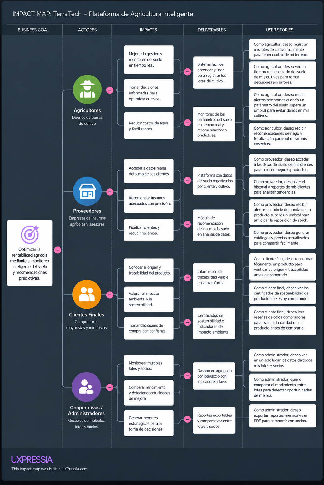

El enlace público del mapa se incorporará cuando el equipo habilite su compartición desde UXPressia.

### 2.4.3. Product Backlog

El Product Backlog prioriza las historias por valor para el negocio, considerando la Landing Page desde el primer sprint. La estimación utiliza la escala 1, 2, 3, 5 y 8, y la columna Sprint indica el sprint previsto para su desarrollo.

| # Orden | User Story ID | Título | Story Points (1 / 2 / 3 / 5 / 8) | Sprint |
| :---: | :--- | :--- | :---: | :---: |
| 1 | US01 | Visualización del mensaje de valor | 2 | Sprint 1 |
| 2 | US02 | Conocimiento de las características de la solución | 3 | Sprint 1 |
| 3 | US03 | Solicitud de demostración | 5 | Sprint 1 |
| 4 | US04 | Consulta de términos y condiciones | 1 | Sprint 1 |
| 5 | US05 | Información del proyecto y del equipo | 2 | Sprint 1 |
| 6 | US06 | Registro de nuevo usuario | 5 | Sprint 2 |
| 7 | US07 | Inicio de sesión | 3 | Sprint 2 |
| 8 | US08 | Recuperación de contraseña | 3 | Sprint 2 |
| 9 | US09 | Gestión del perfil de usuario | 2 | Sprint 2 |
| 10 | US10 | Consulta de indicadores clave | 5 | Sprint 2 |
| 11 | US11 | Selección de zona o sensor específico | 3 | Sprint 2 |
| 12 | US12 | Consulta del histórico de datos | 5 | Sprint 2 |
| 13 | US17 | Registro de un nuevo sensor | 3 | Sprint 2 |
| 14 | US13 | Identificación de zonas fértiles | 8 | Sprint 3 |
| 15 | US14 | Navegación en el mapa | 3 | Sprint 3 |
| 16 | US15 | Recomendación automática de riego | 5 | Sprint 3 |
| 17 | US16 | Recomendación automática de fertilización | 5 | Sprint 3 |
| 18 | US18 | Configuración de umbrales de alerta | 3 | Sprint 3 |
| 19 | US22 | Consulta del pronóstico del clima | 5 | Sprint 3 |
| 20 | US19 | Documentación interactiva de la API | 2 | Sprint 4 |
| 21 | US20 | Consulta de datos de un sensor | 3 | Sprint 4 |
| 22 | US21 | Registro de recomendaciones mediante webhook | 5 | Sprint 4 |
| 23 | US23 | Consulta de imágenes satelitales | 8 | Sprint 4 |
| 24 | US24 | Registro de insumos | 3 | Sprint 4 |
| 25 | US25 | Consulta y filtrado del inventario | 3 | Sprint 4 |
| 26 | US26 | Actualización del stock de insumos | 5 | Sprint 4 |
| 27 | US27 | Consulta de notificaciones de los sensores | 3 | Sprint 4 |
| 28 | US28 | Configuración de preferencias de notificaciones | 5 | Sprint 4 |
| 29 | US29 | Alertas de interés sobre productos | 3 | Sprint 5 |
| 30 | US30 | Notificaciones de nuevas reseñas | 3 | Sprint 5 |
| 31 | US31 | Notificaciones de nuevos productos de interés | 3 | Sprint 5 |
| 32 | US32 | Notificaciones de novedades y disponibilidad | 3 | Sprint 5 |
| 33 | US33 | Consulta de comentarios y calificaciones | 3 | Sprint 5 |
| 34 | US34 | Consulta de la reputación de productos | 3 | Sprint 5 |
| 35 | US35 | Publicación de reseñas de productos | 3 | Sprint 5 |
| 36 | US36 | Consulta de reseñas de otros compradores | 2 | Sprint 5 |
| 37 | US37 | Consulta de productos con mayor interés | 5 | Sprint 5 |
| 38 | US38 | Consulta de zonas con mayor actividad | 5 | Sprint 5 |
| 39 | US39 | Consulta del catálogo de productos | 5 | Sprint 5 |
| 40 | US40 | Consulta del detalle y la trazabilidad de un producto | 5 | Sprint 5 |
| 41 | US41 | Consulta de la información de los cultivos de los clientes | 5 | Sprint 5 |
| 42 | TS01 | Configuración de repositorios con GitFlow | 2 | Sprint 1 |
| 43 | TS02 | Despliegue automático de los productos | 3 | Sprint 1 |
| 44 | TS03 | Configuración de la base de datos en la nube | 3 | Sprint 1 |
| 45 | TS04 | Configuración de variables de entorno | 2 | Sprint 1 |
| 46 | TS05 | Implementación del servicio de autenticación | 8 | Sprint 2 |
| 47 | TS08 | Consulta de perfiles agrícolas | 3 | Sprint 5 |
| 48 | TS09 | Gestión del inventario de insumos | 5 | Sprint 5 |
| 49 | TS10 | Consulta de reportes analíticos por dispositivo | 3 | Sprint 5 |
| 50 | TS11 | Gestión de la comunidad y reseñas | 8 | Sprint 5 |
| 51 | SP01 | Viabilidad de la integración de sensores IoT | 3 | Sprint 3 |
| 52 | SP02 | Viabilidad del almacenamiento local y la sincronización sin conexión | 3 | Sprint 4 |
| 53 | SP03 | Viabilidad de las notificaciones push | 3 | Sprint 5 |

La captura del tablero y el enlace público del Product Backlog se incorporarán cuando el equipo cree el tablero en la herramienta de gestión seleccionada.

## 2.5. Strategic-Level Domain-Driven Design

El diseño estratégico de **Domain-Driven Design (DDD)** permite descomponer la complejidad del dominio de la agricultura de precisión en límites organizacionales y de software bien definidos (*Bounded Contexts*), garantizando una arquitectura desacoplada, mantenible y alineada con los objetivos del negocio agrícola.

### 2.5.1. EventStorming

El modelado estratégico partió de la sesión de *Big Picture EventStorming*, refinando los eventos del negocio para identificar agrupaciones de conceptos cohesivos con su propio modelo de dominio y lenguaje ubicuo.

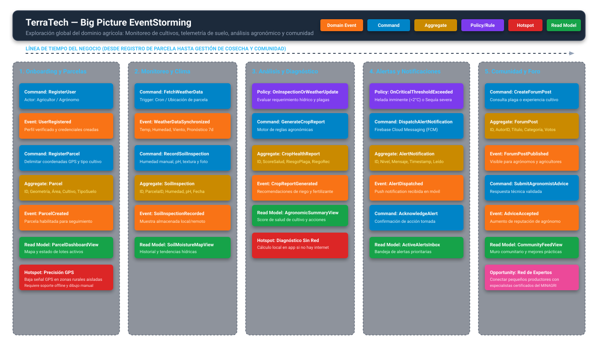

#### 2.5.1.1. Candidate Context Discovery

A partir de la afinidad de eventos, comandos y reglas de negocio, se descubrieron y clasificaron **5 Bounded Contexts estratégicos**:

| Bounded Context | Tipo de Dominio | Justificación Estratégica |
| --- | --- | --- |
| **Field & Parcel Management** | **Core Domain** | Ventaja competitiva principal: Representación geoespacial de lotes agrícolas, gestión de cultivos asignados y recolección de muestras de suelo en campo mediante la app móvil. |
| **Crop Analytics & Reporting** | **Core Domain** | Diferenciador crítico: Motor de diagnóstico agronómico que correlaciona datos de suelo y variables meteorológicas para emitir recomendaciones preventivas de fertilización y riesgo de plagas. |
| **Alerts & Notifications** | **Supporting Domain** | Soporte esencial: Monitoreo constante de umbrales climáticos (heladas inminentes < 2°C, estrés hídrico) y despacho prioritario de notificaciones push móviles. |
| **Farmer Community & Collaboration** | **Supporting Domain** | Soporte de valor: Espacio colaborativo y foro técnico donde agricultores comparten dudas y reciben asistencia directa de ingenieros agrónomos. |
| **IAM & Security** | **Generic Domain** | Capacidad estándar genérica: Autenticación segura mediante tokens JWT, control de acceso basado en roles (Agricultor / Agrónomo) y gestión de perfiles. |

#### 2.5.1.2. Domain Message Flows Modeling

Para representar cómo colaboran los Bounded Contexts y los actores en los escenarios operativos clave, se aplicó la técnica de **Domain Storytelling**:

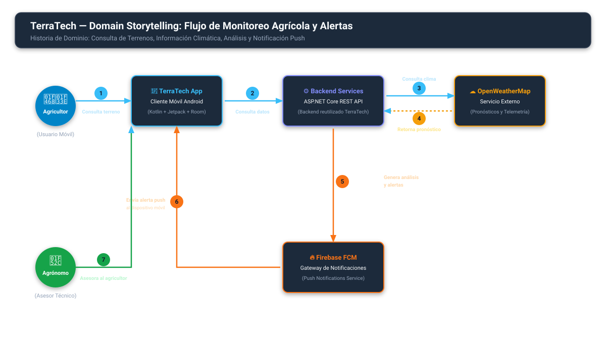

**Narrativa del flujo principal de monitoreo preventivo:**
1. El **Agricultor** accede a la app móvil TerraTech y registra una nueva inspección de suelo (`RecordSoilInspection`) con parámetros de humedad, pH y fotografías tomadas en campo.
2. La app móvil almacena la inspección en la base de datos local **Room** (para garantizar operatividad offline) y la sincroniza con el backend mediante `POST /api/v1/inspections` en cuanto detecta conectividad.
3. El servicio de backend consulta las condiciones meteorológicas y el pronóstico de 7 días del servicio externo **OpenWeatherMap API** mediante las coordenadas GPS de la parcela.
4. Con los datos consolidados, el contexto **Crop Analytics & Reporting** procesa el balance hídrico y genera el reporte `CropHealthReport` evaluando el riesgo biológico y térmico.
5. Si los pronósticos indican una helada inminente o anomalía severa, se dispara la política `OnCriticalThresholdExceeded`, instruyendo al contexto **Alerts & Notifications** a emitir una notificación urgente.
6. El gateway **Firebase Cloud Messaging (FCM)** despacha la notificación push de alta prioridad que despierta el dispositivo móvil del agricultor alertándolo preventivamente.
7. Ante dudas específicas, el agricultor publica una consulta en la **Comunidad**, donde un **Ingeniero Agrónomo** revisa la telemetría asociada y responde técnicamente.

#### 2.5.1.3. Bounded Context Canvases

A continuación se presentan los Canvases estratégicos detallados para cada uno de los 5 Bounded Contexts:

##### Bounded Context Canvas 1: IAM & Security
* **Nombre:** IAM (Identity & Access Management)
* **Clasificación Estratégica:** Generic Domain
* **Propósito:** Proveer autenticación segura, emisión/validación de tokens JWT y autorización basada en roles (Agricultor, Ingeniero Agrónomo, Administrador).
* **Entradas (Inbound):** Comandos `RegisterUserAccount`, `AuthenticateUser`, `UpdateUserProfile`.
* **Salidas (Outbound):** Eventos `UserRegistered`, `UserAuthenticated`, `RoleAssigned`.
* **Lenguaje Ubicuo Local:** `UserAccount`, `Credential`, `Role`, `SessionToken`, `UserProfile`.
* **Reglas de Negocio e Invariantes:** Contraseñas cifradas con algoritmo BCrypt; tokens JWT con expiración definida de 24 horas; roles inmutables salvo autorización administrativa.
* **Dependencias:** Ninguna (Contexto base Upstream).

##### Bounded Context Canvas 2: Field & Parcel Management
* **Nombre:** Field & Parcel Management
* **Clasificación Estratégica:** Core Domain
* **Propósito:** Gestionar el ciclo de vida de los predios y lotes agrícolas, sus geometrías geoespaciales GPS, cultivos asignados e historial de inspecciones de suelo.
* **Entradas (Inbound):** Comandos `RegisterParcel`, `UpdateParcelBoundaries`, `RecordSoilInspection`.
* **Salidas (Outbound):** Eventos `ParcelCreated`, `ParcelUpdated`, `SoilInspectionRecorded`.
* **Lenguaje Ubicuo Local:** `Parcel`, `GeoPolygon`, `CropType`, `SoilInspection`, `MoistureLevel`, `SoilPH`.
* **Reglas de Negocio e Invariantes:** Una parcela debe poseer un polígono cerrado válido mayor a 0.01 hectáreas; las inspecciones de suelo requieren porcentaje de humedad entre 0% y 100% y pH entre 0 y 14.
* **Dependencias:** Consume identidades de IAM; alimenta de telemetría a Crop Analytics.

##### Bounded Context Canvas 3: Crop Analytics & Reporting
* **Nombre:** Crop Analytics & Reporting
* **Clasificación Estratégica:** Core Domain
* **Propósito:** Motor de diagnóstico agronómico que sintetiza telemetría de suelo y clima para generar diagnósticos de salud del cultivo y planes de riego/fertilización.
* **Entradas (Inbound):** Eventos `SoilInspectionRecorded`, `WeatherDataSynchronized`, comando `GenerateCropReport`.
* **Salidas (Outbound):** Eventos `CropReportGenerated`, `CriticalThresholdDetected`.
* **Lenguaje Ubicuo Local:** `CropHealthReport`, `HealthScore`, `PestRiskIndex`, `IrrigationRecommendation`, `AgronomicRule`.
* **Reglas de Negocio e Invariantes:** El `HealthScore` se normaliza en escala de 0 a 100; si el déficit hídrico supera el 40%, se emite recomendación prioritaria de riego.
* **Dependencias:** Depende de Field & Parcel Management (datos del lote) y de OpenWeatherMap API (clima externo).

##### Bounded Context Canvas 4: Alerts & Notifications
* **Nombre:** Alerts & Notifications
* **Clasificación Estratégica:** Supporting Domain
* **Propósito:** Monitorear umbrales agronómicos y climáticos de riesgo para despachar notificaciones push a los dispositivos móviles Android de los productores.
* **Entradas (Inbound):** Evento `CriticalThresholdDetected`, comando `DispatchAlertNotification`, comando `AcknowledgeAlert`.
* **Salidas (Outbound):** Evento `AlertDispatched`, `AlertAcknowledged`.
* **Lenguaje Ubicuo Local:** `AlertNotification`, `SeverityLevel` (INFO, WARNING, CRITICAL), `PushPayload`, `DeviceToken`, `AcknowledgmentStatus`.
* **Reglas de Negocio e Invariantes:** Las alertas de severidad `CRITICAL` deben despacharse inmediatamente con prioridad alta en FCM; reintentos automáticos si falla la conexión.
* **Dependencias:** Consume eventos de Crop Analytics y se integra con el servicio externo Firebase FCM.

##### Bounded Context Canvas 5: Farmer Community & Collaboration
* **Nombre:** Farmer Community & Collaboration
* **Clasificación Estratégica:** Supporting Domain
* **Propósito:** Facilitar la interacción comunitaria, resolución de consultas sobre plagas y difusión de buenas prácticas entre productores y agrónomos.
* **Entradas (Inbound):** Comandos `CreateForumPost`, `SubmitExpertAnswer`, `VoteAnswer`.
* **Salidas (Outbound):** Eventos `ForumPostPublished`, `ExpertAnswerSubmitted`, `AnswerMarkedAsAccepted`.
* **Lenguaje Ubicuo Local:** `ForumPost`, `AgronomistAdvice`, `PostCategory`, `UpvoteCount`, `ExpertBadge`.
* **Reglas de Negocio e Invariantes:** Solo usuarios con rol verificado de Ingeniero Agrónomo pueden otorgar respuestas catalogadas como `ExpertAdvice`; el autor del post es el único que puede marcar una respuesta como aceptada.
* **Dependencias:** Consume identidades de IAM; referencia códigos de parcela de forma desacoplada.

---

### 2.5.2. Context Mapping

El **Context Map** define formalmente las relaciones de integración y gobernanza de datos entre los Bounded Contexts y los servicios externos:

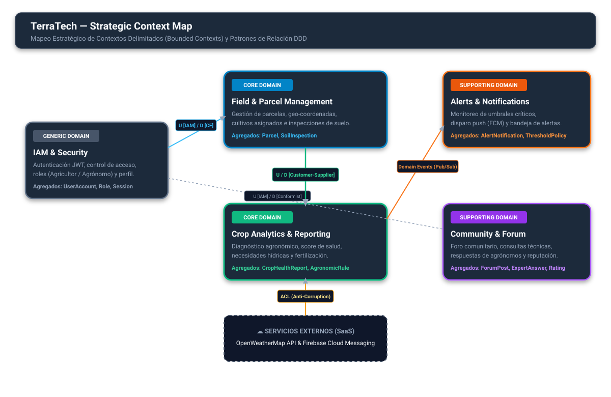

#### Patrones de Relación y Matriz de Integración

| Contexto Upstream (U) | Contexto Downstream (D) | Patrón DDD Adoptado | Justificación Técnica y de Diseño |
| --- | --- | --- | --- |
| **IAM & Security** | **Field & Parcel Management** | *Customer / Supplier* | IAM provee la identidad autenticada (`userId`) requerida para asignar propietarios a las parcelas agrícolas. |
| **IAM & Security** | **Farmer Community** | *Conformist* | La comunidad acepta directamente el modelo de identidad y perfil emitido por IAM sin transformaciones adicionales. |
| **Field & Parcel Management** | **Crop Analytics & Reporting** | *Customer / Supplier* | Analytics depende de los datos estructurales del predio e historial de inspecciones provistos por Parcel Management. |
| **OpenWeatherMap API** | **Crop Analytics & Reporting** | *Anti-Corruption Layer (ACL)* | La ACL aísla el modelo de dominio interno de TerraTech de las estructuras de datos propietarias y cambios de la API pública meteorológica. |
| **Crop Analytics & Reporting** | **Alerts & Notifications** | *Published Language / Events* | Analytics publica eventos de dominio asíncronos (`CriticalThresholdDetected`) que Notifications consume para enviar push alerts. |
| **Alerts & Notifications** | **Firebase Cloud Messaging** | *Anti-Corruption Layer (ACL)* | Adapter que traduce el agregado `AlertNotification` al payload específico de Firebase HTTP v1 API. |

---

### 2.5.3. Software Architecture

La solución de software de TerraTech se modela mediante el enfoque **C4 Model**, estructurado en tres niveles de abstracción orientados a una aplicación móvil nativa Android con backend en la nube.

#### 2.5.3.1. Software Architecture Context Level Diagrams (C4 Nivel 1)

El diagrama de contexto define los límites del sistema TerraTech, sus usuarios clave y las integraciones con servicios externos de terceros:

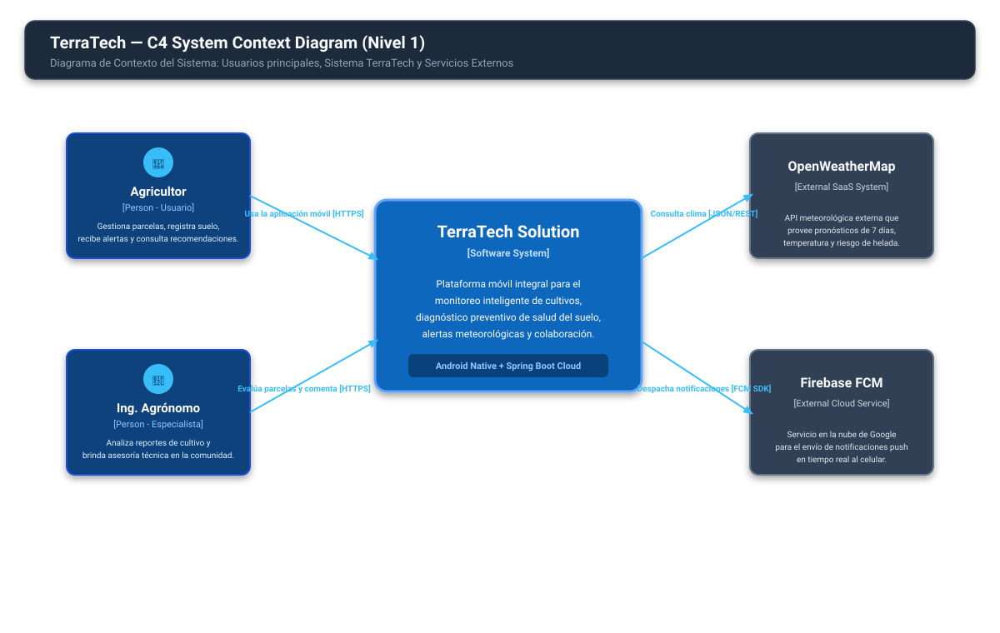

* **Actores Principales:**
  * **Agricultor / Productor Agrícola:** Interactúa con la app móvil para delimitar parcelas, registrar mediciones de suelo, recibir alertas tempranas de heladas y aplicar planes de fertilización.
  * **Ingeniero Agrónomo:** Analiza el estado fitosanitario de los cultivos y brinda soporte técnico a los agricultores a través de la comunidad.
* **Sistema TerraTech:** Plataforma integral que procesa datos de campo, correlaciona variables ambientales y genera diagnósticos preventivos.
* **Sistemas Externos SaaS:**
  * **OpenWeatherMap API:** Provee telemetría y pronósticos climáticos georreferenciados.
  * **Firebase Cloud Messaging (FCM):** Plataforma de mensajería push para notificación en tiempo real en dispositivos móviles.

#### 2.5.3.2. Software Architecture Container Level Diagrams (C4 Nivel 2)

El diagrama de contenedores detalla las aplicaciones ejecutables, almacenes de datos y protocolos de comunicación que componen la solución:

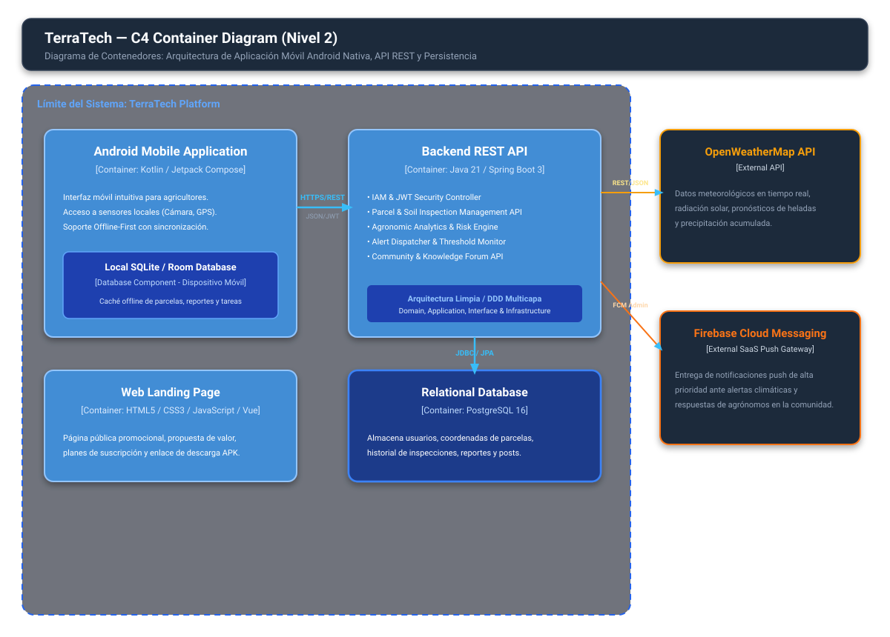

* **Contenedores de la Solución:**
  1. **Android Mobile Application (Kotlin / Jetpack Compose):** Aplicación nativa para smartphones Android. Emplea arquitectura *MVVM + Clean Architecture*, StateFlow para reactividad, inyección de dependencias con Hilt/Koin y cliente Retrofit para comunicación HTTPS con el backend.
  2. **Local SQLite / Room Database:** Base de datos embebida en el dispositivo móvil Android. Almacena en caché local las parcelas, reportes e inspecciones pendientes de sincronización para habilitar operatividad continua en zonas rurales sin cobertura de internet (*Offline-First*).
  3. **Web Landing Page (HTML5 / CSS3 / JavaScript / Vue):** Sitio web institucional responsivo optimizado para SEO, presentación comercial y descarga del archivo APK de la aplicación móvil.
  4. **Backend REST API (Java 21 / Spring Boot 3):** API monolítica modular organizada por capas DDD (Domain, Application, Interface, Infrastructure). Expone endpoints REST documentados bajo estándar OpenAPI 3.0 protegidos con Spring Security y JWT.
  5. **Relational Database (PostgreSQL 16):** Base de datos relacional centralizada que persiste la información estructurada de usuarios, parcelas, reportes, alertas y posts de la comunidad.

#### 2.5.3.3. Software Architecture Deployment Diagrams (C4 Nivel 3 / Despliegue)

El diagrama de despliegue representa la distribución de los artefactos de software en los entornos de hardware físico y cloud, detallando protocolos de red y seguridad:

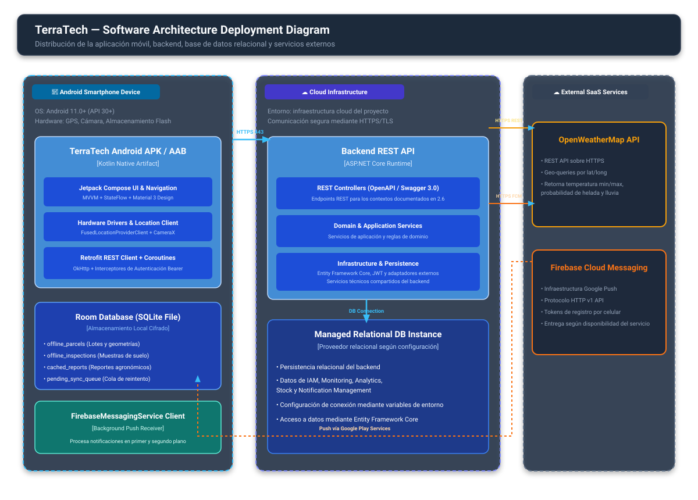

* **Nodos de Infraestructura y Despliegue:**
  * **Nodo Cliente — Smartphone Android:** Dispositivo móvil con sistema operativo Android 11.0 o superior (API 30+). Ejecuta el paquete binario de la app (`TerraTech.apk` / `.aab`), con drivers nativos de geolocalización (`FusedLocationProviderClient`), cámara (`CameraX`), almacenamiento SQLite Room y servicio receptor en segundo plano (`FirebaseMessagingService`).
  * **Nodo Cloud — Amazon Web Services / Google Cloud Platform:**
    * **Contenedor Docker (Spring Boot REST API):** Instancia Linux de alto rendimiento ejecutando el contenedor con OpenJDK 21. Configurado con proxy inverso HTTPS/TLS 1.3 en puerto seguro 443, tareas programadas (`@Scheduled`) para cálculo recurrente de heladas y pool de conexiones HikariCP.
    * **Instancia de Base de Datos Administrada (Cloud SQL / AWS RDS PostgreSQL 16):** Instancia gestionada en red privada VPC con almacenamiento persistente SSD NVMe, cifrado en reposo AES-256 y respaldos automatizados.
  * **Nodo SaaS Externo:** Servidores de OpenWeatherMap y la infraestructura de Google Play Services / Firebase para la entrega garantizada de notificaciones push móviles.

## 2.6. Tactical-Level Domain-Driven Design

El Diseño Táctico de DDD complementa la arquitectura del software guiando el desarrollo mediante patrones de diseño estandarizados, lo que garantiza la correcta implementación de las reglas de negocio y asegura la mantenibilidad del sistema. 

### 2.6.1. Bounded Context: Identity & Access Management

#### 2.6.1.1. Domain Layer

| Archivo | Tipo de Componente | Responsabilidad Principal |
| :--- | :--- | :--- |
| User.cs | Aggregate Root | Entidad principal que gestiona el ciclo de vida e identidad del usuario. |
| UserAudit.cs | Partial Entity / Extension | Implementa propiedades de auditoría (`CreatedAt`, `UpdatedAt`). |
| Email.cs | Value Object | Valida, encapsula y normaliza la dirección de correo electrónico. |
| IUserRepository.cs | Domain Repository Interface | Define el contrato de persistencia para consultar y almacenar usuarios. |
| SignInCommand.cs / SignUpCommand.cs | Domain Command | Estructuras de datos para solicitar el inicio o creación de sesión. |
| GetUserByEmailQuery.cs / GetUserByIdQuery.cs | Domain Query | Estructuras de datos para consultar usuarios por ID o Email. |
| IamErrors.cs / IamError.cs | Domain Model Errors | Define los códigos y mensajes de error específicos de autenticación e identidad. |

#### 2.6.1.2. Interface Layer

| Archivo | Tipo de Componente | Responsabilidad Principal |
| :--- | :--- | :--- |
| AuthenticationController.cs | REST Controller | Gestiona las peticiones de autenticación (`sign-in`, `sign-up`). |
| UsersController.cs | REST Controller | Gestiona las peticiones de consulta de usuarios por ID o Email. |
| IIamContextFacade.cs | ACL / Facade Interface | Contrato para integración segura e inter-contexto. |
| SignInResource.cs / SignUpResource.cs | Inbound Resource (DTO) | Representa los datos recibidos en las solicitudes de autenticación. |
| UserResource.cs / AuthenticatedUserResource.cs | Outbound Resource (DTO) | Representa la estructura de respuesta enviada al cliente HTTP. |
| SignInCommandFromResourceAssembler.cs | Assembler / Mapper | Transforma `SignInResource` a `SignInCommand`. |
| SignUpCommandFromResourceAssembler.cs | Assembler / Mapper | Transforma `SignUpResource` a `SignUpCommand`. |
| UserResourceFromEntityAssembler.cs | **Assembler / Mapper | Transforma la entidad `User` a `UserResource`. |
| AuthenticatedUserResourceFromEntityAssembler.cs | Assembler / Mapper | Transforma `User` y JWT Token a `AuthenticatedUserResource`. |
| IamActionResultAssembler.cs | REST Response Mapper | Traduce errores y resultados de dominio a respuestas HTTP (`ProblemDetails`). |

#### 2.6.1.3. Application Layer

| Archivo | Tipo de Componente | Responsabilidad Principal |
| :--- | :--- | :--- |
| IUserCommandService.cs | Inbound Command Port | Contrato para la ejecución de comandos de usuario (sign-in, sign-up). |
| UserCommandService.cs | Command Application Service | Orquesta la lógica de casos de uso de registro y autenticación. |
| IUserQueryService.cs | Inbound Query Port | Contrato para la ejecución de consultas de lectura sobre usuarios. |
| UserQueryService.cs | Query Application Service | Implementa las consultas para obtener usuarios por ID o Email. |
| ITokenService.cs | Outbound Service Interface | Contrato para generación y validación de tokens JWT. |
| IHashingService.cs | Outbound Service Interface | Contrato para cifrado y verificación de contraseñas. |
| IamContextFacade.cs | ACL Facade Implementation | Implementa la fachada de integración pública para otros Bounded Contexts. |

#### 2.6.1.4. Infrastructure Layer

| Archivo | Tipo de Componente | Responsabilidad Principal |
| :--- | :--- | :--- |
| UserRepository.cs | Repository Implementation | Implementa las operaciones de persistencia en base de datos para el Agregado User. |
| ModelBuilderExtensions.cs | ORM Mapping Configuration | Configura el esquema de la tabla de usuarios e índices únicos en Entity Framework Core. |
| TokenService.cs | Security Service Implementation | Gestiona la creación y validación técnica de tokens JWT. |
| TokenSettings.cs | Configuration Model | Representa las claves y configuraciones del token leídas desde appsettings.json. |
| HashingService.cs | Security Service Implementation | Realiza el cifrado y validación de contraseñas utilizando el algoritmo BCrypt. |
| RequestAuthorizationMiddleware.cs | ASP.NET Core Middleware | Intercepta peticiones HTTP para extraer y validar el token JWT adjunto. |
| RequestAuthorizationMiddlewareExtensions.cs | Middleware Extension | Registra el middleware de autorización dentro de la canalización de la aplicación. |
| AuthorizeAttribute.cs | Authorization Filter | Filtro que valida la presencia del usuario autenticado en el contexto HTTP. |
| AllowAnonymousAttribute.cs | Metadata Attribute | Atributo para omitir la validación de autorización en endpoints públicos. |

#### 2.6.1.5. Bounded Context Software Architecture Component Level Diagrams

```plantuml
@startuml C4_Component_IAM
!include https://raw.githubusercontent.com/plantuml-stdlib/C4-PlantUML/master/C4_Component.puml

title Component Diagram for IAM Bounded Context

Container(spa, "Single-Page Application", "React / Web Browser", "Interfaz de usuario de la plataforma TerraTech")
Container(external_bc, "Other Bounded Contexts", "C# / .NET", "Otros módulos de la plataforma (ej. Profile)")
ContainerDb(database, "Database", "MySQL / PostgreSQL", "Almacena los datos de usuarios e identidad")

Container_Boundary(iam_bc, "IAM Bounded Context") {
    
    Boundary(interface_layer, "Interface Layer") {
        Component(auth_ctrl, "Authentication Controller", "ASP.NET Core REST Controller", "Expone endpoints REST para inicio de sesión y registro (/api/v1/authentication)")
        Component(users_ctrl, "Users Controller", "ASP.NET Core REST Controller", "Expone endpoints REST protegidos para la gestión de usuarios (/api/v1/users)")
        Component(assemblers, "DTO Assemblers / Mappers", "C# Static Classes", "Transforma objetos entre Resources (DTOs), Comandos, Consultas y Entidades")
        Component(acl_facade, "IAM Context Facade", "C# Class (ACL)", "Ofrece un punto de entrada público desacoplado para otros Bounded Contexts")
    }

    Boundary(application_layer, "Application Layer") {
        Component(cmd_service, "User Command Service", "C# Application Service", "Orquesta la lógica de casos de uso para escribir/modificar datos (SignUp, SignIn)")
        Component(query_service, "User Query Service", "C# Application Service", "Orquesta los casos de uso de lectura (GetUserById, GetUserByEmail)")
    }

    Boundary(domain_layer, "Domain Layer") {
        Component(user_aggregate, "User Aggregate Root", "C# Domain Entity & Value Objects", "Representa al usuario e impone las reglas de negocio (Email, PasswordHash)")
        Component(repo_interface, "IUserRepository Interface", "C# Domain Interface", "Define el contrato de persistencia para los agregados de tipo User")
    }

    Boundary(infrastructure_layer, "Infrastructure Layer") {
        Component(user_repo, "UserRepository Implementation", "Entity Framework Core", "Implementa IUserRepository para interactuar con la base de datos")
        Component(token_service, "Token Service", "System.IdentityModel.Tokens.Jwt", "Genera y valida tokens de acceso JWT")
        Component(hashing_service, "Hashing Service", "BCrypt.Net", "Procesa el encriptado y verificación de contraseñas")
        Component(auth_middleware, "Authorization Middleware & Attributes", "ASP.NET Core Pipeline", "Intercepta solicitudes HTTP, valida JWT e inyecta el usuario en HttpContext")
    }
}

' Interacciones Externas
Rel(spa, auth_ctrl, "Envía peticiones de Sign-In / Sign-Up", "JSON / HTTPS")
Rel(spa, users_ctrl, "Consulta datos de usuario", "JSON / HTTPS / JWT")
Rel(external_bc, acl_facade, "Invoca operaciones de IAM inter-contexto", "C# Method Calls")

' Interacciones Internas de la Capa de Interfaz
Rel(auth_ctrl, assemblers, "Utiliza para mapear Resources a Commands", "In-Process")
Rel(users_ctrl, assemblers, "Utiliza para mapear Entities a Resources", "In-Process")
Rel(auth_ctrl, cmd_service, "Envía SignInCommand y SignUpCommand", "In-Process")
Rel(users_ctrl, query_service, "Envía GetUserByIdQuery y GetUserByEmailQuery", "In-Process")
Rel(acl_facade, cmd_service, "Ejecuta SignUpCommand", "In-Process")
Rel(acl_facade, query_service, "Ejecuta GetUserByEmailQuery / GetUserByIdQuery", "In-Process")

' Interacciones de la Capa de Aplicación
Rel(cmd_service, user_aggregate, "Instancia y modifica el estado del Agregado", "In-Process")
Rel(cmd_service, repo_interface, "Persiste cambios de agregados", "In-Process")
Rel(cmd_service, hashing_service, "Cifra y verifica contraseñas", "In-Process")
Rel(cmd_service, token_service, "Genera tokens JWT tras autenticación exitosa", "In-Process")
Rel(query_service, repo_interface, "Consulta agregados User", "In-Process")

' Interacciones de la Capa de Infraestructura
Rel(auth_middleware, token_service, "Valida el token JWT en las peticiones HTTP", "In-Process")
Rel(auth_middleware, query_service, "Carga la información del usuario autenticado", "In-Process")
Rel(user_repo, repo_interface, "Implementa", "C# Inheritance")
Rel(user_repo, database, "Lee y escribe registros de la tabla 'users'", "SQL / EF Core")

@enduml
```

#### 2.6.1.6. Bounded Context Software Architecture Code Level Diagrams

##### 2.6.1.6.1. Bounded Context Domain Layer Class Diagrams

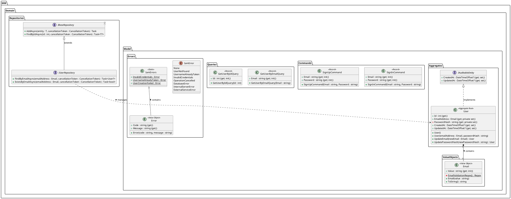
```plantuml
@startuml DomainLayer_IAM_ClassDiagram

package "IAM" {
    package "Domain" {
        package "Model" {
            
            package "Aggregates" {
                interface IAuditableEntity {
                    + CreatedAt : DateTimeOffset? {get; set;}
                    + UpdatedAt : DateTimeOffset? {get; set;}
                }

                class User <<Aggregate Root>> {
                    + Id : int {get;}
                    + EmailAddress : Email {get; private set;}
                    - PasswordHash : string {get; private set;}
                    + CreatedAt : DateTimeOffset? {get; set;}
                    + UpdatedAt : DateTimeOffset? {get; set;}
                    + User()
                    + User(emailAddress : Email, passwordHash : string)
                    + UpdateEmail(newEmail : Email) : User
                    + UpdatePasswordHash(newPasswordHash : string) : User
                }

                IAuditableEntity <|.. User : implements
            }

            package "ValueObjects" {
                class Email <<Value Object>> {
                    + Value : string {get; init;}
                    - {static} EmailValidationRegex() : Regex
                    + Email(value : string)
                    + ToString() : string
                }
            }

            package "Commands" {
                class SignInCommand <<Record>> {
                    + Email : string {get; init;}
                    + Password : string {get; init;}
                    + SignInCommand(Email : string, Password : string)
                }

                class SignUpCommand <<Record>> {
                    + Email : string {get; init;}
                    + Password : string {get; init;}
                    + SignUpCommand(Email : string, Password : string)
                }
            }

            package "Queries" {
                class GetUserByEmailQuery <<Record>> {
                    + Email : string {get; init;}
                    + GetUserByEmailQuery(Email : string)
                }

                class GetUserByIdQuery <<Record>> {
                    + Id : int {get; init;}
                    + GetUserByIdQuery(Id : int)
                }
            }

            package "Errors" {
                enum IamError {
                    None
                    UserNotFound
                    UsernameAlreadyTaken
                    InvalidCredentials
                    OperationCancelled
                    DatabaseError
                    InternalServerError
                    ExternalServiceError
                }

                class Error <<Value Object>> {
                    + Code : string {get;}
                    + Message : string {get;}
                    + Error(code : string, message : string)
                }

                class IamErrors <<Static>> {
                    + {static} InvalidCredentials : Error
                    + {static} UsernameAlreadyTaken : Error
                    + {static} UserCreationFailed : Error
                }
            }
        }

        package "Repositories" {
            interface IBaseRepository<T> {
                + AddAsync(entity : T, cancellationToken : CancellationToken) : Task
                + FindByIdAsync(id : int, cancellationToken : CancellationToken) : Task<T?>
            }

            interface IUserRepository {
                + FindByEmailAsync(emailAddress : Email, cancellationToken : CancellationToken) : Task<User?>
                + ExistsByEmailAsync(emailAddress : Email, cancellationToken : CancellationToken) : Task<bool>
            }

            IBaseRepository <|-- IUserRepository : extends
        }
    }
}

' Relaciones del Modelo Táctico
User "1" *-- "1" Email : contains >
IUserRepository ..> User : manages >
IamErrors o-- Error : contains >

@enduml
```

##### 2.6.1.6.2. Bounded Context Database Design Diagram

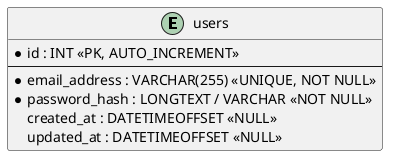
```plantuml
@startuml Database_Design_IAM

entity "users" as users {
    * id : INT <<PK, AUTO_INCREMENT>>
    --
    * email_address : VARCHAR(255) <<UNIQUE, NOT NULL>>
    * password_hash : LONGTEXT / VARCHAR <<NOT NULL>>
    created_at : DATETIMEOFFSET <<NULL>>
    updated_at : DATETIMEOFFSET <<NULL>>
}

@enduml
```

### 2.6.2. Bounded Context: Analytics Management 

#### 2.6.2.1. Domain Layer

| Archivo | Tipo de Componente | Responsabilidad Principal |
| :--- | :--- | :--- |
| Report.cs | Aggregate Root | Entidad principal que modela los datos analíticos e impone reglas de modificación de métricas. |
| ReportAudit.cs | Partial Class / Auditing | Incorpora propiedades de auditoría temporal (CreatedAt, UpdatedAt) al Agregado Report. |
| DeviceId.cs | Value Object | Encapsula y valida el identificador numérico del dispositivo. |
| GeneratedAt.cs | Value Object | Encapsula y valida la fecha de generación del reporte analítico. |
| MeanValue.cs | Value Object | Encapsula y valida el valor promedio estadístico (rango 0 - 100). |
| Variance.cs | Value Object | Encapsula y valida la varianza estadística (no negativa). |
| StandardDeviation.cs | Value Object | Encapsula y valida la desviación estándar (no negativa). |
| TechnicalInterpretation.cs | Value Object | Encapsula y valida la interpretación técnica textual del análisis. |
| CreateReportCommand.cs | Command | Transporta los datos requeridos para la creación de un reporte. |
| UpdateReportCommand.cs | Command | Transporta los datos requeridos para la actualización de un reporte existente. |
| GetReportByIdQuery.cs | Query | Transporta el identificador para la consulta individual de un reporte. |
| IReportRepository.cs | Domain Repository Interface | Define las operaciones de lectura y consulta especializadas para la entidad Report. |

#### 2.6.2.2. Interface Layer

| Archivo | Tipo de Componente | Responsabilidad Principal |
| :--- | :--- | :--- |
| ReportsController.cs | REST Controller | Expone y gestiona los endpoints HTTP REST para la administración de reportes analíticos. |
| CreateReportResource.cs | Request DTO | Contrato de entrada con validaciones para crear un reporte. |
| UpdateReportResource.cs | Request DTO | Contrato de entrada con validaciones para actualizar estadísticas de un reporte. |
| ReportResource.cs | Response DTO | Contrato de salida con los datos formateados del reporte analítico. |
| CreateReportCommandFromResourceAssembler.cs | Assembler / Transformer | Mapea CreateReportResource hacia el objeto inmutable CreateReportCommand. |
| ReportResourceFromEntityAssembler.cs | Assembler / Transformer | Mapea la entidad de dominio Report hacia el recurso de respuesta ReportResource. |
| ActionResultFromCreateReportResultAssembler.cs | Assembler / HTTP Transformer | Convierte el objeto Result<Report> en respuestas HTTP estructuradas (201, 409, 500). |

#### 2.6.2.3. Application Layer

| Archivo | Tipo de Componente | Responsabilidad Principal |
| :--- | :--- | :--- |
| IReportCommandService.cs | Service Interface | Contrato para la ejecución de comandos de modificación de reportes. |
| ReportCommandService.cs | Application Service | Orquesta la creación y actualización de agregados Report y la confirmación en el UnitOfWork. |
| IReportQueryService.cs | Service Interface | Contrato para la consulta de datos de reportes analíticos. |
| ReportQueryService.cs | Application Service | Implementa la lógica de recuperación de reportes desde el repositorio de dominio. |
| CreateReportError.cs | Application Error Enum | Define los tipos de errores de negocio para la creación de reportes. |
| UpdateReportError.cs | Application Error Enum | Define los tipos de errores de negocio para la actualización de reportes. |

#### 2.6.2.4. Infrastructure Layer

| Archivo | Tipo de Componente | Responsabilidad Principal |
| :--- | :--- | :--- |
| ReportRepository.cs | Concrete Repository | Implementa la persistencia y consultas específicas del Agregado Report sobre Entity Framework Core. |
| ModelBuilderExtensions.cs | EF Core Configuration | Configura el mapeo ORM Fluent API del Agregado Report y sus Objetos de Valor en la base de datos. |

#### 2.6.2.5. Bounded Context Software Architecture Component Level Diagrams

#### 2.6.2.5. Bounded Context Software Architecture Component Level Diagrams

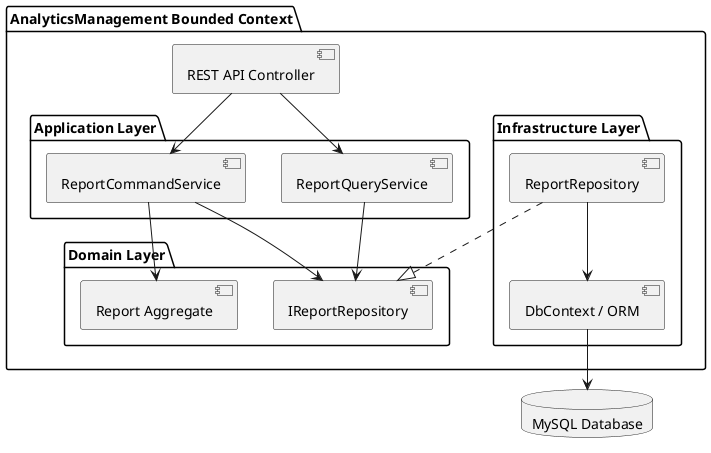
```plantuml
@startuml AnalyticsManagement_ComponentDiagram

package "AnalyticsManagement Bounded Context" {

    [REST API Controller] as Controller
    
    package "Application Layer" {
        [ReportCommandService] as CmdService
        [ReportQueryService] as QueryService
    }

    package "Domain Layer" {
        [Report Aggregate] as Aggregate
        [IReportRepository] as RepInterface
    }

    package "Infrastructure Layer" {
        [ReportRepository] as RepImpl
        [DbContext / ORM] as ORM
    }
}

database "MySQL Database" as DB

' Relationships
Controller --> CmdService
Controller --> QueryService

CmdService --> Aggregate
CmdService --> RepInterface
QueryService --> RepInterface

RepImpl ..|> RepInterface
RepImpl --> ORM
ORM --> DB

@enduml
```

#### 2.6.2.6. Bounded Context Software Architecture Code Level Diagrams

##### 2.6.2.6.1. Bounded Context Domain Layer Class Diagrams

```plantuml
@startuml DomainLayer_AnalyticsManagement_ClassDiagram

package "AnalyticsManagement" {
    package "Domain" {
        package "Model" {
            
            package "Aggregates" {
                interface IAuditableEntity {
                    + CreatedAt : DateTimeOffset? {get; set;}
                    + UpdatedAt : DateTimeOffset? {get; set;}
                }

                class Report <<Aggregate Root>> {
                    + Id : int {get; private set;}
                    + DeviceId : DeviceId {get; private set;}
                    + GeneratedAt : GeneratedAt {get; private set;}
                    + MeanValue : MeanValue {get; private set;}
                    + Variance : Variance {get; private set;}
                    + StandardDeviation : StandardDeviation {get; private set;}
                    + TechnicalInterpretation : TechnicalInterpretation {get; private set;}
                    + CreatedAt : DateTimeOffset? {get; set;}
                    + UpdatedAt : DateTimeOffset? {get; set;}
                    + Report()
                    + Report(command : CreateReportCommand)
                    + UpdateStatistics(mean : double, variance : double, stdDev : double, interpretation : string) : void
                }

                IAuditableEntity <|.. Report : implements
            }

            package "ValueObjects" {
                class DeviceId <<Value Object>> {
                    + Value : int {get;}
                    + DeviceId(value : int)
                    + ToString() : string
                }

                class GeneratedAt <<Value Object>> {
                    + Value : DateTimeOffset {get;}
                    + GeneratedAt(value : DateTimeOffset)
                    + ToString() : string
                }

                class MeanValue <<Value Object>> {
                    + Value : double {get;}
                    + MeanValue(value : double)
                    + ToString() : string
                }

                class Variance <<Value Object>> {
                    + Value : double {get;}
                    + Variance(value : double)
                    + ToString() : string
                }

                class StandardDeviation <<Value Object>> {
                    + Value : double {get;}
                    + StandardDeviation(value : double)
                    + ToString() : string
                }

                class TechnicalInterpretation <<Value Object>> {
                    + Value : string {get;}
                    + TechnicalInterpretation(value : string)
                    + ToString() : string
                }
            }

            package "Commands" {
                class CreateReportCommand <<Record>> {
                    + DeviceId : DeviceId {get;}
                    + GeneratedAt : GeneratedAt {get;}
                    + MeanValue : MeanValue {get;}
                    + Variance : Variance {get;}
                    + StandardDeviation : StandardDeviation {get;}
                    + TechnicalInterpretation : TechnicalInterpretation {get;}
                }

                class UpdateReportCommand <<Record>> {
                    + Id : int {get;}
                    + MeanValue : double {get;}
                    + Variance : double {get;}
                    + StandardDeviation : double {get;}
                    + TechnicalInterpretation : string {get;}
                }
            }

            package "Queries" {
                class GetReportByIdQuery <<Record>> {
                    + Id : int {get;}
                }
            }
        }

        package "Repositories" {
            interface IBaseRepository<T> {
                + AddAsync(entity : T, cancellationToken : CancellationToken) : Task
                + FindByIdAsync(id : int, cancellationToken : CancellationToken) : Task<T?>
                + ListAsync(cancellationToken : CancellationToken) : Task<IEnumerable<T>>
                + Update(entity : T) : void
            }

            interface IReportRepository {
                + FindByDeviceIdAsync(deviceId : DeviceId, cancellationToken : CancellationToken) : Task<IEnumerable<Report>>
                + FindByDateRangeAsync(from : GeneratedAt, to : GeneratedAt, cancellationToken : CancellationToken) : Task<IEnumerable<Report>>
                + FindByDeviceIdAndGeneratedAtAsync(deviceId : DeviceId, generatedAt : GeneratedAt, cancellationToken : CancellationToken) : Task<Report?>
            }

            IBaseRepository <|-- IReportRepository : extends
        }
    }
}

' Relaciones del Modelo Táctico
Report "1" *-- "1" DeviceId : contains >
Report "1" *-- "1" GeneratedAt : contains >
Report "1" *-- "1" MeanValue : contains >
Report "1" *-- "1" Variance : contains >
Report "1" *-- "1" StandardDeviation : contains >
Report "1" *-- "1" TechnicalInterpretation : contains >

IReportRepository ..> Report : manages >
CreateReportCommand ..> Report : instantiates >

@endluml
```

##### 2.6.2.6.2. Bounded Context Database Design Diagram

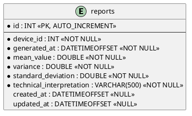
```plantuml
@startuml AnalyticsManagement_DatabaseDesign

entity "reports" as reports {
    * id : INT <<PK, AUTO_INCREMENT>>
    --
    * device_id : INT <<NOT NULL>>
    * generated_at : DATETIMEOFFSET <<NOT NULL>>
    * mean_value : DOUBLE <<NOT NULL>>
    * variance : DOUBLE <<NOT NULL>>
    * standard_deviation : DOUBLE <<NOT NULL>>
    * technical_interpretation : VARCHAR(500) <<NOT NULL>>
    created_at : DATETIMEOFFSET <<NULL>>
    updated_at : DATETIMEOFFSET <<NULL>>
}

@enduml
```

### 2.6.3. Bounded Context: Monitoring Management

#### 2.6.3.1. Domain Layer

| Archivo | Tipo de Componente | Responsabilidad Principal |
| :--- | :--- | :--- |
| Field.cs | Aggregate Root | Representa una parcela o campo agrícola y gestiona sus reglas internas de actualización. |
| FieldAudit.cs | Partial Class / Audit | Implementa IAuditableEntity para registrar marcas de tiempo de creación y actualización de campos. |
| Device.cs | Aggregate Root | Representa un dispositivo/sensor de monitoreo asociado a un campo. |
| DeviceAudit.cs | Partial Class / Audit | Implementa IAuditableEntity para registrar marcas de tiempo de creación y actualización de dispositivos. |
| IFieldRepository.cs | Domain Repository Interface | Define el contrato de persistencia para el agregado Field. |
| IDeviceRepository.cs | Domain Repository Interface | Define el contrato de persistencia para el agregado Device. |
| DeviceStatus.cs | Value Object | Encapsula y normaliza el estado del dispositivo (ONLINE, OFFLINE, LOW_BATTERY). |
| FieldId.cs | Value Object | Encapsula el identificador de la parcela. |
| FieldName.cs | Value Object | Valida y almacena el nombre del campo. |
| LastSync.cs | Value Object | Almacena la marca de tiempo de la última sincronización del dispositivo. |
| LocationLatLong.cs | Value Object | Valida y almacena la latitud y longitud de la parcela. |
| MacAddress.cs | Value Object | Valida el formato de la dirección MAC del dispositivo. |
| ProfileId.cs | Value Object | Encapsula el identificador del perfil del usuario propietario. |
| SizeM2.cs | Value Object | Valida y almacena la extensión en metros cuadrados. |
| SoilType.cs | Value Object | Valida y almacena la clasificación del tipo de suelo. |
| CreateFieldCommand.cs | Command Record | DTO de comando para solicitar la creación de un campo. |
| UpdateFieldCommand.cs | Command Record | DTO de comando para solicitar la actualización de un campo. |
| DeleteFieldCommand.cs | Command Record | DTO de comando para solicitar la eliminación de un campo. |
| CreateDeviceCommand.cs | Command Record | DTO de comando para solicitar la creación de un dispositivo. |
| UpdateDeviceCommand.cs | Command Record | DTO de comando para solicitar la actualización de un dispositivo. |
| DeleteDeviceCommand.cs | Command Record | DTO de comando para solicitar la eliminación de un dispositivo. |
| GetFieldByIdQuery.cs | Query Record | Estructura para consultar un campo por su identificador. |
| GetFieldBySoilTypeQuery.cs | Query Record | Estructura para consultar campos por tipo de suelo. |
| GetDeviceByIdQuery.cs | Query Record | Estructura para consultar un dispositivo por su identificador. |
| GetDevicesByStatusQuery.cs | Query Record | Estructura para consultar dispositivos por estado operativo. |
| GetDevicesByFieldIdQuery.cs | Query Record | Estructura para consultar dispositivos asociados a un campo. |

#### 2.6.3.2. Interface Layer

| Archivo | Tipo de Componente | Responsabilidad Principal |
| :--- | :--- | :--- |
| FieldsController.cs | REST Controller | Maneja las solicitudes HTTP relacionadas con campos/parcelas (CRUD y consultas por tipo de suelo). |
| DevicesController.cs | REST Controller | Maneja las solicitudes HTTP relacionadas con dispositivos IoT (CRUD y consultas por campo/estado). |
| CreateFieldResource.cs | DTO / Input Resource | DTO para la creación de un nuevo campo con validaciones de formulario. |
| UpdateFieldResource.cs | DTO / Input Resource | DTO para la actualización de un campo existente. |
| FieldResource.cs | DTO / Output Resource | DTO de respuesta para la representación aplanada de un campo (Field). |
| CreateDeviceResource.cs | DTO / Input Resource | DTO para la creación de un dispositivo IoT con validación de dirección MAC y estado. |
| UpdateDeviceResource.cs | DTO / Input Resource | DTO para la actualización de datos de un dispositivo. |
| DeviceResource.cs | DTO / Output Resource | DTO de respuesta para la representación aplanada de un dispositivo (Device). |
| CreateFieldCommandFromResourceAssembler.cs | Assembler / Transformer | Mapea un CreateFieldResource a CreateFieldCommand con Value Objects. |
| UpdateFieldCommandFromResourceAssembler.cs | Assembler / Transformer | Mapea un UpdateFieldResource a UpdateFieldCommand. |
| FieldResourceFromEntityAssembler.cs | Assembler / Transformer | Mapea la entidad de agregado Field a FieldResource. |
| ActionResultFromCreateFieldResultAssembler.cs | Result Assembler | Transforma el Result<Field> de la aplicación a una respuesta ActionResult de ASP.NET Core. |
| CreateDeviceCommandFromResourceAssembler.cs | Assembler / Transformer | Mapea un CreateDeviceResource a CreateDeviceCommand. |
| UpdateDeviceCommandFromResourceAssembler.cs | Assembler / Transformer | Mapea un UpdateDeviceResource a UpdateDeviceCommand. |
| DeviceResourceFromEntityAssembler.cs | Assembler / Transformer | Mapea la entidad de agregado Device a DeviceResource. |
| ActionResultFromCreateDeviceResultAssembler.cs | Result Assembler | Transforma el Result<Device> de la aplicación a una respuesta ActionResult de ASP.NET Core. |

#### 2.6.3.3. Application Layer

| Archivo | Tipo de Componente | Responsabilidad Principal |
| :--- | :--- | :--- |
| CreateDeviceError.cs | Enum / Error | Enumera los errores del caso de uso de dispositivos (duplicado, no encontrado, MAC inválida, etc.). |
| CreateFieldError.cs | Enum / Error | Enumera los errores del caso de uso de campos (duplicado, no encontrado, suelo inválido, etc.). |
| IDeviceCommandService.cs | Service Interface | Interfaz del servicio de comandos para el manejo de CRUD de dispositivos. |
| IDeviceQueryService.cs | Service Interface | Interfaz del servicio de consultas para recuperar dispositivos e información proyectada a recursos. |
| IFieldCommandService.cs | Service Interface | Interfaz del servicio de comandos para el manejo de CRUD de campos/parcelas. |
| IFieldQueryService.cs | Service Interface | Interfaz del servicio de consultas para recuperar campos e información proyectada a recursos. |
| DeviceCommandService.cs | Command Service Implementation | Implementa la lógica de comandos para crear, actualizar y eliminar dispositivos con manejo de transacciones. |
| FieldCommandService.cs | Command Service Implementation | Implementa la lógica de comandos para crear, actualizar y eliminar campos con validación de duplicados. |
| DeviceQueryService.cs | Query Service Implementation | Implementa la lógica de consulta para listar o filtrar dispositivos por ID, campo y estado. |
| FieldQueryService.cs | Query Service Implementation | Implementa la lógica de consulta para listar o filtrar campos por ID y tipo de suelo. |

#### 2.6.3.4. Infrastructure Layer

| Archivo | Tipo de Componente | Responsabilidad Principal |
| :--- | :--- | :--- |
| ModelBuilderExtensions.cs | EF Core Configuration / Extension | Configura el mapeo ORM de los agregados Field y Device (claves, tablas y Value Objects) mediante Fluent API. |
| FieldRepository.cs | Repository Implementation | Implementa la persistencia para la entidad Field en base de datos mediante EF Core. |
| DeviceRepository.cs | Repository Implementation | Implementa la persistencia para la entidad Device en base de datos mediante EF Core. |

#### 2.6.3.5. Bounded Context Software Architecture Component Level Diagrams

```plantuml
@startuml C4_Component_Monitoring
!include https://raw.githubusercontent.com/plantuml-stdlib/C4-PlantUML/master/C4_Component.puml

LAYOUT_WITH_LEGEND()

title Component Diagram for Monitoring Management Bounded Context

Container(web_app, "Single-Page Application", "Angular", "Interfaz gráfica para el monitoreo agrícola.")

Container_Boundary(api, "Monitoring Management Container") {
    Component(fields_controller, "FieldsController", "ASP.NET Core REST Controller", "Expone endpoints REST para parcelas (/api/v1/fields).")
    Component(devices_controller, "DevicesController", "ASP.NET Core REST Controller", "Expone endpoints REST para sensores IoT (/api/v1/devices).")
    
    Component(field_cmd_service, "FieldCommandService", "Application Service", "Procesa lógica de creación, actualización y eliminación de campos.")
    Component(field_qry_service, "FieldQueryService", "Application Service", "Ejecuta consultas avanzadas y filtrado de parcelas.")
    Component(device_cmd_service, "DeviceCommandService", "Application Service", "Procesa la lógica de ciclo de vida de dispositivos IoT.")
    Component(device_qry_service, "DeviceQueryService", "Application Service", "Ejecuta consultas filtradas de dispositivos por estado y parcela.")
    
    Component(domain_model, "Domain Model", "Domain Layer", "Encapsula Agregados (Field, Device) y Value Objects.")
    
    Component(field_repo, "FieldRepository", "EF Core Repository", "Provee persistencia física de parcelas en MySQL.")
    Component(device_repo, "DeviceRepository", "EF Core Repository", "Provee persistencia física de sensores IoT en MySQL.")
}

ContainerDb(database, "Relational Database", "MySQL", "Almacena información de parcelas, estados y dispositivos.")

Rel(web_app, fields_controller, "Realiza peticiones HTTP/REST", "JSON/HTTPS")
Rel(web_app, devices_controller, "Realiza peticiones HTTP/REST", "JSON/HTTPS")

Rel(fields_controller, field_cmd_service, "Invocación de Comandos")
Rel(fields_controller, field_qry_service, "Invocación de Consultas")
Rel(devices_controller, device_cmd_service, "Invocación de Comandos")
Rel(devices_controller, device_qry_service, "Invocación de Consultas")

Rel(field_cmd_service, domain_model, "Opera con")
Rel(field_qry_service, domain_model, "Lee de")
Rel(device_cmd_service, domain_model, "Opera con")
Rel(device_qry_service, domain_model, "Lee de")

Rel(field_cmd_service, field_repo, "Persiste mediante")
Rel(field_qry_service, field_repo, "Consulta mediante")
Rel(device_cmd_service, device_repo, "Persiste mediante")
Rel(device_qry_service, device_repo, "Consulta mediante")

Rel(field_repo, database, "Lee y escribe datos en", "EF Core / MySQL Protocol")
Rel(device_repo, database, "Lee y escribe datos en", "EF Core / MySQL Protocol")

@enduml
```

#### 2.6.3.6. Bounded Context Software Architecture Code Level Diagrams

##### 2.6.3.6.1. Bounded Context Domain Layer Class Diagrams

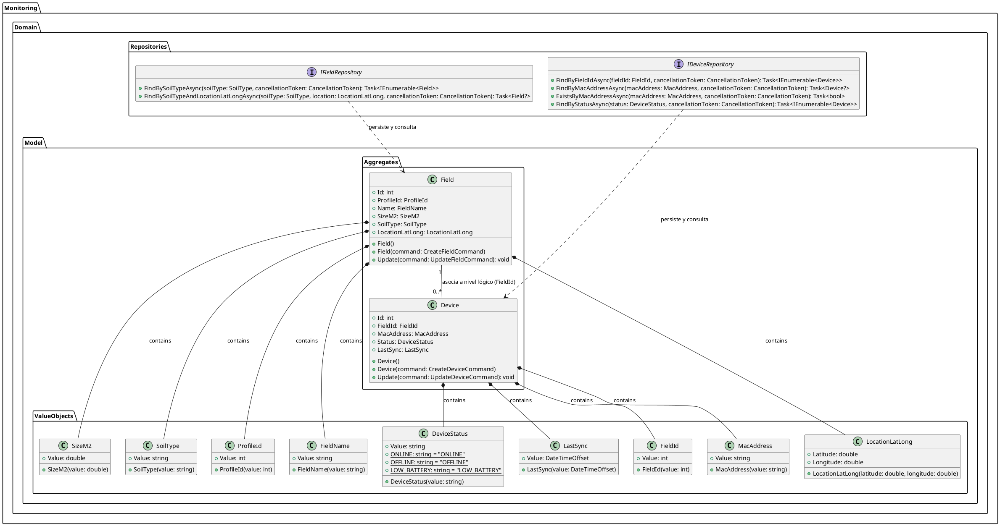
```plantuml
@startuml Domain_Class_Diagram_Monitoring

package "Monitoring.Domain.Model.Aggregates" {
    class Field {
        + Id: int
        + ProfileId: ProfileId
        + Name: FieldName
        + SizeM2: SizeM2
        + SoilType: SoilType
        + LocationLatLong: LocationLatLong
        + Field()
        + Field(command: CreateFieldCommand)
        + Update(command: UpdateFieldCommand): void
    }

    class Device {
        + Id: int
        + FieldId: FieldId
        + MacAddress: MacAddress
        + Status: DeviceStatus
        + LastSync: LastSync
        + Device()
        + Device(command: CreateDeviceCommand)
        + Update(command: UpdateDeviceCommand): void
    }
}

package "Monitoring.Domain.Model.ValueObjects" {
    class FieldId {
        + Value: int
        + FieldId(value: int)
    }

    class ProfileId {
        + Value: int
        + ProfileId(value: int)
    }

    class FieldName {
        + Value: string
        + FieldName(value: string)
    }

    class SizeM2 {
        + Value: double
        + SizeM2(value: double)
    }

    class SoilType {
        + Value: string
        + SoilType(value: string)
    }

    class LocationLatLong {
        + Latitude: double
        + Longitude: double
        + LocationLatLong(latitude: double, longitude: double)
    }

    class MacAddress {
        + Value: string
        + MacAddress(value: string)
    }

    class DeviceStatus {
        + Value: string
        + DeviceStatus(value: string)
        + {static} ONLINE: string = "ONLINE"
        + {static} OFFLINE: string = "OFFLINE"
        + {static} LOW_BATTERY: string = "LOW_BATTERY"
    }

    class LastSync {
        + Value: DateTimeOffset
        + LastSync(value: DateTimeOffset)
    }
}

package "Monitoring.Domain.Repositories" {
    interface IFieldRepository {
        + FindBySoilTypeAsync(soilType: SoilType, cancellationToken: CancellationToken): Task<IEnumerable<Field>>
        + FindBySoilTypeAndLocationLatLongAsync(soilType: SoilType, location: LocationLatLong, cancellationToken: CancellationToken): Task<Field?>
    }

    interface IDeviceRepository {
        + FindByFieldIdAsync(fieldId: FieldId, cancellationToken: CancellationToken): Task<IEnumerable<Device>>
        + FindByMacAddressAsync(macAddress: MacAddress, cancellationToken: CancellationToken): Task<Device?>
        + ExistsByMacAddressAsync(macAddress: MacAddress, cancellationToken: CancellationToken): Task<bool>
        + FindByStatusAsync(status: DeviceStatus, cancellationToken: CancellationToken): Task<IEnumerable<Device>>
    }
}

' Relaciones de composición/uso con Value Objects
Field *-- FieldName : contains
Field *-- ProfileId : contains
Field *-- SizeM2 : contains
Field *-- SoilType : contains
Field *-- LocationLatLong : contains

Device *-- FieldId : contains
Device *-- MacAddress : contains
Device *-- DeviceStatus : contains
Device *-- LastSync : contains

' Asociación entre agregados
Field "1" -- "0..*" Device : "asocia a nivel lógico (FieldId)"

' Relaciones de repositorios
IFieldRepository ..> Field : "persiste y consulta"
IDeviceRepository ..> Device : "persiste y consulta"

@enduml
```

##### 2.6.3.6.2. Bounded Context Database Design Diagram

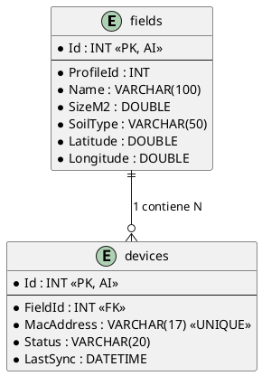
```plantuml
@startuml Database_Design_Monitoring

entity "fields" as fields {
    * Id : INT <<PK, AI>>
    --
    * ProfileId : INT
    * Name : VARCHAR(100)
    * SizeM2 : DOUBLE
    * SoilType : VARCHAR(50)
    * Latitude : DOUBLE
    * Longitude : DOUBLE
}

entity "devices" as devices {
    * Id : INT <<PK, AI>>
    --
    * FieldId : INT <<FK>>
    * MacAddress : VARCHAR(17) <<UNIQUE>>
    * Status : VARCHAR(20)
    * LastSync : DATETIME
}

fields ||--o{ devices : "1 contiene N"

@enduml
```

### 2.6.4. Bounded Context: Stock Management

#### 2.6.4.1. Domain Layer

| Archivo | Tipo de Componente | Responsabilidad Principal |
| :--- | :--- | :--- |
| Inventory.cs | Aggregate Root | Representa el registro de inventario de un producto y gestiona las reglas para actualizar o descontar stock. |
| InventoryAudit.cs | Partial Class / Audit | Implementa IAuditableEntity para auditoría de creación y actualización en el inventario. |
| IInventoryRepository.cs | Domain Repository Interface | Define el contrato de persistencia para la entidad e inventario del dominio. |
| CreateInventoryCommand.cs | Command Record | DTO de comando para solicitar el registro inicial de stock de un producto. |
| UpdateInventoryCommand.cs | Command Record | DTO de comando para actualizar la cantidad de stock disponible. |
| GetAllInventoryQuery.cs | Query Record | Estructura para solicitar la consulta de todos los registros de inventario. |
| GetInventoryByIdQuery.cs | Query Record | Estructura para consultar un registro de inventario por su identificador único. |

#### 2.6.4.2. Interface Layer

| Archivo | Tipo de Componente | Responsabilidad Principal |
| :--- | :--- | :--- |
| InventoriesController.cs | REST Controller | Maneja las solicitudes HTTP relacionadas con el inventario de stock (CRUD). |
| CreateInventoryResource.cs | DTO / Input Resource | Esquema de datos para la solicitud de creación de un registro de inventario. |
| UpdateInventoryResource.cs | DTO / Input Resource | Esquema de datos para la solicitud de actualización de la cantidad de stock. |
| InventoryResource.cs | DTO / Output Resource | Esquema de respuesta para la representación aplanada del inventario. |
| CreateInventoryCommandFromResourceAssembler.cs | Assembler / Transformer | Mapea un CreateInventoryResource a CreateInventoryCommand. |
| InventoryResourceFromEntityAssembler.cs | Assembler / Transformer | Mapea la entidad de agregado Inventory a un DTO InventoryResource. |

#### 2.6.4.3. Application Layer

| Archivo | Tipo de Componente | Responsabilidad Principal |
| :--- | :--- | :--- |
| StockError.cs | Enum / Error | Enumera los tipos de errores asociados a las operaciones de inventario. |
| IStockService.cs | Service Interface | Contrato del servicio de aplicación que define el manejo de comandos y consultas de stock. |
| StockService.cs | Application Service Implementation | Implementa los casos de uso para crear, actualizar y consultar registros de inventario con manejo de transacciones. |

#### 2.6.4.4. Infrastructure Layer

| Archivo | Tipo de Componente | Responsabilidad Principal |
| :--- | :--- | :--- |
| ModelBuilderExtensions.cs | EF Core Configuration / Extension | Configura la entidad Inventory en la base de datos (claves, tipos de columna y restricciones). |
| InventoryRepository.cs | Repository Implementation | Implementa la persistencia para la entidad Inventory en base de datos mediante EF Core. |

#### 2.6.4.5. Bounded Context Software Architecture Component Level Diagrams

```plantuml
@startuml C4_Component_Stock
!include https://raw.githubusercontent.com/plantuml-stdlib/C4-PlantUML/master/C4_Component.puml

LAYOUT_WITH_LEGEND()

title Component Diagram for Stock Management Bounded Context

Container(web_app, "Single-Page Application", "Angular", "Interfaz gráfica para la gestión de inventario y stock.")

Container_Boundary(api, "Stock Management Container") {
    Component(inventories_controller, "InventoriesController", "ASP.NET Core REST Controller", "Expone endpoints REST para inventario (/api/v1/inventories).")
    
    Component(stock_service, "StockService", "Application Service", "Coordina los casos de uso para consultar, crear y actualizar existencias.")
    
    Component(domain_model, "Domain Model", "Domain Layer", "Encapsula el Agregado Inventory, comandos, consultas y errores.")
    
    Component(inventory_repo, "InventoryRepository", "EF Core Repository", "Provee persistencia física de inventarios en MySQL.")
}

ContainerDb(database, "Relational Database", "MySQL", "Almacena existencias, ubicaciones y registros de inventario.")

Rel(web_app, inventories_controller, "Realiza peticiones HTTP/REST", "JSON/HTTPS")

Rel(inventories_controller, stock_service, "Invocación de Comandos y Consultas")

Rel(stock_service, domain_model, "Opera y modifica")

Rel(stock_service, inventory_repo, "Persiste y consulta mediante")

Rel(inventory_repo, database, "Lee y escribe datos en", "EF Core / MySQL Protocol")

@enduml
```

#### 2.6.4.6. Bounded Context Software Architecture Code Level Diagrams

##### 2.6.4.6.1. Bounded Context Domain Layer Class Diagrams

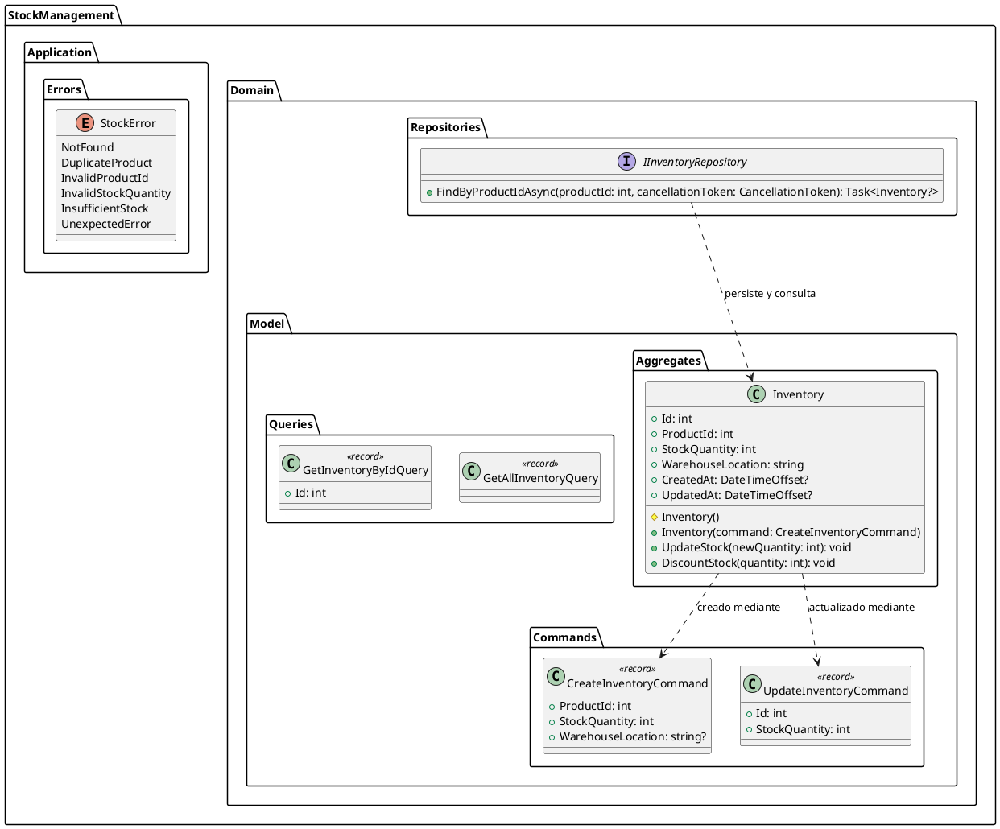
```plantuml
@startuml Domain_Class_Diagram_Stock

package "StockManagement.Domain.Model.Aggregates" {
    class Inventory {
        + Id: int
        + ProductId: int
        + StockQuantity: int
        + WarehouseLocation: string
        + CreatedAt: DateTimeOffset?
        + UpdatedAt: DateTimeOffset?
        # Inventory()
        + Inventory(command: CreateInventoryCommand)
        + UpdateStock(newQuantity: int): void
        + DiscountStock(quantity: int): void
    }
}

package "StockManagement.Domain.Model.Commands" {
    class CreateInventoryCommand <<record>> {
        + ProductId: int
        + StockQuantity: int
        + WarehouseLocation: string?
    }

    class UpdateInventoryCommand <<record>> {
        + Id: int
        + StockQuantity: int
    }
}

package "StockManagement.Domain.Model.Queries" {
    class GetAllInventoryQuery <<record>>
    class GetInventoryByIdQuery <<record>> {
        + Id: int
    }
}

package "StockManagement.Domain.Repositories" {
    interface IInventoryRepository {
        + FindByProductIdAsync(productId: int, cancellationToken: CancellationToken): Task<Inventory?>
    }
}

package "StockManagement.Application.Errors" {
    enum StockError {
        NotFound
        DuplicateProduct
        InvalidProductId
        InvalidStockQuantity
        InsufficientStock
        UnexpectedError
    }
}

' Relaciones
Inventory ..> CreateInventoryCommand : "creado mediante"
Inventory ..> UpdateInventoryCommand : "actualizado mediante"

IInventoryRepository ..> Inventory : "persiste y consulta"

@enduml
```

##### 2.6.4.6.2. Bounded Context Database Design Diagram

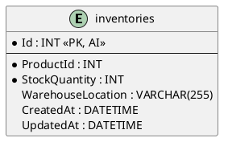
```plantuml
@startuml Database_Design_Stock

entity "inventories" as inventories {
    * Id : INT <<PK, AI>>
    --
    * ProductId : INT
    * StockQuantity : INT
    WarehouseLocation : VARCHAR(255)
    CreatedAt : DATETIME
    UpdatedAt : DATETIME
}

@enduml
```

### 2.6.5. Bounded Context: Notification Management

#### 2.6.5.1. Domain Layer

| Archivo | Tipo de Componente | Responsabilidad Principal |
| :--- | :--- | :--- |
| Notification.cs | Aggregate Root | Representa la entidad de notificación de un usuario y gestiona las reglas para marcarla como leída. |
| NotificationAudit.cs | Partial Class / Audit | Implementa IAuditableEntity para registrar marcas de tiempo de creación y actualización de notificaciones. |
| INotificationRepository.cs | Domain Repository Interface | Define el contrato de persistencia para consultar y almacenar notificaciones por perfil de usuario. |
| CreateNotificationCommand.cs | Command Record | DTO de comando para solicitar la creación y envío de una nueva notificación o alerta. |
| MarkAsReadCommand.cs | Command Record | DTO de comando para solicitar el cambio de estado de una notificación a leída. |
| GetNotificationByIdQuery.cs | Query Record | Estructura para consultar una notificación específica por su identificador único. |
| GetNotificationsByProfileQuery.cs | Query Record | Estructura para consultar el historial de notificaciones asociadas a un perfil. |

#### 2.6.5.2. Interface Layer

| Archivo | Tipo de Componente | Responsabilidad Principal |
| :--- | :--- | :--- |
| NotificationsController.cs | REST Controller | Maneja las solicitudes HTTP relacionadas con notificaciones y alertas (creación, lectura e historial). |
| CreateNotificationResource.cs | DTO / Input Resource | Esquema de datos para la solicitud de creación y envío de una notificación. |
| MarkAsReadResource.cs | DTO / Input Resource | Esquema de datos para solicitar el cambio de estado a leída. |
| NotificationResource.cs | DTO / Output Resource | Esquema de respuesta con los datos detallados de la notificación. |
| CreateNotificationCommandFromResourceAssembler.cs | Assembler / Transformer | Mapea un CreateNotificationResource a CreateNotificationCommand. |
| NotificationResourceFromEntityAssembler.cs | Assembler / Transformer | Mapea la entidad de agregado Notification a un DTO NotificationResource. |

#### 2.6.5.3. Application Layer

| Archivo | Tipo de Componente | Responsabilidad Principal |
| :--- | :--- | :--- |
| NotificationError.cs | Enum / Error | Enumera los tipos de errores asociados al procesamiento y envío de notificaciones. |
| INotificationService.cs | Service Interface | Contrato del servicio de aplicación que define la gestión de comandos y consultas para notificaciones. |
| NotificationService.cs | Application Service Implementation | Implementa la lógica de aplicación para crear, marcar como leídas y consultar notificaciones con control transaccional. |

#### 2.6.5.4. Infrastructure Layer

| Archivo | Tipo de Componente | Responsabilidad Principal |
| :--- | :--- | :--- |
| ModelBuilderExtensions.cs | EF Core Configuration / Extension | Configura el mapeo ORM de la entidad Notification en la base de datos (claves, restricciones y longitud de columnas). |
| NotificationRepository.cs | Repository Implementation | Implementa la persistencia y consultas específicas de notificaciones por perfil y estado de lectura mediante EF Core. |

#### 2.6.5.5. Bounded Context Software Architecture Component Level Diagrams

```plantuml
@startuml C4_Component_Notification
!include https://raw.githubusercontent.com/plantuml-stdlib/C4-PlantUML/master/C4_Component.puml

LAYOUT_WITH_LEGEND()

title Component Diagram for Notification Management Bounded Context

Container(web_app, "Single-Page Application", "Angular", "Interfaz gráfica para la gestión y visualización de notificaciones.")

Container_Boundary(api, "Notification Management Container") {
    Component(notifications_controller, "NotificationsController", "ASP.NET Core REST Controller", "Expone endpoints REST para notificaciones (/api/v1/notifications).")
    
    Component(notification_service, "NotificationService", "Application Service", "Coordina la creación, actualización de estado y envío de alertas.")
    
    Component(domain_model, "Domain Model", "Domain Layer", "Encapsula el Agregado Notification, comandos, consultas y reglas.")
    
    Component(notification_repo, "NotificationRepository", "EF Core Repository", "Provee persistencia física de notificaciones en MySQL.")
}

ContainerDb(database, "Relational Database", "MySQL", "Almacena alertas, mensajes, estados de lectura e historial por usuario.")

Rel(web_app, notifications_controller, "Realiza peticiones HTTP/REST", "JSON/HTTPS")

Rel(notifications_controller, notification_service, "Invocación de Comandos y Consultas")

Rel(notification_service, domain_model, "Opera y modifica")

Rel(notification_service, notification_repo, "Persiste y consulta mediante")

Rel(notification_repo, database, "Lee y escribe datos en", "EF Core / MySQL Protocol")

@enduml
```

#### 2.6.5.6. Bounded Context Software Architecture Code Level Diagrams

##### 2.6.5.6.1. Bounded Context Domain Layer Class Diagrams

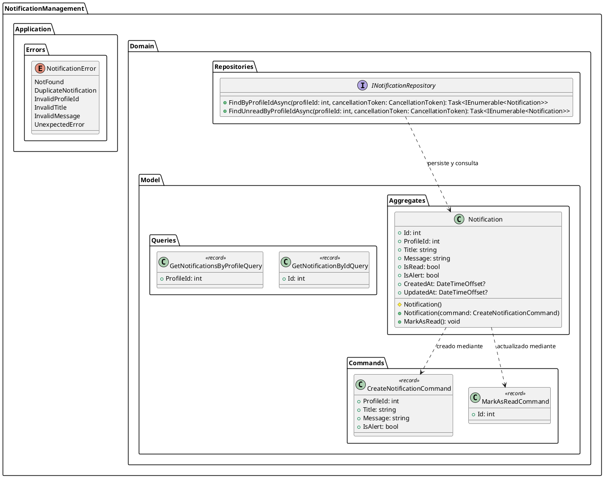
```plantuml
@startuml Domain_Class_Diagram_Notification

package "NotificationManagement.Domain.Model.Aggregates" {
    class Notification {
        + Id: int
        + ProfileId: int
        + Title: string
        + Message: string
        + IsRead: bool
        + IsAlert: bool
        + CreatedAt: DateTimeOffset?
        + UpdatedAt: DateTimeOffset?
        # Notification()
        + Notification(command: CreateNotificationCommand)
        + MarkAsRead(): void
    }
}

package "NotificationManagement.Domain.Model.Commands" {
    class CreateNotificationCommand <<record>> {
        + ProfileId: int
        + Title: string
        + Message: string
        + IsAlert: bool
    }

    class MarkAsReadCommand <<record>> {
        + Id: int
    }
}

package "NotificationManagement.Domain.Model.Queries" {
    class GetNotificationByIdQuery <<record>> {
        + Id: int
    }

    class GetNotificationsByProfileQuery <<record>> {
        + ProfileId: int
    }
}

package "NotificationManagement.Domain.Repositories" {
    interface INotificationRepository {
        + FindByProfileIdAsync(profileId: int, cancellationToken: CancellationToken): Task<IEnumerable<Notification>>
        + FindUnreadByProfileIdAsync(profileId: int, cancellationToken: CancellationToken): Task<IEnumerable<Notification>>
    }
}

package "NotificationManagement.Application.Errors" {
    enum NotificationError {
        NotFound
        DuplicateNotification
        InvalidProfileId
        InvalidTitle
        InvalidMessage
        UnexpectedError
    }
}

' Relaciones
Notification ..> CreateNotificationCommand : "creado mediante"
Notification ..> MarkAsReadCommand : "actualizado mediante"

INotificationRepository ..> Notification : "persiste y consulta"

@enduml
```

##### 2.6.5.6.2. Bounded Context Database Design Diagram

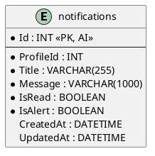
```plantuml
@startuml Database_Design_Notification

entity "notifications" as notifications {
    * Id : INT <<PK, AI>>
    --
    * ProfileId : INT
    * Title : VARCHAR(255)
    * Message : VARCHAR(1000)
    * IsRead : BOOLEAN
    * IsAlert : BOOLEAN
    CreatedAt : DATETIME
    UpdatedAt : DATETIME
}

@enduml
```

### 2.6.6. Bounded Context: Shared Bounded

#### 2.6.6.1. Domain Layer

| Archivo | Tipo de Componente | Responsabilidad Principal |
| :--- | :--- | :--- |
| IAuditableEntity.cs | Entity Interface | Contrato para entidades que requieren seguimiento de marcas de tiempo de auditoría (creación y actualización). |
| IEvent.cs | Domain Event Interface | Interfaz base para marcar eventos de dominio e integrarlos con el bus de eventos del patrón mediador. |
| Error.cs | Value Record | Estructura para la representación unificada de errores de dominio con código y mensaje. |
| IBaseRepository.cs | Repository Interface | Interfaz genérica que define las operaciones CRUD fundamentales para todos los repositorios. |
| IUnitOfWork.cs | Repository Interface | Contrato para la confirmación atómica de cambios en la capa de persistencia. |

#### 2.6.6.2. Interface Layer

| Archivo | Tipo de Componente | Responsabilidad Principal |
| :--- | :--- | :--- |
| ProblemDetailsFactory.cs | Interface Custom Factory | Construye respuestas uniformes de error estandarizadas (RFC 7807 Problem Details) con soporte de localización para la API REST. |

#### 2.6.6.3. Application Layer

| Archivo | Tipo de Componente | Responsabilidad Principal |
| :--- | :--- | :--- |
| IEventHandler.cs | Application Event Handler Interface | Abstracción para el manejo y suscripción de eventos de dominio integrados con el patrón Mediador. |
| Result.cs | Application Model / Functional Result | Wrapper genérico y no genérico que encapsula el resultado de las operaciones en la capa de aplicación (éxito o fallo con errores fuertemente tipados). |

#### 2.6.6.4. Infrastructure Layer

| Archivo | Tipo de Componente | Responsabilidad Principal |
| :--- | :--- | :--- |
| AppDbContext.cs | EF Core DbContext | Contexto principal de la base de datos que registra los modelos de todos los Bounded Contexts y aplica las convenciones de nombrado snake_case e interceptores. |
| AuditableEntityInterceptor.cs | EF Core Interceptor | Intercepta la persitencia en EF Core para auditar automáticamente las marcas de tiempo (CreatedAt y UpdatedAt) en entidades IAuditableEntity. |
| BaseRepository.cs | Base Repository Implementation | Implementación genérica de las operaciones de lectura, escritura y borrado sobre Entity Framework Core. |
| UnitOfWork.cs | Repository Implementation | Controla la confirmación de transacciones atómicas llamando al guardado centralizado de cambios en el AppDbContext. |
| LoggingCommandBehavior.cs | Mediator Pipeline Behavior | Intercepta la ejecución de comandos para registrar logs de auditoría antes y después de su procesamiento. |
| GlobalExceptionHandlerMiddleware.cs | ASP.NET Core Middleware | Middleware centralizado de gestión de excepciones no capturadas para transformarlas en respuestas normalizadas Problem Details. |
| MiddlewareExtensions.cs | Middleware Extension | Método de extensión de IApplicationBuilder para registrar de forma limpia el middleware de excepciones globales en el pipeline HTTP. |

# Capítulo III: Solution UI/UX Design

[Volver al contenido principal](#contenido)

> Pendiente de desarrollo.

## 3.1. Product Design

### 3.1.1. Style Guidelines

#### 3.1.1.1. General Style Guidelines

### 3.1.2. Information Architecture

#### 3.1.2.1. Organization Systems

#### 3.1.2.2. Labelling Systems

#### 3.1.2.3. SEO Tags and Meta Tags

#### 3.1.2.4. Searching Systems

#### 3.1.2.5. Navigation Systems

### 3.1.3. Landing Page UI Design

#### 3.1.3.1. Landing Page Wireframe

#### 3.1.3.2. Landing Page Mock-up

### 3.1.4. Mobile Applications UX/UI Design

#### 3.1.4.1. Mobile Applications Wireframes

#### 3.1.4.2. Mobile Applications Wireflow Diagrams

#### 3.1.4.3. Mobile Applications Mock-ups

#### 3.1.4.4. Mobile Applications User Flow Diagrams

#### 3.1.4.5. Mobile Applications Prototyping

# Capítulo IV: Product Implementation & Validation

[Volver al contenido principal](#contenido)

> Pendiente de desarrollo.

## 4.1. Software Configuration Management

### 4.1.1. Software Development Environment Configuration

### 4.1.2. Source Code Management

### 4.1.3. Source Code Style Guide & Conventions

### 4.1.4. Software Deployment Configuration

## 4.2. Landing Page & Mobile Application Implementation

Repetir la siguiente estructura por cada sprint, reemplazando «x» por la posición de la subsección y «n» por el número del sprint.

### 4.2.x. Sprint n

#### 4.2.x.1. Sprint Planning n

#### 4.2.x.2. Aspect Leaders and Collaborators

#### 4.2.x.3. Sprint Backlog n

#### 4.2.x.4. Development Evidence for Sprint Review

#### 4.2.x.5. Testing Suite Evidence for Sprint Review

#### 4.2.x.6. Execution Evidence for Sprint Review

#### 4.2.x.7. Services Documentation Evidence for Sprint Review

#### 4.2.x.8. Software Deployment Evidence for Sprint Review

#### 4.2.x.9. Team Collaboration Insights during Sprint

## 4.3. Validation Interviews

### 4.3.1. Diseño de Entrevistas

### 4.3.2. Registro de Entrevistas

### 4.3.3. Evaluaciones según heurísticas

## 2.6. Tactical-Level Domain-Driven Design

El Diseño Táctico de DDD complementa la arquitectura del software guiando el desarrollo mediante patrones de diseño estandarizados, lo que garantiza la correcta implementación de las reglas de negocio y asegura la mantenibilidad del sistema. 

### 2.6.1. Bounded Context: Identity & Access Management

#### 2.6.1.1. Domain Layer

| Archivo | Tipo de Componente | Responsabilidad Principal |
| :--- | :--- | :--- |
| User.cs | Aggregate Root | Entidad principal que gestiona el ciclo de vida e identidad del usuario. |
| UserAudit.cs | Partial Entity / Extension | Implementa propiedades de auditoría (`CreatedAt`, `UpdatedAt`). |
| Email.cs | Value Object | Valida, encapsula y normaliza la dirección de correo electrónico. |
| IUserRepository.cs | Domain Repository Interface | Define el contrato de persistencia para consultar y almacenar usuarios. |
| SignInCommand.cs / SignUpCommand.cs | Domain Command | Estructuras de datos para solicitar el inicio o creación de sesión. |
| GetUserByEmailQuery.cs / GetUserByIdQuery.cs | Domain Query | Estructuras de datos para consultar usuarios por ID o Email. |
| IamErrors.cs / IamError.cs | Domain Model Errors | Define los códigos y mensajes de error específicos de autenticación e identidad. |

#### 2.6.1.2. Interface Layer

| Archivo | Tipo de Componente | Responsabilidad Principal |
| :--- | :--- | :--- |
| AuthenticationController.cs | REST Controller | Gestiona las peticiones de autenticación (`sign-in`, `sign-up`). |
| UsersController.cs | REST Controller | Gestiona las peticiones de consulta de usuarios por ID o Email. |
| IIamContextFacade.cs | ACL / Facade Interface | Contrato para integración segura e inter-contexto. |
| SignInResource.cs / SignUpResource.cs | Inbound Resource (DTO) | Representa los datos recibidos en las solicitudes de autenticación. |
| UserResource.cs / AuthenticatedUserResource.cs | Outbound Resource (DTO) | Representa la estructura de respuesta enviada al cliente HTTP. |
| SignInCommandFromResourceAssembler.cs | Assembler / Mapper | Transforma `SignInResource` a `SignInCommand`. |
| SignUpCommandFromResourceAssembler.cs | Assembler / Mapper | Transforma `SignUpResource` a `SignUpCommand`. |
| UserResourceFromEntityAssembler.cs | **Assembler / Mapper | Transforma la entidad `User` a `UserResource`. |
| AuthenticatedUserResourceFromEntityAssembler.cs | Assembler / Mapper | Transforma `User` y JWT Token a `AuthenticatedUserResource`. |
| IamActionResultAssembler.cs | REST Response Mapper | Traduce errores y resultados de dominio a respuestas HTTP (`ProblemDetails`). |

#### 2.6.1.3. Application Layer

| Archivo | Tipo de Componente | Responsabilidad Principal |
| :--- | :--- | :--- |
| IUserCommandService.cs | Inbound Command Port | Contrato para la ejecución de comandos de usuario (sign-in, sign-up). |
| UserCommandService.cs | Command Application Service | Orquesta la lógica de casos de uso de registro y autenticación. |
| IUserQueryService.cs | Inbound Query Port | Contrato para la ejecución de consultas de lectura sobre usuarios. |
| UserQueryService.cs | Query Application Service | Implementa las consultas para obtener usuarios por ID o Email. |
| ITokenService.cs | Outbound Service Interface | Contrato para generación y validación de tokens JWT. |
| IHashingService.cs | Outbound Service Interface | Contrato para cifrado y verificación de contraseñas. |
| IamContextFacade.cs | ACL Facade Implementation | Implementa la fachada de integración pública para otros Bounded Contexts. |

#### 2.6.1.4. Infrastructure Layer

| Archivo | Tipo de Componente | Responsabilidad Principal |
| :--- | :--- | :--- |
| UserRepository.cs | Repository Implementation | Implementa las operaciones de persistencia en base de datos para el Agregado User. |
| ModelBuilderExtensions.cs | ORM Mapping Configuration | Configura el esquema de la tabla de usuarios e índices únicos en Entity Framework Core. |
| TokenService.cs | Security Service Implementation | Gestiona la creación y validación técnica de tokens JWT. |
| TokenSettings.cs | Configuration Model | Representa las claves y configuraciones del token leídas desde appsettings.json. |
| HashingService.cs | Security Service Implementation | Realiza el cifrado y validación de contraseñas utilizando el algoritmo BCrypt. |
| RequestAuthorizationMiddleware.cs | ASP.NET Core Middleware | Intercepta peticiones HTTP para extraer y validar el token JWT adjunto. |
| RequestAuthorizationMiddlewareExtensions.cs | Middleware Extension | Registra el middleware de autorización dentro de la canalización de la aplicación. |
| AuthorizeAttribute.cs | Authorization Filter | Filtro que valida la presencia del usuario autenticado en el contexto HTTP. |
| AllowAnonymousAttribute.cs | Metadata Attribute | Atributo para omitir la validación de autorización en endpoints públicos. |

#### 2.6.1.5. Bounded Context Software Architecture Component Level Diagrams

```plantuml
@startuml C4_Component_IAM
!include https://raw.githubusercontent.com/plantuml-stdlib/C4-PlantUML/master/C4_Component.puml

title Component Diagram for IAM Bounded Context

Container(spa, "Single-Page Application", "React / Web Browser", "Interfaz de usuario de la plataforma TerraTech")
Container(external_bc, "Other Bounded Contexts", "C# / .NET", "Otros módulos de la plataforma (ej. Profile)")
ContainerDb(database, "Database", "MySQL / PostgreSQL", "Almacena los datos de usuarios e identidad")

Container_Boundary(iam_bc, "IAM Bounded Context") {
    
    Boundary(interface_layer, "Interface Layer") {
        Component(auth_ctrl, "Authentication Controller", "ASP.NET Core REST Controller", "Expone endpoints REST para inicio de sesión y registro (/api/v1/authentication)")
        Component(users_ctrl, "Users Controller", "ASP.NET Core REST Controller", "Expone endpoints REST protegidos para la gestión de usuarios (/api/v1/users)")
        Component(assemblers, "DTO Assemblers / Mappers", "C# Static Classes", "Transforma objetos entre Resources (DTOs), Comandos, Consultas y Entidades")
        Component(acl_facade, "IAM Context Facade", "C# Class (ACL)", "Ofrece un punto de entrada público desacoplado para otros Bounded Contexts")
    }

    Boundary(application_layer, "Application Layer") {
        Component(cmd_service, "User Command Service", "C# Application Service", "Orquesta la lógica de casos de uso para escribir/modificar datos (SignUp, SignIn)")
        Component(query_service, "User Query Service", "C# Application Service", "Orquesta los casos de uso de lectura (GetUserById, GetUserByEmail)")
    }

    Boundary(domain_layer, "Domain Layer") {
        Component(user_aggregate, "User Aggregate Root", "C# Domain Entity & Value Objects", "Representa al usuario e impone las reglas de negocio (Email, PasswordHash)")
        Component(repo_interface, "IUserRepository Interface", "C# Domain Interface", "Define el contrato de persistencia para los agregados de tipo User")
    }

    Boundary(infrastructure_layer, "Infrastructure Layer") {
        Component(user_repo, "UserRepository Implementation", "Entity Framework Core", "Implementa IUserRepository para interactuar con la base de datos")
        Component(token_service, "Token Service", "System.IdentityModel.Tokens.Jwt", "Genera y valida tokens de acceso JWT")
        Component(hashing_service, "Hashing Service", "BCrypt.Net", "Procesa el encriptado y verificación de contraseñas")
        Component(auth_middleware, "Authorization Middleware & Attributes", "ASP.NET Core Pipeline", "Intercepta solicitudes HTTP, valida JWT e inyecta el usuario en HttpContext")
    }
}

' Interacciones Externas
Rel(spa, auth_ctrl, "Envía peticiones de Sign-In / Sign-Up", "JSON / HTTPS")
Rel(spa, users_ctrl, "Consulta datos de usuario", "JSON / HTTPS / JWT")
Rel(external_bc, acl_facade, "Invoca operaciones de IAM inter-contexto", "C# Method Calls")

' Interacciones Internas de la Capa de Interfaz
Rel(auth_ctrl, assemblers, "Utiliza para mapear Resources a Commands", "In-Process")
Rel(users_ctrl, assemblers, "Utiliza para mapear Entities a Resources", "In-Process")
Rel(auth_ctrl, cmd_service, "Envía SignInCommand y SignUpCommand", "In-Process")
Rel(users_ctrl, query_service, "Envía GetUserByIdQuery y GetUserByEmailQuery", "In-Process")
Rel(acl_facade, cmd_service, "Ejecuta SignUpCommand", "In-Process")
Rel(acl_facade, query_service, "Ejecuta GetUserByEmailQuery / GetUserByIdQuery", "In-Process")

' Interacciones de la Capa de Aplicación
Rel(cmd_service, user_aggregate, "Instancia y modifica el estado del Agregado", "In-Process")
Rel(cmd_service, repo_interface, "Persiste cambios de agregados", "In-Process")
Rel(cmd_service, hashing_service, "Cifra y verifica contraseñas", "In-Process")
Rel(cmd_service, token_service, "Genera tokens JWT tras autenticación exitosa", "In-Process")
Rel(query_service, repo_interface, "Consulta agregados User", "In-Process")

' Interacciones de la Capa de Infraestructura
Rel(auth_middleware, token_service, "Valida el token JWT en las peticiones HTTP", "In-Process")
Rel(auth_middleware, query_service, "Carga la información del usuario autenticado", "In-Process")
Rel(user_repo, repo_interface, "Implementa", "C# Inheritance")
Rel(user_repo, database, "Lee y escribe registros de la tabla 'users'", "SQL / EF Core")

@enduml
```

#### 2.6.1.6. Bounded Context Software Architecture Code Level Diagrams

##### 2.6.1.6.1. Bounded Context Domain Layer Class Diagrams

```plantuml
@startuml DomainLayer_IAM_ClassDiagram

package "IAM" {
    package "Domain" {
        package "Model" {
            
            package "Aggregates" {
                interface IAuditableEntity {
                    + CreatedAt : DateTimeOffset? {get; set;}
                    + UpdatedAt : DateTimeOffset? {get; set;}
                }

                class User <<Aggregate Root>> {
                    + Id : int {get;}
                    + EmailAddress : Email {get; private set;}
                    - PasswordHash : string {get; private set;}
                    + CreatedAt : DateTimeOffset? {get; set;}
                    + UpdatedAt : DateTimeOffset? {get; set;}
                    + User()
                    + User(emailAddress : Email, passwordHash : string)
                    + UpdateEmail(newEmail : Email) : User
                    + UpdatePasswordHash(newPasswordHash : string) : User
                }

                IAuditableEntity <|.. User : implements
            }

            package "ValueObjects" {
                class Email <<Value Object>> {
                    + Value : string {get; init;}
                    - {static} EmailValidationRegex() : Regex
                    + Email(value : string)
                    + ToString() : string
                }
            }

            package "Commands" {
                class SignInCommand <<Record>> {
                    + Email : string {get; init;}
                    + Password : string {get; init;}
                    + SignInCommand(Email : string, Password : string)
                }

                class SignUpCommand <<Record>> {
                    + Email : string {get; init;}
                    + Password : string {get; init;}
                    + SignUpCommand(Email : string, Password : string)
                }
            }

            package "Queries" {
                class GetUserByEmailQuery <<Record>> {
                    + Email : string {get; init;}
                    + GetUserByEmailQuery(Email : string)
                }

                class GetUserByIdQuery <<Record>> {
                    + Id : int {get; init;}
                    + GetUserByIdQuery(Id : int)
                }
            }

            package "Errors" {
                enum IamError {
                    None
                    UserNotFound
                    UsernameAlreadyTaken
                    InvalidCredentials
                    OperationCancelled
                    DatabaseError
                    InternalServerError
                    ExternalServiceError
                }

                class Error <<Value Object>> {
                    + Code : string {get;}
                    + Message : string {get;}
                    + Error(code : string, message : string)
                }

                class IamErrors <<Static>> {
                    + {static} InvalidCredentials : Error
                    + {static} UsernameAlreadyTaken : Error
                    + {static} UserCreationFailed : Error
                }
            }
        }

        package "Repositories" {
            interface IBaseRepository<T> {
                + AddAsync(entity : T, cancellationToken : CancellationToken) : Task
                + FindByIdAsync(id : int, cancellationToken : CancellationToken) : Task<T?>
            }

            interface IUserRepository {
                + FindByEmailAsync(emailAddress : Email, cancellationToken : CancellationToken) : Task<User?>
                + ExistsByEmailAsync(emailAddress : Email, cancellationToken : CancellationToken) : Task<bool>
            }

            IBaseRepository <|-- IUserRepository : extends
        }
    }
}

' Relaciones del Modelo Táctico
User "1" *-- "1" Email : contains >
IUserRepository ..> User : manages >
IamErrors o-- Error : contains >

@enduml
```

##### 2.6.1.6.2. Bounded Context Database Design Diagram

```plantuml
@startuml Database_Design_IAM

entity "users" as users {
    * id : INT <<PK, AUTO_INCREMENT>>
    --
    * email_address : VARCHAR(255) <<UNIQUE, NOT NULL>>
    * password_hash : LONGTEXT / VARCHAR <<NOT NULL>>
    created_at : DATETIMEOFFSET <<NULL>>
    updated_at : DATETIMEOFFSET <<NULL>>
}

@enduml
```

### 2.6.2. Bounded Context: Analytics Management 

#### 2.6.2.1. Domain Layer

| Archivo | Tipo de Componente | Responsabilidad Principal |
| :--- | :--- | :--- |
| Report.cs | Aggregate Root | Entidad principal que modela los datos analíticos e impone reglas de modificación de métricas. |
| ReportAudit.cs | Partial Class / Auditing | Incorpora propiedades de auditoría temporal (CreatedAt, UpdatedAt) al Agregado Report. |
| DeviceId.cs | Value Object | Encapsula y valida el identificador numérico del dispositivo. |
| GeneratedAt.cs | Value Object | Encapsula y valida la fecha de generación del reporte analítico. |
| MeanValue.cs | Value Object | Encapsula y valida el valor promedio estadístico (rango 0 - 100). |
| Variance.cs | Value Object | Encapsula y valida la varianza estadística (no negativa). |
| StandardDeviation.cs | Value Object | Encapsula y valida la desviación estándar (no negativa). |
| TechnicalInterpretation.cs | Value Object | Encapsula y valida la interpretación técnica textual del análisis. |
| CreateReportCommand.cs | Command | Transporta los datos requeridos para la creación de un reporte. |
| UpdateReportCommand.cs | Command | Transporta los datos requeridos para la actualización de un reporte existente. |
| GetReportByIdQuery.cs | Query | Transporta el identificador para la consulta individual de un reporte. |
| IReportRepository.cs | Domain Repository Interface | Define las operaciones de lectura y consulta especializadas para la entidad Report. |

#### 2.6.2.2. Interface Layer

| Archivo | Tipo de Componente | Responsabilidad Principal |
| :--- | :--- | :--- |
| ReportsController.cs | REST Controller | Expone y gestiona los endpoints HTTP REST para la administración de reportes analíticos. |
| CreateReportResource.cs | Request DTO | Contrato de entrada con validaciones para crear un reporte. |
| UpdateReportResource.cs | Request DTO | Contrato de entrada con validaciones para actualizar estadísticas de un reporte. |
| ReportResource.cs | Response DTO | Contrato de salida con los datos formateados del reporte analítico. |
| CreateReportCommandFromResourceAssembler.cs | Assembler / Transformer | Mapea CreateReportResource hacia el objeto inmutable CreateReportCommand. |
| ReportResourceFromEntityAssembler.cs | Assembler / Transformer | Mapea la entidad de dominio Report hacia el recurso de respuesta ReportResource. |
| ActionResultFromCreateReportResultAssembler.cs | Assembler / HTTP Transformer | Convierte el objeto Result<Report> en respuestas HTTP estructuradas (201, 409, 500). |

#### 2.6.2.3. Application Layer

| Archivo | Tipo de Componente | Responsabilidad Principal |
| :--- | :--- | :--- |
| IReportCommandService.cs | Service Interface | Contrato para la ejecución de comandos de modificación de reportes. |
| ReportCommandService.cs | Application Service | Orquesta la creación y actualización de agregados Report y la confirmación en el UnitOfWork. |
| IReportQueryService.cs | Service Interface | Contrato para la consulta de datos de reportes analíticos. |
| ReportQueryService.cs | Application Service | Implementa la lógica de recuperación de reportes desde el repositorio de dominio. |
| CreateReportError.cs | Application Error Enum | Define los tipos de errores de negocio para la creación de reportes. |
| UpdateReportError.cs | Application Error Enum | Define los tipos de errores de negocio para la actualización de reportes. |

#### 2.6.2.4. Infrastructure Layer

| Archivo | Tipo de Componente | Responsabilidad Principal |
| :--- | :--- | :--- |
| ReportRepository.cs | Concrete Repository | Implementa la persistencia y consultas específicas del Agregado Report sobre Entity Framework Core. |
| ModelBuilderExtensions.cs | EF Core Configuration | Configura el mapeo ORM Fluent API del Agregado Report y sus Objetos de Valor en la base de datos. |

#### 2.6.2.5. Bounded Context Software Architecture Component Level Diagrams

#### 2.6.2.5. Bounded Context Software Architecture Component Level Diagrams

```plantuml
@startuml AnalyticsManagement_ComponentDiagram

package "AnalyticsManagement Bounded Context" {

    [REST API Controller] as Controller
    
    package "Application Layer" {
        [ReportCommandService] as CmdService
        [ReportQueryService] as QueryService
    }

    package "Domain Layer" {
        [Report Aggregate] as Aggregate
        [IReportRepository] as RepInterface
    }

    package "Infrastructure Layer" {
        [ReportRepository] as RepImpl
        [DbContext / ORM] as ORM
    }
}

database "MySQL Database" as DB

' Relationships
Controller --> CmdService
Controller --> QueryService

CmdService --> Aggregate
CmdService --> RepInterface
QueryService --> RepInterface

RepImpl ..|> RepInterface
RepImpl --> ORM
ORM --> DB

@enduml
```

#### 2.6.2.6. Bounded Context Software Architecture Code Level Diagrams

##### 2.6.2.6.1. Bounded Context Domain Layer Class Diagrams

```plantuml
@startuml DomainLayer_AnalyticsManagement_ClassDiagram

package "AnalyticsManagement" {
    package "Domain" {
        package "Model" {
            
            package "Aggregates" {
                interface IAuditableEntity {
                    + CreatedAt : DateTimeOffset? {get; set;}
                    + UpdatedAt : DateTimeOffset? {get; set;}
                }

                class Report <<Aggregate Root>> {
                    + Id : int {get; private set;}
                    + DeviceId : DeviceId {get; private set;}
                    + GeneratedAt : GeneratedAt {get; private set;}
                    + MeanValue : MeanValue {get; private set;}
                    + Variance : Variance {get; private set;}
                    + StandardDeviation : StandardDeviation {get; private set;}
                    + TechnicalInterpretation : TechnicalInterpretation {get; private set;}
                    + CreatedAt : DateTimeOffset? {get; set;}
                    + UpdatedAt : DateTimeOffset? {get; set;}
                    + Report()
                    + Report(command : CreateReportCommand)
                    + UpdateStatistics(mean : double, variance : double, stdDev : double, interpretation : string) : void
                }

                IAuditableEntity <|.. Report : implements
            }

            package "ValueObjects" {
                class DeviceId <<Value Object>> {
                    + Value : int {get;}
                    + DeviceId(value : int)
                    + ToString() : string
                }

                class GeneratedAt <<Value Object>> {
                    + Value : DateTimeOffset {get;}
                    + GeneratedAt(value : DateTimeOffset)
                    + ToString() : string
                }

                class MeanValue <<Value Object>> {
                    + Value : double {get;}
                    + MeanValue(value : double)
                    + ToString() : string
                }

                class Variance <<Value Object>> {
                    + Value : double {get;}
                    + Variance(value : double)
                    + ToString() : string
                }

                class StandardDeviation <<Value Object>> {
                    + Value : double {get;}
                    + StandardDeviation(value : double)
                    + ToString() : string
                }

                class TechnicalInterpretation <<Value Object>> {
                    + Value : string {get;}
                    + TechnicalInterpretation(value : string)
                    + ToString() : string
                }
            }

            package "Commands" {
                class CreateReportCommand <<Record>> {
                    + DeviceId : DeviceId {get;}
                    + GeneratedAt : GeneratedAt {get;}
                    + MeanValue : MeanValue {get;}
                    + Variance : Variance {get;}
                    + StandardDeviation : StandardDeviation {get;}
                    + TechnicalInterpretation : TechnicalInterpretation {get;}
                }

                class UpdateReportCommand <<Record>> {
                    + Id : int {get;}
                    + MeanValue : double {get;}
                    + Variance : double {get;}
                    + StandardDeviation : double {get;}
                    + TechnicalInterpretation : string {get;}
                }
            }

            package "Queries" {
                class GetReportByIdQuery <<Record>> {
                    + Id : int {get;}
                }
            }
        }

        package "Repositories" {
            interface IBaseRepository<T> {
                + AddAsync(entity : T, cancellationToken : CancellationToken) : Task
                + FindByIdAsync(id : int, cancellationToken : CancellationToken) : Task<T?>
                + ListAsync(cancellationToken : CancellationToken) : Task<IEnumerable<T>>
                + Update(entity : T) : void
            }

            interface IReportRepository {
                + FindByDeviceIdAsync(deviceId : DeviceId, cancellationToken : CancellationToken) : Task<IEnumerable<Report>>
                + FindByDateRangeAsync(from : GeneratedAt, to : GeneratedAt, cancellationToken : CancellationToken) : Task<IEnumerable<Report>>
                + FindByDeviceIdAndGeneratedAtAsync(deviceId : DeviceId, generatedAt : GeneratedAt, cancellationToken : CancellationToken) : Task<Report?>
            }

            IBaseRepository <|-- IReportRepository : extends
        }
    }
}

' Relaciones del Modelo Táctico
Report "1" *-- "1" DeviceId : contains >
Report "1" *-- "1" GeneratedAt : contains >
Report "1" *-- "1" MeanValue : contains >
Report "1" *-- "1" Variance : contains >
Report "1" *-- "1" StandardDeviation : contains >
Report "1" *-- "1" TechnicalInterpretation : contains >

IReportRepository ..> Report : manages >
CreateReportCommand ..> Report : instantiates >

@enduml
```

##### 2.6.2.6.2. Bounded Context Database Design Diagram

```plantuml
@startuml AnalyticsManagement_DatabaseDesign

entity "reports" as reports {
    * id : INT <<PK, AUTO_INCREMENT>>
    --
    * device_id : INT <<NOT NULL>>
    * generated_at : DATETIMEOFFSET <<NOT NULL>>
    * mean_value : DOUBLE <<NOT NULL>>
    * variance : DOUBLE <<NOT NULL>>
    * standard_deviation : DOUBLE <<NOT NULL>>
    * technical_interpretation : VARCHAR(500) <<NOT NULL>>
    created_at : DATETIMEOFFSET <<NULL>>
    updated_at : DATETIMEOFFSET <<NULL>>
}

@enduml
```

### 2.6.3. Bounded Context: Monitoring Management

#### 2.6.3.1. Domain Layer

| Archivo | Tipo de Componente | Responsabilidad Principal |
| :--- | :--- | :--- |
| Field.cs | Aggregate Root | Representa una parcela o campo agrícola y gestiona sus reglas internas de actualización. |
| FieldAudit.cs | Partial Class / Audit | Implementa IAuditableEntity para registrar marcas de tiempo de creación y actualización de campos. |
| Device.cs | Aggregate Root | Representa un dispositivo/sensor de monitoreo asociado a un campo. |
| DeviceAudit.cs | Partial Class / Audit | Implementa IAuditableEntity para registrar marcas de tiempo de creación y actualización de dispositivos. |
| IFieldRepository.cs | Domain Repository Interface | Define el contrato de persistencia para el agregado Field. |
| IDeviceRepository.cs | Domain Repository Interface | Define el contrato de persistencia para el agregado Device. |
| DeviceStatus.cs | Value Object | Encapsula y normaliza el estado del dispositivo (ONLINE, OFFLINE, LOW_BATTERY). |
| FieldId.cs | Value Object | Encapsula el identificador de la parcela. |
| FieldName.cs | Value Object | Valida y almacena el nombre del campo. |
| LastSync.cs | Value Object | Almacena la marca de tiempo de la última sincronización del dispositivo. |
| LocationLatLong.cs | Value Object | Valida y almacena la latitud y longitud de la parcela. |
| MacAddress.cs | Value Object | Valida el formato de la dirección MAC del dispositivo. |
| ProfileId.cs | Value Object | Encapsula el identificador del perfil del usuario propietario. |
| SizeM2.cs | Value Object | Valida y almacena la extensión en metros cuadrados. |
| SoilType.cs | Value Object | Valida y almacena la clasificación del tipo de suelo. |
| CreateFieldCommand.cs | Command Record | DTO de comando para solicitar la creación de un campo. |
| UpdateFieldCommand.cs | Command Record | DTO de comando para solicitar la actualización de un campo. |
| DeleteFieldCommand.cs | Command Record | DTO de comando para solicitar la eliminación de un campo. |
| CreateDeviceCommand.cs | Command Record | DTO de comando para solicitar la creación de un dispositivo. |
| UpdateDeviceCommand.cs | Command Record | DTO de comando para solicitar la actualización de un dispositivo. |
| DeleteDeviceCommand.cs | Command Record | DTO de comando para solicitar la eliminación de un dispositivo. |
| GetFieldByIdQuery.cs | Query Record | Estructura para consultar un campo por su identificador. |
| GetFieldBySoilTypeQuery.cs | Query Record | Estructura para consultar campos por tipo de suelo. |
| GetDeviceByIdQuery.cs | Query Record | Estructura para consultar un dispositivo por su identificador. |
| GetDevicesByStatusQuery.cs | Query Record | Estructura para consultar dispositivos por estado operativo. |
| GetDevicesByFieldIdQuery.cs | Query Record | Estructura para consultar dispositivos asociados a un campo. |

#### 2.6.3.2. Interface Layer

| Archivo | Tipo de Componente | Responsabilidad Principal |
| :--- | :--- | :--- |
| FieldsController.cs | REST Controller | Maneja las solicitudes HTTP relacionadas con campos/parcelas (CRUD y consultas por tipo de suelo). |
| DevicesController.cs | REST Controller | Maneja las solicitudes HTTP relacionadas con dispositivos IoT (CRUD y consultas por campo/estado). |
| CreateFieldResource.cs | DTO / Input Resource | DTO para la creación de un nuevo campo con validaciones de formulario. |
| UpdateFieldResource.cs | DTO / Input Resource | DTO para la actualización de un campo existente. |
| FieldResource.cs | DTO / Output Resource | DTO de respuesta para la representación aplanada de un campo (Field). |
| CreateDeviceResource.cs | DTO / Input Resource | DTO para la creación de un dispositivo IoT con validación de dirección MAC y estado. |
| UpdateDeviceResource.cs | DTO / Input Resource | DTO para la actualización de datos de un dispositivo. |
| DeviceResource.cs | DTO / Output Resource | DTO de respuesta para la representación aplanada de un dispositivo (Device). |
| CreateFieldCommandFromResourceAssembler.cs | Assembler / Transformer | Mapea un CreateFieldResource a CreateFieldCommand con Value Objects. |
| UpdateFieldCommandFromResourceAssembler.cs | Assembler / Transformer | Mapea un UpdateFieldResource a UpdateFieldCommand. |
| FieldResourceFromEntityAssembler.cs | Assembler / Transformer | Mapea la entidad de agregado Field a FieldResource. |
| ActionResultFromCreateFieldResultAssembler.cs | Result Assembler | Transforma el Result<Field> de la aplicación a una respuesta ActionResult de ASP.NET Core. |
| CreateDeviceCommandFromResourceAssembler.cs | Assembler / Transformer | Mapea un CreateDeviceResource a CreateDeviceCommand. |
| UpdateDeviceCommandFromResourceAssembler.cs | Assembler / Transformer | Mapea un UpdateDeviceResource a UpdateDeviceCommand. |
| DeviceResourceFromEntityAssembler.cs | Assembler / Transformer | Mapea la entidad de agregado Device a DeviceResource. |
| ActionResultFromCreateDeviceResultAssembler.cs | Result Assembler | Transforma el Result<Device> de la aplicación a una respuesta ActionResult de ASP.NET Core. |

#### 2.6.3.3. Application Layer

| Archivo | Tipo de Componente | Responsabilidad Principal |
| :--- | :--- | :--- |
| CreateDeviceError.cs | Enum / Error | Enumera los errores del caso de uso de dispositivos (duplicado, no encontrado, MAC inválida, etc.). |
| CreateFieldError.cs | Enum / Error | Enumera los errores del caso de uso de campos (duplicado, no encontrado, suelo inválido, etc.). |
| IDeviceCommandService.cs | Service Interface | Interfaz del servicio de comandos para el manejo de CRUD de dispositivos. |
| IDeviceQueryService.cs | Service Interface | Interfaz del servicio de consultas para recuperar dispositivos e información proyectada a recursos. |
| IFieldCommandService.cs | Service Interface | Interfaz del servicio de comandos para el manejo de CRUD de campos/parcelas. |
| IFieldQueryService.cs | Service Interface | Interfaz del servicio de consultas para recuperar campos e información proyectada a recursos. |
| DeviceCommandService.cs | Command Service Implementation | Implementa la lógica de comandos para crear, actualizar y eliminar dispositivos con manejo de transacciones. |
| FieldCommandService.cs | Command Service Implementation | Implementa la lógica de comandos para crear, actualizar y eliminar campos con validación de duplicados. |
| DeviceQueryService.cs | Query Service Implementation | Implementa la lógica de consulta para listar o filtrar dispositivos por ID, campo y estado. |
| FieldQueryService.cs | Query Service Implementation | Implementa la lógica de consulta para listar o filtrar campos por ID y tipo de suelo. |

#### 2.6.3.4. Infrastructure Layer

| Archivo | Tipo de Componente | Responsabilidad Principal |
| :--- | :--- | :--- |
| ModelBuilderExtensions.cs | EF Core Configuration / Extension | Configura el mapeo ORM de los agregados Field y Device (claves, tablas y Value Objects) mediante Fluent API. |
| FieldRepository.cs | Repository Implementation | Implementa la persistencia para la entidad Field en base de datos mediante EF Core. |
| DeviceRepository.cs | Repository Implementation | Implementa la persistencia para la entidad Device en base de datos mediante EF Core. |

#### 2.6.3.5. Bounded Context Software Architecture Component Level Diagrams

```plantuml
@startuml C4_Component_Monitoring
!include https://raw.githubusercontent.com/plantuml-stdlib/C4-PlantUML/master/C4_Component.puml

LAYOUT_WITH_LEGEND()

title Component Diagram for Monitoring Management Bounded Context

Container(web_app, "Single-Page Application", "Angular", "Interfaz gráfica para el monitoreo agrícola.")

Container_Boundary(api, "Monitoring Management Container") {
    Component(fields_controller, "FieldsController", "ASP.NET Core REST Controller", "Expone endpoints REST para parcelas (/api/v1/fields).")
    Component(devices_controller, "DevicesController", "ASP.NET Core REST Controller", "Expone endpoints REST para sensores IoT (/api/v1/devices).")
    
    Component(field_cmd_service, "FieldCommandService", "Application Service", "Procesa lógica de creación, actualización y eliminación de campos.")
    Component(field_qry_service, "FieldQueryService", "Application Service", "Ejecuta consultas avanzadas y filtrado de parcelas.")
    Component(device_cmd_service, "DeviceCommandService", "Application Service", "Procesa la lógica de ciclo de vida de dispositivos IoT.")
    Component(device_qry_service, "DeviceQueryService", "Application Service", "Ejecuta consultas filtradas de dispositivos por estado y parcela.")
    
    Component(domain_model, "Domain Model", "Domain Layer", "Encapsula Agregados (Field, Device) y Value Objects.")
    
    Component(field_repo, "FieldRepository", "EF Core Repository", "Provee persistencia física de parcelas en MySQL.")
    Component(device_repo, "DeviceRepository", "EF Core Repository", "Provee persistencia física de sensores IoT en MySQL.")
}

ContainerDb(database, "Relational Database", "MySQL", "Almacena información de parcelas, estados y dispositivos.")

Rel(web_app, fields_controller, "Realiza peticiones HTTP/REST", "JSON/HTTPS")
Rel(web_app, devices_controller, "Realiza peticiones HTTP/REST", "JSON/HTTPS")

Rel(fields_controller, field_cmd_service, "Invocación de Comandos")
Rel(fields_controller, field_qry_service, "Invocación de Consultas")
Rel(devices_controller, device_cmd_service, "Invocación de Comandos")
Rel(devices_controller, device_qry_service, "Invocación de Consultas")

Rel(field_cmd_service, domain_model, "Opera con")
Rel(field_qry_service, domain_model, "Lee de")
Rel(device_cmd_service, domain_model, "Opera con")
Rel(device_qry_service, domain_model, "Lee de")

Rel(field_cmd_service, field_repo, "Persiste mediante")
Rel(field_qry_service, field_repo, "Consulta mediante")
Rel(device_cmd_service, device_repo, "Persiste mediante")
Rel(device_qry_service, device_repo, "Consulta mediante")

Rel(field_repo, database, "Lee y escribe datos en", "EF Core / MySQL Protocol")
Rel(device_repo, database, "Lee y escribe datos en", "EF Core / MySQL Protocol")

@enduml
```

#### 2.6.3.6. Bounded Context Software Architecture Code Level Diagrams

##### 2.6.3.6.1. Bounded Context Domain Layer Class Diagrams

```plantuml
@startuml Domain_Class_Diagram_Monitoring

package "Monitoring.Domain.Model.Aggregates" {
    class Field {
        + Id: int
        + ProfileId: ProfileId
        + Name: FieldName
        + SizeM2: SizeM2
        + SoilType: SoilType
        + LocationLatLong: LocationLatLong
        + Field()
        + Field(command: CreateFieldCommand)
        + Update(command: UpdateFieldCommand): void
    }

    class Device {
        + Id: int
        + FieldId: FieldId
        + MacAddress: MacAddress
        + Status: DeviceStatus
        + LastSync: LastSync
        + Device()
        + Device(command: CreateDeviceCommand)
        + Update(command: UpdateDeviceCommand): void
    }
}

package "Monitoring.Domain.Model.ValueObjects" {
    class FieldId {
        + Value: int
        + FieldId(value: int)
    }

    class ProfileId {
        + Value: int
        + ProfileId(value: int)
    }

    class FieldName {
        + Value: string
        + FieldName(value: string)
    }

    class SizeM2 {
        + Value: double
        + SizeM2(value: double)
    }

    class SoilType {
        + Value: string
        + SoilType(value: string)
    }

    class LocationLatLong {
        + Latitude: double
        + Longitude: double
        + LocationLatLong(latitude: double, longitude: double)
    }

    class MacAddress {
        + Value: string
        + MacAddress(value: string)
    }

    class DeviceStatus {
        + Value: string
        + DeviceStatus(value: string)
        + {static} ONLINE: string = "ONLINE"
        + {static} OFFLINE: string = "OFFLINE"
        + {static} LOW_BATTERY: string = "LOW_BATTERY"
    }

    class LastSync {
        + Value: DateTimeOffset
        + LastSync(value: DateTimeOffset)
    }
}

package "Monitoring.Domain.Repositories" {
    interface IFieldRepository {
        + FindBySoilTypeAsync(soilType: SoilType, cancellationToken: CancellationToken): Task<IEnumerable<Field>>
        + FindBySoilTypeAndLocationLatLongAsync(soilType: SoilType, location: LocationLatLong, cancellationToken: CancellationToken): Task<Field?>
    }

    interface IDeviceRepository {
        + FindByFieldIdAsync(fieldId: FieldId, cancellationToken: CancellationToken): Task<IEnumerable<Device>>
        + FindByMacAddressAsync(macAddress: MacAddress, cancellationToken: CancellationToken): Task<Device?>
        + ExistsByMacAddressAsync(macAddress: MacAddress, cancellationToken: CancellationToken): Task<bool>
        + FindByStatusAsync(status: DeviceStatus, cancellationToken: CancellationToken): Task<IEnumerable<Device>>
    }
}

' Relaciones de composición/uso con Value Objects
Field *-- FieldName : contains
Field *-- ProfileId : contains
Field *-- SizeM2 : contains
Field *-- SoilType : contains
Field *-- LocationLatLong : contains

Device *-- FieldId : contains
Device *-- MacAddress : contains
Device *-- DeviceStatus : contains
Device *-- LastSync : contains

' Asociación entre agregados
Field "1" -- "0..*" Device : "asocia a nivel lógico (FieldId)"

' Relaciones de repositorios
IFieldRepository ..> Field : "persiste y consulta"
IDeviceRepository ..> Device : "persiste y consulta"

@enduml
```

##### 2.6.3.6.2. Bounded Context Database Design Diagram

```plantuml
@startuml Database_Design_Monitoring

entity "fields" as fields {
    * Id : INT <<PK, AI>>
    --
    * ProfileId : INT
    * Name : VARCHAR(100)
    * SizeM2 : DOUBLE
    * SoilType : VARCHAR(50)
    * Latitude : DOUBLE
    * Longitude : DOUBLE
}

entity "devices" as devices {
    * Id : INT <<PK, AI>>
    --
    * FieldId : INT <<FK>>
    * MacAddress : VARCHAR(17) <<UNIQUE>>
    * Status : VARCHAR(20)
    * LastSync : DATETIME
}

fields ||--o{ devices : "1 contiene N"

@enduml
```

### 2.6.4. Bounded Context: Stock Management

#### 2.6.4.1. Domain Layer

| Archivo | Tipo de Componente | Responsabilidad Principal |
| :--- | :--- | :--- |
| Inventory.cs | Aggregate Root | Representa el registro de inventario de un producto y gestiona las reglas para actualizar o descontar stock. |
| InventoryAudit.cs | Partial Class / Audit | Implementa IAuditableEntity para auditoría de creación y actualización en el inventario. |
| IInventoryRepository.cs | Domain Repository Interface | Define el contrato de persistencia para la entidad e inventario del dominio. |
| CreateInventoryCommand.cs | Command Record | DTO de comando para solicitar el registro inicial de stock de un producto. |
| UpdateInventoryCommand.cs | Command Record | DTO de comando para actualizar la cantidad de stock disponible. |
| GetAllInventoryQuery.cs | Query Record | Estructura para solicitar la consulta de todos los registros de inventario. |
| GetInventoryByIdQuery.cs | Query Record | Estructura para consultar un registro de inventario por su identificador único. |

#### 2.6.4.2. Interface Layer

| Archivo | Tipo de Componente | Responsabilidad Principal |
| :--- | :--- | :--- |
| InventoriesController.cs | REST Controller | Maneja las solicitudes HTTP relacionadas con el inventario de stock (CRUD). |
| CreateInventoryResource.cs | DTO / Input Resource | Esquema de datos para la solicitud de creación de un registro de inventario. |
| UpdateInventoryResource.cs | DTO / Input Resource | Esquema de datos para la solicitud de actualización de la cantidad de stock. |
| InventoryResource.cs | DTO / Output Resource | Esquema de respuesta para la representación aplanada del inventario. |
| CreateInventoryCommandFromResourceAssembler.cs | Assembler / Transformer | Mapea un CreateInventoryResource a CreateInventoryCommand. |
| InventoryResourceFromEntityAssembler.cs | Assembler / Transformer | Mapea la entidad de agregado Inventory a un DTO InventoryResource. |

#### 2.6.4.3. Application Layer

| Archivo | Tipo de Componente | Responsabilidad Principal |
| :--- | :--- | :--- |
| StockError.cs | Enum / Error | Enumera los tipos de errores asociados a las operaciones de inventario. |
| IStockService.cs | Service Interface | Contrato del servicio de aplicación que define el manejo de comandos y consultas de stock. |
| StockService.cs | Application Service Implementation | Implementa los casos de uso para crear, actualizar y consultar registros de inventario con manejo de transacciones. |

#### 2.6.4.4. Infrastructure Layer

| Archivo | Tipo de Componente | Responsabilidad Principal |
| :--- | :--- | :--- |
| ModelBuilderExtensions.cs | EF Core Configuration / Extension | Configura la entidad Inventory en la base de datos (claves, tipos de columna y restricciones). |
| InventoryRepository.cs | Repository Implementation | Implementa la persistencia para la entidad Inventory en base de datos mediante EF Core. |

#### 2.6.4.5. Bounded Context Software Architecture Component Level Diagrams

```plantuml
@startuml C4_Component_Stock
!include https://raw.githubusercontent.com/plantuml-stdlib/C4-PlantUML/master/C4_Component.puml

LAYOUT_WITH_LEGEND()

title Component Diagram for Stock Management Bounded Context

Container(web_app, "Single-Page Application", "Angular", "Interfaz gráfica para la gestión de inventario y stock.")

Container_Boundary(api, "Stock Management Container") {
    Component(inventories_controller, "InventoriesController", "ASP.NET Core REST Controller", "Expone endpoints REST para inventario (/api/v1/inventories).")
    
    Component(stock_service, "StockService", "Application Service", "Coordina los casos de uso para consultar, crear y actualizar existencias.")
    
    Component(domain_model, "Domain Model", "Domain Layer", "Encapsula el Agregado Inventory, comandos, consultas y errores.")
    
    Component(inventory_repo, "InventoryRepository", "EF Core Repository", "Provee persistencia física de inventarios en MySQL.")
}

ContainerDb(database, "Relational Database", "MySQL", "Almacena existencias, ubicaciones y registros de inventario.")

Rel(web_app, inventories_controller, "Realiza peticiones HTTP/REST", "JSON/HTTPS")

Rel(inventories_controller, stock_service, "Invocación de Comandos y Consultas")

Rel(stock_service, domain_model, "Opera y modifica")

Rel(stock_service, inventory_repo, "Persiste y consulta mediante")

Rel(inventory_repo, database, "Lee y escribe datos en", "EF Core / MySQL Protocol")

@enduml
```

#### 2.6.4.6. Bounded Context Software Architecture Code Level Diagrams

##### 2.6.4.6.1. Bounded Context Domain Layer Class Diagrams

```plantuml
@startuml Domain_Class_Diagram_Stock

package "StockManagement.Domain.Model.Aggregates" {
    class Inventory {
        + Id: int
        + ProductId: int
        + StockQuantity: int
        + WarehouseLocation: string
        + CreatedAt: DateTimeOffset?
        + UpdatedAt: DateTimeOffset?
        # Inventory()
        + Inventory(command: CreateInventoryCommand)
        + UpdateStock(newQuantity: int): void
        + DiscountStock(quantity: int): void
    }
}

package "StockManagement.Domain.Model.Commands" {
    class CreateInventoryCommand <<record>> {
        + ProductId: int
        + StockQuantity: int
        + WarehouseLocation: string?
    }

    class UpdateInventoryCommand <<record>> {
        + Id: int
        + StockQuantity: int
    }
}

package "StockManagement.Domain.Model.Queries" {
    class GetAllInventoryQuery <<record>>
    class GetInventoryByIdQuery <<record>> {
        + Id: int
    }
}

package "StockManagement.Domain.Repositories" {
    interface IInventoryRepository {
        + FindByProductIdAsync(productId: int, cancellationToken: CancellationToken): Task<Inventory?>
    }
}

package "StockManagement.Application.Errors" {
    enum StockError {
        NotFound
        DuplicateProduct
        InvalidProductId
        InvalidStockQuantity
        InsufficientStock
        UnexpectedError
    }
}

' Relaciones
Inventory ..> CreateInventoryCommand : "creado mediante"
Inventory ..> UpdateInventoryCommand : "actualizado mediante"

IInventoryRepository ..> Inventory : "persiste y consulta"

@enduml
```

##### 2.6.4.6.2. Bounded Context Database Design Diagram

```plantuml
@startuml Database_Design_Stock

entity "inventories" as inventories {
    * Id : INT <<PK, AI>>
    --
    * ProductId : INT
    * StockQuantity : INT
    WarehouseLocation : VARCHAR(255)
    CreatedAt : DATETIME
    UpdatedAt : DATETIME
}

@enduml
```

### 2.6.5. Bounded Context: Notification Management

#### 2.6.5.1. Domain Layer

| Archivo | Tipo de Componente | Responsabilidad Principal |
| :--- | :--- | :--- |
| Notification.cs | Aggregate Root | Representa la entidad de notificación de un usuario y gestiona las reglas para marcarla como leída. |
| NotificationAudit.cs | Partial Class / Audit | Implementa IAuditableEntity para registrar marcas de tiempo de creación y actualización de notificaciones. |
| INotificationRepository.cs | Domain Repository Interface | Define el contrato de persistencia para consultar y almacenar notificaciones por perfil de usuario. |
| CreateNotificationCommand.cs | Command Record | DTO de comando para solicitar la creación y envío de una nueva notificación o alerta. |
| MarkAsReadCommand.cs | Command Record | DTO de comando para solicitar el cambio de estado de una notificación a leída. |
| GetNotificationByIdQuery.cs | Query Record | Estructura para consultar una notificación específica por su identificador único. |
| GetNotificationsByProfileQuery.cs | Query Record | Estructura para consultar el historial de notificaciones asociadas a un perfil. |

#### 2.6.5.2. Interface Layer

| Archivo | Tipo de Componente | Responsabilidad Principal |
| :--- | :--- | :--- |
| NotificationsController.cs | REST Controller | Maneja las solicitudes HTTP relacionadas con notificaciones y alertas (creación, lectura e historial). |
| CreateNotificationResource.cs | DTO / Input Resource | Esquema de datos para la solicitud de creación y envío de una notificación. |
| MarkAsReadResource.cs | DTO / Input Resource | Esquema de datos para solicitar el cambio de estado a leída. |
| NotificationResource.cs | DTO / Output Resource | Esquema de respuesta con los datos detallados de la notificación. |
| CreateNotificationCommandFromResourceAssembler.cs | Assembler / Transformer | Mapea un CreateNotificationResource a CreateNotificationCommand. |
| NotificationResourceFromEntityAssembler.cs | Assembler / Transformer | Mapea la entidad de agregado Notification a un DTO NotificationResource. |

#### 2.6.5.3. Application Layer

| Archivo | Tipo de Componente | Responsabilidad Principal |
| :--- | :--- | :--- |
| NotificationError.cs | Enum / Error | Enumera los tipos de errores asociados al procesamiento y envío de notificaciones. |
| INotificationService.cs | Service Interface | Contrato del servicio de aplicación que define la gestión de comandos y consultas para notificaciones. |
| NotificationService.cs | Application Service Implementation | Implementa la lógica de aplicación para crear, marcar como leídas y consultar notificaciones con control transaccional. |

#### 2.6.5.4. Infrastructure Layer

| Archivo | Tipo de Componente | Responsabilidad Principal |
| :--- | :--- | :--- |
| ModelBuilderExtensions.cs | EF Core Configuration / Extension | Configura el mapeo ORM de la entidad Notification en la base de datos (claves, restricciones y longitud de columnas). |
| NotificationRepository.cs | Repository Implementation | Implementa la persistencia y consultas específicas de notificaciones por perfil y estado de lectura mediante EF Core. |

#### 2.6.5.5. Bounded Context Software Architecture Component Level Diagrams

```plantuml
@startuml C4_Component_Notification
!include https://raw.githubusercontent.com/plantuml-stdlib/C4-PlantUML/master/C4_Component.puml

LAYOUT_WITH_LEGEND()

title Component Diagram for Notification Management Bounded Context

Container(web_app, "Single-Page Application", "Angular", "Interfaz gráfica para la gestión y visualización de notificaciones.")

Container_Boundary(api, "Notification Management Container") {
    Component(notifications_controller, "NotificationsController", "ASP.NET Core REST Controller", "Expone endpoints REST para notificaciones (/api/v1/notifications).")
    
    Component(notification_service, "NotificationService", "Application Service", "Coordina la creación, actualización de estado y envío de alertas.")
    
    Component(domain_model, "Domain Model", "Domain Layer", "Encapsula el Agregado Notification, comandos, consultas y reglas.")
    
    Component(notification_repo, "NotificationRepository", "EF Core Repository", "Provee persistencia física de notificaciones en MySQL.")
}

ContainerDb(database, "Relational Database", "MySQL", "Almacena alertas, mensajes, estados de lectura e historial por usuario.")

Rel(web_app, notifications_controller, "Realiza peticiones HTTP/REST", "JSON/HTTPS")

Rel(notifications_controller, notification_service, "Invocación de Comandos y Consultas")

Rel(notification_service, domain_model, "Opera y modifica")

Rel(notification_service, notification_repo, "Persiste y consulta mediante")

Rel(notification_repo, database, "Lee y escribe datos en", "EF Core / MySQL Protocol")

@enduml
```

#### 2.6.5.6. Bounded Context Software Architecture Code Level Diagrams

##### 2.6.5.6.1. Bounded Context Domain Layer Class Diagrams

```plantuml
@startuml Domain_Class_Diagram_Notification

package "NotificationManagement.Domain.Model.Aggregates" {
    class Notification {
        + Id: int
        + ProfileId: int
        + Title: string
        + Message: string
        + IsRead: bool
        + IsAlert: bool
        + CreatedAt: DateTimeOffset?
        + UpdatedAt: DateTimeOffset?
        # Notification()
        + Notification(command: CreateNotificationCommand)
        + MarkAsRead(): void
    }
}

package "NotificationManagement.Domain.Model.Commands" {
    class CreateNotificationCommand <<record>> {
        + ProfileId: int
        + Title: string
        + Message: string
        + IsAlert: bool
    }

    class MarkAsReadCommand <<record>> {
        + Id: int
    }
}

package "NotificationManagement.Domain.Model.Queries" {
    class GetNotificationByIdQuery <<record>> {
        + Id: int
    }

    class GetNotificationsByProfileQuery <<record>> {
        + ProfileId: int
    }
}

package "NotificationManagement.Domain.Repositories" {
    interface INotificationRepository {
        + FindByProfileIdAsync(profileId: int, cancellationToken: CancellationToken): Task<IEnumerable<Notification>>
        + FindUnreadByProfileIdAsync(profileId: int, cancellationToken: CancellationToken): Task<IEnumerable<Notification>>
    }
}

package "NotificationManagement.Application.Errors" {
    enum NotificationError {
        NotFound
        DuplicateNotification
        InvalidProfileId
        InvalidTitle
        InvalidMessage
        UnexpectedError
    }
}

' Relaciones
Notification ..> CreateNotificationCommand : "creado mediante"
Notification ..> MarkAsReadCommand : "actualizado mediante"

INotificationRepository ..> Notification : "persiste y consulta"

@enduml
```

##### 2.6.5.6.2. Bounded Context Database Design Diagram

```plantuml
@startuml Database_Design_Notification

entity "notifications" as notifications {
    * Id : INT <<PK, AI>>
    --
    * ProfileId : INT
    * Title : VARCHAR(255)
    * Message : VARCHAR(1000)
    * IsRead : BOOLEAN
    * IsAlert : BOOLEAN
    CreatedAt : DATETIME
    UpdatedAt : DATETIME
}

@enduml
```

### 2.6.6. Bounded Context: Shared Bounded

#### 2.6.6.1. Domain Layer

| Archivo | Tipo de Componente | Responsabilidad Principal |
| :--- | :--- | :--- |
| IAuditableEntity.cs | Entity Interface | Contrato para entidades que requieren seguimiento de marcas de tiempo de auditoría (creación y actualización). |
| IEvent.cs | Domain Event Interface | Interfaz base para marcar eventos de dominio e integrarlos con el bus de eventos del patrón mediador. |
| Error.cs | Value Record | Estructura para la representación unificada de errores de dominio con código y mensaje. |
| IBaseRepository.cs | Repository Interface | Interfaz genérica que define las operaciones CRUD fundamentales para todos los repositorios. |
| IUnitOfWork.cs | Repository Interface | Contrato para la confirmación atómica de cambios en la capa de persistencia. |

#### 2.6.6.2. Interface Layer

| Archivo | Tipo de Componente | Responsabilidad Principal |
| :--- | :--- | :--- |
| ProblemDetailsFactory.cs | Interface Custom Factory | Construye respuestas uniformes de error estandarizadas (RFC 7807 Problem Details) con soporte de localización para la API REST. |

#### 2.6.6.3. Application Layer

| Archivo | Tipo de Componente | Responsabilidad Principal |
| :--- | :--- | :--- |
| IEventHandler.cs | Application Event Handler Interface | Abstracción para el manejo y suscripción de eventos de dominio integrados con el patrón Mediador. |
| Result.cs | Application Model / Functional Result | Wrapper genérico y no genérico que encapsula el resultado de las operaciones en la capa de aplicación (éxito o fallo con errores fuertemente tipados). |

#### 2.6.6.4. Infrastructure Layer

| Archivo | Tipo de Componente | Responsabilidad Principal |
| :--- | :--- | :--- |
| AppDbContext.cs | EF Core DbContext | Contexto principal de la base de datos que registra los modelos de todos los Bounded Contexts y aplica las convenciones de nombrado snake_case e interceptores. |
| AuditableEntityInterceptor.cs | EF Core Interceptor | Intercepta la persitencia en EF Core para auditar automáticamente las marcas de tiempo (CreatedAt y UpdatedAt) en entidades IAuditableEntity. |
| BaseRepository.cs | Base Repository Implementation | Implementación genérica de las operaciones de lectura, escritura y borrado sobre Entity Framework Core. |
| UnitOfWork.cs | Repository Implementation | Controla la confirmación de transacciones atómicas llamando al guardado centralizado de cambios en el AppDbContext. |
| LoggingCommandBehavior.cs | Mediator Pipeline Behavior | Intercepta la ejecución de comandos para registrar logs de auditoría antes y después de su procesamiento. |
| GlobalExceptionHandlerMiddleware.cs | ASP.NET Core Middleware | Middleware centralizado de gestión de excepciones no capturadas para transformarlas en respuestas normalizadas Problem Details. |
| MiddlewareExtensions.cs | Middleware Extension | Método de extensión de IApplicationBuilder para registrar de forma limpia el middleware de excepciones globales en el pipeline HTTP. |

# Capítulo III: Solution UI/UX Design

[Volver al contenido principal](#contenido)

> Pendiente de desarrollo.

## 3.1. Product Design

### 3.1.1. Style Guidelines

#### 3.1.1.1. General Style Guidelines

### 3.1.2. Information Architecture

#### 3.1.2.1. Organization Systems

#### 3.1.2.2. Labelling Systems

#### 3.1.2.3. SEO Tags and Meta Tags

#### 3.1.2.4. Searching Systems

#### 3.1.2.5. Navigation Systems

### 3.1.3. Landing Page UI Design

#### 3.1.3.1. Landing Page Wireframe

#### 3.1.3.2. Landing Page Mock-up

### 3.1.4. Mobile Applications UX/UI Design

#### 3.1.4.1. Mobile Applications Wireframes

#### 3.1.4.2. Mobile Applications Wireflow Diagrams

#### 3.1.4.3. Mobile Applications Mock-ups

#### 3.1.4.4. Mobile Applications User Flow Diagrams

#### 3.1.4.5. Mobile Applications Prototyping

# Capítulo IV: Product Implementation & Validation

[Volver al contenido principal](#contenido)

> Pendiente de desarrollo.

## 4.1. Software Configuration Management

### 4.1.1. Software Development Environment Configuration

### 4.1.2. Source Code Management

### 4.1.3. Source Code Style Guide & Conventions

### 4.1.4. Software Deployment Configuration

## 4.2. Landing Page & Mobile Application Implementation

Repetir la siguiente estructura por cada sprint, reemplazando «x» por la posición de la subsección y «n» por el número del sprint.

### 4.2.x. Sprint n

#### 4.2.x.1. Sprint Planning n

#### 4.2.x.2. Aspect Leaders and Collaborators

#### 4.2.x.3. Sprint Backlog n

#### 4.2.x.4. Development Evidence for Sprint Review

#### 4.2.x.5. Testing Suite Evidence for Sprint Review

#### 4.2.x.6. Execution Evidence for Sprint Review

#### 4.2.x.7. Services Documentation Evidence for Sprint Review

#### 4.2.x.8. Software Deployment Evidence for Sprint Review

#### 4.2.x.9. Team Collaboration Insights during Sprint

## 4.3. Validation Interviews

### 4.3.1. Diseño de Entrevistas

### 4.3.2. Registro de Entrevistas

### 4.3.3. Evaluaciones según heurísticas

# Conclusiones

[Volver al contenido principal](#contenido)

## Conclusiones y recomendaciones

Pendiente de incorporar las conclusiones y recomendaciones correspondientes a cada entrega, relacionándolas con la problemática, los supuestos, las hipótesis y los resultados obtenidos.

## Video App Validation

Pendiente de incorporar la evidencia de validación de la aplicación con usuarios y la evaluación heurística.

| Elemento | Información |
| --- | --- |
| Enlace al video | Por completar |
| Duración | Por completar |
| Captura representativa | Por incorporar |

## Video About-the-Product

Pendiente de incorporar el video de presentación de TerraTech, incluyendo su modelo de negocio, características, beneficios y demostración del producto.

| Elemento | Información |
| --- | --- |
| Enlace en OneDrive | Por completar |
| Enlace en YouTube | Por completar |
| Duración | Por completar |
| Captura representativa | Por incorporar |

## Video About-the-Team

Pendiente de incorporar el video sobre el trabajo del equipo, las actividades realizadas, los aprendizajes y el logro del Student Outcome.

| Elemento | Información |
| --- | --- |
| Enlace al video | Por completar |
| Duración | Por completar |
| Captura representativa | Por incorporar |
| Resumen y pauta de tiempos | Por completar |

# Glosario

[Volver al contenido principal](#contenido)

Esta sección reúne los términos técnicos, las abreviaturas y los acrónimos utilizados en el informe.

| Término | Definición |
| --- | --- |
| Por completar | Por completar |

# Bibliografía

[Volver al contenido principal](#contenido)

Las referencias se presentan en formato APA 7 y se organizan según su relación con el proyecto.

## Dominio de negocio

Instituto Nacional de Estadística e Informática. (2024, octubre). *Productores agropecuarios: Principales resultados de la Encuesta Nacional Agropecuaria (ENA), 2018, 2019, 2022 y 2023*. https://proyectos.inei.gob.pe/iinei/srienaho/Descarga/DocumentosMetodologicos/2023-62/05_PUBLICACION_ENA_2023.pdf

Instituto Nacional de Estadística e Informática. (2026, marzo). *Estadísticas de las tecnologías de información y comunicación en los hogares: IV trimestre 2025* (Informe técnico N.º 01). https://www.inei.gob.pe/media/MenuRecursivo/boletines/boletin-tic-oct_dic2025.pdf

Ministerio de la Producción. (2021). *Hoja de ruta para la modernización de los mercados de abastos*. https://pndp.produce.gob.pe/wp-content/uploads/2025/03/HOJA-DE-RUTA-D.S.-N%C2%BA-021-2021-PRODUCE.pdf

Organización de las Naciones Unidas para la Alimentación y la Agricultura. (2026, 29 de enero). *Perú promueve el diálogo sobre cómo producimos los alimentos, qué comemos y su relación con el cambio climático*. https://www.fao.org/peru/noticias/detail/per%C3%BA-promueve-el-di%C3%A1logo-sobre-c%C3%B3mo-producimos-los-alimentos--qu%C3%A9-comemos-y-su-relaci%C3%B3n-con-el-cambio-clim%C3%A1tico/es

## Métodos y técnicas de ingeniería de software

Gothelf, J. (2016, 15 de diciembre). *The Lean UX canvas*. https://jeffgothelf.com/blog/leanuxcanvas/

## Lenguajes, frameworks y herramientas

Pendiente de incorporar las referencias de los lenguajes, frameworks y herramientas utilizados en el proyecto.

# Anexos

[Volver al contenido principal](#contenido)

## Anexo A. Videos de Exposiciones

Esta sección reúne las evidencias de exposición correspondientes a las entregas del proyecto.

| Entrega | Enlace al video | Duración del video | Responsable de Consolidación | Captura representativa |
| --- | --- | --- | --- | --- |
| AV1 | [Enlace al Video de Exposición AV1 - TerraTech](https://upcedupe-my.sharepoint.com/) | 14:35 min | Bendezú Navarro, Rúbens Fitzgerald | [Captura en enlace] |
| TB1 | Por completar | Máximo 15 minutos | Por completar | Por incorporar |
| AV2 | Por completar | Máximo 15 minutos | Por completar | Por incorporar |
| TB2 | Por completar | Máximo 15 minutos | Por completar | Por incorporar |

#### Pauta y Estructura de la Exposición AV1 (Consolidada por Persona 4):
* **Min 00:00 - 02:30:** Introducción, Startup Profile (NovaTech) y Problemática 5W+2H (Persona 1).
* **Min 02:30 - 05:30:** Análisis de Competidores, Matriz FODA y Entrevistas a usuarios (Persona 2).
* **Min 05:30 - 08:30:** Needfinding, User Personas, User Stories y Product Backlog (Persona 3).
* **Min 08:30 - 11:45:** **Big Picture EventStorming, Strategic DDD, Domain Storytelling, Context Mapping y Diagramas C4 de Contexto, Contenedores y Despliegue (Persona 4 - Bendezú Navarro, Rúbens Fitzgerald).**
* **Min 11:45 - 14:35:** Tactical DDD preliminar, asignación de Bounded Contexts y conclusiones grupales del avance (Persona 5 y cierre grupal).

## Anexo B. Artefactos complementarios

Pendiente de incorporar los documentos, diagramas y demás evidencias complementarias del proyecto.

| Artefacto | Descripción | Enlace o ubicación |
| --- | --- | --- |
| Por completar | Por completar | Por completar |
