<div align="center">


Universidad Peruana de Ciencias Aplicadas

Carrera de Ingeniería de Software

**1ACC0238**

**Aplicaciones para Dispositivos Móviles**

NRC  
**13975**

**Informe de Trabajo Final**

Docente  
**Quevedo Velasco, David Gerardo**

Equipo  
**NovaTech**

Proyecto  
**TerraTech**

**Integrantes**

<table align="center">
  <thead>
    <tr>
      <th>Código</th>
      <th>Apellidos y nombres</th>
    </tr>
  </thead>
  <tbody>
    <tr>
      <td>[Código 1]</td>
      <td>Barba Estrada, Bryan Eduardo</td>
    </tr>
    <tr>
      <td>U20231D390</td>
      <td>Bendezú Navarro, Rúbens Fitzgerald</td>
    </tr>
    <tr>
      <td>[Código 3]</td>
      <td>Delgado Perez, James Caleb</td>
    </tr>
    <tr>
      <td>[Código 4]</td>
      <td>Pariona Chacca, Angel Jose</td>
    </tr>
    <tr>
      <td>U202318612</td>
      <td>Retuerto Rodriguez, Jorge Manuel</td>
    </tr>
  </tbody>
</table>

**Período 202620**

**Septiembre 2026**

</div>

<div style="page-break-after: always;"></div>

## Registro de Versiones del Informe

| Versión | Fecha | Autor                       | Descripción de modificación |
|:---:|:---:|-----------------------------|---|
| 0.1.0 | 04/09/2026 | Bryan Barba                       | Creación del repositorio `terratech-project-report`. |
| 0.5.0 | 15/09/2026 | Bendezú Navarro, Rúbens Fitzgerald | Consolidación del Release 0.5.0: Modelado integral de Big Picture EventStorming (2.3.5), Strategic DDD (Context Discovery, Domain Storytelling, Bounded Context Canvases, Context Mapping), Arquitectura C4 (Contexto, Contenedores, Despliegue), perfil de integrante (Persona 4), Objetivos SMART, Student Outcome 7, glosario técnico y bibliografía APA 7 con papers Q1/Q2. |
| 0.2.0 | 04/09/2026 | [Nombre completo de Lucemz]       | Creación de la estructura inicial del informe del proyecto TerraTech. |
| 0.2.1 | 06/09/2026 | James Caleb Delgado Pérez         | Actualización de la carátula con los datos del curso, NRC, docente, equipo y proyecto. |
| 0.3.0 | 14/09/2026 | Jorge Manuel Retuerto Rodriguez   | Documentar las capas Domain, Interface, Application e Infrastructure y diagramas asociados al Bounded. |

## Project Report Collaboration Insights

Esta sección presenta la organización y las evidencias del trabajo colaborativo realizado por los integrantes de NovaTech durante la elaboración del informe de TerraTech. Para ello, el equipo emplea GitHub como plataforma de control de versiones y GitFlow como flujo de trabajo, permitiendo identificar los aportes individuales mediante ramas y commits.

**Repositorio público del informe:**  
[https://github.com/AppMovil-Dato/terratech-project-report](https://github.com/AppMovil-Dato/terratech-project-report)

El registro de colaboración será actualizado progresivamente en cada entrega —AV1, TB1, AV2 y TB2— y mantendrá coherencia con el Registro de Versiones del Informe.

### AV1

Para la elaboración de la AV1, el equipo estableció una organización basada en GitFlow. La rama `main` conserva las versiones estables del informe, `develop` integra los avances del equipo y las ramas `feature/*` permiten que cada integrante desarrolle las secciones asignadas de manera independiente.

#### Registro preliminar de participación

| Integrante | Usuario de GitHub | Responsabilidad asignada | Ramas |
|---|---|---|---|
| [Apellidos y nombres 1] | [Usuario 1] | [Responsabilidad 1] | Por registrar |
| [Apellidos y nombres 2] | [Usuario 2] | [Responsabilidad 2] | Por registrar |
| [Apellidos y nombres 3] | [Usuario 3] | [Responsabilidad 3] | Por registrar |
| [Apellidos y nombres 4] | [Usuario 4] | [Responsabilidad 4] | Por registrar |
| Retuerto Rodriguez, Jorge Manuel | Calin1407 | Documentacion de arquitectura, Model C4 y diagrama de cada Bounded | feature/tactical-ddd |

#### Evidencias de colaboración

<!--
Antes de la entrega AV1, incorporar aquí:

1. Captura de los analíticos de contribución del repositorio.
2. Captura del historial de commits.
3. Explicación de los principales aportes de cada integrante.

Ruta sugerida para la imagen:
assets/images/readme/report-collaboration-insights-av1.png
-->

> **Pendiente para la entrega:** incorporar las capturas y el análisis de participación cuando el equipo haya integrado sus aportes en `develop`.

## Contenido

- [Registro de Versiones del Informe](#registro-de-versiones-del-informe)
- [Project Report Collaboration Insights](#project-report-collaboration-insights)
    - [AV1](#av1)
- [Student Outcome](#student-outcome)
- [Objetivos SMART](#objetivos-smart)

- [Capítulo I: Presentación](#capítulo-i-presentación)
    - [1.1. Startup Profile](#11-startup-profile)
        - [1.1.1. Descripción de la Startup](#111-descripción-de-la-startup)
        - [1.1.2. Perfiles de integrantes del equipo](#112-perfiles-de-integrantes-del-equipo)
    - [1.2. Solution Profile](#12-solution-profile)
        - [1.2.1. Antecedentes y problemática](#121-antecedentes-y-problemática)
        - [1.2.2. Lean UX Process](#122-lean-ux-process)
    - [1.3. Segmentos objetivo](#13-segmentos-objetivo)

- [Capítulo II: Requirements Development and Software Solution Design](#capítulo-ii-requirements-development-and-software-solution-design)
    - [2.1. Competidores](#21-competidores)
        - [2.1.1. Análisis competitivo](#211-análisis-competitivo)
        - [2.1.2. Estrategias y tácticas frente a competidores](#212-estrategias-y-tácticas-frente-a-competidores)
    - [2.2. Entrevistas](#22-entrevistas)
        - [2.2.1. Diseño de entrevistas](#221-diseño-de-entrevistas)
        - [2.2.2. Registro de entrevistas](#222-registro-de-entrevistas)
        - [2.2.3. Análisis de entrevistas](#223-análisis-de-entrevistas)
    - [2.3. Needfinding](#23-needfinding)
        - [2.3.1. User Personas](#231-user-personas)
        - [2.3.2. User Task Matrix](#232-user-task-matrix)
        - [2.3.3. User Journey Mapping](#233-user-journey-mapping)
        - [2.3.4. Empathy Mapping](#234-empathy-mapping)
        - [2.3.5. Big Picture EventStorming](#235-big-picture-eventstorming)
        - [2.3.6. Ubiquitous Language](#236-ubiquitous-language)
    - [2.4. Requirements Specification](#24-requirements-specification)
        - [2.4.1. User Stories](#241-user-stories)
        - [2.4.2. Impact Mapping](#242-impact-mapping)
        - [2.4.3. Product Backlog](#243-product-backlog)
    - [2.5. Strategic-Level Domain-Driven Design](#25-strategic-level-domain-driven-design)
        - [2.5.1. EventStorming](#251-eventstorming)
        - [2.5.2. Context Mapping](#252-context-mapping)
        - [2.5.3. Software Architecture](#253-software-architecture)
    - [2.6. Tactical-Level Domain-Driven Design](#26-tactical-level-domain-driven-design)
        - [2.6.x. Bounded Context: Nombre por completar](#26x-bounded-context-nombre-por-completar)

- [Capítulo III: Solution UI/UX Design](#capítulo-iii-solution-uiux-design)
    - [3.1. Product Design](#31-product-design)
        - [3.1.1. Style Guidelines](#311-style-guidelines)
        - [3.1.2. Information Architecture](#312-information-architecture)
        - [3.1.3. Landing Page UI Design](#313-landing-page-ui-design)
        - [3.1.4. Mobile Applications UX/UI Design](#314-mobile-applications-uxui-design)

- [Capítulo IV: Product Implementation & Validation](#capítulo-iv-product-implementation--validation)
    - [4.1. Software Configuration Management](#41-software-configuration-management)
        - [4.1.1. Software Development Environment Configuration](#411-software-development-environment-configuration)
        - [4.1.2. Source Code Management](#412-source-code-management)
        - [4.1.3. Source Code Style Guide & Conventions](#413-source-code-style-guide--conventions)
        - [4.1.4. Software Deployment Configuration](#414-software-deployment-configuration)
    - [4.2. Landing Page & Mobile Application Implementation](#42-landing-page--mobile-application-implementation)
        - [4.2.x. Sprint n](#42x-sprint-n)
    - [4.3. Validation Interviews](#43-validation-interviews)
        - [4.3.1. Diseño de Entrevistas](#431-diseño-de-entrevistas)
        - [4.3.2. Registro de Entrevistas](#432-registro-de-entrevistas)
        - [4.3.3. Evaluaciones según heurísticas](#433-evaluaciones-según-heurísticas)

- [Conclusiones](#conclusiones)
    - [Conclusiones y recomendaciones](#conclusiones-y-recomendaciones)
    - [Video App Validation](#video-app-validation)
    - [Video About-the-Product](#video-about-the-product)
    - [Video About-the-Team](#video-about-the-team)

- [Glosario](#glosario)

- [Bibliografía](#bibliografía)
    - [Dominio de negocio](#dominio-de-negocio)
    - [Métodos y técnicas de ingeniería de software](#métodos-y-técnicas-de-ingeniería-de-software)
    - [Lenguajes, frameworks y herramientas](#lenguajes-frameworks-y-herramientas)

- [Anexos](#anexos)
    - [Anexo A. Videos de Exposiciones](#anexo-a-videos-de-exposiciones)
    - [Anexo B. Artefactos complementarios](#anexo-b-artefactos-complementarios)

<div style="page-break-after: always;"></div>

## Student Outcome

El curso contribuye al cumplimiento del Student Outcome ABET:

### ABET - EAC - Student Outcome 7

**Criterio:** La capacidad de adquirir y aplicar nuevos conocimientos según sea necesario, utilizando estrategias de aprendizaje apropiadas.

En el siguiente cuadro se describe las acciones realizadas y enunciados de conclusiones por parte del grupo, que permiten sustentar el haber alcanzado el logro del ABET – EAC - Student Outcome 7.

| Criterio específico | Acciones realizadas | Conclusiones |
|---|---|---|
| Actualiza conceptos y conocimientos necesarios para su desarrollo profesional y, en especial, para su proyecto en soluciones de software. | Registrar por cada integrante:<br><br>**[Apellidos y nombres 1]** — **AV1:** [Acciones y evidencias].<br><br>**[Apellidos y nombres 2]** — **AV1:** [Acciones y evidencias].<br><br>**[Apellidos y nombres 3]** — **AV1:** [Acciones y evidencias].<br><br>**Bendezú Navarro, Rúbens Fitzgerald** — **AV1:** Investigó y aplicó los principios de Domain-Driven Design (DDD) Estratégico (descubrimiento de Bounded Contexts, Domain Storytelling, Bounded Context Canvases y Context Mapping) junto con el modelado de arquitectura C4 (Contexto, Contenedores y Despliegue) orientado a aplicaciones móviles nativas Android con persistencia local Room y arquitectura limpia, asegurando una base técnica escalable para el monitoreo agrícola.<br><br>**Retuerto Rodriguez, Jorge Manuel** — **AV1:** [Acciones y evidencias]. | [Conclusión grupal acumulable correspondiente a la AV1]. |
| Reconoce la necesidad del aprendizaje permanente para el desempeño profesional y el desarrollo de proyectos en soluciones de software. | Registrar por cada integrante:<br><br>**[Apellidos y nombres 1]** — **AV1:** [Acciones y evidencias].<br><br>**[Apellidos y nombres 2]** — **AV1:** [Acciones y evidencias].<br><br>**[Apellidos y nombres 3]** — **AV1:** [Acciones y evidencias].<br><br>**[Apellidos y nombres 4]** — **AV1:** [Acciones y evidencias].<br><br>**Retuerto Rodriguez, Jorge Manuel** — **AV1:** [Acciones y evidencias]. | [Conclusión grupal acumulable correspondiente a la AV1]. |

<div style="page-break-after: always;"></div>

## Objetivos SMART

Cada integrante de NovaTech formulará al menos dos objetivos SMART relacionados con su desarrollo profesional después de finalizar la carrera. Los objetivos deberán ser específicos, medibles, alcanzables, relevantes y estar delimitados por un plazo.

### [Apellidos y nombres 1]

| Elemento SMART | Objetivo 1 | Objetivo 2 |
|---|---|---|
| Objetivo profesional | [Redactar el primer objetivo completo]. | [Redactar el segundo objetivo completo]. |
| Específico | [Indicar claramente qué desea alcanzar]. | [Indicar claramente qué desea alcanzar]. |
| Medible | [Definir el indicador o evidencia de cumplimiento]. | [Definir el indicador o evidencia de cumplimiento]. |
| Alcanzable | [Explicar los recursos y acciones que lo hacen posible]. | [Explicar los recursos y acciones que lo hacen posible]. |
| Relevante | [Explicar su importancia para el desarrollo profesional]. | [Explicar su importancia para el desarrollo profesional]. |
| Plazo | [Indicar una fecha o periodo concreto]. | [Indicar una fecha o periodo concreto]. |

### [Apellidos y nombres 2]

| Elemento SMART | Objetivo 1 | Objetivo 2 |
|---|---|---|
| Objetivo profesional | [Por completar]. | [Por completar]. |
| Específico | [Por completar]. | [Por completar]. |
| Medible | [Por completar]. | [Por completar]. |
| Alcanzable | [Por completar]. | [Por completar]. |
| Relevante | [Por completar]. | [Por completar]. |
| Plazo | [Por completar]. | [Por completar]. |

### [Apellidos y nombres 3]

| Elemento SMART | Objetivo 1 | Objetivo 2 |
|---|---|---|
| Objetivo profesional | [Por completar]. | [Por completar]. |
| Específico | [Por completar]. | [Por completar]. |
| Medible | [Por completar]. | [Por completar]. |
| Alcanzable | [Por completar]. | [Por completar]. |
| Relevante | [Por completar]. | [Por completar]. |
| Plazo | [Por completar]. | [Por completar]. |

### Bendezú Navarro, Rúbens Fitzgerald

| Elemento SMART | Objetivo 1 | Objetivo 2 |
|---|---|---|
| Objetivo profesional | Certificación Profesional en Android | Especialización en Arquitectura Cloud y DDD |
| Específico | Obtener la certificación oficial Google Associate Android Developer (AAD). | Obtener la certificación AWS Certified Solutions Architect - Associate. |
| Medible | Aprobar el examen práctico oficial y publicar al menos 2 aplicaciones con Jetpack Compose y Clean Architecture. | Completar la ruta formativa de Cloud Architecture y aprobar la certificación con puntaje >= 800/1000. |
| Alcanzable | Estudiando 10 horas semanales y aplicando los conocimientos en proyectos de producción. | Desarrollando laboratorios prácticos de microservicios, eventos distribuidos y DDD durante 8 meses. |
| Relevante | Consolida el perfil profesional en desarrollo nativo móvil de alto rendimiento. | Permite diseñar arquitecturas móviles y cloud escalables y resilientes a nivel empresarial. |
| Plazo | 6 meses post-graduación | 14 meses post-graduación | [Por completar]. |

### Retuerto Rodriguez, Jorge Manuel

| Elemento SMART | Objetivo 1 | Objetivo 2 |
|---|---|---|
| Objetivo profesional | [Por completar]. | [Por completar]. |
| Específico | [Por completar]. | [Por completar]. |
| Medible | [Por completar]. | [Por completar]. |
| Alcanzable | [Por completar]. | [Por completar]. |
| Relevante | [Por completar]. | [Por completar]. |
| Plazo | [Por completar]. | [Por completar]. |

<div style="page-break-after: always;"></div>

# Capítulo I: Presentación

[Volver al contenido principal](#contenido)

## 1.1. Startup Profile

### 1.1.1. Descripción de la Startup

NovaTech es una startup tecnológica orientada al diseño y desarrollo de soluciones digitales accesibles, eficientes y escalables. Su propósito es aplicar tecnologías de software, análisis de datos e Internet de las Cosas para atender problemas reales en sectores que necesitan modernizar sus procesos y mejorar la toma de decisiones.

En el marco del presente proyecto, NovaTech desarrolla **TerraTech**, una solución dirigida al sector agrícola que integra dispositivos IoT, servicios digitales y una aplicación móvil. La solución permite consultar información sobre la humedad y los nutrientes del suelo, recibir alertas ante condiciones desfavorables y acceder a información y recomendaciones que apoyan las decisiones de riego, fertilización y cuidado de los cultivos.

TerraTech busca transformar los datos recolectados en información comprensible y útil para pequeños y medianos agricultores. Para ello, considera una experiencia móvil sencilla, basada en indicadores visuales, alertas y opciones de navegación adaptadas a usuarios con distintos niveles de alfabetización digital y que pueden trabajar en zonas con conectividad limitada.

Asimismo, contempla la participación de proveedores y asesores de insumos agrícolas, así como de clientes finales y compradores interesados en conocer la procedencia y las condiciones registradas durante el cultivo de los productos.

**Misión**

Desarrollar soluciones tecnológicas accesibles, sostenibles y confiables que permitan optimizar el uso de recursos, mejorar los procesos productivos y facilitar la toma de decisiones en sectores estratégicos.

**Visión**

Ser una startup peruana reconocida por desarrollar soluciones digitales innovadoras que integren software, análisis de datos e IoT para contribuir a la transformación digital y al desarrollo sostenible de diferentes sectores productivos.

**Propuesta de valor**

NovaTech propone, mediante TerraTech, acercar la agricultura de precisión a pequeños y medianos agricultores mediante una aplicación móvil intuitiva y tecnología IoT de bajo costo. La solución transforma datos técnicos del suelo en información visual, alertas y recomendaciones comprensibles, permitiendo que el usuario supervise sus campos y tome decisiones oportunas.

La propuesta también facilita el acceso autorizado a información agrícola para apoyar la asesoría de los proveedores y las decisiones de compra de consumidores y comerciantes.

### 1.1.2. Perfiles de integrantes del equipo

NovaTech está conformada por estudiantes que aportan diferentes conocimientos técnicos y habilidades para el análisis, diseño, implementación y documentación de TerraTech. A continuación, se presentan los perfiles de los integrantes del equipo.

| Fotografía                                                | Datos académicos | Perfil y aporte al equipo |
|-----------------------------------------------------------| --- | --- |
| [Incorporar fotografía 1]                                 | **Apellidos y nombres:** Barba Estrada, Bryan Eduardo<br>**Código:** [Código 1]<br>**Carrera:** [Carrera 1] | [Redactar un párrafo que describa sus principales conocimientos técnicos, habilidades personales y el aporte que realizará en NovaTech]. |
|  | **Apellidos y nombres:** Bendezú Navarro, Rúbens Fitzgerald<br>**Código:** U20231D390<br>**Carrera:** Ingeniería de Software | Estudiante de 7mo ciclo de Ingeniería de Software en la UPC con especialización en desarrollo móvil nativo Android y arquitectura de software. Conocimientos sólidos en Kotlin, Jetpack Compose, Room, Spring Boot 3, PostgreSQL, Domain-Driven Design (DDD) y arquitectura limpia. Como aporte a NovaTech, lidera el modelado del dominio estratégico, diseño arquitectónico C4 y resiliencia offline-first para la solución móvil. |
|  | **Apellidos y nombres:** Delgado Perez, James Caleb<br>**Código:** [Código 3]<br>**Carrera:** [Carrera 3] | [Redactar un párrafo que describa sus principales conocimientos técnicos, habilidades personales y el aporte que realizará en NovaTech]. |
| [Incorporar fotografía 4]                                 | **Apellidos y nombres:** Pariona Chacca, Angel Jose<br>**Código:** [Código 4]<br>**Carrera:** [Carrera 4] | [Redactar un párrafo que describa sus principales conocimientos técnicos, habilidades personales y el aporte que realizará en NovaTech]. |
|  | **Apellidos y nombres:** Retuerto Rodriguez, Jorge Manuel<br>**Código:** U202318612<br>**Carrera:** Ingenieria de Software | Mi nombre es Jorge Manuel Retuerto Rodríguez, tengo 21 años y estoy cursando el 7mo ciclo de la carrera de Ingeniería de Software en la Universidad Peruana de Ciencias Aplicadas. Mi conocimiento y habilidades de programación son intermedias en C++, C#, HTML y CSS. Sin embargo, básicas en Python y Java. Me haré responsable de la comunicación del grupo, planificación y desarrollo junto a mi equipo. |

## 1.2. Solution Profile

TerraTech es una solución tecnológica dirigida al sector agrícola que integra dispositivos IoT con servicios digitales y una aplicación móvil. Los sensores permiten recopilar información sobre la humedad, los nutrientes y otras condiciones relevantes del suelo, mientras que la aplicación presenta estos datos mediante indicadores visuales, alertas e información histórica.

Para el curso de Aplicaciones para Dispositivos Móviles, el proyecto reutiliza el trabajo desarrollado previamente en Aplicaciones Open Source. La adaptación conserva el dominio del negocio, los servicios del backend y las funcionalidades existentes de TerraTech, y se concentra en su acceso y utilización mediante la experiencia móvil. No se plantea un rediseño del backend ni la incorporación de nuevos módulos de negocio como consecuencia de la reorganización del informe.

La solución busca apoyar a los pequeños y medianos agricultores en la toma de decisiones relacionadas con el riego, la fertilización y el cuidado de sus cultivos. Para ello, contempla el monitoreo de terrenos, la consulta de información histórica, el análisis predictivo y las recomendaciones automáticas disponibles en la solución.

Asimismo, considera el almacenamiento local de información para permitir la consulta de registros previamente obtenidos cuando la conectividad sea limitada. La actualización de estos registros se realiza al disponer de conexión, por lo que la consulta sin conexión debe distinguirse de la recepción de nuevas mediciones.

Los proveedores y asesores de insumos agrícolas pueden utilizar información autorizada sobre los cultivos para sustentar sus recomendaciones. Por su parte, los clientes finales y compradores —tanto consumidores como comerciantes mayoristas y minoristas— pueden consultar información compartida sobre la procedencia y las condiciones registradas durante el cultivo.

Dentro de esta experiencia se contempla el acceso a fichas informativas mediante códigos QR. Estos mecanismos facilitan la consulta de información registrada en TerraTech; no constituyen, por sí mismos, una certificación de inocuidad, producción orgánica o buenas prácticas agrícolas.

El objetivo de TerraTech es reducir la incertidumbre asociada a la gestión tradicional de los terrenos, facilitar el monitoreo de los cultivos y transformar los datos recopilados en información comprensible que contribuya con el uso eficiente de los recursos agrícolas.

### 1.2.1. Antecedentes y problemática

La actividad agrícola peruana se desarrolla en un entorno variable. La [Organización de las Naciones Unidas para la Alimentación y la Agricultura (FAO, 2026)](https://www.fao.org/peru/noticias/detail/per%C3%BA-promueve-el-di%C3%A1logo-sobre-c%C3%B3mo-producimos-los-alimentos--qu%C3%A9-comemos-y-su-relaci%C3%B3n-con-el-cambio-clim%C3%A1tico/es) señala que las sequías prolongadas, las lluvias intensas y la aparición de nuevas plagas afectan la producción agrícola y los ingresos de las familias rurales. Este escenario incrementa la necesidad de contar con información oportuna que permita tomar decisiones sobre el riego, la fertilización y el cuidado de los cultivos.

De acuerdo con los resultados de la Encuesta Nacional Agropecuaria 2023, publicados por el [Instituto Nacional de Estadística e Informática (INEI, 2024)](https://proyectos.inei.gob.pe/iinei/srienaho/Descarga/DocumentosMetodologicos/2023-62/05_PUBLICACION_ENA_2023.pdf), el 81,7 % de las unidades agropecuarias del país pertenecía a la agricultura familiar de subsistencia. En la región Sierra, este porcentaje alcanzó el 92,5 %. Estos datos permiten contextualizar la importancia de diseñar soluciones accesibles para productores que trabajan con recursos limitados.

A esta situación se añade la brecha de conectividad existente en las zonas rurales. Según el [INEI (2026)](https://www.inei.gob.pe/media/MenuRecursivo/boletines/boletin-tic-oct_dic2025.pdf), durante el cuarto trimestre de 2025 el 23,4 % de los hogares rurales tenía acceso a Internet en el hogar, mientras que el 88,1 % disponía de telefonía móvil. Estas cifras no equivalen a disponibilidad de teléfonos inteligentes ni garantizan conexión a Internet en las parcelas, pero permiten identificar condiciones que deben considerarse en el diseño y la validación de TerraTech.

En este contexto, el equipo plantea como problema que los pequeños y medianos agricultores no siempre disponen de información integrada, comprensible y oportuna sobre la humedad, los nutrientes y otras condiciones relevantes del suelo. Como consecuencia, algunas decisiones pueden depender principalmente de la experiencia, la observación directa o registros aislados.

Esta falta de información también afecta a los proveedores que necesitan sustentar sus recomendaciones y a los clientes finales y compradores que desean conocer la procedencia y el tratamiento de los productos agrícolas.

La investigación realizada previamente para TerraTech se conserva como antecedente del proyecto. Sus entrevistas y hallazgos deben contrastarse con esta formulación, diferenciando las respuestas efectivamente registradas de las interpretaciones y decisiones de diseño del equipo.

#### Análisis de la problemática mediante 5W + 2H

| Pregunta | Análisis |
| --- | --- |
| **What – ¿Qué sucede?** | Los agricultores enfrentan incertidumbre al tomar decisiones sobre el riego, la fertilización y el cuidado de los cultivos debido a la falta de información integrada y oportuna sobre las condiciones del suelo. Los proveedores y compradores también encuentran dificultades para acceder a información que apoye sus recomendaciones o decisiones de compra. |
| **Who – ¿A quién afecta?** | Afecta principalmente a pequeños y medianos agricultores. También involucra a proveedores y asesores de insumos agrícolas, así como a clientes finales y compradores que adquieren productos para consumo personal, familiar o comercialización. |
| **Where – ¿Dónde ocurre?** | Ocurre en unidades agropecuarias ubicadas en zonas rurales del Perú, especialmente en regiones andinas donde el acceso a infraestructura y herramientas tecnológicas puede ser limitado. También se manifiesta en los espacios de asesoría y comercialización vinculados con estos productores. La ubicación específica del primer piloto deberá ser definida por el equipo. |
| **When – ¿Cuándo ocurre?** | Se manifiesta durante el ciclo agrícola, principalmente al evaluar el terreno, planificar la siembra, regar, fertilizar y responder ante variaciones en el estado del suelo. Para proveedores y compradores, aparece al formular recomendaciones, evaluar productos o tomar decisiones de compra. |
| **Why – ¿Por qué ocurre?** | Se relaciona con la ausencia de mediciones continuas, el costo o la complejidad de algunas soluciones tecnológicas, las limitaciones de conectividad y la dependencia de información dispersa. La importancia de estas causas debe contrastarse con la evidencia de las entrevistas. |
| **How – ¿Cómo se manifiesta?** | Las decisiones pueden tomarse utilizando inspecciones visuales, experiencia previa o registros manuales. Esto dificulta detectar oportunamente cambios en la humedad o los nutrientes, realizar un seguimiento histórico de cada terreno y compartir información comprensible con otros actores. |
| **How much – ¿Cuál es su magnitud?** | Como indicadores del contexto, en 2023 el 81,7 % de las unidades agropecuarias del país pertenecía a la agricultura familiar de subsistencia y el porcentaje alcanzaba el 92,5 % en la Sierra. Además, durante el cuarto trimestre de 2025 el 23,4 % de los hogares rurales tenía Internet en el hogar. Estas cifras describen el entorno del problema; el impacto específico sobre agua, fertilizantes, producción e ingresos debe medirse mediante una línea base y pruebas piloto. |

#### Objetivos preliminares

- Facilitar el monitoreo de la humedad, los nutrientes y otras condiciones relevantes del suelo mediante dispositivos IoT.
- Transformar los datos recopilados en información visual, comprensible y útil para la toma de decisiones.
- Presentar alertas que permitan responder oportunamente ante condiciones que puedan afectar los cultivos.
- Proporcionar información histórica, análisis predictivo y recomendaciones que apoyen la planificación de las actividades agrícolas.
- Permitir la consulta de información previamente almacenada en el dispositivo móvil cuando exista conectividad limitada.
- Facilitar el acceso autorizado a información agrícola para apoyar las recomendaciones de los proveedores.
- Facilitar la consulta de información sobre procedencia y condiciones registradas durante el cultivo por parte de consumidores y compradores comerciales, incluyendo los mecanismos de acceso mediante QR disponibles en TerraTech.
- Evaluar, mediante una línea base y pruebas piloto, los posibles cambios en el consumo de agua, el uso de fertilizantes y la productividad.

#### Restricciones preliminares

- Acceso intermitente o limitado a Internet en determinadas zonas rurales.
- Necesidad de comprobar que los usuarios objetivo dispongan de teléfonos inteligentes compatibles.
- Costo de adquisición, instalación y mantenimiento de los sensores IoT.
- Dependencia de la calibración, precisión, alimentación energética y resistencia física de los dispositivos.
- Diferentes niveles de alfabetización digital entre los agricultores, incluyendo usuarios adultos mayores.
- Dependencia de la conectividad y de la disponibilidad de los servicios para recibir nuevas mediciones y actualizar la información almacenada.
- Necesidad de validar las recomendaciones agrícolas con especialistas y evitar presentarlas como diagnósticos definitivos o garantías de resultados.
- Protección de los datos personales, productivos y geográficos registrados por los usuarios.
- Limitación de las fichas y códigos QR a la información disponible y autorizada; su consulta no equivale a una certificación externa.
- Conservación de los servicios y reglas de negocio existentes durante la adaptación móvil, sin ampliar el alcance funcional por cambios de redacción del informe.

### 1.2.2. Lean UX Process

El proceso Lean UX permite formular el problema de negocio, identificar las principales suposiciones relacionadas con los usuarios y la solución, convertirlas en hipótesis verificables y proponer experimentos que permitan validarlas.

Se conserva la variante **Brand New Initiative** para documentar la formulación inicial de TerraTech. La reutilización del proyecto en el curso de Aplicaciones para Dispositivos Móviles no supone que las hipótesis de negocio hayan sido demostradas ni que deban reemplazarse las entrevistas originales.

Se presenta un solo Problem Statement para todo el proyecto, considerando a los pequeños y medianos agricultores, los proveedores y asesores de insumos agrícolas, y los clientes finales y compradores de productos agrícolas.

#### 1.2.2.1. Lean UX Problem Statements

**El estado actual de** la gestión agrícola de pequeñas y medianas unidades agropecuarias rurales del Perú **se caracteriza por** la toma de decisiones basada en la experiencia, la observación directa y registros que no siempre se encuentran integrados. Los agricultores necesitan información oportuna sobre las condiciones del suelo; los proveedores de insumos requieren datos autorizados para sustentar sus recomendaciones; y los clientes finales y compradores cuentan con una visibilidad limitada sobre la procedencia y el tratamiento de los productos agrícolas.

**Lo que buscamos abordar de manera conjunta es** la necesidad de monitorear las condiciones del suelo, presentar los datos de forma comprensible mediante una aplicación móvil, analizar la información recopilada y facilitar su intercambio controlado entre los actores involucrados. El análisis competitivo permite contrastar en qué medida las alternativas existentes atienden estas necesidades.

**Nuestro producto abordará esta necesidad mediante** la integración de sensores IoT de bajo costo y conectividad de largo alcance con una aplicación móvil de interfaz simplificada. TerraTech permitirá consultar el estado de los cultivos, recibir alertas, revisar información histórica y recomendaciones, consultar registros almacenados localmente y compartir información autorizada. Los clientes finales y compradores podrán acceder a información sobre los productos mediante los mecanismos de consulta y códigos QR de la solución.

**Nuestro enfoque inicial será** atender a pequeños y medianos agricultores de zonas rurales y andinas que necesiten monitorear sus terrenos y recibir información comprensible para apoyar sus decisiones de riego, fertilización y cuidado de los cultivos. Los proveedores y asesores de insumos agrícolas, así como los consumidores y compradores comerciales, se consideran segmentos complementarios de la solución.

**Sabremos que hemos tenido éxito cuando observemos** que, durante las pruebas piloto, al menos el 80 % de los agricultores participantes utilice TerraTech regularmente, pueda consultar el estado de sus terrenos e interpretar sus alertas sin asistencia constante. Asimismo, se evaluará si los proveedores pueden utilizar información autorizada para sustentar sus recomendaciones y si los clientes finales y compradores pueden consultar y comprender la información compartida sobre los productos.

#### 1.2.2.2. Lean UX Assumptions

Las siguientes suposiciones representan las creencias del equipo sobre el negocio, los usuarios, los beneficios esperados y las funcionalidades de TerraTech. Su presencia en el informe o la existencia de una implementación no constituye, por sí sola, evidencia de que los beneficios esperados hayan sido alcanzados.

Estas suposiciones deben contrastarse con las entrevistas, los experimentos y las pruebas de uso. Los porcentajes y valores económicos indicados son metas por validar, no resultados demostrados.

##### Business Assumptions

- **BA-01 – Necesidad del mercado:** Creemos que los pequeños y medianos agricultores necesitan una alternativa accesible y adaptada a su contexto para monitorear las condiciones de sus terrenos.

- **BA-02 – Viabilidad de la solución:** Creemos que los agricultores adoptarán TerraTech si perciben que los beneficios obtenidos justifican el costo del kit y el esfuerzo necesario para aprender a utilizarlo.

- **BA-03 – Modelo de monetización:** Creemos que TerraTech puede generar ingresos mediante la venta de kits IoT y planes de suscripción mensual asociados al uso de la plataforma. Los precios deben evaluarse considerando los costos y la disposición de pago de los usuarios.

- **BA-04 – Alianzas estratégicas:** Creemos que las asociaciones agrícolas, cooperativas y proveedores de insumos pueden contribuir con la difusión, distribución y soporte de TerraTech.

- **BA-05 – Capacidades organizacionales:** Creemos que NovaTech cuenta con una base tecnológica reutilizable que permitirá integrar la experiencia móvil con los dispositivos IoT y los servicios digitales de TerraTech.

##### Business Outcome Assumptions

- **BOA-01 – Reducción del desperdicio de agua:** Creemos que el uso de TerraTech puede contribuir a disminuir aproximadamente entre el 25 % y el 30 % del uso innecesario de agua.

- **BOA-02 – Ahorro en insumos:** Creemos que el uso de TerraTech puede contribuir a reducir aproximadamente en un 20 % los costos relacionados con el uso innecesario de fertilizantes.

- **BOA-03 – Rentabilidad del agricultor:** Creemos que el uso de TerraTech puede contribuir a incrementar la utilidad de los agricultores usuarios en al menos S/ 2 000 por hectárea.

- **BOA-04 – Viabilidad comercial:** Creemos que NovaTech puede alcanzar un margen aproximado del 30 % en la venta de los kits IoT y conseguir usuarios suscritos a los planes mensuales.

- **BOA-05 – Adopción del mercado:** Creemos que al menos el 80 % de los agricultores participantes en el piloto utilizará TerraTech regularmente y mostrará interés en continuar utilizando el servicio.

Los resultados relacionados con agua, fertilizantes y rentabilidad deberán evaluarse frente a una línea base, definiendo el periodo de comparación y considerando las condiciones de cada cultivo.

##### User Assumptions

- **UA-01 – Usuario principal:** Creemos que nuestros usuarios principales son pequeños y medianos agricultores responsables de las decisiones sobre riego, fertilización y cuidado de sus terrenos, especialmente en zonas rurales y andinas. El perfil considera adultos de distintas edades, incluyendo adultos mayores, y diferentes niveles de experiencia con dispositivos móviles.

- **UA-02 – Usuario secundario:** Creemos que nuestros usuarios secundarios son proveedores y asesores de insumos agrícolas que necesitan información sobre las condiciones de los terrenos para sustentar sus recomendaciones y realizar seguimiento a sus clientes.

- **UA-03 – Usuario terciario:** Creemos que nuestros usuarios terciarios son clientes finales y compradores de productos agrícolas interesados en conocer su procedencia y las condiciones registradas durante el cultivo. Este segmento incluye consumidores que adquieren productos para uso personal o familiar, así como compradores mayoristas y minoristas que los adquieren para comercializarlos.

##### User Outcome and Benefit Assumptions

- **UOBA-01 – Información sobre el terreno:** Creemos que los agricultores podrán conocer las condiciones registradas de humedad y nutrientes de sus terrenos sin depender únicamente de la intuición o la observación directa.

- **UOBA-02 – Prevención de pérdidas:** Creemos que los agricultores podrán reaccionar oportunamente ante alertas relacionadas con la falta de agua, niveles inadecuados de nutrientes u otras condiciones desfavorables.

- **UOBA-03 – Optimización del tiempo:** Creemos que los agricultores podrán consultar información sobre sus terrenos desde su dispositivo móvil sin tener que desplazarse continuamente hacia cada parcela.

- **UOBA-04 – Recomendaciones sustentadas:** Creemos que los proveedores podrán utilizar información autorizada y las recomendaciones disponibles en TerraTech para apoyar su asesoría y fortalecer la confianza de sus clientes.

- **UOBA-05 – Transparencia del producto:** Creemos que los clientes finales y compradores podrán consultar información compartida sobre la procedencia y el tratamiento de los productos agrícolas para tomar decisiones de compra mejor informadas.

##### Feature Assumptions

- **FA-01 – Hardware robusto:** Creemos que un kit de sensores IoT de bajo costo, con protección frente a las condiciones ambientales, precisión adecuada y autonomía energética, permitirá recopilar información confiable desde los terrenos agrícolas.

- **FA-02 – Interfaz simplificada:** Creemos que una aplicación móvil basada en íconos, colores tipo semáforo, textos breves, navegación comprensible y notificaciones visuales y sonoras facilitará la interpretación de la información por parte de usuarios con diferentes niveles de alfabetización digital.

- **FA-03 – Análisis de información y recomendaciones:** Creemos que un panel con información histórica, estado de los cultivos, tendencias, alertas, análisis predictivo y recomendaciones automáticas sobre riego y fertilización ayudará a planificar las actividades agrícolas. Las sugerencias de insumos o dosificación que presente la solución se consideran apoyo a la decisión y requieren evaluación según el contexto del cultivo.

- **FA-04 – Monitoreo y consulta de cultivos:** Creemos que la visualización de las condiciones registradas de cada terreno permitirá que los agricultores detecten variaciones y tomen decisiones oportunas. La consulta de datos almacenados localmente facilitará el acceso a información previamente obtenida cuando no exista conexión, y su actualización se realizará cuando esta se restablezca.

- **FA-05 – Conectividad social y consulta de procedencia:** Creemos que los mecanismos de comunicación e intercambio autorizado de información, junto con la consulta de fichas mediante códigos QR, facilitarán la colaboración entre agricultores y proveedores y el acceso de clientes finales y compradores a información sobre los productos agrícolas.

#### 1.2.2.3. Lean UX Hypothesis Statements

A partir de las suposiciones identificadas, se formularon cinco hipótesis verificables. Cada Hypothesis Statement se encuentra relacionado con una de las cinco Feature Assumptions de TerraTech.

##### H-01 – Hardware robusto (FA-01)

**CREEMOS QUE LOGRAREMOS** reducir entre el 25 % y el 30 % del uso innecesario de agua **SI** los pequeños y medianos agricultores **LOGRAN** conocer oportunamente el nivel de humedad de sus terrenos **CON** un kit de sensores IoT resistente, autónomo, preciso y de costo accesible.

##### H-02 – Interfaz simplificada (FA-02)

**CREEMOS QUE LOGRAREMOS** que al menos el 80 % de los agricultores participantes utilice TerraTech regularmente durante el piloto **SI** los agricultores con diferentes niveles de alfabetización digital **LOGRAN** consultar el estado de sus terrenos e interpretar las alertas sin asistencia constante **CON** una aplicación móvil basada en íconos, colores tipo semáforo, textos breves y notificaciones comprensibles.

##### H-03 – Análisis de información y recomendaciones (FA-03)

**CREEMOS QUE LOGRAREMOS** incrementar la utilidad de los agricultores usuarios en al menos S/ 2 000 por hectárea **SI** los pequeños y medianos agricultores **LOGRAN** identificar tendencias, condiciones favorables y posibles riesgos para planificar sus actividades agrícolas **CON** un panel que presente información histórica, alertas, análisis predictivo y recomendaciones de apoyo a la decisión.

##### H-04 – Monitoreo y consulta de cultivos (FA-04)

**CREEMOS QUE LOGRAREMOS** reducir aproximadamente en un 20 % los costos relacionados con el uso innecesario de fertilizantes **SI** los agricultores **LOGRAN** identificar variaciones en los nutrientes y otras condiciones registradas del suelo **CON** la consulta de información de sus terrenos y cultivos desde la aplicación móvil.

##### H-05 – Conectividad social y consulta de procedencia (FA-05)

**CREEMOS QUE LOGRAREMOS** fortalecer la adopción y viabilidad comercial de TerraTech mediante usuarios interesados en continuar con el servicio **SI** los agricultores, proveedores, clientes finales y compradores **LOGRAN** intercambiar y consultar información autorizada para apoyar sus recomendaciones y decisiones de compra **CON** mecanismos de comunicación y consulta de fichas sobre los productos agrícolas, incluyendo el acceso mediante códigos QR.

#### 1.2.2.4. Lean UX Canvas

<!-- Pendiente: incorporar las dos propuestas del Lean UX Canvas para su revisión y selección con el equipo. Ambas deben reflejar los segmentos, funcionalidades e hipótesis descritos en esta versión del capítulo. -->

## 1.3. Segmentos objetivo

TerraTech considera tres segmentos objetivo relacionados con la producción, la asesoría, la comercialización y el consumo de productos agrícolas. Los perfiles se contextualizan con información estadística y se contrastan con la investigación realizada previamente para el proyecto.

Las estadísticas nacionales describen el entorno de los segmentos; las entrevistas aportan información sobre las personas participantes y no deben interpretarse automáticamente como resultados representativos de toda la población.

- **Pequeños y medianos agricultores:**

    - **Perfil:** Productores responsables de las decisiones de riego, fertilización y cuidado de unidades agrícolas pequeñas o medianas, principalmente ubicadas en zonas rurales de la Sierra peruana. Se consideran usuarios de distintas edades, incluyendo adultos mayores, con diferentes niveles de alfabetización digital.
    - **Sustento estadístico:** Según la Encuesta Nacional Agropecuaria 2023, el 81,7 % de las unidades agropecuarias del país pertenecía a la agricultura familiar de subsistencia, porcentaje que alcanzó el 92,5 % en la Sierra. Asimismo, el 64,1 % de los productores tenía entre 35 y 64 años. Respecto al nivel educativo, el 48,4 % contaba únicamente con educación primaria y el 8,6 % no tenía educación formal. Estos datos contextualizan la diversidad de los productores y la necesidad de evaluar una experiencia móvil comprensible; no establecen un límite de edad para participar en el proyecto. ([INEI, 2024](https://proyectos.inei.gob.pe/iinei/srienaho/Descarga/DocumentosMetodologicos/2023-62/05_PUBLICACION_ENA_2023.pdf))
    - **Problema:** Incertidumbre sobre la humedad, los nutrientes y el estado general de sus tierras, lo que dificulta la toma oportuna de decisiones sobre riego y fertilización. Las limitaciones de conectividad también pueden dificultar la consulta de información en el campo.
    - **Beneficio:** Monitoreo del estado del suelo, alertas comprensibles, consulta de registros y análisis de la información recolectada para apoyar la planificación agrícola y el uso eficiente de recursos.

- **Proveedores y asesores de insumos agrícolas:**

    - **Perfil:** Comerciantes, distribuidores y asesores locales que venden o recomiendan fertilizantes, semillas, plaguicidas y otros insumos utilizados en la producción agrícola.
    - **Sustento estadístico:** La Encuesta Nacional Agropecuaria 2023 señala que el 3,2 % de los productores recibió asistencia técnica, aunque el 80,9 % tuvo acceso a alguna clase de información agropecuaria, como precios, demanda, condiciones climáticas, precio de fertilizantes, aptitud del suelo o técnicas de manejo. Estas cifras describen el contexto de acceso a información y asistencia de los agricultores atendidos por este segmento; no representan un conteo de proveedores ni demuestran por sí mismas su disposición a utilizar TerraTech. ([INEI, 2024](https://proyectos.inei.gob.pe/iinei/srienaho/Descarga/DocumentosMetodologicos/2023-62/05_PUBLICACION_ENA_2023.pdf))
    - **Problema:** Falta de datos reales y actualizados para formular recomendaciones adecuadas a los agricultores, lo que puede ocasionar errores, reclamos y pérdida de confianza.
    - **Beneficio:** Acceso autorizado a información sobre las condiciones de los cultivos y a herramientas de consulta y análisis para apoyar la asesoría, realizar seguimiento y fortalecer la relación con sus clientes.

- **Clientes finales y compradores de productos agrícolas:**

    - **Perfil:** Personas que adquieren productos agrícolas para consumo personal o familiar, así como comerciantes, distribuidores y compradores mayoristas o minoristas que los adquieren para comercializarlos. Comparten el interés por conocer la procedencia y las condiciones de producción, aunque sus criterios de compra y uso de la información pueden ser diferentes.
    - **Sustento estadístico:** Según el Censo Nacional de Mercados de Abastos de 2016, citado en la Hoja de Ruta de PRODUCE (2021), se identificaron 2 612 mercados en el Perú: 44 mayoristas y 2 568 minoristas, además de 328 946 puestos fijos. Estas cifras permiten dimensionar parte del entorno comercial donde participan comerciantes y consumidores. No constituyen una estimación del número total de consumidores ni demuestran sus preferencias sobre trazabilidad; estas deben contrastarse con la investigación del proyecto. ([PRODUCE, 2021](https://pndp.produce.gob.pe/wp-content/uploads/2025/03/HOJA-DE-RUTA-D.S.-N%C2%BA-021-2021-PRODUCE.pdf))
    - **Problema:** Dificultad para conocer la procedencia de los productos y acceder a información comprensible sobre las condiciones registradas durante su cultivo, tanto al comprar para consumo como al seleccionar productos para comercializarlos.
    - **Beneficio:** Acceso a fichas informativas y datos compartidos por el agricultor sobre la procedencia y el cultivo, incluyendo su consulta mediante códigos QR, para tomar decisiones de compra mejor informadas. La información presentada no sustituye certificaciones ni controles de calidad externos.

# Capítulo II: Requirements Development and Software Solution Design
[Volver al contenido principal](#contenido)
## 2.1. Competidores

* **Agrotech (competidor directo):** Es una empresa enfocada en la implementación de tecnología agrícola que ofrece soluciones como drones, sensores y asesoría técnica especializada para mejorar la productividad del campo. Está orientada a agricultores y empresas agroindustriales que buscan optimizar sus procesos mediante el uso de herramientas tecnológicas.

* **AgroVista del Valle (competidor directo):** Es una empresa de servicios agrícolas que utiliza análisis multiespectral para el monitoreo de cultivos, permitiendo evaluar la salud de las plantas y detectar problemas en el terreno. Está dirigida a agricultores y empresas agroexportadoras que buscan tomar decisiones basadas en datos para mejorar la eficiencia y productividad.

* **Phytech (competidor directo):** Es una plataforma digital de agricultura de precisión que integra sensores IoT, análisis de datos e inteligencia artificial para optimizar el riego y mejorar el rendimiento de los cultivos. Está orientada principalmente a empresas agroindustriales y grandes productores que buscan maximizar la eficiencia en el uso del agua y recursos.

### 2.1.1. Análisis competitivo

Para este análisis competitivo se realizó un benchmark enfocado en identificar las principales soluciones de agricultura de precisión en el mercado peruano e internacional. La evaluación consideró tres competidores directos: **Agrotech** (solución local con enfoque en drones y asesoría técnica), **AgroVista del Valle** (servicios agrícolas basados en análisis multiespectral) y **Phytech** (plataforma internacional con sensores IoT e inteligencia artificial).

El objetivo del **Competitive Analysis Landscape** es evaluar el perfil de producto, marketing y FODA de estos competidores para identificar oportunidades clave de diferenciación para **TerraTech**, especialmente en accesibilidad económica, experiencia móvil optimizada para trabajo en campo, soporte para zonas con baja o nula conectividad mediante almacenamiento local y monitoreo continuo del suelo en tiempo real.

| Dimensión | TerraTech (Nuestra Startup) | Agrotech | AgroVista del Valle | Phytech |
| --- | --- | --- | --- | --- |
| **Logo** |  |  |  |  |
| **Overview** | Solución móvil conectada a sensores IoT de bajo costo que permite monitorear en tiempo real la humedad y nutrientes del suelo desde smartphones, generando alertas preventivas y análisis predictivo adaptado a las condiciones del campo peruano. | Empresa que implementa tecnología agrícola mediante el uso de drones, sensores y asesoría técnica especializada presencial para optimizar la productividad de los cultivos. | Empresa de servicios agrícolas que utiliza análisis multiespectral e imágenes satelitales/aéreas para monitorear la salud vegetal y evaluar las condiciones del terreno. | Plataforma digital internacional de agricultura de precisión que integra sensores IoT e inteligencia artificial para optimizar el riego y el rendimiento de cultivos a gran escala. |
| **Ventaja competitiva y valor ofrecido** | Monitoreo continuo del suelo en tiempo real con latencia mínima, alertas push inmediatas, funcionamiento offline en la app móvil con sincronización posterior, interfaz simplificada para baja alfabetización digital y costos altamente accesibles para pequeños y medianos agricultores. | Soluciones integrales de hardware de alta gama (drones) y acompañamiento técnico presencial especializado. | Alta precisión en el análisis científico de imágenes multiespectrales para la detección temprana de anomalías en grandes extensiones. | Algoritmos avanzados de IA para la automatización de decisiones de riego a nivel empresarial con soporte global. |
| **Mercado objetivo** | Pequeños y medianos agricultores peruanos, cooperativas agrarias, asesores/proveedores de insumos y compradores interesados en trazabilidad. | Medianos y grandes productores agrícolas y empresas agroindustriales. | Agricultores medianos, empresas agroexportadoras y agroindustrias con capacidad de inversión técnica. | Grandes empresas agroindustriales y agroexportadoras multinacionales. |
| **Estrategias de marketing** | Alianzas con cooperativas agrarias locales, demostraciones prácticas en campo (pilotos), difusión digital y enfoque en sostenibilidad y retorno de inversión rápido. | Ventas directas B2B, demostraciones presenciales y participación en ferias y eventos del sector agroindustrial. | Servicios especializados B2B, networking corporativo y promoción técnica basada en casos de estudio. | Marketing B2B corporativo de alto nivel, posicionamiento premium internacional y publicaciones científicas. |
| **Productos y servicios** | Sensores IoT de suelo, aplicación móvil (Android/iOS) con soporte offline, alertas climáticas/riego, dashboard de fertilidad y trazabilidad por código QR. | Venta y alquiler de drones agrícolas, sensores de campo y consultoría técnica agronómica personalizada. | Servicios de teledetección multiespectral, diagnósticos de vigor vegetal (NDVI) y reportes agronómicos periódicos. | Sensores IoT propietarios en planta/suelo, plataforma analítica con IA, módulos de automatización de riego y soporte corporativo. |
| **Precios y costos** | Kit de sensores accesible (< S/ 300) y modelo de suscripción mensual flexible (S/ 30 - S/ 50 por usuario/mes). | Costos elevados debido a la inversión en aeronaves no tripuladas y horas de consultoría especializada. | Tarifas medias a altas por hectárea o por vuelo de teledetección programado. | Costos muy elevados con suscripciones anuales empresariales (> US$ 500 / ha / año). |
| **Canales de distribución** | Aplicación móvil en tiendas digitales (Google Play Store / App Store), landing page web informativa y venta directa de sensores. | Canal corporativo web, visitas comerciales directas y distribuidores autorizados de drones. | Plataforma web de consulta de reportes y contacto comercial directo. | Aplicación móvil y web corporativa con despliegue empresarial asistido. |
| **Fortalezas** | Experiencia de usuario móvil diseñada para entornos rurales, bajo costo, soporte offline, alertas en tiempo real y adaptación local. | Tecnología de vanguardia (drones), personal técnico calificado y reconocimiento institucional. | Métricas visuales de alta precisión para macro-lotes y análisis científico riguroso. | Inteligencia artificial madura, infraestructura IoT robusta y respaldo financiero internacional. |
| **Debilidades** | Dependencia de penetración de smartphones en zonas rurales y posicionamiento de marca en fase inicial. | Barrera de entrada por precios altos y dependencia de operadores especializados para el vuelo de drones. | No ofrece monitoreo continuo en tiempo real (depende de la frecuencia de captura aérea/satelital). | Costos prohibitivos para pequeños productores y escasa adaptación a la realidad agrícola andina/costera local. |
| **Oportunidades** | Masificación de smartphones y redes de conectividad rural (LoRaWAN/4G), e interés creciente en optimización de recursos hídricos. | Creciente adopción de servicios tecnológicos por empresas agroexportadoras. | Creciente demanda de certificaciones de sanidad vegetal para exportación. | Crecimiento global del mercado de agricultura de precisión e IoT. |
| **Amenazas** | Resistencia al cambio tecnológico en zonas tradicionales y variabilidad de cobertura móvil en el campo. | Aparición de soluciones de teledetección satelital gratuitas o de bajo costo. | Entrada de sensores IoT económicos que reduzcan la necesidad de vuelos recurrentes. | Competidores locales emergentes con soluciones móviles de bajo costo. |

### 2.1.2. Estrategias y tácticas frente a competidores

A partir del análisis de las fortalezas y debilidades de los competidores, se establecen las siguientes estrategias y tácticas para posicionar a **TerraTech** como la solución móvil líder en agricultura accesible:

| Hallazgo | Estrategia | Táctica |
| --- | --- | --- |
| **Altos costos de competidores (Phytech > US$ 500/ha; Agrotech con drones costosos)** | Diferenciación por accesibilidad económica y bajo costo de adopción. | Ofrecer kits de sensores IoT a precio de penetración (< S/ 300) junto con una aplicación móvil accesible bajo suscripción flexible (S/ 30 - S/ 50 mensuales), eliminando costos de consultoría externa. |
| **Falta de monitoreo continuo en competidores basados en vuelos periódicos (AgroVista del Valle)** | Posicionamiento en monitoreo continuo del suelo en tiempo real directo al smartphone. | Enviar lecturas de humedad y nutrientes cada 5 minutos directo a la app móvil, permitiendo tomar decisiones inmediatas de riego y fertilización antes de que se produzca estrés hídrico. |
| **Baja alfabetización digital y desconfianza del agricultor rural ante software complejo** | Experiencia de usuario móvil simplificada e inclusiva con asistencia guiada. | Diseñar la aplicación móvil con tipografía legible (mínimo 16px), íconos de alto contraste, semáforos visuales (rojo/amarillo/verde), sistema de notificaciones push directas y tutoriales paso a paso interactivos. |
| **Conectividad intermitente o nula en zonas agrícolas rurales** | Resiliencia de la solución móvil mediante arquitectura offline-first y conectividad IoT LoRaWAN. | Incorporar almacenamiento local en el dispositivo móvil (SQLite/Room) para consulta de datos sin conexión y sincronización en segundo plano al recuperar señal, complementado con sensores que transmiten vía LoRaWAN (915 MHz). |
| **Falta de herramientas para que el agricultor demuestre la calidad de su cosecha a compradores** | Transparencia y trazabilidad compartible desde el dispositivo móvil. | Permitir al agricultor generar fichas de trazabilidad y códigos QR desde la app móvil para compartirlos por WhatsApp o imprimirlos, certificando el buen uso de agua y nutrientes ante clientes y proveedores. |

## 2.2. Entrevistas

### 2.2.1. Diseño de entrevistas

Para recopilar requerimientos reales del dominio y diseñar la experiencia móvil de **TerraTech**, se prepararon guías de entrevista semiestructuradas orientadas a los tres segmentos objetivo: **Agricultores**, **Proveedores de Insumos Agrícolas** y **Clientes Finales / Compradores**.

| Segmento | Pregunta principal | Preguntas complementarias | Información buscada |
| --- | --- | --- | --- |
| **Segmento 1: Agricultores** | ¿Cómo gestiona actualmente el riego y fertilización de sus cultivos, y qué dificultades enfrenta al tomar estas decisiones en el campo? | 1. ¿Qué cultivos trabaja y qué extensión tiene su terreno?<br>2. ¿Cómo evalúa la humedad y fertilidad del suelo en el día a día?<br>3. ¿Qué pérdidas ha tenido por factores climáticos o plagas?<br>4. ¿Qué celular utiliza y cómo es su experiencia con aplicaciones móviles?<br>5. ¿Qué opina de recibir alertas en su teléfono sobre cuándo regar?<br>6. ¿Qué temores tiene al instalar tecnología o sensores en su terreno? | Nivel de alfabetización digital, tipo de dispositivo móvil utilizado, conectividad en campo, métodos de monitoreo tradicionales, puntos de dolor ante heladas/sequías y disposición al uso de alertas en el smartphone. |
| **Segmento 2: Proveedores de Insumos** | ¿Cómo realiza el diagnóstico y la recomendación de fertilizantes e insumos a los agricultores, y cómo valida su efectividad? | 1. ¿Qué insumos ofrece y cómo asesora a sus clientes?<br>2. ¿Qué datos del suelo le ayudarían a recomendar productos con mayor precisión?<br>3. ¿Cómo realiza el seguimiento postventa de sus productos?<br>4. ¿Qué herramientas móviles o digitales utiliza para su trabajo diario?<br>5. ¿Cómo le ayudaría contar con una app que reciba datos en tiempo real de los campos de sus clientes? | Procesos de asesoría técnica, canales de comunicación móvil (WhatsApp, apps), problemas de recomendaciones inexactas por falta de datos y requerimientos para un dashboard móvil de clientes. |
| **Segmento 3: Clientes Finales / Compradores** | ¿Qué factores determinan su decisión de compra de productos agrícolas y qué importancia le otorga a la trazabilidad y sostenibilidad? | 1. ¿Con qué frecuencia compra productos agrícolas y dónde?<br>2. ¿Cómo verifica la frescura, calidad y ausencia de químicos nocivos?<br>3. ¿Estaría dispuesto a pagar más si conoce el proceso de cultivo?<br>4. ¿Utiliza su smartphone para escanear códigos QR o buscar información de alimentos?<br>5. ¿Qué información le generaría mayor confianza al comprar? | Hábitos de compra, uso del smartphone en el punto de venta (búsqueda de información, lectura de QR), disposición a pagar por productos sostenibles y necesidades de visualización de trazabilidad. |

#### Cuestionario detallado por segmento

**Segmento Objetivo 1: Agricultores**

1. ¿Qué cultivos trabajas actualmente y qué factores influyen en esa elección?
2. ¿Cómo describirías la extensión de tu terreno y cómo se distribuyen tus cultivos dentro de él?
3. ¿Qué métodos utilizas para evaluar la humedad y la fertilidad del suelo en tu día a día?
4. ¿Cómo decides cuándo es el momento adecuado para regar tus cultivos?
5. Cuéntame sobre las principales dificultades que enfrentas al manejar el riego o la fertilización.
6. Describe alguna experiencia en la que hayas tenido pérdidas de cultivo y qué crees que la causó.
7. ¿Qué herramientas o tecnologías has probado para el monitoreo agrícola y cómo ha sido tu experiencia con ellas?
8. ¿De qué manera te ayudaría contar con información actualizada sobre el estado del suelo en tu teléfono?
9. ¿Cómo cambiaría tu forma de trabajar si recibieras avisos automáticos en el móvil sobre las necesidades de tus cultivos?
10. ¿Cómo es tu experiencia utilizando aplicaciones móviles o plataformas digitales en general?
11. ¿En qué situaciones sueles usar internet y desde qué dispositivos lo haces?
12. ¿Qué preocupaciones te surgen al pensar en implementar sensores o tecnología en tu terreno?
13. ¿Qué resultados esperarías obtener al usar una aplicación que analice tus cultivos?
14. ¿Cómo evaluarías si una solución tecnológica realmente vale la pena para tu trabajo?
15. ¿Qué funciones o herramientas te gustaría tener en una aplicación móvil para gestionar mejor tus cultivos?

**Segmento Objetivo 2: Proveedores de Insumos Agrícolas**

1. ¿Qué tipos de insumos agrícolas ofreces y a qué tipo de clientes están dirigidos?
2. ¿Cómo es el proceso que sigues para recomendar productos a los agricultores?
3. ¿Qué tipo de información sobre los cultivos te ayudaría a hacer recomendaciones más precisas?
4. ¿Cómo influye el conocimiento del estado del suelo en las recomendaciones que brindas?
5. ¿De qué manera haces seguimiento al uso y resultados de los productos que vendes?
6. ¿Cómo cambiaría tu trabajo si pudieras acceder a información actualizada de los cultivos de tus clientes desde tu celular?
7. ¿Qué oportunidades ves en el uso de datos agrícolas móviles para mejorar tu negocio?
8. Cuéntame sobre los principales retos que enfrentas al recomendar fertilizantes u otros insumos.
9. ¿Cómo te ayudaría una herramienta que sugiera productos de forma automática según las condiciones del cultivo?
10. ¿Cómo suele ser tu comunicación con los agricultores y qué tan efectiva consideras que es?
11. ¿Qué herramientas digitales o aplicaciones móviles utilizas actualmente para gestionar tu trabajo o ventas?
12. ¿Qué aspectos considerarías antes de adoptar una plataforma digital en tu negocio?
13. ¿Qué inquietudes tendrías al compartir información a través de una aplicación tecnológica?
14. ¿Qué características debería tener una herramienta móvil para que realmente te ayude a vender y asesorar mejor?
15. ¿Cómo impactaría en tu negocio mejorar la precisión de tus recomendaciones agronómicas?

**Segmento Objetivo 3: Clientes Finales / Compradores**

1. ¿Qué tipo de productos agrícolas sueles consumir y en qué situaciones los compras?
2. ¿Qué aspectos tomas en cuenta al elegir un producto agrícola frente a otro?
3. ¿Qué importancia le das al origen de los productos que consumes y por qué?
4. ¿Cómo influye la sostenibilidad y el uso eficiente del agua en tus decisiones de compra?
5. ¿Qué te generaría más confianza en un producto agrícola?
6. ¿Qué tipo de información has visto sobre el proceso de cultivo de los productos que compras?
7. ¿Cómo cambiaría tu percepción del producto si pudieras ver en tu celular cómo fue cultivado?
8. ¿De qué manera te gustaría acceder a información sobre el cultivo de los productos (ej. escaneo de código QR desde el móvil)?
9. ¿Qué factores influyen más en tu decisión final al momento de comprar?
10. ¿Cómo utilizas internet o aplicaciones para informarte antes de comprar alimentos?
11. ¿En qué momentos y desde qué dispositivos sueles buscar información sobre productos?
12. ¿Cómo defines la transparencia en la producción agrícola y por qué es importante para ti?
13. ¿Qué elementos te harían sentir mayor seguridad al comprar productos agrícolas?
14. ¿Qué tipo de información te gustaría conocer sobre el proceso de cultivo y cuidado del suelo?
15. ¿En qué situaciones compartirías información sobre productos saludables si consideras que es útil?

### 2.2.2. Registro de entrevistas

A continuación se presentan las entrevistas realizadas a los tres segmentos objetivo, acompañadas de su evidencia gráfica, enlace a la grabación y resumen descriptivo:

| ID | Segmento | Nombres y apellidos | Edad | Distrito | Fecha | Tiempo de inicio | Video y captura |
| --- | --- | --- | --- | --- | --- | --- | --- |
| **ENT-001** | Agricultores | Marcelino Encarnación Timoteo | 67 | Huánuco | 28/03/2026 | 00:00 - 12:25 | [Video](https://tinyurl.com/3ey2frc6) <br>  |
| **ENT-002** | Agricultores | Joe Cañamero | 52 | Cusco | 28/03/2026 | 12:30 - 23:53 | [Video](https://tinyurl.com/38k9bf9j) <br>  |
| **ENT-003** | Proveedores de Insumos | Anita Monago Cachay | 35 | Lima | 29/03/2026 | 23:58 - 30:32 | [Video](https://tinyurl.com/nhcd3sx8) <br>  |
| **ENT-004** | Proveedores de Insumos | Karim Castillo | 26 | Cañete / Lima | 29/03/2026 | 30:37 - 36:30 | [Video](https://tinyurl.com/2a4fhbyj) <br>  |
| **ENT-005** | Clientes Finales | Anjali Amaro | 25 | Lima | 30/03/2026 | 36:35 - 43:45 | [Video](https://tinyurl.com/44zrjtsp) <br>  |
| **ENT-006** | Clientes Finales | Luciana Aguilar | 17 | La Molina (Lima) | 30/03/2026 | 43:50 - 50:56 | [Video](https://tinyurl.com/mryc8k2u) <br>  |
| **ENT-007** | Clientes Finales | Albert Ponduro | 29 | Cañete / Lima | 30/03/2026 | 51:01 - 58:04 | [Video](https://tinyurl.com/msecxcnt) <br>  |

#### Resúmenes descriptivos de las entrevistas

- **ENT-001 (Marcelino Encarnación Timoteo - Agricultor, Huánuco):**
  Marcelino es un agricultor dedicado al cultivo de zanahoria en Huánuco. Representa a usuarios tradicionales con bajo nivel de alfabetización digital y alta desconfianza inicial ante la tecnología. No utiliza smartphones avanzados en su labor diaria y su zona sufre de conectividad celular deficiente. Sus mayores dolores son la incertidumbre climática (heladas nocturnas) y la fatiga física por recorrer a pie su terreno para palpar la humedad del suelo. Recibiría con agrado un sistema de alertas directas y sencillas, siempre que los sensores sean seguros y la aplicación móvil funcione de manera visual, sin requerir lectura de textos complejos ni conexión permanente a internet.

- **ENT-002 (Joe Cañamero - Agricultor, Cusco):**
  Joe es un agricultor cusqueño que prioriza la simplicidad extrema en cualquier herramienta digital. Indicó que para adoptar una aplicación móvil requiere asistencia guiada o tutoriales paso a paso interactivos, ya que la complejidad técnica lo intimida. Asimismo, opera en un entorno rural con frecuentes cortes de energía e intermitencia de red, por lo que la aplicación móvil debe ser capaz de almacenar datos localmente y operar sin conexión continua, actualizando los datos de los sensores IoT vía LoRaWAN y sincronizándose cuando haya señal disponible.

- **ENT-003 (Anita Monago Cachay - Proveedora de Insumos, Lima):**
  Anita es mayorista de frutas y verduras con 35 años. Basa su éxito comercial en la honestidad sobre la calidad de los productos que comercializa. Manifiesta que contar con datos anticipados sobre el clima y el estado de los cultivos de sus proveedores agrícolas en su teléfono móvil le permitiría prevenir caídas en la calidad y planificar mejor sus compras mayoristas, manteniendo la confianza de sus clientes.

- **ENT-004 (Karim Castillo - Proveedor / Asesor Técnico, Cañete):**
  Karim es un joven asesor técnico de 26 años. Realiza visitas a campo en Cañete para asesorar a agricultores sobre fertilización, pero experimenta frustración por no contar con datos cuantitativos en tiempo real de los nutrientes y humedad del suelo. Utiliza activamente su smartphone para coordinar por WhatsApp. Valora enormemente una aplicación móvil que le permita visualizar diagnósticos de los lotes de sus clientes y recibir recomendaciones automáticas para respaldar técnicamente sus ventas de insumos.

- **ENT-005 (Anjali Amaro - Cliente Final, Lima):**
  Anjali (25 años) busca alimentos con altos estándares de calidad e inocuidad. Manifiesta desconfianza frente a etiquetas genéricas o sellos ecológicos poco transparentes. Considera clave poder acceder desde su smartphone a un perfil o reporte de trazabilidad donde se verifique el uso responsable de agua y fertilizantes del agricultor antes de realizar su compra.

- **ENT-006 (Luciana Aguilar - Cliente Final, La Molina):**
  Luciana (17 años) realiza compras semanales de frutas y verduras fijándose en frescura, precio y procedencia local. Utiliza constantemente su smartphone para buscar información nutricional. Señala que estaría dispuesta a pagar un monto adicional si pudiera verificar la trazabilidad y prácticas sostenibles escaneando un código QR en el empaque o puesto de venta mediante la cámara de su teléfono móvil.

- **ENT-007 (Albert Ponduro - Cliente Final / Comprador Mayorista, Cañete):**
  Albert (29 años) es comprador mayorista y comerciante en el Mercado Modelo. Destaca que la falta de verificación sobre el origen y manejo del suelo le genera incertidumbre al negociar. Cree indispensable una interfaz móvil ágil con escaneo QR o dashboard simplificado que le permita certificar a sus clientes que las verduras fueron cultivadas con suelo fértil y agua limpia.

### 2.2.3. Análisis de entrevistas

El análisis de las entrevistas consolida las variables objetivas (demográficas) y subjetivas (comportamiento, tecnología y dolores) para fundamentar los requerimientos de la solución móvil **TerraTech**.

| Segmento | Variable | Valor observado | Frecuencia | Total de entrevistados | Porcentaje | Entrevistas relacionadas |
| --- | --- | --- | --- | --- | --- | --- |
| **Agricultores** | Género | Masculino | 2 | 2 | 100% | ENT-001, ENT-002 |
| **Agricultores** | Rango de edad | 50 a 67 años | 2 | 2 | 100% | ENT-001, ENT-002 |
| **Agricultores** | Nivel educativo | Primaria / Secundaria incompleta | 2 | 2 | 100% | ENT-001, ENT-002 |
| **Agricultores** | Alfabetización digital | Baja / Nula (requiere interfaz asistida e íconos) | 2 | 2 | 100% | ENT-001, ENT-002 |
| **Agricultores** | Conectividad en campo | Nula / Intermitente (requiere soporte offline) | 2 | 2 | 100% | ENT-001, ENT-002 |
| **Agricultores** | Principal dolor | Pérdidas por heladas / Sequías / Esfuerzo físico | 2 | 2 | 100% | ENT-001, ENT-002 |
| **Agricultores** | Dispositivo móvil de acceso | Smartphone básico / Teléfono convencional | 2 | 2 | 100% | ENT-001, ENT-002 |
| **Proveedores de Insumos** | Rango de edad | 26 a 35 años | 2 | 2 | 100% | ENT-003, ENT-004 |
| **Proveedores de Insumos** | Nivel educativo | Secundaria completa / Superior técnica | 2 | 2 | 100% | ENT-003, ENT-004 |
| **Proveedores de Insumos** | Canal de comunicación principal | WhatsApp / Teléfono móvil | 2 | 2 | 100% | ENT-003, ENT-004 |
| **Proveedores de Insumos** | Principal dolor | Falta de datos de campo para respaldar recomendaciones | 2 | 2 | 100% | ENT-003, ENT-004 |
| **Proveedores de Insumos** | Dispositivo de preferencia | Smartphone de gama media | 2 | 2 | 100% | ENT-003, ENT-004 |
| **Proveedores de Insumos** | Interés en app móvil de monitoreo | Alto (reducción de tiempos y datos en tiempo real) | 2 | 2 | 100% | ENT-003, ENT-004 |
| **Clientes Finales** | Rango de edad | 17 a 29 años | 3 | 3 | 100% | ENT-005, ENT-006, ENT-007 |
| **Clientes Finales** | Nivel educativo | Superior en curso / Completa | 3 | 3 | 100% | ENT-005, ENT-006, ENT-007 |
| **Clientes Finales** | Uso de smartphone para compras/búsqueda | Diario (Redes sociales, Google, escaneo QR) | 3 | 3 | 100% | ENT-005, ENT-006, ENT-007 |
| **Clientes Finales** | Factor decisivo de compra | Frescura, calidad y verificación de procedencia | 3 | 3 | 100% | ENT-005, ENT-006, ENT-007 |
| **Clientes Finales** | Mecanismo preferido de trazabilidad | Código QR escaneable desde la cámara del móvil | 3 | 3 | 100% | ENT-005, ENT-006, ENT-007 |

#### Síntesis del análisis por segmento

- **Segmento 1 (Agricultores):**
  Los agricultores operan en un contexto de vulnerabilidad climática y aislamiento digital. El 100% depende de la observación empírica directa y presenta baja alfabetización digital. Para que la aplicación móvil sea adoptada con éxito, debe diseñarse bajo principios de accesibilidad universal: uso de colores semafóricos (verde, amarillo, rojo), íconos representativos en lugar de tablas densas, notificaciones push sonoras y claras, y soporte de funcionamiento offline para que la falta de cobertura 4G en el campo no impida la visualización del estado del terreno.

- **Segmento 2 (Proveedores de Insumos Agrícolas):**
  Este segmento tiene una alta adopción tecnológica móvil (100% usuarios activos de smartphones y mensajería instantánea). Su principal cuello de botella es la falta de datos objetivos del suelo al momento de prescribir insumos, lo que genera reclamos postventa. Una aplicación móvil con paneles de consulta de lotes de clientes y sugerencias automáticas de dosificación les permitirá ahorrar tiempo y elevar la tasa de fidelización y venta de insumos.

- **Segmento 3 (Clientes Finales y Compradores Mayoristas):**
  Los compradores representan a un público nativo digital y consciente de la sostenibilidad. El 100% utiliza su smartphone de forma cotidiana y valora positivamente la verificación del origen de los alimentos mediante la lectura de códigos QR en puntos de venta. Esto valida la necesidad de que la aplicación móvil TerraTech permita generar certificados públicos de buenas prácticas agrícolas accesibles mediante enlace web móvil o escaneo QR directo.

## 2.3. Needfinding

> Pendiente de desarrollo. Los siguientes apartados contienen la estructura y las indicaciones para completarlos.

### 2.3.1. User Personas

Elaborar en UXPressia una ficha por segmento. Incluir introducción, captura, enlace y explicación de su relación con las entrevistas y el análisis competitivo.

### 2.3.2. User Task Matrix

Registrar tareas que los usuarios realizan para cumplir sus objetivos. Incluir columnas de frecuencia e importancia para cada User Persona y explicar las principales diferencias y coincidencias.

| Tarea | Persona 1: frecuencia | Persona 1: importancia |
| --- | --- | --- |
| Por completar | Por completar | Por completar |

Agregar las columnas correspondientes a las demás personas.

### 2.3.3. User Journey Mapping

Elaborar en UXPressia un User Journey Map As-Is por persona, vinculado con su ficha. Describir el recorrido actual completo e incluir captura y explicación.

### 2.3.4. Empathy Mapping

Elaborar en UXPressia un mapa por persona. Describir qué necesita hacer, dice, ve, hace, escucha, piensa y siente, incluyendo pains y gains. Presentar capturas y explicar el proceso.

### 2.3.5. Big Picture EventStorming

Para comprender el flujo global del dominio agrícola y modelar holísticamente el ciclo de vida de la solución **TerraTech**, el equipo llevó a cabo una sesión colaborativa de **Big Picture EventStorming**. Esta dinámica permitió alinear el conocimiento agronómico y técnico, identificando eventos del negocio, disparadores, agregados, políticas de decisión, puntos de dolor (*hotspots*) y oportunidades estratégicas.

#### Participantes de la sesión
* **Facilitador y Arquitecto de Dominio:** Bendezú Navarro, Rúbens Fitzgerald
* **Product Owner & UX Lead:** NovaTech Team
* **Desarrolladores & Analistas de Negocio:** Equipo de Ingeniería de Software NovaTech

#### Artefacto Visual del Big Picture EventStorming


#### Etapas del Proceso y Estructura de la Línea de Tiempo del Negocio

El modelado se estructuró a lo largo de 5 fases cronológicas e interconectadas:

1. **Fase 1: Onboarding y Registro de Parcelas**
   * **Commands:** `RegisterUser`, `RegisterParcel`.
   * **Domain Events:** `UserRegistered`, `ParcelCreated`.
   * **Aggregates:** `Parcel` (contiene ID, coordenadas geoespaciales GPS, área en hectáreas, tipo de cultivo y clasificación de suelo).
   * **Read Model:** `ParcelDashboardView` (visualización cartográfica de lotes y estado general en el móvil).
   * **Hotspot / Desafío:** *Precisión y Conectividad GPS en Campo:* En zonas rurales aisladas la cobertura de red y precisión satelital pueden ser intermitentes. Se definió soporte *Offline-First* con almacenamiento local Room y trazado manual de polígonos.

2. **Fase 2: Monitoreo y Telemetría Climática**
   * **Commands:** `FetchWeatherData`, `RecordSoilInspection`.
   * **Domain Events:** `WeatherDataSynchronized`, `SoilInspectionRecorded`.
   * **Aggregates:** `SoilInspection` (registro de humedad, pH, textura, fecha/hora y registro fotográfico).
   * **Read Model:** `SoilMoistureMapView` (mapa de calor y gráficos históricos de humedad del suelo).
   * **Políticas:** Disparo periódico automático de sincronización climática externa mediante coordenadas de parcela.

3. **Fase 3: Análisis y Diagnóstico Agronómico**
   * **Policies:** `OnInspectionOrWeatherUpdate` (evalúa balances hídricos y factores de riesgo biológico ante cambios bruscos de temperatura o humedad).
   * **Commands:** `GenerateCropReport`.
   * **Aggregates:** `CropHealthReport` (score de salud, riesgo de plagas/enfermedades, recomendación hídrica y de fertilización).
   * **Domain Events:** `CropReportGenerated`.
   * **Read Model:** `AgronomicSummaryView` (indicadores sintéticos y recomendaciones accionables para el agricultor).
   * **Hotspot:** *Diagnóstico Offline:* Capacidad de la app móvil de calcular recomendaciones preliminares mediante un motor local embebido cuando no hay acceso a internet.

4. **Fase 4: Alertas y Notificaciones Críticas**
   * **Policies:** `OnCriticalThresholdExceeded` (detecta temperaturas menores a 2°C para heladas inminentes o estrés hídrico severo prolongado).
   * **Commands:** `DispatchAlertNotification`, `AcknowledgeAlert`.
   * **Aggregates:** `AlertNotification` (nivel de criticidad, mensaje, fecha/hora de emisión y acuse de recibo).
   * **Domain Events:** `AlertDispatched` (enviado vía Firebase Cloud Messaging directamente al dispositivo Android).
   * **Read Model:** `ActiveAlertsInbox` (bandeja de notificaciones priorizadas).

5. **Fase 5: Comunidad y Transferencia de Conocimiento**
   * **Commands:** `CreateForumPost`, `SubmitAgronomistAdvice`.
   * **Aggregates:** `ForumPost` (autor, título, fotos de cultivos con anomalías, categoría agronómica, respuestas y votos).
   * **Domain Events:** `ForumPostPublished`, `AdviceAccepted`.
   * **Read Model:** `CommunityFeedView` (muro de consultas comunitarias y buenas prácticas).
   * **Oportunidad:** *Red de Especialistas Certificados:* Facilitar la conexión directa entre pequeños productores agrícolas y agrónomos colegiados para asesorías remotas rápidas.

### 2.3.6. Ubiquitous Language

Definir términos del dominio en inglés, con equivalencia en español opcional y definición en español.

| Término | Definición |
| --- | --- |
| Por completar | Por completar |

## 2.4. Requirements Specification

> Pendiente de desarrollo. Los siguientes apartados contienen la estructura y las indicaciones para completarlos.

### 2.4.1. User Stories

Identificar Epics y elaborar una ficha por User Story. Incorporar Technical Stories para capacidades sin interacción directa con usuarios y Spike Stories para investigación o pruebas de viabilidad.

| Story ID | User | Priority | Epic |
| --- | --- | --- | --- |
| Por completar | Por completar | Por completar | Por completar |

**Title:** Por completar.

**Description:** Como [rol], deseo [capacidad], para [beneficio].

**Acceptance Criteria:** redactar varios escenarios Given–When–Then, en presente y tercera persona, verificables y sin detalles de interfaz. Para APIs, utilizar el rol Developer y considerar escenarios request/response. Para spikes, especificar objetivo de investigación y resultados que permitan verificar su conclusión.

### 2.4.2. Impact Mapping

Elaborar en UXPressia el mapa con varios Business Goals SMART, Actors/Personas, Impacts, Deliverables y User Stories. Incluir captura, enlace y explicación.

| Business Goal | Actor / Persona | Impact | Deliverable | User Story |
| --- | --- | --- | --- | --- |
| Por completar | Por completar | Por completar | Por completar | Por completar |

### 2.4.3. Product Backlog

Priorizar por valor de negocio y estimar las historias. Considerar la landing page desde el primer sprint. Incluir captura y enlace público al backlog en la herramienta de gestión.

| Orden | User Story ID | Título | Story Points (1 / 2 / 3 / 5 / 8) | Sprint |
| --- | --- | --- | --- | --- |
| Por completar | Por completar | Por completar | Por completar | Por completar |

## 2.5. Strategic-Level Domain-Driven Design

El diseño estratégico de **Domain-Driven Design (DDD)** permite descomponer la complejidad del dominio de la agricultura de precisión en límites organizacionales y de software bien definidos (*Bounded Contexts*), garantizando una arquitectura desacoplada, mantenible y alineada con los objetivos del negocio agrícola.

### 2.5.1. EventStorming

El modelado estratégico partió de la sesión de *Big Picture EventStorming*, refinando los eventos del negocio para identificar agrupaciones de conceptos cohesivos con su propio modelo de dominio y lenguaje ubicuo.

#### 2.5.1.1. Candidate Context Discovery

A partir de la afinidad de eventos, comandos y reglas de negocio, se descubrieron y clasificaron **5 Bounded Contexts estratégicos**:

| Bounded Context | Tipo de Dominio | Justificación Estratégica |
| --- | --- | --- |
| **Field & Parcel Management** | **Core Domain** | Ventaja competitiva principal: Representación geoespacial de lotes agrícolas, gestión de cultivos asignados y recolección de muestras de suelo en campo mediante la app móvil. |
| **Crop Analytics & Reporting** | **Core Domain** | Diferenciador crítico: Motor de diagnóstico agronómico que correlaciona datos de suelo y variables meteorológicas para emitir recomendaciones preventivas de fertilización y riesgo de plagas. |
| **Alerts & Notifications** | **Supporting Domain** | Soporte esencial: Monitoreo constante de umbrales climáticos (heladas inminentes < 2°C, estrés hídrico) y despacho prioritario de notificaciones push móviles. |
| **Farmer Community & Collaboration** | **Supporting Domain** | Soporte de valor: Espacio colaborativo y foro técnico donde agricultores comparten dudas y reciben asistencia directa de ingenieros agrónomos. |
| **IAM & Security** | **Generic Domain** | Capacidad estándar genérica: Autenticación segura mediante tokens JWT, control de acceso basado en roles (Agricultor / Agrónomo) y gestión de perfiles. |

#### 2.5.1.2. Domain Message Flows Modeling

Para representar cómo colaboran los Bounded Contexts y los actores en los escenarios operativos clave, se aplicó la técnica de **Domain Storytelling**:


**Narrativa del flujo principal de monitoreo preventivo:**
1. El **Agricultor** accede a la app móvil TerraTech y registra una nueva inspección de suelo (`RecordSoilInspection`) con parámetros de humedad, pH y fotografías tomadas en campo.
2. La app móvil almacena la inspección en la base de datos local **Room** (para garantizar operatividad offline) y la sincroniza con el backend mediante `POST /api/v1/inspections` en cuanto detecta conectividad.
3. El servicio de backend consulta las condiciones meteorológicas y el pronóstico de 7 días del servicio externo **OpenWeatherMap API** mediante las coordenadas GPS de la parcela.
4. Con los datos consolidados, el contexto **Crop Analytics & Reporting** procesa el balance hídrico y genera el reporte `CropHealthReport` evaluando el riesgo biológico y térmico.
5. Si los pronósticos indican una helada inminente o anomalía severa, se dispara la política `OnCriticalThresholdExceeded`, instruyendo al contexto **Alerts & Notifications** a emitir una notificación urgente.
6. El gateway **Firebase Cloud Messaging (FCM)** despacha la notificación push de alta prioridad que despierta el dispositivo móvil del agricultor alertándolo preventivamente.
7. Ante dudas específicas, el agricultor publica una consulta en la **Comunidad**, donde un **Ingeniero Agrónomo** revisa la telemetría asociada y responde técnicamente.

#### 2.5.1.3. Bounded Context Canvases

A continuación se presentan los Canvases estratégicos detallados para cada uno de los 5 Bounded Contexts:

##### Bounded Context Canvas 1: IAM & Security
* **Nombre:** IAM (Identity & Access Management)
* **Clasificación Estratégica:** Generic Domain
* **Propósito:** Proveer autenticación segura, emisión/validación de tokens JWT y autorización basada en roles (Agricultor, Ingeniero Agrónomo, Administrador).
* **Entradas (Inbound):** Comandos `RegisterUserAccount`, `AuthenticateUser`, `UpdateUserProfile`.
* **Salidas (Outbound):** Eventos `UserRegistered`, `UserAuthenticated`, `RoleAssigned`.
* **Lenguaje Ubicuo Local:** `UserAccount`, `Credential`, `Role`, `SessionToken`, `UserProfile`.
* **Reglas de Negocio e Invariantes:** Contraseñas cifradas con algoritmo BCrypt; tokens JWT con expiración definida de 24 horas; roles inmutables salvo autorización administrativa.
* **Dependencias:** Ninguna (Contexto base Upstream).

##### Bounded Context Canvas 2: Field & Parcel Management
* **Nombre:** Field & Parcel Management
* **Clasificación Estratégica:** Core Domain
* **Propósito:** Gestionar el ciclo de vida de los predios y lotes agrícolas, sus geometrías geoespaciales GPS, cultivos asignados e historial de inspecciones de suelo.
* **Entradas (Inbound):** Comandos `RegisterParcel`, `UpdateParcelBoundaries`, `RecordSoilInspection`.
* **Salidas (Outbound):** Eventos `ParcelCreated`, `ParcelUpdated`, `SoilInspectionRecorded`.
* **Lenguaje Ubicuo Local:** `Parcel`, `GeoPolygon`, `CropType`, `SoilInspection`, `MoistureLevel`, `SoilPH`.
* **Reglas de Negocio e Invariantes:** Una parcela debe poseer un polígono cerrado válido mayor a 0.01 hectáreas; las inspecciones de suelo requieren porcentaje de humedad entre 0% y 100% y pH entre 0 y 14.
* **Dependencias:** Consume identidades de IAM; alimenta de telemetría a Crop Analytics.

##### Bounded Context Canvas 3: Crop Analytics & Reporting
* **Nombre:** Crop Analytics & Reporting
* **Clasificación Estratégica:** Core Domain
* **Propósito:** Motor de diagnóstico agronómico que sintetiza telemetría de suelo y clima para generar diagnósticos de salud del cultivo y planes de riego/fertilización.
* **Entradas (Inbound):** Eventos `SoilInspectionRecorded`, `WeatherDataSynchronized`, comando `GenerateCropReport`.
* **Salidas (Outbound):** Eventos `CropReportGenerated`, `CriticalThresholdDetected`.
* **Lenguaje Ubicuo Local:** `CropHealthReport`, `HealthScore`, `PestRiskIndex`, `IrrigationRecommendation`, `AgronomicRule`.
* **Reglas de Negocio e Invariantes:** El `HealthScore` se normaliza en escala de 0 a 100; si el déficit hídrico supera el 40%, se emite recomendación prioritaria de riego.
* **Dependencias:** Depende de Field & Parcel Management (datos del lote) y de OpenWeatherMap API (clima externo).

##### Bounded Context Canvas 4: Alerts & Notifications
* **Nombre:** Alerts & Notifications
* **Clasificación Estratégica:** Supporting Domain
* **Propósito:** Monitorear umbrales agronómicos y climáticos de riesgo para despachar notificaciones push a los dispositivos móviles Android de los productores.
* **Entradas (Inbound):** Evento `CriticalThresholdDetected`, comando `DispatchAlertNotification`, comando `AcknowledgeAlert`.
* **Salidas (Outbound):** Evento `AlertDispatched`, `AlertAcknowledged`.
* **Lenguaje Ubicuo Local:** `AlertNotification`, `SeverityLevel` (INFO, WARNING, CRITICAL), `PushPayload`, `DeviceToken`, `AcknowledgmentStatus`.
* **Reglas de Negocio e Invariantes:** Las alertas de severidad `CRITICAL` deben despacharse inmediatamente con prioridad alta en FCM; reintentos automáticos si falla la conexión.
* **Dependencias:** Consume eventos de Crop Analytics y se integra con el servicio externo Firebase FCM.

##### Bounded Context Canvas 5: Farmer Community & Collaboration
* **Nombre:** Farmer Community & Collaboration
* **Clasificación Estratégica:** Supporting Domain
* **Propósito:** Facilitar la interacción comunitaria, resolución de consultas sobre plagas y difusión de buenas prácticas entre productores y agrónomos.
* **Entradas (Inbound):** Comandos `CreateForumPost`, `SubmitExpertAnswer`, `VoteAnswer`.
* **Salidas (Outbound):** Eventos `ForumPostPublished`, `ExpertAnswerSubmitted`, `AnswerMarkedAsAccepted`.
* **Lenguaje Ubicuo Local:** `ForumPost`, `AgronomistAdvice`, `PostCategory`, `UpvoteCount`, `ExpertBadge`.
* **Reglas de Negocio e Invariantes:** Solo usuarios con rol verificado de Ingeniero Agrónomo pueden otorgar respuestas catalogadas como `ExpertAdvice`; el autor del post es el único que puede marcar una respuesta como aceptada.
* **Dependencias:** Consume identidades de IAM; referencia códigos de parcela de forma desacoplada.

---

### 2.5.2. Context Mapping

El **Context Map** define formalmente las relaciones de integración y gobernanza de datos entre los Bounded Contexts y los servicios externos:


#### Patrones de Relación y Matriz de Integración

| Contexto Upstream (U) | Contexto Downstream (D) | Patrón DDD Adoptado | Justificación Técnica y de Diseño |
| --- | --- | --- | --- |
| **IAM & Security** | **Field & Parcel Management** | *Customer / Supplier* | IAM provee la identidad autenticada (`userId`) requerida para asignar propietarios a las parcelas agrícolas. |
| **IAM & Security** | **Farmer Community** | *Conformist* | La comunidad acepta directamente el modelo de identidad y perfil emitido por IAM sin transformaciones adicionales. |
| **Field & Parcel Management** | **Crop Analytics & Reporting** | *Customer / Supplier* | Analytics depende de los datos estructurales del predio e historial de inspecciones provistos por Parcel Management. |
| **OpenWeatherMap API** | **Crop Analytics & Reporting** | *Anti-Corruption Layer (ACL)* | La ACL aísla el modelo de dominio interno de TerraTech de las estructuras de datos propietarias y cambios de la API pública meteorológica. |
| **Crop Analytics & Reporting** | **Alerts & Notifications** | *Published Language / Events* | Analytics publica eventos de dominio asíncronos (`CriticalThresholdDetected`) que Notifications consume para enviar push alerts. |
| **Alerts & Notifications** | **Firebase Cloud Messaging** | *Anti-Corruption Layer (ACL)* | Adapter que traduce el agregado `AlertNotification` al payload específico de Firebase HTTP v1 API. |

---

### 2.5.3. Software Architecture

La solución de software de TerraTech se modela mediante el enfoque **C4 Model**, estructurado en tres niveles de abstracción orientados a una aplicación móvil nativa Android con backend en la nube.

#### 2.5.3.1. Software Architecture Context Level Diagrams (C4 Nivel 1)

El diagrama de contexto define los límites del sistema TerraTech, sus usuarios clave y las integraciones con servicios externos de terceros:


* **Actores Principales:**
  * **Agricultor / Productor Agrícola:** Interactúa con la app móvil para delimitar parcelas, registrar mediciones de suelo, recibir alertas tempranas de heladas y aplicar planes de fertilización.
  * **Ingeniero Agrónomo:** Analiza el estado fitosanitario de los cultivos y brinda soporte técnico a los agricultores a través de la comunidad.
* **Sistema TerraTech:** Plataforma integral que procesa datos de campo, correlaciona variables ambientales y genera diagnósticos preventivos.
* **Sistemas Externos SaaS:**
  * **OpenWeatherMap API:** Provee telemetría y pronósticos climáticos georreferenciados.
  * **Firebase Cloud Messaging (FCM):** Plataforma de mensajería push para notificación en tiempo real en dispositivos móviles.

#### 2.5.3.2. Software Architecture Container Level Diagrams (C4 Nivel 2)

El diagrama de contenedores detalla las aplicaciones ejecutables, almacenes de datos y protocolos de comunicación que componen la solución:


* **Contenedores de la Solución:**
  1. **Android Mobile Application (Kotlin / Jetpack Compose):** Aplicación nativa para smartphones Android. Emplea arquitectura *MVVM + Clean Architecture*, StateFlow para reactividad, inyección de dependencias con Hilt/Koin y cliente Retrofit para comunicación HTTPS con el backend.
  2. **Local SQLite / Room Database:** Base de datos embebida en el dispositivo móvil Android. Almacena en caché local las parcelas, reportes e inspecciones pendientes de sincronización para habilitar operatividad continua en zonas rurales sin cobertura de internet (*Offline-First*).
  3. **Web Landing Page (HTML5 / CSS3 / JavaScript / Vue):** Sitio web institucional responsivo optimizado para SEO, presentación comercial y descarga del archivo APK de la aplicación móvil.
  4. **Backend REST API (Java 21 / Spring Boot 3):** API monolítica modular organizada por capas DDD (Domain, Application, Interface, Infrastructure). Expone endpoints REST documentados bajo estándar OpenAPI 3.0 protegidos con Spring Security y JWT.
  5. **Relational Database (PostgreSQL 16):** Base de datos relacional centralizada que persiste la información estructurada de usuarios, parcelas, reportes, alertas y posts de la comunidad.

#### 2.5.3.3. Software Architecture Deployment Diagrams (C4 Nivel 3 / Despliegue)

El diagrama de despliegue representa la distribución de los artefactos de software en los entornos de hardware físico y cloud, detallando protocolos de red y seguridad:


* **Nodos de Infraestructura y Despliegue:**
  * **Nodo Cliente — Smartphone Android:** Dispositivo móvil con sistema operativo Android 11.0 o superior (API 30+). Ejecuta el paquete binario de la app (`TerraTech.apk` / `.aab`), con drivers nativos de geolocalización (`FusedLocationProviderClient`), cámara (`CameraX`), almacenamiento SQLite Room y servicio receptor en segundo plano (`FirebaseMessagingService`).
  * **Nodo Cloud — Amazon Web Services / Google Cloud Platform:**
    * **Contenedor Docker (Spring Boot REST API):** Instancia Linux de alto rendimiento ejecutando el contenedor con OpenJDK 21. Configurado con proxy inverso HTTPS/TLS 1.3 en puerto seguro 443, tareas programadas (`@Scheduled`) para cálculo recurrente de heladas y pool de conexiones HikariCP.
    * **Instancia de Base de Datos Administrada (Cloud SQL / AWS RDS PostgreSQL 16):** Instancia gestionada en red privada VPC con almacenamiento persistente SSD NVMe, cifrado en reposo AES-256 y respaldos automatizados.
  * **Nodo SaaS Externo:** Servidores de OpenWeatherMap y la infraestructura de Google Play Services / Firebase para la entrega garantizada de notificaciones push móviles.

## 2.6. Tactical-Level Domain-Driven Design

El Diseño Táctico de DDD complementa la arquitectura del software guiando el desarrollo mediante patrones de diseño estandarizados, lo que garantiza la correcta implementación de las reglas de negocio y asegura la mantenibilidad del sistema. 

### 2.6.1. Bounded Context: Identity & Access Management

#### 2.6.1.1. Domain Layer

| Archivo | Tipo de Componente | Responsabilidad Principal |
| :--- | :--- | :--- |
| User.cs | Aggregate Root | Entidad principal que gestiona el ciclo de vida e identidad del usuario. |
| UserAudit.cs | Partial Entity / Extension | Implementa propiedades de auditoría (`CreatedAt`, `UpdatedAt`). |
| Email.cs | Value Object | Valida, encapsula y normaliza la dirección de correo electrónico. |
| IUserRepository.cs | Domain Repository Interface | Define el contrato de persistencia para consultar y almacenar usuarios. |
| SignInCommand.cs / SignUpCommand.cs | Domain Command | Estructuras de datos para solicitar el inicio o creación de sesión. |
| GetUserByEmailQuery.cs / GetUserByIdQuery.cs | Domain Query | Estructuras de datos para consultar usuarios por ID o Email. |
| IamErrors.cs / IamError.cs | Domain Model Errors | Define los códigos y mensajes de error específicos de autenticación e identidad. |

#### 2.6.1.2. Interface Layer

| Archivo | Tipo de Componente | Responsabilidad Principal |
| :--- | :--- | :--- |
| AuthenticationController.cs | REST Controller | Gestiona las peticiones de autenticación (`sign-in`, `sign-up`). |
| UsersController.cs | REST Controller | Gestiona las peticiones de consulta de usuarios por ID o Email. |
| IIamContextFacade.cs | ACL / Facade Interface | Contrato para integración segura e inter-contexto. |
| SignInResource.cs / SignUpResource.cs | Inbound Resource (DTO) | Representa los datos recibidos en las solicitudes de autenticación. |
| UserResource.cs / AuthenticatedUserResource.cs | Outbound Resource (DTO) | Representa la estructura de respuesta enviada al cliente HTTP. |
| SignInCommandFromResourceAssembler.cs | Assembler / Mapper | Transforma `SignInResource` a `SignInCommand`. |
| SignUpCommandFromResourceAssembler.cs | Assembler / Mapper | Transforma `SignUpResource` a `SignUpCommand`. |
| UserResourceFromEntityAssembler.cs | **Assembler / Mapper | Transforma la entidad `User` a `UserResource`. |
| AuthenticatedUserResourceFromEntityAssembler.cs | Assembler / Mapper | Transforma `User` y JWT Token a `AuthenticatedUserResource`. |
| IamActionResultAssembler.cs | REST Response Mapper | Traduce errores y resultados de dominio a respuestas HTTP (`ProblemDetails`). |

#### 2.6.1.3. Application Layer

| Archivo | Tipo de Componente | Responsabilidad Principal |
| :--- | :--- | :--- |
| IUserCommandService.cs | Inbound Command Port | Contrato para la ejecución de comandos de usuario (sign-in, sign-up). |
| UserCommandService.cs | Command Application Service | Orquesta la lógica de casos de uso de registro y autenticación. |
| IUserQueryService.cs | Inbound Query Port | Contrato para la ejecución de consultas de lectura sobre usuarios. |
| UserQueryService.cs | Query Application Service | Implementa las consultas para obtener usuarios por ID o Email. |
| ITokenService.cs | Outbound Service Interface | Contrato para generación y validación de tokens JWT. |
| IHashingService.cs | Outbound Service Interface | Contrato para cifrado y verificación de contraseñas. |
| IamContextFacade.cs | ACL Facade Implementation | Implementa la fachada de integración pública para otros Bounded Contexts. |

#### 2.6.1.4. Infrastructure Layer

| Archivo | Tipo de Componente | Responsabilidad Principal |
| :--- | :--- | :--- |
| UserRepository.cs | Repository Implementation | Implementa las operaciones de persistencia en base de datos para el Agregado User. |
| ModelBuilderExtensions.cs | ORM Mapping Configuration | Configura el esquema de la tabla de usuarios e índices únicos en Entity Framework Core. |
| TokenService.cs | Security Service Implementation | Gestiona la creación y validación técnica de tokens JWT. |
| TokenSettings.cs | Configuration Model | Representa las claves y configuraciones del token leídas desde appsettings.json. |
| HashingService.cs | Security Service Implementation | Realiza el cifrado y validación de contraseñas utilizando el algoritmo BCrypt. |
| RequestAuthorizationMiddleware.cs | ASP.NET Core Middleware | Intercepta peticiones HTTP para extraer y validar el token JWT adjunto. |
| RequestAuthorizationMiddlewareExtensions.cs | Middleware Extension | Registra el middleware de autorización dentro de la canalización de la aplicación. |
| AuthorizeAttribute.cs | Authorization Filter | Filtro que valida la presencia del usuario autenticado en el contexto HTTP. |
| AllowAnonymousAttribute.cs | Metadata Attribute | Atributo para omitir la validación de autorización en endpoints públicos. |

#### 2.6.1.5. Bounded Context Software Architecture Component Level Diagrams

```plantuml
@startuml C4_Component_IAM
!include https://raw.githubusercontent.com/plantuml-stdlib/C4-PlantUML/master/C4_Component.puml

title Component Diagram for IAM Bounded Context

Container(spa, "Single-Page Application", "React / Web Browser", "Interfaz de usuario de la plataforma TerraTech")
Container(external_bc, "Other Bounded Contexts", "C# / .NET", "Otros módulos de la plataforma (ej. Profile)")
ContainerDb(database, "Database", "MySQL / PostgreSQL", "Almacena los datos de usuarios e identidad")

Container_Boundary(iam_bc, "IAM Bounded Context") {
    
    Boundary(interface_layer, "Interface Layer") {
        Component(auth_ctrl, "Authentication Controller", "ASP.NET Core REST Controller", "Expone endpoints REST para inicio de sesión y registro (/api/v1/authentication)")
        Component(users_ctrl, "Users Controller", "ASP.NET Core REST Controller", "Expone endpoints REST protegidos para la gestión de usuarios (/api/v1/users)")
        Component(assemblers, "DTO Assemblers / Mappers", "C# Static Classes", "Transforma objetos entre Resources (DTOs), Comandos, Consultas y Entidades")
        Component(acl_facade, "IAM Context Facade", "C# Class (ACL)", "Ofrece un punto de entrada público desacoplado para otros Bounded Contexts")
    }

    Boundary(application_layer, "Application Layer") {
        Component(cmd_service, "User Command Service", "C# Application Service", "Orquesta la lógica de casos de uso para escribir/modificar datos (SignUp, SignIn)")
        Component(query_service, "User Query Service", "C# Application Service", "Orquesta los casos de uso de lectura (GetUserById, GetUserByEmail)")
    }

    Boundary(domain_layer, "Domain Layer") {
        Component(user_aggregate, "User Aggregate Root", "C# Domain Entity & Value Objects", "Representa al usuario e impone las reglas de negocio (Email, PasswordHash)")
        Component(repo_interface, "IUserRepository Interface", "C# Domain Interface", "Define el contrato de persistencia para los agregados de tipo User")
    }

    Boundary(infrastructure_layer, "Infrastructure Layer") {
        Component(user_repo, "UserRepository Implementation", "Entity Framework Core", "Implementa IUserRepository para interactuar con la base de datos")
        Component(token_service, "Token Service", "System.IdentityModel.Tokens.Jwt", "Genera y valida tokens de acceso JWT")
        Component(hashing_service, "Hashing Service", "BCrypt.Net", "Procesa el encriptado y verificación de contraseñas")
        Component(auth_middleware, "Authorization Middleware & Attributes", "ASP.NET Core Pipeline", "Intercepta solicitudes HTTP, valida JWT e inyecta el usuario en HttpContext")
    }
}

' Interacciones Externas
Rel(spa, auth_ctrl, "Envía peticiones de Sign-In / Sign-Up", "JSON / HTTPS")
Rel(spa, users_ctrl, "Consulta datos de usuario", "JSON / HTTPS / JWT")
Rel(external_bc, acl_facade, "Invoca operaciones de IAM inter-contexto", "C# Method Calls")

' Interacciones Internas de la Capa de Interfaz
Rel(auth_ctrl, assemblers, "Utiliza para mapear Resources a Commands", "In-Process")
Rel(users_ctrl, assemblers, "Utiliza para mapear Entities a Resources", "In-Process")
Rel(auth_ctrl, cmd_service, "Envía SignInCommand y SignUpCommand", "In-Process")
Rel(users_ctrl, query_service, "Envía GetUserByIdQuery y GetUserByEmailQuery", "In-Process")
Rel(acl_facade, cmd_service, "Ejecuta SignUpCommand", "In-Process")
Rel(acl_facade, query_service, "Ejecuta GetUserByEmailQuery / GetUserByIdQuery", "In-Process")

' Interacciones de la Capa de Aplicación
Rel(cmd_service, user_aggregate, "Instancia y modifica el estado del Agregado", "In-Process")
Rel(cmd_service, repo_interface, "Persiste cambios de agregados", "In-Process")
Rel(cmd_service, hashing_service, "Cifra y verifica contraseñas", "In-Process")
Rel(cmd_service, token_service, "Genera tokens JWT tras autenticación exitosa", "In-Process")
Rel(query_service, repo_interface, "Consulta agregados User", "In-Process")

' Interacciones de la Capa de Infraestructura
Rel(auth_middleware, token_service, "Valida el token JWT en las peticiones HTTP", "In-Process")
Rel(auth_middleware, query_service, "Carga la información del usuario autenticado", "In-Process")
Rel(user_repo, repo_interface, "Implementa", "C# Inheritance")
Rel(user_repo, database, "Lee y escribe registros de la tabla 'users'", "SQL / EF Core")

@enduml
```

#### 2.6.1.6. Bounded Context Software Architecture Code Level Diagrams

##### 2.6.1.6.1. Bounded Context Domain Layer Class Diagrams

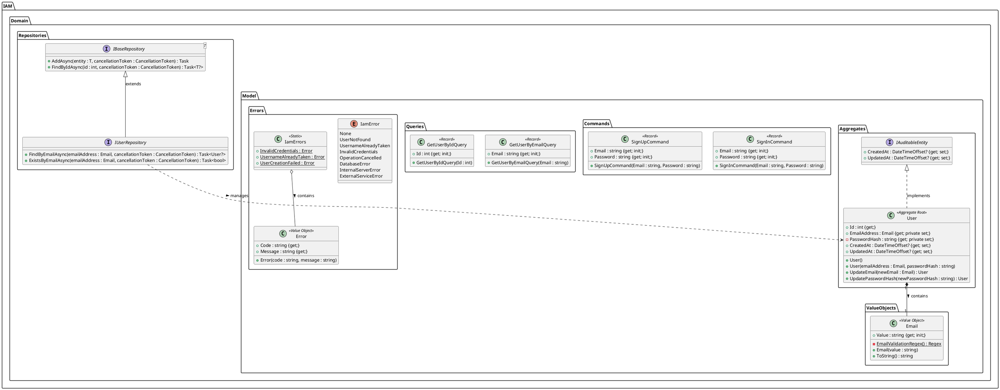

##### 2.6.1.6.2. Bounded Context Database Design Diagram

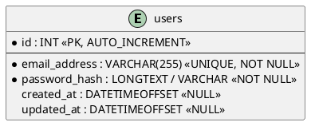

### 2.6.2. Bounded Context: Analytics Management 

#### 2.6.2.1. Domain Layer

| Archivo | Tipo de Componente | Responsabilidad Principal |
| :--- | :--- | :--- |
| Report.cs | Aggregate Root | Entidad principal que modela los datos analíticos e impone reglas de modificación de métricas. |
| ReportAudit.cs | Partial Class / Auditing | Incorpora propiedades de auditoría temporal (CreatedAt, UpdatedAt) al Agregado Report. |
| DeviceId.cs | Value Object | Encapsula y valida el identificador numérico del dispositivo. |
| GeneratedAt.cs | Value Object | Encapsula y valida la fecha de generación del reporte analítico. |
| MeanValue.cs | Value Object | Encapsula y valida el valor promedio estadístico (rango 0 - 100). |
| Variance.cs | Value Object | Encapsula y valida la varianza estadística (no negativa). |
| StandardDeviation.cs | Value Object | Encapsula y valida la desviación estándar (no negativa). |
| TechnicalInterpretation.cs | Value Object | Encapsula y valida la interpretación técnica textual del análisis. |
| CreateReportCommand.cs | Command | Transporta los datos requeridos para la creación de un reporte. |
| UpdateReportCommand.cs | Command | Transporta los datos requeridos para la actualización de un reporte existente. |
| GetReportByIdQuery.cs | Query | Transporta el identificador para la consulta individual de un reporte. |
| IReportRepository.cs | Domain Repository Interface | Define las operaciones de lectura y consulta especializadas para la entidad Report. |

#### 2.6.2.2. Interface Layer

| Archivo | Tipo de Componente | Responsabilidad Principal |
| :--- | :--- | :--- |
| ReportsController.cs | REST Controller | Expone y gestiona los endpoints HTTP REST para la administración de reportes analíticos. |
| CreateReportResource.cs | Request DTO | Contrato de entrada con validaciones para crear un reporte. |
| UpdateReportResource.cs | Request DTO | Contrato de entrada con validaciones para actualizar estadísticas de un reporte. |
| ReportResource.cs | Response DTO | Contrato de salida con los datos formateados del reporte analítico. |
| CreateReportCommandFromResourceAssembler.cs | Assembler / Transformer | Mapea CreateReportResource hacia el objeto inmutable CreateReportCommand. |
| ReportResourceFromEntityAssembler.cs | Assembler / Transformer | Mapea la entidad de dominio Report hacia el recurso de respuesta ReportResource. |
| ActionResultFromCreateReportResultAssembler.cs | Assembler / HTTP Transformer | Convierte el objeto Result<Report> en respuestas HTTP estructuradas (201, 409, 500). |

#### 2.6.2.3. Application Layer

| Archivo | Tipo de Componente | Responsabilidad Principal |
| :--- | :--- | :--- |
| IReportCommandService.cs | Service Interface | Contrato para la ejecución de comandos de modificación de reportes. |
| ReportCommandService.cs | Application Service | Orquesta la creación y actualización de agregados Report y la confirmación en el UnitOfWork. |
| IReportQueryService.cs | Service Interface | Contrato para la consulta de datos de reportes analíticos. |
| ReportQueryService.cs | Application Service | Implementa la lógica de recuperación de reportes desde el repositorio de dominio. |
| CreateReportError.cs | Application Error Enum | Define los tipos de errores de negocio para la creación de reportes. |
| UpdateReportError.cs | Application Error Enum | Define los tipos de errores de negocio para la actualización de reportes. |

#### 2.6.2.4. Infrastructure Layer

| Archivo | Tipo de Componente | Responsabilidad Principal |
| :--- | :--- | :--- |
| ReportRepository.cs | Concrete Repository | Implementa la persistencia y consultas específicas del Agregado Report sobre Entity Framework Core. |
| ModelBuilderExtensions.cs | EF Core Configuration | Configura el mapeo ORM Fluent API del Agregado Report y sus Objetos de Valor en la base de datos. |

#### 2.6.2.5. Bounded Context Software Architecture Component Level Diagrams


#### 2.6.2.5. Bounded Context Software Architecture Component Level Diagrams

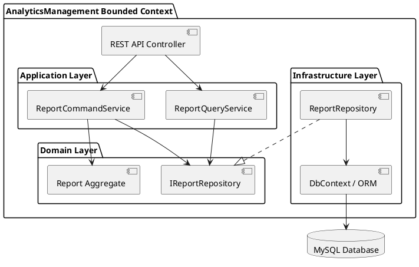

#### 2.6.2.6. Bounded Context Software Architecture Code Level Diagrams

##### 2.6.2.6.1. Bounded Context Domain Layer Class Diagrams

```plantuml
@startuml DomainLayer_AnalyticsManagement_ClassDiagram

package "AnalyticsManagement" {
    package "Domain" {
        package "Model" {
            
            package "Aggregates" {
                interface IAuditableEntity {
                    + CreatedAt : DateTimeOffset? {get; set;}
                    + UpdatedAt : DateTimeOffset? {get; set;}
                }

                class Report <<Aggregate Root>> {
                    + Id : int {get; private set;}
                    + DeviceId : DeviceId {get; private set;}
                    + GeneratedAt : GeneratedAt {get; private set;}
                    + MeanValue : MeanValue {get; private set;}
                    + Variance : Variance {get; private set;}
                    + StandardDeviation : StandardDeviation {get; private set;}
                    + TechnicalInterpretation : TechnicalInterpretation {get; private set;}
                    + CreatedAt : DateTimeOffset? {get; set;}
                    + UpdatedAt : DateTimeOffset? {get; set;}
                    + Report()
                    + Report(command : CreateReportCommand)
                    + UpdateStatistics(mean : double, variance : double, stdDev : double, interpretation : string) : void
                }

                IAuditableEntity <|.. Report : implements
            }

            package "ValueObjects" {
                class DeviceId <<Value Object>> {
                    + Value : int {get;}
                    + DeviceId(value : int)
                    + ToString() : string
                }

                class GeneratedAt <<Value Object>> {
                    + Value : DateTimeOffset {get;}
                    + GeneratedAt(value : DateTimeOffset)
                    + ToString() : string
                }

                class MeanValue <<Value Object>> {
                    + Value : double {get;}
                    + MeanValue(value : double)
                    + ToString() : string
                }

                class Variance <<Value Object>> {
                    + Value : double {get;}
                    + Variance(value : double)
                    + ToString() : string
                }

                class StandardDeviation <<Value Object>> {
                    + Value : double {get;}
                    + StandardDeviation(value : double)
                    + ToString() : string
                }

                class TechnicalInterpretation <<Value Object>> {
                    + Value : string {get;}
                    + TechnicalInterpretation(value : string)
                    + ToString() : string
                }
            }

            package "Commands" {
                class CreateReportCommand <<Record>> {
                    + DeviceId : DeviceId {get;}
                    + GeneratedAt : GeneratedAt {get;}
                    + MeanValue : MeanValue {get;}
                    + Variance : Variance {get;}
                    + StandardDeviation : StandardDeviation {get;}
                    + TechnicalInterpretation : TechnicalInterpretation {get;}
                }

                class UpdateReportCommand <<Record>> {
                    + Id : int {get;}
                    + MeanValue : double {get;}
                    + Variance : double {get;}
                    + StandardDeviation : double {get;}
                    + TechnicalInterpretation : string {get;}
                }
            }

            package "Queries" {
                class GetReportByIdQuery <<Record>> {
                    + Id : int {get;}
                }
            }
        }

        package "Repositories" {
            interface IBaseRepository<T> {
                + AddAsync(entity : T, cancellationToken : CancellationToken) : Task
                + FindByIdAsync(id : int, cancellationToken : CancellationToken) : Task<T?>
                + ListAsync(cancellationToken : CancellationToken) : Task<IEnumerable<T>>
                + Update(entity : T) : void
            }

            interface IReportRepository {
                + FindByDeviceIdAsync(deviceId : DeviceId, cancellationToken : CancellationToken) : Task<IEnumerable<Report>>
                + FindByDateRangeAsync(from : GeneratedAt, to : GeneratedAt, cancellationToken : CancellationToken) : Task<IEnumerable<Report>>
                + FindByDeviceIdAndGeneratedAtAsync(deviceId : DeviceId, generatedAt : GeneratedAt, cancellationToken : CancellationToken) : Task<Report?>
            }

            IBaseRepository <|-- IReportRepository : extends
        }
    }
}

' Relaciones del Modelo Táctico
Report "1" *-- "1" DeviceId : contains >
Report "1" *-- "1" GeneratedAt : contains >
Report "1" *-- "1" MeanValue : contains >
Report "1" *-- "1" Variance : contains >
Report "1" *-- "1" StandardDeviation : contains >
Report "1" *-- "1" TechnicalInterpretation : contains >

IReportRepository ..> Report : manages >
CreateReportCommand ..> Report : instantiates >

@endluml
```

##### 2.6.2.6.2. Bounded Context Database Design Diagram

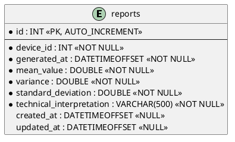

### 2.6.3. Bounded Context: Monitoring Management

#### 2.6.3.1. Domain Layer

| Archivo | Tipo de Componente | Responsabilidad Principal |
| :--- | :--- | :--- |
| Field.cs | Aggregate Root | Representa una parcela o campo agrícola y gestiona sus reglas internas de actualización. |
| FieldAudit.cs | Partial Class / Audit | Implementa IAuditableEntity para registrar marcas de tiempo de creación y actualización de campos. |
| Device.cs | Aggregate Root | Representa un dispositivo/sensor de monitoreo asociado a un campo. |
| DeviceAudit.cs | Partial Class / Audit | Implementa IAuditableEntity para registrar marcas de tiempo de creación y actualización de dispositivos. |
| IFieldRepository.cs | Domain Repository Interface | Define el contrato de persistencia para el agregado Field. |
| IDeviceRepository.cs | Domain Repository Interface | Define el contrato de persistencia para el agregado Device. |
| DeviceStatus.cs | Value Object | Encapsula y normaliza el estado del dispositivo (ONLINE, OFFLINE, LOW_BATTERY). |
| FieldId.cs | Value Object | Encapsula el identificador de la parcela. |
| FieldName.cs | Value Object | Valida y almacena el nombre del campo. |
| LastSync.cs | Value Object | Almacena la marca de tiempo de la última sincronización del dispositivo. |
| LocationLatLong.cs | Value Object | Valida y almacena la latitud y longitud de la parcela. |
| MacAddress.cs | Value Object | Valida el formato de la dirección MAC del dispositivo. |
| ProfileId.cs | Value Object | Encapsula el identificador del perfil del usuario propietario. |
| SizeM2.cs | Value Object | Valida y almacena la extensión en metros cuadrados. |
| SoilType.cs | Value Object | Valida y almacena la clasificación del tipo de suelo. |
| CreateFieldCommand.cs | Command Record | DTO de comando para solicitar la creación de un campo. |
| UpdateFieldCommand.cs | Command Record | DTO de comando para solicitar la actualización de un campo. |
| DeleteFieldCommand.cs | Command Record | DTO de comando para solicitar la eliminación de un campo. |
| CreateDeviceCommand.cs | Command Record | DTO de comando para solicitar la creación de un dispositivo. |
| UpdateDeviceCommand.cs | Command Record | DTO de comando para solicitar la actualización de un dispositivo. |
| DeleteDeviceCommand.cs | Command Record | DTO de comando para solicitar la eliminación de un dispositivo. |
| GetFieldByIdQuery.cs | Query Record | Estructura para consultar un campo por su identificador. |
| GetFieldBySoilTypeQuery.cs | Query Record | Estructura para consultar campos por tipo de suelo. |
| GetDeviceByIdQuery.cs | Query Record | Estructura para consultar un dispositivo por su identificador. |
| GetDevicesByStatusQuery.cs | Query Record | Estructura para consultar dispositivos por estado operativo. |
| GetDevicesByFieldIdQuery.cs | Query Record | Estructura para consultar dispositivos asociados a un campo. |

#### 2.6.3.2. Interface Layer

| Archivo | Tipo de Componente | Responsabilidad Principal |
| :--- | :--- | :--- |
| FieldsController.cs | REST Controller | Maneja las solicitudes HTTP relacionadas con campos/parcelas (CRUD y consultas por tipo de suelo). |
| DevicesController.cs | REST Controller | Maneja las solicitudes HTTP relacionadas con dispositivos IoT (CRUD y consultas por campo/estado). |
| CreateFieldResource.cs | DTO / Input Resource | DTO para la creación de un nuevo campo con validaciones de formulario. |
| UpdateFieldResource.cs | DTO / Input Resource | DTO para la actualización de un campo existente. |
| FieldResource.cs | DTO / Output Resource | DTO de respuesta para la representación aplanada de un campo (Field). |
| CreateDeviceResource.cs | DTO / Input Resource | DTO para la creación de un dispositivo IoT con validación de dirección MAC y estado. |
| UpdateDeviceResource.cs | DTO / Input Resource | DTO para la actualización de datos de un dispositivo. |
| DeviceResource.cs | DTO / Output Resource | DTO de respuesta para la representación aplanada de un dispositivo (Device). |
| CreateFieldCommandFromResourceAssembler.cs | Assembler / Transformer | Mapea un CreateFieldResource a CreateFieldCommand con Value Objects. |
| UpdateFieldCommandFromResourceAssembler.cs | Assembler / Transformer | Mapea un UpdateFieldResource a UpdateFieldCommand. |
| FieldResourceFromEntityAssembler.cs | Assembler / Transformer | Mapea la entidad de agregado Field a FieldResource. |
| ActionResultFromCreateFieldResultAssembler.cs | Result Assembler | Transforma el Result<Field> de la aplicación a una respuesta ActionResult de ASP.NET Core. |
| CreateDeviceCommandFromResourceAssembler.cs | Assembler / Transformer | Mapea un CreateDeviceResource a CreateDeviceCommand. |
| UpdateDeviceCommandFromResourceAssembler.cs | Assembler / Transformer | Mapea un UpdateDeviceResource a UpdateDeviceCommand. |
| DeviceResourceFromEntityAssembler.cs | Assembler / Transformer | Mapea la entidad de agregado Device a DeviceResource. |
| ActionResultFromCreateDeviceResultAssembler.cs | Result Assembler | Transforma el Result<Device> de la aplicación a una respuesta ActionResult de ASP.NET Core. |

#### 2.6.3.3. Application Layer

| Archivo | Tipo de Componente | Responsabilidad Principal |
| :--- | :--- | :--- |
| CreateDeviceError.cs | Enum / Error | Enumera los errores del caso de uso de dispositivos (duplicado, no encontrado, MAC inválida, etc.). |
| CreateFieldError.cs | Enum / Error | Enumera los errores del caso de uso de campos (duplicado, no encontrado, suelo inválido, etc.). |
| IDeviceCommandService.cs | Service Interface | Interfaz del servicio de comandos para el manejo de CRUD de dispositivos. |
| IDeviceQueryService.cs | Service Interface | Interfaz del servicio de consultas para recuperar dispositivos e información proyectada a recursos. |
| IFieldCommandService.cs | Service Interface | Interfaz del servicio de comandos para el manejo de CRUD de campos/parcelas. |
| IFieldQueryService.cs | Service Interface | Interfaz del servicio de consultas para recuperar campos e información proyectada a recursos. |
| DeviceCommandService.cs | Command Service Implementation | Implementa la lógica de comandos para crear, actualizar y eliminar dispositivos con manejo de transacciones. |
| FieldCommandService.cs | Command Service Implementation | Implementa la lógica de comandos para crear, actualizar y eliminar campos con validación de duplicados. |
| DeviceQueryService.cs | Query Service Implementation | Implementa la lógica de consulta para listar o filtrar dispositivos por ID, campo y estado. |
| FieldQueryService.cs | Query Service Implementation | Implementa la lógica de consulta para listar o filtrar campos por ID y tipo de suelo. |

#### 2.6.3.4. Infrastructure Layer

| Archivo | Tipo de Componente | Responsabilidad Principal |
| :--- | :--- | :--- |
| ModelBuilderExtensions.cs | EF Core Configuration / Extension | Configura el mapeo ORM de los agregados Field y Device (claves, tablas y Value Objects) mediante Fluent API. |
| FieldRepository.cs | Repository Implementation | Implementa la persistencia para la entidad Field en base de datos mediante EF Core. |
| DeviceRepository.cs | Repository Implementation | Implementa la persistencia para la entidad Device en base de datos mediante EF Core. |

#### 2.6.3.5. Bounded Context Software Architecture Component Level Diagrams

```plantuml
@startuml C4_Component_Monitoring
!include https://raw.githubusercontent.com/plantuml-stdlib/C4-PlantUML/master/C4_Component.puml

LAYOUT_WITH_LEGEND()

title Component Diagram for Monitoring Management Bounded Context

Container(web_app, "Single-Page Application", "Angular", "Interfaz gráfica para el monitoreo agrícola.")

Container_Boundary(api, "Monitoring Management Container") {
    Component(fields_controller, "FieldsController", "ASP.NET Core REST Controller", "Expone endpoints REST para parcelas (/api/v1/fields).")
    Component(devices_controller, "DevicesController", "ASP.NET Core REST Controller", "Expone endpoints REST para sensores IoT (/api/v1/devices).")
    
    Component(field_cmd_service, "FieldCommandService", "Application Service", "Procesa lógica de creación, actualización y eliminación de campos.")
    Component(field_qry_service, "FieldQueryService", "Application Service", "Ejecuta consultas avanzadas y filtrado de parcelas.")
    Component(device_cmd_service, "DeviceCommandService", "Application Service", "Procesa la lógica de ciclo de vida de dispositivos IoT.")
    Component(device_qry_service, "DeviceQueryService", "Application Service", "Ejecuta consultas filtradas de dispositivos por estado y parcela.")
    
    Component(domain_model, "Domain Model", "Domain Layer", "Encapsula Agregados (Field, Device) y Value Objects.")
    
    Component(field_repo, "FieldRepository", "EF Core Repository", "Provee persistencia física de parcelas en MySQL.")
    Component(device_repo, "DeviceRepository", "EF Core Repository", "Provee persistencia física de sensores IoT en MySQL.")
}

ContainerDb(database, "Relational Database", "MySQL", "Almacena información de parcelas, estados y dispositivos.")

Rel(web_app, fields_controller, "Realiza peticiones HTTP/REST", "JSON/HTTPS")
Rel(web_app, devices_controller, "Realiza peticiones HTTP/REST", "JSON/HTTPS")

Rel(fields_controller, field_cmd_service, "Invocación de Comandos")
Rel(fields_controller, field_qry_service, "Invocación de Consultas")
Rel(devices_controller, device_cmd_service, "Invocación de Comandos")
Rel(devices_controller, device_qry_service, "Invocación de Consultas")

Rel(field_cmd_service, domain_model, "Opera con")
Rel(field_qry_service, domain_model, "Lee de")
Rel(device_cmd_service, domain_model, "Opera con")
Rel(device_qry_service, domain_model, "Lee de")

Rel(field_cmd_service, field_repo, "Persiste mediante")
Rel(field_qry_service, field_repo, "Consulta mediante")
Rel(device_cmd_service, device_repo, "Persiste mediante")
Rel(device_qry_service, device_repo, "Consulta mediante")

Rel(field_repo, database, "Lee y escribe datos en", "EF Core / MySQL Protocol")
Rel(device_repo, database, "Lee y escribe datos en", "EF Core / MySQL Protocol")

@enduml
```

#### 2.6.3.6. Bounded Context Software Architecture Code Level Diagrams

##### 2.6.3.6.1. Bounded Context Domain Layer Class Diagrams

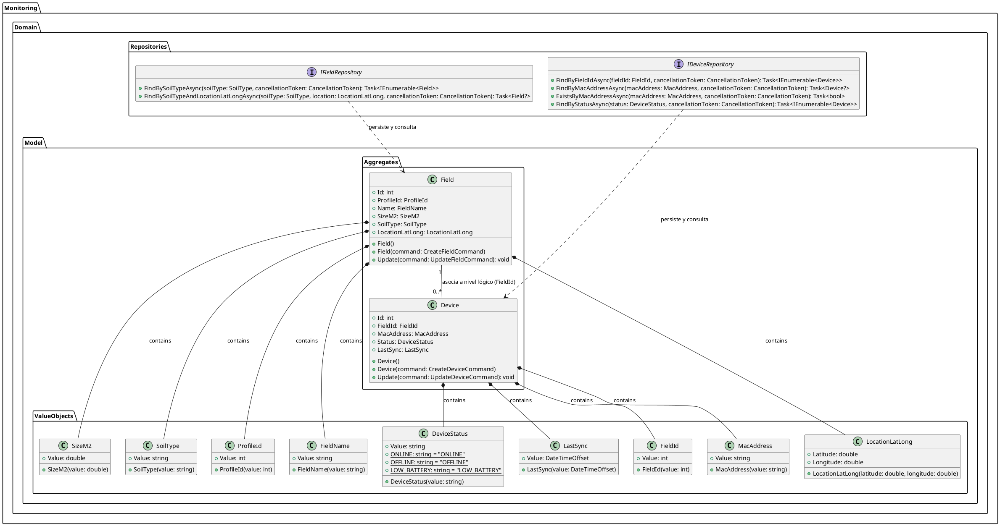

##### 2.6.3.6.2. Bounded Context Database Design Diagram

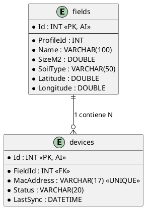

### 2.6.4. Bounded Context: Stock Management

#### 2.6.4.1. Domain Layer

| Archivo | Tipo de Componente | Responsabilidad Principal |
| :--- | :--- | :--- |
| Inventory.cs | Aggregate Root | Representa el registro de inventario de un producto y gestiona las reglas para actualizar o descontar stock. |
| InventoryAudit.cs | Partial Class / Audit | Implementa IAuditableEntity para auditoría de creación y actualización en el inventario. |
| IInventoryRepository.cs | Domain Repository Interface | Define el contrato de persistencia para la entidad e inventario del dominio. |
| CreateInventoryCommand.cs | Command Record | DTO de comando para solicitar el registro inicial de stock de un producto. |
| UpdateInventoryCommand.cs | Command Record | DTO de comando para actualizar la cantidad de stock disponible. |
| GetAllInventoryQuery.cs | Query Record | Estructura para solicitar la consulta de todos los registros de inventario. |
| GetInventoryByIdQuery.cs | Query Record | Estructura para consultar un registro de inventario por su identificador único. |

#### 2.6.4.2. Interface Layer

| Archivo | Tipo de Componente | Responsabilidad Principal |
| :--- | :--- | :--- |
| InventoriesController.cs | REST Controller | Maneja las solicitudes HTTP relacionadas con el inventario de stock (CRUD). |
| CreateInventoryResource.cs | DTO / Input Resource | Esquema de datos para la solicitud de creación de un registro de inventario. |
| UpdateInventoryResource.cs | DTO / Input Resource | Esquema de datos para la solicitud de actualización de la cantidad de stock. |
| InventoryResource.cs | DTO / Output Resource | Esquema de respuesta para la representación aplanada del inventario. |
| CreateInventoryCommandFromResourceAssembler.cs | Assembler / Transformer | Mapea un CreateInventoryResource a CreateInventoryCommand. |
| InventoryResourceFromEntityAssembler.cs | Assembler / Transformer | Mapea la entidad de agregado Inventory a un DTO InventoryResource. |

#### 2.6.4.3. Application Layer

| Archivo | Tipo de Componente | Responsabilidad Principal |
| :--- | :--- | :--- |
| StockError.cs | Enum / Error | Enumera los tipos de errores asociados a las operaciones de inventario. |
| IStockService.cs | Service Interface | Contrato del servicio de aplicación que define el manejo de comandos y consultas de stock. |
| StockService.cs | Application Service Implementation | Implementa los casos de uso para crear, actualizar y consultar registros de inventario con manejo de transacciones. |

#### 2.6.4.4. Infrastructure Layer

| Archivo | Tipo de Componente | Responsabilidad Principal |
| :--- | :--- | :--- |
| ModelBuilderExtensions.cs | EF Core Configuration / Extension | Configura la entidad Inventory en la base de datos (claves, tipos de columna y restricciones). |
| InventoryRepository.cs | Repository Implementation | Implementa la persistencia para la entidad Inventory en base de datos mediante EF Core. |

#### 2.6.4.5. Bounded Context Software Architecture Component Level Diagrams

```plantuml
@startuml C4_Component_Stock
!include https://raw.githubusercontent.com/plantuml-stdlib/C4-PlantUML/master/C4_Component.puml

LAYOUT_WITH_LEGEND()

title Component Diagram for Stock Management Bounded Context

Container(web_app, "Single-Page Application", "Angular", "Interfaz gráfica para la gestión de inventario y stock.")

Container_Boundary(api, "Stock Management Container") {
    Component(inventories_controller, "InventoriesController", "ASP.NET Core REST Controller", "Expone endpoints REST para inventario (/api/v1/inventories).")
    
    Component(stock_service, "StockService", "Application Service", "Coordina los casos de uso para consultar, crear y actualizar existencias.")
    
    Component(domain_model, "Domain Model", "Domain Layer", "Encapsula el Agregado Inventory, comandos, consultas y errores.")
    
    Component(inventory_repo, "InventoryRepository", "EF Core Repository", "Provee persistencia física de inventarios en MySQL.")
}

ContainerDb(database, "Relational Database", "MySQL", "Almacena existencias, ubicaciones y registros de inventario.")

Rel(web_app, inventories_controller, "Realiza peticiones HTTP/REST", "JSON/HTTPS")

Rel(inventories_controller, stock_service, "Invocación de Comandos y Consultas")

Rel(stock_service, domain_model, "Opera y modifica")

Rel(stock_service, inventory_repo, "Persiste y consulta mediante")

Rel(inventory_repo, database, "Lee y escribe datos en", "EF Core / MySQL Protocol")

@enduml
```

#### 2.6.4.6. Bounded Context Software Architecture Code Level Diagrams

##### 2.6.4.6.1. Bounded Context Domain Layer Class Diagrams

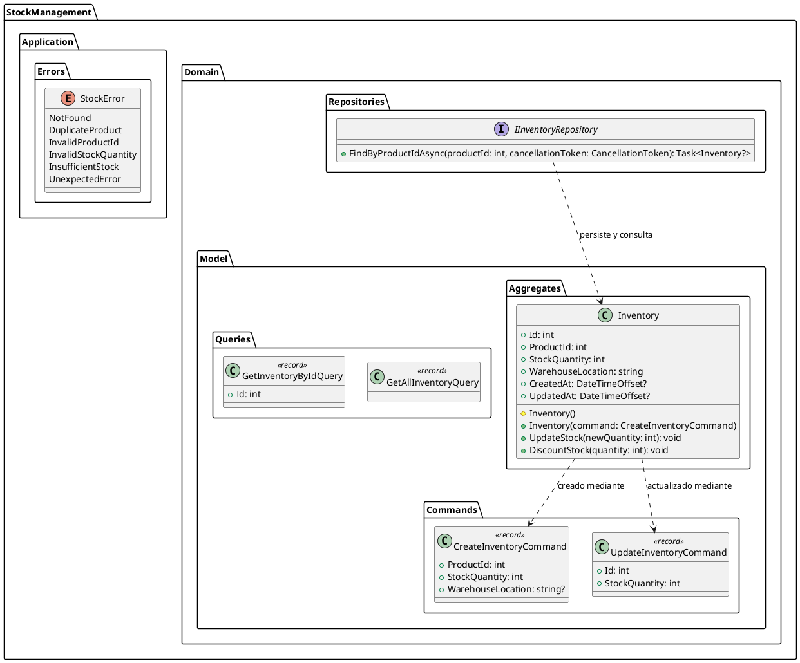

##### 2.6.4.6.2. Bounded Context Database Design Diagram

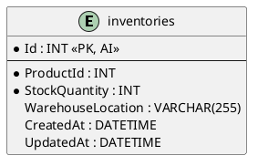

### 2.6.5. Bounded Context: Notification Management

#### 2.6.5.1. Domain Layer

| Archivo | Tipo de Componente | Responsabilidad Principal |
| :--- | :--- | :--- |
| Notification.cs | Aggregate Root | Representa la entidad de notificación de un usuario y gestiona las reglas para marcarla como leída. |
| NotificationAudit.cs | Partial Class / Audit | Implementa IAuditableEntity para registrar marcas de tiempo de creación y actualización de notificaciones. |
| INotificationRepository.cs | Domain Repository Interface | Define el contrato de persistencia para consultar y almacenar notificaciones por perfil de usuario. |
| CreateNotificationCommand.cs | Command Record | DTO de comando para solicitar la creación y envío de una nueva notificación o alerta. |
| MarkAsReadCommand.cs | Command Record | DTO de comando para solicitar el cambio de estado de una notificación a leída. |
| GetNotificationByIdQuery.cs | Query Record | Estructura para consultar una notificación específica por su identificador único. |
| GetNotificationsByProfileQuery.cs | Query Record | Estructura para consultar el historial de notificaciones asociadas a un perfil. |

#### 2.6.5.2. Interface Layer

| Archivo | Tipo de Componente | Responsabilidad Principal |
| :--- | :--- | :--- |
| NotificationsController.cs | REST Controller | Maneja las solicitudes HTTP relacionadas con notificaciones y alertas (creación, lectura e historial). |
| CreateNotificationResource.cs | DTO / Input Resource | Esquema de datos para la solicitud de creación y envío de una notificación. |
| MarkAsReadResource.cs | DTO / Input Resource | Esquema de datos para solicitar el cambio de estado a leída. |
| NotificationResource.cs | DTO / Output Resource | Esquema de respuesta con los datos detallados de la notificación. |
| CreateNotificationCommandFromResourceAssembler.cs | Assembler / Transformer | Mapea un CreateNotificationResource a CreateNotificationCommand. |
| NotificationResourceFromEntityAssembler.cs | Assembler / Transformer | Mapea la entidad de agregado Notification a un DTO NotificationResource. |

#### 2.6.5.3. Application Layer

| Archivo | Tipo de Componente | Responsabilidad Principal |
| :--- | :--- | :--- |
| NotificationError.cs | Enum / Error | Enumera los tipos de errores asociados al procesamiento y envío de notificaciones. |
| INotificationService.cs | Service Interface | Contrato del servicio de aplicación que define la gestión de comandos y consultas para notificaciones. |
| NotificationService.cs | Application Service Implementation | Implementa la lógica de aplicación para crear, marcar como leídas y consultar notificaciones con control transaccional. |

#### 2.6.5.4. Infrastructure Layer

| Archivo | Tipo de Componente | Responsabilidad Principal |
| :--- | :--- | :--- |
| ModelBuilderExtensions.cs | EF Core Configuration / Extension | Configura el mapeo ORM de la entidad Notification en la base de datos (claves, restricciones y longitud de columnas). |
| NotificationRepository.cs | Repository Implementation | Implementa la persistencia y consultas específicas de notificaciones por perfil y estado de lectura mediante EF Core. |

#### 2.6.5.5. Bounded Context Software Architecture Component Level Diagrams

```plantuml
@startuml C4_Component_Notification
!include https://raw.githubusercontent.com/plantuml-stdlib/C4-PlantUML/master/C4_Component.puml

LAYOUT_WITH_LEGEND()

title Component Diagram for Notification Management Bounded Context

Container(web_app, "Single-Page Application", "Angular", "Interfaz gráfica para la gestión y visualización de notificaciones.")

Container_Boundary(api, "Notification Management Container") {
    Component(notifications_controller, "NotificationsController", "ASP.NET Core REST Controller", "Expone endpoints REST para notificaciones (/api/v1/notifications).")
    
    Component(notification_service, "NotificationService", "Application Service", "Coordina la creación, actualización de estado y envío de alertas.")
    
    Component(domain_model, "Domain Model", "Domain Layer", "Encapsula el Agregado Notification, comandos, consultas y reglas.")
    
    Component(notification_repo, "NotificationRepository", "EF Core Repository", "Provee persistencia física de notificaciones en MySQL.")
}

ContainerDb(database, "Relational Database", "MySQL", "Almacena alertas, mensajes, estados de lectura e historial por usuario.")

Rel(web_app, notifications_controller, "Realiza peticiones HTTP/REST", "JSON/HTTPS")

Rel(notifications_controller, notification_service, "Invocación de Comandos y Consultas")

Rel(notification_service, domain_model, "Opera y modifica")

Rel(notification_service, notification_repo, "Persiste y consulta mediante")

Rel(notification_repo, database, "Lee y escribe datos en", "EF Core / MySQL Protocol")

@enduml
```

#### 2.6.5.6. Bounded Context Software Architecture Code Level Diagrams

##### 2.6.5.6.1. Bounded Context Domain Layer Class Diagrams

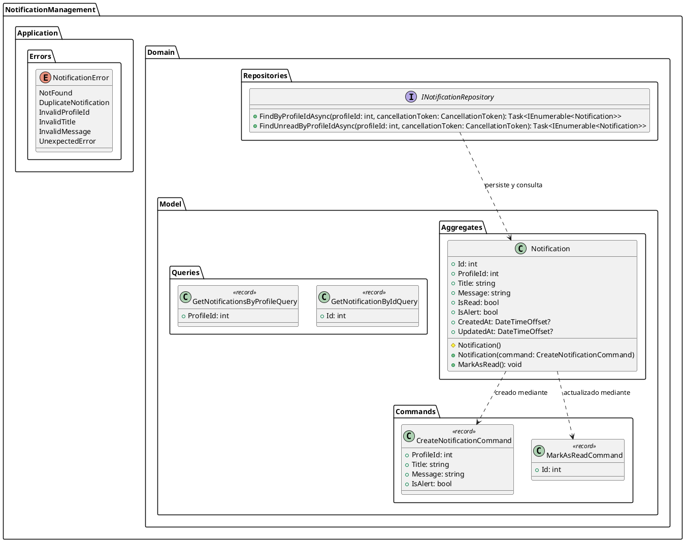

##### 2.6.5.6.2. Bounded Context Database Design Diagram

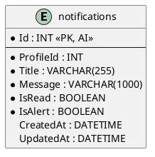

### 2.6.6. Bounded Context: Shared Bounded

#### 2.6.6.1. Domain Layer

| Archivo | Tipo de Componente | Responsabilidad Principal |
| :--- | :--- | :--- |
| IAuditableEntity.cs | Entity Interface | Contrato para entidades que requieren seguimiento de marcas de tiempo de auditoría (creación y actualización). |
| IEvent.cs | Domain Event Interface | Interfaz base para marcar eventos de dominio e integrarlos con el bus de eventos del patrón mediador. |
| Error.cs | Value Record | Estructura para la representación unificada de errores de dominio con código y mensaje. |
| IBaseRepository.cs | Repository Interface | Interfaz genérica que define las operaciones CRUD fundamentales para todos los repositorios. |
| IUnitOfWork.cs | Repository Interface | Contrato para la confirmación atómica de cambios en la capa de persistencia. |

#### 2.6.6.2. Interface Layer

| Archivo | Tipo de Componente | Responsabilidad Principal |
| :--- | :--- | :--- |
| ProblemDetailsFactory.cs | Interface Custom Factory | Construye respuestas uniformes de error estandarizadas (RFC 7807 Problem Details) con soporte de localización para la API REST. |

#### 2.6.6.3. Application Layer

| Archivo | Tipo de Componente | Responsabilidad Principal |
| :--- | :--- | :--- |
| IEventHandler.cs | Application Event Handler Interface | Abstracción para el manejo y suscripción de eventos de dominio integrados con el patrón Mediador. |
| Result.cs | Application Model / Functional Result | Wrapper genérico y no genérico que encapsula el resultado de las operaciones en la capa de aplicación (éxito o fallo con errores fuertemente tipados). |

#### 2.6.6.4. Infrastructure Layer

| Archivo | Tipo de Componente | Responsabilidad Principal |
| :--- | :--- | :--- |
| AppDbContext.cs | EF Core DbContext | Contexto principal de la base de datos que registra los modelos de todos los Bounded Contexts y aplica las convenciones de nombrado snake_case e interceptores. |
| AuditableEntityInterceptor.cs | EF Core Interceptor | Intercepta la persitencia en EF Core para auditar automáticamente las marcas de tiempo (CreatedAt y UpdatedAt) en entidades IAuditableEntity. |
| BaseRepository.cs | Base Repository Implementation | Implementación genérica de las operaciones de lectura, escritura y borrado sobre Entity Framework Core. |
| UnitOfWork.cs | Repository Implementation | Controla la confirmación de transacciones atómicas llamando al guardado centralizado de cambios en el AppDbContext. |
| LoggingCommandBehavior.cs | Mediator Pipeline Behavior | Intercepta la ejecución de comandos para registrar logs de auditoría antes y después de su procesamiento. |
| GlobalExceptionHandlerMiddleware.cs | ASP.NET Core Middleware | Middleware centralizado de gestión de excepciones no capturadas para transformarlas en respuestas normalizadas Problem Details. |
| MiddlewareExtensions.cs | Middleware Extension | Método de extensión de IApplicationBuilder para registrar de forma limpia el middleware de excepciones globales en el pipeline HTTP. |

# Capítulo III: Solution UI/UX Design

[Volver al contenido principal](#contenido)

> Pendiente de desarrollo.

## 3.1. Product Design

### 3.1.1. Style Guidelines

#### 3.1.1.1. General Style Guidelines

### 3.1.2. Information Architecture

#### 3.1.2.1. Organization Systems

#### 3.1.2.2. Labelling Systems

#### 3.1.2.3. SEO Tags and Meta Tags

#### 3.1.2.4. Searching Systems

#### 3.1.2.5. Navigation Systems

### 3.1.3. Landing Page UI Design

#### 3.1.3.1. Landing Page Wireframe

#### 3.1.3.2. Landing Page Mock-up

### 3.1.4. Mobile Applications UX/UI Design

#### 3.1.4.1. Mobile Applications Wireframes

#### 3.1.4.2. Mobile Applications Wireflow Diagrams

#### 3.1.4.3. Mobile Applications Mock-ups

#### 3.1.4.4. Mobile Applications User Flow Diagrams

#### 3.1.4.5. Mobile Applications Prototyping

# Capítulo IV: Product Implementation & Validation

[Volver al contenido principal](#contenido)

> Pendiente de desarrollo.

## 4.1. Software Configuration Management

### 4.1.1. Software Development Environment Configuration

### 4.1.2. Source Code Management

### 4.1.3. Source Code Style Guide & Conventions

### 4.1.4. Software Deployment Configuration

## 4.2. Landing Page & Mobile Application Implementation

Repetir la siguiente estructura por cada sprint, reemplazando «x» por la posición de la subsección y «n» por el número del sprint.

### 4.2.x. Sprint n

#### 4.2.x.1. Sprint Planning n

#### 4.2.x.2. Aspect Leaders and Collaborators

#### 4.2.x.3. Sprint Backlog n

#### 4.2.x.4. Development Evidence for Sprint Review

#### 4.2.x.5. Testing Suite Evidence for Sprint Review

#### 4.2.x.6. Execution Evidence for Sprint Review

#### 4.2.x.7. Services Documentation Evidence for Sprint Review

#### 4.2.x.8. Software Deployment Evidence for Sprint Review

#### 4.2.x.9. Team Collaboration Insights during Sprint

## 4.3. Validation Interviews

### 4.3.1. Diseño de Entrevistas

### 4.3.2. Registro de Entrevistas

### 4.3.3. Evaluaciones según heurísticas

# Conclusiones

[Volver al contenido principal](#contenido)

## Conclusiones y recomendaciones

Pendiente de incorporar las conclusiones y recomendaciones correspondientes a cada entrega, relacionándolas con la problemática, los supuestos, las hipótesis y los resultados obtenidos.

## Video App Validation

Pendiente de incorporar la evidencia de validación de la aplicación con usuarios y la evaluación heurística.

| Elemento | Información |
| --- | --- |
| Enlace al video | Por completar |
| Duración | Por completar |
| Captura representativa | Por incorporar |

## Video About-the-Product

Pendiente de incorporar el video de presentación de TerraTech, incluyendo su modelo de negocio, características, beneficios y demostración del producto.

| Elemento | Información |
| --- | --- |
| Enlace en OneDrive | Por completar |
| Enlace en YouTube | Por completar |
| Duración | Por completar |
| Captura representativa | Por incorporar |

## Video About-the-Team

Pendiente de incorporar el video sobre el trabajo del equipo, las actividades realizadas, los aprendizajes y el logro del Student Outcome.

| Elemento | Información |
| --- | --- |
| Enlace al video | Por completar |
| Duración | Por completar |
| Captura representativa | Por incorporar |
| Resumen y pauta de tiempos | Por completar |

# Glosario

[Volver al contenido principal](#contenido)

Esta sección reúne los términos técnicos, las abreviaturas y los acrónimos utilizados en el informe.

| Término | Definición |
| --- | --- |
| Por completar | Por completar |

# Bibliografía

[Volver al contenido principal](#contenido)

Las referencias se presentan en formato APA 7 y se organizan según su relación con el proyecto.

## Dominio de negocio

Instituto Nacional de Estadística e Informática. (2024, octubre). *Productores agropecuarios: Principales resultados de la Encuesta Nacional Agropecuaria (ENA), 2018, 2019, 2022 y 2023*. https://proyectos.inei.gob.pe/iinei/srienaho/Descarga/DocumentosMetodologicos/2023-62/05_PUBLICACION_ENA_2023.pdf

Instituto Nacional de Estadística e Informática. (2026, marzo). *Estadísticas de las tecnologías de información y comunicación en los hogares: IV trimestre 2025* (Informe técnico N.º 01). https://www.inei.gob.pe/media/MenuRecursivo/boletines/boletin-tic-oct_dic2025.pdf

Ministerio de la Producción. (2021). *Hoja de ruta para la modernización de los mercados de abastos*. https://pndp.produce.gob.pe/wp-content/uploads/2025/03/HOJA-DE-RUTA-D.S.-N%C2%BA-021-2021-PRODUCE.pdf

Organización de las Naciones Unidas para la Alimentación y la Agricultura. (2026, 29 de enero). *Perú promueve el diálogo sobre cómo producimos los alimentos, qué comemos y su relación con el cambio climático*. https://www.fao.org/peru/noticias/detail/per%C3%BA-promueve-el-di%C3%A1logo-sobre-c%C3%B3mo-producimos-los-alimentos--qu%C3%A9-comemos-y-su-relaci%C3%B3n-con-el-cambio-clim%C3%A1tico/es

## Métodos y técnicas de ingeniería de software

* Brandolini, A. (2020). *Introducing EventStorming: An agile methodology to visual domain-driven design*. Leanpub.
* Brown, S. (2018). *The C4 model for visualising software architecture*. Leanpub. https://c4model.com
* Evans, E. (2003). *Domain-Driven Design: Tackling Complexity in the Heart of Software*. Addison-Wesley Professional.
* Hofer, S., & Schwentner, H. (2021). *Domain Storytelling: A Collaborative, Visual, and Agile Way to Build Domain-Driven Software*. Addison-Wesley Professional.
* Vernon, V. (2013). *Implementing Domain-Driven Design*. Addison-Wesley Professional.

Gothelf, J. (2016, 15 de diciembre). *The Lean UX canvas*. https://jeffgothelf.com/blog/leanuxcanvas/

## Lenguajes, frameworks y herramientas

* Google Developers. (2024). *Guide to app architecture & Jetpack Compose*. Android Open Source Project. https://developer.android.com/topic/architecture
* Google Firebase. (2024). *Firebase Cloud Messaging HTTP v1 API reference*. Google LLC. https://firebase.google.com/docs/cloud-messaging
* OpenWeatherMap. (2024). *One Call API 3.0 Documentation*. OpenWeather Ltd. https://openweathermap.org/api/one-call-3
* Oracle. (2024). *Java Platform, Standard Edition 21 Documentation*. Oracle Corporation.
* VMware Tanzu. (2024). *Spring Boot Reference Documentation (Version 3.2)*. Broadcom. https://docs.spring.io/spring-boot/docs/current/reference/html/

### Artículos científicos indexados (Papers Q1 y Q2)

| Referencia APA 7 | Categoría | Año | Cuartil y fuente | Aplicación en el proyecto |
| --- | --- | --- | --- | --- |
| Kamilaris, A., & Prenafeta-Boldú, F. X. (2018). Deep learning in agriculture: A survey. *Computers and Electronics in Agriculture*, 147, 70-90. | Dominio del Problema | 2018 | Q1 - Scopus / Elsevier | Sustento del motor de análisis agronómico y detección temprana de estrés hídrico. |
| Elijah, O., Rahman, T. A., Orikumhi, I., Leow, C. Y., & Hindia, M. N. (2018). An overview of Internet of Things (IoT) and data analytics in agriculture: Benefits and challenges. *IEEE Internet of Things Journal*, 5(5), 3758-3773. | Dominio del Problema | 2018 | Q1 - Scopus / IEEE | Justificación de la correlación de datos de campo y telemetría climática para alertas de heladas. |
| Alenezi, M., & Zarour, M. (2020). On the relationship between software architecture and code quality in Android applications. *IEEE Access*, 8, 117362-117374. | Desarrollo Móvil | 2020 | Q1 - Scopus / IEEE | Justificación de la adopción de Clean Architecture y capas desacopladas en Kotlin/Android. |
| Cruz, L., & Abreu, R. (2019). Performance-based guidelines for mobile application architecture. *Journal of Systems and Software*, 156, 120-136. | Desarrollo Móvil | 2019 | Q2 - Scopus / Elsevier | Diseño del esquema Offline-First y caché local con SQLite/Room para entornos con baja conectividad. |

Pendiente de incorporar las referencias de los lenguajes, frameworks y herramientas utilizados en el proyecto.

# Anexos

[Volver al contenido principal](#contenido)

## Anexo A. Videos de Exposiciones

Esta sección reúne las evidencias de exposición correspondientes a las entregas del proyecto.

| Entrega | Enlace al video | Duración del video | Captura representativa |
| --- | --- | --- | --- |
| AV1 | Por completar | Por completar | Por incorporar |
| TB1 | Por completar | Por completar | Por incorporar |
| AV2 | Por completar | Por completar | Por incorporar |
| TB2 | Por completar | Por completar | Por incorporar |

## Anexo B. Artefactos complementarios

Pendiente de incorporar los documentos, diagramas y demás evidencias complementarias del proyecto.

| Artefacto | Descripción | Enlace o ubicación |
| --- | --- | --- |
| Por completar | Por completar | Por completar |
