

  

  

    Universidad Peruana de Ciencias Aplicadas 
    Carrera de Ingeniería de Software
  

   

  

    <strong>1ACC0238</strong> 
    <strong>Aplicaciones para Dispositivos Móviles</strong>
  

  

    NRC 
    <strong>13975</strong>
  

<h3>Informe del Trabajo Final</h3>

  

    Docente 
    <strong>Quevedo Velasco, David Gerardo</strong>
  

   

  

    Equipo 
    <strong>NovaTech</strong>
  

  

    Proyecto 
    <strong>TerraTech</strong>
  

   

  
<strong>Integrantes</strong>

  

    Barba Estrada, Bryan Eduardo — U202323479 
    Bendezú Navarro, Rúbens Fitzgerald — U20231D390 
    Delgado Perez, James Caleb — U202115277 
    Pariona Chacca, Angel Jose — U202314734 
    Retuerto Rodriguez, Jorge Manuel — U202318612
  

   

  
<strong>Período 202620</strong>

  
<strong>Septiembre 2026</strong>

## Registro de Versiones del Informe

| Versión | Fecha | Autor                              | Descripción de modificación                                                                                                                                                                                                                                                                                                                                                                                            |
|:---|:---|:-----------------------------------|:-----------------------------------------------------------------------------------------------------------------------------------------------------------------------------------------------------------------------------------------------------------------------------------------------------------------------------------------------------------------------------------------------------------------------|
| 0.1.0 | 04/09/2026 | Bryan Barba                        | Creación del repositorio `terratech-project-report`.                                                                                                                                                                                                                                                                                                                                                                   |
| 0.2.0 | 04/09/2026 | Bendezú Navarro, Rúbens Fitzgerald | Creación de la estructura inicial del informe del proyecto TerraTech.                                                                                                                                                                                                                                                                                                                                                  |
| 0.2.1 | 06/09/2026 | James Caleb Delgado Pérez          | Actualización de la carátula con los datos del curso, NRC, docente, equipo y proyecto.                                                                                                                                                                                                                                                                                                                                 |
| 0.3.0 | 14/09/2026 | Jorge Manuel Retuerto Rodriguez    | Documentar las capas Domain, Interface, Application e Infrastructure y diagramas asociados al Bounded.                                                                                                                                                                                                                                                                                                                 |
| 0.4.0 | 15/09/2026 | James Caleb Delgado Perez          | Actualización del registro para documentar los aportes realizados en la AV1: elaboración y revisión del Capítulo I para su adaptación al proyecto móvil; organización inicial del informe por archivos y posterior consolidación en un único README; ajuste del índice y sus enlaces internos; organización de la bibliografía; e integración del avance del Capítulo II elaborado por un compañero y de sus imágenes. |
| 0.4.1 | 15/09/2026 | James Caleb Delgado Perez          | Elaboración y actualización del Lean UX Canvas de TerraTech y revisión de los segmentos objetivo y su sustento estadístico, manteniendo la coherencia con el alcance del proyecto documentado en el Capítulo I.                                                                                                                                                                                                        |
| 0.4.2 | 15/09/2026 | James Caleb Delgado Perez          | Revisión y alineación del Capítulo I con el alcance funcional actual de TerraTech, actualizando el Solution Profile, objetivos, restricciones, Lean UX Assumptions, Hypothesis Statements, segmentos objetivo y registros relacionados con el aporte individual.                                                                                                                                                       |
| 0.4.3 | 15/09/2026 | Barba Estrada, Bryan Eduardo       | Desarrollo de 2.3 Needfinding y 2.4 Requirements Specification (user stories, technical/spike stories, impact mapping y product backlog) y correcciones de consistencia del Capítulo II.                                                                                                                                                                                                                               |
| 0.4.4 | 15/09/2026 | Pariona Chacca, Angel Jose         | Elaboración y documentación de las secciones 2.1 Competidores (análisis competitivo y landscape) y 2.2 Entrevistas (diseño, registro de 7 entrevistas y análisis estadístico y cualitativo por segmento) con enfoque en aplicación móvil.                                                                                                                                                                              |
| 0.5.0 | 15/09/2026 | Bendezú Navarro, Rúbens Fitzgerald | Elaboración y documentación del Strategic Domain-Driven Design (DDD): descubrimiento de Bounded Contexts, Domain Storytelling, Bounded Context Canvases (5 contextos), Context Mapping y diseño de arquitectura de software C4 (diagramas de Contexto, Contenedores y Despliegue con soporte offline-first y persistencia local Room).                                                                                 |
| 0.6.0 | 15/09/2026 | Jorge Manuel Retuerto Rodriguez    | Elaboración y documentación del BackEnd, implementando Domain-Drive-Design. Asimismo, ejecutando el deployment del servicio.                                                                                                                                                                                                                                                                                           |
| 0.7.0| 15/09/2026 | AngelJose Pariona Chacca           | Elaboracion y documentacion de la seccion 3.1.4. Mobile UX & UI  (Mockup, Wireframes, Wireflow, Userflow, Prototype)                                                                                                                                                                                                                                                                                                   |
## Project Report Collaboration Insights

Esta sección presenta la organización y las evidencias del trabajo
colaborativo realizado por los integrantes de NovaTech durante la
elaboración del informe de TerraTech. Para ello, el equipo emplea GitHub
como plataforma de control de versiones y GitFlow como flujo de trabajo,
permitiendo identificar los aportes individuales mediante ramas y
commits.

**Repositorio público del informe:**  
[Repositorio de informe](https://github.com/AppMovil-Dato/terratech-project-report)

El registro de colaboración será actualizado progresivamente en cada
entrega —AV1, TB1, AV2 y TB2— y mantendrá coherencia con el Registro de
Versiones del Informe.

### AV1

Para la elaboración de la AV1, el equipo estableció una organización
basada en GitFlow. La rama `main` conserva las versiones estables del
informe, `develop` integra los avances del equipo y las ramas
`feature/*` permiten que cada integrante desarrolle las secciones
asignadas de manera independiente.

#### Registro preliminar de participación

| Integrante | Usuario de GitHub | Responsabilidad asignada |
|:---|:---|:---|
| Barba Estrada, Bryan Eduardo | bry4nbe | **Responsabilidad:** desarrollo de 2.3 Needfinding y 2.4 Requirements Specification.  **Realizado:** elaboración de User Personas, User Task Matrix, User Journey Maps, Empathy Maps, Big Picture EventStorming y Ubiquitous Language; redacción de User Stories, Technical Stories y Spike Stories con criterios Given–When–Then; Impact Mapping con objetivos SMART; y Product Backlog priorizado y estimado.   |
| Bendezú Navarro, Rúbens Fitzgerald | Lucemz | **Responsabilidad:** Strategic Domain-Driven Design (DDD), arquitectura de software C4 y coordinación técnica AV1.  **Realizado:** modelado Big Picture EventStorming, descubrimiento de 5 Bounded Contexts candidatos, Domain Storytelling con narrativa de casos de uso de campo, elaboración de 5 Bounded Context Canvases completos, Context Mapping con patrones de relación formales y diseño de arquitectura C4 (Contexto, Contenedores y Despliegue con enfoque nativo Android y offline-first con Room).   |
| Delgado Perez, James Caleb | JAmsy06 | **Responsabilidad:** desarrollo del Capítulo I y consolidación del informe.  **Realizado:** elaboración y adaptación del contenido del Capítulo I; actualización de la carátula; organización inicial del informe por archivos y posterior unificación en el README; ajuste del índice y sus enlaces; organización de la bibliografía; actualización del registro de versiones, participación individual, Student Outcome y objetivos SMART; elaboración y actualización del Lean UX Canvas; revisión de los segmentos objetivo y su sustento estadístico; y revisión de coherencia y alineación del Capítulo I con el alcance funcional actualizado del proyecto.   |
| Pariona Chacca, Angel Jose | Angelitoso-opp | **Responsabilidad:** desarrollo de 2.1 Competidores y 2.2 Entrevistas.  **Realizado:** benchmark y Competitive Analysis Landscape de 3 competidores directos, análisis FODA y estrategias competitivas móviles; diseño metodológico de entrevistas semiestructuradas para 3 segmentos; registro y resúmenes de 7 entrevistas (ENT-001 a ENT-007) y análisis estadístico y cualitativo por segmento.   |
| Retuerto Rodriguez, Jorge Manuel | Calin1407 | **Responsabilidad:** Documentacion de arquitectura, Model C4 y diagrama de cada Bounded |

#### Evidencias de colaboración

<!--
Antes de la entrega AV1, incorporar aquí:
&#10;1. Captura de los analíticos de contribución del repositorio.
2. Captura del historial de commits.
3. Explicación de los principales aportes de cada integrante.
&#10;Ruta sugerida para la imagen:
assets/images/readme/report-collaboration-insights-av1.png.png
-->

### Collaboration Insights AV1

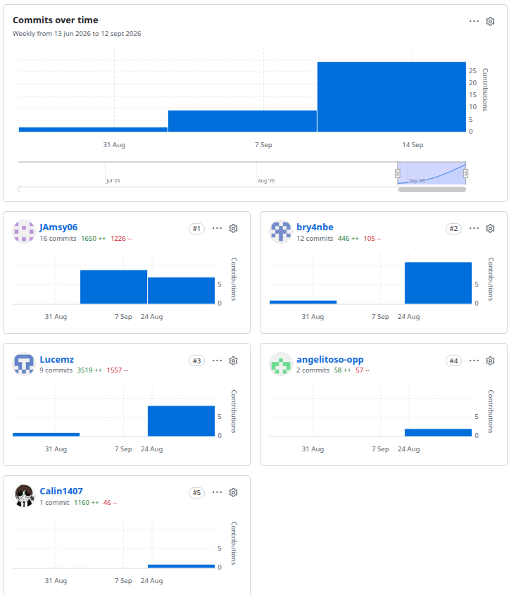

- Recomendaciones para siguientes entregas:
    - Nombrar ramas de manera corta y descriptiva, evitando nombres como
      `feature/av1-chapter-2-competitors-and-interviews` que son demasiado
      largos y difíciles de recordar.
    - Evitar subir demasiado contenido en un solo commit.

## Contenido

- [Registro de Versiones del Informe](#registro-de-versiones-del-informe)
- [Project Report Collaboration Insights](#project-report-collaboration-insights)
    - [AV1](#av1)
- [Student Outcome](#student-outcome)
- [Objetivos SMART](#objetivos-smart)
- [Capítulo I: Presentación](#capítulo-i-presentación)
    - [1.1. Startup Profile](#11-startup-profile)
        - [1.1.1. Descripción de la Startup](#111-descripción-de-la-startup)
        - [1.1.2. Perfiles de integrantes del equipo](#112-perfiles-de-integrantes-del-equipo)
    - [1.2. Solution Profile](#12-solution-profile)
        - [1.2.1. Antecedentes y problemática](#121-antecedentes-y-problemática)
        - [1.2.2. Lean UX Process](#122-lean-ux-process)
    - [1.3. Segmentos objetivo](#13-segmentos-objetivo)
- [Capítulo II: Requirements Development and Software Solution Design](#capítulo-ii-requirements-development-and-software-solution-design)
    - [2.1. Competidores](#21-competidores)
        - [2.1.1. Análisis competitivo](#211-análisis-competitivo)
        - [2.1.2. Estrategias y tácticas frente a competidores](#212-estrategias-y-tácticas-frente-a-competidores)
    - [2.2. Entrevistas](#22-entrevistas)
        - [2.2.1. Diseño de entrevistas](#221-diseño-de-entrevistas)
        - [2.2.2. Registro de entrevistas](#222-registro-de-entrevistas)
        - [2.2.3. Análisis de entrevistas](#223-análisis-de-entrevistas)
    - [2.3. Needfinding](#23-needfinding)
        - [2.3.1. User Personas](#231-user-personas)
        - [2.3.2. User Task Matrix](#232-user-task-matrix)
        - [2.3.3. User Journey Mapping](#233-user-journey-mapping)
        - [2.3.4. Empathy Mapping](#234-empathy-mapping)
        - [2.3.5. Big Picture EventStorming](#235-big-picture-eventstorming)
        - [2.3.6. Ubiquitous Language](#236-ubiquitous-language)
    - [2.4. Requirements Specification](#24-requirements-specification)
        - [2.4.1. User Stories](#241-user-stories)
        - [2.4.2. Impact Mapping](#242-impact-mapping)
        - [2.4.3. Product Backlog](#243-product-backlog)
    - [2.5. Strategic-Level Domain-Driven Design](#25-strategic-level-domain-driven-design)
        - [2.5.1. EventStorming](#251-eventstorming)
        - [2.5.2. Context Mapping](#252-context-mapping)
        - [2.5.3. Software Architecture](#253-software-architecture)
    - [2.6. Tactical-Level Domain-Driven Design](#26-tactical-level-domain-driven-design)
- [Capítulo III: Solution UI/UX Design](#capítulo-iii-solution-uiux-design)
    - [3.1. Product design](#31-product-design)
        - [3.1.1. Style Guidelines](#311-style-guidelines)
            - [3.1.1.1. General Style Guidelines](#3111-general-style-guidelines)
        - [3.1.2. Information Architecture](#312-information-architecture)
            - [3.1.2.1. Organization Systems](#3121-organization-systems)
            - [3.1.2.2. Labelling Systems](#3122-labelling-systems)
            - [3.1.2.3. SEO Tags and Meta Tags](#3123-seo-tags-and-meta-tags)
            - [3.1.2.4. Searching Systems](#3124-searching-systems)
            - [3.1.2.5. Navigation Systems](#3125-navigation-systems)
        - [3.1.3. Landing Page UI Design](#313-landing-page-ui-design)
            - [3.1.3.1. Landing Page Wireframe](#3131-landing-page-wireframe)
            - [3.1.3.2. Landing Page Mock-up](#3132-landing-page-mock-up)
        - [3.1.4. Mobile Applications UX/UI Design](#314-mobile-applications-uxui-design)
            - [3.1.4.1. Mobile Applications Wireframes](#3141-mobile-applications-wireframes)
            - [3.1.4.2. Mobile Applications Wireflow Diagrams](#3142-mobile-applications-wireflow-diagrams)
            - [3.1.4.3. Mobile Applications Mock-ups](#3143-mobile-applications-mock-ups)
            - [3.1.4.4. Mobile Applications User Flow Diagrams](#3144-mobile-applications-user-flow-diagrams)
            - [3.1.4.5. Mobile Applications Prototyping](#3145-mobile-applications-prototyping)
- [Capítulo IV: Product Implementation & Validation](#capitulo-4-product-implementation--validation)
    - [4.1. Software Configuration Management](#41-software-configuration-management)
- [Conclusiones](#conclusiones)
    - [Conclusiones y recomendaciones](#conclusiones-y-recomendaciones)
- [Bibliografía](#bibliografía)
    - [Dominio de negocio](#dominio-de-negocio)
    - [Métodos y técnicas de ingeniería de software](#métodos-y-técnicas-de-ingeniería-de-software)
- [Anexos](#anexos)

## Student Outcome

El curso contribuye al cumplimiento del Student Outcome ABET:

### ABET - EAC - Student Outcome 7

**Criterio:** La capacidad de adquirir y aplicar nuevos conocimientos
según sea necesario, utilizando estrategias de aprendizaje apropiadas.

En el siguiente cuadro se describen las acciones realizadas y los
enunciados de conclusiones por parte del grupo, que permiten sustentar
el haber alcanzado el logro del ABET – EAC - Student Outcome 7.

### 1. Barba Estrada, Bryan Eduardo

| Criterio específico | Acciones realizadas | Conclusiones |
| :--- | :--- | :--- |
| **Actualiza conceptos y conocimientos necesarios para su desarrollo profesional y, en especial, para su proyecto en soluciones de software.** | TV1: Revisé los lineamientos del curso y los apliqué al desarrollo de 2.3 Needfinding y 2.4 Requirements Specification. Aprendí a elaborar User Personas, User Task Matrix, User Journey Maps, Empathy Maps y Ubiquitous Language, y a redactar User Stories con criterios de aceptación en formato Given–When–Then, Technical Stories, Spike Stories, Impact Mapping y Product Backlog. Reforcé además el uso de Markdown, GitFlow y Conventional Commits.  **Evidencias:** TV1: secciones 2.3 y 2.4 del README, imágenes de los artefactos y commits de la rama `feature/av1-needfinding-requirements`. | TV1: La aplicación de estos conceptos me permitió estructurar los requisitos del sistema de forma clara y priorizada, asegurando que las historias de usuario y artefactos de diseño reflejen adecuadamente las necesidades reales del dominio. |
| **Reconoce la necesidad del aprendizaje permanente para el desempeño profesional y el desarrollo de proyectos en soluciones de software.** | TV1: Identifiqué que las herramientas de análisis de experiencia (UXPressia) y de modelado (Miro) requieren práctica continua, por lo que investigué su documentación y buenas prácticas. Comprendí también la importancia de mantener actualizados los conceptos de especificación de requisitos y de trabajo colaborativo con ramas, merges y revisión de cambios.  **Evidencias:** TV1: artefactos de Needfinding, user stories y product backlog incorporados en el README. | TV1: El aprendizaje continuo de herramientas de diseño y flujos de trabajo colaborativos en Git es fundamental para mantener una documentación ágil, consistente y alineada con los estándares de la industria. |

---

### 2. Bendezú Navarro, Rúbens Fitzgerald

| Criterio específico | Acciones realizadas | Conclusiones |
| :--- | :--- | :--- |
| **Actualiza conceptos y conocimientos necesarios para su desarrollo profesional y, en especial, para su proyecto en soluciones de software.** | TV1: Investigó y aplicó los principios de Domain-Driven Design (DDD) Estratégico (descubrimiento de Bounded Contexts, Domain Storytelling, Bounded Context Canvases y Context Mapping) junto con el modelado de arquitectura C4 (Contexto, Contenedores y Despliegue) orientado a aplicaciones móviles nativas Android con persistencia local Room y arquitectura limpia, asegurando una base técnica escalable para el monitoreo agrícola.  **Evidencias:** TV1: Diagramas de Big Picture EventStorming, Domain Storytelling, Bounded Context Canvases (5 contextos), Context Mapping y diagramas C4 incorporados en la sección 2.5 del README. | TV1: La aplicación formal de Domain-Driven Design Estratégico y el modelado C4 me permitieron delimitar con claridad las fronteras de responsabilidad de TerraTech, comprendiendo que el éxito de una aplicación móvil en entornos agrícolas radica en una arquitectura desacoplada, resiliente a fallos de conectividad y alineada rigurosamente con el lenguaje del dominio de los productores. |
| **Reconoce la necesidad del aprendizaje permanente para el desempeño profesional y el desarrollo de proyectos en soluciones de software.** | TV1: Investigó y aplicó los principios de Domain-Driven Design (DDD) Estratégico y el modelado de arquitectura C4 orientado a aplicaciones móviles nativas Android con persistencia local Room y arquitectura limpia, asegurando una base técnica escalable para el monitoreo agrícola.  **Evidencias:** TV1: Diagramas de Big Picture EventStorming, Domain Storytelling, Bounded Context Canvases (5 contextos), Context Mapping y diagramas C4 incorporados en la sección 2.5 del README. | TV1: La aplicación formal de Domain-Driven Design Estratégico y el modelado C4 me permitieron delimitar con claridad las fronteras de responsabilidad de TerraTech, comprendiendo que el éxito de una aplicación móvil en entornos agrícolas radica en una arquitectura desacoplada, resiliente a fallos de conectividad y alineada rigurosamente con el lenguaje del dominio de los productores. |

---

### 3. Delgado Perez, James Caleb

| Criterio específico | Acciones realizadas | Conclusiones |
| :--- | :--- | :--- |
| **Actualiza conceptos y conocimientos necesarios para su desarrollo profesional y, en especial, para su proyecto en soluciones de software.** | TV1: Revisé los lineamientos del curso y el material de referencia de Lean UX para adaptar el Capítulo I de TerraTech al proyecto de aplicaciones móviles, reutilizando la base tecnológica del proyecto previo y alineando el Capítulo I con el alcance funcional actualmente documentado para TerraTech. Apliqué la técnica 5W + 2H para organizar la problemática y desarrollé los Problem Statements, Assumptions, Hypothesis Statements y Lean UX Canvas. Asimismo, revisé el sustento estadístico de los segmentos objetivo y organicé las referencias bibliográficas en formato APA 7. Estas actividades me permitieron aplicar los conocimientos adquiridos mediante la consulta de fuentes y la revisión de la coherencia entre las secciones relacionadas con mi aporte.  **Evidencias:** TV1: Capítulo I actualizado, Lean UX Canvas y bibliografía incorporados en el README de la AV1. | TV1: La revisión de los materiales del curso y su aplicación a TerraTech me permitieron comprender cómo relacionar el problema, los usuarios, los supuestos y las hipótesis de una solución. Aprendí que reutilizar un proyecto requiere revisar su documentación, contrastar la información existente y adaptar su formulación al contexto móvil y al alcance funcional actualmente definido. |
| **Reconoce la necesidad del aprendizaje permanente para el desempeño profesional y el desarrollo de proyectos en soluciones de software.** | TV1: Reconocí la necesidad de ampliar mis conocimientos de Markdown, Git y GitFlow para responder a los cambios en la organización del informe. Apliqué estos conocimientos al consolidar la estructura del informe en un único README, ajustar los enlaces del índice y registrar mis aportes mediante ramas y commits. También actualicé el registro de versiones, el registro de participación, el Student Outcome y los objetivos SMART, y revisé la coherencia del Capítulo I con el alcance funcional actualizado de TerraTech. La revisión del Lean UX Canvas y de las fuentes estadísticas me permitió reconocer que los supuestos del proyecto deben contrastarse y actualizarse conforme se obtiene nueva evidencia.  **Evidencias:** TV1: README consolidado, Capítulo I actualizado, Lean UX Canvas, registro de versiones, registro de participación e historial de commits de la AV1. | TV1: Comprendí que el aprendizaje permanente forma parte del desarrollo de software y de su documentación. Consultar fuentes, revisar la coherencia del proyecto y aplicar nuevos conocimientos de Lean UX, Markdown y control de versiones me permitió atender los requisitos de la entrega y conservar la trazabilidad de mis aportes. Reconozco que debo continuar este proceso durante las siguientes etapas del proyecto. |

---

### 4. Pariona Chacca, Angel Jose

| Criterio específico | Acciones realizadas | Conclusiones |
| :--- | :--- | :--- |
| **Actualiza conceptos y conocimientos necesarios para su desarrollo profesional y, en especial, para su proyecto en soluciones de software.** | TV1: Investigué el mercado de soluciones agrícolas móviles y la formulación de entrevistas semiestructuradas, profundizando en patrones de diseño accesible para usuarios con baja alfabetización digital y en arquitecturas móviles resilientes con soporte sin conexión (almacenamiento local SQLite/Room) y conectividad evaluada para campo. Apliqué estos conceptos al benchmark de competidores y a la sistematización de 7 entrevistas reales para extraer requisitos aplicables a la solución móvil.  **Evidencias:** TV1: secciones 2.1 y 2.2 del README con matrices de análisis competitivo, registro de entrevistas y análisis estadístico-cualitativo. | TV1: Comprender las dificultades reales de los agricultores y compradores mediante entrevistas me demostró que una solución de software debe sustentarse en una investigación empírica rigurosa. Desarrollar interfaces simples y modos sin conexión no es solo una decisión técnica, sino una necesidad de accesibilidad que exige actualizar constantemente nuestros criterios de diseño de software móvil. |
| **Reconoce la necesidad del aprendizaje permanente para el desempeño profesional y el desarrollo de proyectos en soluciones de software.** | TV1: Reconocí que el análisis del entorno de mercado y las expectativas de los usuarios no son estáticos, sino que exigen una constante actualización sobre nuevas tecnologías móviles y diseño inclusivo. Comprendí la necesidad del aprendizaje continuo para contrastar hipótesis teóricas con la retroalimentación directa de los usuarios en campo, adaptando las soluciones de software de forma ágil y profesional.  **Evidencias:** TV1: análisis comparativo de competidores, síntesis estadística de entrevistas en el README y registro de actividades colaborativas en GitHub. | TV1: Asimilar las necesidades de distintos perfiles (desde agricultores tradicionales hasta compradores urbanos) me demostró que el rol del ingeniero de software requiere constante investigación y empatía. Mantener una actitud de aprendizaje continuo es indispensable para proponer soluciones tecnológicas inclusivas y sostenibles. |

---

### 5. Retuerto Rodriguez, Jorge Manuel

| Criterio específico | Acciones realizadas | Conclusiones |
| :--- | :--- | :--- |
| **Actualiza conceptos y conocimientos necesarios para su desarrollo profesional y, en especial, para su proyecto en soluciones de software.** | TV1: Investigué y apliqué patrones de diseño de software táctico y modelado de datos para soluciones móviles e IoT. Diseñé los diagramas de clases del dominio de software por cada Bounded Context y desarrollé el diseño de base de datos relacional y local (Room/SQLite), asegurando la correcta representación de entidades, agregados, relaciones e interacciones de datos para la persistencia offline y sincronización del sistema.  **Evidencias:** TV1: Diagramas de clases del dominio y modelo de base de datos local/relacional documentados en la sección 2.5 del README. | TV1: El diseño de los diagramas de clases y la estructura de datos por Bounded Context me permitieron entender cómo traducir los conceptos estratégicos del dominio agrícola en un modelo de software táctico. Aprendí que definir correctamente las relaciones entre entidades e iterar sobre el modelo de persistencia local es clave para garantizar la integridad y coherencia de los datos en aplicaciones móviles. |
| **Reconoce la necesidad del aprendizaje permanente para el desempeño profesional y el desarrollo de proyectos en soluciones de software.** | TV1: Investigué y apliqué patrones de diseño de software táctico y modelado de datos para soluciones móviles e IoT. Diseñé los diagramas de clases del dominio de software por cada Bounded Context y desarrollé el diseño de base de datos relacional y local (Room/SQLite), asegurando la correcta representación de entidades, agregados, relaciones e interacciones de datos para la persistencia offline y sincronización del sistema.  **Evidencias:** TV1: Diagramas de clases del dominio y modelo de base de datos local/relacional documentados en la sección 2.5 del README. | TV1: Mantenerse actualizado en patrones de modelado de datos y arquitecturas de almacenamiento local es fundamental para afrontar los retos de sincronización e integridad de información en el sector agrícola. Comprendí que el aprendizaje constante me permite diseñar estructuras de software robustas que se adaptan eficientemente a los cambios en los requisitos del dominio. |

## Objetivos SMART

Cada integrante de NovaTech formulará al menos dos objetivos SMART
relacionados con su desarrollo profesional después de finalizar la
carrera. Los objetivos deberán ser específicos, medibles, alcanzables,
relevantes y estar delimitados por un plazo.

### Barba Estrada, Bryan Eduardo

| Elemento SMART | Objetivo 1 | Objetivo 2 |
|:---|:---|:---|
| Objetivo profesional | Desempeñarme como desarrollador de aplicaciones móviles en un equipo de ingeniería de software dentro de los primeros doce meses de egresado. | Diseñar, desarrollar y publicar una aplicación móvil propia en Google Play antes de finalizar el primer año de egresado. |
| Específico | Incorporarme a un equipo de desarrollo móvil (Android o multiplataforma). | Publicar una aplicación con almacenamiento local, consumo de una API y documentación de uso. |
| Medible | Conseguir una posición de desarrollador móvil y completar al menos tres funcionalidades en producción durante el primer año. | Aplicación publicada, repositorio con README y al menos 50 instalaciones o usuarios de prueba. |
| Alcanzable | Practicar semanalmente con proyectos propios, mantener un portafolio en GitHub y participar en procesos de selección. | Dedicar cuatro horas semanales al desarrollo y reutilizar componentes de los proyectos de la carrera. |
| Relevante | Consolidar mi perfil profesional en el área donde deseo especializarme. | Demostrar que puedo llevar una solución completa desde el diseño hasta su publicación. |
| Plazo | Dentro de los doce meses posteriores a la finalización de la carrera. | Antes de finalizar el mes doce después de egresar. |

### Bendezú Navarro, Rúbens Fitzgerald

| Elemento SMART | Objetivo 1 | Objetivo 2 |
|:---|:---|:---|
| Objetivo profesional | Certificación Profesional en Android | Especialización en Arquitectura Cloud y DDD |
| Específico | Obtener la certificación oficial Google Associate Android Developer (AAD). | Obtener la certificación AWS Certified Solutions Architect - Associate. |
| Medible | Aprobar el examen practical oficial y publicar al menos 2 aplicaciones con Jetpack Compose y Clean Architecture. | Completar la ruta formativa de Cloud Architecture y aprobar la certificación con puntaje \>= 800/1000. |
| Alcanzable | Estudiando 10 horas semanales y aplicando los conocimientos en proyectos de producción. | Desarrollando laboratorios prácticos de microservicios, eventos distribuidos y DDD durante 8 meses. |
| Relevante | Consolida el perfil profesional en desarrollo nativo móvil de alto rendimiento. | Permite diseñar arquitecturas móviles y cloud escalables y resilientes a nivel empresarial. |
| Plazo | 6 meses post-graduación | 14 meses post-graduación |

### Delgado Perez, James Caleb

| Elemento SMART | Objetivo 1 | Objetivo 2 |
|:---|:---|:---|
| Objetivo profesional | Desarrollar y documentar dos aplicaciones móviles para Android que consuman una API, y publicar su código y una demostración funcional en mi portafolio durante los primeros doce meses después de finalizar la carrera. | Elaborar un caso de estudio de UX para un proyecto personal de aplicación móvil, incluyendo la definición del problema, los usuarios objetivo, un Lean UX Canvas y un prototipo evaluado con al menos cinco participantes, durante los primeros seis meses después de finalizar la carrera. |
| Específico | Fortalecer mis competencias de desarrollo móvil mediante la construcción de aplicaciones con funcionalidades de consulta y registro de información, integración con una API y documentación de instalación y uso. | Fortalecer mis competencias de investigación y diseño UX mediante la definición de hipótesis, el diseño de un prototipo y la evaluación de su usabilidad. |
| Medible | Completar dos aplicaciones funcionales, publicar sus dos repositorios con un README de instalación y uso, y presentar una demostración de cada aplicación. | Publicar un caso de estudio con un Lean UX Canvas, un prototipo navegable, los resultados de una evaluación con al menos cinco participantes y una iteración de mejoras basada en los hallazgos. |
| Alcanzable | Dedicar cuatro horas semanales al aprendizaje y desarrollo, utilizar documentación técnica y construir las aplicaciones mediante incrementos pequeños que pueda implementar y comprobar. | Dedicar dos horas semanales al caso de estudio, utilizar los conocimientos de Lean UX adquiridos durante la carrera y organizar sesiones de evaluación con participantes voluntarios del segmento definido. |
| Relevante | Contar con evidencia práctica de mis capacidades para desarrollar aplicaciones móviles y presentar un portafolio que respalde mi incorporación a equipos de desarrollo de software. | Mejorar mi capacidad para relacionar las necesidades de los usuarios con decisiones de diseño y comunicar esas decisiones mediante documentación y evidencia. |
| Plazo | Completar la primera aplicación dentro de los primeros seis meses y la segunda antes de finalizar el mes doce, contados desde la finalización de la carrera. | Completar el caso de estudio, la evaluación y la iteración de mejoras antes de finalizar el sexto mes después de terminar la carrera. |

### Pariona Chacca, Angel Jose

| Elemento SMART | Objetivo 1 | Objetivo 2 |
|:---|:---|:---|
| Objetivo profesional | Conseguir empleo como desarrollador junior de aplicaciones móviles en una empresa de tecnología dentro de los primeros doce meses después de terminar la carrera. | Crear y publicar una aplicación móvil propia y funcional que guarde datos en el celular y se conecte a internet, dentro de los primeros seis meses después de egresar. |
| Específico | Postular a ofertas de trabajo e integrarme a un equipo para colaborar en el desarrollo de aplicaciones para celulares. | Desarrollar una aplicación móvil sencilla para resolver un problema práctico, permitiendo guardar información básica en el teléfono y consultar datos en línea. |
| Medible | Postular formalmente a convocatorias laborales, superar las entrevistas de selección y aprobar el periodo de prueba inicial de tres meses. | Subir el proyecto a GitHub con una guía sencilla de instalación y un video corto de dos minutos mostrando la aplicación en funcionamiento. |
| Alcanzable | Dedicar cuatro horas a la semana a practicar programación, repasar lo aprendido en las clases y ordenar mis proyectos para mostrarlos en entrevistas. | Dedicar tres horas semanales durante cuatro meses para programar la aplicación paso a paso usando los conocimientos del curso. |
| Relevante | Me permite iniciar mi experiencia laboral formal en el desarrollo de software y aplicar lo aprendido en proyectos reales. | Sirve como una muestra práctica de mi trabajo para respaldar mis conocimientos al momento de buscar empleo. |
| Plazo | Dentro de los primeros doce meses posteriores a la culminación de la carrera. | Terminar y presentar la aplicación antes de cumplir seis meses de haber egresado de la universidad. |

### Retuerto Rodriguez, Jorge Manuel

| Elemento SMART | Objetivo 1 | Objetivo 2 |
|:---|:---|:---|
| Objetivo profesional | Introducirme en el mercado, dentro de una empresa de tecnologia y teniendo un puesto como desarrollador junior. | Poner en marcha mis proyectos propios. |
| Específico | Conseguir un puesto de trabajo como Desarrollador Junior (Frontend, Backend o Fullstack) en una empresa del sector tecnológico o consultoría TI, aplicando metodologías ágiles y arquitecturas limpias. | Lanzar una versión funcional (MVP - Minimum Viable Product) de una aplicación o plataforma propia, desplegada en producción y accesible para los primeros usuarios de prueba. |
| Medible | Postular a un mínimo de 10 ofertas semanales, realizar al menos 5 entrevistas técnicas o de selección y obtener al menos 1 oferta laboral formal. | Completar el 100% de las funcionalidades clave definidas en el backlog del MVP y alcanzar un primer grupo de al menos 20 usuarios activos que prueben la solución. |
| Alcanzable | Completar el 100% de las funcionalidades clave definidas en el backlog del MVP y alcanzar un primer grupo de al menos 20 usuarios activos que prueben la solución. | Utilizar arquitecturas conocidas, herramientas de código abierto o infraestructura en la nube con capas gratuitas (e.g., Firebase, Vercel, AWS Free Tier) para reducir costos iniciales y avanzar de forma incremental. |
| Relevante | Utilizar arquitecturas conocidas, herramientas de código abierto o infraestructura en la nube con capas gratuitas (e.g., Firebase, Vercel, AWS Free Tier) para reducir costos iniciales y avanzar de forma incremental. | Permitirá validar una idea de negocio propia en el mercado, poner en práctica habilidades de liderazgo, producto y desarrollo integral, y diversificar las fuentes de ingresos/portafolio. |
| Plazo | En un plazo máximo de 3 a 6 meses posteriores a la finalización de los estudios académicos. | En un plazo máximo de 6 a 9 meses, dedicando horas semanales constantes fuera del horario académico. |

# Capítulo I: Presentación

[Volver al contenido principal](#contenido)

## 1.1. Startup Profile

### 1.1.1. Descripción de la Startup

NovaTech es una startup tecnológica orientada al diseño y desarrollo de
soluciones digitales accesibles, eficientes y escalables. Su propósito
es aplicar tecnologías de software, análisis de datos e Internet de las
Cosas para atender problemas reales en sectores que necesitan modernizar
sus procesos y mejorar la toma de decisiones.

En el marco del presente proyecto, NovaTech desarrolla **TerraTech**,
una solución dirigida al sector agrícola que integra dispositivos IoT,
servicios digitales y una aplicación móvil. La solución permite
consultar información sobre la humedad, los nutrientes, la temperatura y
otras condiciones relevantes del suelo, recibir alertas ante condiciones
desfavorables y acceder a información histórica, análisis y
recomendaciones que apoyan las decisiones de riego, fertilización y
cuidado de los cultivos.

TerraTech busca transformar los datos recolectados en información
comprensible y útil para pequeños y medianos agricultores. Para ello,
considera una experiencia móvil sencilla, basada en indicadores
visuales, alertas, notificaciones y opciones de navegación adaptadas a
usuarios con distintos niveles de alfabetización digital y que pueden
trabajar en zonas con conectividad limitada.

La solución también contempla funcionalidades relacionadas con la
gestión de terrenos y sensores, el control de insumos agrícolas, la
consulta de información climática y otras fuentes externas, así como
mecanismos de comunicación, comunidad, reputación y trazabilidad que
permiten ampliar el uso de la información registrada dentro del
ecosistema agrícola.

Asimismo, contempla la participación de proveedores y asesores de
insumos agrícolas, que pueden utilizar información autorizada de los
cultivos para apoyar sus recomendaciones y actividades comerciales, así
como de clientes finales y compradores interesados en consultar
productos, opiniones e información relacionada con su procedencia y las
condiciones registradas durante el cultivo.

**Misión**

Desarrollar soluciones tecnológicas accesibles, sostenibles y confiables
que permitan optimizar el uso de recursos, mejorar los procesos
productivos y facilitar la toma de decisiones en sectores estratégicos.

**Visión**

Ser una startup peruana reconocida por desarrollar soluciones digitales
innovadoras que integren software, análisis de datos e IoT para
contribuir a la transformación digital y al desarrollo sostenible de
diferentes sectores productivos.

**Propuesta de valor**

NovaTech propone, mediante TerraTech, acercar la agricultura de
precisión a pequeños y medianos agricultores mediante una aplicación
móvil intuitiva y tecnología IoT de bajo costo. La solución transforma
datos técnicos del suelo en información visual, alertas, análisis y
recomendaciones comprensibles, permitiendo que el usuario supervise sus
campos, gestione sus sensores e insumos y tome decisiones oportunas
relacionadas con el riego, la fertilización y el cuidado de los
cultivos.

La propuesta también facilita el acceso autorizado a información
agrícola para apoyar la asesoría de los proveedores, incorpora
mecanismos de notificación e información complementaria para la gestión
agrícola y permite a clientes finales y compradores consultar productos,
opiniones e información relacionada con su procedencia y trazabilidad.

### 1.1.2. Perfiles de integrantes del equipo

NovaTech está conformada por estudiantes que aportan diferentes
conocimientos técnicos y habilidades para el análisis, diseño,
implementación y documentación de TerraTech. A continuación, se
presentan los perfiles de los integrantes del equipo.

| Fotografía | Datos académicos | Perfil y aporte al equipo |
| :--- | :--- | :--- |
|  | **Apellidos y nombres:** Barba Estrada, Bryan Eduardo **Código:** U202323479 **Carrera:** Ingeniería de Software | Soy una persona creativa y disciplinada, con capacidad para trabajar en equipo. Mis habilidades técnicas incluyen lenguajes de programación como Python y TypeScript. Me esfuerzo por contribuir activamente al desarrollo del proyecto. |
|  | **Apellidos y nombres:** Bendezú Navarro, Rúbens Fitzgerald **Código:** U20231D390 **Carrera:** Ingeniería de Software | Estudiante de 7mo ciclo de Ingeniería de Software en la UPC con especialización en desarrollo móvil nativo Android y arquitectura de software. Conocimientos sólidos en Kotlin, Jetpack Compose, Room, Spring Boot 3, PostgreSQL, Domain-Driven Design (DDD) y arquitectura limpia. Como aporte a NovaTech, lidera el modelado del dominio estratégico, diseño arquitectónico C4 y resiliencia offline-first para la solución móvil. |
|  | **Apellidos y nombres:** Delgado Perez, James Caleb **Código:** u202115277 **Carrera:** Ingenieria de Software | Soy un estudiante de Ingeniería de Software apasionado por crear soluciones digitales prácticas y eficientes. Cuento con experiencia en C++, Java (Diseño y Patrones de Software), HTML, CSS, JavaScript. Además de trabajar con Java y Angular, me defino como una persona organizada, con rápida capacidad de aprendizaje y orientada al trabajo en equipo. Veo en este proyecto la oportunidad ideal para aportar valor, incorporarme al ámbito laboral y fortalecer mi perfil profesional. En mi tiempo libre practico deportes y encuentro en la programación y la música una vía de creatividad. |
|  | **Apellidos y nombres:** Pariona Chacca, Angel Jose **Código:** U202314734 **Carrera:** Ingeniería de Software | Estudiante de Ingeniería de Software de la UPC, responsable, organizado y con interés en el desarrollo de aplicaciones para celulares y herramientas útiles para los usuarios. Cuento con conocimientos en Java, C++, TypeScript, HTML y CSS. En NovaTech, me encargo del análisis de competidores, la realización de entrevistas y la identificación de las necesidades de los usuarios para orientar el diseño de la aplicación móvil. |
|  | **Apellidos y nombres:** Retuerto Rodriguez, Jorge Manuel **Código:** U202318612 **Carrera:** Ingenieria de Software | Mi nombre es Jorge Manuel Retuerto Rodríguez, tengo 21 años y estoy cursando el 7mo ciclo de la carrera de Ingeniería de Software en la Universidad Peruana de Ciencias Aplicadas. Mi conocimiento y habilidades de programación son intermedias en C++, C#, HTML y CSS. Sin embargo, básicas en Python y Java. Me haré responsable de la comunicación del grupo, planificación y desarrollo junto a mi equipo. |

## 1.2. Solution Profile

TerraTech es una solución tecnológica dirigida al sector agrícola que
integra dispositivos IoT, servicios digitales y una aplicación móvil.
Los sensores permiten recopilar información sobre la humedad, los
nutrientes, la temperatura y otras condiciones relevantes del suelo,
mientras que la aplicación presenta estos datos mediante indicadores
visuales, alertas, información histórica y herramientas de análisis.

Para el curso de Aplicaciones para Dispositivos Móviles, TerraTech
reutiliza el dominio de negocio, la base tecnológica y los servicios
desarrollados previamente en Aplicaciones Open Source, adaptándolos y
organizándolos alrededor de una experiencia móvil. El alcance
documentado de la solución comprende la gestión de usuarios y perfiles,
el monitoreo de terrenos y sensores, la consulta histórica, el análisis
de información, las recomendaciones agrícolas, las notificaciones, la
gestión de insumos, la integración con servicios externos y las
funcionalidades de interacción y consulta disponibles para los
diferentes segmentos objetivo.

La solución busca apoyar principalmente a los pequeños y medianos
agricultores en la toma de decisiones relacionadas con el riego, la
fertilización y el cuidado de sus cultivos. Para ello, contempla el
monitoreo de terrenos, la consulta de información histórica, el análisis
predictivo, las recomendaciones de apoyo a la decisión, la configuración
de alertas y umbrales, la administración de sensores y el control de los
insumos agrícolas disponibles.

TerraTech también puede complementar la información obtenida
directamente de los terrenos mediante la integración con servicios
externos que proporcionen información relevante para la actividad
agrícola, como datos climáticos u otras fuentes de información que
permitan ampliar el contexto disponible para el usuario.

Asimismo, considera el almacenamiento local de información para permitir
la consulta de registros previamente obtenidos cuando la conectividad
sea limitada. La actualización y sincronización de estos registros se
realizará cuando exista conectividad disponible, por lo que la consulta
sin conexión debe distinguirse de la recepción de nuevas mediciones
desde los servicios remotos.

Los proveedores y asesores de insumos agrícolas pueden utilizar
información autorizada sobre los cultivos para sustentar sus
recomendaciones, realizar seguimiento a sus clientes y consultar
información relacionada con productos, demanda y otras variables útiles
para sus actividades dentro de la plataforma.

Por su parte, los clientes finales y compradores —tanto consumidores
como comerciantes mayoristas y minoristas— pueden consultar información
sobre los productos agrícolas, su procedencia y las condiciones
registradas durante el cultivo. TerraTech también contempla
funcionalidades de catálogo, comentarios, calificaciones y reputación
que permiten complementar la información disponible antes de tomar
decisiones de compra.

Dentro de esta experiencia se contempla el acceso a fichas informativas
y mecanismos de trazabilidad mediante códigos QR. Estos mecanismos
facilitan la consulta de información registrada en TerraTech; no
constituyen, por sí mismos, una certificación de inocuidad, producción
orgánica o buenas prácticas agrícolas.

El objetivo de TerraTech es reducir la incertidumbre asociada a la
gestión tradicional de los terrenos, facilitar el monitoreo de los
cultivos, mejorar el acceso a información relevante y conectar a
agricultores, proveedores, asesores, clientes finales y compradores
mediante una experiencia digital orientada al sector agrícola.

### 1.2.1. Antecedentes y problemática

La actividad agrícola peruana se desarrolla en un entorno variable. La
[Organización de las Naciones Unidas para la Alimentación y la
Agricultura (FAO,
2026)](https://www.fao.org/peru/noticias/detail/per%C3%BA-promueve-el-di%C3%A1logo-sobre-c%C3%B3mo-producimos-los-alimentos--qu%C3%A9-comemos-y-su-relaci%C3%B3n-con-el-cambio-clim%C3%A1tico/es)
señala que las sequías prolongadas, las lluvias intensas y la aparición
de nuevas plagas afectan la producción agrícola y los ingresos de las
familias rurales. Este escenario incrementa la necesidad de contar con
información oportuna que permita tomar decisiones sobre el riego, la
fertilización y el cuidado de los cultivos.

De acuerdo con los resultados de la Encuesta Nacional Agropecuaria 2023,
publicados por el [Instituto Nacional de Estadística e Informática
(INEI,
2024)](https://proyectos.inei.gob.pe/iinei/srienaho/Descarga/DocumentosMetodologicos/2023-62/05_PUBLICACION_ENA_2023.pdf),
el 81,7 % de las unidades agropecuarias del país pertenecía a la
agricultura familiar de subsistencia. En la región Sierra, este
porcentaje alcanzó el 92,5 %. Estos datos permiten contextualizar la
importancia de diseñar soluciones accesibles para productores que
trabajan con recursos limitados.

A esta situación se añade la brecha de conectividad existente en las
zonas rurales. Según el [INEI
(2026)](https://www.inei.gob.pe/media/MenuRecursivo/boletines/boletin-tic-oct_dic2025.pdf),
durante el cuarto trimestre de 2025 el 23,4 % de los hogares rurales
tenía acceso a Internet en el hogar, mientras que el 88,1 % disponía de
telefonía móvil. Estas cifras no equivalen a disponibilidad de teléfonos
inteligentes ni garantizan conexión a Internet en las parcelas, pero
permiten identificar condiciones que deben considerarse en el diseño y
la validación de TerraTech.

En este contexto, el equipo plantea como problema que los pequeños y
medianos agricultores no siempre disponen de información integrada,
comprensible y oportuna sobre la humedad, los nutrientes y otras
condiciones relevantes del suelo. Como consecuencia, algunas decisiones
pueden depender principalmente de la experiencia, la observación directa
o registros aislados.

Esta falta de información también afecta a los proveedores que necesitan
sustentar sus recomendaciones y a los clientes finales y compradores que
desean conocer la procedencia y el tratamiento de los productos
agrícolas.

La investigación realizada previamente para TerraTech se conserva como
antecedente del proyecto. Sus entrevistas y hallazgos deben contrastarse
con esta formulación, diferenciando las respuestas efectivamente
registradas de las interpretaciones y decisiones de diseño del equipo.

#### Análisis de la problemática mediante 5W + 2H

| Pregunta | Análisis |
|:---|:---|
| **What – ¿Qué sucede?** | Los agricultores enfrentan incertidumbre al tomar decisiones sobre el riego, la fertilización y el cuidado de los cultivos debido a la falta de información integrada y oportuna sobre las condiciones del suelo. Los proveedores y compradores también encuentran dificultades para acceder a información que apoye sus recomendaciones o decisiones de compra. |
| **Who – ¿A quién afecta?** | Afecta principalmente a pequeños y medianos agricultores. También involucra a proveedores y asesores de insumos agrícolas, así como a clientes finales y compradores que adquieren productos para consumo personal, familiar o comercialización. |
| **Where – ¿Dónde ocurre?** | Ocurre en unidades agropecuarias ubicadas en zonas rurales del Perú, especialmente en regiones andinas donde el acceso a infraestructura y herramientas tecnológicas puede ser limitado. También se manifiesta en los espacios de asesoría y comercialización vinculados con estos productores. La ubicación específica del primer piloto deberá ser definida por el equipo. |
| **When – ¿Cuándo ocurre?** | Se manifiesta durante el ciclo agrícola, principalmente al evaluar el terreno, planificar la siembra, regar, fertilizar y responder ante variaciones en el estado del suelo. Para proveedores y compradores, aparece al formular recomendaciones, evaluar productos o tomar decisiones de compra. |
| **Why – ¿Por qué ocurre?** | Se relaciona con la ausencia de mediciones continuas, el costo o la complejidad de algunas soluciones tecnológicas, las limitaciones de conectividad y la dependencia de información dispersa. La importancia de estas causas debe contrastarse con la evidencia de las entrevistas. |
| **How – ¿Cómo se manifiesta?** | Las decisiones pueden tomarse utilizando inspecciones visuales, experiencia previa o registros manuales. Esto dificulta detectar oportunamente cambios en la humedad o los nutrientes, realizar un seguimiento histórico de cada terreno, administrar información relacionada con los recursos utilizados y compartir información comprensible con otros actores. |
| **How much – ¿Cuál es su magnitud?** | Como indicadores del contexto, en 2023 el 81,7 % de las unidades agropecuarias del país pertenecía a la agricultura familiar de subsistencia y el porcentaje alcanzaba el 92,5 % en la Sierra. Además, durante el cuarto trimestre de 2025 el 23,4 % de los hogares rurales tenía Internet en el hogar. Estas cifras describen el entorno del problema; el impacto específico sobre agua, fertilizantes, producción e ingresos debe medirse mediante una línea base y pruebas piloto. |

#### Objetivos preliminares

- Facilitar el monitoreo de la humedad, los nutrientes, la temperatura y
  otras condiciones relevantes del suelo mediante dispositivos IoT.
- Transformar los datos recopilados en información visual, comprensible
  y útil para la toma de decisiones.
- Presentar alertas y notificaciones que permitan responder
  oportunamente ante condiciones que puedan afectar los cultivos.
- Proporcionar información histórica, análisis predictivo y
  recomendaciones que apoyen la planificación de las actividades
  agrícolas.
- Facilitar la gestión de terrenos, sensores y umbrales asociados con
  las condiciones monitoreadas.
- Permitir la consulta de información previamente almacenada en el
  dispositivo móvil cuando exista conectividad limitada y su posterior
  sincronización al recuperar la conexión.
- Facilitar la gestión y seguimiento de los insumos agrícolas
  disponibles para los usuarios.
- Complementar la información agrícola mediante la integración con
  servicios externos relevantes para la toma de decisiones, como
  servicios de información climática.
- Facilitar el acceso autorizado a información agrícola para apoyar las
  recomendaciones y actividades de los proveedores.
- Proporcionar herramientas de consulta y análisis que permitan a los
  proveedores conocer información relevante para el seguimiento de sus
  clientes y productos.
- Facilitar mecanismos de interacción, comentarios, calificaciones y
  reputación entre los usuarios de TerraTech.
- Facilitar la consulta de productos, procedencia y condiciones
  registradas durante el cultivo por parte de consumidores y compradores
  comerciales, incluyendo mecanismos de acceso mediante códigos QR.
- Evaluar, mediante una línea base y pruebas piloto, los posibles
  cambios en el consumo de agua, el uso de fertilizantes y la
  productividad.

#### Restricciones preliminares

- Acceso intermitente o limitado a Internet en determinadas zonas
  rurales.
- Necesidad de comprobar que los usuarios objetivo dispongan de
  teléfonos inteligentes compatibles.
- Costo de adquisición, instalación y mantenimiento de los sensores IoT.
- Dependencia de la calibración, precisión, alimentación energética y
  resistencia física de los dispositivos.
- Diferentes niveles de alfabetización digital entre los agricultores,
  incluyendo usuarios adultos mayores.
- Dependencia de la conectividad y de la disponibilidad de los servicios
  para recibir nuevas mediciones y actualizar la información almacenada.
- Necesidad de definir mecanismos adecuados de almacenamiento local,
  sincronización y resolución de conflictos cuando se recupere la
  conectividad.
- Dependencia de servicios externos para determinadas funcionalidades,
  como la consulta de información climática, imágenes u otros datos
  complementarios.
- Dependencia de los permisos y restricciones del sistema operativo
  móvil para funcionalidades como notificaciones, almacenamiento local y
  sincronización en segundo plano.
- Necesidad de validar técnicamente la frecuencia de lectura de los
  sensores, los protocolos de comunicación, el consumo energético y la
  conectividad IoT utilizada.
- Necesidad de validar las recomendaciones agrícolas con especialistas y
  evitar presentarlas como diagnósticos definitivos o garantías de
  resultados.
- Protección de los datos personales, productivos y geográficos
  registrados por los usuarios.
- Necesidad de gestionar adecuadamente los comentarios, calificaciones y
  demás información generada por los usuarios dentro de las
  funcionalidades de comunidad y reputación.
- Dependencia de la calidad, disponibilidad y actualización de los datos
  registrados para las funciones de análisis, recomendaciones y
  trazabilidad.
- Limitación de las fichas y códigos QR a la información disponible y
  autorizada; su consulta no equivale a una certificación externa.

### 1.2.2. Lean UX Process

El proceso Lean UX permite formular el problema de negocio, identificar
las principales suposiciones relacionadas con los usuarios y la
solución, convertirlas en hipótesis verificables y proponer experimentos
que permitan validarlas.

Se conserva la variante **Brand New Initiative** para documentar la
formulación inicial de TerraTech. La reutilización del proyecto en el
curso de Aplicaciones para Dispositivos Móviles no supone que las
hipótesis de negocio hayan sido demostradas ni que deban reemplazarse
las entrevistas originales.

Se presenta un solo Problem Statement para todo el proyecto,
considerando a los pequeños y medianos agricultores, los proveedores y
asesores de insumos agrícolas, y los clientes finales y compradores de
productos agrícolas.

#### 1.2.2.1. Lean UX Problem Statements

**El estado actual de** la gestión agrícola de pequeñas y medianas
unidades agropecuarias rurales del Perú **se caracteriza por** la toma
de decisiones basada en la experiencia, la observación directa y
registros que no siempre se encuentran integrados. Los agricultores
necesitan información oportuna sobre las condiciones del suelo; los
proveedores de insumos requieren datos autorizados para sustentar sus
recomendaciones; y los clientes finales y compradores cuentan con una
visibilidad limitada sobre la procedencia y el tratamiento de los
productos agrícolas.

**Lo que buscamos abordar de manera conjunta es** la necesidad de
monitorear las condiciones del suelo, presentar los datos de forma
comprensible mediante una aplicación móvil, analizar la información
recopilada y facilitar su intercambio controlado entre los actores
involucrados. El análisis competitivo permite contrastar en qué medida
las alternativas existentes atienden estas necesidades.

**Nuestro producto abordará esta necesidad mediante** la integración de
sensores IoT y servicios digitales con una aplicación móvil de interfaz
simplificada. TerraTech permitirá monitorear terrenos y sensores,
consultar indicadores e información histórica, visualizar alertas y
notificaciones, acceder a análisis y recomendaciones, gestionar insumos
y utilizar información complementaria procedente de servicios externos.
Asimismo, facilitará la interacción entre agricultores y proveedores y
permitirá a clientes finales y compradores consultar productos,
opiniones e información de trazabilidad mediante fichas y códigos QR.

**Nuestro enfoque inicial será** atender a pequeños y medianos
agricultores de zonas rurales y andinas que necesiten monitorear sus
terrenos y recibir información comprensible para apoyar sus decisiones
de riego, fertilización y cuidado de los cultivos. Los proveedores y
asesores de insumos agrícolas, así como los consumidores y compradores
comerciales, se consideran segmentos complementarios de la solución.

**Sabremos que hemos tenido éxito cuando observemos** que al menos el 80
% de los agricultores participantes utilice TerraTech regularmente
durante el periodo de evaluación definido para la solución y pueda
consultar el estado de sus terrenos e interpretar sus alertas sin
asistencia constante. Asimismo, se evaluará que al menos el 70 % de los
proveedores participantes utilice la información registrada en TerraTech
para apoyar sus recomendaciones y que al menos el 60 % de los clientes
finales y compradores participantes consulte información de trazabilidad
durante las pruebas correspondientes.

#### 1.2.2.2. Lean UX Assumptions

Las siguientes suposiciones representan las creencias del equipo sobre
el negocio, los usuarios, los beneficios esperados y las funcionalidades
de TerraTech. Su presencia en el informe o la existencia de una
implementación no constituye, por sí sola, evidencia de que los
beneficios esperados hayan sido alcanzados.

Estas suposiciones deben contrastarse con las entrevistas, los
experimentos y las pruebas de uso. Los porcentajes y valores económicos
indicados son metas por validar, no resultados demostrados.

##### Business Assumptions

- **BA-01 – Necesidad del mercado:** Creemos que los pequeños y medianos
  agricultores necesitan una alternativa accesible y adaptada a su
  contexto para monitorear las condiciones de sus terrenos.

- **BA-02 – Viabilidad de la solución:** Creemos que los agricultores
  adoptarán TerraTech si perciben que los beneficios obtenidos
  justifican el costo del kit y el esfuerzo necesario para aprender a
  utilizarlo.

- **BA-03 – Modelo de monetización:** Creemos que TerraTech puede
  generar ingresos mediante la venta de kits IoT y planes de suscripción
  mensual asociados al uso de la plataforma. Como hipótesis comercial
  inicial se considera un kit con un precio inferior a S/ 300 y planes
  mensuales dentro de un rango aproximado de S/ 30 a S/ 50. Estos
  valores deberán validarse considerando los costos reales y la
  disposición de pago de los usuarios.

- **BA-04 – Alianzas estratégicas:** Creemos que las asociaciones
  agrícolas, cooperativas y proveedores de insumos pueden contribuir con
  la difusión, distribución y soporte de TerraTech.

- **BA-05 – Capacidades organizacionales:** Creemos que NovaTech cuenta
  con una base tecnológica reutilizable que permitirá integrar la
  experiencia móvil con los dispositivos IoT, los servicios digitales y
  las capacidades funcionales documentadas para TerraTech.

##### Business Outcome Assumptions

- **BOA-01 – Reducción del desperdicio de agua:** Creemos que el uso de
  TerraTech puede contribuir a disminuir aproximadamente entre el 25 % y
  el 30 % del uso innecesario de agua.

- **BOA-02 – Ahorro en insumos:** Creemos que el uso de TerraTech puede
  contribuir a reducir aproximadamente en un 20 % los costos
  relacionados con el uso innecesario de fertilizantes.

- **BOA-03 – Rentabilidad del agricultor:** Creemos que el uso de
  TerraTech puede contribuir a incrementar la utilidad de los
  agricultores usuarios en al menos S/ 2 000 por hectárea.

- **BOA-04 – Viabilidad comercial:** Creemos que NovaTech puede alcanzar
  un margen aproximado del 30 % en la venta de los kits IoT y conseguir
  usuarios suscritos a los planes mensuales.

- **BOA-05 – Adopción del mercado:** Creemos que al menos el 80 % de los
  agricultores participantes utilizará TerraTech regularmente durante el
  periodo de evaluación definido y mostrará interés en continuar
  utilizando el servicio.

- **BOA-06 – Uso por proveedores:** Creemos que al menos el 70 % de los
  proveedores participantes utilizará la información registrada en
  TerraTech para apoyar sus recomendaciones durante las pruebas piloto.

- **BOA-07 – Consulta de trazabilidad:** Creemos que al menos el 60 % de
  los clientes finales y compradores participantes consultará la
  información de trazabilidad disponible durante las pruebas piloto.

Los resultados relacionados con agua, fertilizantes, rentabilidad,
adopción, utilización de la información y consulta de trazabilidad
deberán evaluarse frente a criterios previamente definidos,
estableciendo el periodo de medición, la línea base correspondiente y
las condiciones de cada prueba.

##### User Assumptions

- **UA-01 – Usuario principal:** Creemos que nuestros usuarios
  principales son pequeños y medianos agricultores responsables de las
  decisiones sobre riego, fertilización y cuidado de sus terrenos,
  especialmente en zonas rurales y andinas. El perfil considera adultos
  de distintas edades, incluyendo adultos mayores, y diferentes niveles
  de experiencia con dispositivos móviles.

- **UA-02 – Usuario secundario:** Creemos que nuestros usuarios
  secundarios son proveedores y asesores de insumos agrícolas que
  necesitan información sobre las condiciones de los terrenos para
  sustentar sus recomendaciones, realizar seguimiento a sus clientes y
  gestionar información relacionada con los productos que ofrecen.

- **UA-03 – Usuario terciario:** Creemos que nuestros usuarios
  terciarios son clientes finales y compradores de productos agrícolas
  interesados en conocer su procedencia, las condiciones registradas
  durante el cultivo y las opiniones disponibles sobre los productos.
  Este segmento incluye consumidores que adquieren productos para uso
  personal o familiar, así como compradores mayoristas y minoristas que
  los adquieren para comercializarlos.

##### User Outcome and Benefit Assumptions

- **UOBA-01 – Información sobre el terreno:** Creemos que los
  agricultores podrán conocer las condiciones registradas de humedad,
  nutrientes, temperatura y otros indicadores de sus terrenos sin
  depender únicamente de la intuición o la observación directa.

- **UOBA-02 – Prevención de pérdidas:** Creemos que los agricultores
  podrán reaccionar oportunamente ante alertas relacionadas con la falta
  de agua, niveles inadecuados de nutrientes u otras condiciones
  desfavorables.

- **UOBA-03 – Optimización del tiempo:** Creemos que los agricultores
  podrán consultar información sobre sus terrenos desde su dispositivo
  móvil sin tener que desplazarse continuamente hacia cada parcela.

- **UOBA-04 – Gestión de recursos:** Creemos que los agricultores podrán
  gestionar información relacionada con sus sensores, alertas e insumos
  agrícolas desde una misma solución para facilitar el seguimiento de
  sus actividades.

- **UOBA-05 – Recomendaciones sustentadas:** Creemos que los proveedores
  podrán utilizar información autorizada y las herramientas de análisis
  disponibles en TerraTech para apoyar su asesoría, realizar seguimiento
  y fortalecer la confianza de sus clientes.

- **UOBA-06 – Información comercial para proveedores:** Creemos que los
  proveedores podrán utilizar información sobre productos, demanda y
  actividad de los usuarios para orientar determinadas decisiones
  comerciales.

- **UOBA-07 – Transparencia del producto:** Creemos que los clientes
  finales y compradores podrán consultar información compartida sobre la
  procedencia, el tratamiento y la trazabilidad de los productos
  agrícolas para tomar decisiones de compra mejor informadas.

- **UOBA-08 – Comunidad y reputación:** Creemos que los comentarios,
  calificaciones y mecanismos de reputación permitirán a proveedores y
  compradores disponer de información adicional sobre la experiencia de
  otros usuarios dentro de TerraTech.

##### Feature Assumptions

- **FA-01 – Hardware robusto:** Creemos que un kit de sensores IoT de
  bajo costo, con protección frente a las condiciones ambientales,
  precisión adecuada y autonomía energética, permitirá recopilar
  información confiable desde los terrenos agrícolas.

- **FA-02 – Interfaz simplificada:** Creemos que una aplicación móvil
  basada en íconos, colores tipo semáforo, textos breves, navegación
  comprensible y notificaciones visuales y sonoras facilitará la
  interpretación de la información por parte de usuarios con diferentes
  niveles de alfabetización digital.

- **FA-03 – Análisis de información y recomendaciones:** Creemos que un
  panel con información histórica, estado de los cultivos, tendencias,
  alertas, análisis predictivo y recomendaciones automáticas sobre riego
  y fertilización ayudará a planificar las actividades agrícolas. Las
  sugerencias de insumos o dosificación que presente la solución se
  consideran apoyo a la decisión y requieren evaluación según el
  contexto del cultivo.

- **FA-04 – Monitoreo y consulta de cultivos:** Creemos que la
  visualización de las condiciones registradas de cada terreno permitirá
  que los agricultores detecten variaciones y tomen decisiones
  oportunas. La consulta de datos almacenados localmente facilitará el
  acceso a información previamente obtenida cuando no exista conexión, y
  su actualización se realizará cuando esta se restablezca.

- **FA-05 – Ecosistema digital, comunidad y trazabilidad:** Creemos que
  los mecanismos de comunicación e intercambio autorizado de
  información, el catálogo de productos, las funciones de comunidad y
  reputación y la consulta de fichas mediante códigos QR facilitarán la
  interacción entre agricultores, proveedores, clientes finales y
  compradores, además de mejorar el acceso a información relevante para
  sus decisiones.

Además de las cinco Feature Assumptions priorizadas para la formulación
de las hipótesis Lean UX, TerraTech contempla capacidades
complementarias de autenticación y gestión de perfiles, administración
de sensores e insumos, notificaciones configurables, integración con
servicios externos y herramientas de analítica. Estas capacidades forman
parte del alcance funcional documentado en los requisitos del producto,
aunque no constituyen hipótesis independientes dentro del presente Lean
UX Process.

#### 1.2.2.3. Lean UX Hypothesis Statements

A partir de las suposiciones identificadas, se formularon cinco
hipótesis verificables. Cada Hypothesis Statement se encuentra
relacionado con una de las cinco Feature Assumptions priorizadas de
TerraTech.

##### H-01 – Hardware robusto (FA-01)

**CREEMOS QUE LOGRAREMOS** reducir entre el 25 % y el 30 % del uso
innecesario de agua **SI** los pequeños y medianos agricultores
**LOGRAN** conocer oportunamente el nivel de humedad de sus terrenos
**CON** un kit de sensores IoT resistente, autónomo, preciso y de costo
accesible.

##### H-02 – Interfaz simplificada (FA-02)

**CREEMOS QUE LOGRAREMOS** que al menos el 80 % de los agricultores
participantes utilice TerraTech regularmente durante el periodo de
evaluación definido **SI** los agricultores con diferentes niveles de
alfabetización digital **LOGRAN** consultar el estado de sus terrenos e
interpretar las alertas sin asistencia constante **CON** una aplicación
móvil basada en íconos, colores tipo semáforo, textos breves y
notificaciones comprensibles.

##### H-03 – Análisis de información y recomendaciones (FA-03)

**CREEMOS QUE LOGRAREMOS** incrementar la utilidad de los agricultores
usuarios en al menos S/ 2 000 por hectárea **SI** los pequeños y
medianos agricultores **LOGRAN** identificar tendencias, condiciones
favorables y posibles riesgos para planificar sus actividades agrícolas
**CON** un panel que presente información histórica, alertas, análisis
predictivo y recomendaciones de apoyo a la decisión.

##### H-04 – Monitoreo y consulta de cultivos (FA-04)

**CREEMOS QUE LOGRAREMOS** reducir aproximadamente en un 20 % los costos
relacionados con el uso innecesario de fertilizantes **SI** los
agricultores **LOGRAN** identificar variaciones en los nutrientes y
otras condiciones registradas del suelo **CON** la consulta de
información de sus terrenos y cultivos desde la aplicación móvil.

##### H-05 – Ecosistema digital, comunidad y trazabilidad (FA-05)

**CREEMOS QUE LOGRAREMOS** fortalecer la adopción y viabilidad comercial
de TerraTech mediante usuarios interesados en continuar utilizando la
solución **SI** los agricultores, proveedores, clientes finales y
compradores **LOGRAN** interactuar, intercambiar y consultar información
relevante para sus actividades y decisiones **CON** mecanismos de
comunicación, comunidad y reputación, catálogo de productos y fichas de
trazabilidad accesibles mediante códigos QR.

#### 1.2.2.4. Lean UX Canvas

El Lean UX Canvas prioriza las principales hipótesis de negocio,
usuarios, beneficios y características que requieren validación. Las
capacidades complementarias documentadas en los requisitos del producto
se mantienen dentro del alcance general de TerraTech, aunque no todas se
representan como hipótesis independientes en el Canvas.

  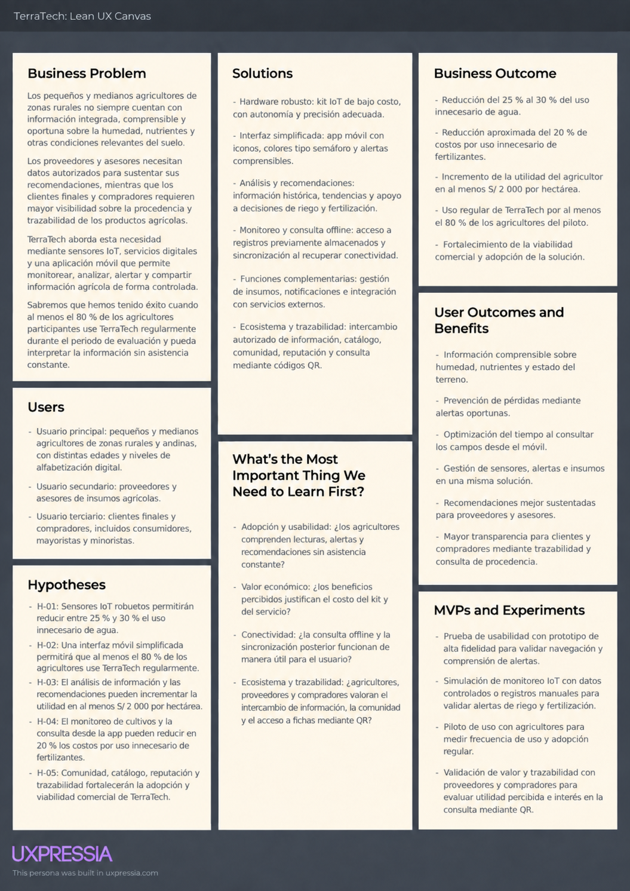

## 1.3. Segmentos objetivo

TerraTech considera tres segmentos objetivo relacionados con la
producción, la asesoría, la comercialización y el consumo de productos
agrícolas. Los perfiles se contextualizan con información estadística y
se contrastan con la investigación realizada previamente para el
proyecto.

Las estadísticas nacionales describen el entorno de los segmentos; las
entrevistas aportan información sobre las personas participantes y no
deben interpretarse automáticamente como resultados representativos de
toda la población.

- **Pequeños y medianos agricultores:**

    - **Perfil:** Productores responsables de las decisiones de riego,
      fertilización y cuidado de unidades agrícolas pequeñas o medianas,
      principalmente ubicadas en zonas rurales de la Sierra peruana. Se
      consideran usuarios de distintas edades, incluyendo adultos mayores,
      con diferentes niveles de alfabetización digital.
    - **Sustento estadístico:** Según la Encuesta Nacional Agropecuaria
      2023, el 81,7 % de las unidades agropecuarias del país pertenecía a
      la agricultura familiar de subsistencia, porcentaje que alcanzó el
      92,5 % en la Sierra. Asimismo, el 64,1 % de los productores tenía
      entre 35 y 64 años. Respecto al nivel educativo, el 48,4 % contaba
      únicamente con educación primaria y el 8,6 % no tenía educación
      formal. Estos datos contextualizan la diversidad de los productores
      y la necesidad de evaluar una experiencia móvil comprensible; no
      establecen un límite de edad para participar en el proyecto. ([INEI,
      2024](https://proyectos.inei.gob.pe/iinei/srienaho/Descarga/DocumentosMetodologicos/2023-62/05_PUBLICACION_ENA_2023.pdf))
    - **Problema:** Incertidumbre sobre la humedad, los nutrientes y el
      estado general de sus tierras, lo que dificulta la toma oportuna de
      decisiones sobre riego y fertilización. Las limitaciones de
      conectividad también pueden dificultar la consulta de información en
      el campo y el acceso continuo a herramientas digitales.
    - **Beneficio:** Monitoreo del estado del suelo, alertas y
      recomendaciones comprensibles, consulta de registros históricos,
      gestión de sensores e insumos e información complementaria que apoye
      la planificación agrícola y el uso eficiente de recursos.

- **Proveedores y asesores de insumos agrícolas:**

    - **Perfil:** Comerciantes, distribuidores y asesores locales que
      venden o recomiendan fertilizantes, semillas, plaguicidas y otros
      insumos utilizados en la producción agrícola.
    - **Sustento estadístico:** La Encuesta Nacional Agropecuaria 2023
      señala que el 3,2 % de los productores recibió asistencia técnica,
      aunque el 80,9 % tuvo acceso a alguna clase de información
      agropecuaria, como precios, demanda, condiciones climáticas, precio
      de fertilizantes, aptitud del suelo o técnicas de manejo. Estas
      cifras describen el contexto de acceso a información y asistencia de
      los agricultores atendidos por este segmento; no representan un
      conteo de proveedores ni demuestran por sí mismas su disposición a
      utilizar TerraTech. ([INEI,
      2024](https://proyectos.inei.gob.pe/iinei/srienaho/Descarga/DocumentosMetodologicos/2023-62/05_PUBLICACION_ENA_2023.pdf))
    - **Problema:** Falta de datos reales y actualizados para formular
      recomendaciones adecuadas a los agricultores, realizar seguimiento y
      orientar determinadas decisiones relacionadas con los productos e
      insumos que ofrecen.
    - **Beneficio:** Acceso autorizado a información sobre las condiciones
      de los cultivos, herramientas de consulta y análisis, información
      relacionada con productos y demanda, notificaciones y mecanismos de
      interacción que permitan apoyar la asesoría, realizar seguimiento y
      fortalecer la relación con sus clientes.

- **Clientes finales y compradores de productos agrícolas:**

    - **Perfil:** Personas que adquieren productos agrícolas para consumo
      personal o familiar, así como comerciantes, distribuidores y
      compradores mayoristas o minoristas que los adquieren para
      comercializarlos. Comparten el interés por conocer la procedencia y
      las condiciones de producción, aunque sus criterios de compra y uso
      de la información pueden ser diferentes.
    - **Sustento estadístico:** Según el Censo Nacional de Mercados de
      Abastos de 2016, citado en la Hoja de Ruta de PRODUCE (2021), se
      identificaron 2 612 mercados en el Perú: 44 mayoristas y 2 568
      minoristas, además de 328 946 puestos fijos. Estas cifras permiten
      dimensionar parte del entorno comercial donde participan
      comerciantes y consumidores. No constituyen una estimación del
      número total de consumidores ni demuestran sus preferencias sobre
      trazabilidad; estas deben contrastarse con la investigación del
      proyecto. ([PRODUCE,
      2021](https://pndp.produce.gob.pe/wp-content/uploads/2025/03/HOJA-DE-RUTA-D.S.-N%C2%BA-021-2021-PRODUCE.pdf))
    - **Problema:** Dificultad para conocer la procedencia de los
      productos y acceder a información comprensible sobre las condiciones
      registradas durante su cultivo, así como a referencias adicionales
      que permitan comparar alternativas antes de realizar una compra.
    - **Beneficio:** Acceso a un catálogo de productos, fichas
      informativas, información de trazabilidad, comentarios,
      calificaciones y datos compartidos por el agricultor sobre la
      procedencia y el cultivo, incluyendo su consulta mediante códigos
      QR, para apoyar decisiones de compra mejor informadas. La
      información presentada no sustituye certificaciones ni controles de
      calidad externos.

# Capítulo II: Requirements Development and Software Solution Design

[Volver al contenido principal](#contenido)

## 2.1. Competidores

- **Agrotech (competidor directo):** Es una empresa enfocada en la
  implementación de tecnología agrícola que ofrece soluciones como
  drones, sensores y asesoría técnica especializada para mejorar la
  productividad del campo. Está orientada a agricultores y empresas
  agroindustriales que buscan optimizar sus procesos mediante el uso de
  herramientas tecnológicas.

- **AgroVista del Valle (competidor directo):** Es una empresa de
  servicios agrícolas que utiliza análisis multiespectral para el
  monitoreo de cultivos, permitiendo evaluar la salud de las plantas y
  detectar problemas en el terreno. Está dirigida a agricultores y
  empresas agroexportadoras que buscan tomar decisiones basadas en datos
  para mejorar la eficiencia y productividad.

- **Phytech (competidor directo):** Es una plataforma digital de
  agricultura de precisión que integra sensores IoT, análisis de datos e
  inteligencia artificial para optimizar el riego y mejorar el
  rendimiento de los cultivos. Está orientada principalmente a empresas
  agroindustriales y grandes productores que buscan maximizar la
  eficiencia en el uso del agua y recursos.

### 2.1.1. Análisis competitivo

Para este análisis competitivo se realizó un benchmark enfocado en
identificar las principales soluciones de agricultura de precisión en el
mercado peruano e internacional. La evaluación consideró tres
competidores directos: **Agrotech** (solución local con enfoque en
drones y asesoría técnica), **AgroVista del Valle** (servicios agrícolas
basados en análisis multiespectral) y **Phytech** (plataforma
internacional con sensores IoT e inteligencia artificial).

El objetivo del **Competitive Analysis Landscape** es evaluar el perfil
de producto, marketing y FODA de estos competidores para identificar
oportunidades clave de diferenciación para **TerraTech**, especialmente
en accesibilidad económica, experiencia móvil optimizada para trabajo en
campo, soporte para zonas con conectividad limitada mediante almacenamiento 
local y monitoreo frecuente de las condiciones del suelo con consulta de 
información actualizada.

| Dimensión | TerraTech (Nuestra Startup) | Agrotech | AgroVista del Valle | Phytech |
|:---|:---|:---|:---|:---|
| **Logo** |  |  | 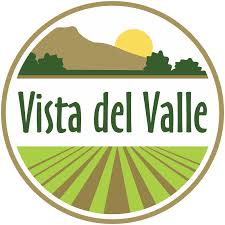 |  |
| **Overview** | Solución móvil conectada a sensores IoT de bajo costo que permite consultar información actualizada sobre la humedad, los nutrientes, la temperatura y otras condiciones relevantes del suelo desde smartphones, generando alertas y herramientas de análisis orientadas a apoyar la toma de decisiones agrícolas en el contexto peruano. | Empresa que implementa tecnología agrícola mediante el uso de drones, sensores y asesoría técnica especializada presencial para optimizar la productividad de los cultivos. | Empresa de servicios agrícolas que utiliza análisis multiespectral e imágenes satelitales o aéreas para monitorear la salud vegetal y evaluar las condiciones del terreno. | Plataforma digital internacional de agricultura de precisión que integra sensores IoT e inteligencia artificial para optimizar el riego y el rendimiento de cultivos a gran escala. |
| **Ventaja competitiva y valor ofrecido** | Monitoreo actualizado de las condiciones del suelo, alertas móviles, consulta offline de información previamente almacenada con sincronización posterior, interfaz simplificada para usuarios con distintos niveles de alfabetización digital y una propuesta de costo accesible orientada a pequeños y medianos agricultores. | Soluciones integrales de hardware de alta gama, como drones, y acompañamiento técnico presencial especializado. | Alta precisión en el análisis científico de imágenes multiespectrales para macro-lotes y grandes extensiones agrícolas. | Algoritmos avanzados de inteligencia artificial para apoyar y automatizar decisiones de riego a nivel empresarial, con soporte internacional. |
| **Mercado objetivo** | Pequeños y medianos agricultores peruanos, cooperativas agrarias, proveedores y asesores de insumos agrícolas, así como clientes finales y compradores interesados en consultar información de procedencia y trazabilidad. | Medianos y grandes productores agrícolas y empresas agroindustriales. | Agricultores medianos, empresas agroexportadoras y agroindustrias con capacidad de inversión técnica. | Grandes empresas agroindustriales y agroexportadoras multinacionales. |
| **Estrategias de marketing** | Alianzas con cooperativas agrarias locales, demostraciones prácticas en campo, pilotos con usuarios, difusión digital y comunicación de los beneficios potenciales relacionados con la gestión de recursos y el acceso a información agrícola. | Ventas directas B2B, demostraciones presenciales y participación en ferias y eventos del sector agroindustrial. | Servicios especializados B2B, networking corporativo y promoción técnica basada en casos de estudio. | Marketing B2B corporativo de alto nivel, posicionamiento premium internacional y publicaciones técnicas y científicas. |
| **Productos y servicios** | Sensores IoT para monitoreo agrícola, aplicación móvil con alcance inicial en Android y posibilidad de expansión futura a otras plataformas, soporte para consulta offline de información previamente almacenada, alertas agrícolas, herramientas de análisis y mecanismos de trazabilidad mediante códigos QR. | Venta y alquiler de drones agrícolas, sensores de campo y consultoría técnica agronómica personalizada. | Servicios de teledetección multiespectral, diagnósticos de vigor vegetal (NDVI) y reportes agronómicos periódicos. | Sensores IoT propietarios en planta y suelo, plataforma analítica con inteligencia artificial, módulos de automatización de riego y soporte corporativo. |
| **Precios y costos** | Como hipótesis comercial inicial por validar, TerraTech considera un kit IoT con un precio inferior a S/ 300 y planes de suscripción mensual dentro de un rango aproximado de S/ 30 a S/ 50. Estos valores deberán contrastarse con los costos reales y la disposición de pago de los usuarios. | Costos elevados debido a la inversión en aeronaves no tripuladas y horas de consultoría especializada. | Tarifas medias a altas por hectárea o por vuelo de teledetección programado. | Costos elevados asociados a soluciones empresariales de agricultura de precisión y despliegues a gran escala. |
| **Canales de distribución** | Aplicación móvil con distribución inicial orientada a Android, landing page web informativa, canales digitales y venta directa de los sensores. La expansión a otras plataformas móviles podrá evaluarse en etapas posteriores. | Canal corporativo web, visitas comerciales directas y distribuidores autorizados de drones. | Plataforma web de consulta de reportes y contacto comercial directo. | Aplicación móvil y plataforma web corporativa con despliegue empresarial asistido. |
| **Fortalezas** | Experiencia de usuario móvil diseñada para entornos rurales, propuesta de bajo costo, consulta offline de información almacenada, alertas, integración con sensores y adaptación al contexto de pequeños y medianos agricultores. | Tecnología de vanguardia basada en drones, personal técnico calificado y acompañamiento especializado. | Métricas visuales de alta precisión para grandes extensiones y análisis científico especializado. | Inteligencia artificial madura, infraestructura IoT robusta y experiencia en despliegues agrícolas empresariales. |
| **Debilidades** | Dependencia del acceso a smartphones compatibles, necesidad de validar la conectividad y autonomía de los dispositivos IoT, y posicionamiento de marca todavía en fase inicial. | Barrera de entrada por precios altos y dependencia de operadores especializados para el uso de drones. | No ofrece monitoreo continuo del suelo mediante sensores propios y depende de la frecuencia de captura aérea o satelital. | Costos elevados para pequeños productores y menor adaptación específica a la realidad agrícola rural peruana. |
| **Oportunidades** | Mayor adopción de dispositivos móviles, evolución de las tecnologías de conectividad rural, disponibilidad de soluciones IoT de menor costo e interés creciente en la optimización del uso de agua, fertilizantes y otros recursos agrícolas. | Creciente adopción de servicios tecnológicos por empresas agroexportadoras. | Creciente demanda de herramientas de monitoreo y análisis para la producción agrícola. | Crecimiento global del mercado de agricultura de precisión e IoT. |
| **Amenazas** | Resistencia al cambio tecnológico en determinados usuarios, conectividad limitada en zonas rurales, costos de mantenimiento del hardware y aparición de otras soluciones agrícolas de bajo costo. | Aparición de soluciones de teledetección satelital gratuitas o de menor costo. | Entrada de sensores IoT económicos que reduzcan la necesidad de vuelos recurrentes. | Aparición de competidores locales con soluciones móviles adaptadas al contexto y a presupuestos menores. |

### 2.1.2. Estrategias y tácticas frente a competidores

A partir del análisis de las fortalezas y debilidades de los
competidores, se establecen las siguientes estrategias y tácticas para
posicionar a **TerraTech** como la solución móvil líder en agricultura
accesible:

| Hallazgo | Estrategia | Táctica |
|:---|:---|:---|
| **Altos costos de adopción de algunas soluciones de agricultura de precisión orientadas a productores de mayor escala** | Diferenciación por accesibilidad económica y menor barrera de adopción para pequeños y medianos agricultores. | Evaluar una propuesta comercial basada en kits de sensores IoT de bajo costo y planes de suscripción accesibles. Como hipótesis inicial por validar, TerraTech considera un kit inferior a S/ 300 y planes mensuales dentro de un rango aproximado de S/ 30 a S/ 50, sujetos a los costos reales y a la disposición de pago de los usuarios. |
| **Las soluciones basadas principalmente en vuelos o capturas periódicas no proporcionan una actualización permanente de las condiciones directamente medidas en el suelo** | Diferenciación mediante monitoreo frecuente de las condiciones del suelo y consulta de información actualizada desde la aplicación móvil. | Evaluar, mediante las pruebas de viabilidad técnica, una frecuencia de actualización adecuada para las lecturas de humedad, nutrientes, temperatura y otros indicadores, buscando proporcionar información suficientemente actualizada sin comprometer innecesariamente el consumo energético, la conectividad o la autonomía de los dispositivos. |
| **Los agricultores pueden presentar distintos niveles de alfabetización digital y experiencia con aplicaciones móviles** | Diseñar una experiencia móvil simplificada, comprensible e inclusiva para usuarios con diferentes niveles de experiencia tecnológica. | Diseñar la aplicación móvil con tipografía legible, íconos representativos, indicadores visuales tipo semáforo, textos breves, alertas comprensibles y mecanismos de orientación que faciliten la interpretación de la información agrícola. |
| **La conectividad puede ser intermitente o limitada en determinadas zonas agrícolas rurales** | Aplicar una estrategia de resiliencia móvil basada en almacenamiento local y sincronización posterior. | Incorporar almacenamiento local mediante tecnologías compatibles con la plataforma móvil, como SQLite/Room, para permitir la consulta de información previamente almacenada cuando no exista conexión. La sincronización se realizará cuando se recupere la conectividad. El protocolo de comunicación utilizado por los sensores y la frecuencia de transmisión serán definidos a partir de las pruebas de viabilidad técnica, considerando alternativas de conectividad adecuadas para el entorno rural. |
| **Los compradores y otros actores del ecosistema agrícola pueden tener dificultades para consultar información clara sobre la procedencia y las condiciones registradas durante el cultivo** | Diferenciación mediante mecanismos de transparencia y trazabilidad accesibles desde dispositivos móviles. | Permitir al agricultor generar o compartir fichas informativas de trazabilidad y códigos QR que faciliten a clientes, compradores y otros usuarios autorizados la consulta de información registrada sobre la procedencia, el cultivo y el uso de recursos. Estos mecanismos presentan información disponible en TerraTech y no constituyen por sí mismos una certificación externa de calidad, inocuidad, producción orgánica o buenas prácticas agrícolas. |

## 2.2. Entrevistas

### 2.2.1. Diseño de entrevistas

Para recopilar requisitos reales del dominio y diseñar la
experiencia móvil de **TerraTech**, se prepararon guías de entrevista
semiestructuradas orientadas a los tres segmentos objetivo:
**Agricultores**, **Proveedores de Insumos Agrícolas** y **Clientes
Finales / Compradores**.

| Segmento | Pregunta principal | Preguntas complementarias | Información buscada |
|:---|:---|:---|:---|
| **Segmento 1: Agricultores** | ¿Cómo gestiona actualmente el riego y fertilización de sus cultivos, y qué dificultades enfrenta al tomar estas decisiones en el campo? | 1\. ¿Qué cultivos trabaja y qué extensión tiene su terreno? 2. ¿Cómo evalúa la humedad y fertilidad del suelo en el día a día? 3. ¿Qué pérdidas ha tenido por factores climáticos o plagas? 4. ¿Qué celular utiliza y cómo es su experiencia con aplicaciones móviles? 5. ¿Qué opina de recibir alertas en su teléfono sobre cuándo regar? 6. ¿Qué temores tiene al instalar tecnología o sensores en su terreno? | Nivel de alfabetización digital, tipo de dispositivo móvil utilizado, conectividad en campo, métodos de monitoreo tradicionales, puntos de dolor ante heladas/sequías y disposición al uso de alertas en el smartphone. |
| **Segmento 2: Proveedores de Insumos** | ¿Cómo realiza el diagnóstico y la recomendación de fertilizantes e insumos a los agricultores, y cómo valida su efectividad? | 1\. ¿Qué insumos ofrece y cómo asesora a sus clientes? 2. ¿Qué datos del suelo le ayudarían a recomendar productos con mayor precisión? 3. ¿Cómo realiza el seguimiento postventa de sus productos? 4. ¿Qué herramientas móviles o digitales utiliza para su trabajo diario? 5. ¿Cómo le ayudaría contar con una app que reciba datos en tiempo real de los campos de sus clientes? | Procesos de asesoría técnica, canales de comunicación móvil (WhatsApp, apps), problemas de recomendaciones inexactas por falta de datos y requisitos para un dashboard móvil de clientes. |
| **Segmento 3: Clientes Finales / Compradores** | ¿Qué factores determinan su decisión de compra de productos agrícolas y qué importancia le otorga a la trazabilidad y sostenibilidad? | 1\. ¿Con qué frecuencia compra productos agrícolas y dónde? 2. ¿Cómo verifica la frescura, calidad y ausencia de químicos nocivos? 3. ¿Estaría dispuesto a pagar más si conoce el proceso de cultivo? 4. ¿Utiliza su smartphone para escanear códigos QR o buscar información de alimentos? 5. ¿Qué información le generaría mayor confianza al comprar? | Hábitos de compra, uso del smartphone en el punto de venta (búsqueda de información, lectura de QR), disposición a pagar por productos sostenibles y necesidades de visualización de trazabilidad. |

#### Cuestionario detallado por segmento

**Segmento Objetivo 1: Agricultores**

1.  ¿Qué cultivos trabajas actualmente y qué factores influyen en esa
    elección?
2.  ¿Cómo describirías la extensión de tu terreno y cómo se distribuyen
    tus cultivos dentro de él?
3.  ¿Qué métodos utilizas para evaluar la humedad y la fertilidad del
    suelo en tu día a día?
4.  ¿Cómo decides cuándo es el momento adecuado para regar tus cultivos?
5.  Cuéntame sobre las principales dificultades que enfrentas al manejar
    el riego o la fertilización.
6.  Describe alguna experiencia en la que hayas tenido pérdidas de
    cultivo y qué crees que la causó.
7.  ¿Qué herramientas o tecnologías has probado para el monitoreo
    agrícola y cómo ha sido tu experiencia con ellas?
8.  ¿De qué manera te ayudaría contar con información actualizada sobre
    el estado del suelo en tu teléfono?
9.  ¿Cómo cambiaría tu forma de trabajar si recibieras avisos
    automáticos en el móvil sobre las necesidades de tus cultivos?
10. ¿Cómo es tu experiencia utilizando aplicaciones móviles o
    plataformas digitales en general?
11. ¿En qué situaciones sueles usar internet y desde qué dispositivos lo
    haces?
12. ¿Qué preocupaciones te surgen al pensar en implementar sensores o
    tecnología en tu terreno?
13. ¿Qué resultados esperarías obtener al usar una aplicación que
    analice tus cultivos?
14. ¿Cómo evaluarías si una solución tecnológica realmente vale la pena
    para tu trabajo?
15. ¿Qué funciones o herramientas te gustaría tener en una aplicación
    móvil para gestionar mejor tus cultivos?

**Segmento Objetivo 2: Proveedores de Insumos Agrícolas**

1.  ¿Qué tipos de insumos agrícolas ofreces y a qué tipo de clientes
    están dirigidos?
2.  ¿Cómo es el proceso que sigues para recomendar productos a los
    agricultores?
3.  ¿Qué tipo de información sobre los cultivos te ayudaría a hacer
    recomendaciones más precisas?
4.  ¿Cómo influye el conocimiento del estado del suelo en las
    recomendaciones que brindas?
5.  ¿De qué manera haces seguimiento al uso y resultados de los
    productos que vendes?
6.  ¿Cómo cambiaría tu trabajo si pudieras acceder a información
    actualizada de los cultivos de tus clientes desde tu celular?
7.  ¿Qué oportunidades ves en el uso de datos agrícolas móviles para
    mejorar tu negocio?
8.  Cuéntame sobre los principales retos que enfrentas al recomendar
    fertilizantes u otros insumos.
9.  ¿Cómo te ayudaría una herramienta que sugiera productos de forma
    automática según las condiciones del cultivo?
10. ¿Cómo suele ser tu comunicación con los agricultores y qué tan
    efectiva consideras que es?
11. ¿Qué herramientas digitales o aplicaciones móviles utilizas
    actualmente para gestionar tu trabajo o ventas?
12. ¿Qué aspectos considerarías antes de adoptar una plataforma digital
    en tu negocio?
13. ¿Qué inquietudes tendrías al compartir información a través de una
    aplicación tecnológica?
14. ¿Qué características debería tener una herramienta móvil para que
    realmente te ayude a vender y asesorar mejor?
15. ¿Cómo impactaría en tu negocio mejorar la precisión de tus
    recomendaciones agronómicas?

**Segmento Objetivo 3: Clientes Finales / Compradores**

1.  ¿Qué tipo de productos agrícolas sueles consumir y en qué
    situaciones los compras?
2.  ¿Qué aspectos tomas en cuenta al elegir un producto agrícola frente
    a otro?
3.  ¿Qué importancia le das al origen de los productos que consumes y
    por qué?
4.  ¿Cómo influye la sostenibilidad y el uso eficiente del agua en tus
    decisiones de compra?
5.  ¿Qué te generaría más confianza en un producto agrícola?
6.  ¿Qué tipo de información has visto sobre el proceso de cultivo de
    los productos que compras?
7.  ¿Cómo cambiaría tu percepción del producto si pudieras ver en tu
    celular cómo fue cultivado?
8.  ¿De qué manera te gustaría acceder a información sobre el cultivo de
    los productos (ej. escaneo de código QR desde el móvil)?
9.  ¿Qué factores influyen más en tu decisión final al momento de
    comprar?
10. ¿Cómo utilizas internet o aplicaciones para informarte antes de
    comprar alimentos?
11. ¿En qué momentos y desde qué dispositivos sueles buscar información
    sobre productos?
12. ¿Cómo defines la transparencia en la producción agrícola y por qué
    es importante para ti?
13. ¿Qué elementos te harían sentir mayor seguridad al comprar productos
    agrícolas?
14. ¿Qué tipo de información te gustaría conocer sobre el proceso de
    cultivo y cuidado del suelo?
15. ¿En qué situaciones compartirías información sobre productos
    saludables si consideras que es útil?

### 2.2.2. Registro de entrevistas

A continuación se presentan las entrevistas realizadas a los tres
segmentos objetivo, acompañadas de su evidencia gráfica, enlace a la
grabación y resumen descriptivo:

| ID | Segmento | Nombres y apellidos | Edad | Distrito | Fecha | Tiempo de inicio | Video y captura |
|:---|:---|:---|:---|:---|:---|:---|:---|
| **ENT-001** | Agricultores | Marcelino Encarnación Timoteo | 67 | Huánuco | 28/03/2026 | 00:00 - 12:25 | [Video](https://tinyurl.com/3ey2frc6)    |
| **ENT-002** | Agricultores | Joe Cañamero | 52 | Cusco | 28/03/2026 | 12:30 - 23:53 | [Video](https://tinyurl.com/38k9bf9j)    |
| **ENT-003** | Proveedores de Insumos | Anita Monago Cachay | 35 | Lima | 29/03/2026 | 23:58 - 30:32 | [Video](https://tinyurl.com/nhcd3sx8)    |
| **ENT-004** | Proveedores de Insumos | Karim Castillo | 26 | Cañete / Lima | 29/03/2026 | 30:37 - 36:30 | [Video](https://tinyurl.com/2a4fhbyj)    |
| **ENT-005** | Clientes Finales | Anjali Amaro | 25 | Lima | 30/03/2026 | 36:35 - 43:45 | [Video](https://tinyurl.com/44zrjtsp)    |
| **ENT-006** | Clientes Finales | Luciana Aguilar | 17 | La Molina (Lima) | 30/03/2026 | 43:50 - 50:56 | [Video](https://tinyurl.com/mryc8k2u)    |
| **ENT-007** | Clientes Finales | Albert Ponduro | 29 | Cañete / Lima | 30/03/2026 | 51:01 - 58:04 | [Video](https://tinyurl.com/msecxcnt)    |

#### Resúmenes descriptivos de las entrevistas

- **ENT-001 (Marcelino Encarnación Timoteo - Agricultor, Huánuco):**
  Marcelino es un agricultor dedicado al cultivo de zanahoria en
  Huánuco. Representa a usuarios tradicionales con bajo nivel de
  alfabetización digital y alta desconfianza inicial ante la tecnología.
  No utiliza smartphones avanzados en su labor diaria y su zona sufre de
  conectividad celular deficiente. Sus mayores dolores son la
  incertidumbre climática (heladas nocturnas) y la fatiga física por
  recorrer a pie su terreno para palpar la humedad del suelo. Recibiría
  con agrado un sistema de alertas directas y sencillas, siempre que los
  sensores sean seguros y la aplicación móvil funcione de manera visual,
  sin requerir lectura de textos complejos ni conexión permanente a
  internet.

- **ENT-002 (Joe Cañamero - Agricultor, Cusco):** Joe es un agricultor
  cusqueño que prioriza la simplicidad extrema en cualquier herramienta
  digital. Indicó que para adoptar una aplicación móvil requiere
  asistencia guiada o tutoriales paso a paso interactivos, ya que la
  complejidad técnica lo intimida. Asimismo, opera en un entorno rural
  con frecuentes cortes de energía e intermitencia de red, por lo que valora
  una aplicación móvil que permita consultar información previamente almacenada
  sin conexión continua y sincronizarla posteriormente cuando se recupere la conectividad.

- **ENT-003 (Anita Monago Cachay - Proveedora de Insumos, Lima):** Anita
  es mayorista de frutas y verduras con 35 años. Basa su éxito comercial
  en la honestidad sobre la calidad de los productos que comercializa.
  Manifiesta que contar con datos anticipados sobre el clima y el estado
  de los cultivos de sus proveedores agrícolas en su teléfono móvil le
  permitiría prevenir caídas en la calidad y planificar mejor sus
  compras mayoristas, manteniendo la confianza de sus clientes.

- **ENT-004 (Karim Castillo - Proveedor / Asesor Técnico, Cañete):**
  Karim es un joven asesor técnico de 26 años. Realiza visitas a campo
  en Cañete para asesorar a agricultores sobre fertilización, pero
  experimenta frustración por no contar con datos cuantitativos en
  tiempo real de los nutrientes y humedad del suelo. Utiliza activamente
  su smartphone para coordinar por WhatsApp. Valora enormemente una
  aplicación móvil que le permita visualizar diagnósticos de los lotes
  de sus clientes y recibir recomendaciones automáticas para respaldar
  técnicamente sus ventas de insumos.

- **ENT-005 (Anjali Amaro - Cliente Final, Lima):** Anjali (25 años)
  busca alimentos con altos estándares de calidad e inocuidad.
  Manifiesta desconfianza frente a etiquetas genéricas o sellos
  ecológicos poco transparentes. Considera clave poder acceder desde su
  smartphone a un perfil o reporte de trazabilidad donde se verifique el
  uso responsable de agua y fertilizantes del agricultor antes de
  realizar su compra.

- **ENT-006 (Luciana Aguilar - Cliente Final, La Molina):** Luciana (17
  años) realiza compras semanales de frutas y verduras fijándose en
  frescura, precio y procedencia local. Utiliza constantemente su
  smartphone para buscar información nutricional. Señala que estaría
  dispuesta a pagar un monto adicional si pudiera verificar la
  trazabilidad y prácticas sostenibles escaneando un código QR en el
  empaque o puesto de venta mediante la cámara de su teléfono móvil.

- **ENT-007 (Albert Ponduro - Cliente Final / Comprador Mayorista,
  Cañete):** Albert (29 años) es comprador mayorista y comerciante en el
  Mercado Modelo. Destaca que la falta de verificación sobre el origen y
  manejo del suelo le genera incertidumbre al negociar. Cree indispensable 
  una interfaz móvil ágil con escaneo QR o un dashboard simplificado que
  le permita mostrar a sus clientes información registrada sobre el origen
  y las condiciones de cultivo de los productos.

### 2.2.3. Análisis de entrevistas

El análisis de las entrevistas consolida las variables objetivas (demográficas, tecnológicas y de infraestructura) y subjetivas (comportamientos, puntos de dolor, expectativas y necesidades funcionales) obtenidas a partir de las siete entrevistas en profundidad realizadas. Este análisis permite fundamentar cuantitativa y cualitativamente los requisitos de la solución móvil **TerraTech**.

#### 1. Análisis estadístico consolidado por dimensiones

A continuación se presentan las variables evaluadas en la muestra de estudio, clasificadas en cuatro dimensiones clave:

| Dimensión | Variable evaluada | Valor observado | Frecuencia | Total segmento | % Muestral | Entrevistas | Deducción para la solución móvil |
|:---|:---|:---|:---|:---|:---|:---|:---|
| **Sociodemográfica** | Rango de edad: Agricultores | 50 a 67 años (Promedio: 59.5 años) | 2 | 2 | 100% | ENT-001, ENT-002 | Interfaz accesible con fuentes legibles, botones amplios y mínimo texto denso. |
| **Sociodemográfica** | Rango de edad: Proveedores | 26 a 35 años (Promedio: 30.5 años) | 2 | 2 | 100% | ENT-003, ENT-004 | Disposición a dashboards analíticos y reportes técnicos exportables. |
| **Sociodemográfica** | Rango de edad: Compradores | 17 a 29 años (Promedio: 23.7 años) | 3 | 3 | 100% | ENT-005, ENT-006, ENT-007 | Interacción rápida y dinámica mediante cámara y lectura QR directa. |
| **Sociodemográfica** | Nivel educativo: Agricultores | Primaria / Secundaria incompleta | 2 | 2 | 100% | ENT-001, ENT-002 | Priorizar iconografía universal y metáforas visuales (código semáforo). |
| **Sociodemográfica** | Nivel educativo: Proveedores | Secundaria completa / Superior técnica | 2 | 2 | 100% | ENT-003, ENT-004 | Comprensión de métricas agronómicas (pH, NPK, conductividad eléctrica). |
| **Sociodemográfica** | Nivel educativo: Compradores | Superior universitaria (en curso / egresado) | 3 | 3 | 100% | ENT-005, ENT-006, ENT-007 | Interés por fichas de sostenibilidad y procedencia transparente. |
| **Tecnológica** | Dispositivo predominante: Agricultores | Smartphone básico Android (gama de entrada) | 2 | 2 | 100% | ENT-001, ENT-002 | Optimización estricta de memoria RAM, almacenamiento y batería. |
| **Tecnológica** | Dispositivo predominante: Proveedores y Compradores | Smartphone Android de gama media / alta | 5 | 5 | 100% | ENT-003 a ENT-007 | Aprovechamiento de cámara de alta resolución y procesamiento local ágil. |
| **Conectividad** | Conectividad en campo: Agricultores | Sin señal continua / 2G-3G intermitente | 2 | 2 | 100% | ENT-001, ENT-002 | **Arquitectura Offline-First obligatoria**: almacenamiento local en SQLite/Room y sincronización posterior. |
| **Conectividad** | Conectividad habitual: Proveedores / Compradores | 4G / Wi-Fi urbano continuo | 5 | 5 | 100% | ENT-003 a ENT-007 | Consulta en tiempo real de lotes y visualización inmediata de fichas de trazabilidad. |
| **Puntos de dolor** | Pérdidas por falta de monitoreo: Agricultores | Pérdidas del 20% al 40% en cosechas por heladas/sequías | 2 | 2 | 100% | ENT-001, ENT-002 | Alertas push visuales y audibles sobre umbrales críticos de suelo y clima. |
| **Puntos de dolor** | Asesoría empírica sin datos: Proveedores | Dificultad para recomendar fertilizantes exactos | 2 | 2 | 100% | ENT-003, ENT-004 | Panel de consulta de parámetros de suelo de lotes vinculados. |
| **Puntos de dolor** | Desconfianza de origen: Compradores | Incertidumbre sobre uso de agroquímicos y frescura | 3 | 3 | 100% | ENT-005, ENT-006, ENT-007 | Ficha informativa de trazabilidad accesible por escaneo de código QR. |
| **Adopción** | Disposición al uso de alertas en el celular | Muy alta (si el uso es simple y visual) | 7 | 7 | 100% | ENT-001 a ENT-007 | Notificaciones claras y orientadas a acciones correctivas inmediatas. |

#### 2. Infografía de métricas y patrones de comportamiento

  

#### 3. Matrices de análisis cruzado y comparativo

##### Matriz A: Hábitos digitales, dispositivos y nivel de conectividad (Rural vs. Urbano)

| Variable de contexto | Agricultores (Entorno Rural) | Proveedores de Insumos (Semi-urbano / Rural) | Clientes Finales / Compradores (Entorno Urbano) |
|:---|:---|:---|:---|
| **Dispositivo utilizado** | Smartphones de gama baja con pantallas reducidas o teléfonos convencionales. | Smartphones de gama media (Android), alto uso de mensajería instantánea y llamadas. | Smartphones de gama media y alta con cámaras avanzadas y conectividad constante. |
| **Disponibilidad de red** | Conectividad nula en parcelas profundas; acceso 2G/3G esporádico en zonas altas o poblados. | Conectividad 4G estable en locales comerciales; intermitencia durante visitas a campo. | Conectividad 4G/5G y redes Wi-Fi residenciales y comerciales permanentes. |
| **Frecuencia de interacción móvil** | Esporádica durante la faena agrícola (mañanas y noches); preferencia por avisos audibles o alertas directas. | Continua a lo largo del día para cotizaciones, coordinación logística y consultas técnicas. | Frecuente y multimodal (redes sociales, banca móvil, lectura de códigos QR en puntos de compra). |
| **Implicancia técnica para TerraTech** | La aplicación debe priorizar la persistencia local y el renderizado sin conexión activa. | La aplicación debe facilitar la visualización multi-lote y el filtrado rápido de clientes. | La aplicación debe permitir la apertura instantánea de la ficha de trazabilidad sin registros engorrosos. |

##### Matriz B: Puntos de dolor, causas raíz e impacto operacional

| Segmento | Punto de dolor principal | Causa raíz observada | Impacto económico / operacional | Solución propuesta en TerraTech |
|:---|:---|:---|:---|:---|
| **Agricultores** | Pérdida de cosechas y fatiga física por monitoreo manual. | Falta de instrumentos de medición accesibles; toma de decisiones por tanteo visual o tacto. | Pérdidas económicas de hasta un 40% por heladas o sobre-riego; desgaste físico innecesario. | Sensores IoT en suelo con alertas automáticas en la aplicación móvil y código de colores semafórico. |
| **Proveedores de Insumos** | Inexactitud en la dosificación y recetas de fertilizantes. | Carencia de datos sobre pH, humedad y nutrientes del terreno del cliente al momento de la venta. | Prescripciones ineficaces, desperdicio de producto y reclamos de clientes insatisfechos. | Acceso móvil a perfiles de suelo compartidos por agricultores para sugerir insumos con base técnica. |
| **Compradores / Clientes Finales** | Incertidumbre sobre el origen, inocuidad y uso de químicos en los alimentos. | Ausencia de mecanismos directos de consulta de procedencia en los canales minoristas y mayoristas. | Desconfianza en la compra, dificultad para valorar productos cultivados con prácticas sostenibles. | Ficha informativa de trazabilidad consultable mediante el escaneo de un código QR en el empaque. |

##### Matriz C: Diferenciación estructural entre Agricultores y Compradores

A fin de responder con precisión a los criterios de diseño de la experiencia de usuario y arquitectura del sistema, la siguiente matriz contrasta explícitamente las diferencias funcionales, operativas y de contexto entre el **Agricultor** (productor) y el **Comprador / Cliente Final** (consumidor / mayorista):

| Criterio de diferenciación | Agricultor (Productor agrícola) | Comprador / Cliente Final (Consumidor / Mayorista) |
|:---|:---|:---|
| **Rol en la cadena de valor** | **Generador del producto primario**: cultiva, gestiona recursos hídricos, aplica insumos y cosecha. | **Adquirente del producto terminado**: evalúa, compra, comercializa o consume el alimento cosechado. |
| **Contexto de uso de la aplicación** | Campo de cultivo / parcela rural, con exposición al sol, polvo, fatiga física y baja conectividad. | Punto de venta minorista/mayorista (mercados, supermercados) o el hogar, con conectividad 4G/Wi-Fi. |
| **Objetivo principal en TerraTech** | **Monitorear y proteger el cultivo**: consultar humedad/nutrientes, recibir alertas preventivas y optimizar riego. | **Verificar y validar**: conocer la procedencia del producto, fecha de cosecha y prácticas de cultivo registradas. |
| **Flujo principal en la aplicación** | Registro de parcelas $\rightarrow$ vinculación de sensores IoT $\rightarrow$ lectura de métricas de suelo $\rightarrow$ recepción de alertas offline/online. | Escaneo de código QR desde la cámara móvil $\rightarrow$ visualización inmediata de la ficha informativa de trazabilidad. |
| **Nivel de alfabetización digital** | **Bajo a intermedio**: requiere interfaces ultra simplificadas, navegación guiada, íconos grandes y soporte visual sin tecnicismos. | **Intermedio a alto**: habituado al uso ágil de smartphones, escaneo de códigos QR, navegación por pestañas y compras digitales. |
| **Dependencia de conectividad** | **Crítica (modo offline obligatorio)**: la aplicación debe funcionar sin internet mediante almacenamiento en Room SQLite. | **En línea (tiempo real)**: la consulta de fichas QR se ejecuta conectándose al servicio web cuando el usuario escanea el producto. |
| **Tipo de datos que consume** | Datos crudos procesados de telemetría de suelo (humedad %, temperatura °C, pH, NPK) y recomendaciones de acción inmediata. | Resumen consolidado de trazabilidad (lugar de procedencia, agricultor, fecha de cosecha y prácticas registradas). |

#### 4. Síntesis cualitativa y deducción de requisitos para la solución móvil

A partir de la triangulación de datos cuantitativos, matrices comparativas y testimonios recogidos en las entrevistas, se extraen las siguientes directrices esenciales para la arquitectura y diseño de **TerraTech**:

1. **Arquitectura Offline-First y Resiliencia de Datos (Segmento Agricultores):**
   Dado que el 100% de los agricultores entrevistados enfrenta caídas de señal en sus parcelas, la aplicación Android debe implementar un patrón de persistencia local robusto con Room / SQLite. Las lecturas sincronizadas desde los nodos sensores deben almacenarse localmente de forma inmediata, permitiendo al agricultor revisar el histórico reciente y el estado de sus lotes sin conexión, disparando la sincronización en segundo plano una vez restablecido el enlace a internet.

2. **Diseño de Interfaz Inclusivo y Semafórico (Segmento Agricultores):**
   La brecha de alfabetización digital identificada en los productores mayores (50 a 67 años) exige descartar tablas analíticas densas o terminología agronómica compleja en la vista principal. Se deben emplear tarjetas de resumen con indicadores de color tipo semáforo (Verde: Óptimo, Amarillo: Precaución, Rojo: Crítico), íconos universales descriptivos (gota para humedad, termómetro para temperatura) y alertas sonoras configurables para eventos de riesgo (como heladas inminentes o déficit severo de agua).

3. **Módulo de Trazabilidad Transparente y Escaneo Ligero (Segmento Compradores):**
   La necesidad expresada por los clientes finales de contar con certeza sobre el origen de los alimentos se traduce en una funcionalidad de escaneo de códigos QR integrada en la aplicación móvil. Al escanear el código presente en el lote o empaque, el comprador accederá directamente a una ficha informativa que muestra los datos registrados del cultivo (fecha de cosecha, región de procedencia y uso responsable del agua), fomentando un vínculo de confianza comercial sin requerir procesos de autenticación complejos para el consumidor.

4. **Interoperabilidad y Asesoría Técnica Respaldada (Segmento Proveedores):**
   Los asesores técnicos y proveedores requieren un mecanismo ágil para consultar la telemetría de los campos de sus clientes agricultores (previa autorización), permitiéndoles prescribir planes de fertilización basados en datos objetivos del suelo, reduciendo los reclamos por mala dosificación y agilizando la venta consultiva a través de reportes exportables compatibles con canales habituales como WhatsApp.

## 2.3. Needfinding

El proceso de Needfinding transforma los resultados de las entrevistas
en artefactos de diseño centrados en los usuarios. A partir del análisis
demográfico, conductual y tecnológico de cada segmento (2.2) y de las
diferencias identificadas frente a los competidores (2.1), el equipo
elaboró los artefactos que se presentan a continuación, los cuales
orientan el diseño de la aplicación móvil TerraTech.

### 2.3.1. User Personas

Las fichas de User Persona presentan el perfil de cada segmento objetivo
y reúnen sus datos demográficos, metas, frustraciones, habilidades
tecnológicas, marcas e influencias y canales de interacción. Cada ficha
se elaboró en UXPressia a partir de las entrevistas ENT-001 a ENT-007:
el **agricultor** (ENT-001, ENT-002) como productor primario en entorno rural que presenta baja alfabetización digital y conectividad limitada; el **proveedor de insumos** (ENT-003, ENT-004) como asesor técnico que necesita datos objetivos del suelo para respaldar sus recomendaciones; y el **cliente final / comprador** (ENT-005, ENT-006, ENT-007) como adquirente o consumidor en entorno urbano que prioriza la transparencia y la trazabilidad del producto mediante escaneo móvil. Asimismo, cada ficha incorpora las características más representativas del análisis estadístico presentado en 2.2.3, reflejando la clara diferenciación operativa y tecnológica entre el productor agrícola y el comprador final.

**Segmento 1: Agricultor**

  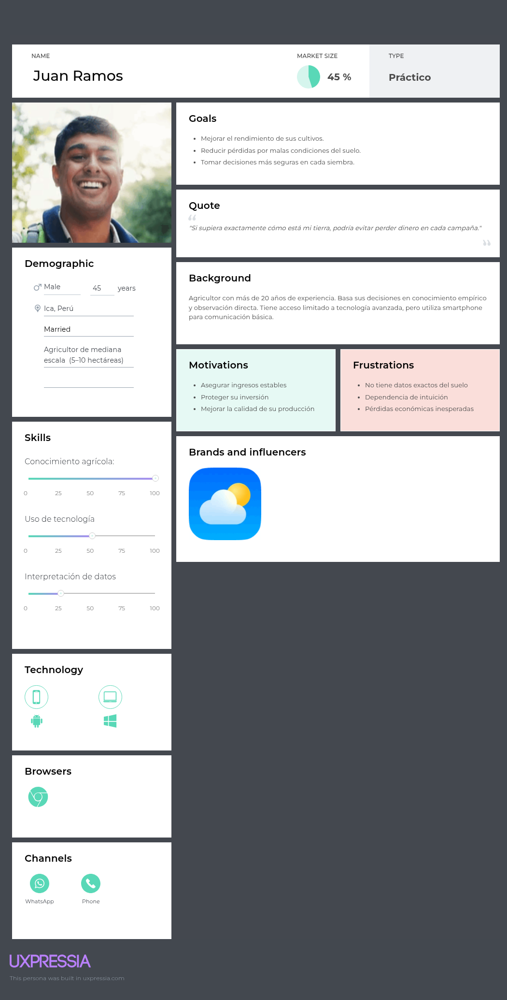

**Segmento 2: Proveedor de insumos**

  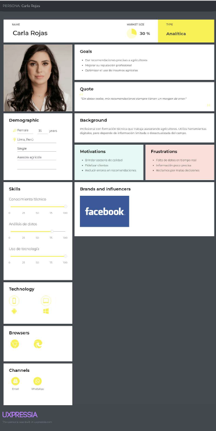

**Segmento 3: Cliente final**

  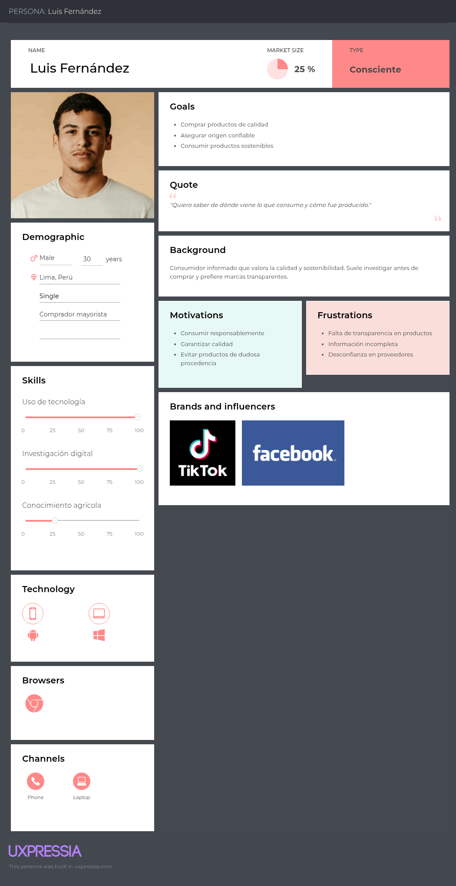

### 2.3.2. User Task Matrix

La User Task Matrix compara las tareas que cada segmento realiza hoy
para alcanzar sus objetivos, sin considerar la existencia de la solución
(es decir, actividades del negocio y no funcionalidades de software).
Las tareas se identificaron a partir de las entrevistas y se valoraron
según su frecuencia (Alta, Media, Baja) y su importancia para cada User
Persona.

| Tarea | Agricultor: Frecuencia | Agricultor: Importancia | Proveedor: Frecuencia | Proveedor: Importancia | Cliente final: Frecuencia | Cliente final: Importancia |
|:---|:---|:---|:---|:---|:---|:---|
| Supervisar el estado del suelo y del cultivo | Alta | Alta | Media | Alta | Baja | Baja |
| Decidir cuándo regar o aplicar fertilizantes | Alta | Alta | Media | Media | Baja | Baja |
| Anticipar riesgos climáticos (heladas, sequías, lluvias) | Alta | Alta | Media | Alta | Baja | Media |
| Detectar plagas o enfermedades en el cultivo | Alta | Alta | Media | Alta | Baja | Baja |
| Planificar la siembra y la rotación de cultivos | Media | Alta | Baja | Media | Baja | Baja |
| Registrar el rendimiento de la producción | Media | Media | Baja | Media | Baja | Baja |
| Asesorar a agricultores sobre insumos y buenas prácticas | Baja | Media | Alta | Alta | Baja | Baja |
| Verificar la procedencia y la calidad de los productos agrícolas | Baja | Media | Alta | Alta | Alta | Alta |
| Comparar precios y opciones antes de comprar o vender | Media | Media | Alta | Alta | Alta | Alta |
| Coordinar visitas, pedidos y entregas con la red de contactos | Media | Media | Alta | Alta | Media | Media |
| Comunicarse por mensajería con clientes, proveedores o familiares | Media | Media | Alta | Alta | Alta | Media |
| Compartir opiniones o recomendaciones sobre productos | Baja | Baja | Media | Media | Alta | Media |

**Análisis de la User Task Matrix:**

Los agricultores realizan con mayor frecuencia e importancia tareas
operativas: supervisar el suelo, decidir el riego y anticipar riesgos
climáticos o plagas, porque de ello dependen directamente sus cosechas.
Los proveedores destacan en tareas comerciales y de asesoría, como
verificar la calidad de los productos, comparar opciones y coordinar
visitas y entregas, lo que corresponde a un uso más estratégico de la
información. Los clientes finales realizan con menor frecuencia tareas
de producción, pero otorgan alta importancia a verificar la procedencia
y calidad de lo que compran, comparar alternativas y compartir
recomendaciones. En común, los tres segmentos necesitan comunicarse y
comparar información antes de tomar decisiones, lo que respalda la
propuesta de valor de TerraTech: información objetiva del cultivo
disponible desde el dispositivo móvil.

### 2.3.3. User Journey Mapping

Los User Journey Maps describen el recorrido de extremo a extremo que
cada User Persona sigue actualmente (situación As-Is), antes de contar
con TerraTech. Estos mapas, elaborados en UXPressia y vinculados con la
ficha de su respectivo User Persona, permiten reconocer los puntos de
dolor y las oportunidades de mejora que la aplicación móvil debe
atender.

**Segmento 1: Agricultor**

El mapa de Marcelino muestra el recorrido que sigue en su cultivo de
zanahoria en Huánuco para revisar el estado del suelo y decidir cuándo
regar o fertilizar. Al no contar con mediciones objetivas, depende de la
inspección visual y de su experiencia, lo que le genera incertidumbre
frente a cambios climáticos inesperados y un importante esfuerzo físico
al recorrer el terreno.

  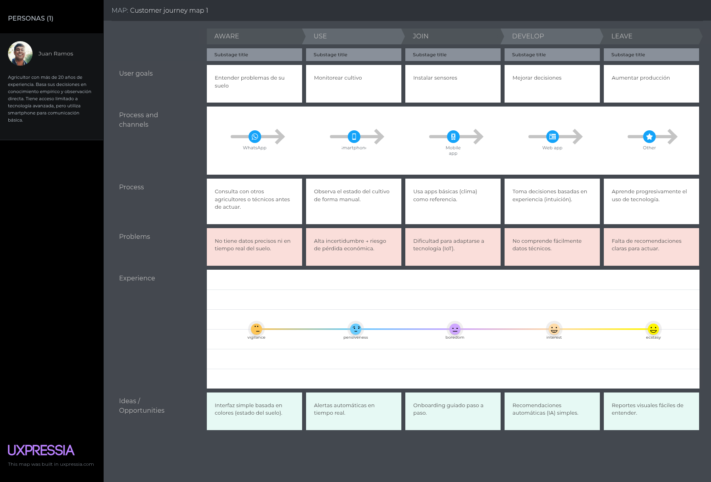

**Segmento 2: Proveedor de insumos**

El mapa de Karim refleja el proceso de asesoría que realiza en Cañete
para recomendar insumos a los agricultores. El recorrido combina visitas
presenciales con su experiencia previa, pero la ausencia de datos reales
del suelo genera recomendaciones poco precisas, reclamos y pérdida de
confianza de sus clientes.

  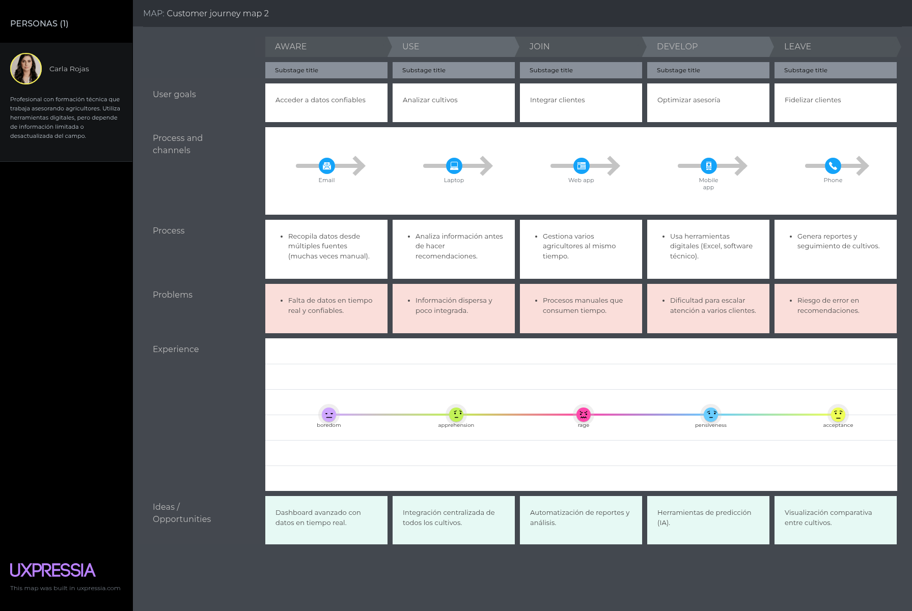

**Segmento 3: Cliente final**

El mapa de Luciana describe su proceso de compra de frutas y verduras en
La Molina. Aunque valora la frescura, el precio y la apariencia del
producto, no dispone de información confiable sobre el origen ni las
prácticas de cultivo, por lo que decide con información incompleta y
desconfianza.

  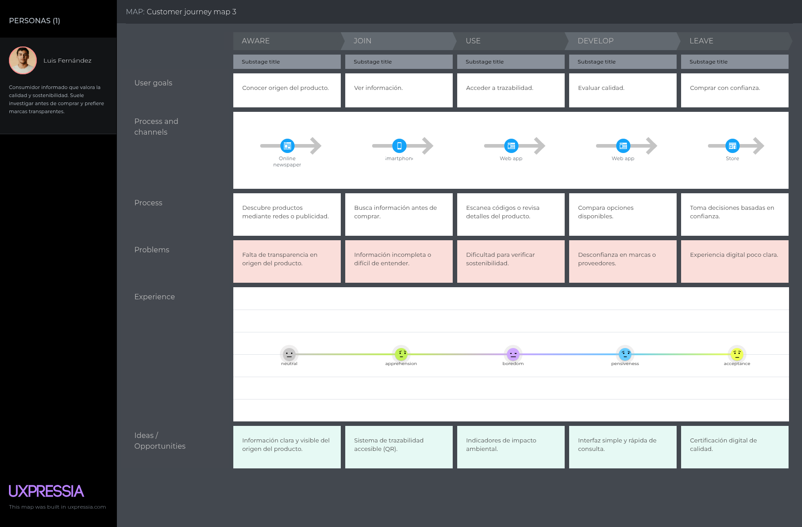

### 2.3.4. Empathy Mapping

Los Empathy Maps profundizan en lo que cada User Persona piensa, siente,
ve, escucha, dice y hace en su contexto cotidiano. Fueron elaborados en
UXPressia a partir de las observaciones y respuestas obtenidas en las
entrevistas, identificando también sus principales pains y gains.

**Segmento 1: Agricultor**

En el mapa de Marcelino se observa una permanente preocupación por las
heladas y la posible pérdida de su cosecha, así como el cansancio que le
genera recorrer el terreno para palpar la humedad. Escucha consejos de
agricultores veteranos y siente temor inicial hacia la tecnología, pero
también desea mayor certeza para mejorar su productividad. Sus pains son
la falta de información precisa y el esfuerzo físico; sus gains, la
tranquilidad de anticiparse al clima y proteger su inversión.

  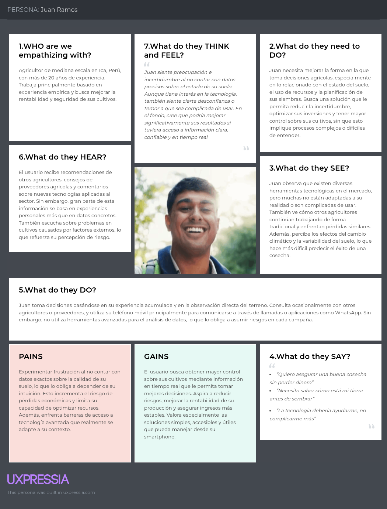

**Segmento 2: Proveedor de insumos**

El mapa de Karim evidencia frustración por las recomendaciones
imprecisas y la necesidad de recuperar credibilidad frente a los
agricultores. Ve clientes con problemas de suelo y competencia en el
mercado, escucha reclamos y comentarios de otros asesores, y basa su
trabajo en visitas a campo y experiencia. Sus pains son la falta de
datos objetivos y la pérdida de clientes; sus gains, fidelizar a los
agricultores y aumentar sus ventas con asesorías más acertadas.

  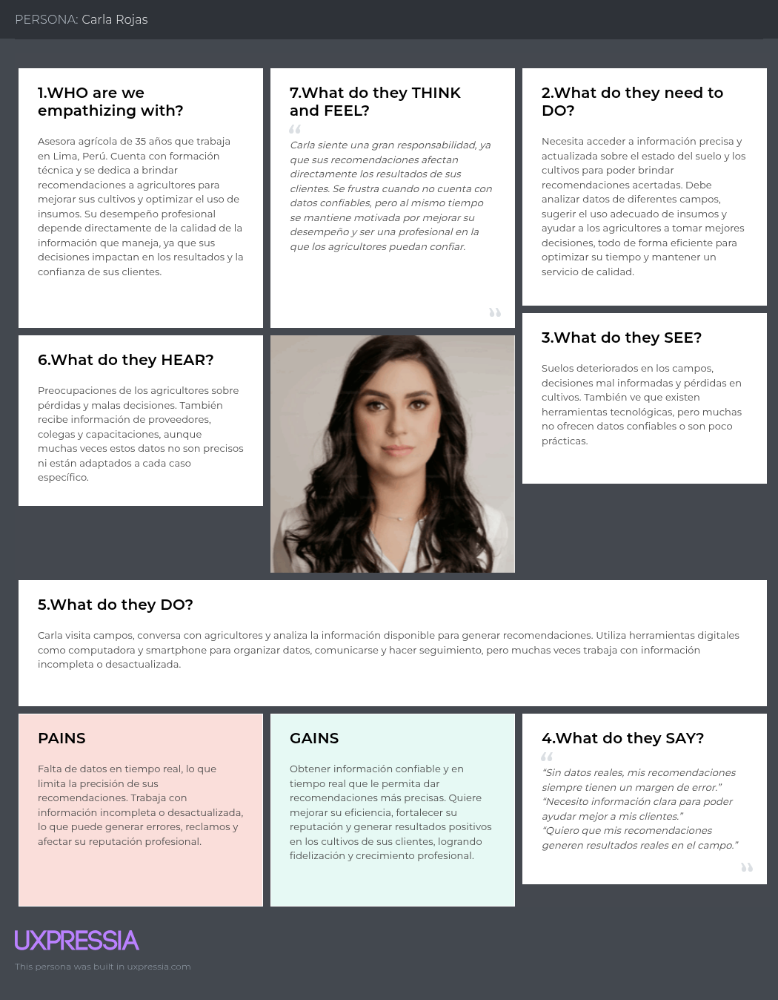

**Segmento 3: Cliente final**

El mapa de Luciana refleja el deseo de transparencia y la desconfianza
que le generan las etiquetas confusas o la falta de información sobre el
producto. Escucha tendencias de alimentación saludable y testimonios de
otros compradores, y suele buscar referencias en su teléfono antes de
decidir por precio y apariencia. Sus pains son la dificultad para
verificar el origen y la calidad; sus gains, acceder a productos
saludables y reconocer prácticas sostenibles con mayor confianza.

  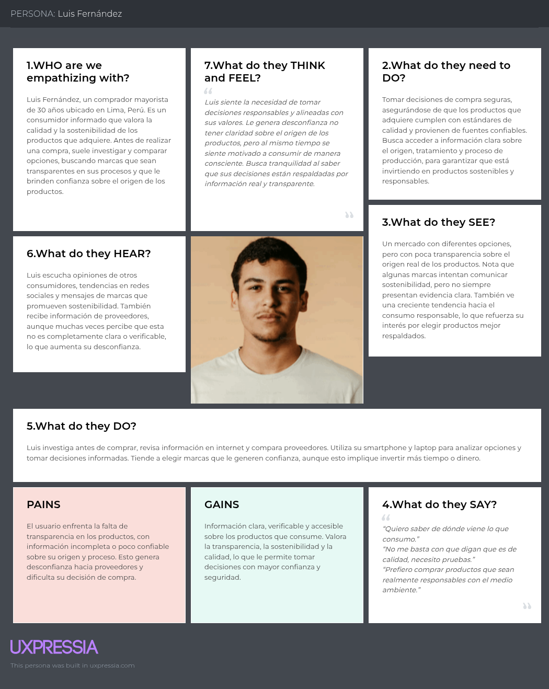

### 2.3.5. Big Picture EventStorming

El equipo realizó una sesión colaborativa de Big Picture EventStorming
en Miro con el propósito de comprender el dominio del negocio agrícola
de TerraTech a alto nivel. La sesión se centró en el flujo de negocio
real, desde la preparación de la tierra hasta la comercialización del
producto, identificando los eventos significativos del ciclo de cultivo,
los actores del ecosistema y las reglas que determinan el comportamiento
del sistema.

**Eventos de dominio (domain events):**

- *Soil Prepared*: la tierra quedó preparada para la siembra.
- *Crop Planted*: el cultivo fue sembrado.
- *Soil Moisture Changed*: cambió la humedad del suelo.
- *Nutrient Level Changed*: cambió el nivel de nutrientes.
- *Irrigation Applied*: se aplicó riego.
- *Fertilizer Applied*: se aplicó fertilizante.
- *Weather Alert Received*: se recibió una alerta climática.
- *Crop Growth Stage Updated*: se actualizó la etapa de crecimiento.
- *Pest Detected*: se detectó una plaga.
- *Crop Harvested*: se cosechó el cultivo.
- *Yield Recorded*: se registró el rendimiento.
- *Product Listed in Catalog*: el producto quedó disponible en el
  catálogo.
- *Product Information Consulted*: el cliente consultó la información
  pública del producto.
- *Traceability QR Generated*: se generó el código QR de trazabilidad.

**Actores:**

- *Farmer (agricultor)*: prepara, siembra, riega, fertiliza y cosecha.
- *Soil (suelo)*: actor pasivo que origina los cambios de humedad y
  nutrientes.
- *Weather (clima)*: actor externo que genera las alertas climáticas.
- *Advisor / Supplier (asesor / proveedor)*: recomienda insumos a partir
  de los datos del suelo.
- *End Customer (cliente final)*: compra productos y verifica su
  trazabilidad.

**Políticas de negocio:**

- Cuando la humedad del suelo cae por debajo del 30%, se dispara una
  recomendación de riego.
- Cuando el nitrógeno desciende por debajo de 20 ppm, se dispara una
  recomendación de fertilización.
- Cuando se detecta una plaga, se dispara una alerta de control
  fitosanitario.
- Cuando el cultivo se cosecha, se actualizan el inventario y los
  registros de rendimiento.
- Cuando un producto se publica, se genera su código QR de trazabilidad.

  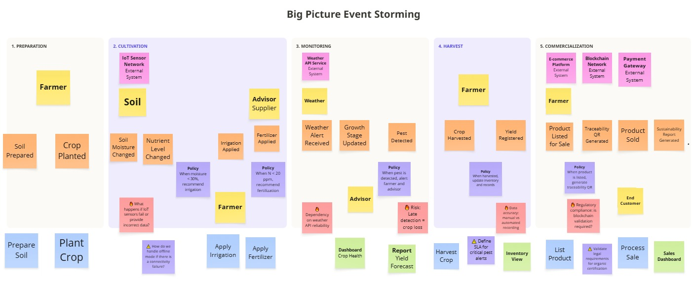

### 2.3.6. Ubiquitous Language

El siguiente glosario reúne los términos del dominio de negocio de
TerraTech, alineados con los bounded contexts definidos en 2.6. Los
términos se presentan en inglés, con su equivalente en español, y su
definición en español, evitando ambigüedades en la comunicación entre el
equipo y los actores involucrados.

**Identity & Access Management**

| Term (English) | Término (Español) | Definición |
|:---|:---|:---|
| User | Usuario | Persona que interactúa con la aplicación mediante una cuenta propia. |
| Credentials | Credenciales | Datos de acceso (correo y contraseña) que permiten autenticar al usuario. |
| Sign-Up | Registro | Proceso mediante el cual una persona crea una cuenta en la aplicación. |
| Sign-In | Inicio de sesión | Proceso de autenticación que valida las credenciales del usuario. |
| Session | Sesión | Periodo durante el cual el usuario autenticado mantiene acceso a la aplicación. |

**Analytics Management**

| Term (English) | Término (Español) | Definición |
|:---|:---|:---|
| Report | Reporte | Resumen de métricas calculadas sobre el comportamiento de un dispositivo o cultivo. |
| Metric | Métrica | Valor cuantificable que describe el desempeño del cultivo o del dispositivo. |
| Mean Value | Valor promedio | Promedio estadístico de las mediciones de un periodo determinado. |
| Variance | Varianza | Medida de dispersión de las mediciones respecto a su promedio. |
| Standard Deviation | Desviación estándar | Medida de variabilidad de las mediciones de un periodo. |
| Technical Interpretation | Interpretación técnica | Conclusión, en lenguaje natural, sobre el significado de los datos analizados. |

**Monitoring Management**

| Term (English) | Término (Español) | Definición |
|:---|:---|:---|
| Field | Parcela / campo | Extensión de terreno cultivada que el agricultor administra. |
| Device | Dispositivo / sensor | Equipo instalado en la parcela que mide las condiciones del suelo. |
| Soil Type | Tipo de suelo | Clasificación del suelo de una parcela. |
| Field Size | Extensión de la parcela | Superficie del campo expresada en metros cuadrados. |
| Location | Ubicación | Coordenadas geográficas donde se encuentra la parcela. |
| Device Status | Estado del dispositivo | Condición operativa del dispositivo (en línea, fuera de línea, batería baja). |
| Last Sync | Última sincronización | Momento en que el dispositivo envió datos por última vez. |

**Stock Management**

| Term (English) | Término (Español) | Definición |
|:---|:---|:---|
| Inventory | Inventario | Registro de los insumos que un usuario tiene disponibles. |
| Product | Producto | Insumo agrícola que se comercializa o se almacena. |
| Stock | Existencias | Cantidad disponible de un producto. |
| Stock Quantity | Cantidad en stock | Número de unidades disponibles de un producto. |
| Warehouse Location | Ubicación en almacén | Lugar físico donde se resguarda el producto. |

**Notification Management**

| Term (English) | Término (Español) | Definición |
|:---|:---|:---|
| Notification | Notificación | Mensaje generado por el sistema para informar al usuario. |
| Alert | Alerta | Notificación prioritaria sobre una condición crítica del cultivo o del dispositivo. |
| Read | Leída | Estado que indica que el usuario ya revisó la notificación. |
| Notification Channel | Canal de notificación | Medio por el que se entrega la notificación (aplicación móvil o correo electrónico). |

## 2.4. Requirements Specification

A partir del análisis de entrevistas, del Needfinding y de las
decisiones de diseño táctico, el equipo especifica los requisitos del
producto digital TerraTech. Las historias se organizan en Epics
funcionales que se relacionan, cuando corresponde, con los bounded
contexts documentados en 2.6, y sus criterios de aceptación se redactan
en formato Given–When–Then, en presente y tercera persona, sin
referencias a detalles de interfaz y de forma verificable.

### 2.4.1. User Stories

La siguiente tabla resume los Epics identificados y las historias que
agrupa cada uno. La prioridad se expresa como Alta, Media o Baja según
el valor para el negocio y su dependencia con el resto de
funcionalidades.

| EPIC ID | Nombre | Bounded Context / categoría | User Stories |
|:---|:---|:---|:---|
| EPIC01 | Landing Page & Marketing | Capacidad de marketing (Landing Page) | US01, US02, US03, US04, US05 |
| EPIC02 | Autenticación y Gestión de Usuarios (IAM) | Identity & Access Management | US06, US07, US08, US09 |
| EPIC03 | Dashboard de Monitoreo en Tiempo Real (Monitoring) | Monitoring Management | US10, US11, US12 |
| EPIC04 | Mapa de Fertilidad (Monitoring) | Monitoring Management | US13, US14 |
| EPIC05 | Motor de Recomendaciones (Monitoring) | Monitoring Management | US15, US16 |
| EPIC06 | Gestión de Sensores (Monitoring) | Monitoring Management | US17, US18 |
| EPIC07 | API RESTful | Transversal (Shared) | US19, US20, US21 |
| EPIC08 | Integración con Servicios Externos | Transversal (Shared) | US22, US23 |
| EPIC09 | Stock Management | Stock Management | US24, US25, US26 |
| EPIC10 | Notification Management | Notification Management | US27, US28, US29, US30, US31, US32 |
| EPIC11 | Community & Reputation | Capacidad posterior (sin BC modelado) | US33, US34, US35, US36 |
| EPIC12 | Analytics & Catalog | Analytics Management (Catalog como capacidad posterior) | US37, US38, US39, US40, US41 |
| EPIC13 | Configuración y Despliegue (Technical Stories) | Transversal (infraestructura) | TS01–TS05, TS08–TS11 |
| EPIC14 | Investigación y Viabilidad (Spike Stories) | Transversal (investigación) | SP01, SP02, SP03 |

#### EPIC01: Landing Page & Marketing

<table width="100%" border="1" cellpadding="8" cellspacing="0" style="border-collapse: collapse; text-align: left; margin-bottom: 24px;">
  <thead>
    <tr style="text-align: center; font-weight: bold; background-color: #f2f2f2;">
      <th style="width: 20%;">Story ID</th>
      <th style="width: 35%;">User</th>
      <th style="width: 20%;">Priority</th>
      <th style="width: 25%;">Epic</th>
    </tr>
  </thead>
  <tbody>
       
<tr>
      <td style="text-align: center;">US01</td>
      <td>Visitante</td>
      <td style="text-align: center;">Alta</td>
      <td>EPIC01 - Landing Page & Marketing</td>
    </tr>

   
   <tr>
     <th style="text-align: center; background-color: #f9f9f9; font-weight: bold;">Title</th>
     <td colspan="3">Visualización del mensaje de valor</td>
</tr>

    
<tr style="text-align: center; font-weight: bold; background-color: #f2f2f2;">
<td colspan="4">Description</td>
</tr>

    
   <tr>
     <td colspan="4">
       <b>Como</b> visitante, 
       <b>deseo</b> comprender rápidamente qué ofrece TerraTech para evaluar si la solución responde a mi necesidad.
     </td>
</tr>

    
   <tr style="text-align: center; font-weight: bold; background-color: #f2f2f2;">
     <td colspan="4">Acceptance Criteria</td>
</tr>

    
   <tr>
     <td colspan="4">
       <b>Scenario 1: Visualización del mensaje principal</b> 
       <b>Given</b> el visitante accede a la URL del Landing Page 
       <b>When</b> la página termina de cargar 
       <b>Then</b> se presenta el mensaje de valor de TerraTech y una acción para solicitar una demostración 
       <b>And</b> la acción de solicitud está disponible desde la página principal sin necesidad de desplazamiento 
        
       <b>Scenario 2: Adaptación a pantallas pequeñas</b> 
       <b>Given</b> el visitante accede desde un dispositivo móvil de 320px de ancho 
       <b>When</b> la página se renderiza 
       <b>Then</b> el contenido principal se adapta verticalmente sin desbordamiento horizontal
</td>
    </tr>
  </tbody>
</table>
<table width="100%" border="1" cellpadding="8" cellspacing="0" style="border-collapse: collapse; text-align: left; margin-bottom: 24px;">
   
  <thead>
    <tr style="text-align: center; font-weight: bold; background-color: #f2f2f2;">
      <th style="width: 20%;">Story ID</th>
      <th style="width: 35%;">User</th>
      <th style="width: 20%;">Priority</th>
      <th style="width: 25%;">Epic</th>
    </tr>
  </thead>
  <tbody>
     
<tr>
      <td style="text-align: center;">US02</td>
      <td>Visitante</td>
      <td style="text-align: center;">Media</td>
      <td>EPIC01 - Landing Page & Marketing</td>
    </tr>

 
<tr>
<th style="text-align: center; background-color: #f9f9f9; font-weight: bold;">Title</th>
<td colspan="3">Conocimiento de las características de la solución</td>
</tr>
 
<tr style="text-align: center; font-weight: bold; background-color: #f2f2f2;">
<td colspan="4">Description</td>
</tr>
 
<tr>
<td colspan="4">
<b>Como</b> visitante, 
<b>deseo</b> conocer las características principales de TerraTech para determinar si satisface mis necesidades.
</td>
</tr>
 
<tr style="text-align: center; font-weight: bold; background-color: #f2f2f2;">
<td colspan="4">Acceptance Criteria</td>
</tr>
<!-- Fila 7: Contenido Acceptance Criteria -->
<tr>
<td colspan="4">
<b>Scenario 1: Presentación de características</b> 
<b>Given</b> el visitante ha cargado el Landing Page 
<b>When</b> consulta la sección de características 
<b>Then</b> se describen exactamente tres características: “Sensor de Humedad”, “Sensor de Nutrientes” y “Alertas en Tiempo Real” 
<b>And</b> cada característica incluye un título y una descripción de máximo 150 caracteres
</td>
</tr>
  </tbody>
</table>
<table width="100%" border="1" cellpadding="8" cellspacing="0" style="border-collapse: collapse; text-align: left; margin-bottom: 24px;">
   
  <thead>
    <tr style="text-align: center; font-weight: bold; background-color: #f2f2f2;">
      <th style="width: 20%;">Story ID</th>
      <th style="width: 35%;">User</th>
      <th style="width: 20%;">Priority</th>
      <th style="width: 25%;">Epic</th>
    </tr>
  </thead>
  <tbody>
     
<tr>
<td style="text-align: center;">US03</td>
<td>Visitante</td>
<td style="text-align: center;">Alta</td>
<td>EPIC01 - Landing Page & Marketing</td>
</tr>
 
<tr>
<th style="text-align: center; background-color: #f9f9f9; font-weight: bold;">Title</th>
<td colspan="3">Solicitud de demostración</td>
</tr>
 
<tr style="text-align: center; font-weight: bold; background-color: #f2f2f2;">
<td colspan="4">Description</td>
</tr>
 
<tr>
<td colspan="4">
<b>Como</b> visitante, 
<b>deseo</b> solicitar una demostración para recibir información personalizada sobre TerraTech.
</td>
</tr>
 
<tr style="text-align: center; font-weight: bold; background-color: #f2f2f2;">
<td colspan="4">Acceptance Criteria</td>
</tr>
<!-- Fila 7: Contenido Acceptance Criteria -->
<tr>
<td colspan="4">
<b>Scenario 1: Envío exitoso</b> 
<b>Given</b> el visitante completa los campos Nombre, Email, Teléfono y Tamaño de terreno en hectáreas 
<b>When</b> confirma el envío de la solicitud 
<b>Then</b> el sistema registra la solicitud y muestra una confirmación de recepción 
<b>And</b> los campos del formulario quedan vacíos 
 
<b>Scenario 2: Campos obligatorios incompletos</b> 
<b>Given</b> el visitante omite el campo Email 
<b>When</b> intenta enviar la solicitud 
<b>Then</b> el sistema informa que el correo electrónico es obligatorio y no registra la solicitud 
 
<b>Scenario 3: Formato de correo inválido</b> 
<b>Given</b> el visitante ingresa un correo con formato inválido 
<b>When</b> intenta enviar la solicitud 
<b>Then</b> el sistema informa que el correo electrónico no es válido y no registra la solicitud
</td>
</tr>
  </tbody>
</table>
<table width="100%" border="1" cellpadding="8" cellspacing="0" style="border-collapse: collapse; text-align: left; margin-bottom: 24px;">
   
  <thead>
    <tr style="text-align: center; font-weight: bold; background-color: #f2f2f2;">
      <th style="width: 20%;">Story ID</th>
      <th style="width: 35%;">User</th>
      <th style="width: 20%;">Priority</th>
      <th style="width: 25%;">Epic</th>
    </tr>
  </thead>
  <tbody>
     
<tr>
      <td style="text-align: center;">US04</td>
     <td>Visitante</td>
     <td style="text-align: center;">Baja</td>
     <td>EPIC01 - Landing Page & Marketing</td>
   </tr>

    
   <tr>
     <th style="text-align: center; background-color: #f9f9f9; font-weight: bold;">Title</th>
     <td colspan="3">Consulta de términos y condiciones</td>
   </tr>

    
   <tr style="text-align: center; font-weight: bold; background-color: #f2f2f2;">
     <td colspan="4">Description</td>
   </tr>

    
   <tr>
     <td colspan="4">
       <b>Como</b> visitante, 
       <b>deseo</b> leer los términos y condiciones del servicio para conocer mis derechos y obligaciones al usar TerraTech.
     </td>
   </tr>

    
   <tr style="text-align: center; font-weight: bold; background-color: #f2f2f2;">
     <td colspan="4">Acceptance Criteria</td>
   </tr>

<tr>
     <td colspan="4">
       <b>Scenario 1: Acceso desde el Landing Page</b> 
       <b>Given</b> el visitante se encuentra en el Landing Page 
       <b>When</b> solicita consultar los términos y condiciones 
       <b>Then</b> el sistema presenta el documento completo con su fecha de última actualización 
        
       <b>Scenario 2: Acceso desde la aplicación móvil</b> 
       <b>Given</b> el usuario ha iniciado sesión en la aplicación móvil 
       <b>When</b> solicita consultar los términos y condiciones 
       <b>Then</b> el sistema presenta el documento sin abandonar la aplicación
     </td>
   </tr>
  </tbody>
</table>
<table width="100%" border="1" cellpadding="8" cellspacing="0" style="border-collapse: collapse; text-align: left; margin-bottom: 24px;">
   
  <thead>
    <tr style="text-align: center; font-weight: bold; background-color: #f2f2f2;">
      <th style="width: 20%;">Story ID</th>
      <th style="width: 35%;">User</th>
      <th style="width: 20%;">Priority</th>
      <th style="width: 25%;">Epic</th>
    </tr>
  </thead>
  <tbody>
     
<tr>
      <td style="text-align: center;">US05</td>
      <td>Visitante</td>
      <td style="text-align: center;">Media</td>
      <td>EPIC01 - Landing Page & Marketing</td>
    </tr>

    
   <tr>
     <th style="text-align: center; background-color: #f9f9f9; font-weight: bold;">Title</th>
     <td colspan="3">Información del proyecto y del equipo</td>
   </tr>

    
   <tr style="text-align: center; font-weight: bold; background-color: #f2f2f2;">
     <td colspan="4">Description</td>
   </tr>

    
   <tr>
     <td colspan="4">
       <b>Como</b> visitante, 
       <b>deseo</b> conocer el propósito del proyecto y al equipo responsable para generar confianza en la solución.
     </td>
   </tr>

    
   <tr style="text-align: center; font-weight: bold; background-color: #f2f2f2;">
     <td colspan="4">Acceptance Criteria</td>
   </tr>

<tr>
     <td colspan="4">
       <b>Scenario 1: Información del proyecto</b> 
       <b>Given</b> el visitante accede al Landing Page 
       <b>When</b> consulta la sección sobre el proyecto 
       <b>Then</b> se presenta la misión y visión de TerraTech junto con el nombre de la startup NovaTech 
        
       <b>Scenario 2: Información del equipo</b> 
       <b>Given</b> el visitante consulta la sección del equipo 
       <b>Then</b> se muestran las fotografías, nombres completos, roles y especialidad de los integrantes del equipo de desarrollo
     </td>
   </tr>
  </tbody>
</table>

#### EPIC02: Autenticación y Gestión de Usuarios (IAM)

<table width="100%" border="1" cellpadding="8" cellspacing="0" style="border-collapse: collapse; text-align: left; margin-bottom: 24px;">
   
  <thead>
    <tr style="text-align: center; font-weight: bold; background-color: #f2f2f2;">
      <th style="width: 20%;">Story ID</th>
      <th style="width: 35%;">User</th>
      <th style="width: 20%;">Priority</th>
      <th style="width: 25%;">Epic</th>
    </tr>
  </thead>
  <tbody>
     
<tr>
      <td style="text-align: center;">US06</td>
      <td>Agricultor</td>
      <td style="text-align: center;">Alta</td>
     <td>EPIC02 - Autenticación y Gestión de Usuarios (IAM)</td>
   </tr>

    
   <tr>
     <th style="text-align: center; background-color: #f9f9f9; font-weight: bold;">Title</th>
     <td colspan="3">Registro de nuevo usuario</td>
   </tr>

    
   <tr style="text-align: center; font-weight: bold; background-color: #f2f2f2;">
     <td colspan="4">Description</td>
   </tr>

    
   <tr>
     <td colspan="4">
       <b>Como</b> agricultor, 
       <b>deseo</b> crear una cuenta en TerraTech para acceder a la aplicación y configurar mis parcelas.
     </td>
   </tr>

    
   <tr style="text-align: center; font-weight: bold; background-color: #f2f2f2;">
     <td colspan="4">Acceptance Criteria</td>
   </tr>

<tr>
     <td colspan="4">
       <b>Scenario 1: Registro exitoso</b> 
       <b>Given</b> el usuario accede al registro 
       <b>When</b> ingresa Nombre (mínimo 2 caracteres), Email válido y Contraseña (mínimo 6 caracteres) confirmada correctamente 
       <b>And</b> confirma el registro 
       <b>Then</b> se crea la cuenta con rol “Agricultor” 
       <b>And</b> el sistema envía un correo de verificación con enlace válido por 24 horas 
        
       <b>Scenario 2: Correo ya registrado</b> 
       <b>Given</b> el usuario ingresa un correo que ya existe 
       <b>When</b> confirma el registro 
       <b>Then</b> el sistema informa que el correo ya está registrado y ofrece la opción de recuperar la contraseña 
        
       <b>Scenario 3: Contraseñas no coinciden</b> 
       <b>Given</b> el usuario ingresa contraseñas distintas 
       <b>When</b> confirma el registro 
       <b>Then</b> el sistema informa que las contraseñas no coinciden y no crea la cuenta
     </td>
   </tr>
  </tbody>
</table>
<table width="100%" border="1" cellpadding="8" cellspacing="0" style="border-collapse: collapse; text-align: left; margin-bottom: 24px;">
   
  <thead>
    <tr style="text-align: center; font-weight: bold; background-color: #f2f2f2;">
      <th style="width: 20%;">Story ID</th>
      <th style="width: 35%;">User</th>
      <th style="width: 20%;">Priority</th>
      <th style="width: 25%;">Epic</th>
    </tr>
  </thead>
  <tbody>
     
<tr>
      <td style="text-align: center;">US07</td>
      <td>Usuario registrado</td>
      <td style="text-align: center;">Alta</td>
      <td>EPIC02 - Autenticación y Gestión de Usuarios (IAM)</td>
    </tr>

     
<tr>
      <th style="text-align: center; background-color: #f9f9f9; font-weight: bold;">Title</th>
      <td colspan="3">Inicio de sesión</td>
    </tr>

     
<tr style="text-align: center; font-weight: bold; background-color: #f2f2f2;">
      <td colspan="4">Description</td>
    </tr>

 <tr>
      <td colspan="4">
        <b>Como</b> usuario registrado, 
        <b>deseo</b> iniciar sesión con mis credenciales para acceder a mi información y a los datos de mis cultivos.
      </td>
    </tr>

 
<tr style="text-align: center; font-weight: bold; background-color: #f2f2f2;">
      <td colspan="4">Acceptance Criteria</td>
    </tr>

 
<tr>
      <td colspan="4">
        <b>Scenario 1: Inicio de sesión exitoso</b> 
        <b>Given</b> el usuario se encuentra en la pantalla de inicio de sesión 
        <b>When</b> ingresa email y contraseña válidos y verificados 
        <b>And</b> confirma el inicio de sesión 
        <b>Then</b> el sistema emite un token JWT válido por 8 horas 
        <b>And</b> el usuario accede a su información personalizada 
         
        <b>Scenario 2: Credenciales incorrectas</b> 
        <b>Given</b> el usuario ingresa una contraseña incorrecta 
        <b>When</b> confirma el inicio de sesión 
        <b>Then</b> el sistema informa que las credenciales son inválidas y no emite token 
         
        <b>Scenario 3: Correo no verificado</b> 
        <b>Given</b> el usuario se registró pero no verificó su correo 
        <b>When</b> intenta iniciar sesión con credenciales correctas 
        <b>Then</b> el sistema indica que debe verificar su correo electrónico y ofrece reenviar el enlace de verificación
      </td>
    </tr>
  </tbody>
</table>

<table width="100%" border="1" cellpadding="8" cellspacing="0" style="border-collapse: collapse; text-align: left; margin-bottom: 24px;">
  <!-- Fila 1: Encabezados superiores -->
  <thead>
    <tr style="text-align: center; font-weight: bold; background-color: #f2f2f2;">
      <th style="width: 20%;">Story ID</th>
      <th style="width: 35%;">User</th>
      <th style="width: 20%;">Priority</th>
      <th style="width: 25%;">Epic</th>
    </tr>
  </thead>
  <tbody>
    <!-- Fila 2: Valores superiores -->
    <tr>
      <td style="text-align: center;">US08</td>
      <td>Usuario registrado</td>
      <td style="text-align: center;">Media</td>
      <td>EPIC02 - Autenticación y Gestión de Usuarios (IAM)</td>
    </tr>

    
<tr>
      <th style="text-align: center; background-color: #f9f9f9; font-weight: bold;">Title</th>
      <td colspan="3">Recuperación de contraseña</td>
    </tr>

    
<tr style="text-align: center; font-weight: bold; background-color: #f2f2f2;">
      <td colspan="4">Description</td>
    </tr>

    
<tr>
      <td colspan="4">
        <b>Como</b> usuario registrado, 
        <b>deseo</b> recuperar mi contraseña olvidada para volver a acceder a mi cuenta.
      </td>
    </tr>

    
<tr style="text-align: center; font-weight: bold; background-color: #f2f2f2;">
      <td colspan="4">Acceptance Criteria</td>
    </tr>

    
<tr>
      <td colspan="4">
        <b>Scenario 1: Envío del enlace de recuperación</b> 
        <b>Given</b> el usuario solicita recuperar su contraseña 
        <b>When</b> ingresa su correo registrado y confirma el envío 
        <b>Then</b> el sistema envía un enlace con token único válido por 1 hora 
        <b>And</b> informa que debe revisar su correo para restablecer la contraseña 
         
        <b>Scenario 2: Restablecimiento exitoso</b> 
        <b>Given</b> el usuario accede al enlace de recuperación con un token válido 
        <b>When</b> ingresa y confirma la nueva contraseña 
        <b>Then</b> el sistema actualiza la contraseña almacenada de forma cifrada 
        <b>And</b> informa que la contraseña fue actualizada 
         
        <b>Scenario 3: Token expirado o inválido</b> 
        <b>Given</b> el usuario accede a un enlace de recuperación con token inválido o expirado 
        <b>When</b> intenta restablecer su contraseña 
        <b>Then</b> el sistema informa que el enlace expiró y permite solicitar uno nuevo
      </td>
    </tr>
  </tbody>
</table>
<table width="100%" border="1" cellpadding="8" cellspacing="0" style="border-collapse: collapse; text-align: left; margin-bottom: 24px;">
   
  <thead>
    <tr style="text-align: center; font-weight: bold; background-color: #f2f2f2;">
      <th style="width: 20%;">Story ID</th>
      <th style="width: 35%;">User</th>
      <th style="width: 20%;">Priority</th>
      <th style="width: 25%;">Epic</th>
    </tr>
  </thead>
  <tbody>
     
<tr>
      <td style="text-align: center;">US09</td>
      <td>Agricultor</td>
      <td style="text-align: center;">Media</td>
      <td>EPIC02 - Autenticación y Gestión de Usuarios (IAM)</td>
    </tr>

 
<tr>
<th style="text-align: center; background-color: #f9f9f9; font-weight: bold;">Title</th>
<td colspan="3">Gestión del perfil de usuario</td>
</tr>
 
<tr style="text-align: center; font-weight: bold; background-color: #f2f2f2;">
<td colspan="4">Description</td>
</tr>
 
<tr>
<td colspan="4">
<b>Como</b> agricultor, 
<b>deseo</b> consultar y actualizar mi perfil para mantener vigente mi información personal y la de mi parcela.
</td>
</tr>
 
<tr style="text-align: center; font-weight: bold; background-color: #f2f2f2;">
<td colspan="4">Acceptance Criteria</td>
</tr>
<!-- Fila 7: Contenido Acceptance Criteria -->
<tr>
<td colspan="4">
<b>Scenario 1: Consulta del perfil</b> 
<b>Given</b> el usuario ha iniciado sesión 
<b>When</b> accede a su perfil 
<b>Then</b> el sistema muestra Nombre, Email (no editable), Teléfono, Ubicación y Tamaño del terreno, junto con la fecha de registro 
 
<b>Scenario 2: Actualización exitosa</b> 
<b>Given</b> el usuario modifica su número de teléfono 
<b>When</b> confirma la actualización 
<b>Then</b> el sistema guarda el nuevo valor y confirma la actualización 
 
<b>Scenario 3: Validación del tamaño del terreno</b> 
<b>Given</b> el usuario ingresa un tamaño de terreno negativo 
<b>When</b> confirma la actualización 
<b>Then</b> el sistema informa que el tamaño debe ser mayor a 0 y no actualiza el perfil
</td>
</tr>
  </tbody>
</table>

#### EPIC03: Dashboard de Monitoreo en Tiempo Real (Monitoring)

<table width="100%" border="1" cellpadding="8" cellspacing="0" style="border-collapse: collapse; text-align: left; margin-bottom: 24px;">
   
  <thead>
    <tr style="text-align: center; font-weight: bold; background-color: #f2f2f2;">
      <th style="width: 20%;">Story ID</th>
      <th style="width: 35%;">User</th>
      <th style="width: 20%;">Priority</th>
      <th style="width: 25%;">Epic</th>
    </tr>
  </thead>
  <tbody>
     
<tr>
      <td style="text-align: center;">US10</td>
      <td>Agricultor</td>
      <td style="text-align: center;">Alta</td>
      <td>EPIC03 - Dashboard de Monitoreo en Tiempo Real (Monitoring)</td>
    </tr>

     
<tr>
      <th style="text-align: center; background-color: #f9f9f9; font-weight: bold;">Title</th>
      <td colspan="3">Consulta de indicadores clave</td>
    </tr>

     
<tr style="text-align: center; font-weight: bold; background-color: #f2f2f2;">
      <td colspan="4">Description</td>
    </tr>

 <tr>
      <td colspan="4">
        <b>Como</b> agricultor, 
        <b>deseo</b> consultar en tiempo real los valores de humedad, nutrientes y temperatura del suelo para decidir oportunamente el riego y la fertilización.
      </td>
    </tr>

 
<tr style="text-align: center; font-weight: bold; background-color: #f2f2f2;">
      <td colspan="4">Acceptance Criteria</td>
    </tr>

 
<tr>
      <td colspan="4">
        <b>Scenario 1: Consulta inicial</b> 
        <b>Given</b> el agricultor ha iniciado sesión y tiene al menos un sensor asociado 
        <b>When</b> accede al dashboard 
        <b>Then</b> el sistema muestra los valores actuales de humedad (%), nutrientes (N-P-K en ppm) y temperatura del suelo (°C) 
        <b>And</b> indica la fecha y hora de la última actualización de cada valor 
         
        <b>Scenario 2: Actualización automática</b> 
        <b>Given</b> el dashboard está visible y existe conexión con el servicio de datos 
        <b>When</b> el backend recibe una nueva lectura del sensor 
        <b>Then</b> los valores mostrados se actualizan sin intervención del usuario 
         
        <b>Scenario 3: Sensor sin conexión</b> 
        <b>Given</b> un sensor no envía datos durante más de 30 minutos 
        <b>When</b> el sistema actualiza la información 
        <b>Then</b> el sistema advierte que los datos están desactualizados por falta de conexión del sensor
      </td>
    </tr>
  </tbody>
</table>
<table width="100%" border="1" cellpadding="8" cellspacing="0" style="border-collapse: collapse; text-align: left; margin-bottom: 24px;">
   
  <thead>
    <tr style="text-align: center; font-weight: bold; background-color: #f2f2f2;">
      <th style="width: 20%;">Story ID</th>
      <th style="width: 35%;">User</th>
      <th style="width: 20%;">Priority</th>
      <th style="width: 25%;">Epic</th>
    </tr>
  </thead>
  <tbody>
     
<tr>
      <td style="text-align: center;">US11</td>
      <td>Agricultor</td>
      <td style="text-align: center;">Media</td>
      <td>EPIC03 - Dashboard de Monitoreo en Tiempo Real (Monitoring)</td>
    </tr>

     
<tr>
      <th style="text-align: center; background-color: #f9f9f9; font-weight: bold;">Title</th>
      <td colspan="3">Selección de zona o sensor específico</td>
    </tr>

     
<tr style="text-align: center; font-weight: bold; background-color: #f2f2f2;">
      <td colspan="4">Description</td>
    </tr>

 <tr>
      <td colspan="4">
        <b>Como</b> agricultor, 
        <b>deseo</b> seleccionar una parcela o sensor específico para revisar los datos de esa zona de mi cultivo.
      </td>
    </tr>

 
<tr style="text-align: center; font-weight: bold; background-color: #f2f2f2;">
      <td colspan="4">Acceptance Criteria</td>
    </tr>

 
<tr>
      <td colspan="4">
        <b>Scenario 1: Selección de zona</b> 
        <b>Given</b> el agricultor tiene configuradas zonas con nombres 
        <b>When</b> selecciona una zona 
        <b>Then</b> el sistema muestra los indicadores correspondientes a los sensores de esa zona 
         
        <b>Scenario 2: Actualización de indicadores por zona</b> 
        <b>Given</b> el dashboard muestra los datos de una zona 
        <b>When</b> el agricultor selecciona otra zona 
        <b>Then</b> los indicadores y el histórico se actualizan con los datos de la nueva zona 
        <b>And</b> el sistema registra el cambio de zona consultada
      </td>
    </tr>
  </tbody>
</table>
<table width="100%" border="1" cellpadding="8" cellspacing="0" style="border-collapse: collapse; text-align: left; margin-bottom: 24px;">
   
  <thead>
    <tr style="text-align: center; font-weight: bold; background-color: #f2f2f2;">
      <th style="width: 20%;">Story ID</th>
      <th style="width: 35%;">User</th>
      <th style="width: 20%;">Priority</th>
      <th style="width: 25%;">Epic</th>
    </tr>
  </thead>
  <tbody>
     
<tr>
      <td style="text-align: center;">US12</td>
      <td>Agricultor</td>
      <td style="text-align: center;">Media</td>
      <td>EPIC03 - Dashboard de Monitoreo en Tiempo Real (Monitoring)</td>
    </tr>

     
<tr>
      <th style="text-align: center; background-color: #f9f9f9; font-weight: bold;">Title</th>
      <td colspan="3">Consulta del histórico de datos</td>
    </tr>

     
<tr style="text-align: center; font-weight: bold; background-color: #f2f2f2;">
      <td colspan="4">Description</td>
    </tr>

 <tr>
      <td colspan="4">
        <b>Como</b> agricultor, 
        <b>deseo</b> consultar el histórico de humedad de mi cultivo para identificar tendencias y anticipar decisiones.
      </td>
    </tr>

 
<tr style="text-align: center; font-weight: bold; background-color: #f2f2f2;">
      <td colspan="4">Acceptance Criteria</td>
    </tr>

 
<tr>
      <td colspan="4">
        <b>Scenario 1: Rango por defecto</b> 
        <b>Given</b> el agricultor consulta el histórico 
        <b>When</b> el sistema carga la información 
        <b>Then</b> se presentan los valores de humedad de los últimos 7 días 
        <b>And</b> se indica el umbral mínimo configurado como referencia 
         
        <b>Scenario 2: Cambio de rango</b> 
        <b>Given</b> el agricultor consulta el histórico de 7 días 
        <b>When</b> selecciona un rango de 30 días 
        <b>Then</b> el sistema actualiza la información en menos de 2 segundos 
         
        <b>Scenario 3: Detalle de un punto del histórico</b> 
        <b>Given</b> el histórico está visible 
        <b>When</b> el agricultor consulta un punto específico 
        <b>Then</b> el sistema informa la fecha exacta, el valor de humedad y si existió una alerta en esa fecha
      </td>
    </tr>
  </tbody>
</table>

#### EPIC04: Mapa de Fertilidad (Monitoring)

<table width="100%" border="1" cellpadding="8" cellspacing="0" style="border-collapse: collapse; text-align: left; margin-bottom: 24px;">
   
  <thead>
    <tr style="text-align: center; font-weight: bold; background-color: #f2f2f2;">
      <th style="width: 20%;">Story ID</th>
      <th style="width: 35%;">User</th>
      <th style="width: 20%;">Priority</th>
      <th style="width: 25%;">Epic</th>
    </tr>
  </thead>
  <tbody>
     
<tr>
      <td style="text-align: center;">US13</td>
      <td>Agricultor</td>
      <td style="text-align: center;">Media</td>
      <td>EPIC04 - Mapa de Fertilidad (Monitoring)</td>
    </tr>

     
<tr>
      <th style="text-align: center; background-color: #f9f9f9; font-weight: bold;">Title</th>
      <td colspan="3">Identificación de zonas fértiles</td>
    </tr>

     
<tr style="text-align: center; font-weight: bold; background-color: #f2f2f2;">
      <td colspan="4">Description</td>
    </tr>

 <tr>
      <td colspan="4">
        <b>Como</b> agricultor, 
        <b>deseo</b> identificar las zonas más fértiles de mi terreno para planificar la rotación de cultivos y optimizar la siembra.
      </td>
    </tr>

 
<tr style="text-align: center; font-weight: bold; background-color: #f2f2f2;">
      <td colspan="4">Acceptance Criteria</td>
    </tr>

 
<tr>
      <td colspan="4">
        <b>Scenario 1: Visualización de fertilidad por zona</b> 
        <b>Given</b> el agricultor accede a la sección del mapa de fertilidad y existe al menos una zona con datos de sensores 
        <b>When</b> el sistema carga el mapa 
        <b>Then</b> cada zona se representa según su nivel de fertilidad: 
        - Óptimo: humedad mayor a 60% y nutrientes en rango óptimo 
        - Moderado: humedad entre 30% y 60% o nutrientes en rango medio 
        - Crítico: humedad menor a 30% o nutrientes bajos 
        <b>And</b> el agricultor puede consultar el detalle de cada zona 
         
        <b>Scenario 2: Acciones sugeridas por nivel</b> 
        <b>Given</b> el mapa de fertilidad está visible 
        <b>When</b> el agricultor consulta la referencia de niveles 
        <b>Then</b> el sistema presenta, para cada nivel, la acción sugerida correspondiente (mantener el plan actual, monitorear en 12 horas o regar y fertilizar en las próximas 2 horas)
      </td>
    </tr>
  </tbody>
</table>
<table width="100%" border="1" cellpadding="8" cellspacing="0" style="border-collapse: collapse; text-align: left; margin-bottom: 24px;">
   
  <thead>
    <tr style="text-align: center; font-weight: bold; background-color: #f2f2f2;">
      <th style="width: 20%;">Story ID</th>
      <th style="width: 35%;">User</th>
      <th style="width: 20%;">Priority</th>
      <th style="width: 25%;">Epic</th>
    </tr>
  </thead>
  <tbody>
     
<tr>
      <td style="text-align: center;">US14</td>
      <td>Agricultor</td>
      <td style="text-align: center;">Baja</td>
      <td>EPIC04 - Mapa de Fertilidad (Monitoring)</td>
    </tr>

     
<tr>
      <th style="text-align: center; background-color: #f9f9f9; font-weight: bold;">Title</th>
      <td colspan="3">Navegación en el mapa</td>
    </tr>

     
<tr style="text-align: center; font-weight: bold; background-color: #f2f2f2;">
      <td colspan="4">Description</td>
    </tr>

 <tr>
      <td colspan="4">
        <b>Como</b> agricultor, 
        <b>deseo</b> acercar y desplazarme por el mapa para examinar zonas específicas con mayor detalle.
      </td>
    </tr>

 
<tr style="text-align: center; font-weight: bold; background-color: #f2f2f2;">
      <td colspan="4">Acceptance Criteria</td>
    </tr>

 
<tr>
      <td colspan="4">
        <b>Scenario 1: Acercamiento y alejamiento</b> 
        <b>Given</b> el mapa de fertilidad está visible 
        <b>When</b> el agricultor acerca o aleja la vista 
        <b>Then</b> el mapa presenta mayor o menor nivel de detalle según la acción 
         
        <b>Scenario 2: Desplazamiento</b> 
        <b>Given</b> el mapa se encuentra con alto nivel de detalle 
        <b>When</b> el agricultor se desplaza por el mapa 
        <b>Then</b> la vista se desplaza y mantiene el nivel de acercamiento seleccionado
      </td>
    </tr>
  </tbody>
</table>

#### EPIC05: Motor de Recomendaciones (Monitoring)

<table width="100%" border="1" cellpadding="8" cellspacing="0" style="border-collapse: collapse; text-align: left; margin-bottom: 24px;">
   
  <thead>
    <tr style="text-align: center; font-weight: bold; background-color: #f2f2f2;">
      <th style="width: 20%;">Story ID</th>
      <th style="width: 35%;">User</th>
      <th style="width: 20%;">Priority</th>
      <th style="width: 25%;">Epic</th>
    </tr>
  </thead>
  <tbody>
     
<tr>
      <td style="text-align: center;">US15</td>
      <td>Agricultor</td>
      <td style="text-align: center;">Alta</td>
      <td>EPIC05 - Motor de Recomendaciones (Monitoring)</td>
    </tr>

     
<tr>
      <th style="text-align: center; background-color: #f9f9f9; font-weight: bold;">Title</th>
      <td colspan="3">Recomendación automática de riego</td>
    </tr>

     
<tr style="text-align: center; font-weight: bold; background-color: #f2f2f2;">
      <td colspan="4">Description</td>
    </tr>

 <tr>
      <td colspan="4">
        <b>Como</b> agricultor, 
        <b>deseo</b> recibir una recomendación automática sobre cuándo regar para optimizar el uso del agua y evitar el estrés hídrico.
      </td>
    </tr>

 
<tr style="text-align: center; font-weight: bold; background-color: #f2f2f2;">
      <td colspan="4">Acceptance Criteria</td>
    </tr>

 
<tr>
      <td colspan="4">
        <b>Scenario 1: Humedad críticamente baja</b> 
        <b>Given</b> el agricultor ha iniciado sesión y el sensor de la zona “Norte” reporta 25% de humedad 
        <b>And</b> el umbral mínimo configurado para la zona es 30% 
        <b>When</b> el sistema procesa la última lectura 
        <b>Then</b> se genera una recomendación urgente de riego para la zona Norte con una duración sugerida de 25 minutos 
        <b>And</b> se envía una notificación al dispositivo del agricultor si las notificaciones están habilitadas 
         
        <b>Scenario 2: Humedad adecuada</b> 
        <b>Given</b> el sensor de la zona “Sur” reporta 65% de humedad y los umbrales son mínimo 30% y máximo 80% 
        <b>When</b> el sistema procesa la lectura 
        <b>Then</b> se genera un aviso informativo que indica que no es necesario regar 
        <b>And</b> no se envía notificación al dispositivo 
         
        <b>Scenario 3: Humedad excesiva</b> 
        <b>Given</b> el sensor reporta 85% de humedad y el umbral máximo es 80% 
        <b>When</b> el sistema evalúa la condición 
        <b>Then</b> se genera una recomendación de suspender el riego por riesgo de pudrición de raíces
      </td>
    </tr>
  </tbody>
</table>
<table width="100%" border="1" cellpadding="8" cellspacing="0" style="border-collapse: collapse; text-align: left; margin-bottom: 24px;">
   
  <thead>
    <tr style="text-align: center; font-weight: bold; background-color: #f2f2f2;">
      <th style="width: 20%;">Story ID</th>
      <th style="width: 35%;">User</th>
      <th style="width: 20%;">Priority</th>
      <th style="width: 25%;">Epic</th>
    </tr>
  </thead>
  <tbody>
     
<tr>
      <td style="text-align: center;">US16</td>
      <td>Agricultor</td>
      <td style="text-align: center;">Alta</td>
      <td>EPIC05 - Motor de Recomendaciones (Monitoring)</td>
    </tr>

     
<tr>
      <th style="text-align: center; background-color: #f9f9f9; font-weight: bold;">Title</th>
      <td colspan="3">Recomendación automática de fertilización</td>
    </tr>

     
<tr style="text-align: center; font-weight: bold; background-color: #f2f2f2;">
      <td colspan="4">Description</td>
    </tr>

 <tr>
      <td colspan="4">
        <b>Como</b> agricultor, 
        <b>deseo</b> recibir una recomendación sobre qué nutriente aplicar y en qué cantidad para evitar la sobrefertilización y reducir costos.
      </td>
    </tr>

 
<tr style="text-align: center; font-weight: bold; background-color: #f2f2f2;">
      <td colspan="4">Acceptance Criteria</td>
    </tr>

 
<tr>
      <td colspan="4">
        <b>Scenario 1: Deficiencia de nitrógeno</b> 
        <b>Given</b> el sensor de la zona “Este” reporta N=15 ppm, P=25 ppm y K=40 ppm 
        <b>And</b> los rangos óptimos son N (20-40 ppm), P (15-30 ppm) y K (30-50 ppm) 
        <b>When</b> el sistema evalúa los datos 
        <b>Then</b> se genera una recomendación de aplicar 8 kg/ha de Nitrógeno (Urea 46-0-0) para la zona Este 
        <b>And</b> la recomendación se registra con tipo “fertilizer” 
         
        <b>Scenario 2: Nutrientes en niveles óptimos</b> 
        <b>Given</b> la zona “Oeste” reporta N=35 ppm, P=22 ppm y K=45 ppm 
        <b>When</b> el agricultor consulta las recomendaciones 
        <b>Then</b> el sistema informa que los niveles son adecuados y sugiere mantener el plan de fertilización 
         
        <b>Scenario 3: Deficiencias múltiples</b> 
        <b>Given</b> la zona “Norte” reporta N=10 ppm, P=8 ppm y K=20 ppm 
        <b>When</b> el sistema procesa los datos 
        <b>Then</b> se genera una recomendación prioritaria de aplicar 12 kg/ha de NPK 20-20-20 por deficiencias múltiples
      </td>
    </tr>
  </tbody>
</table>

#### EPIC06: Gestión de Sensores (Monitoring)

<table width="100%" border="1" cellpadding="8" cellspacing="0" style="border-collapse: collapse; text-align: left; margin-bottom: 24px;">
   
  <thead>
    <tr style="text-align: center; font-weight: bold; background-color: #f2f2f2;">
      <th style="width: 20%;">Story ID</th>
      <th style="width: 35%;">User</th>
      <th style="width: 20%;">Priority</th>
      <th style="width: 25%;">Epic</th>
    </tr>
  </thead>
  <tbody>
     
<tr>
      <td style="text-align: center;">US17</td>
      <td>Agricultor</td>
      <td style="text-align: center;">Alta</td>
      <td>EPIC06 - Gestión de Sensores (Monitoring)</td>
    </tr>

    
   <tr>
     <th style="text-align: center; background-color: #f9f9f9; font-weight: bold;">Title</th>
     <td colspan="3">Registro de un nuevo sensor</td>
   </tr>

    
   <tr style="text-align: center; font-weight: bold; background-color: #f2f2f2;">
     <td colspan="4">Description</td>
   </tr>

    
   <tr>
     <td colspan="4">
       <b>Como</b> agricultor, 
       <b>deseo</b> registrar un nuevo sensor en mi cuenta para monitorear una nueva zona o cultivo.
     </td>
   </tr>

    
   <tr style="text-align: center; font-weight: bold; background-color: #f2f2f2;">
     <td colspan="4">Acceptance Criteria</td>
   </tr>

<tr>
     <td colspan="4">
       <b>Scenario 1: Registro exitoso</b> 
       <b>Given</b> el agricultor accede a la gestión de sensores 
       <b>When</b> registra un dispositivo con código único (formato TT-XXXXXX), nombre de la zona y cultivo actual 
       <b>And</b> confirma el registro 
       <b>Then</b> el sensor queda asociado a su cuenta con estado “Activo” 
       <b>And</b> el sistema comienza a recibir datos en los siguientes 5 minutos 
        
       <b>Scenario 2: Código inválido o inexistente</b> 
       <b>Given</b> el agricultor ingresa un código que no existe en el inventario global 
       <b>When</b> confirma el registro 
       <b>Then</b> el sistema informa que el código es inválido y no asocia el sensor 
        
       <b>Scenario 3: Código ya registrado</b> 
       <b>Given</b> el código ingresado ya está asociado a otra cuenta 
       <b>When</b> el agricultor confirma el registro 
       <b>Then</b> el sistema informa que el sensor ya está registrado por otro usuario y no lo asocia
     </td>
   </tr>
  </tbody>
</table>
<table width="100%" border="1" cellpadding="8" cellspacing="0" style="border-collapse: collapse; text-align: left; margin-bottom: 24px;">
   
  <thead>
    <tr style="text-align: center; font-weight: bold; background-color: #f2f2f2;">
      <th style="width: 20%;">Story ID</th>
      <th style="width: 35%;">User</th>
      <th style="width: 20%;">Priority</th>
      <th style="width: 25%;">Epic</th>
    </tr>
  </thead>
  <tbody>
     
<tr>
      <td style="text-align: center;">US18</td>
      <td>Agricultor</td>
      <td style="text-align: center;">Media</td>
      <td>EPIC06 - Gestión de Sensores (Monitoring)</td>
    </tr>

    
   <tr>
     <th style="text-align: center; background-color: #f9f9f9; font-weight: bold;">Title</th>
     <td colspan="3">Configuración de umbrales de alerta</td>
   </tr>

    
   <tr style="text-align: center; font-weight: bold; background-color: #f2f2f2;">
     <td colspan="4">Description</td>
   </tr>

    
   <tr>
     <td colspan="4">
       <b>Como</b> agricultor, 
       <b>deseo</b> configurar umbrales personalizados de humedad y nutrientes para recibir alertas cuando los valores salgan del rango deseado.
     </td>
   </tr>

    
   <tr style="text-align: center; font-weight: bold; background-color: #f2f2f2;">
     <td colspan="4">Acceptance Criteria</td>
   </tr>

<tr>
     <td colspan="4">
       <b>Scenario 1: Configuración por zona</b> 
       <b>Given</b> el agricultor se encuentra en la configuración de alertas de una zona 
       <b>When</b> establece humedad mínima de 25% y máxima de 75% 
       <b>And</b> confirma la configuración 
       <b>Then</b> el sistema guarda los umbrales para esa zona y confirma la actualización 
        
       <b>Scenario 2: Alerta por umbral personalizado</b> 
       <b>Given</b> el umbral máximo de la zona “Centro” es 70% 
       <b>And</b> el sensor reporta 72% de humedad 
       <b>When</b> el sistema evalúa la condición 
       <b>Then</b> se genera una alerta que indica humedad excesiva y sugiere suspender el riego por 12 horas 
        
       <b>Scenario 3: Restablecimiento de valores</b> 
       <b>Given</b> el agricultor ha modificado los umbrales de una zona 
       <b>When</b> solicita restablecer los valores por defecto 
       <b>Then</b> el sistema restaura los umbrales predeterminados y confirma la acción
     </td>
   </tr>
  </tbody>
</table>

#### EPIC07: API RESTful

<table width="100%" border="1" cellpadding="8" cellspacing="0" style="border-collapse: collapse; text-align: left; margin-bottom: 24px;">
   
  <thead>
    <tr style="text-align: center; font-weight: bold; background-color: #f2f2f2;">
      <th style="width: 20%;">Story ID</th>
      <th style="width: 35%;">User</th>
      <th style="width: 20%;">Priority</th>
      <th style="width: 25%;">Epic</th>
    </tr>
  </thead>
  <tbody>
     
<tr>
      <td style="text-align: center;">US19</td>
      <td>Developer</td>
      <td style="text-align: center;">Media</td>
      <td>EPIC07 - API RESTful</td>
    </tr>

    
   <tr>
     <th style="text-align: center; background-color: #f9f9f9; font-weight: bold;">Title</th>
     <td colspan="3">Documentación interactiva de la API</td>
   </tr>

    
   <tr style="text-align: center; font-weight: bold; background-color: #f2f2f2;">
     <td colspan="4">Description</td>
   </tr>

    
   <tr>
     <td colspan="4">
       <b>Como</b> developer, 
       <b>deseo</b> consultar la documentación de la API para comprender cómo consumir sus endpoints correctamente.
     </td>
   </tr>

    
   <tr style="text-align: center; font-weight: bold; background-color: #f2f2f2;">
     <td colspan="4">Acceptance Criteria</td>
   </tr>

<tr>
     <td colspan="4">
       <b>Scenario 1: Consulta de la documentación</b> 
       <b>Given</b> la API del backend se encuentra desplegada en el entorno de desarrollo 
       <b>When</b> el developer accede a la documentación interactiva 
       <b>Then</b> el sistema presenta los endpoints agrupados por controlador 
       <b>And</b> cada endpoint incluye método HTTP, ruta, parámetros y ejemplos de solicitud y respuesta 
        
       <b>Scenario 2: Prueba de un endpoint</b> 
       <b>Given</b> el developer cuenta con un token JWT válido 
       <b>When</b> ejecuta la consulta de un sensor específico desde la documentación 
       <b>Then</b> el sistema responde con el código HTTP y el JSON correspondiente 
        
       <b>Scenario 3: Actualización de la documentación</b> 
       <b>Given</b> se incorpora un nuevo endpoint al backend 
       <b>When</b> el equipo genera una nueva versión del proyecto 
       <b>Then</b> la documentación se actualiza automáticamente sin cambios manuales
     </td>
   </tr>
  </tbody>
</table>
<table width="100%" border="1" cellpadding="8" cellspacing="0" style="border-collapse: collapse; text-align: left; margin-bottom: 24px;">
   
  <thead>
    <tr style="text-align: center; font-weight: bold; background-color: #f2f2f2;">
      <th style="width: 20%;">Story ID</th>
      <th style="width: 35%;">User</th>
      <th style="width: 20%;">Priority</th>
      <th style="width: 25%;">Epic</th>
    </tr>
  </thead>
  <tbody>
     
<tr>
      <td style="text-align: center;">US20</td>
      <td>Developer</td>
      <td style="text-align: center;">Media</td>
      <td>EPIC07 - API RESTful</td>
    </tr>

     
   <tr>
     <th style="text-align: center; background-color: #f9f9f9; font-weight: bold;">Title</th>
     <td colspan="3">Consulta de datos de un sensor</td>
   </tr>

    
   <tr style="text-align: center; font-weight: bold; background-color: #f2f2f2;">
     <td colspan="4">Description</td>
   </tr>

    
   <tr>
     <td colspan="4">
       <b>Como</b> developer, 
       <b>deseo</b> consumir un endpoint que devuelva los últimos valores de un sensor para mostrarlos en la aplicación móvil.
     </td>
   </tr>

    
   <tr style="text-align: center; font-weight: bold; background-color: #f2f2f2;">
     <td colspan="4">Acceptance Criteria</td>
   </tr>

<tr>
     <td colspan="4">
       <b>Scenario 1: Consulta exitosa</b> 
       <b>Given</b> existe un sensor con identificador sens-001 asociado a una parcela y con lecturas de las últimas 24 horas 
       <b>When</b> se consulta el endpoint con un token válido 
       <b>Then</b> el sistema responde HTTP 200 con el identificador del sensor, la parcela, la humedad, los nutrientes (N-P-K), la temperatura, la fecha de la lectura y el nivel de batería 
        
       <b>Scenario 2: Sensor no encontrado</b> 
       <b>Given</b> no existe un sensor con el identificador consultado 
       <b>When</b> se ejecuta la consulta 
       <b>Then</b> el sistema responde HTTP 404 con un mensaje que indica que el sensor no existe 
        
       <b>Scenario 3: Lecturas desactualizadas</b> 
       <b>Given</b> el sensor consultado no registra lecturas recientes 
       <b>When</b> se ejecuta la consulta 
       <b>Then</b> el sistema responde HTTP 200 e indica que los datos están desactualizados junto con el tiempo transcurrido desde la última lectura
     </td>
   </tr>
  </tbody>
</table>
<table width="100%" border="1" cellpadding="8" cellspacing="0" style="border-collapse: collapse; text-align: left; margin-bottom: 24px;">
   
  <thead>
    <tr style="text-align: center; font-weight: bold; background-color: #f2f2f2;">
      <th style="width: 20%;">Story ID</th>
      <th style="width: 35%;">User</th>
      <th style="width: 20%;">Priority</th>
      <th style="width: 25%;">Epic</th>
    </tr>
  </thead>
  <tbody>
     
<tr>
      <td style="text-align: center;">US21</td>
      <td>Developer</td>
      <td style="text-align: center;">Media</td>
      <td>EPIC07 - API RESTful</td>
    </tr>

    
   <tr>
     <th style="text-align: center; background-color: #f9f9f9; font-weight: bold;">Title</th>
     <td colspan="3">Registro de recomendaciones mediante webhook</td>
   </tr>

    
   <tr style="text-align: center; font-weight: bold; background-color: #f2f2f2;">
     <td colspan="4">Description</td>
   </tr>

    
   <tr>
     <td colspan="4">
       <b>Como</b> developer, 
       <b>deseo</b> implementar un endpoint que reciba las recomendaciones del motor de análisis para almacenarlas y mostrarlas en la aplicación.
     </td>
   </tr>

    
   <tr style="text-align: center; font-weight: bold; background-color: #f2f2f2;">
     <td colspan="4">Acceptance Criteria</td>
   </tr>

<tr>
     <td colspan="4">
       <b>Scenario 1: Recepción válida</b> 
       <b>Given</b> el motor de análisis envía una recomendación con zona, acción, duración, prioridad y motivo 
       <b>And</b> la solicitud incluye una clave de API válida 
       <b>When</b> el sistema procesa la solicitud 
       <b>Then</b> el sistema almacena la recomendación y responde HTTP 201 con la ubicación del recurso creado 
       <b>And</b> la recomendación queda disponible para el agricultor 
        
       <b>Scenario 2: Datos incompletos</b> 
       <b>Given</b> la solicitud no incluye la zona de la recomendación 
       <b>When</b> el sistema procesa la solicitud 
       <b>Then</b> el sistema responde HTTP 400 con el detalle del campo faltante y no almacena la recomendación 
        
       <b>Scenario 3: Clave de API inválida</b> 
       <b>Given</b> la solicitud no incluye la clave de API o incluye una incorrecta 
       <b>When</b> el sistema procesa la solicitud 
       <b>Then</b> el sistema responde HTTP 401 y no procesa la recomendación
     </td>
   </tr>
  </tbody>
</table>

#### EPIC08: Integración con Servicios Externos

<table width="100%" border="1" cellpadding="8" cellspacing="0" style="border-collapse: collapse; text-align: left; margin-bottom: 24px;">
   
  <thead>
    <tr style="text-align: center; font-weight: bold; background-color: #f2f2f2;">
      <th style="width: 20%;">Story ID</th>
      <th style="width: 35%;">User</th>
      <th style="width: 20%;">Priority</th>
      <th style="width: 25%;">Epic</th>
    </tr>
  </thead>
  <tbody>
     
<tr>
      <td style="text-align: center;">US22</td>
      <td>Agricultor</td>
      <td style="text-align: center;">Media</td>
      <td>EPIC08 - Integración con Servicios Externos</td>
    </tr>

     
<tr>
      <th style="text-align: center; background-color: #f9f9f9; font-weight: bold;">Title</th>
      <td colspan="3">Consulta del pronóstico del clima</td>
   </tr>

     
<tr style="text-align: center; font-weight: bold; background-color: #f2f2f2;">
      <td colspan="4">Description</td>
   </tr>

 <tr>
      <td colspan="4">
        <b>Como</b> agricultor, 
        <b>deseo</b> consultar el pronóstico del clima junto con los datos de mi suelo para coordinar el riego con las lluvias previstas.
</td>
</tr>

 
<tr style="text-align: center; font-weight: bold; background-color: #f2f2f2;">
      <td colspan="4">Acceptance Criteria</td>
    </tr>

 
<tr>
      <td colspan="4">
        <b>Scenario 1: Consulta del pronóstico</b> 
        <b>Given</b> el agricultor ha iniciado sesión y su perfil tiene una ubicación configurada 
        <b>When</b> consulta el pronóstico en su panel principal 
        <b>Then</b> el sistema presenta la probabilidad de lluvia de las próximas 24 horas, la temperatura actual y prevista, la humedad ambiental y la velocidad del viento 
        <b>And</b> los datos provienen de un servicio externo de clima 
         
        <b>Scenario 2: Actualización automática</b> 
        <b>Given</b> el pronóstico está visible y la última actualización tiene más de 3 horas 
        <b>When</b> el sistema ejecuta la actualización periódica 
        <b>Then</b> el pronóstico se actualiza sin intervención del agricultor 
         
        <b>Scenario 3: Recomendación combinada</b> 
        <b>Given</b> el pronóstico indica 80% de probabilidad de lluvia con 10 mm en las próximas 6 horas 
        <b>And</b> el sensor de humedad reporta 35% 
        <b>When</b> el sistema evalúa ambos factores 
        <b>Then</b> el sistema recomienda suspender el riego planificado para ese día y estima un ahorro aproximado de 500 litros
      </td>
    </tr>
  </tbody>
</table>
<table width="100%" border="1" cellpadding="8" cellspacing="0" style="border-collapse: collapse; text-align: left; margin-bottom: 24px;">
   
  <thead>
    <tr style="text-align: center; font-weight: bold; background-color: #f2f2f2;">
      <th style="width: 20%;">Story ID</th>
      <th style="width: 35%;">User</th>
      <th style="width: 20%;">Priority</th>
      <th style="width: 25%;">Epic</th>
    </tr>
  </thead>
  <tbody>
     
<tr>
      <td style="text-align: center;">US23</td>
      <td>Agricultor</td>
      <td style="text-align: center;">Baja</td>
      <td>EPIC08 - Integración con Servicios Externos</td>
    </tr>

     
<tr>
      <th style="text-align: center; background-color: #f9f9f9; font-weight: bold;">Title</th>
      <td colspan="3">Consulta de imágenes satelitales</td>
    </tr>

     
<tr style="text-align: center; font-weight: bold; background-color: #f2f2f2;">
      <td colspan="4">Description</td>
    </tr>

 <tr>
      <td colspan="4">
        <b>Como</b> agricultor, 
        <b>deseo</b> consultar imágenes satelitales de mi parcela para identificar visualmente zonas con problemas de crecimiento.
      </td>
    </tr>

 
<tr style="text-align: center; font-weight: bold; background-color: #f2f2f2;">
      <td colspan="4">Acceptance Criteria</td>
    </tr>

 
<tr>
      <td colspan="4">
        <b>Scenario 1: Consulta de la imagen más reciente</b> 
        <b>Given</b> el agricultor accede a la sección de imágenes satelitales 
        <b>When</b> el sistema obtiene la imagen más reciente del servicio externo 
        <b>Then</b> el sistema presenta la imagen con su fecha de captura 
        <b>And</b> el agricultor puede alternar entre la vista satelital y el mapa base 
         
        <b>Scenario 2: Consulta histórica</b> 
        <b>Given</b> el agricultor consulta una fecha anterior 
        <b>When</b> el sistema obtiene la imagen disponible más cercana a esa fecha 
        <b>Then</b> el sistema presenta la imagen e informa la fecha y el porcentaje de nubosidad 
        <b>And</b> si no existen imágenes para la fecha, el sistema informa la situación 
         
        <b>Scenario 3: Comparación de periodos</b> 
        <b>Given</b> el agricultor activa la comparación entre dos fechas 
        <b>When</b> el sistema presenta ambas imágenes 
        <b>Then</b> el agricultor puede comparar los cambios en la vegetación entre los dos periodos
      </td>
    </tr>
  </tbody>
</table>

#### EPIC09: Stock Management

<table width="100%" border="1" cellpadding="8" cellspacing="0" style="border-collapse: collapse; text-align: left; margin-bottom: 24px;">
   
  <thead>
    <tr style="text-align: center; font-weight: bold; background-color: #f2f2f2;">
      <th style="width: 20%;">Story ID</th>
      <th style="width: 35%;">User</th>
      <th style="width: 20%;">Priority</th>
      <th style="width: 25%;">Epic</th>
    </tr>
  </thead>
  <tbody>
     
<tr>
      <td style="text-align: center;">US24</td>
      <td>Agricultor</td>
      <td style="text-align: center;">Media</td>
      <td>EPIC09 - Stock Management</td>
    </tr>

     
<tr>
      <th style="text-align: center; background-color: #f9f9f9; font-weight: bold;">Title</th>
      <td colspan="3">Registro de insumos</td>
    </tr>

     
<tr style="text-align: center; font-weight: bold; background-color: #f2f2f2;">
      <td colspan="4">Description</td>
    </tr>

 <tr>
      <td colspan="4">
        <b>Como</b> agricultor, 
        <b>deseo</b> registrar los insumos que tengo disponibles para llevar un control de los productos destinados a mis cultivos.
      </td>
    </tr>

 
<tr style="text-align: center; font-weight: bold; background-color: #f2f2f2;">
      <td colspan="4">Acceptance Criteria</td>
    </tr>

 
<tr>
      <td colspan="4">
        <b>Scenario 1: Registro exitoso</b> 
        <b>Given</b> el agricultor accede a su inventario 
        <b>When</b> registra un insumo con nombre, cantidad, unidad de medida, precio unitario y proveedor opcional 
        <b>And</b> confirma el registro 
        <b>Then</b> el insumo queda registrado en el inventario y el sistema confirma la operación 
         
        <b>Scenario 2: Nombre obligatorio</b> 
        <b>Given</b> el agricultor intenta registrar un insumo sin nombre 
        <b>When</b> confirma el registro 
        <b>Then</b> el sistema informa que el nombre es obligatorio y no registra el insumo 
         
        <b>Scenario 3: Cantidad inválida</b> 
        <b>Given</b> el agricultor ingresa una cantidad negativa 
        <b>When</b> confirma el registro 
        <b>Then</b> el sistema informa que la cantidad debe ser mayor o igual a cero y no registra el insumo
      </td>
    </tr>
  </tbody>
</table>
<table width="100%" border="1" cellpadding="8" cellspacing="0" style="border-collapse: collapse; text-align: left; margin-bottom: 24px;">
   
  <thead>
    <tr style="text-align: center; font-weight: bold; background-color: #f2f2f2;">
      <th style="width: 20%;">Story ID</th>
      <th style="width: 35%;">User</th>
      <th style="width: 20%;">Priority</th>
      <th style="width: 25%;">Epic</th>
    </tr>
  </thead>
  <tbody>
     
<tr>
      <td style="text-align: center;">US25</td>
      <td>Agricultor</td>
      <td style="text-align: center;">Media</td>
      <td>EPIC09 - Stock Management</td>
    </tr>

     
<tr>
      <th style="text-align: center; background-color: #f9f9f9; font-weight: bold;">Title</th>
      <td colspan="3">Consulta y filtrado del inventario</td>
    </tr>

     
   <tr style="text-align: center; font-weight: bold; background-color: #f2f2f2;">
     <td colspan="4">Description</td>
   </tr>

    
   <tr>
     <td colspan="4">
       <b>Como</b> agricultor, 
       <b>deseo</b> consultar mi inventario y filtrarlo por nombre o disponibilidad para encontrar rápidamente lo que necesito.
     </td>
   </tr>

    
   <tr style="text-align: center; font-weight: bold; background-color: #f2f2f2;">
     <td colspan="4">Acceptance Criteria</td>
   </tr>

<tr>
     <td colspan="4">
       <b>Scenario 1: Consulta del inventario</b> 
       <b>Given</b> el agricultor accede a su inventario 
       <b>When</b> el sistema carga la información 
       <b>Then</b> se presenta la lista de insumos con nombre, cantidad, unidad, precio unitario y proveedor 
       <b>And</b> la lista se organiza en páginas de 10 elementos 
        
       <b>Scenario 2: Filtro por nombre</b> 
       <b>Given</b> el agricultor consulta su inventario 
       <b>When</b> busca por el nombre de un insumo 
       <b>Then</b> el sistema presenta únicamente los insumos cuyo nombre coincide con la búsqueda 
        
       <b>Scenario 3: Filtro por stock bajo</b> 
       <b>Given</b> el agricultor consulta su inventario 
       <b>When</b> aplica el filtro de stock bajo 
       <b>Then</b> el sistema presenta los insumos con cantidad inferior al umbral configurado e indica su condición
     </td>
    </tr>
  </tbody>
</table>
<table width="100%" border="1" cellpadding="8" cellspacing="0" style="border-collapse: collapse; text-align: left; margin-bottom: 24px;">
   
  <thead>
    <tr style="text-align: center; font-weight: bold; background-color: #f2f2f2;">
      <th style="width: 20%;">Story ID</th>
      <th style="width: 35%;">User</th>
      <th style="width: 20%;">Priority</th>
      <th style="width: 25%;">Epic</th>
    </tr>
  </thead>
  <tbody>
     
<tr>
      <td style="text-align: center;">US26</td>
      <td>Agricultor</td>
      <td style="text-align: center;">Baja</td>
      <td>EPIC09 - Stock Management</td>
    </tr>

    
   <tr>
     <th style="text-align: center; background-color: #f9f9f9; font-weight: bold;">Title</th>
     <td colspan="3">Actualización del stock de insumos</td>
   </tr>

    
   <tr style="text-align: center; font-weight: bold; background-color: #f2f2f2;">
     <td colspan="4">Description</td>
   </tr>

    
   <tr>
     <td colspan="4">
       <b>Como</b> agricultor, 
       <b>deseo</b> aumentar o disminuir la cantidad de un insumo para reflejar el consumo real o las nuevas compras.
     </td>
   </tr>

    
   <tr style="text-align: center; font-weight: bold; background-color: #f2f2f2;">
     <td colspan="4">Acceptance Criteria</td>
   </tr>

<tr>
     <td colspan="4">
       <b>Scenario 1: Descuento por consumo</b> 
       <b>Given</b> el agricultor consulta un insumo de su inventario 
       <b>When</b> registra el descuento de una cantidad 
       <b>And</b> confirma la operación 
       <b>Then</b> el sistema reduce el stock en la cantidad indicada y confirma la actualización 
        
       <b>Scenario 2: Aumento por compra</b> 
       <b>Given</b> el agricultor registra una nueva compra de un insumo 
       <b>When</b> ingresa la cantidad y el precio de compra 
       <b>And</b> confirma la operación 
       <b>Then</b> el sistema aumenta el stock y registra el movimiento en el historial 
        
       <b>Scenario 3: Stock insuficiente</b> 
       <b>Given</b> el insumo tiene 10 unidades disponibles y el agricultor intenta descontar 15 
       <b>When</b> confirma la operación 
       <b>Then</b> el sistema informa que el stock es insuficiente y no realiza el descuento
     </td>
   </tr>
  </tbody>
</table>

#### EPIC10: Notification Management

<table width="100%" border="1" cellpadding="8" cellspacing="0" style="border-collapse: collapse; text-align: left; margin-bottom: 24px;">
   
  <thead>
    <tr style="text-align: center; font-weight: bold; background-color: #f2f2f2;">
      <th style="width: 20%;">Story ID</th>
      <th style="width: 35%;">User</th>
      <th style="width: 20%;">Priority</th>
      <th style="width: 25%;">Epic</th>
    </tr>
  </thead>
  <tbody>
     
<tr>
      <td style="text-align: center;">US27</td>
      <td>Agricultor</td>
      <td style="text-align: center;">Alta</td>
      <td>EPIC10 - Notification Management</td>
    </tr>

 
<tr>
<th style="text-align: center; background-color: #f9f9f9; font-weight: bold;">Title</th>
<td colspan="3">Consulta de notificaciones de los sensores</td>
</tr>
 
<tr style="text-align: center; font-weight: bold; background-color: #f2f2f2;">
<td colspan="4">Description</td>
</tr>
  
<tr>
<td colspan="4">
<b>Como</b> agricultor, 
<b>deseo</b> recibir y consultar las notificaciones generadas por los sensores para actuar ante condiciones críticas.
</td>
</tr>
 
<tr style="text-align: center; font-weight: bold; background-color: #f2f2f2;">
<td colspan="4">Acceptance Criteria</td>
</tr>
<!-- Fila 7: Contenido Acceptance Criteria -->
<tr>
<td colspan="4">
<b>Scenario 1: Consulta de notificaciones</b> 
<b>Given</b> el agricultor ha iniciado sesión 
<b>When</b> consulta sus notificaciones 
<b>Then</b> el sistema presenta las notificaciones no leídas primero 
<b>And</b> cada notificación indica su tipo, mensaje, fecha, hora y estado 
 
<b>Scenario 2: Notificación por humedad baja</b> 
<b>Given</b> el sensor de la zona “Norte” reporta 25% de humedad, por debajo del umbral crítico 
<b>When</b> el sistema procesa la lectura 
<b>Then</b> el sistema genera una notificación que informa la humedad registrada y recomienda regar en las próximas 2 horas 
<b>And</b> la notificación se envía al panel del agricultor y a su correo si el canal está habilitado 
 
<b>Scenario 3: Marcado como leída</b> 
<b>Given</b> el agricultor consulta una notificación no leída 
<b>When</b> abre su detalle 
<b>Then</b> el sistema marca la notificación como leída y actualiza el contador de notificaciones pendientes
</td>
</tr>
  </tbody>
</table>
<table width="100%" border="1" cellpadding="8" cellspacing="0" style="border-collapse: collapse; text-align: left; margin-bottom: 24px;">
   
  <thead>
    <tr style="text-align: center; font-weight: bold; background-color: #f2f2f2;">
      <th style="width: 20%;">Story ID</th>
      <th style="width: 35%;">User</th>
      <th style="width: 20%;">Priority</th>
      <th style="width: 25%;">Epic</th>
    </tr>
  </thead>
  <tbody>
     
<tr>
      <td style="text-align: center;">US28</td>
      <td>Agricultor</td>
      <td style="text-align: center;">Media</td>
      <td>EPIC10 - Notification Management</td>
    </tr>

     
   <tr>
     <th style="text-align: center; background-color: #f9f9f9; font-weight: bold;">Title</th>
     <td colspan="3">Configuración de preferencias de notificaciones</td>
   </tr>

    
   <tr style="text-align: center; font-weight: bold; background-color: #f2f2f2;">
     <td colspan="4">Description</td>
   </tr>

    
   <tr>
     <td colspan="4">
       <b>Como</b> agricultor, 
       <b>deseo</b> configurar qué notificaciones recibo y por qué canales para ajustar la aplicación a mis necesidades.
     </td>
   </tr>

    
   <tr style="text-align: center; font-weight: bold; background-color: #f2f2f2;">
     <td colspan="4">Acceptance Criteria</td>
   </tr>

<tr>
     <td colspan="4">
       <b>Scenario 1: Habilitar o deshabilitar un tipo</b> 
       <b>Given</b> el agricultor accede a la configuración de notificaciones 
       <b>When</b> desactiva las notificaciones de humedad 
       <b>Then</b> el sistema deja de enviar ese tipo de notificaciones y confirma la actualización 
        
       <b>Scenario 2: Selección de canales</b> 
       <b>Given</b> el agricultor configura sus canales de notificación 
        <b>When</b> habilita la aplicación móvil y el correo electrónico 
        <b>Then</b> el sistema envía las alertas por ambos canales y confirma la actualización 
         
        <b>Scenario 3: Umbral personalizado</b> 
        <b>Given</b> el agricultor establece un umbral mínimo de humedad de 35% 
        <b>When</b> el sensor reporta 32% 
        <b>Then</b> el sistema genera la alerta correspondiente 
        <b>And</b> si el sensor reporta 40%, el sistema no genera la alerta
      </td>
    </tr>
  </tbody>
</table>
<table width="100%" border="1" cellpadding="8" cellspacing="0" style="border-collapse: collapse; text-align: left; margin-bottom: 24px;">
   
  <thead>
    <tr style="text-align: center; font-weight: bold; background-color: #f2f2f2;">
      <th style="width: 20%;">Story ID</th>
      <th style="width: 35%;">User</th>
      <th style="width: 20%;">Priority</th>
      <th style="width: 25%;">Epic</th>
    </tr>
  </thead>
  <tbody>
     
<tr>
      <td style="text-align: center;">US29</td>
      <td>Proveedor</td>
      <td style="text-align: center;">Media</td>
      <td>EPIC10 - Notification Management</td>
    </tr>

    
   <tr>
     <th style="text-align: center; background-color: #f9f9f9; font-weight: bold;">Title</th>
     <td colspan="3">Alertas de interés sobre productos</td>
   </tr>

    
   <tr style="text-align: center; font-weight: bold; background-color: #f2f2f2;">
     <td colspan="4">Description</td>
   </tr>

    
   <tr>
     <td colspan="4">
       <b>Como</b> proveedor, 
       <b>deseo</b> recibir alertas cuando el interés por un producto supere un umbral para anticipar la revisión de su disponibilidad.
     </td>
   </tr>

    
   <tr style="text-align: center; font-weight: bold; background-color: #f2f2f2;">
     <td colspan="4">Acceptance Criteria</td>
   </tr>

<tr>
     <td colspan="4">
       <b>Scenario 1: Interés alto</b> 
       <b>Given</b> el proveedor configuró un umbral de interés de 100 consultas mensuales 
       <b>When</b> las consultas del mes superan ese umbral 
       <b>Then</b> el sistema genera una notificación que informa las consultas registradas y sugiere revisar la disponibilidad del producto 
        
       <b>Scenario 2: Producto sin consultas</b> 
        <b>Given</b> un producto no registra consultas en los últimos 30 días 
        <b>When</b> el sistema detecta la inactividad 
        <b>Then</b> el sistema genera una notificación que sugiere revisar su publicación o promover el producto 
         
        <b>Scenario 3: Configuración del umbral</b> 
        <b>Given</b> el proveedor accede a la configuración de notificaciones 
        <b>When</b> establece un umbral de interés de 50 consultas para un producto 
        <b>Then</b> el sistema genera alertas solo cuando las consultas superan ese umbral
      </td>
    </tr>
  </tbody>
</table>
<table width="100%" border="1" cellpadding="8" cellspacing="0" style="border-collapse: collapse; text-align: left; margin-bottom: 24px;">
   
  <thead>
    <tr style="text-align: center; font-weight: bold; background-color: #f2f2f2;">
      <th style="width: 20%;">Story ID</th>
      <th style="width: 35%;">User</th>
      <th style="width: 20%;">Priority</th>
      <th style="width: 25%;">Epic</th>
    </tr>
  </thead>
  <tbody>
     
<tr>
      <td style="text-align: center;">US30</td>
      <td>Proveedor</td>
      <td style="text-align: center;">Baja</td>
      <td>EPIC10 - Notification Management</td>
    </tr>

    
   <tr>
     <th style="text-align: center; background-color: #f9f9f9; font-weight: bold;">Title</th>
     <td colspan="3">Notificaciones de nuevas reseñas</td>
   </tr>

    
   <tr style="text-align: center; font-weight: bold; background-color: #f2f2f2;">
     <td colspan="4">Description</td>
   </tr>

    
   <tr>
     <td colspan="4">
       <b>Como</b> proveedor, 
       <b>deseo</b> recibir notificaciones cuando un agricultor publique una reseña sobre mis productos para responder oportunamente.
     </td>
   </tr>

    
   <tr style="text-align: center; font-weight: bold; background-color: #f2f2f2;">
     <td colspan="4">Acceptance Criteria</td>
   </tr>

<tr>
     <td colspan="4">
       <b>Scenario 1: Reseña positiva</b> 
       <b>Given</b> un agricultor publica una reseña con calificación de 4 o 5 estrellas sobre un producto del proveedor 
       <b>When</b> el sistema registra la reseña 
       <b>Then</b> el proveedor recibe una notificación con el producto, la calificación y el comentario 
        <b>And</b> la notificación permite acceder al detalle de la reseña 
         
        <b>Scenario 2: Reseña negativa</b> 
        <b>Given</b> un agricultor publica una reseña con calificación de 1 o 2 estrellas 
        <b>When</b> el sistema registra la reseña 
        <b>Then</b> el proveedor recibe una notificación prioritaria con el producto, la calificación y el comentario 
        <b>And</b> la notificación permite responder a la reseña
      </td>
    </tr>
  </tbody>
</table>
<table width="100%" border="1" cellpadding="8" cellspacing="0" style="border-collapse: collapse; text-align: left; margin-bottom: 24px;">
   
  <thead>
    <tr style="text-align: center; font-weight: bold; background-color: #f2f2f2;">
      <th style="width: 20%;">Story ID</th>
      <th style="width: 35%;">User</th>
      <th style="width: 20%;">Priority</th>
      <th style="width: 25%;">Epic</th>
    </tr>
  </thead>
  <tbody>
     
<tr>
      <td style="text-align: center;">US31</td>
      <td>Cliente final</td>
      <td style="text-align: center;">Baja</td>
      <td>EPIC10 - Notification Management</td>
    </tr>

    
   <tr>
     <th style="text-align: center; background-color: #f9f9f9; font-weight: bold;">Title</th>
     <td colspan="3">Notificaciones de nuevos productos de interés</td>
   </tr>

    
   <tr style="text-align: center; font-weight: bold; background-color: #f2f2f2;">
     <td colspan="4">Description</td>
   </tr>

    
   <tr>
     <td colspan="4">
       <b>Como</b> cliente final, 
       <b>deseo</b> recibir notificaciones cuando se publique un producto que coincida con mis intereses para conocer las novedades disponibles.
     </td>
   </tr>

    
   <tr style="text-align: center; font-weight: bold; background-color: #f2f2f2;">
     <td colspan="4">Acceptance Criteria</td>
   </tr>

<tr>
     <td colspan="4">
       <b>Scenario 1: Nuevo producto en una categoría de interés</b> 
       <b>Given</b> el cliente marcó “Frutas” como categoría de interés 
       <b>When</b> un agricultor publica un producto de esa categoría 
        <b>Then</b> el cliente recibe una notificación con el nombre del producto y un acceso a su detalle 
         
        <b>Scenario 2: Nuevo producto en una región de interés</b> 
        <b>Given</b> el cliente seleccionó “Huánuco” como región de interés 
        <b>When</b> se publica un producto de esa región 
        <b>Then</b> el cliente recibe una notificación con la información del producto 
         
        <b>Scenario 3: Configuración de intereses</b> 
        <b>Given</b> el cliente accede a la configuración de sus intereses 
        <b>When</b> selecciona categorías y regiones 
        <b>Then</b> el sistema guarda las preferencias y envía solo las notificaciones que coinciden con ellas
      </td>
    </tr>
  </tbody>
</table>
<table width="100%" border="1" cellpadding="8" cellspacing="0" style="border-collapse: collapse; text-align: left; margin-bottom: 24px;">
   
  <thead>
    <tr style="text-align: center; font-weight: bold; background-color: #f2f2f2;">
      <th style="width: 20%;">Story ID</th>
      <th style="width: 35%;">User</th>
      <th style="width: 20%;">Priority</th>
      <th style="width: 25%;">Epic</th>
    </tr>
  </thead>
  <tbody>
     
<tr>
      <td style="text-align: center;">US32</td>
      <td>Cliente final</td>
      <td style="text-align: center;">Baja</td>
      <td>EPIC10 - Notification Management</td>
    </tr>

    
   <tr>
     <th style="text-align: center; background-color: #f9f9f9; font-weight: bold;">Title</th>
     <td colspan="3">Notificaciones de novedades y disponibilidad</td>
   </tr>

    
   <tr style="text-align: center; font-weight: bold; background-color: #f2f2f2;">
     <td colspan="4">Description</td>
   </tr>

    
   <tr>
     <td colspan="4">
       <b>Como</b> cliente final, 
       <b>deseo</b> recibir avisos cuando un producto de mi interés cambie de precio o disponibilidad para aprovechar la oportunidad.
     </td>
   </tr>

    
   <tr style="text-align: center; font-weight: bold; background-color: #f2f2f2;">
     <td colspan="4">Acceptance Criteria</td>
   </tr>

<tr>
     <td colspan="4">
       <b>Scenario 1: Cambio de precio</b> 
        <b>Given</b> un producto marcado como favorito actualiza su precio publicado 
        <b>When</b> el sistema registra el cambio 
        <b>Then</b> el cliente recibe una notificación con el producto y el nuevo precio 
         
        <b>Scenario 2: Cambio de disponibilidad</b> 
        <b>Given</b> la disponibilidad publicada de un producto favorito cambia 
        <b>When</b> el sistema detecta el cambio 
        <b>Then</b> el cliente recibe una notificación que informa la nueva disponibilidad 
         
        <b>Scenario 3: Gestión de favoritos</b> 
        <b>Given</b> el cliente consulta el detalle de un producto 
        <b>When</b> agrega el producto a sus favoritos 
        <b>Then</b> el sistema comienza a enviarle notificaciones de precio y disponibilidad de ese producto
      </td>
    </tr>
  </tbody>
</table>

#### EPIC11: Community & Reputation

<table width="100%" border="1" cellpadding="8" cellspacing="0" style="border-collapse: collapse; text-align: left; margin-bottom: 24px;">
   
  <thead>
    <tr style="text-align: center; font-weight: bold; background-color: #f2f2f2;">
      <th style="width: 20%;">Story ID</th>
      <th style="width: 35%;">User</th>
      <th style="width: 20%;">Priority</th>
      <th style="width: 25%;">Epic</th>
    </tr>
  </thead>
  <tbody>
     
<tr>
      <td style="text-align: center;">US33</td>
      <td>Proveedor</td>
      <td style="text-align: center;">Media</td>
      <td>EPIC11 - Community & Reputation</td>
    </tr>

    
   <tr>
     <th style="text-align: center; background-color: #f9f9f9; font-weight: bold;">Title</th>
     <td colspan="3">Consulta de comentarios y calificaciones</td>
   </tr>

    
   <tr style="text-align: center; font-weight: bold; background-color: #f2f2f2;">
     <td colspan="4">Description</td>
   </tr>

    
   <tr>
     <td colspan="4">
       <b>Como</b> proveedor, 
       <b>deseo</b> consultar los comentarios y calificaciones sobre mis productos para conocer la percepción de los agricultores y mejorar mi oferta.
     </td>
   </tr>

    
   <tr style="text-align: center; font-weight: bold; background-color: #f2f2f2;">
     <td colspan="4">Acceptance Criteria</td>
   </tr>

<tr>
     <td colspan="4">
       <b>Scenario 1: Consulta de comentarios</b> 
        <b>Given</b> el proveedor consulta la comunidad y selecciona un producto de su catálogo 
        <b>When</b> el sistema carga la información 
        <b>Then</b> se presenta la lista de comentarios con nombre del agricultor, calificación, texto y fecha 
        <b>And</b> los comentarios se ordenan del más reciente al más antiguo 
         
        <b>Scenario 2: Filtro por calificación</b> 
        <b>Given</b> el proveedor consulta los comentarios de un producto 
        <b>When</b> aplica el filtro de 5 estrellas 
        <b>Then</b> el sistema presenta únicamente los comentarios con esa calificación y actualiza el contador 
         
        <b>Scenario 3: Respuesta a un comentario</b> 
        <b>Given</b> el proveedor consulta un comentario de un agricultor 
        <b>When</b> publica una respuesta 
        <b>Then</b> el sistema registra la respuesta debajo del comentario original y notifica al agricultor
      </td>
    </tr>
  </tbody>
</table>
<table width="100%" border="1" cellpadding="8" cellspacing="0" style="border-collapse: collapse; text-align: left; margin-bottom: 24px;">
   
  <thead>
    <tr style="text-align: center; font-weight: bold; background-color: #f2f2f2;">
      <th style="width: 20%;">Story ID</th>
      <th style="width: 35%;">User</th>
      <th style="width: 20%;">Priority</th>
      <th style="width: 25%;">Epic</th>
    </tr>
  </thead>
  <tbody>
     
<tr>
      <td style="text-align: center;">US34</td>
      <td>Proveedor</td>
      <td style="text-align: center;">Baja</td>
      <td>EPIC11 - Community & Reputation</td>
    </tr>

     
   <tr>
     <th style="text-align: center; background-color: #f9f9f9; font-weight: bold;">Title</th>
     <td colspan="3">Consulta de la reputación de productos</td>
   </tr>

    
   <tr style="text-align: center; font-weight: bold; background-color: #f2f2f2;">
     <td colspan="4">Description</td>
   </tr>

    
   <tr>
     <td colspan="4">
       <b>Como</b> proveedor, 
       <b>deseo</b> consultar un resumen de la reputación de mis productos para identificar oportunidades de mejora.
     </td>
   </tr>

    
   <tr style="text-align: center; font-weight: bold; background-color: #f2f2f2;">
     <td colspan="4">Acceptance Criteria</td>
   </tr>

<tr>
     <td colspan="4">
       <b>Scenario 1: Resumen por producto</b> 
       <b>Given</b> el proveedor accede a la sección de reputación 
       <b>When</b> el sistema carga la información 
        <b>Then</b> se presenta, por cada producto, el nombre, la calificación promedio, el número de reseñas y la distribución de calificaciones 
         
        <b>Scenario 2: Productos con baja calificación</b> 
        <b>Given</b> el proveedor tiene productos con calificación promedio menor a 3 estrellas 
        <b>When</b> consulta el resumen de reputación 
        <b>Then</b> el sistema resalta esos productos y sugiere revisar los comentarios negativos 
         
        <b>Scenario 3: Notificación de nueva reseña</b> 
        <b>Given</b> un agricultor publica una reseña sobre un producto del proveedor 
        <b>When</b> el sistema registra la reseña 
        <b>Then</b> el proveedor recibe una notificación y el contador de notificaciones se actualiza
      </td>
    </tr>
  </tbody>
</table>
<table width="100%" border="1" cellpadding="8" cellspacing="0" style="border-collapse: collapse; text-align: left; margin-bottom: 24px;">
   
  <thead>
    <tr style="text-align: center; font-weight: bold; background-color: #f2f2f2;">
      <th style="width: 20%;">Story ID</th>
      <th style="width: 35%;">User</th>
      <th style="width: 20%;">Priority</th>
      <th style="width: 25%;">Epic</th>
    </tr>
  </thead>
  <tbody>
     
<tr>
      <td style="text-align: center;">US35</td>
      <td>Cliente final</td>
      <td style="text-align: center;">Media</td>
      <td>EPIC11 - Community & Reputation</td>
    </tr>

     
   <tr>
     <th style="text-align: center; background-color: #f9f9f9; font-weight: bold;">Title</th>
     <td colspan="3">Publicación de reseñas de productos</td>
   </tr>

    
   <tr style="text-align: center; font-weight: bold; background-color: #f2f2f2;">
     <td colspan="4">Description</td>
   </tr>

    
   <tr>
     <td colspan="4">
       <b>Como</b> cliente final, 
       <b>deseo</b> publicar una reseña y calificación sobre un producto para compartir mi experiencia con otros compradores.
     </td>
   </tr>

    
   <tr style="text-align: center; font-weight: bold; background-color: #f2f2f2;">
     <td colspan="4">Acceptance Criteria</td>
   </tr>

<tr>
     <td colspan="4">
       <b>Scenario 1: Publicación exitosa</b> 
        <b>Given</b> el cliente ha iniciado sesión y consultó el producto 
        <b>When</b> publica una reseña con calificación de 1 a 5 estrellas y un texto de entre 10 y 500 caracteres 
        <b>Then</b> el sistema registra la reseña y la presenta en el detalle del producto 
         
        <b>Scenario 2: Texto demasiado corto</b> 
        <b>Given</b> el cliente ingresa un texto de menos de 10 caracteres 
        <b>When</b> intenta publicar la reseña 
        <b>Then</b> el sistema informa que la reseña debe tener al menos 10 caracteres y no la publica 
         
        <b>Scenario 3: Edición o eliminación</b> 
        <b>Given</b> el cliente ha publicado una reseña previamente 
        <b>When</b> modifica su contenido o solicita eliminarla 
        <b>Then</b> el sistema actualiza o elimina la reseña y confirma la operación
      </td>
    </tr>
  </tbody>
</table>
<table width="100%" border="1" cellpadding="8" cellspacing="0" style="border-collapse: collapse; text-align: left; margin-bottom: 24px;">
   
  <thead>
    <tr style="text-align: center; font-weight: bold; background-color: #f2f2f2;">
      <th style="width: 20%;">Story ID</th>
      <th style="width: 35%;">User</th>
      <th style="width: 20%;">Priority</th>
      <th style="width: 25%;">Epic</th>
    </tr>
  </thead>
  <tbody>
     
<tr>
      <td style="text-align: center;">US36</td>
      <td>Cliente final</td>
      <td style="text-align: center;">Media</td>
      <td>EPIC11 - Community & Reputation</td>
    </tr>

     
   <tr>
     <th style="text-align: center; background-color: #f9f9f9; font-weight: bold;">Title</th>
     <td colspan="3">Consulta de reseñas de otros compradores</td>
   </tr>

    
   <tr style="text-align: center; font-weight: bold; background-color: #f2f2f2;">
     <td colspan="4">Description</td>
   </tr>

    
   <tr>
     <td colspan="4">
       <b>Como</b> cliente final, 
       <b>deseo</b> consultar las reseñas y calificaciones de otros compradores para evaluar la calidad de un producto antes de comprarlo.
     </td>
   </tr>

    
   <tr style="text-align: center; font-weight: bold; background-color: #f2f2f2;">
     <td colspan="4">Acceptance Criteria</td>
   </tr>

<tr>
     <td colspan="4">
       <b>Scenario 1: Consulta de reseñas</b> 
       <b>Given</b> el cliente consulta el detalle de un producto 
       <b>When</b> el sistema carga la sección de reseñas 
       <b>Then</b> se presenta la lista de reseñas con nombre del comprador, calificación, fecha, texto y fotografía si existe 
       <b>And</b> las reseñas se ordenan de la más reciente a la más antigua 
         
        <b>Scenario 2: Resumen de calificaciones</b> 
        <b>Given</b> el cliente consulta las reseñas de un producto 
        <b>Then</b> el sistema presenta la calificación promedio, el número total de reseñas y la distribución de estrellas 
         
        <b>Scenario 3: Filtro por calificación</b> 
        <b>Given</b> el cliente consulta las reseñas de un producto 
        <b>When</b> aplica un filtro por calificación 
        <b>Then</b> el sistema presenta únicamente las reseñas con esa calificación y actualiza el contador
      </td>
    </tr>
  </tbody>
</table>

#### EPIC12: Analytics & Catalog

<table width="100%" border="1" cellpadding="8" cellspacing="0" style="border-collapse: collapse; text-align: left; margin-bottom: 24px;">
   
  <thead>
    <tr style="text-align: center; font-weight: bold; background-color: #f2f2f2;">
      <th style="width: 20%;">Story ID</th>
      <th style="width: 35%;">User</th>
      <th style="width: 20%;">Priority</th>
      <th style="width: 25%;">Epic</th>
    </tr>
  </thead>
  <tbody>
     
<tr>
      <td style="text-align: center;">US37</td>
      <td>Proveedor</td>
      <td style="text-align: center;">Media</td>
      <td>EPIC12 - Analytics & Catalog</td>
    </tr>

    
   <tr>
     <th style="text-align: center; background-color: #f9f9f9; font-weight: bold;">Title</th>
     <td colspan="3">Consulta de productos con mayor interés</td>
   </tr>

    
   <tr style="text-align: center; font-weight: bold; background-color: #f2f2f2;">
     <td colspan="4">Description</td>
   </tr>

    
   <tr>
     <td colspan="4">
       <b>Como</b> proveedor, 
       <b>deseo</b> consultar los productos con mayor interés de los agricultores para orientar mi oferta.
     </td>
   </tr>

    
   <tr style="text-align: center; font-weight: bold; background-color: #f2f2f2;">
     <td colspan="4">Acceptance Criteria</td>
   </tr>

<tr>
     <td colspan="4">
       <b>Scenario 1: Consulta del interés</b> 
        <b>Given</b> el proveedor ha iniciado sesión con su rol 
        <b>When</b> consulta la sección de analíticas de interés 
        <b>Then</b> el sistema presenta una tabla con producto, consultas, favoritos, contactos y tendencia 
        <b>And</b> la tabla se ordena por número de consultas de mayor a menor 
         
        <b>Scenario 2: Tendencia por producto</b> 
        <b>Given</b> el proveedor consulta el interés por un producto específico 
        <b>When</b> el sistema carga la información 
        <b>Then</b> se presenta la evolución mensual de las consultas de los últimos 12 meses con los valores de cada periodo 
         
        <b>Scenario 3: Filtros de interés</b> 
        <b>Given</b> el proveedor consulta la tabla de interés 
        <b>When</b> aplica un filtro por región 
        <b>Then</b> el sistema actualiza la información con las consultas de esa región
      </td>
    </tr>
  </tbody>
</table>
<table width="100%" border="1" cellpadding="8" cellspacing="0" style="border-collapse: collapse; text-align: left; margin-bottom: 24px;">
   
  <thead>
    <tr style="text-align: center; font-weight: bold; background-color: #f2f2f2;">
      <th style="width: 20%;">Story ID</th>
      <th style="width: 35%;">User</th>
      <th style="width: 20%;">Priority</th>
      <th style="width: 25%;">Epic</th>
    </tr>
  </thead>
  <tbody>
     
<tr>
      <td style="text-align: center;">US38</td>
      <td>Proveedor</td>
      <td style="text-align: center;">Baja</td>
      <td>EPIC12 - Analytics & Catalog</td>
    </tr>

    
   <tr>
     <th style="text-align: center; background-color: #f9f9f9; font-weight: bold;">Title</th>
     <td colspan="3">Consulta de zonas con mayor actividad</td>
   </tr>

    
   <tr style="text-align: center; font-weight: bold; background-color: #f2f2f2;">
     <td colspan="4">Description</td>
   </tr>

    
   <tr>
     <td colspan="4">
       <b>Como</b> proveedor, 
       <b>deseo</b> consultar las zonas con mayor interés por insumos para focalizar mi estrategia comercial.
     </td>
   </tr>

    
   <tr style="text-align: center; font-weight: bold; background-color: #f2f2f2;">
     <td colspan="4">Acceptance Criteria</td>
   </tr>

<tr>
     <td colspan="4">
        <b>Scenario 1: Interés por región</b> 
        <b>Given</b> el proveedor consulta la sección de zonas de interés 
        <b>When</b> el sistema carga la información 
        <b>Then</b> se presenta un mapa con las regiones diferenciadas por nivel de interés 
        <b>And</b> cada región permite consultar el número de agricultores y los productos más consultados 
         
        <b>Scenario 2: Consulta de métricas</b> 
        <b>Given</b> el proveedor consulta el mapa de interés 
        <b>When</b> solicita la vista de tabla 
        <b>Then</b> el sistema presenta región, agricultores activos, consultas, producto principal y contactos generados 
        <b>And</b> la tabla permite ordenarse por cualquiera de sus campos 
         
        <b>Scenario 3: Exportación de datos</b> 
        <b>Given</b> el proveedor consulta las analíticas de interés 
        <b>When</b> solicita exportar la información 
        <b>Then</b> el sistema genera un archivo CSV con los datos filtrados y la fecha de generación
      </td>
    </tr>
  </tbody>
</table>
<table width="100%" border="1" cellpadding="8" cellspacing="0" style="border-collapse: collapse; text-align: left; margin-bottom: 24px;">
   
  <thead>
    <tr style="text-align: center; font-weight: bold; background-color: #f2f2f2;">
      <th style="width: 20%;">Story ID</th>
      <th style="width: 35%;">User</th>
      <th style="width: 20%;">Priority</th>
      <th style="width: 25%;">Epic</th>
    </tr>
  </thead>
  <tbody>
     
<tr>
      <td style="text-align: center;">US39</td>
      <td>Cliente final</td>
      <td style="text-align: center;">Media</td>
      <td>EPIC12 - Analytics & Catalog</td>
    </tr>

     
<tr>
     <th style="text-align: center; background-color: #f9f9f9; font-weight: bold;">Title</th>
     <td colspan="3">Consulta del catálogo de productos</td>
   </tr>

    
   <tr style="text-align: center; font-weight: bold; background-color: #f2f2f2;">
     <td colspan="4">Description</td>
   </tr>

    
   <tr>
     <td colspan="4">
       <b>Como</b> cliente final, 
       <b>deseo</b> consultar el catálogo de productos agrícolas con filtros por categoría, región y características registradas del producto para encontrar lo que busco.
     </td>
   </tr>

    
   <tr style="text-align: center; font-weight: bold; background-color: #f2f2f2;">
     <td colspan="4">Acceptance Criteria</td>
   </tr>

<tr>
     <td colspan="4">
       <b>Scenario 1: Consulta del catálogo</b> 
       <b>Given</b> el cliente accede al catálogo 
        <b>When</b> el sistema carga la información 
        <b>Then</b> se presentan los productos con imagen, nombre, precio, región de origen y calificación promedio 
         
        <b>Scenario 2: Filtros del catálogo</b> 
        <b>Given</b> el cliente consulta el catálogo 
        <b>When</b> aplica los filtros de categoría y región 
        <b>Then</b> el sistema presenta únicamente los productos que coinciden con ambos filtros 
         
        <b>Scenario 3: Búsqueda por nombre</b> 
        <b>Given</b> el cliente consulta el catálogo 
        <b>When</b> busca un producto por su nombre 
        <b>Then</b> el sistema presenta los productos cuyo nombre coincide con la búsqueda
      </td>
    </tr>
  </tbody>
</table>
<table width="100%" border="1" cellpadding="8" cellspacing="0" style="border-collapse: collapse; text-align: left; margin-bottom: 24px;">
   
  <thead>
    <tr style="text-align: center; font-weight: bold; background-color: #f2f2f2;">
      <th style="width: 20%;">Story ID</th>
      <th style="width: 35%;">User</th>
      <th style="width: 20%;">Priority</th>
      <th style="width: 25%;">Epic</th>
    </tr>
  </thead>
  <tbody>
     
<tr>
      <td style="text-align: center;">US40</td>
      <td>Cliente final</td>
      <td style="text-align: center;">Media</td>
      <td>EPIC12 - Analytics & Catalog</td>
    </tr>

    
   <tr>
     <th style="text-align: center; background-color: #f9f9f9; font-weight: bold;">Title</th>
     <td colspan="3">Consulta del detalle y la trazabilidad de un producto</td>
   </tr>

    
   <tr style="text-align: center; font-weight: bold; background-color: #f2f2f2;">
     <td colspan="4">Description</td>
   </tr>

    
   <tr>
     <td colspan="4">
       <b>Como</b> cliente final, 
       <b>deseo</b> consultar la información detallada de un producto, incluyendo su origen y trazabilidad, 
       <b>para</b> tomar una decisión de compra informada.
     </td>
   </tr>

    
   <tr style="text-align: center; font-weight: bold; background-color: #f2f2f2;">
     <td colspan="4">Acceptance Criteria</td>
   </tr>

<tr>
     <td colspan="4">
       <b>Scenario 1: Información del producto</b> 
       <b>Given</b> el cliente selecciona un producto del catálogo 
       <b>When</b> el sistema carga su detalle 
       <b>Then</b> se presenta el nombre, las imágenes, el precio, la descripción, la región de origen, el nombre del agricultor, la información de trazabilidad y las prácticas de cultivo registradas 
         
        <b>Scenario 2: Consulta de la trazabilidad</b> 
        <b>Given</b> el cliente consulta un producto desde el catálogo o accede a su ficha mediante un código QR 
        <b>When</b> solicita consultar su trazabilidad 
        <b>Then</b> el sistema presenta la información registrada y disponible sobre su procedencia, agricultor, cultivo y los eventos de producción asociados al producto 
        <b>And</b> únicamente se presenta información previamente registrada y autorizada en TerraTech 
         
        <b>Scenario 3: Acciones sobre el producto</b> 
        <b>Given</b> el cliente consulta el detalle de un producto 
        <b>When</b> solicita contactar al agricultor 
        <b>Then</b> el sistema habilita el contacto con el agricultor 
        <b>And</b> la incorporación del producto a un carrito de compras se considera fuera del alcance de esta entrega
      </td>
    </tr>
  </tbody>
</table>
<table width="100%" border="1" cellpadding="8" cellspacing="0" style="border-collapse: collapse; text-align: left; margin-bottom: 24px;">
   
  <thead>
    <tr style="text-align: center; font-weight: bold; background-color: #f2f2f2;">
      <th style="width: 20%;">Story ID</th>
      <th style="width: 35%;">User</th>
      <th style="width: 20%;">Priority</th>
      <th style="width: 25%;">Epic</th>
    </tr>
  </thead>
  <tbody>
     
<tr>
      <td style="text-align: center;">US41</td>
      <td>Proveedor</td>
      <td style="text-align: center;">Media</td>
      <td>EPIC12 - Analytics & Catalog</td>
    </tr>

    
   <tr>
     <th style="text-align: center; background-color: #f9f9f9; font-weight: bold;">Title</th>
     <td colspan="3">Consulta de la información de los cultivos de los clientes</td>
   </tr>

    
   <tr style="text-align: center; font-weight: bold; background-color: #f2f2f2;">
     <td colspan="4">Description</td>
   </tr>

    
   <tr>
     <td colspan="4">
       <b>Como</b> proveedor o asesor autorizado, 
       <b>deseo</b> consultar la información registrada de los cultivos de mis clientes para sustentar mis recomendaciones de insumos.
     </td>
   </tr>

    
   <tr style="text-align: center; font-weight: bold; background-color: #f2f2f2;">
     <td colspan="4">Acceptance Criteria</td>
   </tr>

<tr>
     <td colspan="4">
       <b>Scenario 1: Consulta autorizada</b> 
       <b>Given</b> el proveedor cuenta con autorización de un agricultor para consultar la información de sus cultivos 
       <b>When</b> consulta la información registrada 
        <b>Then</b> el sistema presenta las parcelas, el cultivo, la humedad, los nutrientes y las alertas registradas del cliente 
         
        <b>Scenario 2: Consulta sin autorización</b> 
        <b>Given</b> el proveedor no cuenta con autorización de un agricultor 
        <b>When</b> intenta consultar la información de sus cultivos 
        <b>Then</b> el sistema deniega el acceso y no muestra información del cliente 
         
        <b>Scenario 3: Consulta del histórico</b> 
        <b>Given</b> el proveedor cuenta con autorización vigente 
        <b>When</b> consulta el histórico de un cultivo de su cliente 
        <b>Then</b> el sistema presenta la evolución de los indicadores y las recomendaciones registradas
      </td>
    </tr>
  </tbody>
</table>

#### EPIC13: Configuración y Despliegue (Technical Stories)

<table width="100%" border="1" cellpadding="8" cellspacing="0" style="border-collapse: collapse; text-align: left; margin-bottom: 24px;">
   
  <thead>
    <tr style="text-align: center; font-weight: bold; background-color: #f2f2f2;">
      <th style="width: 20%;">Story ID</th>
      <th style="width: 35%;">User</th>
      <th style="width: 20%;">Priority</th>
      <th style="width: 25%;">Epic</th>
    </tr>
  </thead>
  <tbody>
     
<tr>
      <td style="text-align: center;">TS01</td>
      <td>Developer</td>
      <td style="text-align: center;">Media</td>
      <td>EPIC13 - Configuración y Despliegue (Technical Stories)</td>
    </tr>

    
   <tr>
     <th style="text-align: center; background-color: #f9f9f9; font-weight: bold;">Title</th>
     <td colspan="3">Configuración de repositorios con GitFlow</td>
   </tr>

    
   <tr style="text-align: center; font-weight: bold; background-color: #f2f2f2;">
     <td colspan="4">Description</td>
   </tr>

    
   <tr>
     <td colspan="4">
       <b>Como</b> developer, 
       <b>deseo</b> que los repositorios sigan GitFlow y Conventional Commits para mantener un historial ordenado y facilitar el trabajo colaborativo.
     </td>
   </tr>

    
   <tr style="text-align: center; font-weight: bold; background-color: #f2f2f2;">
     <td colspan="4">Acceptance Criteria</td>
   </tr>

<tr>
     <td colspan="4">
       <b>Scenario 1: Ramas del flujo de trabajo</b> 
       <b>Given</b> se consultan las ramas de un repositorio del proyecto 
       <b>Then</b> existen las ramas permanentes main y develop 
        <b>And</b> las funcionalidades se desarrollan en ramas feature 
        <b>And</b> la rama main solo recibe cambios mediante pull request con al menos una aprobación 
         
        <b>Scenario 2: Mensajes de commit</b> 
        <b>Given</b> se revisa el historial de commits de un repositorio 
        <b>When</b> se analizan los últimos mensajes registrados 
        <b>Then</b> todos siguen el formato tipo(alcance): descripción 
         
        <b>Scenario 3: Plantilla de pull request</b> 
        <b>Given</b> un developer crea una pull request hacia develop 
        <b>When</b> se abre la solicitud 
        <b>Then</b> se carga una plantilla con la descripción del cambio, su tipo, las pruebas ejecutadas y las evidencias correspondientes
      </td>
    </tr>
  </tbody>
</table>
<table width="100%" border="1" cellpadding="8" cellspacing="0" style="border-collapse: collapse; text-align: left; margin-bottom: 24px;">
   
  <thead>
    <tr style="text-align: center; font-weight: bold; background-color: #f2f2f2;">
      <th style="width: 20%;">Story ID</th>
      <th style="width: 35%;">User</th>
      <th style="width: 20%;">Priority</th>
      <th style="width: 25%;">Epic</th>
    </tr>
  </thead>
  <tbody>
     
<tr>
      <td style="text-align: center;">TS02</td>
      <td>Developer</td>
      <td style="text-align: center;">Media</td>
      <td>EPIC13 - Configuración y Despliegue (Technical Stories)</td>
    </tr>

    
   <tr>
     <th style="text-align: center; background-color: #f9f9f9; font-weight: bold;">Title</th>
     <td colspan="3">Despliegue automático de los productos</td>
   </tr>

    
   <tr style="text-align: center; font-weight: bold; background-color: #f2f2f2;">
     <td colspan="4">Description</td>
   </tr>

    
   <tr>
     <td colspan="4">
       <b>Como</b> developer, 
       <b>deseo</b> que los cambios integrados se desplieguen automáticamente para mantener disponibles las versiones más recientes de los productos.
     </td>
   </tr>

    
   <tr style="text-align: center; font-weight: bold; background-color: #f2f2f2;">
     <td colspan="4">Acceptance Criteria</td>
   </tr>

<tr>
     <td colspan="4">
       <b>Scenario 1: Despliegue del frontend</b> 
       <b>Given</b> se integra un cambio en la rama main del repositorio del frontend 
       <b>When</b> el servicio de despliegue detecta el cambio 
       <b>Then</b> el sistema compila y publica la nueva versión en menos de 2 minutos 
       <b>And</b> el equipo recibe una notificación del despliegue 
         
        <b>Scenario 2: Integración continua del backend</b> 
        <b>Given</b> se integra un cambio en la rama main del repositorio del backend 
        <b>When</b> el flujo de integración continua se ejecuta 
        <b>Then</b> el sistema ejecuta las pruebas unitarias 
        <b>And</b> si las pruebas pasan, compila y despliega la API 
        <b>And</b> si alguna prueba falla, cancela el despliegue y notifica al equipo 
         
        <b>Scenario 3: Variables de entorno en el despliegue</b> 
        <b>Given</b> la aplicación requiere variables de configuración 
        <b>When</b> el servicio de despliegue compila el proyecto 
        <b>Then</b> las variables se inyectan desde la configuración del servicio y no están incluidas en el repositorio
      </td>
    </tr>
  </tbody>
</table>
<table width="100%" border="1" cellpadding="8" cellspacing="0" style="border-collapse: collapse; text-align: left; margin-bottom: 24px;">
   
  <thead>
    <tr style="text-align: center; font-weight: bold; background-color: #f2f2f2;">
      <th style="width: 20%;">Story ID</th>
      <th style="width: 35%;">User</th>
      <th style="width: 20%;">Priority</th>
      <th style="width: 25%;">Epic</th>
    </tr>
  </thead>
  <tbody>
     
<tr>
      <td style="text-align: center;">TS03</td>
      <td>Developer</td>
      <td style="text-align: center;">Media</td>
      <td>EPIC13 - Configuración y Despliegue (Technical Stories)</td>
    </tr>

    
   <tr>
     <th style="text-align: center; background-color: #f9f9f9; font-weight: bold;">Title</th>
     <td colspan="3">Configuración de la base de datos en la nube</td>
   </tr>

    
   <tr style="text-align: center; font-weight: bold; background-color: #f2f2f2;">
     <td colspan="4">Description</td>
   </tr>

    
   <tr>
     <td colspan="4">
       <b>Como</b> developer, 
       <b>deseo</b> contar con una base de datos PostgreSQL en la nube para persistir la información de usuarios, parcelas, dispositivos y recomendaciones.
     </td>
   </tr>

    
   <tr style="text-align: center; font-weight: bold; background-color: #f2f2f2;">
     <td colspan="4">Acceptance Criteria</td>
   </tr>

<tr>
     <td colspan="4">
        <b>Scenario 1: Conexión desde la API</b> 
        <b>Given</b> la API está configurada con la cadena de conexión del servicio de base de datos 
        <b>When</b> el equipo ejecuta el proyecto en entorno local apuntando a la nube 
        <b>Then</b> la API se conecta a la base de datos sin errores de conexión 
        <b>And</b> el sistema registra la conexión establecida 
         
        <b>Scenario 2: Migraciones al iniciar</b> 
        <b>Given</b> existen migraciones pendientes en el proyecto de acceso a datos 
        <b>When</b> la API se inicia en el entorno de despliegue 
        <b>Then</b> el sistema aplica las migraciones y actualiza el esquema de la base de datos 
         
        <b>Scenario 3: Copias de seguridad</b> 
        <b>Given</b> la base de datos está en producción 
        <b>When</b> el servicio ejecuta las tareas programadas 
        <b>Then</b> el sistema genera copias de seguridad diarias con una retención mínima de 7 días 
        <b>And</b> el equipo puede restaurar una copia desde el servicio de base de datos
      </td>
    </tr>
  </tbody>
</table>
<table width="100%" border="1" cellpadding="8" cellspacing="0" style="border-collapse: collapse; text-align: left; margin-bottom: 24px;">
   
  <thead>
    <tr style="text-align: center; font-weight: bold; background-color: #f2f2f2;">
      <th style="width: 20%;">Story ID</th>
      <th style="width: 35%;">User</th>
      <th style="width: 20%;">Priority</th>
      <th style="width: 25%;">Epic</th>
    </tr>
  </thead>
  <tbody>
     
<tr>
      <td style="text-align: center;">TS04</td>
      <td>Developer</td>
      <td style="text-align: center;">Media</td>
      <td>EPIC13 - Configuración y Despliegue (Technical Stories)</td>
    </tr>

    
   <tr>
     <th style="text-align: center; background-color: #f9f9f9; font-weight: bold;">Title</th>
     <td colspan="3">Configuración de variables de entorno</td>
   </tr>

    
   <tr style="text-align: center; font-weight: bold; background-color: #f2f2f2;">
     <td colspan="4">Description</td>
   </tr>

    
   <tr>
     <td colspan="4">
       <b>Como</b> developer, 
       <b>deseo</b> utilizar variables de entorno para las configuraciones sensibles y evitar credenciales incluidas en el repositorio.
     </td>
   </tr>

    
   <tr style="text-align: center; font-weight: bold; background-color: #f2f2f2;">
     <td colspan="4">Acceptance Criteria</td>
   </tr>

<tr>
     <td colspan="4">
       <b>Scenario 1: Configuración del frontend</b> 
       <b>Given</b> el frontend requiere la URL de la API y una clave de servicio externo 
       <b>When</b> se revisa el repositorio del frontend 
       <b>Then</b> no existen claves incluidas en el código 
        <b>And</b> existe un archivo de ejemplo con las variables requeridas 
        <b>And</b> el archivo con valores locales está excluido del control de versiones 
         
        <b>Scenario 2: Configuración del backend</b> 
        <b>Given</b> el backend requiere la cadena de conexión, la clave del servicio de clima y la clave de firma de tokens 
        <b>When</b> se revisa la configuración del proyecto 
        <b>Then</b> los valores sensibles se proporcionan mediante variables de entorno o secretos locales 
         
        <b>Scenario 3: Validación al iniciar</b> 
        <b>Given</b> la API se inicia sin la clave de firma de tokens configurada 
        <b>When</b> el sistema carga la configuración 
        <b>Then</b> la API interrumpe el inicio con un mensaje que indica la variable faltante 
        <b>And</b> no expone información sensible
      </td>
    </tr>
  </tbody>
</table>
<table width="100%" border="1" cellpadding="8" cellspacing="0" style="border-collapse: collapse; text-align: left; margin-bottom: 24px;">
   
  <thead>
    <tr style="text-align: center; font-weight: bold; background-color: #f2f2f2;">
      <th style="width: 20%;">Story ID</th>
      <th style="width: 35%;">User</th>
      <th style="width: 20%;">Priority</th>
      <th style="width: 25%;">Epic</th>
    </tr>
  </thead>
  <tbody>
     
<tr>
      <td style="text-align: center;">TS05</td>
      <td>Developer</td>
      <td style="text-align: center;">Alta</td>
      <td>EPIC13 - Configuración y Despliegue (Technical Stories)</td>
    </tr>

    
   <tr>
     <th style="text-align: center; background-color: #f9f9f9; font-weight: bold;">Title</th>
     <td colspan="3">Implementación del servicio de autenticación</td>
   </tr>

    
   <tr style="text-align: center; font-weight: bold; background-color: #f2f2f2;">
     <td colspan="4">Description</td>
   </tr>

    
   <tr>
     <td colspan="4">
       <b>Como</b> developer, 
       <b>deseo</b> implementar endpoints seguros de registro e inicio de sesión para que la aplicación móvil gestione las sesiones de los usuarios.
     </td>
   </tr>

    
   <tr style="text-align: center; font-weight: bold; background-color: #f2f2f2;">
     <td colspan="4">Acceptance Criteria</td>
   </tr>

<tr>
     <td colspan="4">
       <b>Scenario 1: Registro exitoso</b> 
       <b>Given</b> se recibe una solicitud de registro con un correo único y una contraseña válida 
       <b>When</b> la API verifica que el correo no está registrado 
        <b>And</b> cifra la contraseña antes de almacenarla 
        <b>Then</b> la API responde HTTP 201 con los datos del usuario registrado y un estado de éxito 
         
        <b>Scenario 2: Correo duplicado</b> 
        <b>Given</b> se recibe una solicitud de registro con un correo ya existente 
        <b>When</b> la API busca el correo en la base de datos y encuentra coincidencia 
        <b>Then</b> la API responde HTTP 400 con un mensaje que indica que el correo ya está registrado y no almacena el usuario 
         
        <b>Scenario 3: Inicio de sesión exitoso</b> 
        <b>Given</b> se recibe una solicitud de inicio de sesión con credenciales válidas 
        <b>When</b> la API valida las credenciales 
        <b>Then</b> la API responde HTTP 200 con los datos del usuario y el token de sesión 
         
        <b>Scenario 4: Credenciales inválidas</b> 
        <b>Given</b> se recibe una solicitud de inicio de sesión con credenciales incorrectas 
        <b>When</b> la API no encuentra coincidencia de credenciales 
        <b>Then</b> la API responde con un estado de error y no emite token de sesión
      </td>
    </tr>
  </tbody>
</table>
<table width="100%" border="1" cellpadding="8" cellspacing="0" style="border-collapse: collapse; text-align: left; margin-bottom: 24px;">
   
  <thead>
    <tr style="text-align: center; font-weight: bold; background-color: #f2f2f2;">
      <th style="width: 20%;">Story ID</th>
      <th style="width: 35%;">User</th>
      <th style="width: 20%;">Priority</th>
      <th style="width: 25%;">Epic</th>
    </tr>
  </thead>
  <tbody>
     
<tr>
      <td style="text-align: center;">TS08</td>
      <td>Developer</td>
      <td style="text-align: center;">Media</td>
      <td>EPIC13 - Configuración y Despliegue (Technical Stories)</td>
    </tr>

    
   <tr>
     <th style="text-align: center; background-color: #f9f9f9; font-weight: bold;">Title</th>
     <td colspan="3">Consulta de perfiles agrícolas</td>
   </tr>

    
   <tr style="text-align: center; font-weight: bold; background-color: #f2f2f2;">
     <td colspan="4">Description</td>
   </tr>

    
   <tr>
     <td colspan="4">
       <b>Como</b> developer, 
       <b>deseo</b> consultar un endpoint que devuelva la configuración de un perfil agrícola para utilizarla en la aplicación móvil.
     </td>
   </tr>

    
   <tr style="text-align: center; font-weight: bold; background-color: #f2f2f2;">
     <td colspan="4">Acceptance Criteria</td>
   </tr>

<tr>
     <td colspan="4">
       <b>Scenario 1: Consulta exitosa</b> 
       <b>Given</b> existe un perfil asociado a un terreno en la base de datos 
       <b>When</b> se consulta el endpoint con un token válido 
        <b>Then</b> la API responde HTTP 200 con el identificador del perfil, el usuario asociado, el nombre del terreno, el teléfono de contacto y los umbrales configurados 
         
        <b>Scenario 2: Perfil no encontrado</b> 
        <b>Given</b> no existe un perfil con el identificador consultado 
        <b>When</b> se ejecuta la consulta 
        <b>Then</b> la API responde HTTP 404 con un mensaje que indica que el perfil no existe
      </td>
    </tr>
  </tbody>
</table>
<table width="100%" border="1" cellpadding="8" cellspacing="0" style="border-collapse: collapse; text-align: left; margin-bottom: 24px;">
   
  <thead>
    <tr style="text-align: center; font-weight: bold; background-color: #f2f2f2;">
      <th style="width: 20%;">Story ID</th>
      <th style="width: 35%;">User</th>
      <th style="width: 20%;">Priority</th>
      <th style="width: 25%;">Epic</th>
    </tr>
  </thead>
  <tbody>
     
<tr>
      <td style="text-align: center;">TS09</td>
      <td>Developer</td>
      <td style="text-align: center;">Media</td>
      <td>EPIC13 - Configuración y Despliegue (Technical Stories)</td>
    </tr>

    
   <tr>
     <th style="text-align: center; background-color: #f9f9f9; font-weight: bold;">Title</th>
     <td colspan="3">Gestión del inventario de insumos</td>
   </tr>

    
   <tr style="text-align: center; font-weight: bold; background-color: #f2f2f2;">
     <td colspan="4">Description</td>
   </tr>

    
   <tr>
     <td colspan="4">
       <b>Como</b> developer, 
       <b>deseo</b> implementar endpoints para gestionar el inventario de insumos de los agricultores.
     </td>
   </tr>

    
   <tr style="text-align: center; font-weight: bold; background-color: #f2f2f2;">
     <td colspan="4">Acceptance Criteria</td>
   </tr>

<tr>
     <td colspan="4">
       <b>Scenario 1: Registro de un insumo</b> 
       <b>Given</b> un agricultor autenticado con perfil válido 
       <b>When</b> se recibe una solicitud de registro con producto, perfil, cantidad y ubicación de almacén 
        <b>Then</b> la API responde HTTP 201 con los datos del registro creado 
         
        <b>Scenario 2: Consulta del inventario</b> 
        <b>Given</b> un agricultor autenticado registra al menos un insumo 
        <b>When</b> se consulta el inventario 
        <b>Then</b> la API responde HTTP 200 con la lista de insumos registrados 
         
        <b>Scenario 3: Actualización de stock</b> 
        <b>Given</b> existe un insumo registrado 
        <b>When</b> se recibe una solicitud de actualización con una nueva cantidad 
        <b>Then</b> la API responde HTTP 200 con el insumo actualizado 
         
        <b>Scenario 4: Consulta de un insumo por identificador</b> 
        <b>Given</b> existe un insumo registrado con un identificador conocido 
        <b>When</b> se consulta ese identificador 
        <b>Then</b> la API responde HTTP 200 con los datos del insumo
      </td>
    </tr>
  </tbody>
</table>
<table width="100%" border="1" cellpadding="8" cellspacing="0" style="border-collapse: collapse; text-align: left; margin-bottom: 24px;">
   
  <thead>
    <tr style="text-align: center; font-weight: bold; background-color: #f2f2f2;">
      <th style="width: 20%;">Story ID</th>
      <th style="width: 35%;">User</th>
      <th style="width: 20%;">Priority</th>
      <th style="width: 25%;">Epic</th>
    </tr>
  </thead>
  <tbody>
     
<tr>
      <td style="text-align: center;">TS10</td>
      <td>Developer</td>
      <td style="text-align: center;">Media</td>
      <td>EPIC13 - Configuración y Despliegue (Technical Stories)</td>
    </tr>

     
  <tr>
    <th style="text-align: center; background-color: #f9f9f9; font-weight: bold;">Title</th>
    <td colspan="3">Consulta de reportes analíticos por dispositivo</td>
  </tr>

   
  <tr style="text-align: center; font-weight: bold; background-color: #f2f2f2;">
    <td colspan="4">Description</td>
  </tr>

   <tr>
    <td colspan="4">
      <b>Como</b> developer, 
      <b>deseo</b> consultar un endpoint que devuelva los reportes analíticos de un dispositivo para alimentar los gráficos de la aplicación móvil.
    </td>
  </tr>

 
  <tr style="text-align: center; font-weight: bold; background-color: #f2f2f2;">
    <td colspan="4">Acceptance Criteria</td>
  </tr>

 
  <tr>
    <td colspan="4">
      <b>Scenario 1: Consulta exitosa</b> 
      <b>Given</b> existe un reporte asociado a un dispositivo en la base de datos 
        <b>When</b> se consulta el endpoint con un token válido 
        <b>Then</b> la API responde HTTP 200 con el identificador del reporte, el dispositivo, el tipo de reporte, el valor promedio, la varianza, la desviación estándar, la interpretación técnica y la fecha de generación 
         
        <b>Scenario 2: Reporte no encontrado</b> 
        <b>Given</b> no existe un reporte para el dispositivo consultado 
        <b>When</b> se ejecuta la consulta 
        <b>Then</b> la API responde HTTP 404 con un mensaje que indica que el reporte no existe
      </td>
    </tr>
  </tbody>
</table>
<table width="100%" border="1" cellpadding="8" cellspacing="0" style="border-collapse: collapse; text-align: left; margin-bottom: 24px;">
   
  <thead>
    <tr style="text-align: center; font-weight: bold; background-color: #f2f2f2;">
      <th style="width: 20%;">Story ID</th>
      <th style="width: 35%;">User</th>
      <th style="width: 20%;">Priority</th>
      <th style="width: 25%;">Epic</th>
    </tr>
  </thead>
  <tbody>
     
   <tr>
     <td style="text-align: center;">TS11</td>
     <td>Developer</td>
     <td style="text-align: center;">Media</td>
     <td>EPIC13 - Configuración y Despliegue (Technical Stories)</td>
   </tr>

    
   <tr>
     <th style="text-align: center; background-color: #f9f9f9; font-weight: bold;">Title</th>
     <td colspan="3">Gestión de la comunidad y reseñas</td>
   </tr>

    
   <tr style="text-align: center; font-weight: bold; background-color: #f2f2f2;">
     <td colspan="4">Description</td>
   </tr>

<tr>
     <td colspan="4">
       <b>Como</b> developer, 
       <b>deseo</b> implementar los endpoints del módulo de comunidad para gestionar perfiles públicos y reseñas de productos.
     </td>
   </tr>

 
   <tr style="text-align: center; font-weight: bold; background-color: #f2f2f2;">
     <td colspan="4">Acceptance Criteria</td>
    </tr>

<tr>
     <td colspan="4">
       <b>Scenario 1: Creación de un perfil de comunidad</b> 
       <b>Given</b> un usuario recién registrado desea activar su perfil en la comunidad 
       <b>When</b> la API recibe el alias, la biografía pública y la visibilidad del perfil 
       <b>Then</b> la API responde HTTP 201 con los datos del perfil creado 
        
       <b>Scenario 2: Consulta de un perfil público</b> 
       <b>Given</b> existe un perfil de comunidad con identificador conocido 
       <b>When</b> se consulta el perfil 
       <b>Then</b> la API responde HTTP 200 con el alias, la puntuación de reputación, la biografía y la visibilidad 
        
       <b>Scenario 3: Actualización del perfil</b> 
       <b>Given</b> un agricultor modifica su alias, su biografía y la visibilidad de su perfil 
       <b>When</b> la API recibe la actualización 
        <b>Then</b> la API responde HTTP 200 con los datos actualizados del perfil
      </td>
    </tr>
  </tbody>
</table>

#### EPIC14: Investigación y Viabilidad (Spike Stories)

<table width="100%" border="1" cellpadding="8" cellspacing="0" style="border-collapse: collapse; text-align: left; margin-bottom: 24px;">
   
  <thead>
    <tr style="text-align: center; font-weight: bold; background-color: #f2f2f2;">
      <th style="width: 20%;">Story ID</th>
      <th style="width: 35%;">User</th>
      <th style="width: 20%;">Priority</th>
      <th style="width: 25%;">Epic</th>
    </tr>
  </thead>
  <tbody>
     
<tr>
      <td style="text-align: center;">SP01</td>
      <td>Developer</td>
      <td style="text-align: center;">Media</td>
      <td>EPIC14 - Investigación y Viabilidad (Spike Stories)</td>
    </tr>

     
<tr>
      <th style="text-align: center; background-color: #f9f9f9; font-weight: bold;">Title</th>
      <td colspan="3">Viabilidad de la integración de sensores IoT</td>
    </tr>

     
<tr style="text-align: center; font-weight: bold; background-color: #f2f2f2;">
      <td colspan="4">Description</td>
    </tr>

 <tr>
      <td colspan="4">
        <b>Como</b> equipo de desarrollo, 
        <b>queremos</b> investigar y prototipar la integración de los sensores IoT de TerraTech con la aplicación móvil para conocer sus implicaciones técnicas y el esfuerzo requerido.
      </td>
    </tr>

    
<tr style="text-align: center; font-weight: bold; background-color: #f2f2f2;">
      <td colspan="4">Acceptance Criteria</td>
    </tr>

    
<tr>
      <td colspan="4">
        **Contexto:** TerraTech utiliza sensores que registran humedad, nutrientes y temperatura del suelo. El equipo necesita definir cómo se transmiten las lecturas, cómo se reciben en la aplicación móvil y qué restricciones impone el entorno rural. 
         
        <b>Scenario 1: Revisión de la documentación del hardware</b> 
        <b>Given</b> el equipo requiere comprender el funcionamiento de los sensores 
        <b>When</b> revisa la documentación técnica de los dispositivos y del protocolo de comunicación 
        <b>Then</b> el equipo documenta los formatos de transmisión, la frecuencia de envío y los requisitos de configuración en un informe compartido 
         
        <b>Scenario 2: Evaluación de compatibilidad con la aplicación móvil</b> 
        <b>Given</b> la aplicación móvil se desarrolla con la tecnología definida por el equipo 
        <b>When</b> se evalúa la recepción de los datos del sensor en un prototipo 
        <b>Then</b> el equipo documenta las bibliotecas necesarias, los requisitos de permisos y las limitaciones encontradas 
         
        <b>Scenario 3: Prueba de concepto</b> 
        <b>Given</b> el equipo dispone de un sensor de prueba 
        <b>When</b> construye un prototipo mínimo que recibe y presenta una lectura 
        <b>Then</b> el prototipo funciona, queda registrado en una rama del repositorio y se referencia en el informe 
         
        <b>Scenario 4: Estimación del esfuerzo</b> 
        <b>Given</b> el equipo identificó los componentes de la integración 
        <b>When</b> desglosa las tareas y compara alternativas 
        <b>Then</b> el informe incluye una estimación de esfuerzo y una recomendación de implementación 
         
        **Definition of Done:** el informe se comparte y revisa en una reunión del equipo, el prototipo está en una rama del repositorio y la investigación se completa dentro del sprint.
      </td>
    </tr>
  </tbody>
</table>
<table width="100%" border="1" cellpadding="8" cellspacing="0" style="border-collapse: collapse; text-align: left; margin-bottom: 24px;">
   
  <thead>
    <tr style="text-align: center; font-weight: bold; background-color: #f2f2f2;">
      <th style="width: 20%;">Story ID</th>
      <th style="width: 35%;">User</th>
      <th style="width: 20%;">Priority</th>
      <th style="width: 25%;">Epic</th>
    </tr>
  </thead>
  <tbody>
     
<tr>
      <td style="text-align: center;">SP02</td>
      <td>Developer</td>
      <td style="text-align: center;">Media</td>
      <td>EPIC14 - Investigación y Viabilidad (Spike Stories)</td>
    </tr>

    
   <tr>
     <th style="text-align: center; background-color: #f9f9f9; font-weight: bold;">Title</th>
     <td colspan="3">Viabilidad del almacenamiento local y la sincronización sin conexión</td>
   </tr>

    
   <tr style="text-align: center; font-weight: bold; background-color: #f2f2f2;">
     <td colspan="4">Description</td>
   </tr>

    
   <tr>
     <td colspan="4">
       <b>Como</b> equipo de desarrollo, 
       <b>queremos</b> investigar las alternativas de almacenamiento local y sincronización para que la aplicación móvil funcione con conectividad limitada.
     </td>
   </tr>

    
   <tr style="text-align: center; font-weight: bold; background-color: #f2f2f2;">
     <td colspan="4">Acceptance Criteria</td>
   </tr>

<tr>
     <td colspan="4">
        Contexto:  parte de los usuarios trabaja en zonas rurales con conectividad intermitente o nula. La aplicación debe permitir consultar información previamente descargada y actualizarla cuando se recupere la conexión. 
        
       <b>Scenario 1: Revisión de alternativas</b> 
        <b>Given</b> el equipo requiere definir la estrategia de almacenamiento local 
        <b>When</b> compara las alternativas disponibles para la tecnología móvil seleccionada 
        <b>Then</b> el equipo documenta ventajas, limitaciones y esfuerzo de adopción de cada alternativa en un informe compartido 
         
        <b>Scenario 2: Prototipo de almacenamiento y consulta</b> 
        <b>Given</b> el equipo seleccionó una alternativa 
        <b>When</b> construye un prototipo que almacena localmente las últimas lecturas y las consulta sin conexión 
        <b>Then</b> el prototipo funciona, queda registrado en una rama del repositorio y se referencia en el informe 
         
        <b>Scenario 3: Evaluación de la sincronización</b> 
        <b>Given</b> el prototipo almacena información localmente 
        <b>When</b> se restablece la conexión 
        <b>Then</b> el equipo evalúa y documenta el mecanismo de sincronización, la resolución de conflictos y el consumo de datos 
         
        <b>Scenario 4: Estimación del esfuerzo</b> 
        <b>Given</b> el equipo identificó los componentes de la estrategia 
        <b>When</b> desglosa las tareas de implementación 
        <b>Then</b> el informe incluye una estimación de esfuerzo y una recomendación técnica 
         
        **Definition of Done:** el informe se comparte y revisa en una reunión del equipo, el prototipo está en una rama del repositorio y la investigación se completa dentro del sprint.
      </td>
    </tr>
  </tbody>
</table>
<table width="100%" border="1" cellpadding="8" cellspacing="0" style="border-collapse: collapse; text-align: left; margin-bottom: 24px;">
   
  <thead>
    <tr style="text-align: center; font-weight: bold; background-color: #f2f2f2;">
      <th style="width: 20%;">Story ID</th>
      <th style="width: 35%;">User</th>
      <th style="width: 20%;">Priority</th>
      <th style="width: 25%;">Epic</th>
    </tr>
  </thead>
  <tbody>
     
<tr>
      <td style="text-align: center;">SP03</td>
      <td>Developer</td>
      <td style="text-align: center;">Media</td>
      <td>EPIC14 - Investigación y Viabilidad (Spike Stories)</td>
    </tr>

    
   <tr>
     <th style="text-align: center; background-color: #f9f9f9; font-weight: bold;">Title</th>
     <td colspan="3">Viabilidad de las notificaciones push</td>
   </tr>

   
   <tr style="text-align: center; font-weight: bold; background-color: #f2f2f2;">
     <td colspan="4">Description</td>
   </tr>

   
   <tr>
     <td colspan="4">
       <b>Como</b> equipo de desarrollo, 
       <b>queremos</b> investigar la integración de un servicio de notificaciones push para enviar alertas de los cultivos a los usuarios.
     </td>
   </tr>

   
   <tr style="text-align: center; font-weight: bold; background-color: #f2f2f2;">
     <td colspan="4">Acceptance Criteria</td>
   </tr>

   
   <tr>
     <td colspan="4">
       **Contexto:** las alertas de humedad, nutrientes y clima requieren notificar al usuario incluso cuando la aplicación no está en uso. El equipo debe evaluar el servicio, los permisos y las limitaciones en dispositivos con restricciones de batería. 
        
       <b>Scenario 1: Evaluación del servicio de notificaciones</b> 
       <b>Given</b> el equipo requiere enviar alertas al dispositivo móvil 
       <b>When</b> revisa las opciones de servicios de notificaciones disponibles 
       <b>Then</b> el equipo documenta la configuración requerida, los costos y las limitaciones de cada opción en un informe compartido 
        
       <b>Scenario 2: Prototipo de recepción de la alerta</b> 
        <b>Given</b> el equipo seleccionó un servicio de notificaciones 
        <b>When</b> construye un prototipo que recibe una alerta enviada desde el backend 
        <b>Then</b> el prototipo funciona, queda registrado en una rama del repositorio y se referencia en el informe 
         
        <b>Scenario 3: Evaluación de permisos y segmentación</b> 
        <b>Given</b> el prototipo recibe notificaciones 
        <b>When</b> se prueban los permisos del sistema operativo y la segmentación por preferencias del usuario 
        <b>Then</b> el equipo documenta el comportamiento observado y las limitaciones por tipo de dispositivo 
         
        <b>Scenario 4: Estimación del esfuerzo</b> 
        <b>Given</b> el equipo identificó los componentes de la integración 
        <b>When</b> desglosa las tareas de implementación 
        <b>Then</b> el informe incluye una estimación de esfuerzo y una recomendación técnica 
         
        **Definition of Done:** el informe se comparte y revisa en una reunión del equipo, el prototipo está en una rama del repositorio y la investigación se completa dentro del sprint.
      </td>
    </tr>
  </tbody>
</table>

### 2.4.2. Impact Mapping

El Impact Map de TerraTech se elaboró en UXPressia tomando como punto de
partida los objetivos formulados en el Lean UX Process (1.2.2) y las
fichas de User Persona de 2.3.1. Los Business Goals se expresan de forma
SMART y los actores corresponden a los tres segmentos objetivo. La tabla
siguiente resume la relación entre los objetivos, los cambios esperados
en el comportamiento de los actores, los entregables del negocio y las
historias que los habilitan.

| Business Goal | Actor / Persona | Impact | Deliverable | User Story |
|:---|:---|:---|:---|:---|
| BG-01: Lograr que al menos el 80% de los agricultores participantes utilice TerraTech de forma regular durante los 3 meses posteriores al piloto. | Agricultor | Mejorar la gestión y el monitoreo del suelo en tiempo real. | Monitoreo de los parámetros del suelo en tiempo real con indicadores e histórico. | US10: Como agricultor, deseo consultar en tiempo real los valores de humedad, nutrientes y temperatura para decidir oportunamente el riego y la fertilización. US12: Como agricultor, deseo consultar el histórico de humedad para identificar tendencias. |
| BG-01: Lograr que al menos el 80% de los agricultores participantes utilice TerraTech de forma regular durante los 3 meses posteriores al piloto. | Agricultor | Tomar decisiones informadas para optimizar los cultivos. | Recomendaciones automáticas de riego y fertilización con análisis predictivo. | US15: Como agricultor, deseo recibir una recomendación automática de riego para optimizar el uso del agua. US16: Como agricultor, deseo recibir una recomendación de fertilización para evitar la sobrefertilización. |
| BG-02: Reducir entre 25% y 30% el uso innecesario de agua en los cultivos de los agricultores usuarios al finalizar el primer ciclo de uso. | Agricultor | Reducir costos de agua y fertilizantes. | Alertas configurables por umbral y recomendaciones basadas en el pronóstico del clima. | US18: Como agricultor, deseo configurar umbrales personalizados de humedad y nutrientes para recibir alertas. US22: Como agricultor, deseo consultar el pronóstico del clima junto con los datos de mi suelo para coordinar el riego. |
| BG-03: Reducir en 20% los costos relacionados con el uso innecesario de fertilizantes durante el primer ciclo de uso. | Agricultor | Aplicar fertilizantes según los niveles de nutrientes registrados del suelo. | Recomendaciones y alertas basadas en los niveles de nutrientes del suelo. | US16: Como agricultor, deseo recibir una recomendación de fertilización para evitar la sobrefertilización. US18: Como agricultor, deseo configurar umbrales personalizados de humedad y nutrientes para recibir alertas. |
| BG-04: Lograr que al menos el 70% de los proveedores participantes utilice la información registrada en TerraTech para sustentar sus recomendaciones durante el piloto. | Proveedor | Acceder a información autorizada de los cultivos de sus clientes para respaldar sus recomendaciones. | Consulta autorizada de información e histórico de los cultivos de los clientes. | US41: Como proveedor o asesor autorizado, deseo consultar la información registrada de los cultivos de mis clientes para sustentar mis recomendaciones de insumos. |
| BG-05: Lograr que al menos el 60% de los clientes finales y compradores participantes consulte la información de trazabilidad al menos una vez durante el piloto. | Cliente final | Conocer el origen y la trazabilidad del producto. | Ficha de producto con información de origen y línea de tiempo del cultivo. | US40: Como cliente final, deseo consultar la información detallada de un producto, incluyendo su origen y trazabilidad, para tomar una decisión de compra informada. |
| BG-05: Lograr que al menos el 60% de los clientes finales y compradores participantes consulte la información de trazabilidad al menos una vez durante el piloto. | Cliente final | Tomar decisiones de compra con mayor confianza. | Catálogo de productos con reseñas y calificaciones de otros compradores. | US39: Como cliente final, deseo consultar el catálogo de productos con filtros por categoría, región y características registradas del producto. US36: Como cliente final, deseo consultar las reseñas de otros compradores para evaluar la calidad de un producto antes de comprarlo. |

  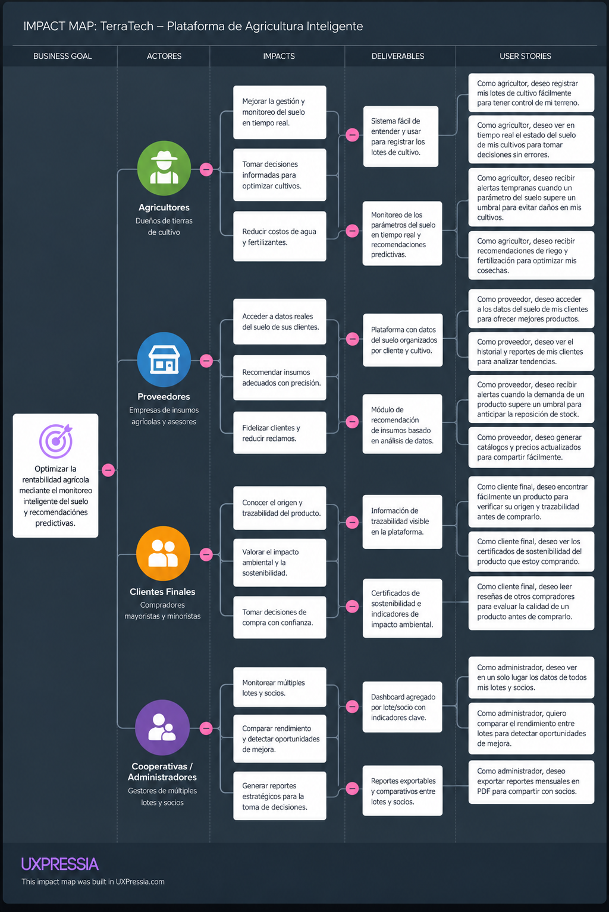

El enlace público del mapa se incorporará cuando el equipo habilite su
compartición desde UXPressia.

### 2.4.3. Product Backlog

El Product Backlog consolida y prioriza las 53 historias del proyecto (historias de usuario, historias técnicas y spikes de investigación) ordenadas estrictamente por su valor para el negocio, dependencias técnicas y precedencia arquitectónica a lo largo de los **4 Sprints** de desarrollo del ciclo académico. La estimación utiliza la escala de Fibonacci (1, 2, 3, 5 y 8 Story Points).

| \# Orden | User Story ID | Título | Story Points (1 / 2 / 3 / 5 / 8) | Sprint |
|:---|:---|:---|:---|:---|
| 1 | TS01 | Configuración de repositorios con GitFlow | 2 | Sprint 1 |
| 2 | TS02 | Despliegue automático de los productos | 3 | Sprint 1 |
| 3 | TS03 | Configuración de la base de datos en la nube | 3 | Sprint 1 |
| 4 | TS04 | Configuración de variables de entorno | 2 | Sprint 1 |
| 5 | US01 | Visualización del mensaje de valor | 2 | Sprint 1 |
| 6 | US02 | Conocimiento de las características de la solución | 3 | Sprint 1 |
| 7 | US03 | Solicitud de demostración | 5 | Sprint 1 |
| 8 | US04 | Consulta de términos y condiciones | 1 | Sprint 1 |
| 9 | US05 | Información del proyecto y del equipo | 2 | Sprint 1 |
| 10 | SP01 | Viabilidad de la integración de sensores IoT | 3 | Sprint 1 |
| 11 | TS05 | Implementación del servicio de autenticación | 8 | Sprint 2 |
| 12 | US06 | Registro de nuevo usuario | 5 | Sprint 2 |
| 13 | US07 | Inicio de sesión | 3 | Sprint 2 |
| 14 | US08 | Recuperación de contraseña | 3 | Sprint 2 |
| 15 | US09 | Gestión del perfil de usuario | 2 | Sprint 2 |
| 16 | TS08 | Consulta de perfiles agrícolas | 3 | Sprint 2 |
| 17 | US17 | Registro de un nuevo sensor | 3 | Sprint 2 |
| 18 | US10 | Consulta de indicadores clave | 5 | Sprint 2 |
| 19 | US11 | Selección de zona o sensor específico | 3 | Sprint 2 |
| 20 | US12 | Consulta del histórico de datos | 5 | Sprint 2 |
| 21 | SP02 | Viabilidad del almacenamiento local y la sincronización sin conexión | 3 | Sprint 2 |
| 22 | US13 | Identificación de zonas fértiles | 8 | Sprint 3 |
| 23 | US14 | Navegación en el mapa | 3 | Sprint 3 |
| 24 | US15 | Recomendación automática de riego | 5 | Sprint 3 |
| 25 | US16 | Recomendación automática de fertilización | 5 | Sprint 3 |
| 26 | US18 | Configuración de umbrales de alerta | 3 | Sprint 3 |
| 27 | US22 | Consulta del pronóstico del clima | 5 | Sprint 3 |
| 28 | US23 | Consulta de imágenes satelitales | 8 | Sprint 3 |
| 29 | TS09 | Gestión del inventario de insumos | 5 | Sprint 3 |
| 30 | US24 | Registro de insumos | 3 | Sprint 3 |
| 31 | US25 | Consulta y filtrado del inventario | 3 | Sprint 3 |
| 32 | US26 | Actualización del stock de insumos | 5 | Sprint 3 |
| 33 | TS10 | Consulta de reportes analíticos por dispositivo | 3 | Sprint 3 |
| 34 | SP03 | Viabilidad de las notificaciones push | 3 | Sprint 3 |
| 35 | US27 | Consulta de notificaciones de los sensores | 3 | Sprint 4 |
| 36 | US28 | Configuración de preferencias de notificaciones | 5 | Sprint 4 |
| 37 | US29 | Alertas de interés sobre productos | 3 | Sprint 4 |
| 38 | US30 | Notificaciones de nuevas reseñas | 3 | Sprint 4 |
| 39 | US31 | Notificaciones de nuevos productos de interés | 3 | Sprint 4 |
| 40 | US32 | Notificaciones de novedades y disponibilidad | 3 | Sprint 4 |
| 41 | US39 | Consulta del catálogo de productos | 5 | Sprint 4 |
| 42 | US40 | Consulta del detalle y la trazabilidad de un producto | 5 | Sprint 4 |
| 43 | US41 | Consulta de la información de los cultivos de los clientes | 5 | Sprint 4 |
| 44 | TS11 | Gestión de la comunidad y reseñas | 8 | Sprint 4 |
| 45 | US33 | Consulta de comentarios y calificaciones | 3 | Sprint 4 |
| 46 | US34 | Consulta de la reputación de productos | 3 | Sprint 4 |
| 47 | US35 | Publicación de reseñas de productos | 3 | Sprint 4 |
| 48 | US36 | Consulta de reseñas de otros compradores | 2 | Sprint 4 |
| 49 | US37 | Consulta de productos con mayor interés | 5 | Sprint 4 |
| 50 | US38 | Consulta de zonas con mayor actividad | 5 | Sprint 4 |
| 51 | US19 | Documentación interactiva de la API | 2 | Sprint 4 |
| 52 | US20 | Consulta de datos de un sensor | 3 | Sprint 4 |
| 53 | US21 | Registro de recomendaciones mediante webhook | 5 | Sprint 4 |

#### Resumen de distribución y velocidad estimada por Sprint

| Sprint | Enfoque principal del Sprint | Historias asignadas | Story Points | % del Backlog |
|:---|:---|:---:|:---:|:---:|
| **Sprint 1** | Setup técnico, infraestructura CI/CD, Landing Page y Spike IoT | 10 (4 TS, 5 US, 1 SP) | 26 SP | 12.9% |
| **Sprint 2** | IAM, perfiles de usuario, telemetría en tiempo real y Spike Offline | 11 (2 TS, 8 US, 1 SP) | 43 SP | 21.3% |
| **Sprint 3** | Analítica de suelo, prescripciones inteligentes, inventario y Spike Push | 13 (2 TS, 10 US, 1 SP) | 59 SP | 29.2% |
| **Sprint 4** | Alertas push, trazabilidad QR, catálogo, comunidad y APIs externas | 19 (1 TS, 18 US) | 74 SP | 36.6% |
| **Total** | **Proyecto completo TerraTech** | **53 historias** | **202 SP** | **100%** |

La captura del tablero y el enlace público del Product Backlog se
incorporarán cuando el equipo cree el tablero en la herramienta de
gestión seleccionada.

## 2.5. Strategic-Level Domain-Driven Design

El diseño estratégico de **Domain-Driven Design (DDD)** permite
descomponer la complejidad del dominio de la agricultura de precisión en
límites organizacionales y de software bien definidos (*Bounded
Contexts*), garantizando una arquitectura desacoplada, mantenible y
alineada con los objetivos del negocio agrícola.

### 2.5.1. EventStorming

El modelado estratégico partió de la sesión de *Big Picture
EventStorming*, refinando los eventos del negocio para identificar
agrupaciones de conceptos cohesivos con su propio modelo de dominio y
lenguaje ubicuo.

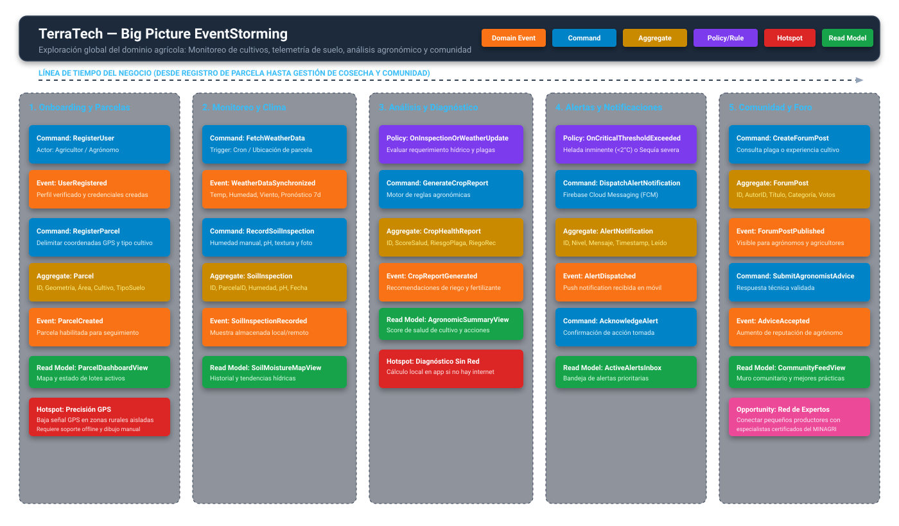

#### 2.5.1.1. Candidate Context Discovery

A partir de la afinidad de eventos, comandos y reglas de negocio identificados durante el Big Picture EventStorming, se descubrieron y clasificaron cinco Bounded Contexts estratégicos para representar las principales responsabilidades de TerraTech.

| Bounded Context | Tipo de Dominio | Justificación Estratégica |
|---|---|---|
| **Field & Parcel Management** | **Core Domain** | Gestiona estratégicamente los terrenos, parcelas y la información asociada al monitoreo agrícola, constituyendo una capacidad central para organizar los espacios productivos y sus datos relacionados. |
| **Crop Analytics & Reporting** | **Core Domain** | Agrupa las capacidades estratégicas relacionadas con el análisis de información agrícola, generación de reportes y apoyo a la toma de decisiones sobre el estado de los cultivos. |
| **Alerts & Notifications** | **Supporting Domain** | Gestiona las alertas y notificaciones destinadas a informar oportunamente a los usuarios sobre condiciones relevantes relacionadas con sus cultivos y actividades agrícolas. |
| **Farmer Community & Collaboration** | **Supporting Domain** | Representa las capacidades de interacción, colaboración y comunidad contempladas para conectar a los diferentes participantes del ecosistema TerraTech. |
| **IAM & Security** | **Generic Domain** | Gestiona la identidad, autenticación y autorización necesarias para controlar el acceso de los usuarios a las capacidades de TerraTech. |

> **Nota de alineación con el diseño táctico:** Los Bounded Contexts definidos en esta sección corresponden a la visión estratégica de TerraTech. La sección 2.6 documenta el diseño táctico del backend reutilizado, por lo que sus nombres y granularidad no necesariamente mantienen una correspondencia uno a uno.
>
> En términos de responsabilidad, **Field & Parcel Management** se relaciona principalmente con **Monitoring Management**; **Crop Analytics & Reporting** con **Analytics Management**; **Alerts & Notifications** con **Notification Management**; e **IAM & Security** con **Identity & Access Management**.
>
> **Farmer Community & Collaboration** representa una capacidad estratégica contemplada en los requisitos funcionales, aunque actualmente no dispone de un Bounded Context táctico independiente documentado en la sección 2.6. Asimismo, **Stock Management**, presente en el diseño táctico reutilizado, constituye una capacidad de soporte para la gestión de insumos agrícolas.
>
> Los componentes agrupados como **Shared** en la sección 2.6 corresponden a elementos técnicos transversales utilizados por diferentes contextos y no constituyen un dominio de negocio independiente.

Adicionalmente, el backend dispone de componentes compartidos utilizados transversalmente por los Bounded Contexts, tales como mecanismos de auditoría, manejo de errores, persistencia, Unit of Work y procesamiento de eventos. Estos elementos se documentan en la sección 2.6 como `Shared`, pero no representan por sí mismos un dominio de negocio independiente.

Las funcionalidades de comunidad, reputación, catálogo y trazabilidad forman parte del alcance funcional planteado para TerraTech y se encuentran consideradas en los requisitos del producto. Sin embargo, no se presentan en esta etapa como Bounded Contexts implementados mientras no exista un modelo táctico independiente que los respalde.

#### 2.5.1.2. Domain Message Flows Modeling

Para representar la colaboración entre los actores y los Bounded Contexts estratégicos de TerraTech, se utiliza Domain Storytelling. El flujo describe a nivel de negocio cómo las principales capacidades de la solución colaboran durante el monitoreo y análisis de la actividad agrícola.

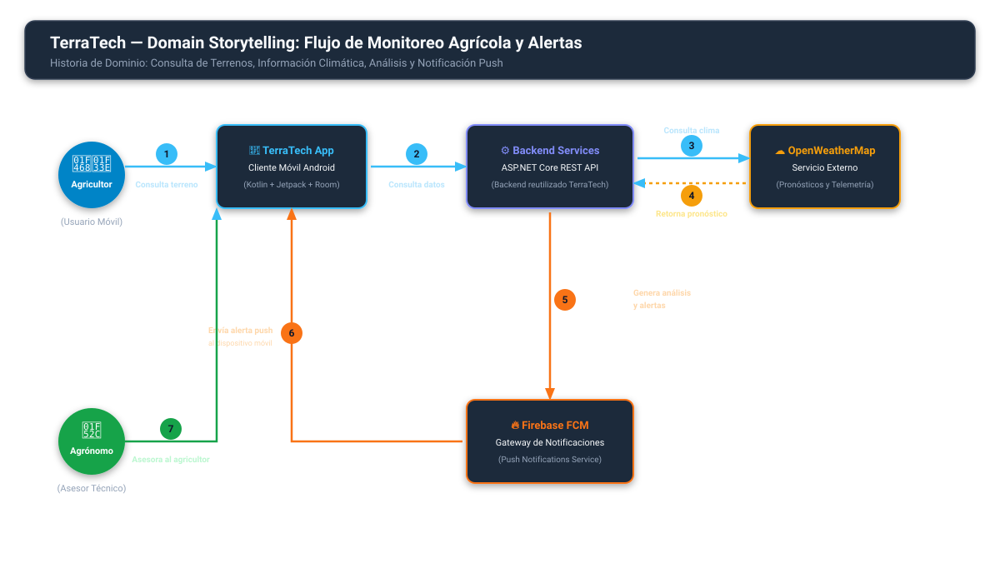

**Narrativa del flujo principal de monitoreo agrícola:**

1. El **Agricultor** accede a TerraTech y se autentica mediante las capacidades correspondientes a **IAM & Security**.

2. Desde la aplicación móvil, el agricultor consulta y administra la información relacionada con sus terrenos y parcelas mediante **Field & Parcel Management**.

3. La información registrada y obtenida a partir del monitoreo agrícola puede ser utilizada por **Crop Analytics & Reporting** para generar métricas, análisis e interpretaciones que apoyen la toma de decisiones.

4. Cuando el análisis identifica una situación que debe ser comunicada al usuario, **Alerts & Notifications** gestiona la generación y presentación de la alerta correspondiente.

5. Las funcionalidades de **Farmer Community & Collaboration** permiten representar estratégicamente la interacción entre agricultores, asesores y otros participantes del ecosistema TerraTech.

6. La aplicación móvil presenta estas capacidades mediante una experiencia adaptada al trabajo agrícola y consume los servicios disponibles del backend reutilizado.

> **Consideración de implementación:** Este Domain Storytelling representa el flujo estratégico objetivo de TerraTech y no implica que cada capacidad estratégica disponga actualmente de un Bounded Context táctico independiente. La implementación existente se encuentra documentada en la sección 2.6 y deberá reutilizarse o evolucionar progresivamente según las necesidades de las siguientes entregas, evitando asumir la incorporación inmediata de nuevos módulos al backend.
#### 2.5.1.3. Bounded Context Canvases

> **Nota de alcance estratégico:** Los siguientes Bounded Context Canvases representan la visión estratégica propuesta para la evolución de TerraTech como solución móvil. Su propósito es delimitar responsabilidades, reglas de negocio y lenguaje del dominio. Por ello, no debe interpretarse que cada contexto disponga actualmente de una implementación táctica independiente dentro del backend reutilizado documentado en la sección 2.6.

##### Bounded Context Canvas 1: IAM & Security

- **Nombre:** IAM (Identity & Access Management)
- **Clasificación Estratégica:** Generic Domain
- **Propósito:** Proveer autenticación segura, emisión/validación de
  tokens JWT y autorización basada en roles (Agricultor, Ingeniero
  Agrónomo, Administrador).
- **Entradas (Inbound):** Comandos `RegisterUserAccount`,
  `AuthenticateUser`, `UpdateUserProfile`.
- **Salidas (Outbound):** Eventos `UserRegistered`, `UserAuthenticated`,
  `RoleAssigned`.
- **Lenguaje Ubicuo Local:** `UserAccount`, `Credential`, `Role`,
  `SessionToken`, `UserProfile`.
- **Reglas de Negocio e Invariantes:** Contraseñas cifradas con algoritmo BCrypt;
  los tokens JWT utilizan el tiempo de expiración definido en la configuración vigente del backend;
  los roles se gestionan de acuerdo con las reglas de autorización de TerraTech.
- **Dependencias:** Ninguna (Contexto base Upstream).

##### Bounded Context Canvas 2: Field & Parcel Management

- **Nombre:** Field & Parcel Management
- **Clasificación Estratégica:** Core Domain
- **Propósito:** Gestionar el ciclo de vida de los predios y lotes
  agrícolas, sus geometrías geoespaciales GPS, cultivos asignados e
  historial de inspecciones de suelo.
- **Entradas (Inbound):** Comandos `RegisterParcel`,
  `UpdateParcelBoundaries`, `RecordSoilInspection`.
- **Salidas (Outbound):** Eventos `ParcelCreated`, `ParcelUpdated`,
  `SoilInspectionRecorded`.
- **Lenguaje Ubicuo Local:** `Parcel`, `GeoPolygon`, `CropType`,
  `SoilInspection`, `MoistureLevel`, `SoilPH`.
- **Reglas de Negocio e Invariantes:** Una parcela debe poseer un
  polígono cerrado válido mayor a 0.01 hectáreas; las inspecciones de
  suelo requieren porcentaje de humedad entre 0% y 100% y pH entre 0 y
    14.
- **Dependencias:** Consume identidades de IAM; alimenta de telemetría a
  Crop Analytics.

##### Bounded Context Canvas 3: Crop Analytics & Reporting

- **Nombre:** Crop Analytics & Reporting
- **Clasificación Estratégica:** Core Domain
- **Propósito:** Motor de diagnóstico agronómico que sintetiza
  telemetría de suelo y clima para generar diagnósticos de salud del
  cultivo y planes de riego/fertilización.
- **Entradas (Inbound):** Eventos `SoilInspectionRecorded`,
  `WeatherDataSynchronized`, comando `GenerateCropReport`.
- **Salidas (Outbound):** Eventos `CropReportGenerated`,
  `CriticalThresholdDetected`.
- **Lenguaje Ubicuo Local:** `CropHealthReport`, `HealthScore`,
  `PestRiskIndex`, `IrrigationRecommendation`, `AgronomicRule`.
- **Reglas de Negocio e Invariantes:** El `HealthScore` se normaliza en
  escala de 0 a 100; si el déficit hídrico supera el 40%, se emite
  recomendación prioritaria de riego.
- **Dependencias:** Depende de Field & Parcel Management (datos del
  lote) y de OpenWeatherMap API (clima externo).

##### Bounded Context Canvas 4: Alerts & Notifications

- **Nombre:** Alerts & Notifications
- **Clasificación Estratégica:** Supporting Domain
- **Propósito:** Monitorear umbrales agronómicos y climáticos de riesgo
  para despachar notificaciones push a los dispositivos móviles Android
  de los productores.
- **Entradas (Inbound):** Evento `CriticalThresholdDetected`, comando
  `DispatchAlertNotification`, comando `AcknowledgeAlert`.
- **Salidas (Outbound):** Evento `AlertDispatched`, `AlertAcknowledged`.
- **Lenguaje Ubicuo Local:** `AlertNotification`, `SeverityLevel` (INFO,
  WARNING, CRITICAL), `PushPayload`, `DeviceToken`,
  `AcknowledgmentStatus`.
- **Reglas de Negocio e Invariantes:** Las alertas de severidad
  `CRITICAL` deben despacharse inmediatamente con prioridad alta en FCM;
  reintentos automáticos si falla la conexión.
- **Dependencias:** Consume eventos de Crop Analytics y se integra con
  el servicio externo Firebase FCM.

##### Bounded Context Canvas 5: Farmer Community & Collaboration

- **Nombre:** Farmer Community & Collaboration
- **Clasificación Estratégica:** Supporting Domain
- **Propósito:** Facilitar la interacción comunitaria, resolución de
  consultas sobre plagas y difusión de buenas prácticas entre
  productores y agrónomos.
- **Entradas (Inbound):** Comandos `CreateForumPost`,
  `SubmitExpertAnswer`, `VoteAnswer`.
- **Salidas (Outbound):** Eventos `ForumPostPublished`,
  `ExpertAnswerSubmitted`, `AnswerMarkedAsAccepted`.
- **Lenguaje Ubicuo Local:** `ForumPost`, `AgronomistAdvice`,
  `PostCategory`, `UpvoteCount`, `ExpertBadge`.
- **Reglas de Negocio e Invariantes:** Solo usuarios con rol verificado
  de Ingeniero Agrónomo pueden otorgar respuestas catalogadas como
  `ExpertAdvice`; el autor del post es el único que puede marcar una
  respuesta como aceptada.
- **Dependencias:** Consume identidades de IAM; referencia códigos de
  parcela de forma desacoplada.

### 2.5.2. Context Mapping

El **Context Map** define formalmente las relaciones de integración y
gobernanza de datos entre los Bounded Contexts y los servicios externos:

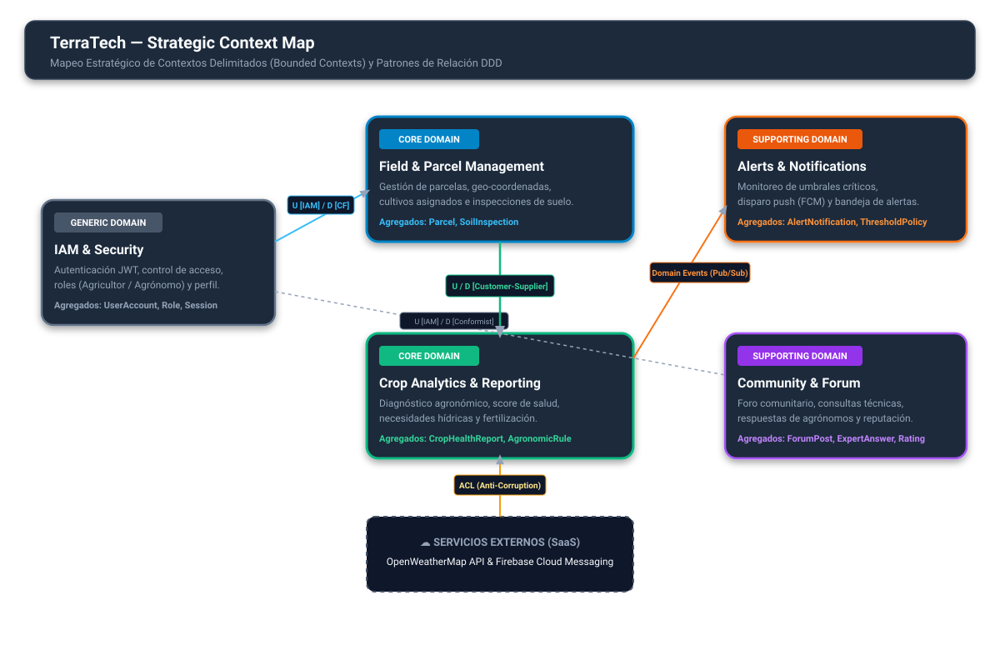

#### Patrones de Relación y Matriz de Integración

| Contexto Upstream (U) | Contexto Downstream (D) | Patrón DDD Adoptado | Justificación Técnica y de Diseño |
|:---|:---|:---|:---|
| **IAM & Security** | **Field & Parcel Management** | *Customer / Supplier* | IAM provee la identidad autenticada (`userId`) requerida para asignar propietarios a las parcelas agrícolas. |
| **IAM & Security** | **Farmer Community** | *Conformist* | La comunidad acepta directamente el modelo de identidad y perfil emitido por IAM sin transformaciones adicionales. |
| **Field & Parcel Management** | **Crop Analytics & Reporting** | *Customer / Supplier* | Analytics depende de los datos estructurales del predio e historial de inspecciones provistos por Parcel Management. |
| **OpenWeatherMap API** | **Crop Analytics & Reporting** | *Anti-Corruption Layer (ACL)* | La ACL aísla el modelo de dominio interno de TerraTech de las estructuras de datos propietarias y cambios de la API pública meteorológica. |
| **Crop Analytics & Reporting** | **Alerts & Notifications** | *Published Language / Events* | Analytics publica eventos de dominio asíncronos (`CriticalThresholdDetected`) que Notifications consume para enviar push alerts. |
| **Alerts & Notifications** | **Firebase Cloud Messaging** | *Anti-Corruption Layer (ACL)* | Adapter que traduce el agregado `AlertNotification` al payload específico de Firebase HTTP v1 API. |

### 2.5.3. Software Architecture

La solución de software de TerraTech se modela utilizando el enfoque **C4 Model** para representar su contexto y sus contenedores principales, complementándolo con un diagrama de despliegue que muestra la distribución de los artefactos de software en la infraestructura prevista. La arquitectura se orienta a una aplicación móvil nativa Android que consume los servicios del backend reutilizado de TerraTech.

#### 2.5.3.1. Software Architecture Context Level Diagrams (C4 Nivel 1)

El diagrama de contexto define los límites del sistema TerraTech, sus
usuarios clave y las integraciones con servicios externos de terceros:

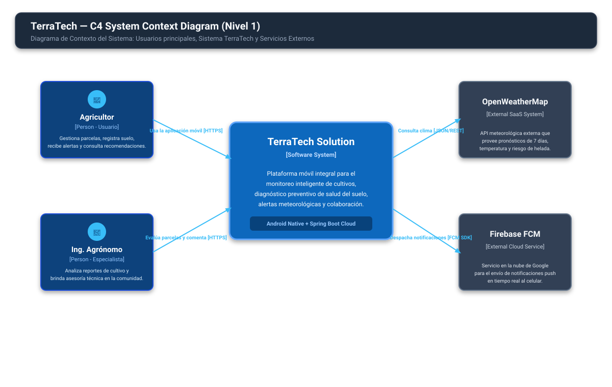

- **Actores Principales:**
    - **Agricultor / Productor Agrícola:** Interactúa con la aplicación móvil para consultar y gestionar información relacionada con sus terrenos, monitoreo, alertas y actividades agrícolas.
    - **Ingeniero Agrónomo / Asesor:** Puede brindar orientación técnica al agricultor dentro de las capacidades de asesoría contempladas por TerraTech.
    - **Proveedor de Insumos Agrícolas:** Utiliza información autorizada para apoyar sus recomendaciones y consultar información relevante para el seguimiento de sus clientes y productos.
    - **Cliente Final / Comprador:** Consulta información sobre productos agrícolas, su procedencia, opiniones y datos de trazabilidad disponibles en TerraTech.
- **Sistema TerraTech:** Plataforma integral que procesa datos de campo,
  correlaciona variables ambientales y genera diagnósticos preventivos.
- **Sistemas Externos SaaS:**
    - **OpenWeatherMap API:** Provee telemetría y pronósticos climáticos
      georreferenciados.
    - **Firebase Cloud Messaging (FCM):** Plataforma de mensajería push
      para notificación en tiempo real en dispositivos móviles.

#### 2.5.3.2. Software Architecture Container Level Diagrams (C4 Nivel 2)

El diagrama de contenedores detalla las aplicaciones ejecutables,
almacenes de datos y protocolos de comunicación que componen la
solución:

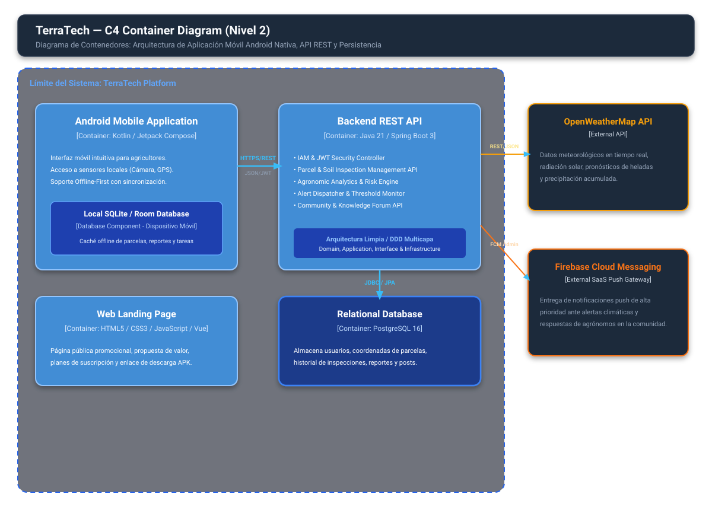

- **Contenedores de la Solución:**
    1.  **Android Mobile Application (Kotlin / Jetpack Compose):**
        Aplicación nativa para smartphones Android. Emplea arquitectura
        *MVVM + Clean Architecture*, StateFlow para reactividad, inyección
        de dependencias con Hilt/Koin y cliente Retrofit para comunicación
        HTTPS con el backend.
    2. **Local SQLite / Room Database:** Base de datos embebida en el dispositivo móvil Android.
        Almacena localmente información previamente obtenida y los datos que requieran sincronización 
        posterior, permitiendo consultar información disponible cuando no exista conexión y
        actualizarla cuando se recupere la conectividad.
    3.  **Web Landing Page (HTML5 / CSS3 / JavaScript / Vue):** Sitio web
        institucional responsivo optimizado para SEO, presentación
        comercial y descarga del archivo APK de la aplicación móvil.
    4.  **Backend REST API (C# / ASP.NET Core):** API modular organizada mediante capas de Domain,
         Application, Interface e Infrastructure. Expone endpoints REST consumidos por la aplicación móvil
         y utiliza mecanismos de autenticación y autorización basados en JWT.
         La persistencia del backend se gestiona mediante Entity Framework Core.
    5.  **Relational Database:** Base de datos relacional centralizada utilizada por el backend de TerraTech
        para persistir la información estructurada de los diferentes Bounded Contexts.
        El motor de base de datos debe corresponder con el proveedor configurado 
        en la implementación reutilizada del backend.

#### 2.5.3.3. Software Architecture Deployment Diagram

El diagrama de despliegue representa la distribución de los artefactos
de software en los entornos de hardware físico y cloud, detallando
protocolos de red y seguridad:

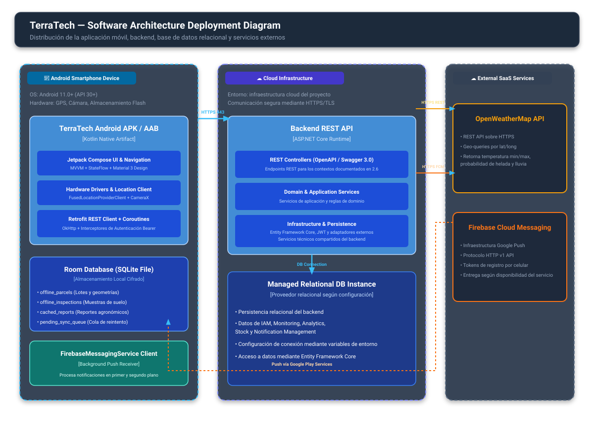

- **Nodos de Infraestructura y Despliegue:**
    - **Nodo Cliente — Smartphone Android:** Dispositivo móvil que ejecuta la aplicación TerraTech. La aplicación utiliza almacenamiento local mediante Room para conservar información disponible sin conexión y sincronizarla posteriormente cuando exista conectividad.

    - **Nodo Cloud — Infraestructura de despliegue:**
        - **Backend REST API:** Servicio que ejecuta la API ASP.NET Core reutilizada por TerraTech y expone sus endpoints mediante HTTPS.
        - **Base de datos relacional:** Servicio encargado de persistir la información centralizada utilizada por el backend. El motor y el proveedor de despliegue deberán coincidir con la configuración real del proyecto.

    - **Nodo SaaS Externo:** Servicios externos utilizados por TerraTech, como el proveedor de información climática y el servicio seleccionado para el envío de notificaciones push.

## 2.6. Tactical-Level Domain-Driven Design

El Diseño Táctico de DDD complementa la arquitectura del software
guiando el desarrollo mediante patrones de diseño estandarizados, lo que
garantiza la correcta implementación de las reglas de negocio y asegura
la mantenibilidad del sistema.

### 2.6.1. Bounded Context: Identity & Access Management

#### 2.6.1.1. Domain Layer

| Archivo | Tipo de Componente | Responsabilidad Principal |
|:---|:---|:---|
| User.cs | Aggregate Root | Entidad principal que gestiona el ciclo de vida e identidad del usuario. |
| UserAudit.cs | Partial Entity / Extension | Implementa propiedades de auditoría (`CreatedAt`, `UpdatedAt`). |
| Email.cs | Value Object | Valida, encapsula y normaliza la dirección de correo electrónico. |
| IUserRepository.cs | Domain Repository Interface | Define el contrato de persistencia para consultar y almacenar usuarios. |
| SignInCommand.cs / SignUpCommand.cs | Domain Command | Estructuras de datos para solicitar el inicio o creación de sesión. |
| GetUserByEmailQuery.cs / GetUserByIdQuery.cs | Domain Query | Estructuras de datos para consultar usuarios por ID o Email. |
| IamErrors.cs / IamError.cs | Domain Model Errors | Define los códigos y mensajes de error específicos de autenticación e identidad. |

#### 2.6.1.2. Interface Layer

| Archivo | Tipo de Componente | Responsabilidad Principal |
|:---|:---|:---|
| AuthenticationController.cs | REST Controller | Gestiona las peticiones de autenticación (`sign-in`, `sign-up`). |
| UsersController.cs | REST Controller | Gestiona las peticiones de consulta de usuarios por ID o Email. |
| IIamContextFacade.cs | ACL / Facade Interface | Contrato para integración segura e inter-contexto. |
| SignInResource.cs / SignUpResource.cs | Inbound Resource (DTO) | Representa los datos recibidos en las solicitudes de autenticación. |
| UserResource.cs / AuthenticatedUserResource.cs | Outbound Resource (DTO) | Representa la estructura de respuesta enviada al cliente HTTP. |
| SignInCommandFromResourceAssembler.cs | Assembler / Mapper | Transforma `SignInResource` a `SignInCommand`. |
| SignUpCommandFromResourceAssembler.cs | Assembler / Mapper | Transforma `SignUpResource` a `SignUpCommand`. |
| UserResourceFromEntityAssembler.cs | Assembler / Mapper | Transforma la entidad `User` a `UserResource`. |
| AuthenticatedUserResourceFromEntityAssembler.cs | Assembler / Mapper | Transforma `User` y JWT Token a `AuthenticatedUserResource`. |
| IamActionResultAssembler.cs | REST Response Mapper | Traduce errores y resultados de dominio a respuestas HTTP (`ProblemDetails`). |

#### 2.6.1.3. Application Layer

| Archivo | Tipo de Componente | Responsabilidad Principal |
|:---|:---|:---|
| IUserCommandService.cs | Inbound Command Port | Contrato para la ejecución de comandos de usuario (sign-in, sign-up). |
| UserCommandService.cs | Command Application Service | Orquesta la lógica de casos de uso de registro y autenticación. |
| IUserQueryService.cs | Inbound Query Port | Contrato para la ejecución de consultas de lectura sobre usuarios. |
| UserQueryService.cs | Query Application Service | Implementa las consultas para obtener usuarios por ID o Email. |
| ITokenService.cs | Outbound Service Interface | Contrato para generación y validación de tokens JWT. |
| IHashingService.cs | Outbound Service Interface | Contrato para cifrado y verificación de contraseñas. |
| IamContextFacade.cs | ACL Facade Implementation | Implementa la fachada de integración pública para otros Bounded Contexts. |

#### 2.6.1.4. Infrastructure Layer

| Archivo | Tipo de Componente | Responsabilidad Principal |
|:---|:---|:---|
| UserRepository.cs | Repository Implementation | Implementa las operaciones de persistencia en base de datos para el Agregado User. |
| ModelBuilderExtensions.cs | ORM Mapping Configuration | Configura el esquema de la tabla de usuarios e índices únicos en Entity Framework Core. |
| TokenService.cs | Security Service Implementation | Gestiona la creación y validación técnica de tokens JWT. |
| TokenSettings.cs | Configuration Model | Representa las claves y configuraciones del token leídas desde appsettings.json. |
| HashingService.cs | Security Service Implementation | Realiza el cifrado y validación de contraseñas utilizando el algoritmo BCrypt. |
| RequestAuthorizationMiddleware.cs | ASP.NET Core Middleware | Intercepta peticiones HTTP para extraer y validar el token JWT adjunto. |
| RequestAuthorizationMiddlewareExtensions.cs | Middleware Extension | Registra el middleware de autorización dentro de la canalización de la aplicación. |
| AuthorizeAttribute.cs | Authorization Filter | Filtro que valida la presencia del usuario autenticado en el contexto HTTP. |
| AllowAnonymousAttribute.cs | Metadata Attribute | Atributo para omitir la validación de autorización en endpoints públicos. |

#### 2.6.1.5. Bounded Context Software Architecture Component Level Diagrams

  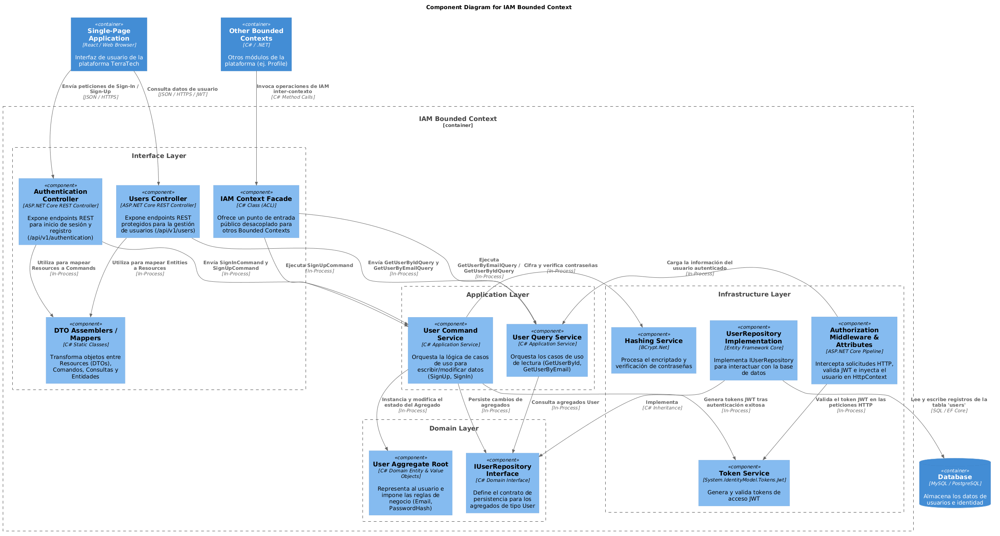

#### 2.6.1.6. Bounded Context Software Architecture Code Level Diagrams

##### 2.6.1.6.1. Bounded Context Domain Layer Class Diagrams

  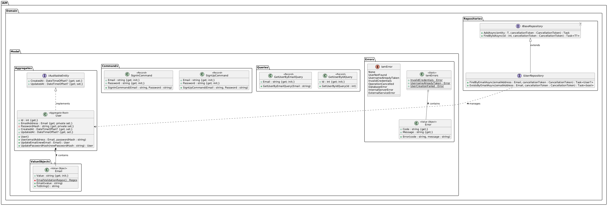

##### 2.6.1.6.2. Bounded Context Database Design Diagram

  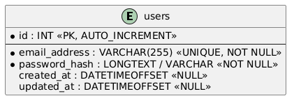

### 2.6.2. Bounded Context: Analytics Management

#### 2.6.2.1. Domain Layer

| Archivo | Tipo de Componente | Responsabilidad Principal |
|:---|:---|:---|
| Report.cs | Aggregate Root | Entidad principal que modela los datos analíticos e impone reglas de modificación de métricas. |
| ReportAudit.cs | Partial Class / Auditing | Incorpora propiedades de auditoría temporal (CreatedAt, UpdatedAt) al Agregado Report. |
| DeviceId.cs | Value Object | Encapsula y valida el identificador numérico del dispositivo. |
| GeneratedAt.cs | Value Object | Encapsula y valida la fecha de generación del reporte analítico. |
| MeanValue.cs | Value Object | Encapsula y valida el valor promedio estadístico (rango 0 - 100). |
| Variance.cs | Value Object | Encapsula y valida la varianza estadística (no negativa). |
| StandardDeviation.cs | Value Object | Encapsula y valida la desviación estándar (no negativa). |
| TechnicalInterpretation.cs | Value Object | Encapsula y valida la interpretación técnica textual del análisis. |
| CreateReportCommand.cs | Command | Transporta los datos requeridos para la creación de un reporte. |
| UpdateReportCommand.cs | Command | Transporta los datos requeridos para la actualización de un reporte existente. |
| GetReportByIdQuery.cs | Query | Transporta el identificador para la consulta individual de un reporte. |
| IReportRepository.cs | Domain Repository Interface | Define las operaciones de lectura y consulta especializadas para la entidad Report. |

#### 2.6.2.2. Interface Layer

| Archivo | Tipo de Componente | Responsabilidad Principal |
|:---|:---|:---|
| ReportsController.cs | REST Controller | Expone y gestiona los endpoints HTTP REST para la administración de reportes analíticos. |
| CreateReportResource.cs | Request DTO | Contrato de entrada con validaciones para crear un reporte. |
| UpdateReportResource.cs | Request DTO | Contrato de entrada con validaciones para actualizar estadísticas de un reporte. |
| ReportResource.cs | Response DTO | Contrato de salida con los datos formateados del reporte analítico. |
| CreateReportCommandFromResourceAssembler.cs | Assembler / Transformer | Mapea CreateReportResource hacia el objeto inmutable CreateReportCommand. |
| ReportResourceFromEntityAssembler.cs | Assembler / Transformer | Mapea la entidad de dominio Report hacia el recurso de respuesta ReportResource. |
| ActionResultFromCreateReportResultAssembler.cs | Assembler / HTTP Transformer | Convierte el objeto Result<Report> en respuestas HTTP estructuradas (201, 409, 500). |

#### 2.6.2.3. Application Layer

| Archivo | Tipo de Componente | Responsabilidad Principal |
|:---|:---|:---|
| IReportCommandService.cs | Service Interface | Contrato para la ejecución de comandos de modificación de reportes. |
| ReportCommandService.cs | Application Service | Orquesta la creación y actualización de agregados Report y la confirmación en el UnitOfWork. |
| IReportQueryService.cs | Service Interface | Contrato para la consulta de datos de reportes analíticos. |
| ReportQueryService.cs | Application Service | Implementa la lógica de recuperación de reportes desde el repositorio de dominio. |
| CreateReportError.cs | Application Error Enum | Define los tipos de errores de negocio para la creación de reportes. |
| UpdateReportError.cs | Application Error Enum | Define los tipos de errores de negocio para la actualización de reportes. |

#### 2.6.2.4. Infrastructure Layer

| Archivo | Tipo de Componente | Responsabilidad Principal |
|:---|:---|:---|
| ReportRepository.cs | Concrete Repository | Implementa la persistencia y consultas específicas del Agregado Report sobre Entity Framework Core. |
| ModelBuilderExtensions.cs | EF Core Configuration | Configura el mapeo ORM Fluent API del Agregado Report y sus Objetos de Valor en la base de datos. |

#### 2.6.2.5. Bounded Context Software Architecture Component Level Diagrams

  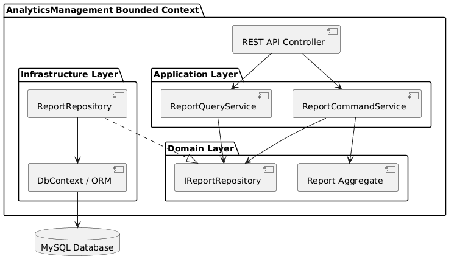

#### 2.6.2.6. Bounded Context Software Architecture Code Level Diagrams

##### 2.6.2.6.1. Bounded Context Domain Layer Class Diagrams

  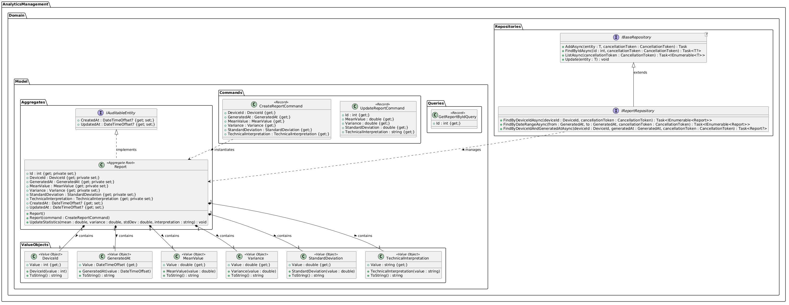

##### 2.6.2.6.2. Bounded Context Database Design Diagram

  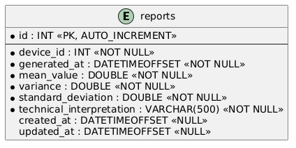

### 2.6.3. Bounded Context: Monitoring Management

#### 2.6.3.1. Domain Layer

| Archivo | Tipo de Componente | Responsabilidad Principal |
|:---|:---|:---|
| Field.cs | Aggregate Root | Representa una parcela o campo agrícola y gestiona sus reglas internas de actualización. |
| FieldAudit.cs | Partial Class / Audit | Implementa IAuditableEntity para registrar marcas de tiempo de creación y actualización de campos. |
| Device.cs | Aggregate Root | Representa un dispositivo/sensor de monitoreo asociado a un campo. |
| DeviceAudit.cs | Partial Class / Audit | Implementa IAuditableEntity para registrar marcas de tiempo de creación y actualización de dispositivos. |
| IFieldRepository.cs | Domain Repository Interface | Define el contrato de persistencia para el agregado Field. |
| IDeviceRepository.cs | Domain Repository Interface | Define el contrato de persistencia para el agregado Device. |
| DeviceStatus.cs | Value Object | Encapsula y normaliza el estado del dispositivo (ONLINE, OFFLINE, LOW_BATTERY). |
| FieldId.cs | Value Object | Encapsula el identificador de la parcela. |
| FieldName.cs | Value Object | Valida y almacena el nombre del campo. |
| LastSync.cs | Value Object | Almacena la marca de tiempo de la última sincronización del dispositivo. |
| LocationLatLong.cs | Value Object | Valida y almacena la latitud y longitud de la parcela. |
| MacAddress.cs | Value Object | Valida el formato de la dirección MAC del dispositivo. |
| ProfileId.cs | Value Object | Encapsula el identificador del perfil del usuario propietario. |
| SizeM2.cs | Value Object | Valida y almacena la extensión en metros cuadrados. |
| SoilType.cs | Value Object | Valida y almacena la clasificación del tipo de suelo. |
| CreateFieldCommand.cs | Command Record | DTO de comando para solicitar la creación de un campo. |
| UpdateFieldCommand.cs | Command Record | DTO de comando para solicitar la actualización de un campo. |
| DeleteFieldCommand.cs | Command Record | DTO de comando para solicitar la eliminación de un campo. |
| CreateDeviceCommand.cs | Command Record | DTO de comando para solicitar la creación de un dispositivo. |
| UpdateDeviceCommand.cs | Command Record | DTO de comando para solicitar la actualización de un dispositivo. |
| DeleteDeviceCommand.cs | Command Record | DTO de comando para solicitar la eliminación de un dispositivo. |
| GetFieldByIdQuery.cs | Query Record | Estructura para consultar un campo por su identificador. |
| GetFieldBySoilTypeQuery.cs | Query Record | Estructura para consultar campos por tipo de suelo. |
| GetDeviceByIdQuery.cs | Query Record | Estructura para consultar un dispositivo por su identificador. |
| GetDevicesByStatusQuery.cs | Query Record | Estructura para consultar dispositivos por estado operativo. |
| GetDevicesByFieldIdQuery.cs | Query Record | Estructura para consultar dispositivos asociados a un campo. |

#### 2.6.3.2. Interface Layer

| Archivo | Tipo de Componente | Responsabilidad Principal |
|:---|:---|:---|
| FieldsController.cs | REST Controller | Maneja las solicitudes HTTP relacionadas con campos/parcelas (CRUD y consultas por tipo de suelo). |
| DevicesController.cs | REST Controller | Maneja las solicitudes HTTP relacionadas con dispositivos IoT (CRUD y consultas por campo/estado). |
| CreateFieldResource.cs | DTO / Input Resource | DTO para la creación de un nuevo campo con validaciones de formulario. |
| UpdateFieldResource.cs | DTO / Input Resource | DTO para la actualización de un campo existente. |
| FieldResource.cs | DTO / Output Resource | DTO de respuesta para la representación aplanada de un campo (Field). |
| CreateDeviceResource.cs | DTO / Input Resource | DTO para la creación de un dispositivo IoT con validación de dirección MAC y estado. |
| UpdateDeviceResource.cs | DTO / Input Resource | DTO para la actualización de datos de un dispositivo. |
| DeviceResource.cs | DTO / Output Resource | DTO de respuesta para la representación aplanada de un dispositivo (Device). |
| CreateFieldCommandFromResourceAssembler.cs | Assembler / Transformer | Mapea un CreateFieldResource a CreateFieldCommand con Value Objects. |
| UpdateFieldCommandFromResourceAssembler.cs | Assembler / Transformer | Mapea un UpdateFieldResource a UpdateFieldCommand. |
| FieldResourceFromEntityAssembler.cs | Assembler / Transformer | Mapea la entidad de agregado Field a FieldResource. |
| ActionResultFromCreateFieldResultAssembler.cs | Result Assembler | Transforma el Result<Field> de la aplicación a una respuesta ActionResult de ASP.NET Core. |
| CreateDeviceCommandFromResourceAssembler.cs | Assembler / Transformer | Mapea un CreateDeviceResource a CreateDeviceCommand. |
| UpdateDeviceCommandFromResourceAssembler.cs | Assembler / Transformer | Mapea un UpdateDeviceResource a UpdateDeviceCommand. |
| DeviceResourceFromEntityAssembler.cs | Assembler / Transformer | Mapea la entidad de agregado Device a DeviceResource. |
| ActionResultFromCreateDeviceResultAssembler.cs | Result Assembler | Transforma el Result<Device> de la aplicación a una respuesta ActionResult de ASP.NET Core. |

#### 2.6.3.3. Application Layer

| Archivo | Tipo de Componente | Responsabilidad Principal |
|:---|:---|:---|
| CreateDeviceError.cs | Enum / Error | Enumera los errores del caso de uso de dispositivos (duplicado, no encontrado, MAC inválida, etc.). |
| CreateFieldError.cs | Enum / Error | Enumera los errores del caso de uso de campos (duplicado, no encontrado, suelo inválido, etc.). |
| IDeviceCommandService.cs | Service Interface | Interfaz del servicio de comandos para el manejo de CRUD de dispositivos. |
| IDeviceQueryService.cs | Service Interface | Interfaz del servicio de consultas para recuperar dispositivos e información proyectada a recursos. |
| IFieldCommandService.cs | Service Interface | Interfaz del servicio de comandos para el manejo de CRUD de campos/parcelas. |
| IFieldQueryService.cs | Service Interface | Interfaz del servicio de consultas para recuperar campos e información proyectada a recursos. |
| DeviceCommandService.cs | Command Service Implementation | Implementa la lógica de comandos para crear, actualizar y eliminar dispositivos con manejo de transacciones. |
| FieldCommandService.cs | Command Service Implementation | Implementa la lógica de comandos para crear, actualizar y eliminar campos con validación de duplicados. |
| DeviceQueryService.cs | Query Service Implementation | Implementa la lógica de consulta para listar o filtrar dispositivos por ID, campo y estado. |
| FieldQueryService.cs | Query Service Implementation | Implementa la lógica de consulta para listar o filtrar campos por ID y tipo de suelo. |

#### 2.6.3.4. Infrastructure Layer

| Archivo | Tipo de Componente | Responsabilidad Principal |
|:---|:---|:---|
| ModelBuilderExtensions.cs | EF Core Configuration / Extension | Configura el mapeo ORM de los agregados Field y Device (claves, tablas y Value Objects) mediante Fluent API. |
| FieldRepository.cs | Repository Implementation | Implementa la persistencia para la entidad Field en base de datos mediante EF Core. |
| DeviceRepository.cs | Repository Implementation | Implementa la persistencia para la entidad Device en base de datos mediante EF Core. |

#### 2.6.3.5. Bounded Context Software Architecture Component Level Diagrams

  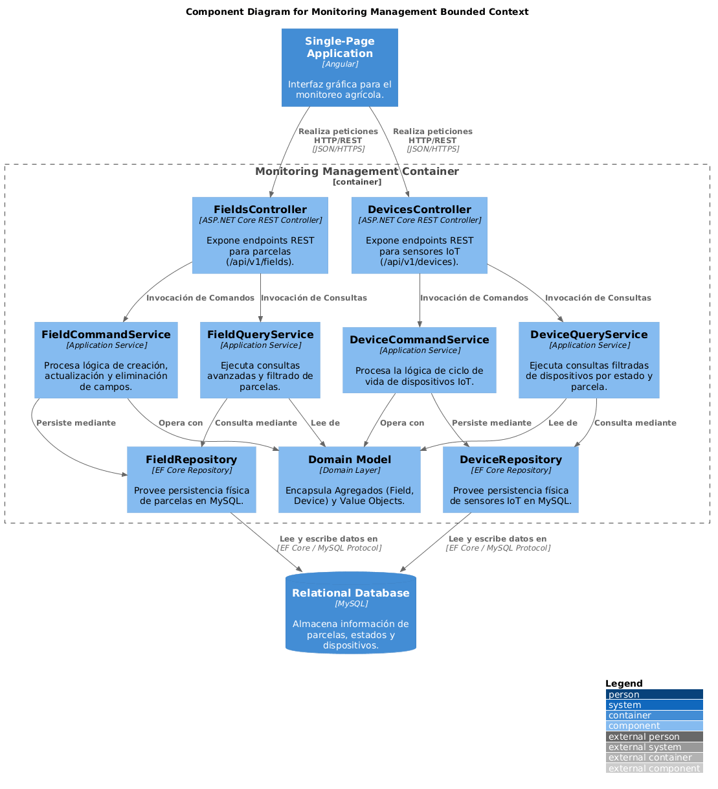

#### 2.6.3.6. Bounded Context Software Architecture Code Level Diagrams

##### 2.6.3.6.1. Bounded Context Domain Layer Class Diagrams

  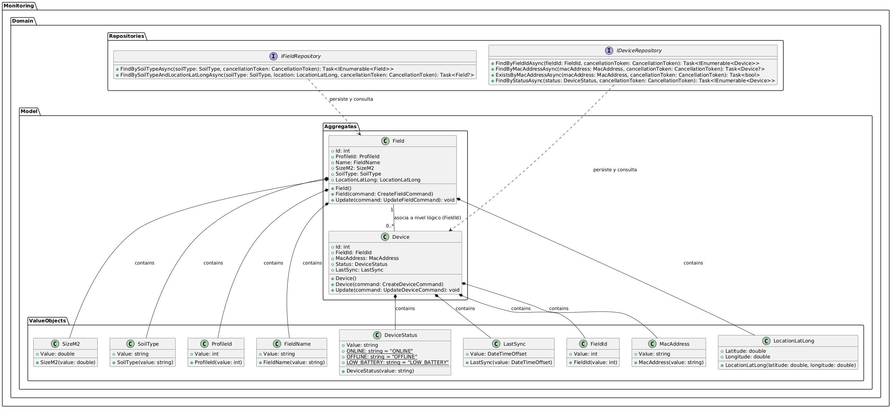

##### 2.6.3.6.2. Bounded Context Database Design Diagram

  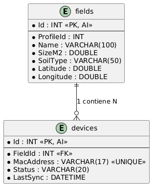

### 2.6.4. Bounded Context: Stock Management

#### 2.6.4.1. Domain Layer

| Archivo | Tipo de Componente | Responsabilidad Principal |
|:---|:---|:---|
| Inventory.cs | Aggregate Root | Representa el registro de inventario de un producto y gestiona las reglas para actualizar o descontar stock. |
| InventoryAudit.cs | Partial Class / Audit | Implementa IAuditableEntity para auditoría de creación y actualización en el inventario. |
| IInventoryRepository.cs | Domain Repository Interface | Define el contrato de persistencia para la entidad e inventario del dominio. |
| CreateInventoryCommand.cs | Command Record | DTO de comando para solicitar el registro inicial de stock de un producto. |
| UpdateInventoryCommand.cs | Command Record | DTO de comando para actualizar la cantidad de stock disponible. |
| GetAllInventoryQuery.cs | Query Record | Estructura para solicitar la consulta de todos los registros de inventario. |
| GetInventoryByIdQuery.cs | Query Record | Estructura para consultar un registro de inventario por su identificador único. |

#### 2.6.4.2. Interface Layer

| Archivo | Tipo de Componente | Responsabilidad Principal |
|:---|:---|:---|
| InventoriesController.cs | REST Controller | Maneja las solicitudes HTTP relacionadas con el inventario de stock (CRUD). |
| CreateInventoryResource.cs | DTO / Input Resource | Esquema de datos para la solicitud de creación de un registro de inventario. |
| UpdateInventoryResource.cs | DTO / Input Resource | Esquema de datos para la solicitud de actualización de la cantidad de stock. |
| InventoryResource.cs | DTO / Output Resource | Esquema de respuesta para la representación aplanada del inventario. |
| CreateInventoryCommandFromResourceAssembler.cs | Assembler / Transformer | Mapea un CreateInventoryResource a CreateInventoryCommand. |
| InventoryResourceFromEntityAssembler.cs | Assembler / Transformer | Mapea la entidad de agregado Inventory a un DTO InventoryResource. |

#### 2.6.4.3. Application Layer

| Archivo | Tipo de Componente | Responsabilidad Principal |
|:---|:---|:---|
| StockError.cs | Enum / Error | Enumera los tipos de errores asociados a las operaciones de inventario. |
| IStockService.cs | Service Interface | Contrato del servicio de aplicación que define el manejo de comandos y consultas de stock. |
| StockService.cs | Application Service Implementation | Implementa los casos de uso para crear, actualizar y consultar registros de inventario con manejo de transacciones. |

#### 2.6.4.4. Infrastructure Layer

| Archivo | Tipo de Componente | Responsabilidad Principal |
|:---|:---|:---|
| ModelBuilderExtensions.cs | EF Core Configuration / Extension | Configura la entidad Inventory en la base de datos (claves, tipos de columna y restricciones). |
| InventoryRepository.cs | Repository Implementation | Implementa la persistencia para la entidad Inventory en base de datos mediante EF Core. |

#### 2.6.4.5. Bounded Context Software Architecture Component Level Diagrams

  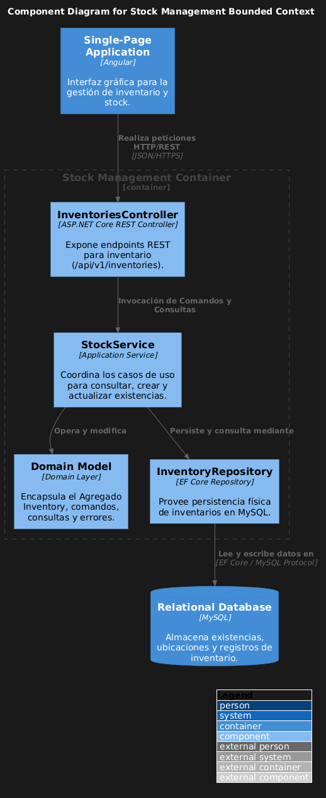

#### 2.6.4.6. Bounded Context Software Architecture Code Level Diagrams

##### 2.6.4.6.1. Bounded Context Domain Layer Class Diagrams

  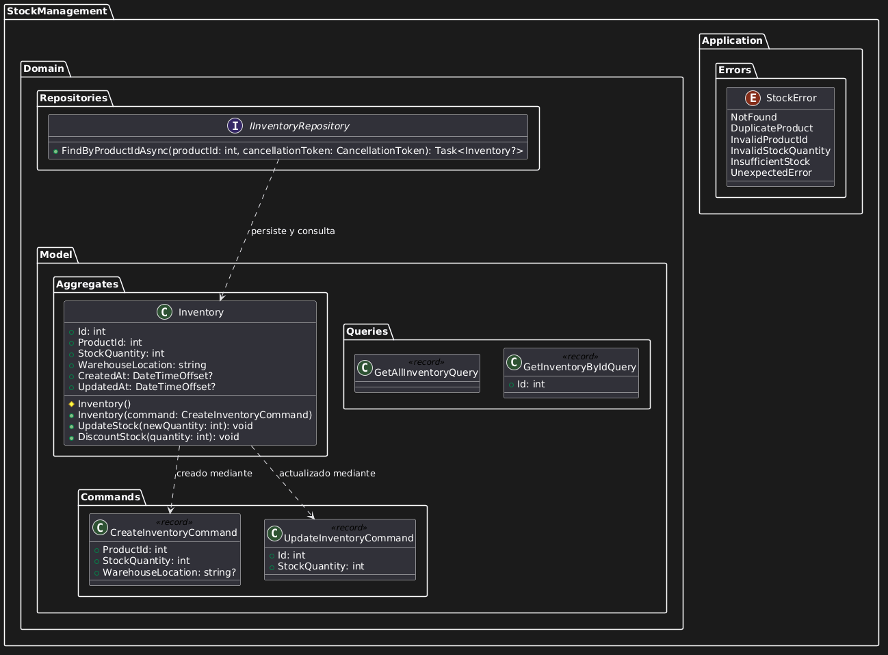

##### 2.6.4.6.2. Bounded Context Database Design Diagram

  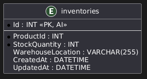

### 2.6.5. Bounded Context: Notification Management

#### 2.6.5.1. Domain Layer

| Archivo | Tipo de Componente | Responsabilidad Principal |
|:---|:---|:---|
| Notification.cs | Aggregate Root | Representa la entidad de notificación de un usuario y gestiona las reglas para marcarla como leída. |
| NotificationAudit.cs | Partial Class / Audit | Implementa IAuditableEntity para registrar marcas de tiempo de creación y actualización de notificaciones. |
| INotificationRepository.cs | Domain Repository Interface | Define el contrato de persistencia para consultar y almacenar notificaciones por perfil de usuario. |
| CreateNotificationCommand.cs | Command Record | DTO de comando para solicitar la creación y envío de una nueva notificación o alerta. |
| MarkAsReadCommand.cs | Command Record | DTO de comando para solicitar el cambio de estado de una notificación a leída. |
| GetNotificationByIdQuery.cs | Query Record | Estructura para consultar una notificación específica por su identificador único. |
| GetNotificationsByProfileQuery.cs | Query Record | Estructura para consultar el historial de notificaciones asociadas a un perfil. |

#### 2.6.5.2. Interface Layer

| Archivo | Tipo de Componente | Responsabilidad Principal |
|:---|:---|:---|
| NotificationsController.cs | REST Controller | Maneja las solicitudes HTTP relacionadas con notificaciones y alertas (creación, lectura e historial). |
| CreateNotificationResource.cs | DTO / Input Resource | Esquema de datos para la solicitud de creación y envío de una notificación. |
| MarkAsReadResource.cs | DTO / Input Resource | Esquema de datos para solicitar el cambio de estado a leída. |
| NotificationResource.cs | DTO / Output Resource | Esquema de respuesta con los datos detallados de la notificación. |
| CreateNotificationCommandFromResourceAssembler.cs | Assembler / Transformer | Mapea un CreateNotificationResource a CreateNotificationCommand. |
| NotificationResourceFromEntityAssembler.cs | Assembler / Transformer | Mapea la entidad de agregado Notification a un DTO NotificationResource. |

#### 2.6.5.3. Application Layer

| Archivo | Tipo de Componente | Responsabilidad Principal |
|:---|:---|:---|
| NotificationError.cs | Enum / Error | Enumera los tipos de errores asociados al procesamiento y envío de notificaciones. |
| INotificationService.cs | Service Interface | Contrato del servicio de aplicación que define la gestión de comandos y consultas para notificaciones. |
| NotificationService.cs | Application Service Implementation | Implementa la lógica de aplicación para crear, marcar como leídas y consultar notificaciones con control transaccional. |

#### 2.6.5.4. Infrastructure Layer

| Archivo | Tipo de Componente | Responsabilidad Principal |
|:---|:---|:---|
| ModelBuilderExtensions.cs | EF Core Configuration / Extension | Configura el mapeo ORM de la entidad Notification en la base de datos (claves, restricciones y longitud de columnas). |
| NotificationRepository.cs | Repository Implementation | Implementa la persistencia y consultas específicas de notificaciones por perfil y estado de lectura mediante EF Core. |

#### 2.6.5.5. Bounded Context Software Architecture Component Level Diagrams

  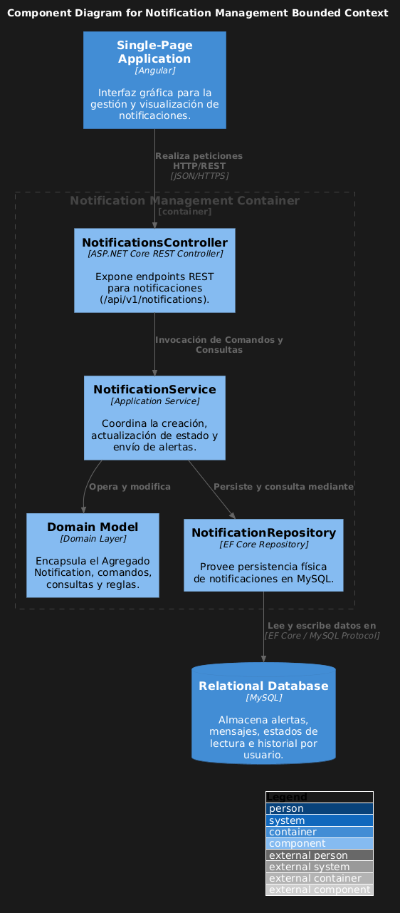

#### 2.6.5.6. Bounded Context Software Architecture Code Level Diagrams

##### 2.6.5.6.1. Bounded Context Domain Layer Class Diagrams

  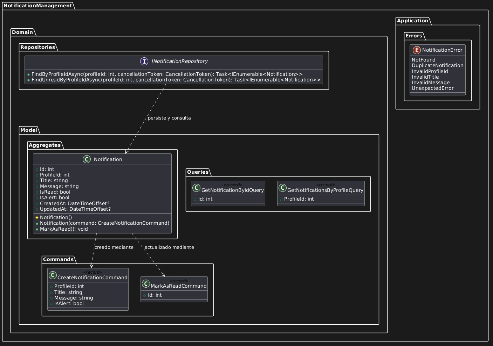

##### 2.6.5.6.2. Bounded Context Database Design Diagram

  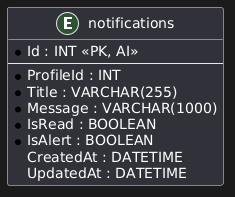

### 2.6.6. Bounded Context: Shared Bounded

#### 2.6.6.1. Domain Layer

| Archivo | Tipo de Componente | Responsabilidad Principal |
|:---|:---|:---|
| IAuditableEntity.cs | Entity Interface | Contrato para entidades que requieren seguimiento de marcas de tiempo de auditoría (creación y actualización). |
| IEvent.cs | Domain Event Interface | Interfaz base para marcar eventos de dominio e integrarlos con el bus de eventos del patrón mediador. |
| Error.cs | Value Record | Estructura para la representación unificada de errores de dominio con código y mensaje. |
| IBaseRepository.cs | Repository Interface | Interfaz genérica que define las operaciones CRUD fundamentales para todos los repositorios. |
| IUnitOfWork.cs | Repository Interface | Contrato para la confirmación atómica de cambios en la capa de persistencia. |

#### 2.6.6.2. Interface Layer

| Archivo | Tipo de Componente | Responsabilidad Principal |
|:---|:---|:---|
| ProblemDetailsFactory.cs | Interface Custom Factory | Construye respuestas uniformes de error estandarizadas (RFC 7807 Problem Details) con soporte de localización para la API REST. |

#### 2.6.6.3. Application Layer

| Archivo | Tipo de Componente | Responsabilidad Principal |
|:---|:---|:---|
| IEventHandler.cs | Application Event Handler Interface | Abstracción para el manejo y suscripción de eventos de dominio integrados con el patrón Mediador. |
| Result.cs | Application Model / Functional Result | Wrapper genérico y no genérico que encapsula el resultado de las operaciones en la capa de aplicación (éxito o fallo con errores fuertemente tipados). |

#### 2.6.6.4. Infrastructure Layer

| Archivo | Tipo de Componente | Responsabilidad Principal |
|:---|:---|:---|
| AppDbContext.cs | EF Core DbContext | Contexto principal de la base de datos que registra los modelos de todos los Bounded Contexts y aplica las convenciones de nombrado snake_case e interceptores. |
| AuditableEntityInterceptor.cs | EF Core Interceptor | Intercepta la persitencia en EF Core para auditar automáticamente las marcas de tiempo (CreatedAt y UpdatedAt) en entidades IAuditableEntity. |
| BaseRepository.cs | Base Repository Implementation | Implementación genérica de las operaciones de lectura, escritura y borrado sobre Entity Framework Core. |
| UnitOfWork.cs | Repository Implementation | Controla la confirmación de transacciones atómicas llamando al guardado centralizado de cambios en el AppDbContext. |
| LoggingCommandBehavior.cs | Mediator Pipeline Behavior | Intercepta la ejecución de comandos para registrar logs de auditoría antes y después de su procesamiento. |
| GlobalExceptionHandlerMiddleware.cs | ASP.NET Core Middleware | Middleware centralizado de gestión de excepciones no capturadas para transformarlas en respuestas normalizadas Problem Details. |
| MiddlewareExtensions.cs | Middleware Extension | Método de extensión de IApplicationBuilder para registrar de forma limpia el middleware de excepciones globales en el pipeline HTTP. |

# Capítulo III: Solution UI/UX Design

## 3.1. Product design

### 3.1.1. Style Guidelines

#### 3.1.1.1. General Style Guidelines

### 3.1.2. Information Architecture

#### 3.1.2.1. Organization Systems

#### 3.1.2.2. Labelling Systems

#### 3.1.2.3. SEO Tags and Meta Tags

#### 3.1.2.4. Searching Systems

#### 3.1.2.5. Navigation Systems

### 3.1.3. Landing Page UI Design

#### 3.1.3.1. Landing Page Wireframe

#### 3.1.3.2. Landing Page Mock-up

### 3.1.4. Mobile Applications UX/UI Design

El diseño de experiencia de usuario (UX) e interfaz de usuario (UI) para la aplicación móvil de **TerraTech** se enfoca en resolver las necesidades operativas de agricultores y compradores en campo. La solución se sustenta en tres principios clave:
1. **Resiliencia operativa (Offline-First):** Soporte de almacenamiento local en el dispositivo (SQLite/Room) para garantizar el acceso a los datos de telemetría y el registro de riego incluso sin conexión a internet.
2. **Diseño inclusivo y ergonomía táctil:** Elementos interactivos con áreas mínimas de contacto de 48 × 48 dp y alto contraste para facilitar la lectura bajo luz solar directa y el uso con guantes.
3. **Claridad informativa:** Jerarquía visual simple que prioriza métricas críticas de humedad de suelo y alertas inmediatas.

#### 3.1.4.1. Mobile Applications Wireframes

Los wireframes representan la estructura básica y esquemática de la aplicación móvil en baja fidelidad. Se prescinde deliberadamente de elementos cromáticos y fotográficos para evaluar la distribución espacial, los patrones de navegación y la jerarquía de los contenidos antes de la etapa visual final.

  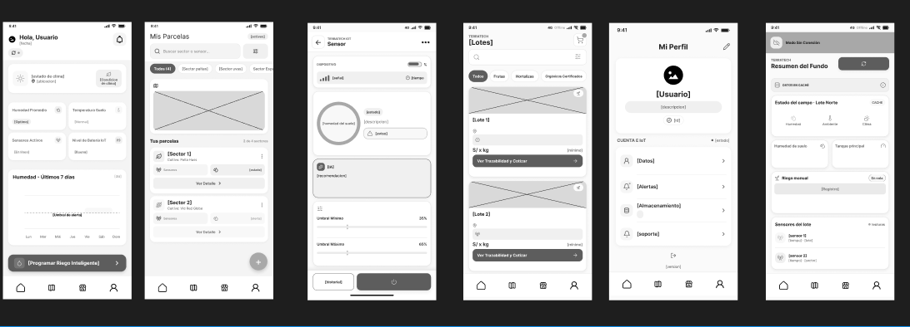

<em>Figura 3.9. Wireframes de la aplicación móvil de TerraTech.</em>

La propuesta estructural abarca las pantallas clave del flujo móvil:
- **Inicio (Dashboard):** Resumen del clima, indicadores generales de salud del suelo, estado de sensores y acceso directo a la acción de riego.
- **Mis Parcelas:** Lista y visualización de sectores de cultivo con filtros rápidos y estado de cada lote.
- **Detalle de Sensor IoT:** Vista técnica de telemetría en tiempo real, nivel de batería del nodo y recomendación agronómica de riego.
- **Mercado / Catálogo:** Catálogo de lotes agrícolas cosechados para compradores mayoristas con certificación de calidad por sensores.
- **Modo Sin Conexión:** Pantalla informativa de contingencia que notifica el uso de datos locales y permite reintentar la sincronización.
- **Mi Perfil:** Información del productor agrícola, configuración de alertas y opciones de cuenta.

#### 3.1.4.2. Mobile Applications Wireflow Diagrams

El diagrama de Wireflow ilustra el flujo de navegación secuencial y los cambios de estado de la interfaz a partir de las acciones e interacciones del usuario en las pantallas de baja fidelidad.

  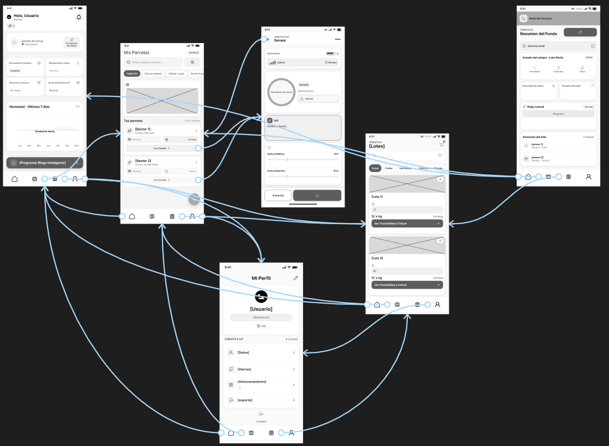

<em>Figura 3.10. Diagrama de Wireflow de la aplicación móvil de TerraTech.</em>

A continuación se resumen los pasos principales del flujo operativo del agricultor:

| Paso (*Step*) | Pantalla Origen | Acción del Usuario (*User Event*) | Pantalla Destino | Cambio de Estado / Resultado |
| :---: | :--- | :--- | :--- | :--- |
| **P1** | Inicio (Dashboard) | Tap en tarjeta de sector *"Sector Palto A-1"* | Mis Parcelas | Filtra y enfoca la parcela seleccionada. |
| **P2** | Mis Parcelas | Tap en *"Ver Detalle"* del Sensor S-04 | Detalle de Sensor | Carga telemetría actual y recomendación de riego. |
| **P3** | Detalle de Sensor | Tap en botón *"Activar Riego"* | Confirmación | Abre diálogo para confirmar el tiempo de riego. |
| **P4** | Detalle de Sensor | Tap en botón de retorno `←` | Mis Parcelas | Vuelve a la lista preservando filtros. |
| **P5** | Menú inferior | Tap en pestaña *"Mercado"* | Catálogo de Cosechas | Cambia al catálogo comercial de lotes agrícolas. |
| **P6** | Cualquier pantalla | Pérdida de cobertura de red | Modo Sin Conexión | Conmuta automáticamente al almacenamiento local (SQLite). |

#### 3.1.4.3. Mobile Applications Mock-ups

Los mock-ups en alta fidelidad representan la interfaz gráfica definitiva de la aplicación móvil de TerraTech, aplicando integralmente el Design System del producto: paleta cromática verde bosque (`#2E7D32`) y ámbar (`#F59E0B`), componentes basados en Material 3 e iOS, y tipografía optimizada para lectura en exteriores.

  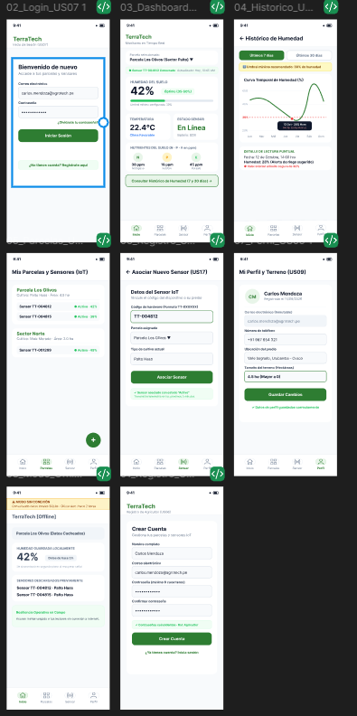

<em>Figura 3.11. Mock-ups en alta fidelidad de la aplicación móvil de TerraTech.</em>

Detalle visual de las pantallas principales:
- **Dashboard (Inicio):** Saludo personalizado a Don Carlos, tarjeta de clima local, tarjetas 2×2 con telemetría en tiempo real (humedad, temperatura, estado de sensores), gráfico interactivo a 7 días y botón destacado para programar riego.
- **Mis Parcelas:** Lista de sectores con pines satelitales codificados por color (verde: óptimo, ámbar: atención), chips de filtro rápido y datos de área cultivada.
- **Detalle de Sensor IoT:** Medidor radial de humedad del suelo, estado de batería y conectividad LoRaWAN, y recomendación agronómica generada por el motor de reglas.
- **Mercado Agrícola:** Catálogo de cosechas para compradores mayoristas con fotos reales, precios por volumen y certificación de calidad respaldada por datos de sensores.
- **Modo Sin Conexión:** Banner de advertencia con estado del almacenamiento local SQLite y botón para reintentar la sincronización.
- **Mi Perfil:** Identidad del productor, credenciales de predio agrícola, configuración de alertas de riego y opciones de cuenta.

#### 3.1.4.4. Mobile Applications User Flow Diagrams

El diagrama de User Flow detalla el recorrido interactivo que experimenta el usuario en las pantallas de alta fidelidad, documentando formalmente la ruta óptima esperada (*Happy Path*) y los escenarios de excepción o contingencia en campo (*Unhappy Paths*).

  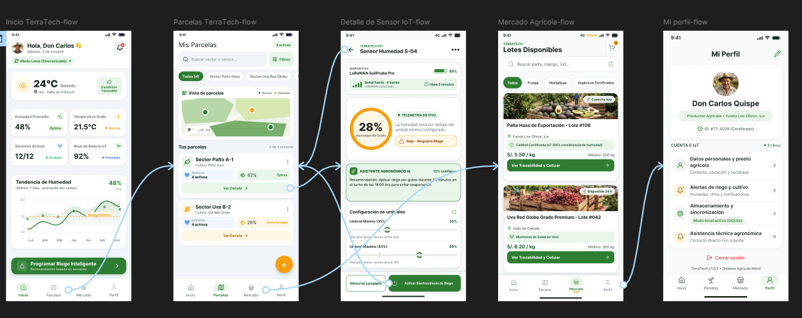

<em>Figura 3.12. Diagrama de User Flow de la aplicación móvil de TerraTech.</em>

Rutas documentadas en el flujo:

-  **Happy Path (Monitoreo y Activación de Riego):**
  1. Don Carlos abre la aplicación y visualiza el Dashboard con telemetría en tiempo real.
  2. Identifica que el *Sector Palto A-1* registra una humedad baja del 28%.
  3. Ingresa al detalle del sensor y consulta la recomendación de riego por goteo de 40 minutos.
  4. Presiona *"Activar Electroválvula"* y confirma el turno de riego.
  5. El sistema emite la confirmación y actualiza el estado a *"Riego en Curso"*.

-  **Unhappy Path 1 (Pérdida de Cobertura en Campo Rural):**
  1. El dispositivo pierde señal celular durante el recorrido en el predio.
  2. La aplicación conmuta inmediatamente al almacenamiento local en el dispositivo (SQLite).
  3. Se despliega el banner de *Modo Sin Conexión* con la última hora de sincronización.
  4. Las acciones y notas registradas se guardan localmente y se autosincronizan al recuperar conectividad.

-  **Unhappy Path 2 (Falla o Desconexión de Sensor IoT):**
  1. Un sensor físico no emite lecturas por más de 4 horas continuas.
  2. El sistema dispara una alerta crítica con badge rojo en la tarjeta del sector.
  3. Al ingresar, se ofrece una guía paso a paso para verificar la batería y la antena del nodo en campo.

El diagrama de User Flow detalla el recorrido interactivo que experimenta el usuario en las pantallas de alta fidelidad, documentando formalmente la ruta óptima esperada (*Happy Path*) y los escenarios de excepción o contingencia en campo (*Unhappy Paths*).

  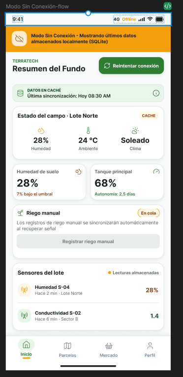

<em>Figura 3.12. Unhappy Path .</em>

#### 3.1.4.5. Mobile Applications Prototyping

Para validar la fluidez de interacción y navegación de la aplicación móvil de TerraTech antes de la fase de implementación de software, se construyó un prototipo navegable e interactivo en Figma.

  

<em>Figura 3.13. Conexiones y flujos de navegación interactiva del prototipo móvil en Figma.</em>

Criterios de interacción adoptados:
- **Transiciones fluidas (Smart Animate):** La navegación jerárquica utiliza animaciones de deslizamiento horizontal (*Slide in from right*) con duración de 300 ms y aceleración *Ease-Out*, emulando el comportamiento nativo de Android e iOS.
- **Retroalimentación táctil:** Los botones incorporan estados visuales (*Pressed*) y elevación para confirmar la recepción del toque.
- **Diálogos modales (Bottom Sheets):** La confirmación de riego se despliega como una hoja deslizable inferior para no perder el contexto de la pantalla.
- **Navegación persistente:** La barra de navegación inferior (Bottom Nav) permite conmutar de manera directa entre Inicio, Parcelas, Mercado y Perfil.

##### Enlace al Prototipo Interactivo en Figma:
El prototipo funcional de la aplicación móvil se encuentra disponible para su exploración pública en el siguiente enlace:

> **🔗 Enlace del Prototipo Interactivo en Figma:**  
> [https://www.figma.com/proto/TerraTech-Mobile-App-Prototype](https://www.figma.com/proto/vcdNW0lT5QEWPf92aJNmMC/Terra-tech-app?node-id=62-2025&p=f&t=XWfBJgH2aLW5Nsv7-1&scaling=min-zoom&content-scaling=fixed&page-id=0%3A1)  
> *(Acceso público configurado en Figma con permisos de visualización).*

---

# Capitulo 4: Product Implementation & Validation

## 4. Product Implementation & Validation

### 4.1. Software Configuration Management

#### 4.1.1. Software Development Environment Configuration

#### 4.1.2. Source Code Management

#### 4.1.3. Source Code Style Guide & Conventions 

### 4.2. Landing Page & Mobile Application Implementation

#### 4.2.1. Sprint 1

#### 4.2.1.1. Sprint Planning 1

Los objetivos dentro del sprint 1 fueron los siguientes:

- Diseñar, implementar y desplegar el core de la Web API REST del BackEnd para
  TerraTech utilizando C#, .NET y Domain-Driven Design (DDD), garantizando los servicios
  de autenticación de usuarios, gestión de terrenos/parcelas y la recepción de telemetría
  de sensores.

#### 4.2.1.2. Aspect Leaders and Collaborators

<table>
  <thead>
    <tr>
      <th>Rol / Responsabilidad</th>
      <th>Líder e Integrantes</th>
      <th>Entregables Principales</th>
    </tr>
  </thead>
  <tbody>
    <tr>
      <td><b>BackEnd & Software Architecture Lead</b></td>
      <td>Jorge Retuerto</td>
      <td>Arquitectura en capas (DDD/Clean Architecture), diseño de Entidades, Servicios de Dominio y controladores REST en Spring Boot.</td>
    </tr>
    <tr>
      <td><b>Database & Persistence Lead</b></td>
      <td>Rúbens Bendezú</td>
      <td>Mapeo de entidades JPA/Hibernate, scripts de migración PostgreSQL y repositorios Spring Data JPA.</td>
    </tr>
    <tr>
      <td><b>Security & Authentication Lead</b></td>
      <td>Bryan Barba / James Delgado</td>
      <td>Implementación de Spring Security, filtros JWT (JSON Web Token) y cifrado de contraseñas con BCrypt.</td>
    </tr>
    <tr>
      <td><b>BackEnd QA & Testing Lead</b></td>
      <td>Angel Pariona</td>
      <td>Pruebas unitarias de servicios de dominio con JUnit 5/Mockito y pruebas de integración de API REST con <code>MockMvc</code>.</td>
    </tr>
  </tbody>
</table>

#### 4.2.1.3. Sprint Backlog 1

- BackEnd

A continuación se presenta el Backlog que combina 
las Historias de Usuario desarrolladas y el resumen de las tareas 
técnicas completadas:

<table>
  <thead>
    <tr>
      <th>User Story ID</th>
      <th>Descripción</th>
      <th>Estimación (Puntos de Historia)</th>
      <th>Estado</th>
    </tr>
  </thead>
  <tbody>
    <tr>
      <td><b>US-01</b></td>
      <td>Como usuario, quiero autenticarme en el sistema para obtener un token de acceso seguro.</td>
      <td>5</td>
      <td>Completado</td>
    </tr>
    <tr>
      <td><b>US-02</b></td>
      <td>Como agricultor, quiero registrar y listar mis parcelas/terrenos a través de la API REST.</td>
      <td>5</td>
      <td>Completado</td>
    </tr>
    <tr>
      <td><b>US-03</b></td>
      <td>Como sistema IoT, quiero enviar lecturas de sensores (humedad, temperatura) a la API REST para su almacenamiento.</td>
      <td>8</td>
      <td>Completado</td>
    </tr>
  </tbody>
</table>

Resumen de Tareas Técnicas Completadas:

<table>
  <thead>
    <tr>
      <th>Descripción</th>
      <th>Estado</th>
    </tr>
  </thead>
  <tbody>
    <tr>
      <td>Refactorizar e integrar los componentes BackEnd del proyecto heredado (<i>Desarrollo de Aplicaciones Web</i>) a la nueva estructura de DDD.</td>
      <td>Completado</td>
    </tr>
    <tr>
      <td>Configurar OpenAPI / Swagger UI para la documentación interactiva de endpoints.</td>
      <td>Completado</td>
    </tr>
  </tbody>
</table>

#### 4.2.1.4. Development Evidence for Sprint Review

- Back End

* **Estructura del Proyecto:** Organización del código bajo patrones de Domain-Driven Design (DDD):
    * `domain/`: Entidades de negocio, Value Objects y Domain Services.
    * `infrastructure/`: Implementaciones JPA, Spring Data Repositories y filtros de seguridad.
    * `interfaces/rest/`: Controladores REST (`@RestController`), DTOs (Requests/Responses) y Assemblers.
* **Evolución del BackEnd Heredado:** Refactorización del código previo de *Desarrollo de Aplicaciones Web* para 
cumplir con los estándares de arquitectura modular, separando el modelo de persistencia.
* **Capturas de Ejecución:** Evidencia del servidor iniciando correctamente en el entorno de desarrollo 
y respondiendo peticiones HTTP en el puerto designado.

#### 4.2.1.5. Testing Suite Evidence for Sprint Review

#### 4.2.1.6. Execution Evidence for Sprint Review

#### 4.2.1.7. Services Documentation Evidence for Sprint Review

#### 4.2.1.8. Software Deployment Evidence for Sprint Review

* **Servicio Web BackEnd:** Compilación del artefacto ejecutable (`.dll` / binarios autofrenados) vía .NET CLI (`dotnet publish`) y despliegue continuo en la plataforma PaaS (ej. Render / Railway / Azure App Service / AWS) expuesto bajo protocolo HTTPS.

Back End URL: [Swagger BackEnd](https://backend-terratech.onrender.com/swagger/index.html)

* **Base de Datos:** Instancia desplegada de MySQL en la nube (ej. PlanetScale / AWS RDS / Aiven), con tablas generadas y gestionadas mediante migraciones de Entity Framework Core (EF Core Migrations) o ejecuciones DDL de inicialización.

#### 4.2.1.9. Team Collaboration Insights during Sprint

### 4.3. Validation Interviews

#### 4.3.1. Diseño de Entrevistas

#### 4.3.2. Registro de Entrevistas

#### 4.3.3. Evaluaciones según heurísticas

# Conclusiones

[Volver al contenido principal](#contenido)

## Conclusiones y recomendaciones

- TerraTech aborda la problemática de la agricultura familiar y de
  subsistencia en el Perú mediante una solución que integra sensores IoT
  de bajo costo y una aplicación móvil nativa. Su objetivo principal es
  transformar datos complejos de humedad, temperatura y nutrientes del
  suelo en recomendaciones comprensibles, alertas y visualizaciones
  intuitivas para la toma de decisiones oportunas de riego y
  fertilización.

- El proyecto aplicó la metodología Lean UX formulando hipótesis
  verificables centradas en la reducción de uso innecesario de agua,
  ahorro en costos de fertilizantes y un incremento potencial de la
  rentabilidad del agricultor. Estas hipótesis se sustentaron con un
  proceso de Needfinding riguroso que incluyó 7 entrevistas
  semiestructuradas, elaboración de User Personas, User Task Matrix,
  User Journey Maps y Empathy Maps.

- Para asegurar la escalabilidad del proyecto, el equipo empleó
  Domain-Driven Design (DDD) a nivel estratégico, identificando 5
  Bounded Contexts a través de EventStorming y Domain Storytelling. La
  arquitectura de la solución se estructuró mediante el modelo C4
  (Contexto, Contenedores y Despliegue) contemplando arquitecturas
  limpias y desacopladas alineadas al dominio agrícola.

# Bibliografía

[Volver al contenido principal](#contenido)

Las referencias se presentan en formato APA 7 y se organizan según su
relación con el proyecto.

## Dominio de negocio

Instituto Nacional de Estadística e Informática. (2024, octubre).
*Productores agropecuarios: Principales resultados de la Encuesta
Nacional Agropecuaria (ENA), 2018, 2019, 2022 y 2023*.
https://proyectos.inei.gob.pe/iinei/srienaho/Descarga/DocumentosMetodologicos/2023-62/05_PUBLICACION_ENA_2023.pdf

Instituto Nacional de Estadística e Informática. (2026, marzo).
*Estadísticas de las tecnologías de información y comunicación en los
hogares: IV trimestre 2025* (Informe técnico N.º 01).
https://www.inei.gob.pe/media/MenuRecursivo/boletines/boletin-tic-oct_dic2025.pdf

Ministerio de la Producción. (2021). *Hoja de ruta para la modernización
de los mercados de abastos*.
https://pndp.produce.gob.pe/wp-content/uploads/2025/03/HOJA-DE-RUTA-D.S.-N%C2%BA-021-2021-PRODUCE.pdf

Organización de las Naciones Unidas para la Alimentación y la
Agricultura. (2026, 29 de enero). *Perú promueve el diálogo sobre cómo
producimos los alimentos, qué comemos y su relación con el cambio
climático*.
https://www.fao.org/peru/noticias/detail/per%C3%BA-promueve-el-di%C3%A1logo-sobre-c%C3%B3mo-producimos-los-alimentos–qu%C3%A9-comemos-y-su-relaci%C3%B3n-con-el-cambio-clim%C3%A1tico/es

## Métodos y técnicas de ingeniería de software

Gothelf, J. (2016, 15 de diciembre). *The Lean UX canvas*.
https://jeffgothelf.com/blog/leanuxcanvas/

# Anexos

[Volver al contenido principal](#contenido)
Link del Figma: https://www.figma.com/design/vcdNW0lT5QEWPf92aJNmMC/Terra-tech-app?node-id=0-1&t=XDJHLiBI10PJ61IV-1
